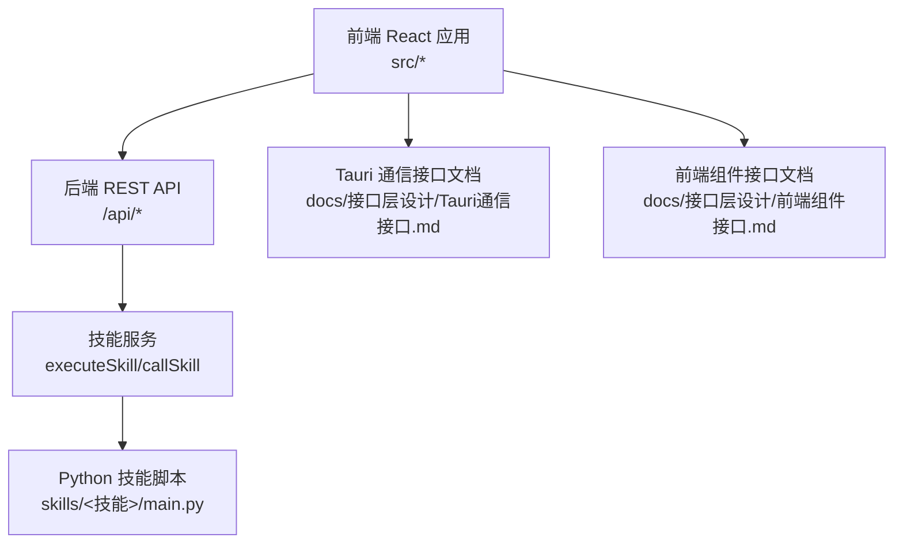
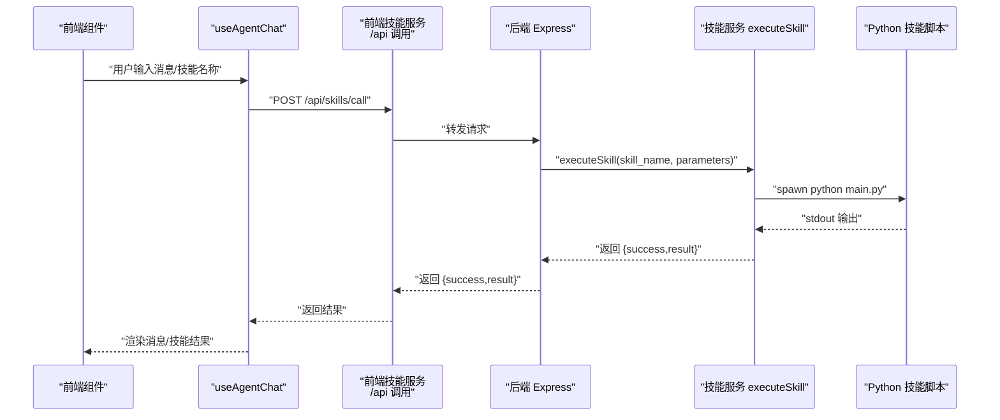
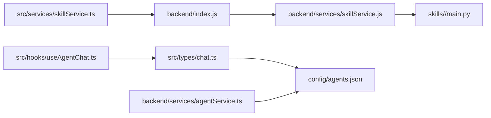

# API参考

<cite>
**本文引用的文件**
- [backend/index.js](file://backend/index.js)
- [backend/services/skillService.js](file://backend/services/skillService.js)
- [backend/services/agentService.ts](file://backend/services/agentService.ts)
- [src/services/skillService.ts](file://src/services/skillService.ts)
- [src/hooks/useAgentChat.ts](file://src/hooks/useAgentChat.ts)
- [src/types/chat.ts](file://src/types/chat.ts)
- [config/agents.json](file://config/agents.json)
- [skills/todo-query/main.py](file://skills/todo-query/main.py)
- [skills/todo-query/SKILL.md](file://skills/todo-query/SKILL.md)
- [docs/接口层设计/Tauri通信接口.md](file://docs/接口层设计/Tauri通信接口.md)
- [docs/接口层设计/前端组件接口.md](file://docs/接口层设计/前端组件接口.md)
- [package.json](file://package.json)
</cite>

## 目录
1. [简介](#简介)
2. [项目结构](#项目结构)
3. [核心组件](#核心组件)
4. [架构总览](#架构总览)
5. [详细组件分析](#详细组件分析)
6. [依赖关系分析](#依赖关系分析)
7. [性能考虑](#性能考虑)
8. [故障排查指南](#故障排查指南)
9. [结论](#结论)
10. [附录](#附录)

## 简介
本文件为 AutoMate 后端与前端的完整 API 参考，覆盖：
- 后端 REST API 端点与请求/响应格式
- Tauri IPC 通信接口（invoke 与事件系统）
- 前端组件接口与 Hooks 类型
- 技能调用 API 的工作流与参数规范
- 认证机制、权限控制与安全策略
- API 版本管理、向后兼容性与迁移指南
- 请求示例、响应示例与 SDK 使用说明
- 限流、错误处理与监控指标
- 测试方法、调试技巧与性能优化建议

## 项目结构
AutoMate 采用前后端分离架构：
- 前端基于 React/Vite，通过 axios 调用后端 /api 路由
- 后端基于 Node.js Express，提供技能调用与健康检查等接口
- Tauri 文档定义了 invoke 与事件系统，用于与桌面端原生能力集成
- 技能以 Python 脚本形式组织，后端通过子进程调用

图表来源
- [backend/index.js](file://backend/index.js#L1-L117)
- [backend/services/skillService.js](file://backend/services/skillService.js#L1-L87)
- [src/services/skillService.ts](file://src/services/skillService.ts#L1-L73)
- [docs/接口层设计/Tauri通信接口.md](file://docs/接口层设计/Tauri通信接口.md#L1-L1013)
- [docs/接口层设计/前端组件接口.md](file://docs/接口层设计/前端组件接口.md#L1-L855)

章节来源
- [backend/index.js](file://backend/index.js#L1-L117)
- [package.json](file://package.json#L1-L47)

## 核心组件
- 后端 REST API
  - 技能调用：POST /api/skills/call
  - 健康检查：GET /api/skills
- 技能服务（后端）
  - executeSkill：执行指定技能脚本
  - callSkill：封装技能调用并返回统一结构
- 前端技能服务
  - callSkill：调用 /api/skills/call 并处理错误
  - executeSkill：便捷执行技能并返回字符串结果
- 聊天与技能描述加载
  - useAgentChat：封装发送消息与流式输出
  - chatWithAgent/streamChatWithAgent：与第三方模型网关通信
  - loadAllSkillsDescriptions：加载各技能描述
- 智能体配置
  - config/agents.json：智能体与技能清单
  - agentService.ts：加载智能体配置与技能描述

章节来源
- [backend/index.js](file://backend/index.js#L81-L111)
- [backend/services/skillService.js](file://backend/services/skillService.js#L16-L86)
- [src/services/skillService.ts](file://src/services/skillService.ts#L12-L72)
- [src/hooks/useAgentChat.ts](file://src/hooks/useAgentChat.ts#L18-L127)
- [src/types/chat.ts](file://src/types/chat.ts#L96-L280)
- [config/agents.json](file://config/agents.json#L1-L119)
- [backend/services/agentService.ts](file://backend/services/agentService.ts#L58-L96)

## 架构总览
下图展示了从前端到后端、再到 Python 技能脚本的调用链路。

图表来源
- [src/hooks/useAgentChat.ts](file://src/hooks/useAgentChat.ts#L51-L82)
- [src/services/skillService.ts](file://src/services/skillService.ts#L20-L33)
- [backend/index.js](file://backend/index.js#L81-L104)
- [backend/services/skillService.js](file://backend/services/skillService.js#L16-L71)

## 详细组件分析

### 后端 REST API

- 健康检查
  - 方法：GET
  - 路径：/api/skills
  - 请求体：无
  - 响应：包含状态与消息的对象
  - 示例响应：{"status":"ok","message":"Skill API 服务运行中"}

- 技能调用
  - 方法：POST
  - 路径：/api/skills/call
  - 请求头：Content-Type: application/json
  - 请求体字段：
    - skill_name: 字符串，必填
    - parameters: 对象，可选；内部可包含 messageId、agentId 等附加字段
  - 响应字段：
    - success: 布尔值
    - result: 字符串（成功时），或“技能执行完成（无输出）”
    - error: 字符串（失败时）
  - 错误码：
    - 400：缺少 skill_name
    - 500：后端异常或技能执行失败

章节来源
- [backend/index.js](file://backend/index.js#L81-L111)

### 技能服务（后端）

- executeSkill
  - 功能：定位技能脚本路径，spawn 子进程执行 Python 脚本，收集 stdout/stderr，返回统一结构
  - 输入：skillName, parameters
  - 输出：SkillResult（success/result/error）
  - 行为：若 stdout 为空但退出码为 0，返回“技能执行完成（无输出）”

- callSkill
  - 功能：封装 executeSkill，捕获异常并统一返回结构
  - 输入：skillName, parameters
  - 输出：SkillResult

章节来源
- [backend/services/skillService.js](file://backend/services/skillService.js#L16-L86)

### 前端技能服务

- callSkill
  - 功能：调用 /api/skills/call，统一错误处理（超时、网络错误、后端错误）
  - 输入：skillName, parameters, messageId?, agentId?
  - 输出：SkillResult
  - 超时：30 秒
  - 错误映射：ECONNABORTED -> “请求超时”，ERR_NETWORK -> “网络错误，请确保后端服务正在运行 (npm run backend)”

- executeSkill
  - 功能：便捷执行技能，将参数包装为 {input: userInput}，成功返回字符串，失败抛错

章节来源
- [src/services/skillService.ts](file://src/services/skillService.ts#L12-L72)

### 聊天与技能描述加载

- useAgentChat
  - 功能：加载智能体配置与技能描述，封装 sendMessage 与 streamMessage
  - sendMessage：同步模式，返回 ChatResponse
  - streamMessage：流式模式，回调 onChunk/onDone/onError

- chatWithAgent/streamChatWithAgent
  - 功能：构建系统提示（含技能描述），调用第三方模型网关
  - 支持直连与代理路径（/api/proxy/chat/completions）
  - 错误处理：网络错误、API 错误、超时

- loadAllSkillsDescriptions
  - 功能：从 /skills/<name>/SKILL.md 中提取“何时使用”段落作为技能描述

章节来源
- [src/hooks/useAgentChat.ts](file://src/hooks/useAgentChat.ts#L18-L127)
- [src/types/chat.ts](file://src/types/chat.ts#L96-L280)

### 智能体与技能配置

- config/agents.json
  - 结构：包含多个分组，每组包含若干智能体
  - 智能体字段：id、name、description、avatar、type、config(url、api_key、model)、skills[]
  - 技能字段：name、description、type、storage_path、version

- agentService.ts
  - 加载配置：loadAgentsConfig
  - 查找智能体：findAgent/getAgent/getAgentList
  - 构建系统提示：buildSystemPrompt（从 SKILL.md 加载技能描述）
  - 调用技能：callSkill（通过模型网关执行技能）

章节来源
- [config/agents.json](file://config/agents.json#L1-L119)
- [backend/services/agentService.ts](file://backend/services/agentService.ts#L58-L96)
- [backend/services/agentService.ts](file://backend/services/agentService.ts#L200-L244)

### Tauri 通信接口（IPC）

- invoke API
  - 前端调用：invoke('function_name', payload)
  - 后端实现：通过 Node.js 子进程或 Rust 插件桥接（文档示例）
  - 典型接口：
    - get_agents(group_name?, online_status?)
    - get_agent(agent_id)
    - update_agent_status(agent_id, online_status, response_time, status_message)
    - send_message(content, agent_id, message_type)
    - get_messages(agent_id, page, page_size)
    - update_message_status(message_id, status)
    - call_skill(skill_name, parameters, message_id, agent_id)
    - upload_file(file_path, message_id)

- 事件系统
  - 前端监听：listen('event-name', handler)
  - 典型事件：
    - agent-status-changed
    - agent-config-updated
    - new-message
    - message-status-changed
    - skill-call-started
    - skill-call-completed
    - skill-call-failed

章节来源
- [docs/接口层设计/Tauri通信接口.md](file://docs/接口层设计/Tauri通信接口.md#L25-L730)

### 前端组件接口

- 智能体模块
  - AgentList：agents, groups, selectedAgentId, onAgentSelect, onGroupToggle, searchTerm, loading?
  - AgentItem：agent, selected, onSelect, onHover?
  - SearchInput：value, onChange, onClear?, placeholder?, loading?

- 聊天交互模块
  - ChatWindow：agent, messages, loading?, onSendMessage, onFileUpload?, onMessageCopy?, onMessageDelete?
  - MessageBubble：message, isOwn, onCopy?, onDelete?, onReply?
  - MessageInput：value, onChange, onSend, onFileUpload?, disabled?, loading?, placeholder?, maxLength?
  - FileUpload：onUpload, acceptedTypes?, maxSize?, multiple?, loading?

- 主题与启动页
  - ThemeProvider/ThemeToggle
  - WelcomePage/StatCard

- 通用组件与 Hooks
  - Button/Input/Modal/LoadingSpinner/Toast
  - useAgentList/useChatMessages/useTheme
  - AgentContext/ChatContext/ThemeContext

章节来源
- [docs/接口层设计/前端组件接口.md](file://docs/接口层设计/前端组件接口.md#L22-L855)

## 依赖关系分析

图表来源
- [src/services/skillService.ts](file://src/services/skillService.ts#L1-L73)
- [backend/index.js](file://backend/index.js#L1-L117)
- [backend/services/skillService.js](file://backend/services/skillService.js#L1-L87)
- [skills/todo-query/main.py](file://skills/todo-query/main.py#L1-L34)
- [src/hooks/useAgentChat.ts](file://src/hooks/useAgentChat.ts#L1-L128)
- [src/types/chat.ts](file://src/types/chat.ts#L1-L280)
- [config/agents.json](file://config/agents.json#L1-L119)
- [backend/services/agentService.ts](file://backend/services/agentService.ts#L1-L245)

章节来源
- [package.json](file://package.json#L1-L47)

## 性能考虑
- 技能执行
  - 子进程 I/O：stdout/stderr 收集与拼接，注意大输出的内存占用
  - 超时控制：前端与后端均设置 30 秒超时，避免阻塞
- 聊天流式输出
  - 使用 ReadableStream 逐块解析，减少一次性内存压力
  - 建议：对长文本分片处理，及时释放缓冲区
- 模型网关
  - 直连与代理路径切换，避免跨域与证书问题
  - 建议：缓存技能描述，减少重复读取
- 并发与限流
  - 建议：前端对 /api/skills/call 增加队列与去重，防止并发过高
  - 后端：可引入速率限制中间件（如基于 IP 的滑动窗口）

## 故障排查指南
- 技能调用失败
  - 检查 skill_name 是否存在且对应 skills/<name>/main.py 存在
  - 查看后端日志中的 stdout/stderr 输出
  - 确认 Python 环境与依赖可用
- 网络错误
  - 前端报“网络错误，请确保后端服务正在运行 (npm run backend)”
  - 确认后端服务已启动（端口 3001），CORS 已启用
- 超时
  - 前端与后端均设置 30 秒超时，适当延长或优化技能执行时间
- Tauri invoke 失败
  - 检查后端是否正确注册对应函数（Node.js 子进程或 Rust 插件）
  - 确认事件名一致，前端监听与后端发送匹配

章节来源
- [src/services/skillService.ts](file://src/services/skillService.ts#L34-L60)
- [backend/index.js](file://backend/index.js#L81-L104)
- [docs/接口层设计/Tauri通信接口.md](file://docs/接口层设计/Tauri通信接口.md#L732-L796)

## 结论
本文档提供了 AutoMate 的后端 REST API、Tauri IPC 与前端组件接口的权威参考。通过统一的技能调用流程与清晰的错误处理策略，系统实现了灵活的技能扩展与稳定的用户体验。建议在生产环境中结合速率限制、缓存与可观测性工具进一步完善。

## 附录

### API 版本管理、兼容性与迁移
- 技能版本
  - 在 config/agents.json 中为每个技能声明 version 字段，便于追踪与回滚
- 向后兼容
  - 保持 /api/skills/call 的请求/响应字段稳定；新增字段建议可选
  - Python 技能脚本参数解析使用 JSON 解析，避免硬编码键名
- 迁移指南
  - 新增技能：在 skills/<name>/ 添加 main.py 与 SKILL.md，并在 agents.json 中注册
  - 修改模型网关：调整 config/agents.json 中的 url/api_key/model

章节来源
- [config/agents.json](file://config/agents.json#L17-L38)
- [skills/todo-query/SKILL.md](file://skills/todo-query/SKILL.md#L1-L24)

### 认证机制、权限控制与安全策略
- 认证机制
  - 模型网关：通过 Authorization: Bearer <api_key> 传递密钥
  - 健康检查：无需认证
- 权限控制
  - 建议：在后端增加基于用户/会话的鉴权中间件
  - 技能访问：仅允许已注册技能调用，避免任意脚本执行
- 安全策略
  - 输入校验：对 skill_name 与 parameters 进行白名单与长度限制
  - 路径安全：限制技能脚本路径仅在 skills 目录内
  - 日志脱敏：避免在日志中打印敏感信息（如 api_key）

章节来源
- [src/types/chat.ts](file://src/types/chat.ts#L211-L259)
- [backend/services/agentService.ts](file://backend/services/agentService.ts#L135-L184)

### 请求与响应示例

- 健康检查
  - 请求：GET /api/skills
  - 响应：{"status":"ok","message":"Skill API 服务运行中"}

- 技能调用
  - 请求：POST /api/skills/call
    - {"skill_name":"todo-query","parameters":{"content":"查询待办数量"}}
  - 成功响应：{"success":true,"result":"您有3条待办事项"}
  - 失败响应：{"success":false,"error":"技能执行失败，退出码: 1"}

- 聊天消息
  - 请求：POST /api/proxy/chat/completions 或直连模型网关
    - {"model":"Qwen3-235B-A22B-Instruct","messages":[{"role":"system","content":"..."}],"temperature":0.7,"max_tokens":2000,"stream":true}
  - 成功响应：SSE 流式输出，最后一条为 [DONE]

章节来源
- [backend/index.js](file://backend/index.js#L81-L111)
- [src/services/skillService.ts](file://src/services/skillService.ts#L20-L33)
- [src/types/chat.ts](file://src/types/chat.ts#L116-L189)

### SDK 使用说明（前端）
- 安装依赖：axios
- 调用技能
  - callSkill(skillName, parameters, messageId?, agentId?) 返回 SkillResult
  - executeSkill(skillName, userInput) 返回字符串结果
- 错误处理
  - 捕获 axios 错误，区分超时与网络错误
  - 将 error 字段展示给用户或记录日志

章节来源
- [src/services/skillService.ts](file://src/services/skillService.ts#L1-L73)

### 监控指标与日志
- 指标建议
  - 技能调用次数、成功率、平均耗时、失败原因分布
  - 聊天请求延迟、流式输出吞吐量
- 日志建议
  - 请求/响应摘要（不含敏感信息）
  - 错误堆栈与上下文参数快照
  - Tauri 事件发送/接收统计

### 测试方法与调试技巧
- 单元测试
  - 技能服务：模拟 Python 子进程输出，验证 success/result/error 分支
  - 前端服务：mock axios，覆盖超时、网络错误分支
- 集成测试
  - 启动后端与前端，调用 /api/skills/call 与 /api/skills
  - 验证 Tauri invoke 事件流
- 调试技巧
  - 后端：开启详细日志，观察 stdout/stderr
  - 前端：打开浏览器 Network 面板，查看 /api 请求与 SSE 流
  - Tauri：确认事件名与 payload 一致