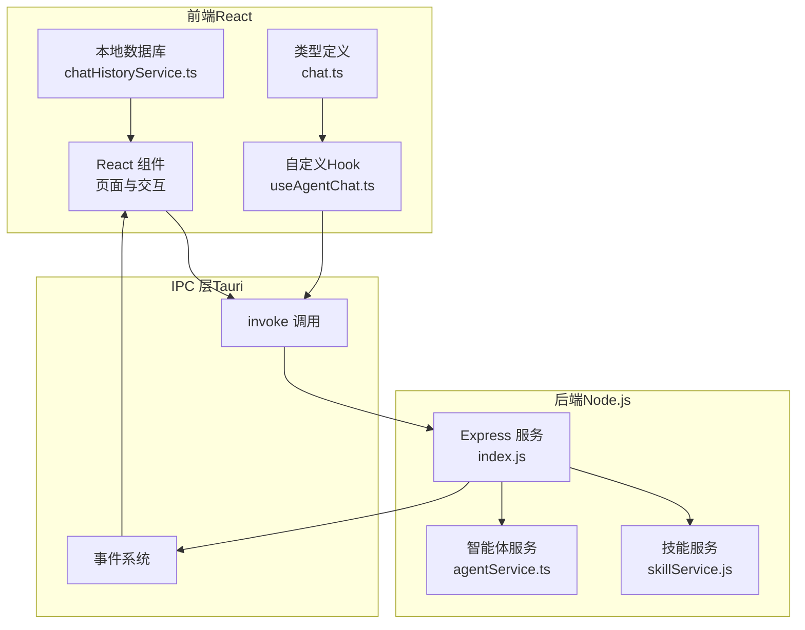
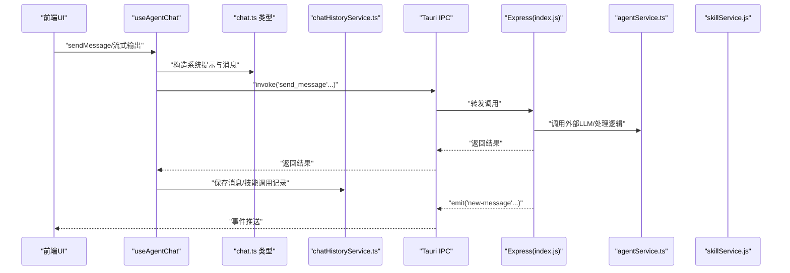
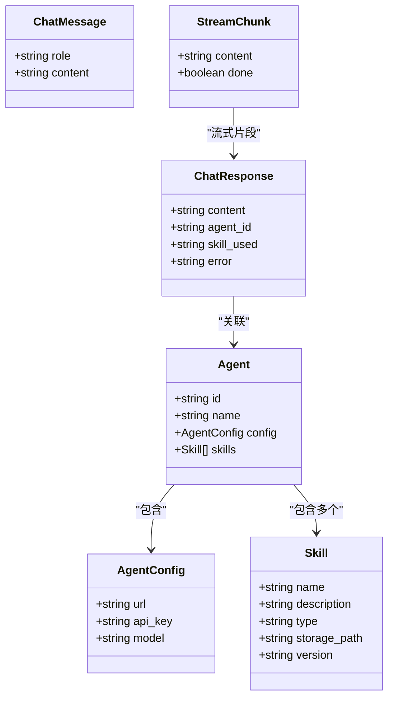
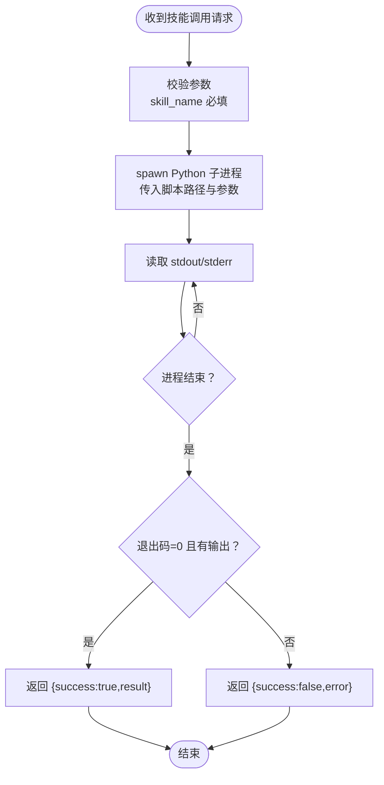
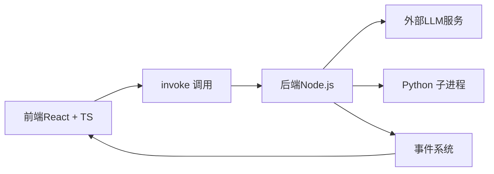

# Tauri IPC通信接口

<cite>
**本文引用的文件**
- [Tauri通信接口.md](file://docs/接口层设计/Tauri通信接口.md)
- [package.json](file://package.json)
- [agentService.ts](file://backend/services/agentService.ts)
- [skillService.js](file://backend/services/skillService.js)
- [chatHistoryService.ts](file://src/services/chatHistoryService.ts)
- [useAgentChat.ts](file://src/hooks/useAgentChat.ts)
- [chat.ts](file://src/types/chat.ts)
- [index.js](file://backend/index.js)
</cite>

## 目录
1. [简介](#简介)
2. [项目结构](#项目结构)
3. [核心组件](#核心组件)
4. [架构总览](#架构总览)
5. [详细组件分析](#详细组件分析)
6. [依赖关系分析](#依赖关系分析)
7. [性能考量](#性能考量)
8. [故障排除指南](#故障排除指南)
9. [结论](#结论)
10. [附录](#附录)

## 简介
本文件面向AutoMate项目中的Tauri IPC通信接口，系统性说明前端React应用与原生桌面环境之间的通信机制，覆盖invoke调用、事件系统、数据传输格式、异步处理与错误传播，并提供TypeScript接口定义、调用示例与最佳实践。同时解释Tauri配置、权限与安全注意事项，以及调试工具、性能监控与故障排除方法。

## 项目结构
AutoMate采用前后端分离的桌面应用架构：
- 前端：React + TypeScript，负责UI与用户交互
- 后端：Node.js服务（Express），提供REST API与技能执行能力
- IPC桥接：通过Tauri的invoke与事件系统实现前后端双向通信
- 数据持久化：浏览器IndexedDB（idb）用于聊天历史与技能调用记录

图表来源
- [useAgentChat.ts](file://src/hooks/useAgentChat.ts#L1-L128)
- [chat.ts](file://src/types/chat.ts#L1-L280)
- [chatHistoryService.ts](file://src/services/chatHistoryService.ts#L1-L244)
- [index.js](file://backend/index.js#L1-L117)
- [agentService.ts](file://backend/services/agentService.ts#L1-L245)
- [skillService.js](file://backend/services/skillService.js#L1-L87)

章节来源
- [package.json](file://package.json#L1-L47)

## 核心组件
- 前端Hook与类型
  - 自定义Hook useAgentChat.ts：封装消息发送、流式输出、加载状态与错误处理
  - 类型定义 chat.ts：Agent、ChatMessage、ChatResponse、StreamChunk等
  - 本地数据库 chatHistoryService.ts：IndexedDB存取聊天与技能调用记录
- 后端服务
  - Express服务 index.js：提供技能调用REST接口
  - 智能体服务 agentService.ts：加载配置、构建系统提示、调用外部LLM
  - 技能服务 skillService.js：Python子进程执行技能脚本

章节来源
- [useAgentChat.ts](file://src/hooks/useAgentChat.ts#L1-L128)
- [chat.ts](file://src/types/chat.ts#L1-L280)
- [chatHistoryService.ts](file://src/services/chatHistoryService.ts#L1-L244)
- [index.js](file://backend/index.js#L1-L117)
- [agentService.ts](file://backend/services/agentService.ts#L1-L245)
- [skillService.js](file://backend/services/skillService.js#L1-L87)

## 架构总览
Tauri IPC在本项目中的角色：
- invoke API：前端通过invoke调用后端函数（如获取智能体、发送消息、调用技能）
- 事件系统：后端通过事件向前端推送状态变更（如新消息、技能调用完成）
- 数据传输：参数与返回值以JSON序列化形式传递；错误通过异常与事件传播
- 异步处理：后端多处使用Promise/async-await；前端通过Hook管理异步状态

图表来源
- [useAgentChat.ts](file://src/hooks/useAgentChat.ts#L51-L127)
- [chat.ts](file://src/types/chat.ts#L96-L260)
- [chatHistoryService.ts](file://src/services/chatHistoryService.ts#L87-L237)
- [index.js](file://backend/index.js#L81-L104)
- [agentService.ts](file://backend/services/agentService.ts#L118-L185)
- [skillService.js](file://backend/services/skillService.js#L16-L87)

## 详细组件分析

### 1) invoke调用与数据传输
- 调用方式
  - 前端通过invoke触发后端函数，参数与返回值为JSON对象
  - 后端通过Tauri桥接转发至Node.js服务或直接实现
- 典型调用
  - 获取智能体列表、获取单个智能体、更新智能体状态
  - 发送消息、获取聊天记录、更新消息状态
  - 调用技能、上传文件
- 参数与返回值
  - 参数键值严格对应后端函数签名
  - 返回值统一为对象，包含业务字段与状态标识
- 异步与错误
  - 后端多处使用Promise/async-await；前端通过try/catch捕获错误
  - 错误通过异常与事件传播，便于统一处理

章节来源
- [Tauri通信接口.md](file://docs/接口层设计/Tauri通信接口.md#L25-L336)
- [index.js](file://backend/index.js#L81-L104)

### 2) 事件系统与状态推送
- 事件监听
  - 前端通过listen订阅事件，接收payload并更新UI
- 事件类型
  - 智能体事件：状态变化、配置更新
  - 聊天事件：新消息、消息状态变化
  - 技能事件：调用开始、完成、失败
- 事件发送
  - 后端通过事件系统向前端推送状态变更，保持UI实时同步

章节来源
- [Tauri通信接口.md](file://docs/接口层设计/Tauri通信接口.md#L545-L731)

### 3) 前端Hook与类型体系
- useAgentChat.ts
  - 封装消息发送与流式输出，管理加载状态与错误
  - 校验智能体配置，构建系统提示，调用LLM并处理响应
- chat.ts
  - 定义Agent、ChatMessage、ChatResponse、StreamChunk等类型
  - 提供流式与非流式聊天函数，解析SSE响应
- chatHistoryService.ts
  - IndexedDB模式定义与索引，提供消息与技能调用的增删改查
  - 支持按时间范围查询与批量清理

图表来源
- [chat.ts](file://src/types/chat.ts#L3-L46)

章节来源
- [useAgentChat.ts](file://src/hooks/useAgentChat.ts#L1-L128)
- [chat.ts](file://src/types/chat.ts#L1-L280)
- [chatHistoryService.ts](file://src/services/chatHistoryService.ts#L37-L85)

### 4) 后端服务与技能执行
- Express服务
  - 提供技能调用REST接口，接收skill_name与parameters，返回执行结果
  - 使用子进程调用Python脚本执行具体技能
- 智能体服务
  - 加载agents.json配置，构建系统提示，调用外部LLM完成对话
  - 统一错误处理，返回标准化错误信息
- 技能服务
  - 通过child_process执行Python脚本，收集stdout/stderr
  - 规范化返回结构，包含success/result/error

图表来源
- [index.js](file://backend/index.js#L19-L79)
- [skillService.js](file://backend/services/skillService.js#L16-L87)

章节来源
- [index.js](file://backend/index.js#L1-L117)
- [agentService.ts](file://backend/services/agentService.ts#L1-L245)
- [skillService.js](file://backend/services/skillService.js#L1-L87)

### 5) 数据模型与持久化
- IndexedDB模式
  - chat_messages：聊天消息表，含索引（按agent、时间、技能）
  - skill_calls：技能调用表，含索引（按消息、时间、agent）
- 查询与更新
  - 支持按agent与时间范围查询
  - 支持更新消息状态、删除最后一条AI消息、清理技能调用记录

章节来源
- [chatHistoryService.ts](file://src/services/chatHistoryService.ts#L37-L237)

## 依赖关系分析
- 前端依赖
  - React生态：react、react-router-dom、zustand等
  - 工具库：axios、sql.js、idb等
  - 构建工具：vite、typescript、tailwindcss等
- 后端依赖
  - Express、CORS、child_process（子进程执行Python脚本）
- IPC相关
  - Tauri invoke与事件系统作为前后端通信桥梁

图表来源
- [package.json](file://package.json#L15-L44)
- [index.js](file://backend/index.js#L1-L117)

章节来源
- [package.json](file://package.json#L1-L47)

## 性能考量
- 前端
  - 使用IndexedDB缓存聊天与技能调用记录，减少重复请求
  - 流式输出提升用户体验，避免长文本一次性渲染
- 后端
  - 子进程执行技能时限制输入输出编码，确保稳定性
  - 对外部LLM请求设置合理超时与错误降级
- IPC
  - invoke调用应避免频繁高负载操作，必要时合并请求或使用事件推送

## 故障排除指南
- invoke调用失败
  - 检查参数类型与必填项，确保后端函数签名一致
  - 查看前端错误捕获与后端日志，定位异常点
- 事件未到达
  - 确认事件名称一致，前端监听是否正确取消
  - 检查后端事件发送逻辑与Tauri事件通道
- 技能执行异常
  - 检查Python脚本路径与参数传递
  - 关注子进程stderr输出，定位脚本内部错误
- 数据不一致
  - 校验IndexedDB索引与查询条件，确保按agent与时间排序正确

章节来源
- [Tauri通信接口.md](file://docs/接口层设计/Tauri通信接口.md#L732-L1006)

## 结论
本项目通过Tauri的invoke与事件系统，实现了前端与Node.js后端的高效通信。前端以React + TypeScript构建交互界面，后端以Express提供REST能力并结合Python子进程执行技能。通过统一的类型定义、错误处理与事件推送，系统具备良好的可维护性与扩展性。建议在生产环境中进一步完善权限控制、日志审计与性能监控。

## 附录
- 调用示例与接口定义
  - invoke调用示例与参数格式详见“invoke API”章节
  - TypeScript接口定义详见“类型定义”章节
- 最佳实践
  - 参数校验与错误分类
  - 事件命名规范与生命周期管理
  - 数据持久化与索引优化
- 参考资源
  - Tauri官方文档与API参考

章节来源
- [Tauri通信接口.md](file://docs/接口层设计/Tauri通信接口.md#L1008-L1013)