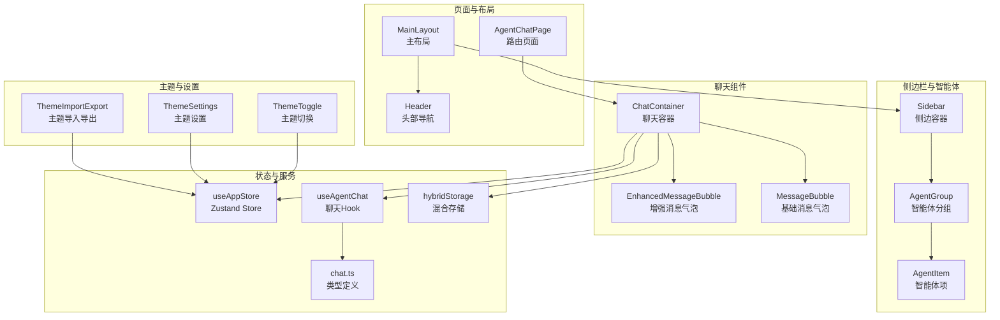
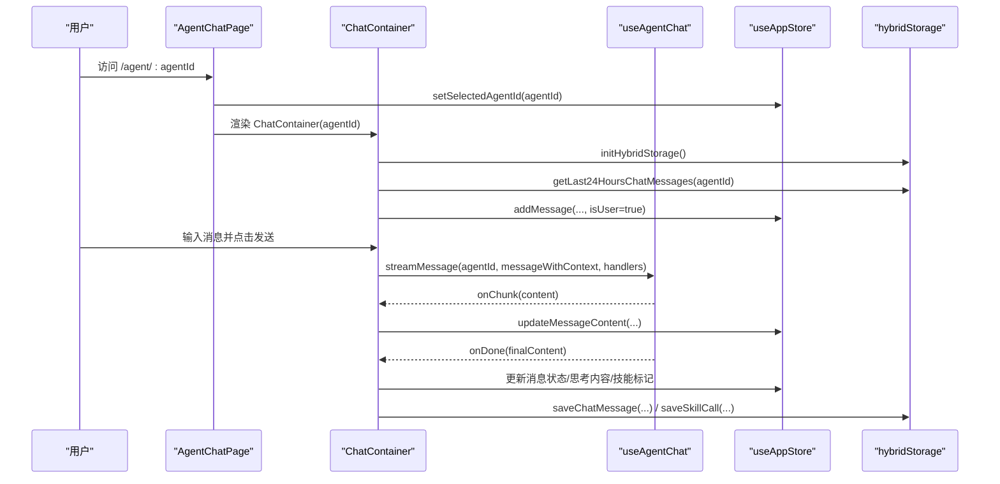
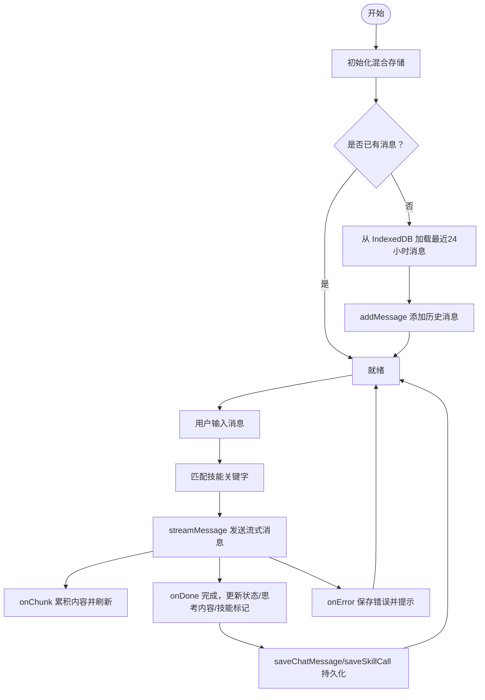
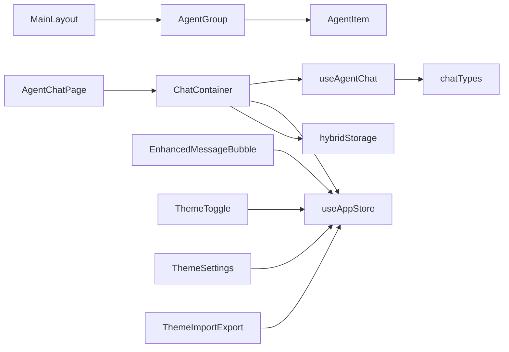

# 前端组件接口

<cite>
**本文引用的文件**
- [src/components/chat/ChatContainer.tsx](file://src/components/chat/ChatContainer.tsx)
- [src/components/chat/EnhancedMessageBubble.tsx](file://src/components/chat/EnhancedMessageBubble.tsx)
- [src/components/chat/MessageBubble.tsx](file://src/components/chat/MessageBubble.tsx)
- [src/components/Sidebar/AgentGroup.tsx](file://src/components/Sidebar/AgentGroup.tsx)
- [src/components/Sidebar/AgentItem.tsx](file://src/components/Sidebar/AgentItem.tsx)
- [src/components/theme/ThemeToggle.tsx](file://src/components/theme/ThemeToggle.tsx)
- [src/components/theme/ThemeSettings.tsx](file://src/components/theme/ThemeSettings.tsx)
- [src/components/theme/ThemeImportExport.tsx](file://src/components/theme/ThemeImportExport.tsx)
- [src/hooks/useAgentChat.ts](file://src/hooks/useAgentChat.ts)
- [src/store/useAppStore.ts](file://src/store/useAppStore.ts)
- [src/tabs/chat.ts](file://src/types/chat.ts)
- [src/pages/AgentChatPage.tsx](file://src/pages/AgentChatPage.tsx)
- [src/components/Header.tsx](file://src/components/Header.tsx)
- [src/components/MainLayout.tsx](file://src/components/MainLayout.tsx)
- [src/services/hybridStorage.ts](file://src/services/hybridStorage.ts)
</cite>

## 目录
1. [简介](#简介)
2. [项目结构](#项目结构)
3. [核心组件](#核心组件)
4. [架构总览](#架构总览)
5. [详细组件分析](#详细组件分析)
6. [依赖分析](#依赖分析)
7. [性能考虑](#性能考虑)
8. [故障排查指南](#故障排查指南)
9. [结论](#结论)
10. [附录](#附录)

## 简介
本文件面向前端开发者，系统化梳理 AutoMate 前端组件的接口规范、状态管理、组件通信与数据流，并给出 TypeScript 类型定义、生命周期与 Hooks 使用模式、Context 共享机制、复用策略、性能优化与内存管理建议，以及测试与调试方法。

## 项目结构
前端采用分层组织：页面路由层、布局与侧边栏层、聊天与主题组件层、状态与服务层。核心交互围绕“智能体聊天”展开，通过 Zustand 状态库集中管理全局状态，通过自定义 Hook 提供聊天能力，通过 IndexedDB 实现混合持久化存储。

图表来源
- [src/pages/AgentChatPage.tsx](file://src/pages/AgentChatPage.tsx#L1-L24)
- [src/components/MainLayout.tsx](file://src/components/MainLayout.tsx#L1-L134)
- [src/components/Header.tsx](file://src/components/Header.tsx#L1-L169)
- [src/components/Sidebar/AgentGroup.tsx](file://src/components/Sidebar/AgentGroup.tsx#L1-L54)
- [src/components/Sidebar/AgentItem.tsx](file://src/components/Sidebar/AgentItem.tsx#L1-L191)
- [src/components/chat/ChatContainer.tsx](file://src/components/chat/ChatContainer.tsx#L1-L756)
- [src/components/chat/EnhancedMessageBubble.tsx](file://src/components/chat/EnhancedMessageBubble.tsx#L1-L217)
- [src/components/chat/MessageBubble.tsx](file://src/components/chat/MessageBubble.tsx#L1-L90)
- [src/components/theme/ThemeToggle.tsx](file://src/components/theme/ThemeToggle.tsx#L1-L40)
- [src/components/theme/ThemeSettings.tsx](file://src/components/theme/ThemeSettings.tsx#L1-L262)
- [src/components/theme/ThemeImportExport.tsx](file://src/components/theme/ThemeImportExport.tsx#L1-L168)
- [src/store/useAppStore.ts](file://src/store/useAppStore.ts#L1-L306)
- [src/hooks/useAgentChat.ts](file://src/hooks/useAgentChat.ts#L1-L128)
- [src/services/hybridStorage.ts](file://src/services/hybridStorage.ts#L1-L262)
- [src/types/chat.ts](file://src/types/chat.ts#L1-L280)

章节来源
- [src/pages/AgentChatPage.tsx](file://src/pages/AgentChatPage.tsx#L1-L24)
- [src/components/MainLayout.tsx](file://src/components/MainLayout.tsx#L1-L134)
- [src/components/Header.tsx](file://src/components/Header.tsx#L1-L169)
- [src/components/Sidebar/AgentGroup.tsx](file://src/components/Sidebar/AgentGroup.tsx#L1-L54)
- [src/components/Sidebar/AgentItem.tsx](file://src/components/Sidebar/AgentItem.tsx#L1-L191)
- [src/components/chat/ChatContainer.tsx](file://src/components/chat/ChatContainer.tsx#L1-L756)
- [src/components/chat/EnhancedMessageBubble.tsx](file://src/components/chat/EnhancedMessageBubble.tsx#L1-L217)
- [src/components/chat/MessageBubble.tsx](file://src/components/chat/MessageBubble.tsx#L1-L90)
- [src/components/theme/ThemeToggle.tsx](file://src/components/theme/ThemeToggle.tsx#L1-L40)
- [src/components/theme/ThemeSettings.tsx](file://src/components/theme/ThemeSettings.tsx#L1-L262)
- [src/components/theme/ThemeImportExport.tsx](file://src/components/theme/ThemeImportExport.tsx#L1-L168)
- [src/store/useAppStore.ts](file://src/store/useAppStore.ts#L1-L306)
- [src/hooks/useAgentChat.ts](file://src/hooks/useAgentChat.ts#L1-L128)
- [src/services/hybridStorage.ts](file://src/services/hybridStorage.ts#L1-L262)
- [src/types/chat.ts](file://src/types/chat.ts#L1-L280)

## 核心组件
本节聚焦聊天组件、智能体组件、主题组件的接口与行为。

- 聊天组件
  - ChatContainer：负责聊天会话的生命周期、消息发送与流式渲染、技能激活与调用、历史消息加载、滚动控制与状态同步。
  - EnhancedMessageBubble：渲染 Markdown 内容、显示思考过程、技能徽章、复制与重试按钮。
  - MessageBubble：基础消息气泡，支持状态图标与时标展示。

- 智能体组件
  - AgentGroup：分组折叠/展开，基于主题切换样式。
  - AgentItem：高亮搜索、点击选中、在线状态、头像与渐变配色。

- 主题组件
  - ThemeToggle：切换浅/深色主题。
  - ThemeSettings：主题参数配置、重置、导出/导入。
  - ThemeImportExport：主题配置文件的导入/导出与格式校验。

章节来源
- [src/components/chat/ChatContainer.tsx](file://src/components/chat/ChatContainer.tsx#L9-L11)
- [src/components/chat/EnhancedMessageBubble.tsx](file://src/components/chat/EnhancedMessageBubble.tsx#L6-L14)
- [src/components/chat/MessageBubble.tsx](file://src/components/chat/MessageBubble.tsx#L4-L9)
- [src/components/Sidebar/AgentGroup.tsx](file://src/components/Sidebar/AgentGroup.tsx#L5-L9)
- [src/components/Sidebar/AgentItem.tsx](file://src/components/Sidebar/AgentItem.tsx#L4-L14)
- [src/components/theme/ThemeToggle.tsx](file://src/components/theme/ThemeToggle.tsx#L1-L40)
- [src/components/theme/ThemeSettings.tsx](file://src/components/theme/ThemeSettings.tsx#L1-L262)
- [src/components/theme/ThemeImportExport.tsx](file://src/components/theme/ThemeImportExport.tsx#L1-L168)

## 架构总览
前端采用“页面路由 → 布局 → 组件 → Hook/Store/服务”的分层架构。聊天流程通过 useAgentChat 提供流式与非流式两种消息发送方式；状态通过 useAppStore 集中管理；消息持久化通过 hybridStorage 实现 IndexedDB 存储与清理。

图表来源
- [src/pages/AgentChatPage.tsx](file://src/pages/AgentChatPage.tsx#L1-L24)
- [src/components/chat/ChatContainer.tsx](file://src/components/chat/ChatContainer.tsx#L16-L103)
- [src/hooks/useAgentChat.ts](file://src/hooks/useAgentChat.ts#L84-L119)
- [src/store/useAppStore.ts](file://src/store/useAppStore.ts#L143-L187)
- [src/services/hybridStorage.ts](file://src/services/hybridStorage.ts#L129-L184)

## 详细组件分析

### ChatContainer 组件接口与状态
- Props
  - agentId: string（必填）——目标智能体标识
- 状态与副作用
  - 初始化混合存储、加载最近24小时历史消息、滚动控制、输入框自适应高度、键盘快捷键处理、停止/重试逻辑
- 事件回调
  - onChunk/onDone/onError（来自 useAgentChat 的流式处理器）
  - handleSend/handleStop/handleRetry/handleKeyDown/handleInputChange
- 关键行为
  - 技能关键字匹配与激活：根据用户消息与智能体技能列表匹配，生成技能激活列表
  - 流式渲染：累积增量内容，定时刷新，支持思考内容提取与展示
  - 历史加载：首次进入且无消息时，从 IndexedDB 加载最近24小时消息
  - 持久化：保存用户消息、AI回复、技能调用记录
- 生命周期
  - 初始化：useEffect 中执行混合存储初始化
  - 历史加载：依赖 agentId 与初始化状态
  - 滚动监听：监听聊天区域滚动，控制“回到底部”按钮显隐
  - 输入框焦点：切换 agentId 时自动聚焦
- 数据流
  - 输入 → addMessage → streamMessage → updateMessageContent → saveChatMessage
  - 错误 → setTyping → addMessage → saveChatMessage
  - 重试 → removeLastAiMessage → deleteLastAiMessage → deleteSkillCallByMessageId → 重新触发流式发送

图表来源
- [src/components/chat/ChatContainer.tsx](file://src/components/chat/ChatContainer.tsx#L16-L103)
- [src/components/chat/ChatContainer.tsx](file://src/components/chat/ChatContainer.tsx#L240-L392)
- [src/services/hybridStorage.ts](file://src/services/hybridStorage.ts#L129-L184)

章节来源
- [src/components/chat/ChatContainer.tsx](file://src/components/chat/ChatContainer.tsx#L9-L11)
- [src/components/chat/ChatContainer.tsx](file://src/components/chat/ChatContainer.tsx#L16-L103)
- [src/components/chat/ChatContainer.tsx](file://src/components/chat/ChatContainer.tsx#L240-L392)
- [src/services/hybridStorage.ts](file://src/services/hybridStorage.ts#L129-L184)

### EnhancedMessageBubble 组件接口
- Props
  - content: string（必填）
  - isUser: boolean（必填）
  - status?: 'sending' | 'sent' | 'delivered' | 'read' | 'failed'
  - skillActivated?: string[]
  - thinkingContent?: string
  - isStreaming?: boolean
  - onRetry?: () => void
- 行为
  - 渲染 Markdown 内容（含代码块样式）
  - 展示“思考过程”面板（可展开/收起）
  - 显示技能激活徽章
  - 复制内容与重试按钮（仅对 AI 消息）

章节来源
- [src/components/chat/EnhancedMessageBubble.tsx](file://src/components/chat/EnhancedMessageBubble.tsx#L6-L14)

### MessageBubble 组件接口
- Props
  - content: string（必填）
  - isUser: boolean（必填）
  - timestamp: string（必填）
  - status?: 'sending' | 'sent' | 'delivered' | 'read' | 'failed'
- 行为
  - 基础消息气泡，带时间戳与状态图标
  - 用户消息与系统/AI 消息样式区分

章节来源
- [src/components/chat/MessageBubble.tsx](file://src/components/chat/MessageBubble.tsx#L4-L9)

### AgentGroup 组件接口
- Props
  - groupName: string（必填）
  - agents: any[]（必填）
  - children: React.ReactNode（必填）
- 行为
  - 切换分组折叠/展开
  - 基于主题切换样式

章节来源
- [src/components/Sidebar/AgentGroup.tsx](file://src/components/Sidebar/AgentGroup.tsx#L5-L9)

### AgentItem 组件接口
- Props
  - agent: { id, name, description, avatar?, avatarColor? }
  - searchQuery: string（必填）
  - onClick?: () => void
- 行为
  - 高亮搜索关键词
  - 点击选中智能体或触发外部 onClick
  - 在线/离线状态徽记
  - 头像渐变与图标映射

章节来源
- [src/components/Sidebar/AgentItem.tsx](file://src/components/Sidebar/AgentItem.tsx#L4-L14)

### ThemeToggle 组件接口
- 行为
  - 切换主题（light/dark），更新全局主题状态

章节来源
- [src/components/theme/ThemeToggle.tsx](file://src/components/theme/ThemeToggle.tsx#L1-L40)

### ThemeSettings 组件接口
- 行为
  - 主题模式切换（light/dark）
  - 主题参数编辑（主色、辅色、文本色、背景色、边框色、字号、字重、动画开关、动画时长）
  - 重置默认、导出/导入主题配置

章节来源
- [src/components/theme/ThemeSettings.tsx](file://src/components/theme/ThemeSettings.tsx#L1-L262)

### ThemeImportExport 组件接口
- 行为
  - 导出当前主题配置为 JSON 文件
  - 导入主题配置 JSON 并进行格式校验

章节来源
- [src/components/theme/ThemeImportExport.tsx](file://src/components/theme/ThemeImportExport.tsx#L1-L168)

## 依赖分析
- 组件间依赖
  - AgentChatPage 依赖 useAppStore 设置选中智能体并渲染 ChatContainer
  - MainLayout 负责加载智能体配置、搜索与侧边栏交互
  - ChatContainer 依赖 useAgentChat、useAppStore、hybridStorage
  - EnhancedMessageBubble 依赖 useAppStore（主题）
  - Theme* 组件依赖 useAppStore（主题与配置）
- 类型与服务
  - chat.ts 定义 Agent、AgentConfig、Skill、ChatMessage、ChatResponse、StreamChunk 等类型
  - hybridStorage 提供 IndexedDB 存储、索引与清理策略

图表来源
- [src/pages/AgentChatPage.tsx](file://src/pages/AgentChatPage.tsx#L1-L24)
- [src/components/MainLayout.tsx](file://src/components/MainLayout.tsx#L1-L134)
- [src/components/Sidebar/AgentGroup.tsx](file://src/components/Sidebar/AgentGroup.tsx#L1-L54)
- [src/components/Sidebar/AgentItem.tsx](file://src/components/Sidebar/AgentItem.tsx#L1-L191)
- [src/components/chat/ChatContainer.tsx](file://src/components/chat/ChatContainer.tsx#L1-L756)
- [src/components/chat/EnhancedMessageBubble.tsx](file://src/components/chat/EnhancedMessageBubble.tsx#L1-L217)
- [src/components/theme/ThemeToggle.tsx](file://src/components/theme/ThemeToggle.tsx#L1-L40)
- [src/components/theme/ThemeSettings.tsx](file://src/components/theme/ThemeSettings.tsx#L1-L262)
- [src/components/theme/ThemeImportExport.tsx](file://src/components/theme/ThemeImportExport.tsx#L1-L168)
- [src/hooks/useAgentChat.ts](file://src/hooks/useAgentChat.ts#L1-L128)
- [src/store/useAppStore.ts](file://src/store/useAppStore.ts#L1-L306)
- [src/services/hybridStorage.ts](file://src/services/hybridStorage.ts#L1-L262)
- [src/types/chat.ts](file://src/types/chat.ts#L1-L280)

章节来源
- [src/pages/AgentChatPage.tsx](file://src/pages/AgentChatPage.tsx#L1-L24)
- [src/components/MainLayout.tsx](file://src/components/MainLayout.tsx#L1-L134)
- [src/components/Sidebar/AgentGroup.tsx](file://src/components/Sidebar/AgentGroup.tsx#L1-L54)
- [src/components/Sidebar/AgentItem.tsx](file://src/components/Sidebar/AgentItem.tsx#L1-L191)
- [src/components/chat/ChatContainer.tsx](file://src/components/chat/ChatContainer.tsx#L1-L756)
- [src/components/chat/EnhancedMessageBubble.tsx](file://src/components/chat/EnhancedMessageBubble.tsx#L1-L217)
- [src/components/theme/ThemeToggle.tsx](file://src/components/theme/ThemeToggle.tsx#L1-L40)
- [src/components/theme/ThemeSettings.tsx](file://src/components/theme/ThemeSettings.tsx#L1-L262)
- [src/components/theme/ThemeImportExport.tsx](file://src/components/theme/ThemeImportExport.tsx#L1-L168)
- [src/hooks/useAgentChat.ts](file://src/hooks/useAgentChat.ts#L1-L128)
- [src/store/useAppStore.ts](file://src/store/useAppStore.ts#L1-L306)
- [src/services/hybridStorage.ts](file://src/services/hybridStorage.ts#L1-L262)
- [src/types/chat.ts](file://src/types/chat.ts#L1-L280)

## 性能考虑
- 渲染优化
  - ChatContainer 使用滚动监听与“回到底部”按钮，避免每次消息插入都强制滚动到底部
  - 增强消息气泡按需展开“思考过程”，减少不必要的 DOM 渲染
- 状态更新
  - useAppStore 使用原子化更新，避免不必要的深层拷贝
  - 流式渲染采用定时刷新策略，降低频繁 setState 带来的抖动
- 存储与清理
  - hybridStorage 对过期数据进行每日清理，限制 IndexedDB 规模
- 资源访问
  - useAgentChat 在发送前校验智能体配置，避免无效请求
- 内存管理
  - ChatContainer 在组件卸载时移除滚动事件监听
  - 流式处理中及时清理计时器与中间变量

[本节为通用指导，无需特定文件引用]

## 故障排查指南
- 聊天无响应
  - 检查智能体配置是否完整（url/api_key/model）
  - 查看 useAgentChat 的 error 状态与控制台日志
- 流式输出中断
  - 确认代理路径与鉴权头设置
  - 检查网络超时与服务端 SSE 支持
- 历史消息缺失
  - 确认混合存储初始化是否完成
  - 检查 IndexedDB 中是否存在近24小时内的消息
- 主题切换异常
  - 确认 useAppStore 的 theme 与 themeConfig 是否一致更新
- 技能调用未记录
  - 检查 saveSkillCall 的调用链与 message_id 关联

章节来源
- [src/hooks/useAgentChat.ts](file://src/hooks/useAgentChat.ts#L51-L82)
- [src/components/chat/ChatContainer.tsx](file://src/components/chat/ChatContainer.tsx#L377-L391)
- [src/services/hybridStorage.ts](file://src/services/hybridStorage.ts#L129-L184)
- [src/store/useAppStore.ts](file://src/store/useAppStore.ts#L262-L284)

## 结论
本项目通过清晰的组件分层、完善的类型定义、集中式状态管理与混合存储方案，实现了稳定高效的聊天交互体验。组件接口简洁明确，事件回调与状态更新路径清晰，具备良好的可扩展性与可维护性。

[本节为总结，无需特定文件引用]

## 附录

### TypeScript 类型与接口定义
- Agent 与 AgentConfig
  - Agent：包含 id、name、description、avatar、avatarColor、skills 等字段
  - AgentConfig：包含 url、api_key、model
- ChatMessage、ChatResponse、StreamChunk
  - ChatMessage：系统/用户/助手消息
  - ChatResponse：非流式响应
  - StreamChunk：流式片段
- ChatState 与 Message
  - ChatState：以 agentId 为键的消息数组与打字状态
  - Message：包含 id、content、isUser、timestamp、status、skillActivated、thinkingContent、isStreaming
- ThemeConfig 与 UserSettings
  - ThemeConfig：主色、辅色、文本色、背景色、边框色、字号、字重、动画开关、动画时长
  - UserSettings：侧边栏折叠状态、宽度、主题、主题配置、语言、通知等
- Store 方法
  - addMessage/updateMessageContent/updateMessageThinkingContent/removeLastAiMessage/setTyping
  - setTheme/setThemeConfig/updateUserSettings/toggleSidebar/setSidebarWidth/setGlobalStatus/toggleGlobalStatus

章节来源
- [src/types/chat.ts](file://src/types/chat.ts#L3-L46)
- [src/store/useAppStore.ts](file://src/store/useAppStore.ts#L3-L83)

### Hooks 使用模式
- useAgentChat
  - 提供 sendMessage 与 streamMessage 两个入口
  - 返回 isLoading、error 与处理器 onChunk/onDone/onError
- 生命周期
  - 在组件挂载时加载智能体配置与技能描述
  - 在消息流中逐段更新 UI，完成后统一提交最终内容

章节来源
- [src/hooks/useAgentChat.ts](file://src/hooks/useAgentChat.ts#L18-L127)

### Context 共享机制
- 当前项目未显式使用 React Context，而是通过 Zustand 的 useAppStore 提供跨组件状态共享
- 主题与用户设置通过 store 内部状态暴露，组件通过订阅 store 状态变化进行渲染

章节来源
- [src/store/useAppStore.ts](file://src/store/useAppStore.ts#L109-L305)

### 组件复用策略
- ChatContainer 作为聊天容器，内部组合 EnhancedMessageBubble 与基础 MessageBubble，便于在不同场景下切换展示风格
- AgentGroup/AgentItem 可在不同页面复用，配合 MainLayout 的搜索与导航
- Theme* 组件独立封装主题切换与配置，便于在多页面共享

章节来源
- [src/components/chat/ChatContainer.tsx](file://src/components/chat/ChatContainer.tsx#L666-L674)
- [src/components/MainLayout.tsx](file://src/components/MainLayout.tsx#L88-L118)

### 测试方法与调试技巧
- 单元测试
  - 对 useAgentChat 的 sendMessage/streamMessage 进行 mock API 测试
  - 对 ChatContainer 的技能匹配函数与流式处理逻辑进行断言
- 集成测试
  - 模拟 hybridStorage 的 IndexedDB 行为，验证历史消息加载与持久化
- 调试技巧
  - 使用浏览器 DevTools 的 React DevTools 查看组件树与状态
  - 在 ChatContainer 中打印关键事件（如技能激活、流式片段、错误）以便定位问题
  - 在 useAgentChat 中捕获并记录 API 错误信息

[本节为通用指导，无需特定文件引用]