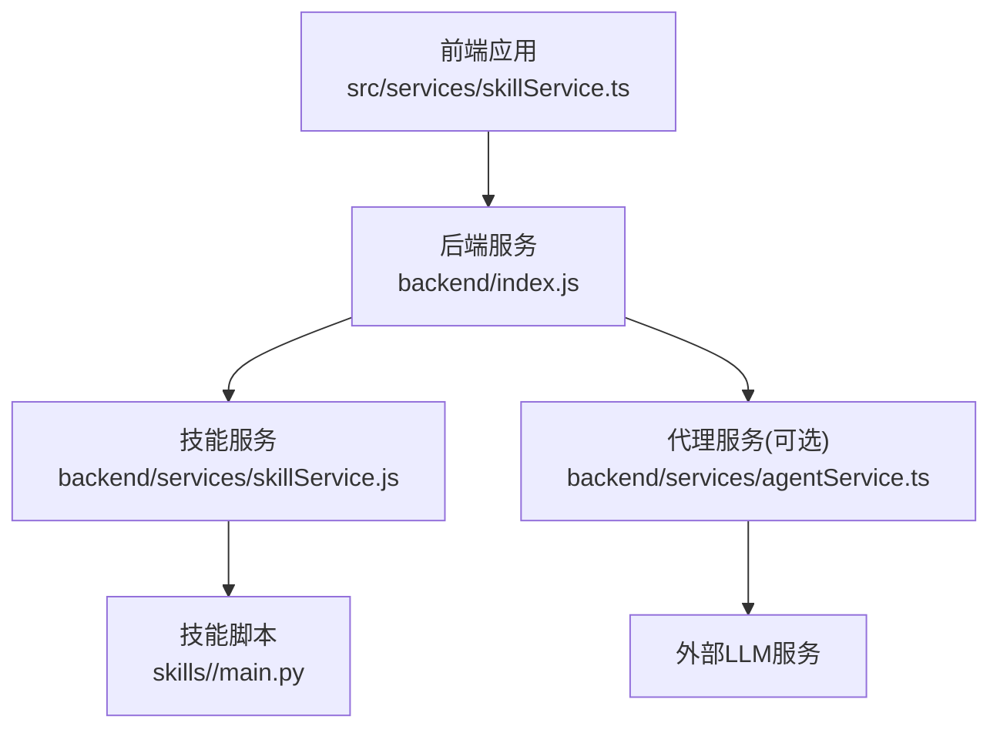
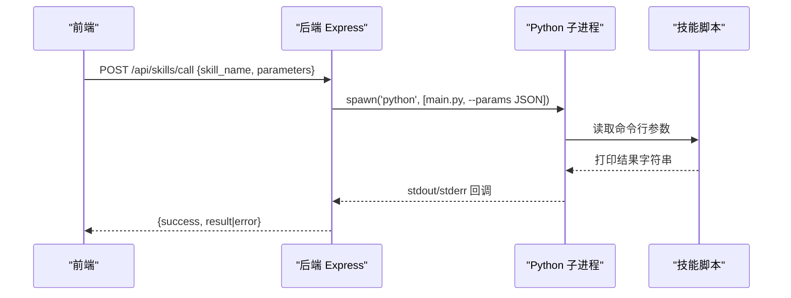
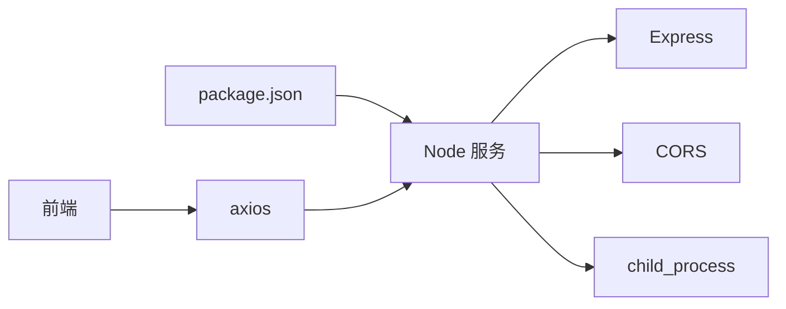
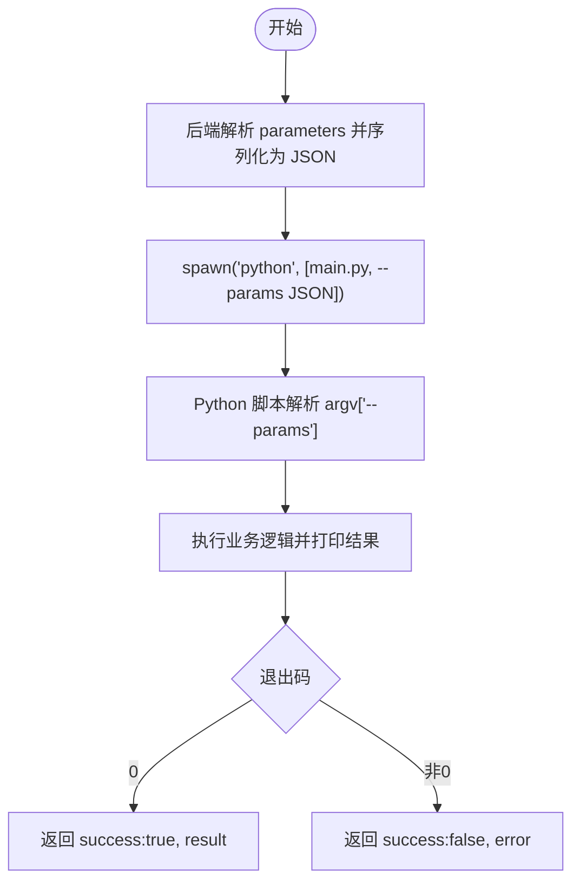

# 后端API接口

<cite>
**本文引用的文件**
- [backend/index.js](file://backend/index.js)
- [backend/services/skillService.js](file://backend/services/skillService.js)
- [backend/services/agentService.ts](file://backend/services/agentService.ts)
- [src/services/skillService.ts](file://src/services/skillService.ts)
- [skills/weather_query/main.py](file://skills/weather_query/main.py)
- [skills/todo-query/main.py](file://skills/todo-query/main.py)
- [config/agents.json](file://config/agents.json)
- [package.json](file://package.json)
</cite>

## 目录
1. [简介](#简介)
2. [项目结构](#项目结构)
3. [核心组件](#核心组件)
4. [架构总览](#架构总览)
5. [详细组件分析](#详细组件分析)
6. [依赖关系分析](#依赖关系分析)
7. [性能考虑](#性能考虑)
8. [故障排查指南](#故障排查指南)
9. [结论](#结论)
10. [附录](#附录)

## 简介
本文件为 AutoMate 项目的后端 API 接口文档，聚焦于 Express REST API 的两个核心端点：
- 技能调用接口：POST /api/skills/call
- 健康检查接口：GET /api/skills

文档详细说明每个端点的 HTTP 方法、URL 模式、请求参数、响应格式、状态码，并解释技能执行的参数传递机制、Python 脚本调用流程与错误处理策略。同时涵盖 CORS 配置、JSON 解析中间件以及进程间通信机制，提供 API 使用示例、调试方法与性能优化建议。

## 项目结构
后端采用 Node.js + Express 构建，核心入口位于 backend/index.js，负责路由注册与技能执行；技能服务封装在 backend/services/skillService.js 中，提供统一的 Python 子进程调用能力；前端通过 src/services/skillService.ts 发起调用，后端再将请求转发至 skills 目录下的具体 Python 脚本执行。

图表来源
- [backend/index.js](file://backend/index.js#L1-L117)
- [backend/services/skillService.js](file://backend/services/skillService.js#L1-L87)
- [src/services/skillService.ts](file://src/services/skillService.ts#L1-L73)

章节来源
- [backend/index.js](file://backend/index.js#L1-L117)
- [backend/services/skillService.js](file://backend/services/skillService.js#L1-L87)
- [src/services/skillService.ts](file://src/services/skillService.ts#L1-L73)

## 核心组件
- Express 应用与中间件
  - CORS 允许跨域访问
  - JSON 请求体解析
- 技能执行引擎
  - 通过 child_process.spawn 调用 Python 脚本
  - 将参数以命令行参数形式传递给 Python 脚本
  - 捕获 stdout/stderr 并在 close 事件中汇总结果
- 健康检查端点
  - GET /api/skills 返回服务状态

章节来源
- [backend/index.js](file://backend/index.js#L14-L16)
- [backend/index.js](file://backend/index.js#L81-L111)

## 架构总览
后端服务作为网关，接收前端请求，解析参数并调用对应技能脚本；技能脚本负责具体业务逻辑，返回文本结果；后端将结果封装为统一响应格式返回前端。

图表来源
- [backend/index.js](file://backend/index.js#L19-L79)
- [backend/index.js](file://backend/index.js#L81-L104)
- [skills/weather_query/main.py](file://skills/weather_query/main.py#L128-L139)
- [skills/todo-query/main.py](file://skills/todo-query/main.py#L23-L34)

## 详细组件分析

### 技能调用接口：POST /api/skills/call
- 功能概述
  - 接收前端传入的技能名称与参数，调用对应 Python 脚本执行，并返回执行结果或错误信息。
- HTTP 方法与 URL
  - 方法：POST
  - 路径：/api/skills/call
- 请求头
  - Content-Type: application/json
- 请求体字段
  - skill_name: 字符串，必填。技能目录名，对应 skills/<skill_name>/main.py。
  - parameters: 对象，可选。将被序列化为 JSON 作为命令行参数传入 Python 脚本。
- 响应体字段
  - success: 布尔值。true 表示执行成功，false 表示失败。
  - result: 字符串。当 success 为 true 时返回技能输出文本；若脚本无输出则返回“技能执行完成（无输出）”。
  - error: 字符串。当 success 为 false 时返回错误信息。
- 状态码
  - 200 OK：请求成功，返回 {success, result|error}
  - 400 Bad Request：缺少 skill_name 参数
  - 500 Internal Server Error：服务器内部异常
- 参数传递机制
  - 后端将 parameters 序列化为 JSON 字符串，并通过命令行参数 --params 传递给 Python 脚本。
  - Python 脚本解析 argv，读取 --params 并从中提取 input/location 等键值。
- 错误处理策略
  - 子进程退出码非 0 或 stdout 为空时，视为失败，返回 error。
  - 子进程 error 事件捕获异常并返回错误消息。
  - 服务器异常捕获后返回 500 与错误信息。
- 请求示例
  - POST /api/skills/call
  - 请求体：
    {
      "skill_name": "weather_query",
      "parameters": {
        "input": "深圳"
      }
    }
- 成功响应示例
  - {
      "success": true,
      "result": "🌤️ 深圳天气报告\n\n📍 地区：CN\n🌡️ 温度：22.5°C (体感：23.1°C)\n..."
    }
- 失败响应示例
  - {
      "success": false,
      "error": "技能执行失败，退出码: 1"
    }

章节来源
- [backend/index.js](file://backend/index.js#L81-L104)
- [backend/index.js](file://backend/index.js#L19-L79)
- [skills/weather_query/main.py](file://skills/weather_query/main.py#L128-L139)
- [skills/todo-query/main.py](file://skills/todo-query/main.py#L23-L34)

### 健康检查接口：GET /api/skills
- 功能概述
  - 返回服务健康状态，用于探活与监控。
- HTTP 方法与 URL
  - 方法：GET
  - 路径：/api/skills
- 响应体字段
  - status: 字符串，固定为 "ok"
  - message: 字符串，提示服务运行中
- 状态码
  - 200 OK：始终返回 200
- 示例
  - GET /api/skills
  - 响应：
    {
      "status": "ok",
      "message": "Skill API 服务运行中"
    }

章节来源
- [backend/index.js](file://backend/index.js#L106-L111)

### 技能服务模块（后端）
- 统一的技能执行函数 executeSkill
  - 作用：定位技能脚本路径，spawn Python 进程，监听 stdout/stderr，在 close 事件中汇总结果。
  - 输入：skillName, parameters
  - 输出：Promise<SkillResult>
- 调用封装 callSkill
  - 包装 executeSkill，统一错误处理，返回标准化结果对象。
- 参数与输入流
  - parameters 通过命令行参数传入 Python 脚本。
  - 若脚本需要从 stdin 读取输入（例如某些交互式脚本），可在 stdout/stderr 监听之外额外写入 stdin 并 end。

章节来源
- [backend/services/skillService.js](file://backend/services/skillService.js#L16-L86)

### 前端调用封装
- 前端通过 axios 调用 /api/skills/call，自动携带 JSON 请求头。
- 自动注入 messageId、agentId 等上下文参数，便于后端日志追踪。
- 统一错误处理：网络错误、超时、后端返回错误等场景均进行归一化处理。

章节来源
- [src/services/skillService.ts](file://src/services/skillService.ts#L12-L61)

### 代理服务（可选）
- 后端还提供 agentService.ts，用于加载 agents.json 中的代理配置，构建系统提示词，调用外部 LLM 接口。
- 该模块与技能调用接口并行存在，可根据需求选择直接调用 Python 脚本或通过代理服务间接调用。

章节来源
- [backend/services/agentService.ts](file://backend/services/agentService.ts#L58-L184)
- [config/agents.json](file://config/agents.json#L1-L119)

## 依赖关系分析
- 后端依赖
  - express：Web 框架
  - cors：跨域支持
  - child_process：调用 Python 脚本
  - path：拼接技能脚本路径
- 前端依赖
  - axios：HTTP 客户端
- 运行脚本
  - package.json 提供 npm run backend 启动后端服务，或 npm run start 同时启动前端与后端。

图表来源
- [package.json](file://package.json#L12-L13)
- [backend/index.js](file://backend/index.js#L1-L117)

章节来源
- [package.json](file://package.json#L12-L13)
- [backend/index.js](file://backend/index.js#L1-L117)

## 性能考虑
- 子进程复用
  - 当前实现每次调用都会 spawn 新的 Python 进程，频繁调用会产生较大开销。建议引入进程池或长驻子进程以减少启动成本。
- I/O 与缓冲
  - stdout/stderr 事件可能多次触发，需注意累积与截断策略。当前实现会累积完整输出，建议对超大输出进行分块处理或限制长度。
- 超时控制
  - 建议在 spawn 时设置超时，避免长时间阻塞；同时在前端 axios 设置合理 timeout。
- 并发与限流
  - 在高并发场景下，建议增加队列与限流策略，防止系统资源耗尽。
- 日志与监控
  - 记录技能执行耗时、错误率与退出码分布，便于后续优化。

## 故障排查指南
- 常见问题与定位
  - 缺少 skill_name：后端返回 400，检查请求体字段是否正确。
  - Python 未安装或路径不正确：spawn error，检查系统 PATH 与 Python 可执行文件位置。
  - 技能脚本无输出：stdout 为空，后端返回 success 但 result 为“技能执行完成（无输出）”，检查脚本是否打印结果。
  - 子进程退出码非 0：stderr 会被收集为 error，检查脚本异常与外部依赖。
  - 网络错误：前端 axios 捕获 ERR_NETWORK，确认后端服务已启动且端口可用。
- 调试步骤
  - 查看后端控制台日志，确认 skill_path、参数序列化与子进程退出码。
  - 在 skills/<skill>/main.py 中添加调试输出，验证参数解析与业务逻辑。
  - 使用 curl 直接调用 /api/skills/call，快速定位问题。
- 建议
  - 为每个技能编写最小可运行示例，便于独立验证。
  - 在 agents.json 中为技能配置合理的 storage_path 与版本，避免路径错误。

章节来源
- [backend/index.js](file://backend/index.js#L86-L103)
- [backend/index.js](file://backend/index.js#L49-L77)
- [src/services/skillService.ts](file://src/services/skillService.ts#L34-L60)

## 结论
本文档系统梳理了 AutoMate 后端 API 的两个核心端点及其参数传递、执行流程与错误处理机制。通过统一的技能服务模块与清晰的前后端协作方式，实现了灵活可扩展的技能执行框架。建议在生产环境中引入进程池、超时控制与监控告警，以进一步提升稳定性与性能。

## 附录

### API 端点一览
- POST /api/skills/call
  - 请求体：{ skill_name: string, parameters?: object }
  - 响应：{ success: boolean, result?: string, error?: string }
  - 状态码：200/400/500
- GET /api/skills
  - 响应：{ status: "ok", message: string }
  - 状态码：200

### 参数传递与脚本解析流程

图表来源
- [backend/index.js](file://backend/index.js#L27-L30)
- [skills/weather_query/main.py](file://skills/weather_query/main.py#L128-L139)
- [skills/todo-query/main.py](file://skills/todo-query/main.py#L23-L34)