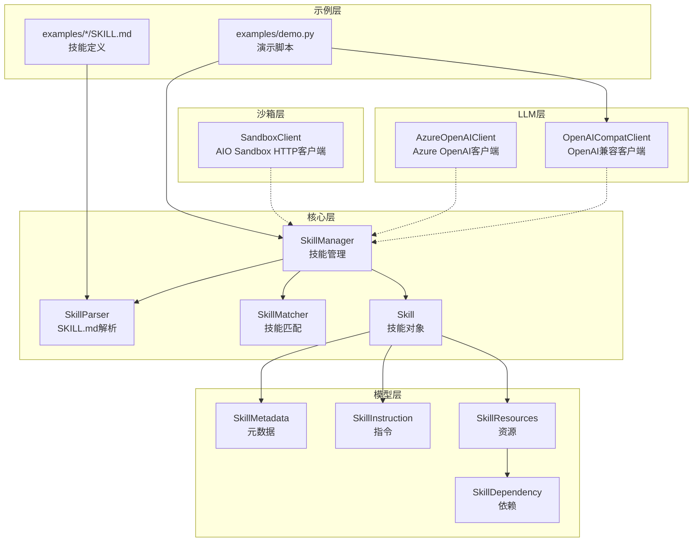
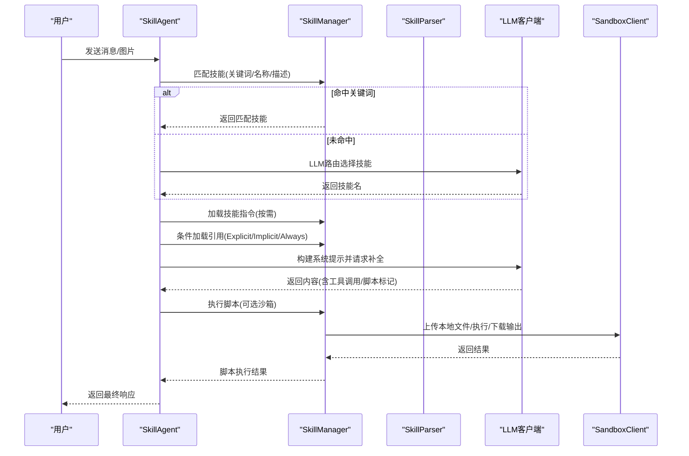
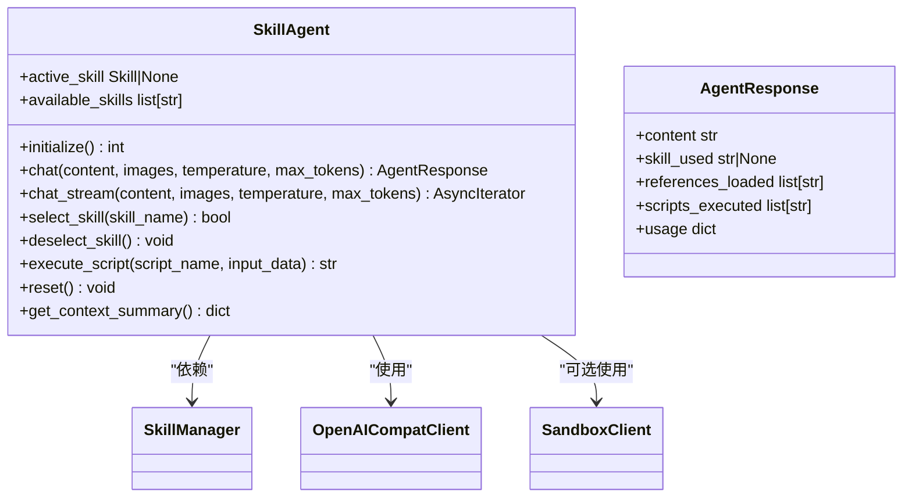
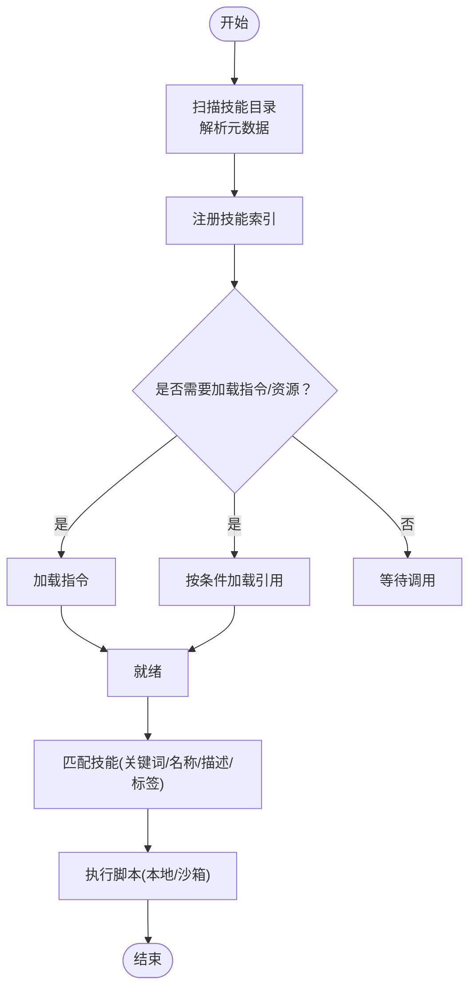
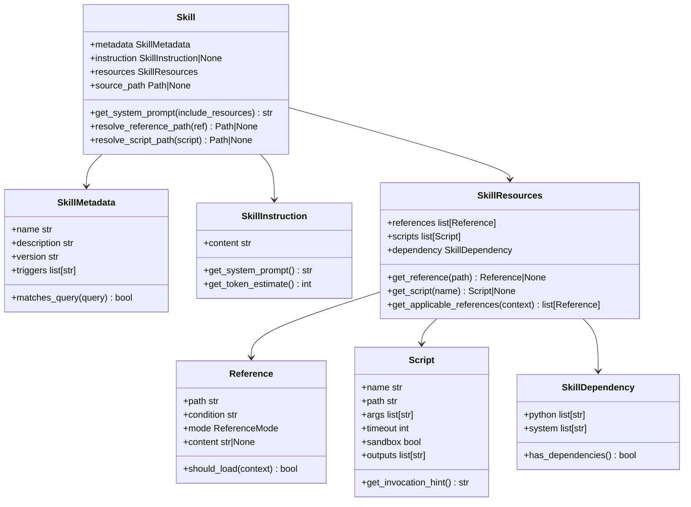
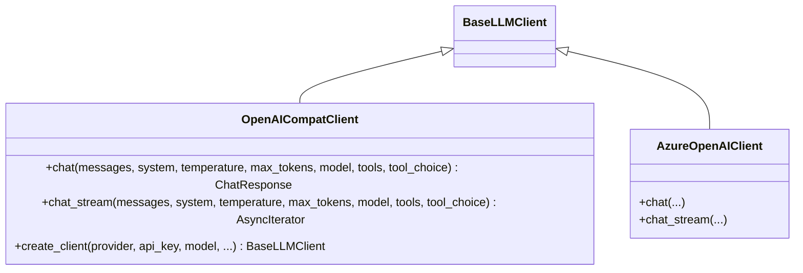
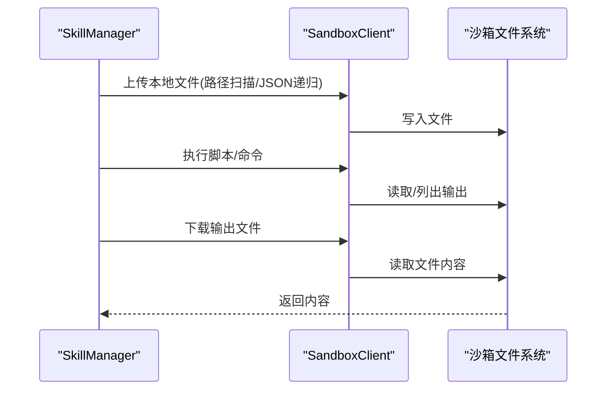
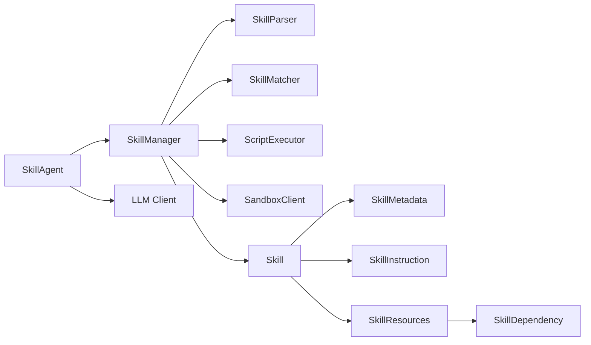

# 技能调用API

<cite>
**本文引用的文件**   
- [openskills/__init__.py](file://OpenSkills-main/openskills/__init__.py)
- [openskills/agent.py](file://OpenSkills-main/openskills/agent.py)
- [openskills/core/manager.py](file://OpenSkills-main/openskills/core/manager.py)
- [openskills/core/skill.py](file://OpenSkills-main/openskills/core/skill.py)
- [openskills/core/parser.py](file://OpenSkills-main/openskills/core/parser.py)
- [openskills/core/matcher.py](file://OpenSkills-main/openskills/core/matcher.py)
- [openskills/models/metadata.py](file://OpenSkills-main/openskills/models/metadata.py)
- [openskills/models/instruction.py](file://OpenSkills-main/openskills/models/instruction.py)
- [openskills/models/resource.py](file://OpenSkills-main/openskills/models/resource.py)
- [openskills/models/dependency.py](file://OpenSkills-main/openskills/models/dependency.py)
- [openskills/llm/openai_compat.py](file://OpenSkills-main/openskills/llm/openai_compat.py)
- [openskills/sandbox/client.py](file://OpenSkills-main/openskills/sandbox/client.py)
- [examples/demo.py](file://OpenSkills-main/examples/demo.py)
- [examples/prompt-optimizer/SKILL.md](file://OpenSkills-main/examples/prompt-optimizer/SKILL.md)
</cite>

## 目录
1. [简介](#简介)
2. [项目结构](#项目结构)
3. [核心组件](#核心组件)
4. [架构总览](#架构总览)
5. [详细组件分析](#详细组件分析)
6. [依赖分析](#依赖分析)
7. [性能考虑](#性能考虑)
8. [故障排查指南](#故障排查指南)
9. [结论](#结论)
10. [附录](#附录)

## 简介
本文件面向技能调用API的使用者与开发者，系统化阐述OpenSkills框架的技能发现、加载、执行与管理机制，覆盖以下主题：
- 技能调用API的调用流程、参数与返回值
- 技能配置文件SKILL.md的格式与字段说明
- 依赖管理与版本控制策略
- 开发规范、接口约定与最佳实践
- 调用示例、错误处理与重试机制
- 高级能力：脚本执行、沙箱隔离、文件同步与输出回传
- 测试方法、性能监控与调试工具使用

## 项目结构
OpenSkills采用“三层渐进披露”与“职责分离”的模块化设计：
- 核心层：技能对象、解析器、匹配器、管理器与执行器
- 模型层：元数据、指令、资源（引用与脚本）、依赖
- LLM适配层：OpenAI兼容客户端与Azure OpenAI客户端
- 沙箱层：HTTP客户端封装AIO Sandbox的命令、文件与代码执行能力
- 示例层：演示如何自动发现引用、LLM智能加载与脚本执行

图示来源
- [openskills/core/manager.py](file://OpenSkills-main/openskills/core/manager.py#L24-L523)
- [openskills/core/parser.py](file://OpenSkills-main/openskills/core/parser.py#L19-L225)
- [openskills/core/matcher.py](file://OpenSkills-main/openskills/core/matcher.py#L22-L221)
- [openskills/core/skill.py](file://OpenSkills-main/openskills/core/skill.py#L19-L150)
- [openskills/models/metadata.py](file://OpenSkills-main/openskills/models/metadata.py#L11-L83)
- [openskills/models/instruction.py](file://OpenSkills-main/openskills/models/instruction.py#L11-L48)
- [openskills/models/resource.py](file://OpenSkills-main/openskills/models/resource.py#L18-L204)
- [openskills/models/dependency.py](file://OpenSkills-main/openskills/models/dependency.py#L13-L87)
- [openskills/llm/openai_compat.py](file://OpenSkills-main/openskills/llm/openai_compat.py#L24-L609)
- [openskills/sandbox/client.py](file://OpenSkills-main/openskills/sandbox/client.py#L119-L986)
- [examples/demo.py](file://OpenSkills-main/examples/demo.py#L37-L290)
- [examples/prompt-optimizer/SKILL.md](file://OpenSkills-main/examples/prompt-optimizer/SKILL.md#L1-L131)

章节来源
- [openskills/__init__.py](file://OpenSkills-main/openskills/__init__.py#L1-L50)
- [openskills/core/manager.py](file://OpenSkills-main/openskills/core/manager.py#L24-L523)
- [openskills/core/parser.py](file://OpenSkills-main/openskills/core/parser.py#L19-L225)
- [openskills/core/matcher.py](file://OpenSkills-main/openskills/core/matcher.py#L22-L221)
- [openskills/core/skill.py](file://OpenSkills-main/openskills/core/skill.py#L19-L150)
- [openskills/models/metadata.py](file://OpenSkills-main/openskills/models/metadata.py#L11-L83)
- [openskills/models/instruction.py](file://OpenSkills-main/openskills/models/instruction.py#L11-L48)
- [openskills/models/resource.py](file://OpenSkills-main/openskills/models/resource.py#L18-L204)
- [openskills/models/dependency.py](file://OpenSkills-main/openskills/models/dependency.py#L13-L87)
- [openskills/llm/openai_compat.py](file://OpenSkills-main/openskills/llm/openai_compat.py#L24-L609)
- [openskills/sandbox/client.py](file://OpenSkills-main/openskills/sandbox/client.py#L119-L986)
- [examples/demo.py](file://OpenSkills-main/examples/demo.py#L37-L290)
- [examples/prompt-optimizer/SKILL.md](file://OpenSkills-main/examples/prompt-optimizer/SKILL.md#L1-L131)

## 核心组件
- SkillManager：技能生命周期管理入口，负责发现、注册、按需加载指令与资源、匹配技能、执行脚本与沙箱交互。
- Skill：技能对象，包含元数据、指令与资源三层结构，支持路径解析与系统提示拼装。
- SkillParser：SKILL.md解析器，支持仅元数据快速解析与完整内容解析。
- SkillMatcher：技能匹配器，基于触发词、名称、描述关键词与标签进行评分匹配。
- OpenAICompatClient/AzureOpenAIClient：LLM客户端，统一多供应商API，支持流式与非流式响应、工具调用与重试。
- SandboxClient：AIO Sandbox HTTP客户端，提供命令执行、文件读写/上传/下载、代码执行、包管理等能力。
- Agent（SkillAgent）：对话代理，自动技能选择、引用加载、脚本调用与状态管理。

章节来源
- [openskills/core/manager.py](file://OpenSkills-main/openskills/core/manager.py#L24-L523)
- [openskills/core/skill.py](file://OpenSkills-main/openskills/core/skill.py#L19-L150)
- [openskills/core/parser.py](file://OpenSkills-main/openskills/core/parser.py#L19-L225)
- [openskills/core/matcher.py](file://OpenSkills-main/openskills/core/matcher.py#L22-L221)
- [openskills/llm/openai_compat.py](file://OpenSkills-main/openskills/llm/openai_compat.py#L24-L609)
- [openskills/sandbox/client.py](file://OpenSkills-main/openskills/sandbox/client.py#L119-L986)
- [openskills/agent.py](file://OpenSkills-main/openskills/agent.py#L61-L858)

## 架构总览
OpenSkills遵循“渐进披露”：仅在发现阶段加载元数据，按需加载指令，条件加载引用，执行脚本时才加载资源与进入沙箱。Agent在对话中根据上下文动态构建系统提示，注入技能指令与引用，并在允许的情况下执行脚本。

图示来源
- [openskills/agent.py](file://OpenSkills-main/openskills/agent.py#L228-L403)
- [openskills/core/manager.py](file://OpenSkills-main/openskills/core/manager.py#L265-L361)
- [openskills/llm/openai_compat.py](file://OpenSkills-main/openskills/llm/openai_compat.py#L76-L284)
- [openskills/sandbox/client.py](file://OpenSkills-main/openskills/sandbox/client.py#L665-L712)

## 详细组件分析

### 组件A：SkillAgent（对话代理）
- 角色与职责
  - 自动发现与初始化技能
  - 技能选择：关键词命中优先，否则由LLM路由
  - 引用加载：先加载Always，再由LLM评估Explicit/Implicit
  - 构建系统提示：包含历史摘要、召回的完整内容、活动技能指令与可用动作
  - 脚本执行：解析响应中的脚本调用标记并执行
- 关键参数
  - skill_paths：技能目录列表
  - llm_client：LLM客户端实例
  - auto_select_skill/auto_load_references/auto_execute_scripts/use_sandbox：行为开关
  - sandbox_base_url：沙箱服务地址
  - 回调：on_skill_selected/on_reference_loaded/on_script_executed
- 返回值
  - AgentResponse：content、skill_used、references_loaded、scripts_executed、usage

图示来源
- [openskills/agent.py](file://OpenSkills-main/openskills/agent.py#L61-L858)

章节来源
- [openskills/agent.py](file://OpenSkills-main/openskills/agent.py#L61-L858)

### 组件B：SkillManager（技能管理）
- 发现与注册：扫描目录，解析SKILL.md为元数据，建立索引
- 指令加载：按需加载完整指令内容
- 引用加载：按条件加载引用文件内容
- 脚本执行：本地或沙箱执行，自动文件上传/下载与依赖安装
- 匹配：基于关键词、名称、描述与标签的评分匹配

图示来源
- [openskills/core/manager.py](file://OpenSkills-main/openskills/core/manager.py#L116-L523)

章节来源
- [openskills/core/manager.py](file://OpenSkills-main/openskills/core/manager.py#L24-L523)

### 组件C：Skill（技能对象）
- 三层结构：元数据（总是加载）、指令（按需加载）、资源（条件加载）
- 资源：引用（Reference）与脚本（Script），支持模式（Always/Explicit/Implicit）与条件
- 路径解析：相对路径解析为绝对路径，便于加载与执行

图示来源
- [openskills/core/skill.py](file://OpenSkills-main/openskills/core/skill.py#L19-L150)
- [openskills/models/metadata.py](file://OpenSkills-main/openskills/models/metadata.py#L11-L83)
- [openskills/models/instruction.py](file://OpenSkills-main/openskills/models/instruction.py#L11-L48)
- [openskills/models/resource.py](file://OpenSkills-main/openskills/models/resource.py#L45-L204)
- [openskills/models/dependency.py](file://OpenSkills-main/openskills/models/dependency.py#L13-L87)

章节来源
- [openskills/core/skill.py](file://OpenSkills-main/openskills/core/skill.py#L19-L150)
- [openskills/models/resource.py](file://OpenSkills-main/openskills/models/resource.py#L18-L204)

### 组件D：LLM客户端（OpenAI兼容/Azure）
- OpenAICompatClient：统一OpenAI/Claude/Ollama/Together/Groq/DeepSeek等兼容API
- AzureOpenAIClient：Azure OpenAI专用URL与认证头
- 特性：多模态消息、流式响应、工具调用、指数退避重试

图示来源
- [openskills/llm/openai_compat.py](file://OpenSkills-main/openskills/llm/openai_compat.py#L24-L609)

章节来源
- [openskills/llm/openai_compat.py](file://OpenSkills-main/openskills/llm/openai_compat.py#L24-L609)

### 组件E：沙箱客户端（AIO Sandbox）
- 能力：Shell命令、文件操作（读写/上传/下载/搜索）、代码执行、包管理、浏览器自动化、Jupyter集成、终端WebSocket
- 与SkillManager协作：自动上传本地文件、执行脚本、下载输出

图示来源
- [openskills/core/manager.py](file://OpenSkills-main/openskills/core/manager.py#L319-L493)
- [openskills/sandbox/client.py](file://OpenSkills-main/openskills/sandbox/client.py#L665-L712)

章节来源
- [openskills/sandbox/client.py](file://OpenSkills-main/openskills/sandbox/client.py#L119-L986)
- [openskills/core/manager.py](file://OpenSkills-main/openskills/core/manager.py#L319-L493)

## 依赖分析
- 组件耦合
  - SkillAgent依赖SkillManager与LLM客户端；可选依赖SandboxClient
  - SkillManager依赖SkillParser、SkillMatcher、ScriptExecutor与SandboxClient
  - Skill对象聚合元数据、指令与资源，资源内含依赖配置
- 外部依赖
  - httpx用于异步HTTP请求
  - pydantic用于数据模型校验与序列化
  - AIO Sandbox服务（可选）

图示来源
- [openskills/agent.py](file://OpenSkills-main/openskills/agent.py#L18-L28)
- [openskills/core/manager.py](file://OpenSkills-main/openskills/core/manager.py#L15-L21)
- [openskills/core/skill.py](file://OpenSkills-main/openskills/core/skill.py#L14-L16)
- [openskills/models/resource.py](file://OpenSkills-main/openskills/models/resource.py#L24-L25)

章节来源
- [openskills/agent.py](file://OpenSkills-main/openskills/agent.py#L18-L28)
- [openskills/core/manager.py](file://OpenSkills-main/openskills/core/manager.py#L15-L21)
- [openskills/core/skill.py](file://OpenSkills-main/openskills/core/skill.py#L14-L16)
- [openskills/models/resource.py](file://OpenSkills-main/openskills/models/resource.py#L24-L25)

## 性能考虑
- 渐进披露降低内存占用：仅在发现阶段加载元数据，按需加载指令与引用
- 引用条件评估：先加载Always，再通过LLM评估Explicit/Implicit，避免不必要的上下文消耗
- 流式响应：支持流式补全，提升交互体验
- 沙箱文件同步：仅在需要时上传/下载，减少网络开销
- Token估算：指令层提供粗略token估算，辅助上下文规划

## 故障排查指南
- LLM连接失败/超时
  - 检查API密钥、Base URL与模型名称
  - 使用指数退避重试机制，确认网络连通性
- 沙箱不可达
  - 确认沙箱服务地址与健康检查
  - 检查上传/下载权限与路径
- 脚本执行异常
  - 查看SandboxExecutionError与stderr
  - 确认脚本路径、依赖与输出目录
- 技能未被发现
  - 确认SKILL.md存在且frontmatter完整
  - 检查目录权限与文件编码

章节来源
- [openskills/llm/openai_compat.py](file://OpenSkills-main/openskills/llm/openai_compat.py#L255-L284)
- [openskills/sandbox/client.py](file://OpenSkills-main/openskills/sandbox/client.py#L104-L116)
- [openskills/core/manager.py](file://OpenSkills-main/openskills/core/manager.py#L319-L360)

## 结论
OpenSkills通过清晰的三层结构与渐进披露机制，实现了高效、可扩展的技能系统。其API围绕SkillAgent展开，具备自动技能选择、智能引用加载、脚本执行与沙箱隔离能力。配合完善的模型与客户端抽象，开发者可以快速构建稳定可靠的技能应用。

## 附录

### 技能调用API参考

- 方法：SkillAgent.chat
  - 参数
    - content：用户消息文本
    - images：可选图像内容列表
    - temperature：采样温度
    - max_tokens：最大生成长度
    - 其他LLM参数
  - 返回：AgentResponse
    - content：LLM回复
    - skill_used：使用的技能名
    - references_loaded：本次加载的引用路径
    - scripts_executed：执行的脚本名列表
    - usage：用量统计

- 方法：SkillAgent.chat_stream
  - 行为：与chat类似，但逐块返回流式内容
  - 返回：异步迭代器，逐块产出内容

- 方法：SkillAgent.select_skill/deselect_skill
  - 作用：手动选择/取消当前技能

- 方法：SkillAgent.execute_script
  - 作用：在当前技能下执行脚本
  - 参数：script_name、input_data
  - 返回：脚本输出字符串

- 方法：SkillAgent.reset/get_context_summary
  - 作用：重置对话上下文、获取摘要信息

章节来源
- [openskills/agent.py](file://OpenSkills-main/openskills/agent.py#L228-L403)
- [openskills/agent.py](file://OpenSkills-main/openskills/agent.py#L762-L783)
- [openskills/agent.py](file://OpenSkills-main/openskills/agent.py#L181-L227)
- [openskills/agent.py](file://OpenSkills-main/openskills/agent.py#L785-L794)

### 技能配置文件SKILL.md格式
- 必填字段（frontmatter）
  - name：技能唯一标识
  - description：技能描述
- 可选字段（frontmatter）
  - version：语义化版本
  - triggers：触发关键词列表
  - author/tags：作者与标签
  - dependency：依赖配置（python/system）
  - references/scripts：资源定义（可省略，自动发现）
- 身体内容（Layer 2）
  - 技能完整说明、工作流、注意事项等

章节来源
- [openskills/core/parser.py](file://OpenSkills-main/openskills/core/parser.py#L102-L173)
- [openskills/models/metadata.py](file://OpenSkills-main/openskills/models/metadata.py#L20-L53)
- [openskills/models/dependency.py](file://OpenSkills-main/openskills/models/dependency.py#L13-L87)
- [examples/prompt-optimizer/SKILL.md](file://OpenSkills-main/examples/prompt-optimizer/SKILL.md#L1-L6)

### 依赖管理与版本控制
- 依赖类型
  - Python包：pip安装命令
  - 系统命令：安装/准备步骤
- 版本控制
  - 使用语义化版本号
  - 通过dependency字段声明，沙箱执行前自动安装

章节来源
- [openskills/models/dependency.py](file://OpenSkills-main/openskills/models/dependency.py#L13-L87)
- [openskills/core/manager.py](file://OpenSkills-main/openskills/core/manager.py#L319-L360)

### 开发规范与最佳实践
- 目录结构
  - SKILL.md位于技能根目录
  - references/ 与 scripts/ 子目录存放引用与脚本
- 引用模式
  - Always：始终加载（如安全规范）
  - Explicit：带条件，由LLM评估
  - Implicit：通用知识，由LLM决定是否加载
- 脚本规范
  - 明确参数与超时
  - 指定输出路径以便沙箱回传
- 安全建议
  - 默认关闭自动脚本执行，必要时显式开启
  - 使用沙箱隔离执行不受信任脚本

章节来源
- [openskills/models/resource.py](file://OpenSkills-main/openskills/models/resource.py#L38-L178)
- [openskills/agent.py](file://OpenSkills-main/openskills/agent.py#L92-L115)

### 调用示例与演示
- 示例脚本
  - 展示自动发现引用、LLM智能选择引用、Azure OpenAI支持与沙箱模式
- 运行方式
  - 准备OPENAI_API_KEY或AZURE相关环境变量
  - 启动沙箱服务（可选）
  - 运行演示脚本

章节来源
- [examples/demo.py](file://OpenSkills-main/examples/demo.py#L37-L290)

### 错误处理与重试机制
- LLM客户端
  - 对5xx与限流错误进行指数退避重试
- 沙箱客户端
  - 连接失败抛出SandboxConnectionError
  - 命令失败抛出SandboxExecutionError
- 脚本执行
  - 捕获异常并继续流程，不阻断对话

章节来源
- [openskills/llm/openai_compat.py](file://OpenSkills-main/openskills/llm/openai_compat.py#L255-L284)
- [openskills/sandbox/client.py](file://OpenSkills-main/openskills/sandbox/client.py#L104-L116)
- [openskills/agent.py](file://OpenSkills-main/openskills/agent.py#L734-L760)

### 高级功能：脚本执行与沙箱
- 文件同步
  - 自动扫描输入数据中的文件路径并上传
  - 执行后将指定输出路径回传到本地
- 依赖安装
  - 按技能依赖自动安装Python包与执行系统命令
- 输出回传
  - 支持目录递归下载，保留子目录结构

章节来源
- [openskills/core/manager.py](file://OpenSkills-main/openskills/core/manager.py#L319-L493)
- [openskills/sandbox/client.py](file://OpenSkills-main/openskills/sandbox/client.py#L665-L712)

### 测试方法、性能监控与调试
- 测试
  - 使用示例脚本进行端到端验证
  - 单元测试覆盖匹配、解析与执行逻辑
- 性能监控
  - 使用AgentResponse.usage统计token与耗时
  - 通过日志与回调观察引用加载与脚本执行
- 调试
  - 启用沙箱日志与终端WebSocket
  - 使用回调函数追踪技能选择与引用加载

章节来源
- [openskills/agent.py](file://OpenSkills-main/openskills/agent.py#L38-L58)
- [openskills/agent.py](file://OpenSkills-main/openskills/agent.py#L96-L115)
- [openskills/sandbox/client.py](file://OpenSkills-main/openskills/sandbox/client.py#L220-L258)