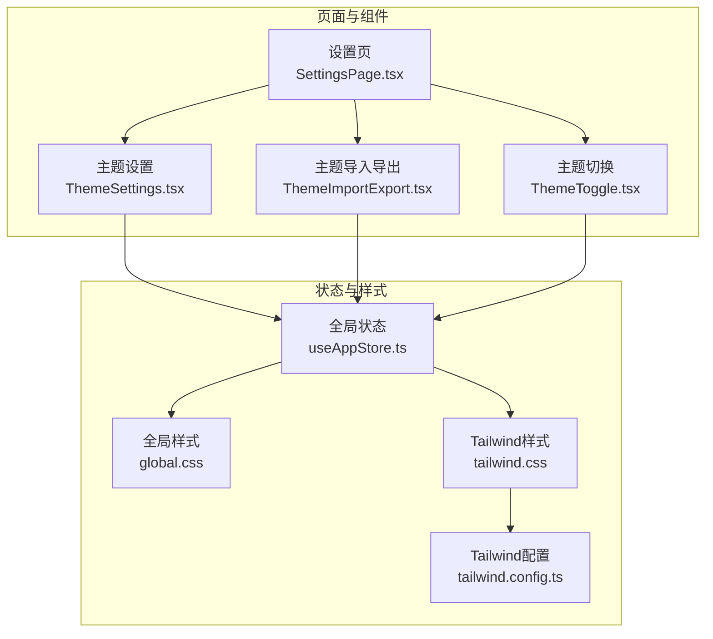
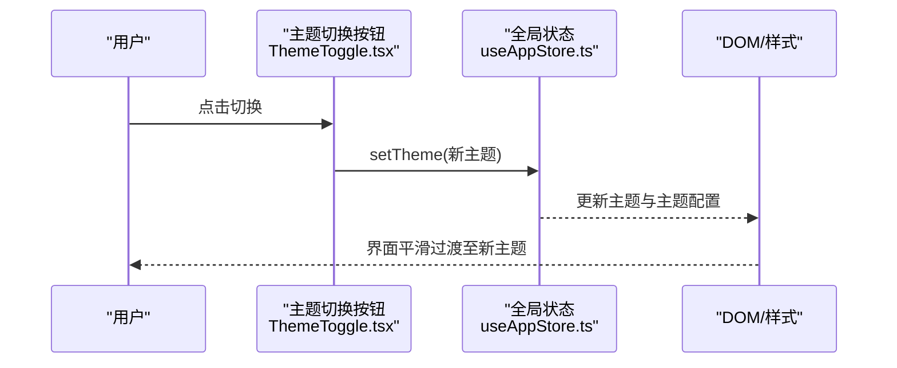
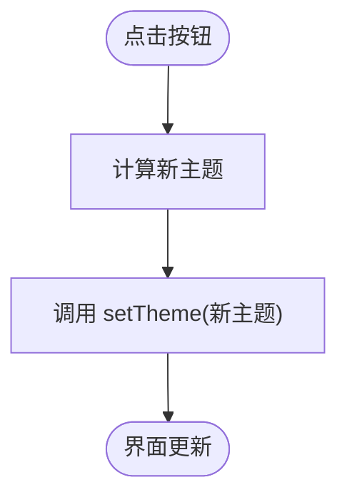
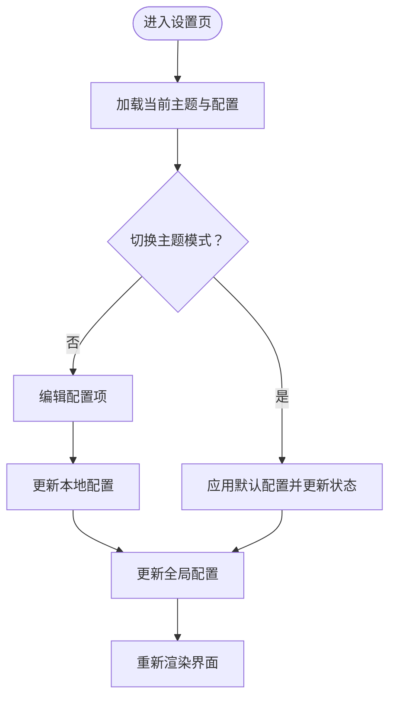
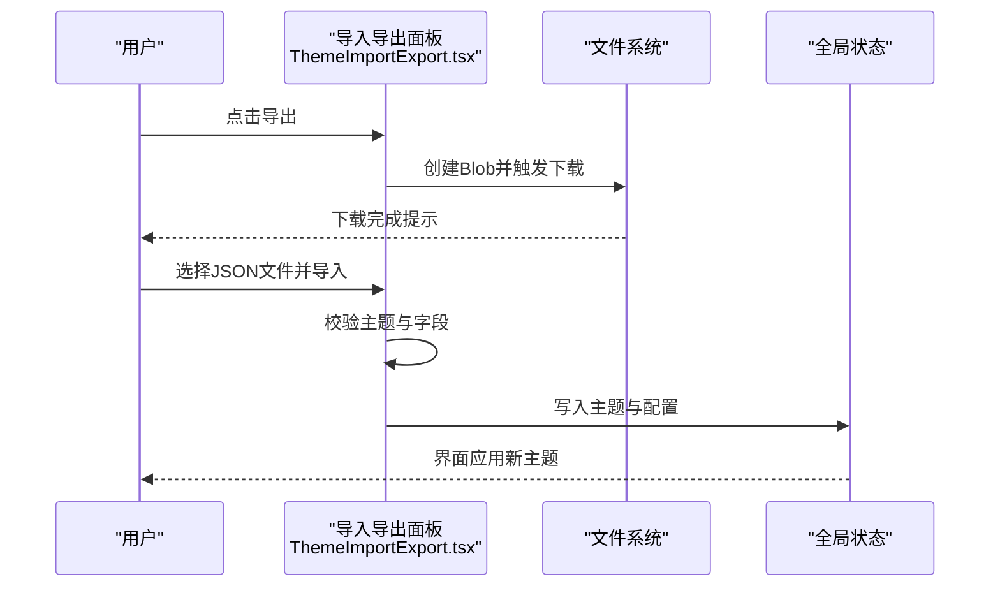
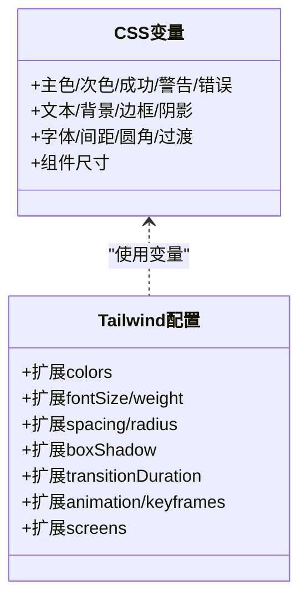
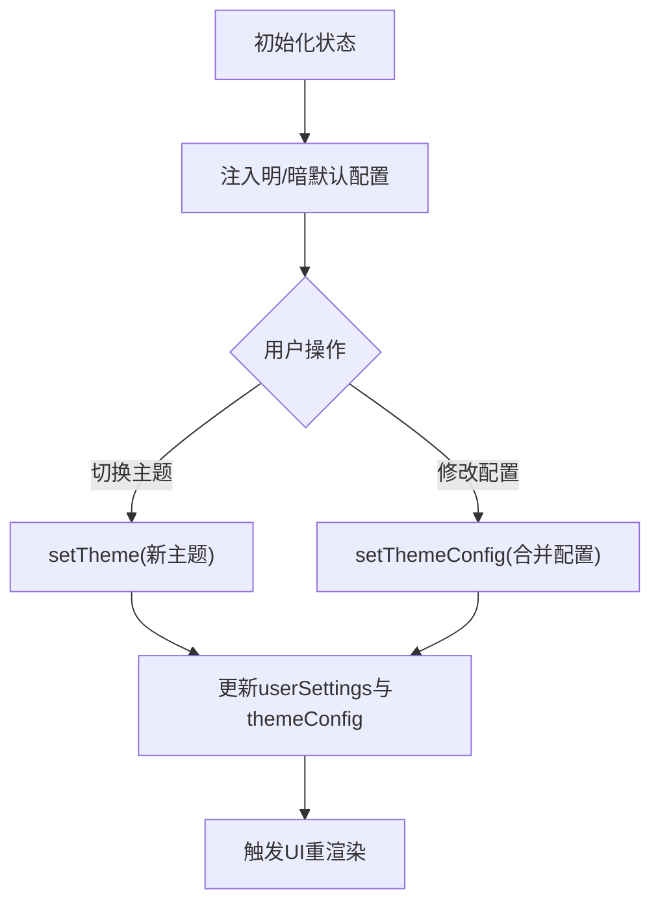
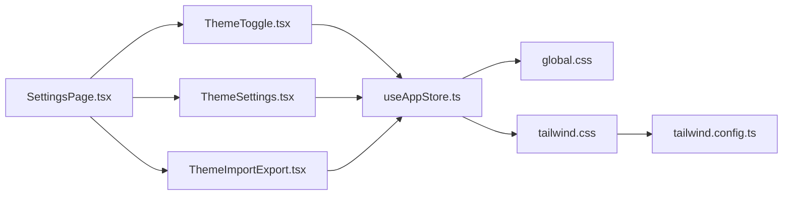

# 主题系统

<cite>
**本文引用的文件**
- [ThemeSettings.tsx](file://src/components/theme/ThemeSettings.tsx)
- [ThemeToggle.tsx](file://src/components/theme/ThemeToggle.tsx)
- [ThemeImportExport.tsx](file://src/components/theme/ThemeImportExport.tsx)
- [useAppStore.ts](file://src/store/useAppStore.ts)
- [global.css](file://src/styles/global.css)
- [tailwind.css](file://src/styles/tailwind.css)
- [tailwind.config.ts](file://tailwind.config.ts)
- [SettingsPage.tsx](file://src/pages/SettingsPage.tsx)
- [main.tsx](file://src/main.tsx)
- [主题模块.md](file://docs/业务功能模块/主题模块.md)
</cite>

## 目录
1. [简介](#简介)
2. [项目结构](#项目结构)
3. [核心组件](#核心组件)
4. [架构总览](#架构总览)
5. [组件详解](#组件详解)
6. [依赖关系分析](#依赖关系分析)
7. [性能考量](#性能考量)
8. [故障排查指南](#故障排查指南)
9. [结论](#结论)
10. [附录](#附录)

## 简介
本文件面向AutoMate主题系统，系统性阐述主题配置管理、明暗主题切换机制、自定义主题开发与持久化策略；解释CSS变量体系、Tailwind样式定制与主题组件设计；提供最佳实践、颜色搭配指南与视觉规范；说明与系统设置的集成与用户偏好管理，并给出主题扩展与第三方主题支持的实现思路。

## 项目结构
主题系统由“UI组件 + 全局样式 + 状态管理 + 页面容器”四部分构成：
- UI组件：主题切换按钮、主题设置面板、主题导入导出面板
- 全局样式：CSS变量与深色类名、Tailwind基础与扩展
- 状态管理：Zustand全局状态，集中管理主题与配置
- 页面容器：设置页聚合主题组件

图表来源
- [SettingsPage.tsx](file://src/pages/SettingsPage.tsx#L1-L32)
- [ThemeSettings.tsx](file://src/components/theme/ThemeSettings.tsx#L1-L149)
- [ThemeToggle.tsx](file://src/components/theme/ThemeToggle.tsx#L1-L39)
- [ThemeImportExport.tsx](file://src/components/theme/ThemeImportExport.tsx#L1-L168)
- [useAppStore.ts](file://src/store/useAppStore.ts#L35-L107)
- [global.css](file://src/styles/global.css#L1-L104)
- [tailwind.css](file://src/styles/tailwind.css#L1-L3)
- [tailwind.config.ts](file://tailwind.config.ts#L1-L161)

章节来源
- [SettingsPage.tsx](file://src/pages/SettingsPage.tsx#L1-L32)
- [ThemeSettings.tsx](file://src/components/theme/ThemeSettings.tsx#L1-L149)
- [ThemeToggle.tsx](file://src/components/theme/ThemeToggle.tsx#L1-L39)
- [ThemeImportExport.tsx](file://src/components/theme/ThemeImportExport.tsx#L1-L168)
- [useAppStore.ts](file://src/store/useAppStore.ts#L35-L107)
- [global.css](file://src/styles/global.css#L1-L104)
- [tailwind.css](file://src/styles/tailwind.css#L1-L3)
- [tailwind.config.ts](file://tailwind.config.ts#L1-L161)

## 核心组件
- 主题切换按钮：基于全局状态切换明暗主题
- 主题设置面板：提供主题模式、主辅色、字号、字重、动画等配置
- 主题导入导出：以JSON格式导出/校验/应用主题配置
- 全局样式：CSS变量与深色类名，配合Tailwind实现主题化
- 全局状态：集中管理主题与配置，驱动UI与样式更新

章节来源
- [ThemeToggle.tsx](file://src/components/theme/ThemeToggle.tsx#L1-L39)
- [ThemeSettings.tsx](file://src/components/theme/ThemeSettings.tsx#L1-L149)
- [ThemeImportExport.tsx](file://src/components/theme/ThemeImportExport.tsx#L1-L168)
- [useAppStore.ts](file://src/store/useAppStore.ts#L35-L107)
- [global.css](file://src/styles/global.css#L1-L104)
- [tailwind.css](file://src/styles/tailwind.css#L1-L3)

## 架构总览
主题系统采用“组件-状态-样式”的分层架构：
- 组件层：负责用户交互与配置收集
- 状态层：Zustand集中管理主题与配置，提供setter与派生状态
- 样式层：CSS变量与Tailwind扩展，通过深色类名与动画变量实现主题化

图表来源
- [ThemeToggle.tsx](file://src/components/theme/ThemeToggle.tsx#L1-L39)
- [useAppStore.ts](file://src/store/useAppStore.ts#L262-L270)
- [global.css](file://src/styles/global.css#L144-L154)

章节来源
- [ThemeToggle.tsx](file://src/components/theme/ThemeToggle.tsx#L1-L39)
- [useAppStore.ts](file://src/store/useAppStore.ts#L262-L270)
- [global.css](file://src/styles/global.css#L144-L154)

## 组件详解

### 主题切换按钮（ThemeToggle）
- 功能：在明/暗主题间切换，更新全局状态
- 交互：点击切换主题，图标随主题变化
- 样式：根据当前主题自动调整悬停与文字颜色

图表来源
- [ThemeToggle.tsx](file://src/components/theme/ThemeToggle.tsx#L9-L12)
- [useAppStore.ts](file://src/store/useAppStore.ts#L262-L270)

章节来源
- [ThemeToggle.tsx](file://src/components/theme/ThemeToggle.tsx#L1-L39)
- [useAppStore.ts](file://src/store/useAppStore.ts#L262-L270)

### 主题设置面板（ThemeSettings）
- 功能：切换主题模式、调整主辅色、字号、字重、动画开关与时长
- 默认值：明/暗主题分别内置默认配置
- 行为：变更即时更新本地与全局状态，支持一键重置

图表来源
- [ThemeSettings.tsx](file://src/components/theme/ThemeSettings.tsx#L34-L50)
- [ThemeSettings.tsx](file://src/components/theme/ThemeSettings.tsx#L40-L44)
- [useAppStore.ts](file://src/store/useAppStore.ts#L272-L284)

章节来源
- [ThemeSettings.tsx](file://src/components/theme/ThemeSettings.tsx#L1-L149)
- [useAppStore.ts](file://src/store/useAppStore.ts#L85-L107)
- [useAppStore.ts](file://src/store/useAppStore.ts#L272-L284)

### 主题导入导出（ThemeImportExport）
- 导出：将当前主题与配置序列化为JSON文件，含导出时间戳
- 导入：读取JSON文件，校验主题模式与必要字段，成功后弹窗提示
- 错误处理：格式错误、缺失字段、解析异常均有明确提示

图表来源
- [ThemeImportExport.tsx](file://src/components/theme/ThemeImportExport.tsx#L34-L55)
- [ThemeImportExport.tsx](file://src/components/theme/ThemeImportExport.tsx#L57-L100)
- [useAppStore.ts](file://src/store/useAppStore.ts#L272-L284)

章节来源
- [ThemeImportExport.tsx](file://src/components/theme/ThemeImportExport.tsx#L1-L168)
- [useAppStore.ts](file://src/store/useAppStore.ts#L272-L284)

### 全局样式与Tailwind定制
- CSS变量：在根节点与深色类下定义主色、文本、背景、边框、阴影、字体、间距、圆角、过渡与组件尺寸等变量
- Tailwind扩展：在配置中扩展colors、fontFamily、fontSize、fontWeight、spacing、borderRadius、boxShadow、transitionDuration、animation/keyframes与screens
- 深色模式：通过class模式启用，结合CSS变量实现主题切换

图表来源
- [global.css](file://src/styles/global.css#L1-L104)
- [global.css](file://src/styles/global.css#L106-L129)
- [tailwind.config.ts](file://tailwind.config.ts#L11-L37)
- [tailwind.config.ts](file://tailwind.config.ts#L53-L89)
- [tailwind.config.ts](file://tailwind.config.ts#L98-L146)

章节来源
- [global.css](file://src/styles/global.css#L1-L104)
- [global.css](file://src/styles/global.css#L106-L129)
- [tailwind.config.ts](file://tailwind.config.ts#L1-L161)

### 全局状态与主题持久化
- 状态模型：包含主题模式与主题配置对象，提供setter与合并更新
- 默认配置：明/暗主题各自默认配置常量
- 更新策略：切换主题时同时更新主题与配置；修改配置时合并更新

图表来源
- [useAppStore.ts](file://src/store/useAppStore.ts#L115-L125)
- [useAppStore.ts](file://src/store/useAppStore.ts#L85-L107)
- [useAppStore.ts](file://src/store/useAppStore.ts#L262-L284)

章节来源
- [useAppStore.ts](file://src/store/useAppStore.ts#L35-L107)
- [useAppStore.ts](file://src/store/useAppStore.ts#L262-L284)

## 依赖关系分析
- 组件依赖全局状态：ThemeToggle、ThemeSettings、ThemeImportExport均通过useAppStore读取与更新主题状态
- 样式依赖：全局样式与Tailwind配置共同决定主题外观；深色类名与CSS变量驱动主题切换
- 页面依赖：设置页聚合主题组件，统一承载主题功能入口

图表来源
- [ThemeToggle.tsx](file://src/components/theme/ThemeToggle.tsx#L1-L39)
- [ThemeSettings.tsx](file://src/components/theme/ThemeSettings.tsx#L1-L149)
- [ThemeImportExport.tsx](file://src/components/theme/ThemeImportExport.tsx#L1-L168)
- [useAppStore.ts](file://src/store/useAppStore.ts#L1-L83)
- [global.css](file://src/styles/global.css#L1-L104)
- [tailwind.css](file://src/styles/tailwind.css#L1-L3)
- [tailwind.config.ts](file://tailwind.config.ts#L1-L161)
- [SettingsPage.tsx](file://src/pages/SettingsPage.tsx#L1-L32)

章节来源
- [ThemeToggle.tsx](file://src/components/theme/ThemeToggle.tsx#L1-L39)
- [ThemeSettings.tsx](file://src/components/theme/ThemeSettings.tsx#L1-L149)
- [ThemeImportExport.tsx](file://src/components/theme/ThemeImportExport.tsx#L1-L168)
- [useAppStore.ts](file://src/store/useAppStore.ts#L1-L83)
- [global.css](file://src/styles/global.css#L1-L104)
- [tailwind.css](file://src/styles/tailwind.css#L1-L3)
- [tailwind.config.ts](file://tailwind.config.ts#L1-L161)
- [SettingsPage.tsx](file://src/pages/SettingsPage.tsx#L1-L32)

## 性能考量
- 动画与过渡：通过CSS变量控制过渡时长，减少重复计算；在系统“减少动态效果”偏好下自动降级
- 渲染优化：主题切换仅更新根节点与深色类名，避免全量重排
- 样式体积：Tailwind按需扫描源文件，避免未使用类导致的体积膨胀
- 状态更新：Zustand局部状态更新，降低无关组件重渲染

章节来源
- [global.css](file://src/styles/global.css#L210-L218)
- [tailwind.config.ts](file://tailwind.config.ts#L4-L7)

## 故障排查指南
- 主题切换无效
  - 检查全局状态是否正确调用setTheme
  - 确认深色类名是否正确挂载于根节点
- 导入失败
  - 校验JSON格式与必填字段（主题模式与主/辅/文本/背景/边框等）
  - 查看控制台错误信息与提示文案
- 样式异常
  - 确认Tailwind配置中的扩展项与CSS变量一致
  - 检查深色模式class开关与darkMode配置

章节来源
- [ThemeImportExport.tsx](file://src/components/theme/ThemeImportExport.tsx#L57-L100)
- [useAppStore.ts](file://src/store/useAppStore.ts#L262-L270)
- [tailwind.config.ts](file://tailwind.config.ts#L8)

## 结论
AutoMate主题系统以Zustand集中管理主题与配置，结合CSS变量与Tailwind扩展，实现明暗主题的平滑切换与可定制化。组件化设计使主题功能易于扩展与维护；导入导出能力便于用户备份与分享。整体架构清晰、耦合度低、可扩展性强，满足多场景下的主题需求。

## 附录

### 最佳实践
- 使用CSS变量统一管理颜色与尺寸，避免硬编码
- 在Tailwind配置中扩展常用变量，保持设计一致性
- 为关键交互提供过渡动画，提升用户体验
- 提供一键重置功能，便于恢复默认主题

### 颜色搭配与视觉规范
- 主色调与辅助色应符合品牌定位，确保对比度与可读性
- 明/暗主题的颜色梯度应保证文本与背景的可读性
- 动画时长与缓动函数应与整体交互节奏一致

### 与系统设置集成
- 可监听系统深色模式偏好，提供自动跟随策略
- 在设置页提供“跟随系统”选项，结合全局状态实现联动

### 自定义主题开发与第三方主题支持
- 导出格式：包含主题模式与主题配置对象
- 第三方主题：提供标准JSON模板，校验必填字段后导入
- 扩展点：新增颜色、字体、动画等变量，完善Tailwind扩展

章节来源
- [ThemeImportExport.tsx](file://src/components/theme/ThemeImportExport.tsx#L146-L164)
- [主题模块.md](file://docs/业务功能模块/主题模块.md#L78-L101)
- [主题模块.md](file://docs/业务功能模块/主题模块.md#L111-L123)