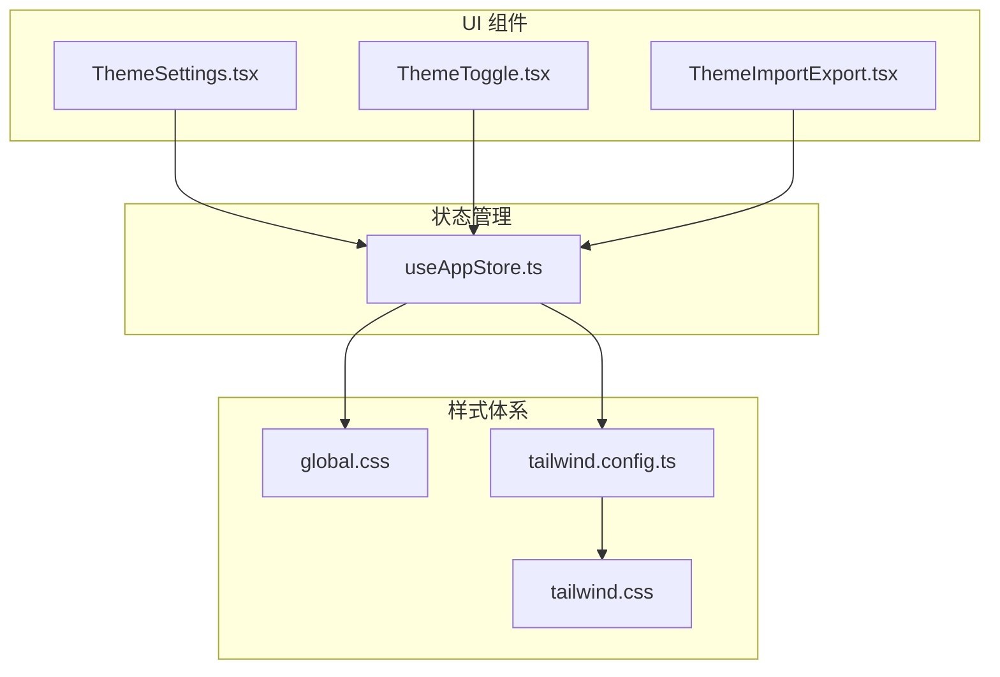
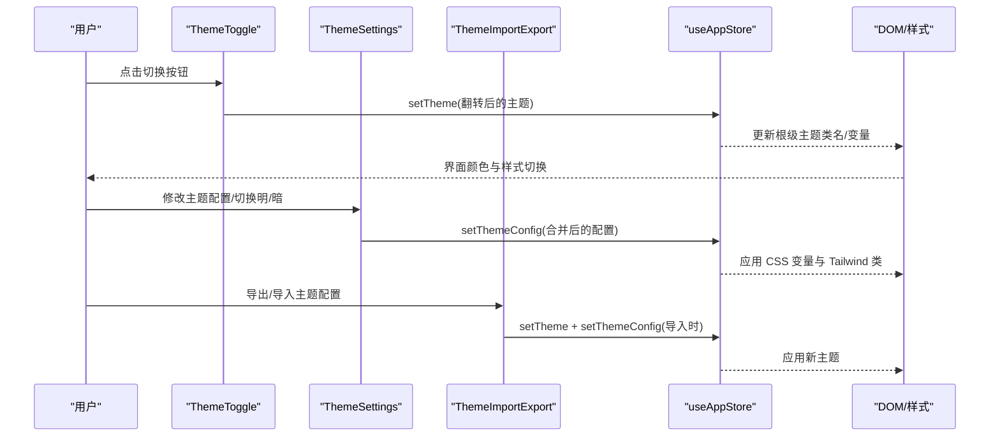
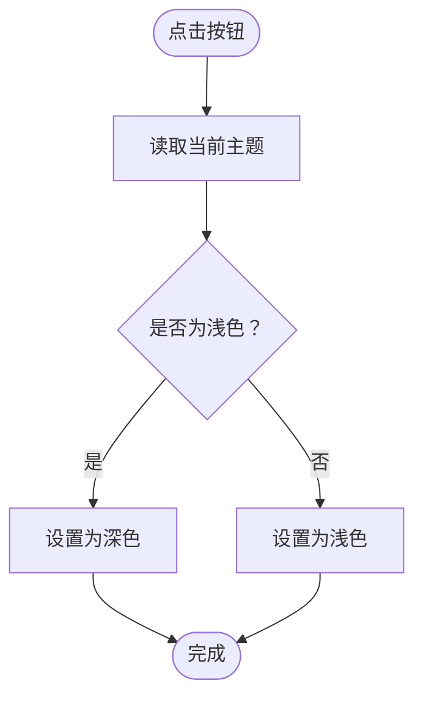
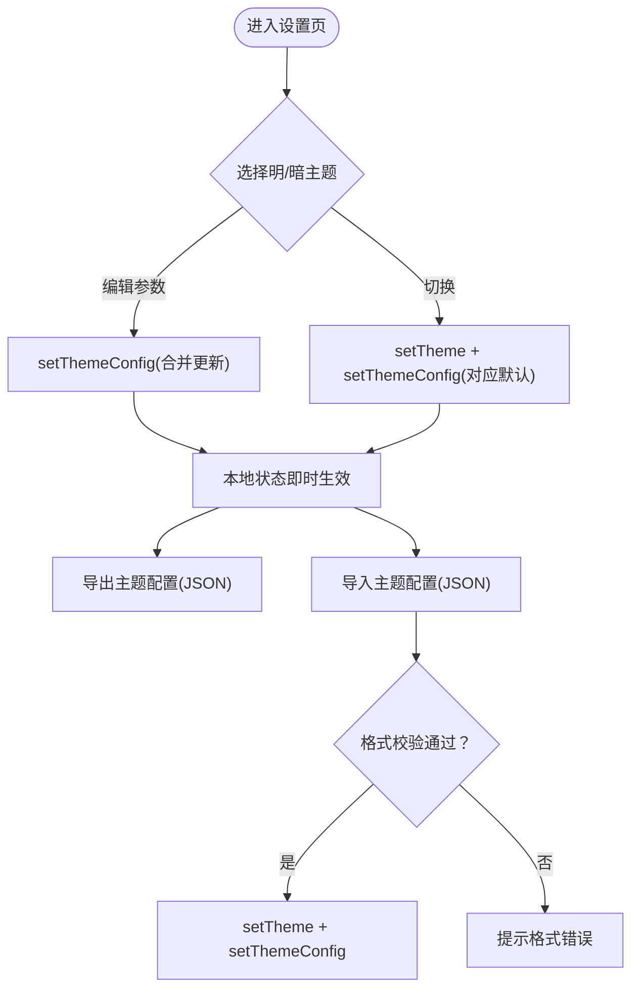
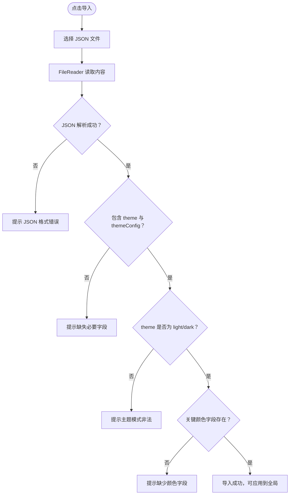
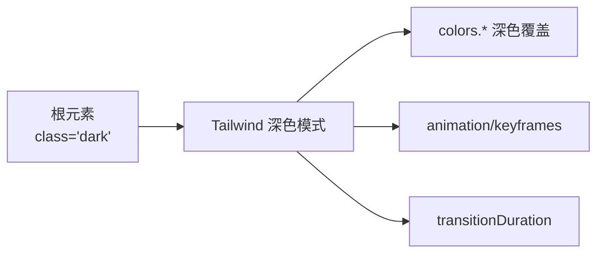
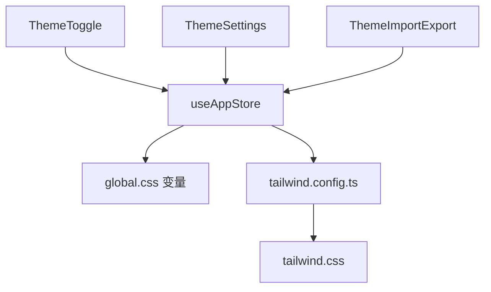

# 主题系统

<cite>
**本文引用的文件**   
- [ThemeSettings.tsx](file://src/components/theme/ThemeSettings.tsx)
- [ThemeToggle.tsx](file://src/components/theme/ThemeToggle.tsx)
- [ThemeImportExport.tsx](file://src/components/theme/ThemeImportExport.tsx)
- [useAppStore.ts](file://src/store/useAppStore.ts)
- [global.css](file://src/styles/global.css)
- [tailwind.css](file://src/styles/tailwind.css)
- [tailwind.config.ts](file://tailwind.config.ts)
- [SettingsPage.tsx](file://src/pages/SettingsPage.tsx)
- [main.tsx](file://src/main.tsx)
- [主题模块.md](file://docs/业务功能模块/主题模块.md)
</cite>

## 目录
1. [简介](#简介)
2. [项目结构](#项目结构)
3. [核心组件](#核心组件)
4. [架构总览](#架构总览)
5. [组件详解](#组件详解)
6. [依赖关系分析](#依赖关系分析)
7. [性能考量](#性能考量)
8. [故障排查指南](#故障排查指南)
9. [结论](#结论)
10. [附录](#附录)

## 简介
本文件系统性梳理 AutoMate 的主题系统，覆盖明暗主题切换机制、主题配置管理与持久化策略；深入解析 ThemeSettings 组件的主题配置能力、ThemeToggle 组件的切换逻辑、ThemeImportExport 组件的主题导入导出；阐述 Tailwind CSS 的暗色模式支持、CSS 变量体系与主题样式的动态切换；并给出主题配置的数据结构、主题预设与自定义主题开发指南，以及扩展性、性能优化与用户体验方面的最佳实践。

## 项目结构
主题系统由“UI 组件 + 状态管理 + 样式体系”三层构成：
- UI 层：ThemeSettings、ThemeToggle、ThemeImportExport 提供用户交互入口
- 状态层：Zustand 状态仓库 useAppStore 统一管理主题与配置
- 样式层：CSS 变量 + Tailwind 配置 + 深色类名切换



图表来源
- [ThemeSettings.tsx](file://src/components/theme/ThemeSettings.tsx#L1-L262)
- [ThemeToggle.tsx](file://src/components/theme/ThemeToggle.tsx#L1-L40)
- [ThemeImportExport.tsx](file://src/components/theme/ThemeImportExport.tsx#L1-L168)
- [useAppStore.ts](file://src/store/useAppStore.ts#L1-L306)
- [global.css](file://src/styles/global.css#L1-L664)
- [tailwind.config.ts](file://tailwind.config.ts#L1-L161)
- [tailwind.css](file://src/styles/tailwind.css#L1-L4)

章节来源
- [ThemeSettings.tsx](file://src/components/theme/ThemeSettings.tsx#L1-L262)
- [ThemeToggle.tsx](file://src/components/theme/ThemeToggle.tsx#L1-L40)
- [ThemeImportExport.tsx](file://src/components/theme/ThemeImportExport.tsx#L1-L168)
- [useAppStore.ts](file://src/store/useAppStore.ts#L1-L306)
- [global.css](file://src/styles/global.css#L1-L664)
- [tailwind.config.ts](file://tailwind.config.ts#L1-L161)
- [tailwind.css](file://src/styles/tailwind.css#L1-L4)

## 核心组件
- ThemeToggle：最小化切换入口，基于当前主题状态翻转明/暗
- ThemeSettings：主题配置中心，支持明/暗模式切换、颜色与排版参数调整、导出/导入
- ThemeImportExport：主题配置的导入导出工具，提供格式校验与可视化说明
- useAppStore：集中式主题状态与配置，提供 setTheme、setThemeConfig 等动作
- 样式体系：CSS 变量驱动 + Tailwind 深色模式类名切换

章节来源
- [ThemeToggle.tsx](file://src/components/theme/ThemeToggle.tsx#L1-L40)
- [ThemeSettings.tsx](file://src/components/theme/ThemeSettings.tsx#L1-L262)
- [ThemeImportExport.tsx](file://src/components/theme/ThemeImportExport.tsx#L1-L168)
- [useAppStore.ts](file://src/store/useAppStore.ts#L1-L306)

## 架构总览
主题系统遵循“状态驱动 UI”的单向数据流：用户操作触发状态变更，状态变更驱动样式更新；同时通过导入导出实现跨设备/环境的主题迁移与备份。



图表来源
- [ThemeToggle.tsx](file://src/components/theme/ThemeToggle.tsx#L1-L40)
- [ThemeSettings.tsx](file://src/components/theme/ThemeSettings.tsx#L1-L262)
- [ThemeImportExport.tsx](file://src/components/theme/ThemeImportExport.tsx#L1-L168)
- [useAppStore.ts](file://src/store/useAppStore.ts#L1-L306)

## 组件详解

### ThemeToggle 组件
- 功能：根据当前主题状态翻转至相反主题
- 交互：点击切换、悬停态适配明/暗主题
- 状态：仅调用 setTheme，不涉及具体配置细节



图表来源
- [ThemeToggle.tsx](file://src/components/theme/ThemeToggle.tsx#L1-L40)
- [useAppStore.ts](file://src/store/useAppStore.ts#L262-L270)

章节来源
- [ThemeToggle.tsx](file://src/components/theme/ThemeToggle.tsx#L1-L40)
- [useAppStore.ts](file://src/store/useAppStore.ts#L262-L270)

### ThemeSettings 组件
- 功能：主题模式切换、颜色与排版参数编辑、重置默认、导出/导入
- 数据：本地状态与全局状态双向同步，确保 UI 与 store 一致
- 默认值：内置明/暗主题默认配置，用于一键重置
- 导入/导出：导出当前主题与配置；导入时进行格式校验



图表来源
- [ThemeSettings.tsx](file://src/components/theme/ThemeSettings.tsx#L1-L262)
- [useAppStore.ts](file://src/store/useAppStore.ts#L262-L284)

章节来源
- [ThemeSettings.tsx](file://src/components/theme/ThemeSettings.tsx#L1-L262)
- [useAppStore.ts](file://src/store/useAppStore.ts#L1-L306)

### ThemeImportExport 组件
- 功能：导出当前主题与配置；导入并校验 JSON 结构
- 校验规则：主题模式必须为 light/dark；配置需包含主色、辅色、文本色、背景色、边框色等关键字段
- 反馈：成功/失败提示，格式说明展示



图表来源
- [ThemeImportExport.tsx](file://src/components/theme/ThemeImportExport.tsx#L1-L168)

章节来源
- [ThemeImportExport.tsx](file://src/components/theme/ThemeImportExport.tsx#L1-L168)

### 样式体系与动态切换

#### CSS 变量驱动
- 全局变量：在 :root 中定义主色、辅色、文本/背景/边框、字号/字重、间距、圆角、过渡时间等
- 深色主题：通过 .dark-theme 块覆盖文本、背景、边框与阴影变量，实现明/暗主题切换
- 通用类：提供 text-*、bg-*、border-*、shadow-*、transition-* 等类，统一引用变量

```mermaid
classDiagram
class GlobalCSS {
"+ : root 变量"
"+.dark-theme 覆盖"
"+text/bg/border/shadow/transition 类"
}
class ThemeVariables {
"+主色/辅色/成功/警告/错误"
"+文本/背景/边框/阴影"
"+字号/字重/间距/圆角"
"+过渡时间"
}
GlobalCSS --> ThemeVariables : "定义与覆盖"
```

图表来源
- [global.css](file://src/styles/global.css#L1-L664)

章节来源
- [global.css](file://src/styles/global.css#L1-L664)

#### Tailwind 暗色模式支持
- 配置：darkMode: 'class'，通过根元素的 class='dark' 切换深色
- 扩展：colors、fontFamily、fontSize、fontWeight、spacing、borderRadius、boxShadow、transitionDuration、animation/keyframes 等
- 使用：组件内直接使用 text-primary、bg-secondary 等类，自动随 dark 类切换



图表来源
- [tailwind.config.ts](file://tailwind.config.ts#L1-L161)
- [tailwind.css](file://src/styles/tailwind.css#L1-L4)

章节来源
- [tailwind.config.ts](file://tailwind.config.ts#L1-L161)
- [tailwind.css](file://src/styles/tailwind.css#L1-L4)

#### 主题切换与样式应用
- 切换时机：ThemeToggle 或 ThemeSettings 调用 setTheme
- 应用方式：useAppStore 在 setTheme 时同步更新 theme 与 themeConfig，并回写 userSettings
- 样式生效：CSS 变量与 Tailwind 类随根元素 class='dark' 或 .dark-theme 生效

章节来源
- [useAppStore.ts](file://src/store/useAppStore.ts#L262-L284)
- [SettingsPage.tsx](file://src/pages/SettingsPage.tsx#L1-L33)
- [main.tsx](file://src/main.tsx#L1-L12)

## 依赖关系分析
- 组件依赖状态：ThemeSettings、ThemeToggle、ThemeImportExport 均依赖 useAppStore
- 状态依赖样式：useAppStore 的 theme 与 themeConfig 影响全局 CSS 变量与 Tailwind 类
- 样式依赖配置：tailwind.config.ts 扩展的颜色与动画等属性被组件类名引用



图表来源
- [ThemeToggle.tsx](file://src/components/theme/ThemeToggle.tsx#L1-L40)
- [ThemeSettings.tsx](file://src/components/theme/ThemeSettings.tsx#L1-L262)
- [ThemeImportExport.tsx](file://src/components/theme/ThemeImportExport.tsx#L1-L168)
- [useAppStore.ts](file://src/store/useAppStore.ts#L1-L306)
- [global.css](file://src/styles/global.css#L1-L664)
- [tailwind.config.ts](file://tailwind.config.ts#L1-L161)
- [tailwind.css](file://src/styles/tailwind.css#L1-L4)

章节来源
- [ThemeToggle.tsx](file://src/components/theme/ThemeToggle.tsx#L1-L40)
- [ThemeSettings.tsx](file://src/components/theme/ThemeSettings.tsx#L1-L262)
- [ThemeImportExport.tsx](file://src/components/theme/ThemeImportExport.tsx#L1-L168)
- [useAppStore.ts](file://src/store/useAppStore.ts#L1-L306)
- [global.css](file://src/styles/global.css#L1-L664)
- [tailwind.config.ts](file://tailwind.config.ts#L1-L161)
- [tailwind.css](file://src/styles/tailwind.css#L1-L4)

## 性能考量
- 状态粒度：useAppStore 将 theme 与 themeConfig 分离管理，避免无关状态重渲染
- 渲染优化：ThemeSettings 本地状态仅用于 UI 即时反馈，最终通过 setThemeConfig 合并到全局状态
- 样式开销：CSS 变量与 Tailwind 类按需使用，减少运行时计算；动画时长统一收敛于变量
- I/O 优化：导入导出使用 Blob 下载与 FileReader，避免大体积数据阻塞主线程

[本节为通用性能建议，不直接分析具体文件]

## 故障排查指南
- 导入失败
  - 现象：弹窗提示“文件格式不正确”或“缺少主题或主题配置数据”
  - 排查：确认 JSON 包含 theme 与 themeConfig；theme 为 light 或 dark；关键颜色字段齐全
- 导出异常
  - 现象：下载失败或提示错误
  - 排查：检查浏览器下载权限与 Blob 创建；确认当前主题与配置存在
- 切换无效
  - 现象：点击切换按钮后界面未变化
  - 排查：确认根元素 class 是否随主题切换；检查 useAppStore 的 setTheme 是否执行

章节来源
- [ThemeImportExport.tsx](file://src/components/theme/ThemeImportExport.tsx#L57-L100)
- [ThemeSettings.tsx](file://src/components/theme/ThemeSettings.tsx#L73-L106)
- [useAppStore.ts](file://src/store/useAppStore.ts#L262-L270)

## 结论
AutoMate 的主题系统以 Zustand 状态为核心，结合 CSS 变量与 Tailwind 深色模式，实现了简洁高效的明/暗主题切换与可定制化配置。组件层面提供直观的交互入口，导入导出保障了主题的可迁移性与可复用性。整体设计在易用性、可扩展性与性能之间取得良好平衡。

[本节为总结性内容，不直接分析具体文件]

## 附录

### 主题配置数据结构
- 主题模式：'light' | 'dark'
- 主题配置：
  - primaryColor：主色调
  - secondaryColor：辅助色
  - textColor：文本颜色
  - backgroundColor：背景颜色
  - borderColor：边框颜色
  - fontSize：字号
  - fontWeight：字重
  - animationEnabled：是否启用动画
  - animationDuration：动画时长

章节来源
- [ThemeSettings.tsx](file://src/components/theme/ThemeSettings.tsx#L10-L50)
- [ThemeImportExport.tsx](file://src/components/theme/ThemeImportExport.tsx#L149-L162)
- [useAppStore.ts](file://src/store/useAppStore.ts#L35-L45)

### 主题预设与默认值
- 明/暗主题默认配置分别内置在 ThemeSettings 与 useAppStore 中，用于一键重置与初始状态
- Tailwind 颜色扩展提供 primary/secondary/success/warning/error 及 hover/light 变体

章节来源
- [ThemeSettings.tsx](file://src/components/theme/ThemeSettings.tsx#L10-L32)
- [useAppStore.ts](file://src/store/useAppStore.ts#L85-L107)
- [tailwind.config.ts](file://tailwind.config.ts#L11-L37)

### 自定义主题开发指南
- 基于 CSS 变量：在 :root 中新增或覆盖变量，或在 .dark-theme 中覆盖深色变量
- 基于 Tailwind：在 tailwind.config.ts 中扩展 colors/fontFamily/spacing 等，配合类名使用
- 保持一致性：优先使用 text/bg/border/shadow/transition 等通用类，确保明/暗主题一致体验

章节来源
- [global.css](file://src/styles/global.css#L1-L104)
- [tailwind.config.ts](file://tailwind.config.ts#L8-L156)

### 主题兼容性与无障碍
- 减少动画：检测 prefers-reduced-motion，降低动画时长与次数
- 颜色对比：确保文本与背景满足 WCAG 对比度要求
- 语义化：使用 aria-label 与 title 提升可访问性

章节来源
- [global.css](file://src/styles/global.css#L210-L218)
- [ThemeToggle.tsx](file://src/components/theme/ThemeToggle.tsx#L22-L24)

### 主题持久化策略
- 当前实现：通过 useAppStore 管理内存状态；如需持久化，可在应用启动时从本地存储读取并初始化 store
- 建议：在应用入口处读取 localStorage 并调用 updateUserSettings 初始化主题偏好

章节来源
- [useAppStore.ts](file://src/store/useAppStore.ts#L109-L125)
- [主题模块.md](file://docs/业务功能模块/主题模块.md#L111-L123)