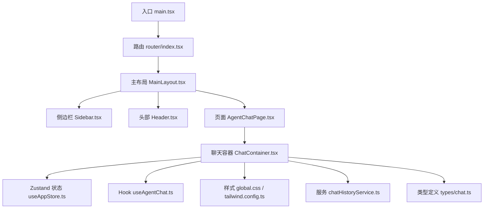
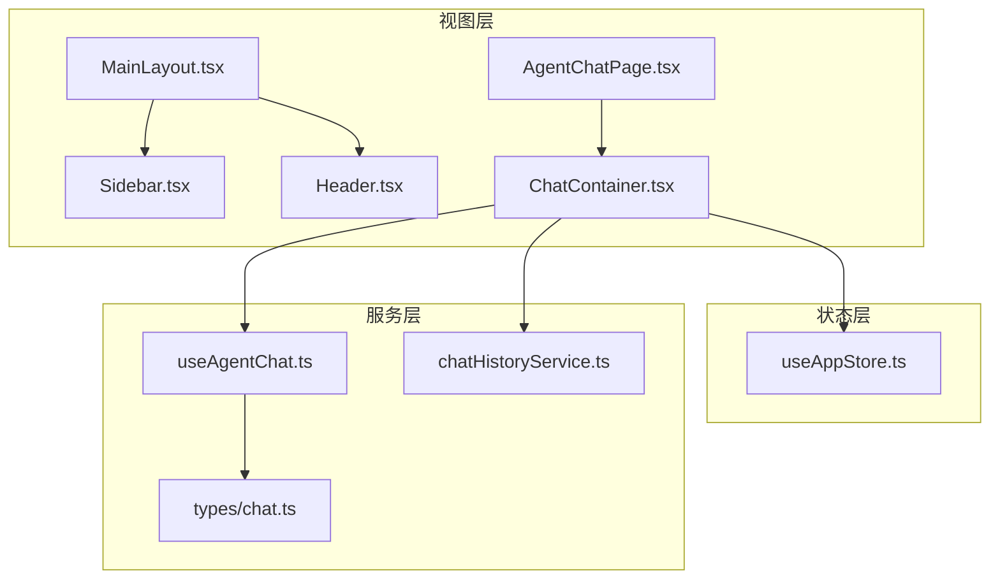
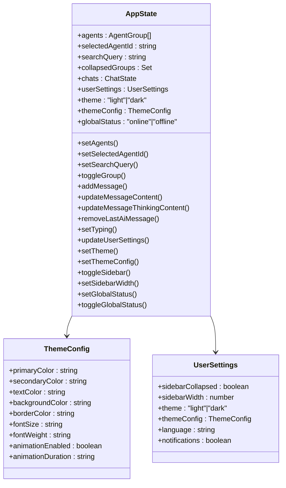
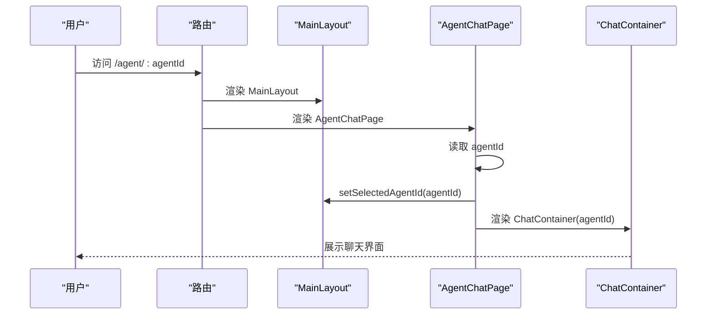
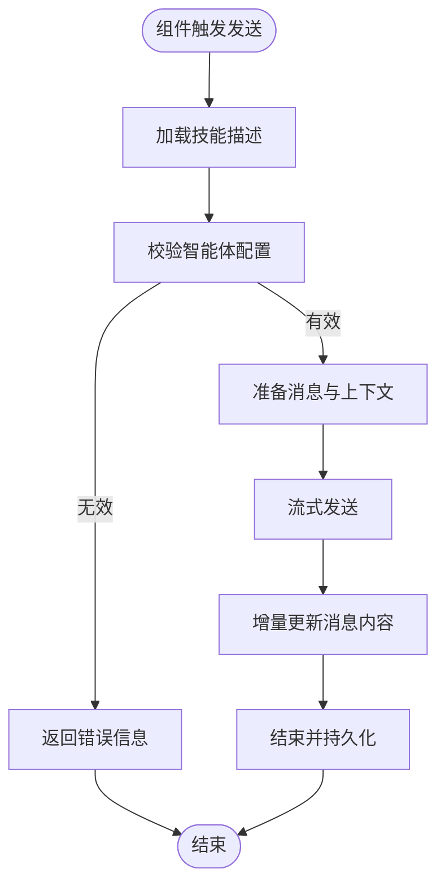
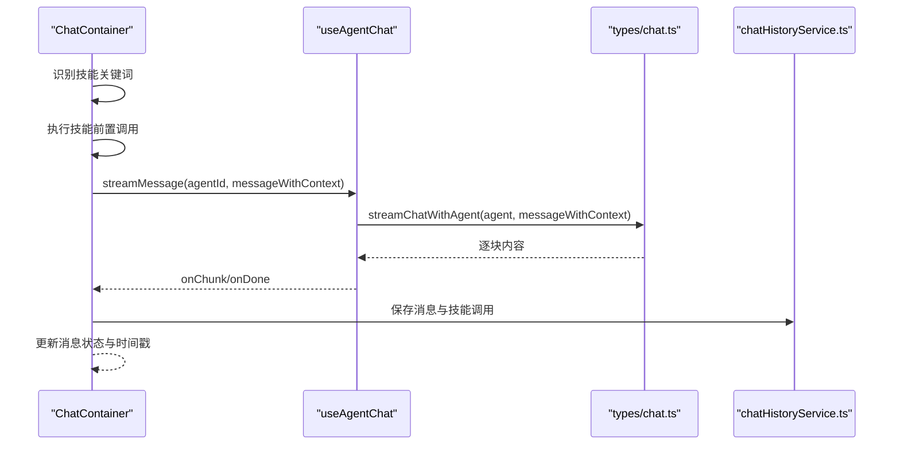
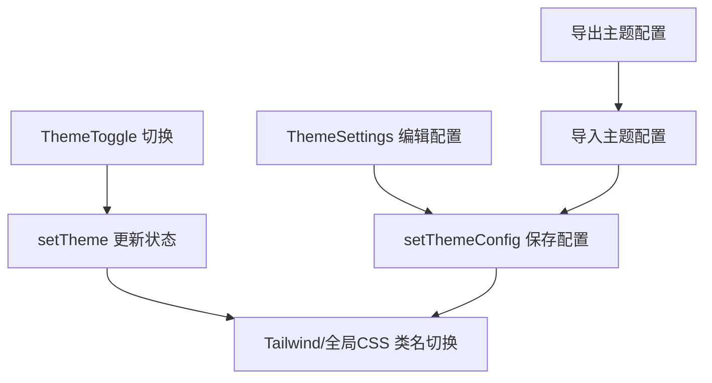
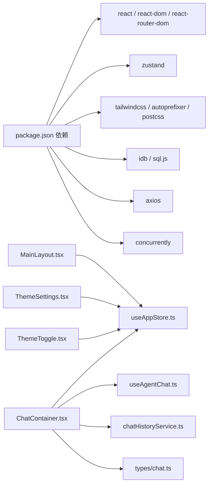

# 前端应用

<cite>
**本文引用的文件**
- [package.json](file://package.json)
- [main.tsx](file://src/main.tsx)
- [router/index.tsx](file://src/router/index.tsx)
- [store/useAppStore.ts](file://src/store/useAppStore.ts)
- [components/MainLayout.tsx](file://src/components/MainLayout.tsx)
- [tailwind.config.ts](file://tailwind.config.ts)
- [pages/AgentChatPage.tsx](file://src/pages/AgentChatPage.tsx)
- [hooks/useAgentChat.ts](file://src/hooks/useAgentChat.ts)
- [hooks/useResponsive.ts](file://src/hooks/useResponsive.ts)
- [services/chatHistoryService.ts](file://src/services/chatHistoryService.ts)
- [styles/global.css](file://src/styles/global.css)
- [types/chat.ts](file://src/types/chat.ts)
- [components/chat/ChatContainer.tsx](file://src/components/chat/ChatContainer.tsx)
- [components/theme/ThemeToggle.tsx](file://src/components/theme/ThemeToggle.tsx)
- [components/theme/ThemeSettings.tsx](file://src/components/theme/ThemeSettings.tsx)
- [components/Sidebar/Sidebar.tsx](file://src/components/Sidebar/Sidebar.tsx)
- [components/Header.tsx](file://src/components/Header.tsx)
</cite>

## 目录
1. [引言](#引言)
2. [项目结构](#项目结构)
3. [核心组件](#核心组件)
4. [架构总览](#架构总览)
5. [详细组件分析](#详细组件分析)
6. [依赖关系分析](#依赖关系分析)
7. [性能考量](#性能考量)
8. [故障排查指南](#故障排查指南)
9. [结论](#结论)
10. [附录](#附录)

## 引言
本文件为 AutoMate 前端应用的综合技术文档，聚焦于 React 应用的整体结构、组件架构与状态管理模式，深入解析 Zustand 的使用方式、React Hooks 的应用与组件间通信机制；阐述路由系统设计、页面组织与响应式布局实现；介绍 UI 组件库与样式系统、主题系统；提供组件开发规范、最佳实践与性能优化策略，并解释与后端 API 的集成方式与错误处理机制。

## 项目结构
AutoMate 前端采用模块化组织，按功能域划分目录，核心入口位于 src/main.tsx，路由定义于 src/router/index.tsx，状态管理集中在 src/store/useAppStore.ts，页面与组件分别位于 src/pages 与 src/components，样式通过 Tailwind CSS 与全局 CSS 实现，服务层封装了聊天历史与技能调用等能力。

图表来源
- [main.tsx](file://src/main.tsx#L1-L12)
- [router/index.tsx](file://src/router/index.tsx#L1-L43)
- [components/MainLayout.tsx](file://src/components/MainLayout.tsx#L1-L134)
- [components/Sidebar/Sidebar.tsx](file://src/components/Sidebar/Sidebar.tsx#L1-L179)
- [components/Header.tsx](file://src/components/Header.tsx#L1-L169)
- [pages/AgentChatPage.tsx](file://src/pages/AgentChatPage.tsx#L1-L24)
- [components/chat/ChatContainer.tsx](file://src/components/chat/ChatContainer.tsx#L1-L756)
- [store/useAppStore.ts](file://src/store/useAppStore.ts#L1-L306)
- [hooks/useAgentChat.ts](file://src/hooks/useAgentChat.ts#L1-L128)
- [services/chatHistoryService.ts](file://src/services/chatHistoryService.ts#L1-L244)
- [styles/global.css](file://src/styles/global.css#L1-L664)
- [tailwind.config.ts](file://tailwind.config.ts#L1-L161)
- [types/chat.ts](file://src/types/chat.ts#L1-L280)

章节来源
- [main.tsx](file://src/main.tsx#L1-L12)
- [router/index.tsx](file://src/router/index.tsx#L1-L43)

## 核心组件
- 路由与页面
  - 使用 react-router-dom 的 createBrowserRouter 定义根路径、智能体聊天页与设置页，并以 MainLayout 包裹页面内容。
- 主布局
  - MainLayout 负责加载智能体配置、搜索过滤、侧边栏与底部设置区的渲染，并根据主题切换类名。
- 状态管理
  - useAppStore 提供智能体列表、当前选择、聊天状态、用户设置、主题配置与全局状态，支持增删改查与主题切换。
- Hook
  - useAgentChat 封装与智能体的聊天逻辑，包括同步与流式输出、错误处理与技能描述加载。
  - useResponsive 提供断点、媒体查询、横竖屏检测与视口尺寸监听。
- 服务
  - chatHistoryService 基于 idb 实现本地聊天历史与技能调用记录的持久化。
- 类型
  - types/chat.ts 定义 Agent、AgentConfig、Skill、ChatMessage、ChatResponse、StreamChunk 等类型，并提供构建系统提示、流式与非流式聊天函数及技能描述加载工具。

章节来源
- [router/index.tsx](file://src/router/index.tsx#L1-L43)
- [components/MainLayout.tsx](file://src/components/MainLayout.tsx#L1-L134)
- [store/useAppStore.ts](file://src/store/useAppStore.ts#L1-L306)
- [hooks/useAgentChat.ts](file://src/hooks/useAgentChat.ts#L1-L128)
- [hooks/useResponsive.ts](file://src/hooks/useResponsive.ts#L1-L110)
- [services/chatHistoryService.ts](file://src/services/chatHistoryService.ts#L1-L244)
- [types/chat.ts](file://src/types/chat.ts#L1-L280)

## 架构总览
前端采用“路由驱动 + Zustand 状态 + Hook 服务”的分层架构：
- 视图层：页面与组件负责 UI 渲染与交互。
- 状态层：Zustand 管理全局与聊天相关的状态，避免跨层级 props 下传。
- 服务层：封装 API 调用、本地存储与工具函数，供组件与 Hook 使用。
- 类型层：统一的数据模型与接口定义，保证类型安全。

图表来源
- [pages/AgentChatPage.tsx](file://src/pages/AgentChatPage.tsx#L1-L24)
- [components/MainLayout.tsx](file://src/components/MainLayout.tsx#L1-L134)
- [components/Sidebar/Sidebar.tsx](file://src/components/Sidebar/Sidebar.tsx#L1-L179)
- [components/Header.tsx](file://src/components/Header.tsx#L1-L169)
- [components/chat/ChatContainer.tsx](file://src/components/chat/ChatContainer.tsx#L1-L756)
- [store/useAppStore.ts](file://src/store/useAppStore.ts#L1-L306)
- [hooks/useAgentChat.ts](file://src/hooks/useAgentChat.ts#L1-L128)
- [services/chatHistoryService.ts](file://src/services/chatHistoryService.ts#L1-L244)
- [types/chat.ts](file://src/types/chat.ts#L1-L280)

## 详细组件分析

### 状态管理：Zustand 使用与数据模型
- 数据模型
  - Agent、AgentGroup、Message、ChatState、ThemeConfig、UserSettings、AppState 等接口清晰定义状态结构。
- 动作方法
  - 智能体与聊天：setAgents、addMessage、updateMessageContent、updateMessageThinkingContent、removeLastAiMessage、setTyping、toggleGroup。
  - 用户设置与主题：updateUserSettings、setTheme、setThemeConfig、toggleSidebar、setSidebarWidth、setGlobalStatus、toggleGlobalStatus。
- 主题配置
  - 内置浅色/深色主题默认值，支持运行时切换与导出/导入主题配置。
- 设计要点
  - 使用 create 创建 Zustand Store，将复杂状态与派生逻辑集中在一个文件，便于维护与测试。
  - ChatState 以 agentId 为键的映射，确保多智能体独立会话状态隔离。

图表来源
- [store/useAppStore.ts](file://src/store/useAppStore.ts#L1-L306)

章节来源
- [store/useAppStore.ts](file://src/store/useAppStore.ts#L1-L306)

### 路由系统与页面组织
- 路由定义
  - 根路径渲染 WelcomePage，智能体聊天路径 /agent/:agentId 渲染 AgentChatPage，设置页 /settings 渲染 SettingsPage。
  - 未匹配路由重定向至根路径。
- 页面组件
  - AgentChatPage 从路由参数读取 agentId 并设置到全局状态，随后渲染 ChatContainer。
- 布局
  - MainLayout 作为通用布局，包裹侧边栏、搜索、底部设置与主内容区。

图表来源
- [router/index.tsx](file://src/router/index.tsx#L1-L43)
- [pages/AgentChatPage.tsx](file://src/pages/AgentChatPage.tsx#L1-L24)
- [components/MainLayout.tsx](file://src/components/MainLayout.tsx#L1-L134)
- [components/chat/ChatContainer.tsx](file://src/components/chat/ChatContainer.tsx#L1-L756)

章节来源
- [router/index.tsx](file://src/router/index.tsx#L1-L43)
- [pages/AgentChatPage.tsx](file://src/pages/AgentChatPage.tsx#L1-L24)

### 组件间通信与 Hook 应用
- 组件通信
  - MainLayout 通过 useAppStore 读取与写入全局状态，向子组件传递回调与数据。
  - ChatContainer 通过 useAgentChat 与 useAppStore 协同，完成消息发送、流式更新与本地存储。
- Hook 设计
  - useAgentChat：加载技能描述、校验智能体配置、封装同步与流式聊天、错误处理与加载状态。
  - useResponsive：提供断点、媒体查询、横竖屏与视口尺寸的响应式 Hook。

图表来源
- [hooks/useAgentChat.ts](file://src/hooks/useAgentChat.ts#L1-L128)
- [components/chat/ChatContainer.tsx](file://src/components/chat/ChatContainer.tsx#L213-L392)

章节来源
- [hooks/useAgentChat.ts](file://src/hooks/useAgentChat.ts#L1-L128)
- [hooks/useResponsive.ts](file://src/hooks/useResponsive.ts#L1-L110)

### 聊天流程与技能激活
- 技能识别
  - ChatContainer 对用户输入进行关键词匹配，识别 todo-query、weather_query、code_* 等技能。
- 技能前置执行
  - 在 AI 回复前调用 callSkill 执行相关技能，将结果拼接为上下文。
- 流式输出
  - 使用 types/chat.ts 中的流式接口，逐块更新消息内容，支持思考内容提取与最终清理。
- 本地持久化
  - 通过 chatHistoryService 保存消息与技能调用记录，支持删除最后一条 AI 消息与关联技能调用。

图表来源
- [components/chat/ChatContainer.tsx](file://src/components/chat/ChatContainer.tsx#L105-L392)
- [hooks/useAgentChat.ts](file://src/hooks/useAgentChat.ts#L84-L127)
- [types/chat.ts](file://src/types/chat.ts#L96-L189)
- [services/chatHistoryService.ts](file://src/services/chatHistoryService.ts#L87-L120)

章节来源
- [components/chat/ChatContainer.tsx](file://src/components/chat/ChatContainer.tsx#L105-L392)
- [types/chat.ts](file://src/types/chat.ts#L96-L189)
- [services/chatHistoryService.ts](file://src/services/chatHistoryService.ts#L87-L120)

### 主题系统与样式体系
- 主题配置
  - ThemeToggle 切换浅/深色主题；ThemeSettings 支持颜色、字体、动画等配置项的编辑、重置、导出与导入。
- 样式实现
  - Tailwind 配置扩展颜色、字体、间距、圆角、阴影、过渡与动画；全局 CSS 定义 CSS 变量与暗色主题变量，配合类名切换实现主题切换。
- 响应式布局
  - useResponsive 提供断点与媒体查询 Hook，结合 Tailwind 断点实现移动端适配。

图表来源
- [components/theme/ThemeToggle.tsx](file://src/components/theme/ThemeToggle.tsx#L1-L40)
- [components/theme/ThemeSettings.tsx](file://src/components/theme/ThemeSettings.tsx#L1-L262)
- [store/useAppStore.ts](file://src/store/useAppStore.ts#L262-L284)
- [styles/global.css](file://src/styles/global.css#L1-L129)
- [tailwind.config.ts](file://tailwind.config.ts#L1-L161)

章节来源
- [components/theme/ThemeToggle.tsx](file://src/components/theme/ThemeToggle.tsx#L1-L40)
- [components/theme/ThemeSettings.tsx](file://src/components/theme/ThemeSettings.tsx#L1-L262)
- [styles/global.css](file://src/styles/global.css#L1-L129)
- [tailwind.config.ts](file://tailwind.config.ts#L1-L161)

### 侧边栏与头部组件
- 侧边栏
  - 支持拖拽调整宽度、折叠/展开，结合 CSS 变量与类名控制样式与布局。
- 头部
  - 显示当前智能体信息与用户信息，支持返回首页与交互反馈。

章节来源
- [components/Sidebar/Sidebar.tsx](file://src/components/Sidebar/Sidebar.tsx#L1-L179)
- [components/Header.tsx](file://src/components/Header.tsx#L1-L169)

## 依赖关系分析
- 依赖概览
  - React 生态：react、react-dom、react-router-dom、lucide-react。
  - 状态管理：zustand。
  - 样式：tailwindcss、autoprefixer、postcss。
  - 存储：idb、sql.js。
  - 工具：axios、concurrently。
- 关键耦合点
  - ChatContainer 依赖 useAgentChat、useAppStore、chatHistoryService、types/chat.ts。
  - MainLayout 依赖 useAppStore 与路由导航。
  - ThemeSettings/ThemeToggle 依赖 useAppStore 与全局 CSS/Tailwind。

图表来源
- [package.json](file://package.json#L15-L45)
- [components/chat/ChatContainer.tsx](file://src/components/chat/ChatContainer.tsx#L1-L756)
- [store/useAppStore.ts](file://src/store/useAppStore.ts#L1-L306)
- [hooks/useAgentChat.ts](file://src/hooks/useAgentChat.ts#L1-L128)
- [services/chatHistoryService.ts](file://src/services/chatHistoryService.ts#L1-L244)
- [types/chat.ts](file://src/types/chat.ts#L1-L280)
- [components/MainLayout.tsx](file://src/components/MainLayout.tsx#L1-L134)
- [components/theme/ThemeSettings.tsx](file://src/components/theme/ThemeSettings.tsx#L1-L262)
- [components/theme/ThemeToggle.tsx](file://src/components/theme/ThemeToggle.tsx#L1-L40)

章节来源
- [package.json](file://package.json#L15-L45)

## 性能考量
- 状态粒度与订阅
  - 使用 Zustand 的选择器订阅减少不必要的重渲染；将聊天状态按 agentId 分离，避免全局抖动。
- 渲染优化
  - ChatContainer 使用 useMemo 与局部状态控制消息渲染；消息列表使用虚拟滚动或合理分页可进一步优化长列表。
- 请求与流式
  - 流式接口按块更新，避免一次性大字符串处理；及时释放 reader 与定时器，防止内存泄漏。
- 样式与动画
  - Tailwind 动画与 CSS 变量配合，减少内联样式的计算；在高负载设备上可考虑禁用动画或缩短时长。
- 存储与索引
  - idb 索引优化查询性能；批量写入与事务操作减少 I/O 压力。

## 故障排查指南
- 聊天无响应
  - 检查智能体配置是否完整（url、api_key、model），确认 useAgentChat 的校验逻辑与错误返回。
  - 查看流式接口的响应体与解码逻辑，确保 SSE/流式协议正确解析。
- 主题切换异常
  - 确认 ThemeToggle 与 ThemeSettings 是否正确调用 setTheme/setThemeConfig；检查全局 CSS 类名与 Tailwind 配置。
- 侧边栏无法拖拽
  - 检查鼠标事件绑定与 isResizing 状态；确认最小/最大宽度限制与 CSS 样式覆盖。
- 本地存储失败
  - 检查 idb 打开与升级流程；确认索引创建与读写权限。

章节来源
- [hooks/useAgentChat.ts](file://src/hooks/useAgentChat.ts#L51-L82)
- [types/chat.ts](file://src/types/chat.ts#L96-L189)
- [components/theme/ThemeSettings.tsx](file://src/components/theme/ThemeSettings.tsx#L34-L50)
- [components/Sidebar/Sidebar.tsx](file://src/components/Sidebar/Sidebar.tsx#L19-L62)
- [services/chatHistoryService.ts](file://src/services/chatHistoryService.ts#L61-L84)

## 结论
AutoMate 前端以 React + Zustand 为核心，结合自研 Hook 与服务层，实现了清晰的状态管理、灵活的主题系统与高效的聊天交互体验。通过模块化的组件组织与 Tailwind 样式体系，项目具备良好的可维护性与扩展性。建议后续引入虚拟列表、缓存策略与更完善的错误边界与日志上报，持续提升用户体验与稳定性。

## 附录
- 组件开发规范
  - 使用 TypeScript 接口约束 Props 与状态；Hook 仅暴露必要方法与状态；组件职责单一，避免过度耦合。
- 最佳实践
  - 状态集中管理，避免深层 props 下传；对长列表与高频更新使用选择器订阅；合理拆分异步任务与错误处理。
- 性能优化
  - 优先使用 CSS 动画与硬件加速；减少强制同步布局；对图片与资源进行懒加载与压缩。