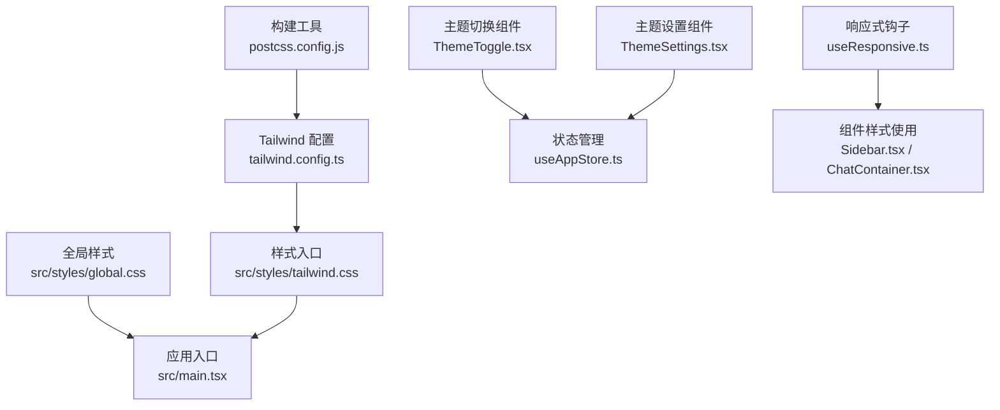
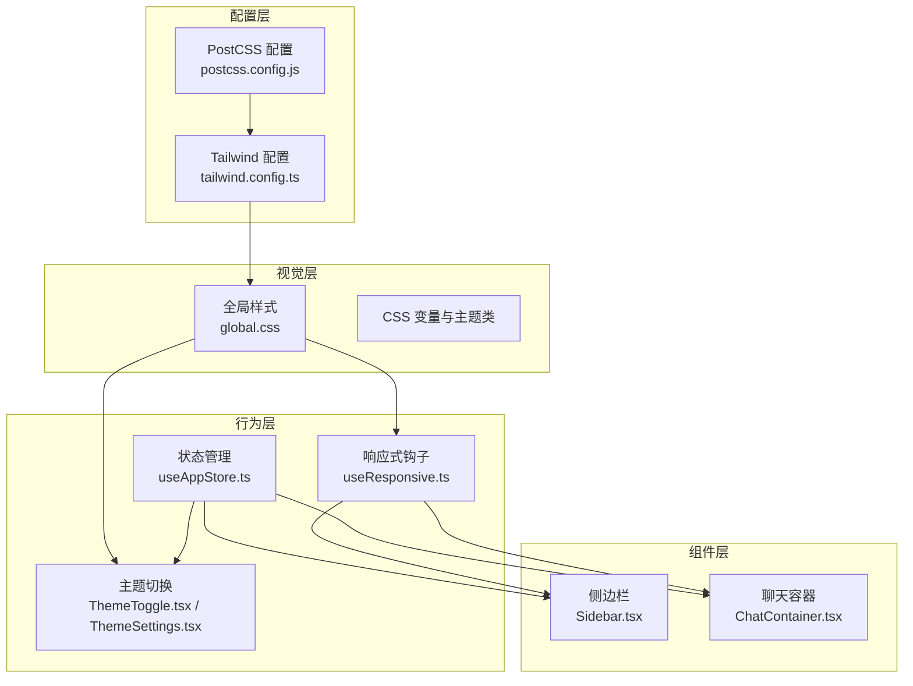
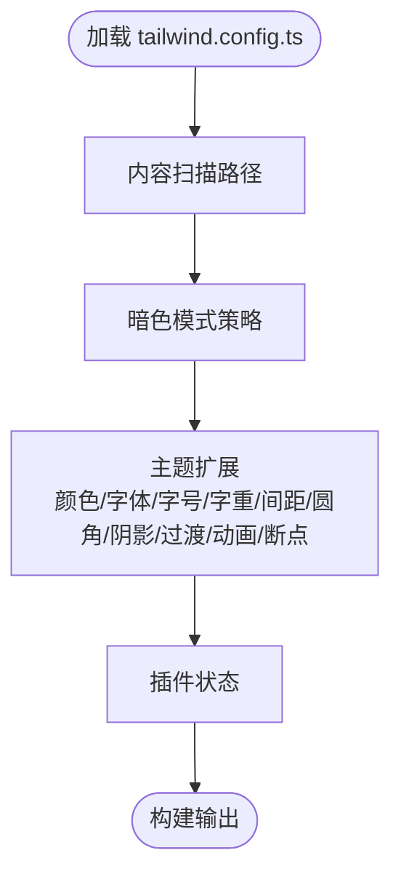
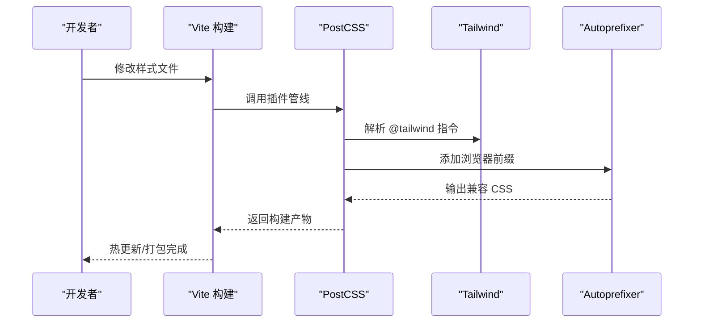
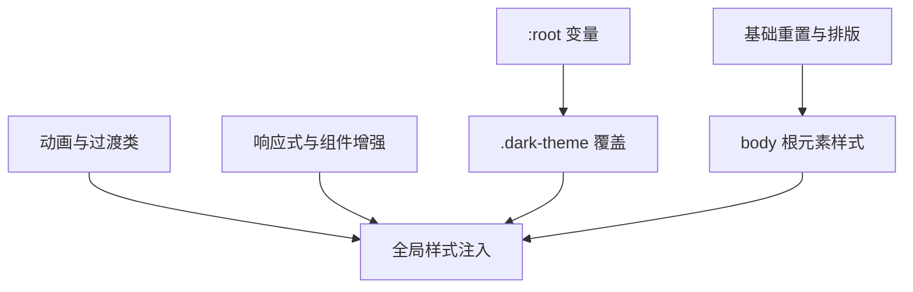
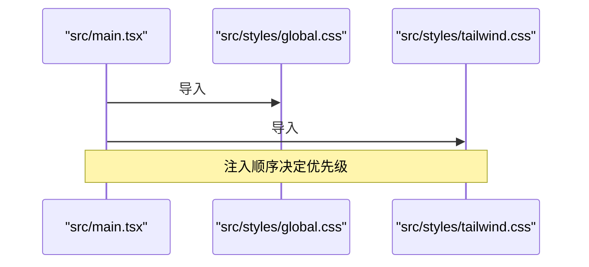
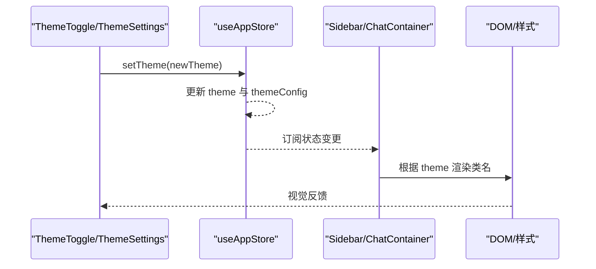
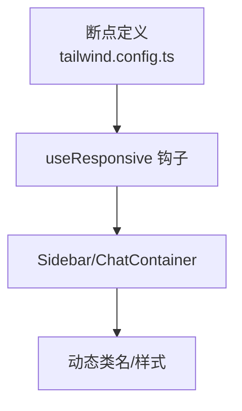
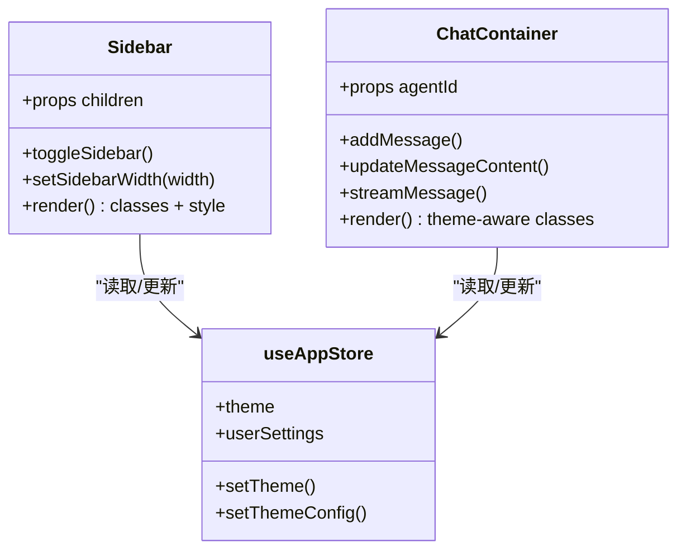
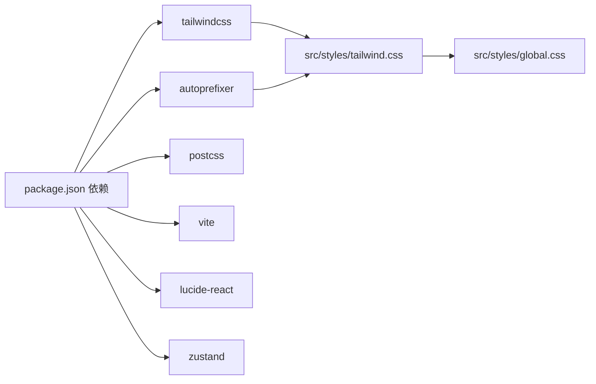

# 样式系统

<cite>
**本文引用的文件**
- [tailwind.config.ts](file://tailwind.config.ts)
- [postcss.config.js](file://postcss.config.js)
- [global.css](file://src/styles/global.css)
- [tailwind.css](file://src/styles/tailwind.css)
- [input.css](file://prototypes/css/input.css)
- [package.json](file://package.json)
- [vite.config.ts](file://vite.config.ts)
- [main.tsx](file://src/main.tsx)
- [ThemeToggle.tsx](file://src/components/theme/ThemeToggle.tsx)
- [ThemeSettings.tsx](file://src/components/theme/ThemeSettings.tsx)
- [useResponsive.ts](file://src/hooks/useResponsive.ts)
- [Sidebar.tsx](file://src/components/Sidebar/Sidebar.tsx)
- [ChatContainer.tsx](file://src/components/chat/ChatContainer.tsx)
- [useAppStore.ts](file://src/store/useAppStore.ts)
</cite>

## 目录
1. [简介](#简介)
2. [项目结构](#项目结构)
3. [核心组件](#核心组件)
4. [架构总览](#架构总览)
5. [详细组件分析](#详细组件分析)
6. [依赖分析](#依赖分析)
7. [性能考虑](#性能考虑)
8. [故障排查指南](#故障排查指南)
9. [结论](#结论)
10. [附录](#附录)

## 简介
本文件系统性梳理 AutoMate 的样式系统，覆盖 Tailwind CSS 配置与扩展、PostCSS 自动前缀与构建流程、全局 CSS 变量与主题体系、组件级样式封装与响应式策略、以及与状态管理的联动与动态切换机制。文档面向不同层次读者，既提供高层架构视图，也给出可操作的开发规范与调试建议。

## 项目结构
样式系统由“构建配置 + 全局样式 + Tailwind 扩展 + 组件样式”四部分构成，并通过应用入口统一注入。关键路径如下：
- 构建与工具链：postcss.config.js、tailwind.config.ts、vite.config.ts、package.json
- 入口注入：main.tsx 引入全局与 Tailwind 样式
- 全局样式：src/styles/global.css（CSS 变量、基础重置、主题类、动画与组件增强）
- Tailwind 原子类：src/styles/tailwind.css（引入 base/components/utilities）
- 原型样式：prototypes/css/input.css（早期原型的 Tailwind 入口）
- 主题与响应式：ThemeToggle.tsx、ThemeSettings.tsx、useResponsive.ts
- 组件样式：Sidebar.tsx、ChatContainer.tsx（结合 store 动态主题与布局）

**图表来源**
- [postcss.config.js](file://postcss.config.js#L1-L7)
- [tailwind.config.ts](file://tailwind.config.ts#L1-L161)
- [tailwind.css](file://src/styles/tailwind.css#L1-L4)
- [global.css](file://src/styles/global.css#L1-L664)
- [main.tsx](file://src/main.tsx#L1-L12)
- [ThemeToggle.tsx](file://src/components/theme/ThemeToggle.tsx#L1-L40)
- [ThemeSettings.tsx](file://src/components/theme/ThemeSettings.tsx#L1-L149)
- [useResponsive.ts](file://src/hooks/useResponsive.ts#L1-L110)
- [Sidebar.tsx](file://src/components/Sidebar/Sidebar.tsx#L1-L179)
- [ChatContainer.tsx](file://src/components/chat/ChatContainer.tsx#L1-L756)
- [useAppStore.ts](file://src/store/useAppStore.ts#L1-L306)

**章节来源**
- [postcss.config.js](file://postcss.config.js#L1-L7)
- [tailwind.config.ts](file://tailwind.config.ts#L1-L161)
- [tailwind.css](file://src/styles/tailwind.css#L1-L4)
- [global.css](file://src/styles/global.css#L1-L664)
- [main.tsx](file://src/main.tsx#L1-L12)

## 核心组件
- Tailwind 配置与扩展：定义暗色模式、颜色语义、字体、字号、字重、间距、圆角、阴影、过渡时长、动画与关键帧、断点等。
- PostCSS 配置：启用 tailwindcss 与 autoprefixer 插件，确保原子类与浏览器兼容性。
- 全局样式与 CSS 变量：在 :root 与 .dark-theme 中集中声明主题变量，提供基础排版、滚动条、媒体查询与动画类。
- 应用入口注入：main.tsx 同时引入全局与 Tailwind 样式，保证构建顺序与优先级。
- 主题系统：ThemeToggle 与 ThemeSettings 通过 useAppStore 切换主题与主题配置；Sidebar 与 ChatContainer 结合主题动态渲染样式。
- 响应式策略：useResponsive 提供断点、方向、视口尺寸等能力，组件按需使用。

**章节来源**
- [tailwind.config.ts](file://tailwind.config.ts#L1-L161)
- [postcss.config.js](file://postcss.config.js#L1-L7)
- [global.css](file://src/styles/global.css#L1-L664)
- [main.tsx](file://src/main.tsx#L1-L12)
- [ThemeToggle.tsx](file://src/components/theme/ThemeToggle.tsx#L1-L40)
- [ThemeSettings.tsx](file://src/components/theme/ThemeSettings.tsx#L1-L149)
- [useResponsive.ts](file://src/hooks/useResponsive.ts#L1-L110)
- [Sidebar.tsx](file://src/components/Sidebar/Sidebar.tsx#L1-L179)
- [ChatContainer.tsx](file://src/components/chat/ChatContainer.tsx#L1-L756)
- [useAppStore.ts](file://src/store/useAppStore.ts#L1-L306)

## 架构总览
样式系统采用“配置驱动 + 全局变量 + 组件封装”的分层设计：
- 配置层：Tailwind 与 PostCSS 提供原子类与兼容性处理
- 视觉层：CSS 变量与主题类承载色彩、排版、间距、阴影等视觉变量
- 行为层：主题切换与响应式钩子驱动样式动态变化
- 组件层：Sidebar、ChatContainer 等组件结合 store 状态与断点进行样式选择

**图表来源**
- [tailwind.config.ts](file://tailwind.config.ts#L1-L161)
- [postcss.config.js](file://postcss.config.js#L1-L7)
- [global.css](file://src/styles/global.css#L1-L664)
- [ThemeToggle.tsx](file://src/components/theme/ThemeToggle.tsx#L1-L40)
- [ThemeSettings.tsx](file://src/components/theme/ThemeSettings.tsx#L1-L149)
- [useResponsive.ts](file://src/hooks/useResponsive.ts#L1-L110)
- [useAppStore.ts](file://src/store/useAppStore.ts#L1-L306)
- [Sidebar.tsx](file://src/components/Sidebar/Sidebar.tsx#L1-L179)
- [ChatContainer.tsx](file://src/components/chat/ChatContainer.tsx#L1-L756)

## 详细组件分析

### Tailwind 配置与扩展
- 内容扫描：仅扫描 index.html 与 src 下 TS/JS 文件，避免无关目录污染构建体积
- 暗色模式：基于 class 策略，便于与主题切换联动
- 主题扩展：
  - 颜色：primary/secondary/success/warning/error 默认、hover、light 三态
  - 字体族：系统字体栈，提升可读性与一致性
  - 字号/字重/间距/圆角：覆盖常用比例与步进
  - 阴影：多层级阴影常量
  - 过渡：fast/base/slow 三档时长
  - 动画：fade-in/slide-in/out/scale-in/bounce/pulse/spin/float/typing-bounce 关键帧
  - 断点：xs/sm/md/lg/xl/2xl
- 插件：当前未启用插件，保持最小依赖

**图表来源**
- [tailwind.config.ts](file://tailwind.config.ts#L1-L161)

**章节来源**
- [tailwind.config.ts](file://tailwind.config.ts#L1-L161)

### PostCSS 配置与自动前缀
- 插件：tailwindcss、autoprefixer
- 作用：将原子类与全局样式编译为带前缀的最终 CSS，确保跨浏览器兼容

**图表来源**
- [postcss.config.js](file://postcss.config.js#L1-L7)
- [tailwind.css](file://src/styles/tailwind.css#L1-L4)
- [vite.config.ts](file://vite.config.ts#L1-L47)

**章节来源**
- [postcss.config.js](file://postcss.config.js#L1-L7)
- [vite.config.ts](file://vite.config.ts#L1-L47)

### 全局样式与 CSS 变量
- 变量集中：:root 定义主色、辅色、成功/警告/错误、文本/背景/边框/阴影、字号/字重、间距、圆角、过渡、布局尺寸等
- 深色主题：.dark-theme 覆盖文本/背景/边框/阴影变量，实现一键切换
- 基础重置：通用选择器重置 margin/padding、box-sizing
- 排版与根元素：html/body 设置字体、字号、行高、过渡、视口尺寸
- 动画与过渡：提供 .animate-* 类与 .transition-* 类，配合变量控制时长与缓动
- 响应式与组件增强：侧边栏折叠、搜索高亮、AgentItem 科技感与脉冲动画、深色主题适配等

**图表来源**
- [global.css](file://src/styles/global.css#L1-L664)

**章节来源**
- [global.css](file://src/styles/global.css#L1-L664)

### 应用入口与样式注入
- main.tsx 同时引入 global.css 与 tailwind.css，确保：
  - 全局变量与基础样式先于组件渲染
  - Tailwind 原子类在全局样式之后，避免被覆盖
- 构建配置（vite.config.ts）与包管理（package.json）提供插件与脚本支持

**图表来源**
- [main.tsx](file://src/main.tsx#L1-L12)
- [tailwind.css](file://src/styles/tailwind.css#L1-L4)
- [global.css](file://src/styles/global.css#L1-L664)

**章节来源**
- [main.tsx](file://src/main.tsx#L1-L12)
- [tailwind.css](file://src/styles/tailwind.css#L1-L4)
- [global.css](file://src/styles/global.css#L1-L664)
- [vite.config.ts](file://vite.config.ts#L1-L47)
- [package.json](file://package.json#L1-L47)

### 主题系统与动态切换
- 切换组件：ThemeToggle 根据当前主题切换 light/dark
- 设置组件：ThemeSettings 支持主题模式与主题配置（主色、辅色、文本/背景/边框、字号/字重、动画开关与时长）
- 状态管理：useAppStore 维护 theme 与 themeConfig，并在 setTheme 时同步更新 userSettings 与全局配置
- 组件联动：Sidebar、ChatContainer 等根据 theme 动态拼接类名，实现背景、边框、文字等状态切换

**图表来源**
- [ThemeToggle.tsx](file://src/components/theme/ThemeToggle.tsx#L1-L40)
- [ThemeSettings.tsx](file://src/components/theme/ThemeSettings.tsx#L1-L149)
- [useAppStore.ts](file://src/store/useAppStore.ts#L1-L306)
- [Sidebar.tsx](file://src/components/Sidebar/Sidebar.tsx#L1-L179)
- [ChatContainer.tsx](file://src/components/chat/ChatContainer.tsx#L1-L756)

**章节来源**
- [ThemeToggle.tsx](file://src/components/theme/ThemeToggle.tsx#L1-L40)
- [ThemeSettings.tsx](file://src/components/theme/ThemeSettings.tsx#L1-L149)
- [useAppStore.ts](file://src/store/useAppStore.ts#L1-L306)
- [Sidebar.tsx](file://src/components/Sidebar/Sidebar.tsx#L1-L179)
- [ChatContainer.tsx](file://src/components/chat/ChatContainer.tsx#L1-L756)

### 响应式设计与断点
- 断点定义：xs/sm/md/lg/xl/2xl 与 useResponsive 提供断点检测、媒体查询、设备类型判断、横竖屏检测、视口尺寸
- 组件使用：Sidebar、ChatContainer 等按断点动态调整布局、显示/隐藏元素或切换样式类

**图表来源**
- [tailwind.config.ts](file://tailwind.config.ts#L147-L154)
- [useResponsive.ts](file://src/hooks/useResponsive.ts#L1-L110)
- [Sidebar.tsx](file://src/components/Sidebar/Sidebar.tsx#L1-L179)
- [ChatContainer.tsx](file://src/components/chat/ChatContainer.tsx#L1-L756)

**章节来源**
- [tailwind.config.ts](file://tailwind.config.ts#L147-L154)
- [useResponsive.ts](file://src/hooks/useResponsive.ts#L1-L110)
- [Sidebar.tsx](file://src/components/Sidebar/Sidebar.tsx#L1-L179)
- [ChatContainer.tsx](file://src/components/chat/ChatContainer.tsx#L1-L756)

### 组件样式封装与示例
- Sidebar：支持拖拽调整宽度、折叠状态、悬停动画与渐变边框；根据 theme 切换背景/边框；折叠时隐藏/居中关键元素
- ChatContainer：按主题切换头部/输入区/气泡/打字指示器等；根据 isTyping/isSending 动态按钮状态；消息气泡容器与头像按主题渲染

**图表来源**
- [Sidebar.tsx](file://src/components/Sidebar/Sidebar.tsx#L1-L179)
- [ChatContainer.tsx](file://src/components/chat/ChatContainer.tsx#L1-L756)
- [useAppStore.ts](file://src/store/useAppStore.ts#L1-L306)

**章节来源**
- [Sidebar.tsx](file://src/components/Sidebar/Sidebar.tsx#L1-L179)
- [ChatContainer.tsx](file://src/components/chat/ChatContainer.tsx#L1-L756)
- [useAppStore.ts](file://src/store/useAppStore.ts#L1-L306)

## 依赖分析
- 构建依赖：tailwindcss、autoprefixer、postcss、vite
- 运行依赖：lucide-react（图标）、zustand（状态）、react/react-dom（框架）
- 样式依赖：Tailwind 原子类与全局 CSS 变量共同决定最终渲染

**图表来源**
- [package.json](file://package.json#L1-L47)
- [postcss.config.js](file://postcss.config.js#L1-L7)
- [tailwind.css](file://src/styles/tailwind.css#L1-L4)
- [global.css](file://src/styles/global.css#L1-L664)

**章节来源**
- [package.json](file://package.json#L1-L47)
- [postcss.config.js](file://postcss.config.js#L1-L7)
- [tailwind.css](file://src/styles/tailwind.css#L1-L4)
- [global.css](file://src/styles/global.css#L1-L664)

## 性能考虑
- 构建体积：Tailwind 内容扫描限制在 src 与 index.html，减少无用类进入产物
- 动画与过渡：通过 CSS 变量统一控制时长与缓动，避免重复定义
- 主题切换：.dark-theme 使用 CSS 变量覆盖，避免重绘大范围元素
- 组件样式：按需拼接类名，避免内联样式导致的重排
- 滚动条与阴影：通过 CSS 变量与原子类控制，减少 JS 动态计算

[本节为通用性能建议，不直接分析具体文件]

## 故障排查指南
- 样式未生效
  - 检查 main.tsx 是否正确引入 global.css 与 tailwind.css
  - 确认 PostCSS 插件是否启用且版本兼容
- 暗色模式无效
  - 确认 HTML/根元素上存在对应主题类（如 .dark-theme）
  - 检查 useAppStore 的 setTheme 是否被调用
- 动画或过渡异常
  - 检查 CSS 变量（如 --transition-base）是否被覆盖
  - 确认动画类（如 .animate-fade-in）是否正确拼接
- 响应式样式错乱
  - 检查断点定义与 useResponsive 的返回值
  - 确认组件在不同断点下的类名拼接逻辑

**章节来源**
- [main.tsx](file://src/main.tsx#L1-L12)
- [postcss.config.js](file://postcss.config.js#L1-L7)
- [global.css](file://src/styles/global.css#L1-L664)
- [useAppStore.ts](file://src/store/useAppStore.ts#L1-L306)
- [useResponsive.ts](file://src/hooks/useResponsive.ts#L1-L110)

## 结论
AutoMate 的样式系统以 Tailwind 为核心，结合 PostCSS 自动前缀与全局 CSS 变量，形成“配置驱动 + 主题变量 + 组件封装”的清晰架构。通过状态管理与响应式钩子，实现主题动态切换与多端适配。整体设计具备良好的模块化、可维护性与性能表现，适合在复杂前端场景中持续演进。

[本节为总结性内容，不直接分析具体文件]

## 附录

### 开发规范与最佳实践
- 使用 Tailwind 原子类优先，避免新增重复样式
- 主题相关变量集中在 :root 与 .dark-theme，避免硬编码颜色
- 动画与过渡通过 CSS 变量统一管理，组件只负责拼接类名
- 响应式逻辑尽量使用 useResponsive，减少条件分支
- 组件样式遵循“按主题拼类名 + 按状态拼类名”的原则

### 组件样式模板（参考）
- 通用容器：按主题拼接背景/边框/文字类
- 按钮/输入：按状态（禁用/悬停/激活）拼接类名
- 布局：按断点显示/隐藏元素或切换布局类

### 调试技巧
- 在浏览器中切换 .dark-theme 类观察变量覆盖效果
- 使用 React DevTools 查看组件 props 与状态，确认 theme 与 userSettings
- 在控制台打印 useResponsive 的断点与视口信息，验证响应式逻辑

[本节为通用指导，不直接分析具体文件]