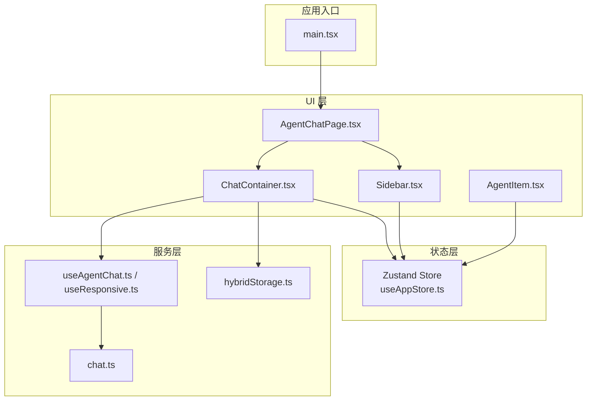
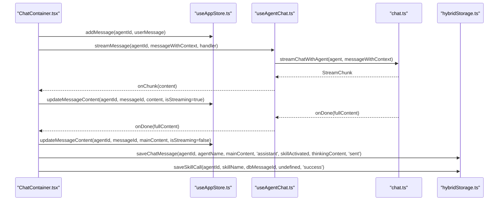
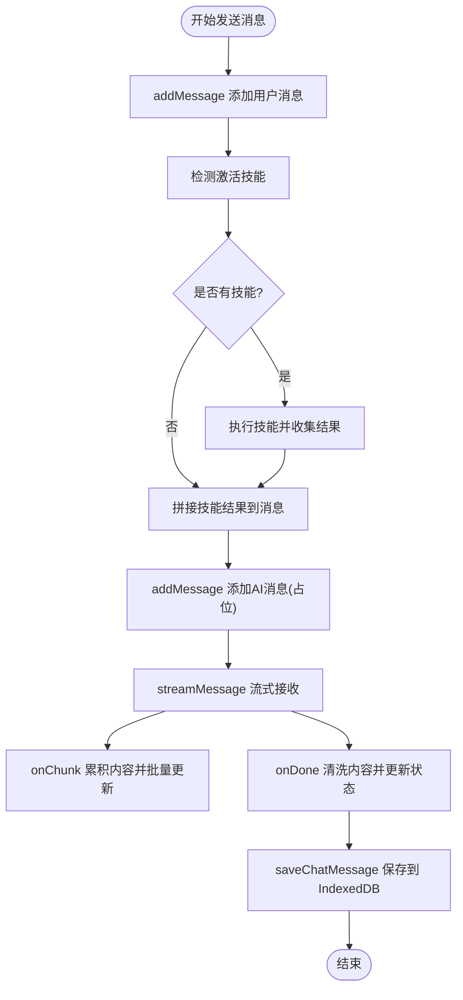
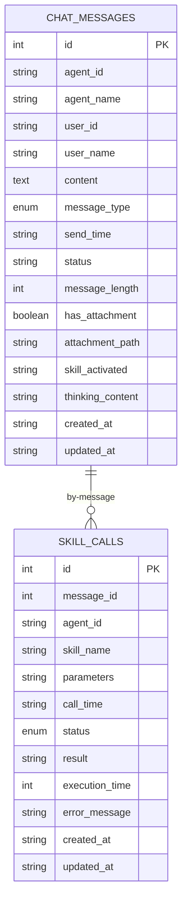
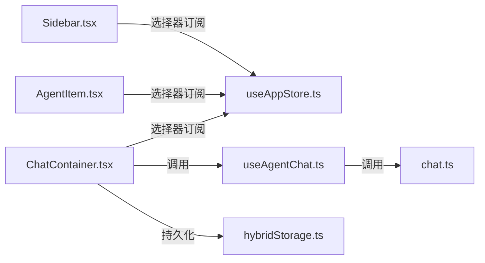

# 状态管理

<cite>
**本文引用的文件**
- [useAppStore.ts](file://src/store/useAppStore.ts)
- [useAgentChat.ts](file://src/hooks/useAgentChat.ts)
- [useResponsive.ts](file://src/hooks/useResponsive.ts)
- [hybridStorage.ts](file://src/services/hybridStorage.ts)
- [chat.ts](file://src/types/chat.ts)
- [ChatContainer.tsx](file://src/components/chat/ChatContainer.tsx)
- [Sidebar.tsx](file://src/components/Sidebar/Sidebar.tsx)
- [AgentChatPage.tsx](file://src/pages/AgentChatPage.tsx)
- [AgentItem.tsx](file://src/components/Sidebar/AgentItem.tsx)
- [clearDatabase.ts](file://src/scripts/clearDatabase.ts)
- [main.tsx](file://src/main.tsx)
</cite>

## 目录
1. [简介](#简介)
2. [项目结构](#项目结构)
3. [核心组件](#核心组件)
4. [架构总览](#架构总览)
5. [详细组件分析](#详细组件分析)
6. [依赖分析](#依赖分析)
7. [性能考虑](#性能考虑)
8. [故障排查指南](#故障排查指南)
9. [结论](#结论)
10. [附录](#附录)

## 简介
本文件系统性梳理 AutoMate 前端的状态管理方案，围绕 Zustand 状态库的使用、全局状态设计与更新机制展开，重点覆盖 useAppStore 的状态结构（agents 智能体列表、chatState 聊天状态、userSettings 用户设置、selectedAgentId 当前选中智能体 ID）、状态持久化策略、状态同步与订阅模式，并深入解析自定义 Hook（useAgentChat、useResponsive）的设计思路与使用场景。同时提供状态流转图、状态更新示例路径以及最佳实践、性能优化与调试技巧。

## 项目结构
AutoMate 前端采用 Zustand 作为状态管理核心，结合自定义 Hooks 与服务层实现聊天、侧边栏、主题与响应式能力；数据持久化通过 Hybrid Storage（IndexedDB + localStorage）实现，确保聊天历史与技能调用记录的长期保存与清理。



图表来源
- [main.tsx](file://src/main.tsx#L1-L12)
- [useAppStore.ts](file://src/store/useAppStore.ts#L1-L306)
- [AgentChatPage.tsx](file://src/pages/AgentChatPage.tsx#L1-L24)
- [Sidebar.tsx](file://src/components/Sidebar/Sidebar.tsx#L1-L179)
- [ChatContainer.tsx](file://src/components/chat/ChatContainer.tsx#L1-L756)
- [AgentItem.tsx](file://src/components/Sidebar/AgentItem.tsx#L1-L180)
- [useAgentChat.ts](file://src/hooks/useAgentChat.ts#L1-L128)
- [useResponsive.ts](file://src/hooks/useResponsive.ts#L1-L110)
- [hybridStorage.ts](file://src/services/hybridStorage.ts#L1-L262)
- [chat.ts](file://src/types/chat.ts#L1-L280)

章节来源
- [main.tsx](file://src/main.tsx#L1-L12)
- [useAppStore.ts](file://src/store/useAppStore.ts#L1-L306)

## 核心组件
- Zustand Store（useAppStore）
  - 管理全局状态：agents、selectedAgentId、searchQuery、collapsedGroups、chats、userSettings、theme、themeConfig、globalStatus
  - 提供状态更新方法：setAgents、setSelectedAgentId、setSearchQuery、toggleGroup、addMessage、updateMessageContent、updateMessageThinkingContent、removeLastAiMessage、setTyping、updateUserSettings、setTheme、setThemeConfig、toggleSidebar、setSidebarWidth、setGlobalStatus、toggleGlobalStatus
- 自定义 Hook
  - useAgentChat：封装与智能体的聊天交互，支持普通消息与流式消息，负责加载智能体配置与技能描述
  - useResponsive：提供断点、媒体查询、设备类型与视口信息的响应式 Hook
- 服务层
  - hybridStorage：IndexedDB + localStorage 的混合存储，提供消息与技能调用的增删查改与过期清理
  - chat.ts：定义 Agent、Message、ChatResponse、StreamChunk 等类型与聊天 API 调用逻辑

章节来源
- [useAppStore.ts](file://src/store/useAppStore.ts#L56-L305)
- [useAgentChat.ts](file://src/hooks/useAgentChat.ts#L1-L128)
- [useResponsive.ts](file://src/hooks/useResponsive.ts#L1-L110)
- [hybridStorage.ts](file://src/services/hybridStorage.ts#L1-L262)
- [chat.ts](file://src/types/chat.ts#L1-L280)

## 架构总览
Zustand Store 作为单一事实来源，UI 组件通过选择器订阅所需状态片段；聊天流程通过 useAgentChat 与 hybridStorage 协同工作，既保证 UI 的即时反馈，又确保数据持久化与历史回放。



图表来源
- [ChatContainer.tsx](file://src/components/chat/ChatContainer.tsx#L240-L392)
- [useAgentChat.ts](file://src/hooks/useAgentChat.ts#L84-L119)
- [chat.ts](file://src/types/chat.ts#L96-L189)
- [hybridStorage.ts](file://src/services/hybridStorage.ts#L129-L228)
- [useAppStore.ts](file://src/store/useAppStore.ts#L143-L187)

## 详细组件分析

### Zustand Store：useAppStore
- 状态结构
  - agents：智能体分组列表，包含智能体元数据与技能列表
  - selectedAgentId：当前选中的智能体 ID
  - searchQuery：侧边栏搜索关键词
  - collapsedGroups：Set，记录被折叠的智能体分组名称
  - chats：以 agentId 为键的聊天状态映射，每个映射包含 messages 与 isTyping
  - userSettings：用户界面与行为设置（侧边栏折叠/宽度、主题、语言、通知等）
  - theme/themeConfig：全局主题与主题配置
  - globalStatus：在线/离线状态
- 更新机制
  - 基于 setState 的不可变更新，返回新对象以触发订阅者重渲染
  - 部分更新通过合并现有状态，避免全量替换
  - 聊天消息通过 addMessage 生成唯一 messageId，统一时间戳与内容更新
- 订阅模式
  - 组件通过选择器订阅所需字段，如 ChatContainer 仅订阅 chats 与 theme
  - 侧边栏订阅 userSettings 与 theme，实现局部重渲染

```mermaid
classDiagram
class AppState {
+agents : AgentGroup[]
+selectedAgentId : string|null
+searchQuery : string
+collapsedGroups : Set<string>
+chats : ChatState
+userSettings : UserSettings
+theme : 'light'|'dark'
+themeConfig : ThemeConfig
+globalStatus : 'online'|'offline'
+setAgents(agents)
+setSelectedAgentId(id)
+setSearchQuery(query)
+toggleGroup(name)
+addMessage(agentId, message)
+updateMessageContent(agentId, messageId, content, isStreaming?)
+updateMessageThinkingContent(agentId, messageId, thinking)
+removeLastAiMessage(agentId)
+setTyping(agentId, isTyping)
+updateUserSettings(settings)
+setTheme(theme)
+setThemeConfig(config)
+toggleSidebar()
+setSidebarWidth(width)
+setGlobalStatus(status)
+toggleGlobalStatus()
}
class ChatState {
+[agentId] : {messages, isTyping}
}
class UserSettings {
+sidebarCollapsed : boolean
+sidebarWidth : number
+theme : 'light'|'dark'
+themeConfig : ThemeConfig
+language : string
+notifications : boolean
}
class ThemeConfig {
+primaryColor : string
+secondaryColor : string
+textColor : string
+backgroundColor : string
+borderColor : string
+fontSize : string
+fontWeight : string
+animationEnabled : boolean
+animationDuration : string
}
AppState --> ChatState : "包含"
AppState --> UserSettings : "包含"
UserSettings --> ThemeConfig : "包含"
```

图表来源
- [useAppStore.ts](file://src/store/useAppStore.ts#L56-L305)

章节来源
- [useAppStore.ts](file://src/store/useAppStore.ts#L3-L107)
- [useAppStore.ts](file://src/store/useAppStore.ts#L109-L305)

### 聊天容器：ChatContainer
- 初始化与历史加载
  - 初始化 hybridStorage 并在首次进入页面时加载最近 24 小时的历史消息，填充 chats
- 技能激活与前置执行
  - 基于关键词匹配识别技能，先执行技能再发起聊天，将技能结果注入 AI 上下文
- 流式输出与内容清洗
  - 使用 onChunk 累积内容，定时批量更新，避免频繁重渲染
  - 清洗思考标签与技能提示，保留主内容
- 状态同步与持久化
  - 更新 store 中的聊天状态，同时持久化到 IndexedDB
  - 错误时保存失败状态并追加错误消息



图表来源
- [ChatContainer.tsx](file://src/components/chat/ChatContainer.tsx#L213-L392)
- [useAppStore.ts](file://src/store/useAppStore.ts#L143-L187)
- [hybridStorage.ts](file://src/services/hybridStorage.ts#L129-L163)

章节来源
- [ChatContainer.tsx](file://src/components/chat/ChatContainer.tsx#L13-L103)
- [ChatContainer.tsx](file://src/components/chat/ChatContainer.tsx#L213-L392)
- [useAppStore.ts](file://src/store/useAppStore.ts#L143-L187)
- [hybridStorage.ts](file://src/services/hybridStorage.ts#L129-L163)

### 自定义 Hook：useAgentChat
- 功能要点
  - 在组件挂载时加载 agents.json 与技能描述，构建 skillDescriptions 映射
  - sendMessage：调用 chatWithAgent 发送一次性消息，返回 ChatResponse
  - streamMessage：异步迭代 streamChatWithAgent，逐块推送内容，支持 onChunk/onDone/onError 回调
  - 内置错误处理与 loading 状态管理
- 设计思路
  - 将“聊天 API 调用”与“UI 交互”解耦，便于测试与复用
  - 通过 useCallback 缓存回调，减少子组件重渲染

章节来源
- [useAgentChat.ts](file://src/hooks/useAgentChat.ts#L1-L128)
- [chat.ts](file://src/types/chat.ts#L96-L260)

### 自定义 Hook：useResponsive
- 功能要点
  - 提供断点常量与 useBreakpoint，监听窗口变化动态切换断点
  - 提供 useMediaQuery、useIsMobile、useIsTablet、useIsDesktop、useOrientation、useViewport
- 设计思路
  - 将响应式判断抽象为 Hook，便于在任意组件中使用，避免重复逻辑

章节来源
- [useResponsive.ts](file://src/hooks/useResponsive.ts#L1-L110)

### 状态持久化与同步：hybridStorage
- 存储模型
  - chat_messages 表：消息记录（agent_id、user_id、content、message_type、send_time、status、skill_activated、thinking_content 等）
  - skill_calls 表：技能调用记录（message_id、agent_id、skill_name、parameters、call_time、status 等）
- 过期清理
  - 每日检查并清理超过 HOT_DATA_DAYS 的历史数据，避免 IndexedDB 无限增长
- 初始化与查询
  - initHybridStorage：打开数据库并执行过期清理
  - getLast24HoursChatMessages：按 agentId 查询最近 24 小时的消息
  - saveChatMessage/saveSkillCall：写入消息与技能调用
  - deleteLastAiMessage/deleteSkillCallByMessageId：按条件删除记录



图表来源
- [hybridStorage.ts](file://src/services/hybridStorage.ts#L5-L59)

章节来源
- [hybridStorage.ts](file://src/services/hybridStorage.ts#L61-L261)

### 页面与组件集成
- AgentChatPage
  - 从路由参数读取 agentId，并通过 useAppStore.setSelectedAgentId 设置当前选中智能体
- Sidebar
  - 订阅 userSettings 与 theme，实现侧边栏宽度与折叠状态的可视化与交互
- AgentItem
  - 订阅 selectedAgentId 与 theme，高亮选中项并显示在线状态

章节来源
- [AgentChatPage.tsx](file://src/pages/AgentChatPage.tsx#L6-L14)
- [Sidebar.tsx](file://src/components/Sidebar/Sidebar.tsx#L8-L87)
- [AgentItem.tsx](file://src/components/Sidebar/AgentItem.tsx#L17-L179)

## 依赖分析
- 组件与 Store 的耦合
  - ChatContainer 与 Sidebar 通过选择器订阅状态，降低耦合度，提升渲染性能
- Store 与服务层的协作
  - Store 负责 UI 状态，hybridStorage 负责数据持久化，二者通过事件与回调衔接
- 类型与 API 的一致性
  - chat.ts 定义了 Agent、Message、ChatResponse、StreamChunk 等类型，确保 Store 与服务层的数据契约一致



图表来源
- [ChatContainer.tsx](file://src/components/chat/ChatContainer.tsx#L29-L30)
- [Sidebar.tsx](file://src/components/Sidebar/Sidebar.tsx#L8-L9)
- [AgentItem.tsx](file://src/components/Sidebar/AgentItem.tsx#L17-L17)
- [useAgentChat.ts](file://src/hooks/useAgentChat.ts#L1-L3)
- [chat.ts](file://src/types/chat.ts#L1-L280)
- [hybridStorage.ts](file://src/services/hybridStorage.ts#L1-L262)
- [useAppStore.ts](file://src/store/useAppStore.ts#L1-L306)

章节来源
- [useAppStore.ts](file://src/store/useAppStore.ts#L1-L306)
- [ChatContainer.tsx](file://src/components/chat/ChatContainer.tsx#L29-L30)
- [Sidebar.tsx](file://src/components/Sidebar/Sidebar.tsx#L8-L9)
- [AgentItem.tsx](file://src/components/Sidebar/AgentItem.tsx#L17-L17)
- [useAgentChat.ts](file://src/hooks/useAgentChat.ts#L1-L3)
- [chat.ts](file://src/types/chat.ts#L1-L280)
- [hybridStorage.ts](file://src/services/hybridStorage.ts#L1-L262)

## 性能考虑
- 选择器订阅与局部重渲染
  - ChatContainer 仅订阅 chats 与 theme，Sidebar 订阅 userSettings 与 theme，避免无关状态变更导致的重渲染
- 批量更新与节流
  - ChatContainer 在流式更新时累积内容并通过定时器批量 flush，减少频繁 setState
- 虚拟滚动与懒加载
  - 文档建议对长列表使用虚拟滚动与按需加载，可在消息列表组件中进一步应用
- 数据库索引与查询优化
  - hybridStorage 已建立多字段索引，建议定期分析查询计划，避免全表扫描

章节来源
- [ChatContainer.tsx](file://src/components/chat/ChatContainer.tsx#L267-L294)
- [performance设计.md](file://docs/非功能设计/性能设计.md#L69-L134)

## 故障排查指南
- IndexedDB 无法初始化或数据丢失
  - 检查 hybridStorage.initHybridStorage 是否在组件初始化阶段调用
  - 使用 clearDatabase 脚本清理 localStorage 与 IndexedDB 数据，重新初始化
- 聊天历史未加载
  - 确认 getLast24HoursChatMessages 返回值与 chats 结构一致
  - 检查 agentId 是否正确传入与匹配
- 流式输出卡顿或内容不完整
  - 检查 onChunk 触发频率与 flushContent 调用时机
  - 确认思考标签清洗逻辑是否影响最终内容
- 技能调用未持久化
  - 确认 saveSkillCall 的调用时机与 message_id 关联
  - 检查 deleteSkillCallByMessageId 的清理逻辑

章节来源
- [clearDatabase.ts](file://src/scripts/clearDatabase.ts#L1-L40)
- [hybridStorage.ts](file://src/services/hybridStorage.ts#L129-L228)
- [ChatContainer.tsx](file://src/components/chat/ChatContainer.tsx#L366-L375)

## 结论
AutoMate 的状态管理以 Zustand 为核心，结合自定义 Hook 与服务层，实现了清晰的职责分离与良好的扩展性。通过选择器订阅、批量更新与混合存储策略，系统在保证用户体验的同时兼顾了性能与可维护性。后续可在消息列表引入虚拟滚动、优化数据库查询与索引，并完善调试工具链以进一步提升开发效率。

## 附录
- 状态更新示例路径
  - 新增消息：[addMessage](file://src/store/useAppStore.ts#L143-L165)
  - 更新消息内容：[updateMessageContent](file://src/store/useAppStore.ts#L167-L187)
  - 流式更新：[ChatContainer 流式处理](file://src/components/chat/ChatContainer.tsx#L279-L312)
  - 保存消息：[saveChatMessage](file://src/services/hybridStorage.ts#L129-L163)
  - 删除最后一条 AI 消息：[removeLastAiMessage](file://src/store/useAppStore.ts#L211-L240)、[deleteLastAiMessage](file://src/services/hybridStorage.ts#L186-L200)
- 最佳实践清单
  - 使用选择器订阅最小化状态片段，避免全量重渲染
  - 对高频更新采用批量与节流策略
  - 为关键查询建立索引，定期分析查询计划
  - 通过 clearDatabase 脚本快速重置本地数据，辅助调试