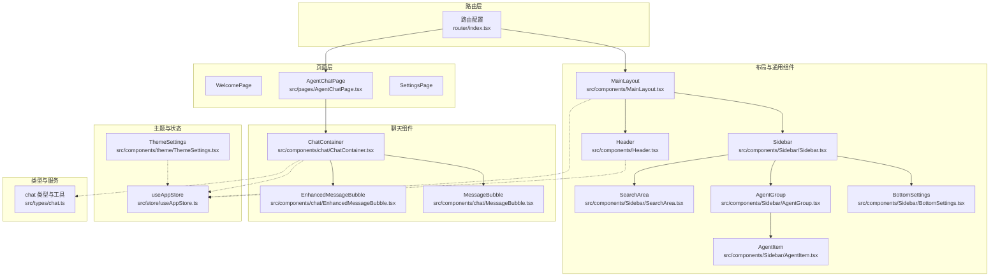
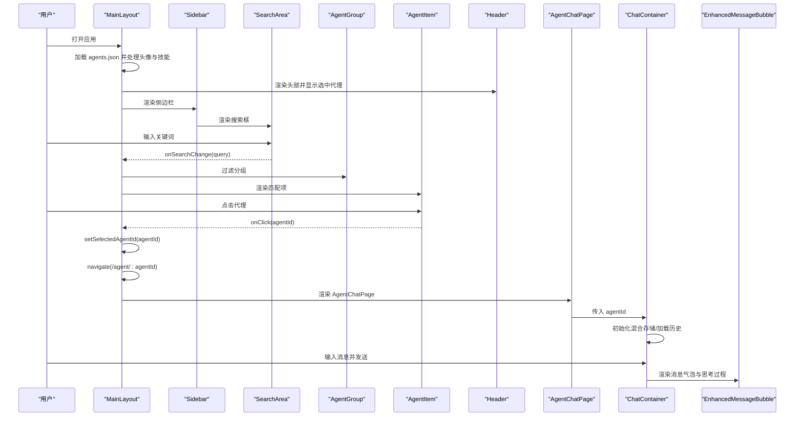
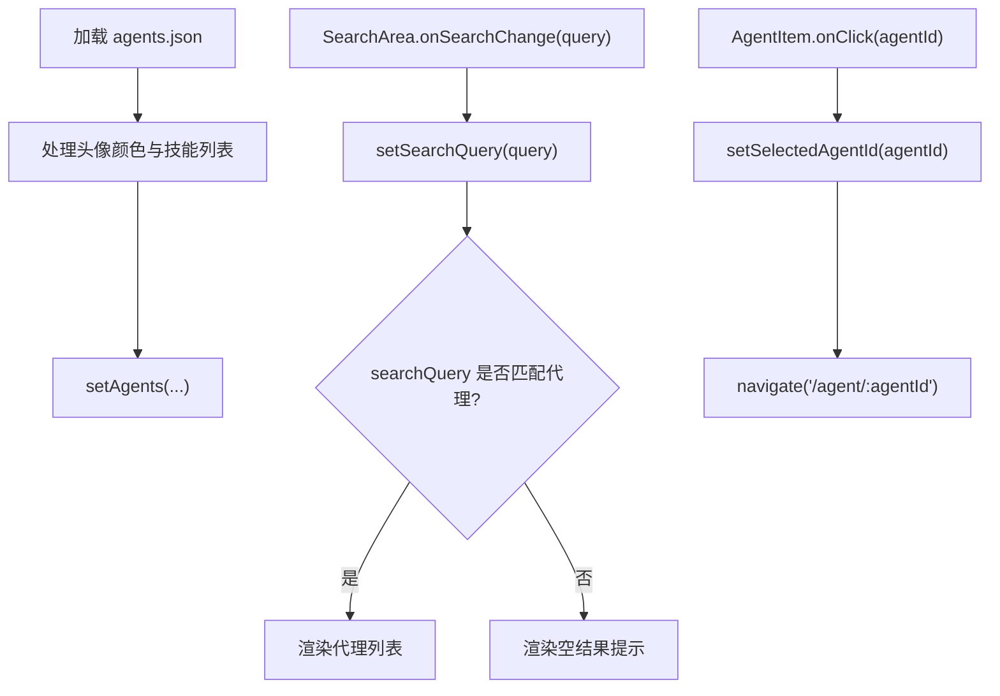
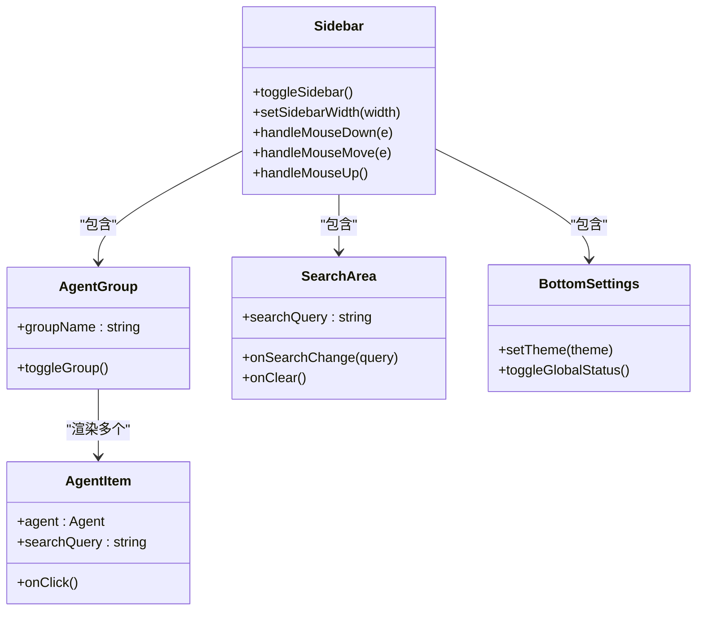
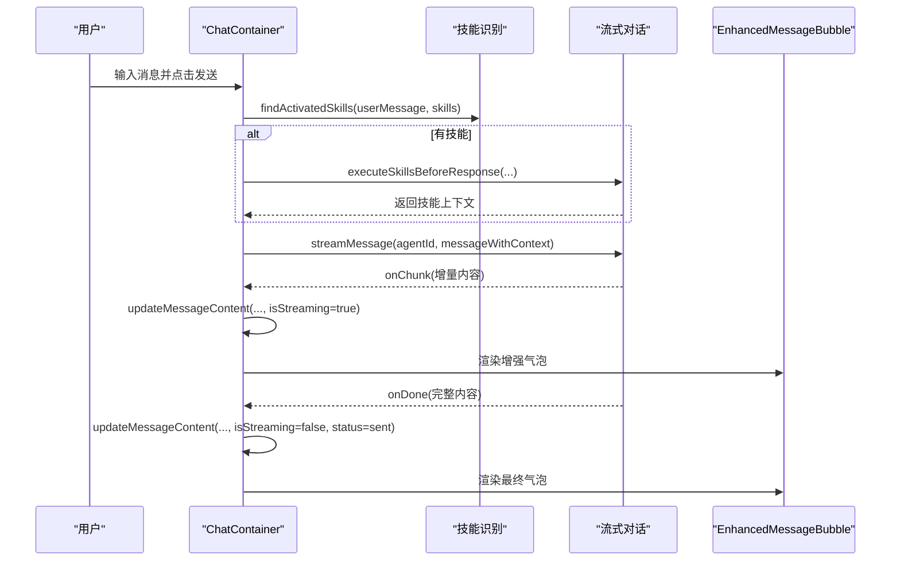
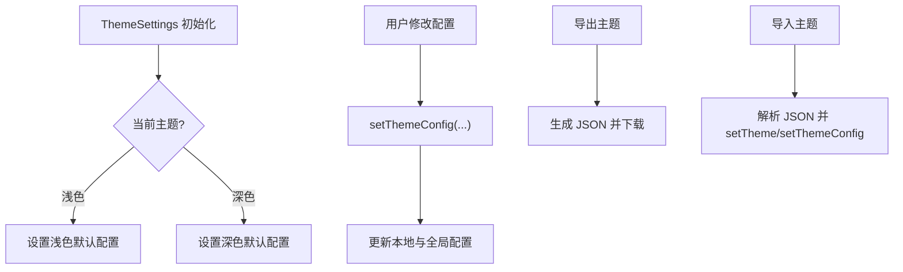
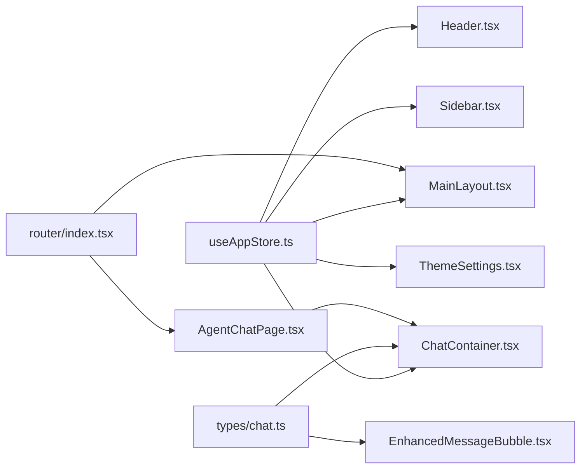

# 组件架构

<cite>
**本文引用的文件**
- [src/components/MainLayout.tsx](file://src/components/MainLayout.tsx)
- [src/components/Header.tsx](file://src/components/Header.tsx)
- [src/components/Sidebar/Sidebar.tsx](file://src/components/Sidebar/Sidebar.tsx)
- [src/components/Sidebar/AgentGroup.tsx](file://src/components/Sidebar/AgentGroup.tsx)
- [src/components/Sidebar/AgentItem.tsx](file://src/components/Sidebar/AgentItem.tsx)
- [src/components/Sidebar/SearchArea.tsx](file://src/components/Sidebar/SearchArea.tsx)
- [src/components/Sidebar/BottomSettings.tsx](file://src/components/Sidebar/BottomSettings.tsx)
- [src/components/chat/ChatContainer.tsx](file://src/components/chat/ChatContainer.tsx)
- [src/components/chat/EnhancedMessageBubble.tsx](file://src/components/chat/EnhancedMessageBubble.tsx)
- [src/components/chat/MessageBubble.tsx](file://src/components/chat/MessageBubble.tsx)
- [src/components/theme/ThemeSettings.tsx](file://src/components/theme/ThemeSettings.tsx)
- [src/store/useAppStore.ts](file://src/store/useAppStore.ts)
- [src/types/chat.ts](file://src/types/chat.ts)
- [src/pages/AgentChatPage.tsx](file://src/pages/AgentChatPage.tsx)
- [src/router/index.tsx](file://src/router/index.tsx)
</cite>

## 目录
1. [引言](#引言)
2. [项目结构](#项目结构)
3. [核心组件](#核心组件)
4. [架构总览](#架构总览)
5. [详细组件分析](#详细组件分析)
6. [依赖关系分析](#依赖关系分析)
7. [性能考量](#性能考量)
8. [故障排查指南](#故障排查指南)
9. [结论](#结论)
10. [附录](#附录)

## 引言
本文件系统化梳理 AutoMate 的前端组件架构，重点覆盖主布局组件 MainLayout 的设计模式、侧边栏组件体系（Sidebar、AgentGroup、AgentItem、SearchArea、BottomSettings）的功能分工与交互逻辑；聊天组件链（ChatContainer、EnhancedMessageBubble、MessageBubble）的消息渲染机制与状态管理；头部组件 Header 的职责与主题设置组件的实现原理。同时总结 Props 传递、事件处理与状态提升的最佳实践，并给出组件开发规范、性能优化技巧与调试方法。

## 项目结构
AutoMate 采用按功能域分层的组织方式：
- 组件层：页面级组件（如 MainLayout、AgentChatPage）、通用布局组件（Sidebar 系列、Header）、聊天组件（ChatContainer、EnhancedMessageBubble、MessageBubble）、主题设置组件（ThemeSettings）。
- 存储层：基于 Zustand 的全局状态 useAppStore，统一管理代理列表、聊天会话、用户设置、主题配置等。
- 类型与服务：聊天类型定义与流式对话工具（streamChatWithAgent 等），页面路由与导航。
- 页面层：WelcomePage、AgentChatPage、SettingsPage 等。

图表来源
- [src/router/index.tsx](file://src/router/index.tsx#L1-L43)
- [src/components/MainLayout.tsx](file://src/components/MainLayout.tsx#L1-L134)
- [src/components/Header.tsx](file://src/components/Header.tsx#L1-L169)
- [src/components/Sidebar/Sidebar.tsx](file://src/components/Sidebar/Sidebar.tsx#L1-L179)
- [src/components/Sidebar/SearchArea.tsx](file://src/components/Sidebar/SearchArea.tsx#L1-L123)
- [src/components/Sidebar/AgentGroup.tsx](file://src/components/Sidebar/AgentGroup.tsx#L1-L54)
- [src/components/Sidebar/AgentItem.tsx](file://src/components/Sidebar/AgentItem.tsx#L1-L191)
- [src/components/Sidebar/BottomSettings.tsx](file://src/components/Sidebar/BottomSettings.tsx#L1-L64)
- [src/components/chat/ChatContainer.tsx](file://src/components/chat/ChatContainer.tsx#L1-L756)
- [src/components/chat/EnhancedMessageBubble.tsx](file://src/components/chat/EnhancedMessageBubble.tsx#L1-L217)
- [src/components/chat/MessageBubble.tsx](file://src/components/chat/MessageBubble.tsx#L1-L90)
- [src/components/theme/ThemeSettings.tsx](file://src/components/theme/ThemeSettings.tsx#L1-L262)
- [src/store/useAppStore.ts](file://src/store/useAppStore.ts#L1-L306)
- [src/types/chat.ts](file://src/types/chat.ts#L1-L280)

章节来源
- [src/router/index.tsx](file://src/router/index.tsx#L1-L43)
- [src/components/MainLayout.tsx](file://src/components/MainLayout.tsx#L1-L134)

## 核心组件
- 全局状态中心：useAppStore 提供代理列表、聊天会话、用户设置、主题配置、全局状态等，统一通过动作函数进行更新，避免跨层级重复传递 Props。
- 聊天类型与工具：chat.ts 定义了 Agent、Message、Skill 等类型以及流式对话生成器，为 ChatContainer 提供底层能力。
- 页面与路由：AgentChatPage 从路由参数读取 agentId 并注入到全局状态；路由配置统一挂载 MainLayout，确保所有页面共享同一布局与侧边栏。

章节来源
- [src/store/useAppStore.ts](file://src/store/useAppStore.ts#L1-L306)
- [src/types/chat.ts](file://src/types/chat.ts#L1-L280)
- [src/pages/AgentChatPage.tsx](file://src/pages/AgentChatPage.tsx#L1-L24)
- [src/router/index.tsx](file://src/router/index.tsx#L1-L43)

## 架构总览
AutoMate 采用“布局 + 侧边栏 + 内容区”的主布局模式。MainLayout 负责加载代理配置、维护搜索过滤、协调 Header 与侧边栏交互，并将子页面内容渲染在主区域。聊天组件链位于内容区，围绕 ChatContainer 展开，EnhancedMessageBubble 负责富文本与思考过程展示，MessageBubble 提供基础气泡渲染。主题设置组件 ThemeSettings 通过 useAppStore 更新主题与主题配置，并支持导出/导入。

图表来源
- [src/components/MainLayout.tsx](file://src/components/MainLayout.tsx#L1-L134)
- [src/components/Sidebar/SearchArea.tsx](file://src/components/Sidebar/SearchArea.tsx#L1-L123)
- [src/components/Sidebar/AgentGroup.tsx](file://src/components/Sidebar/AgentGroup.tsx#L1-L54)
- [src/components/Sidebar/AgentItem.tsx](file://src/components/Sidebar/AgentItem.tsx#L1-L191)
- [src/components/Header.tsx](file://src/components/Header.tsx#L1-L169)
- [src/pages/AgentChatPage.tsx](file://src/pages/AgentChatPage.tsx#L1-L24)
- [src/components/chat/ChatContainer.tsx](file://src/components/chat/ChatContainer.tsx#L1-L756)
- [src/components/chat/EnhancedMessageBubble.tsx](file://src/components/chat/EnhancedMessageBubble.tsx#L1-L217)

## 详细组件分析

### MainLayout 设计模式与职责
- 设计模式：容器组件 + 布局组合。MainLayout 作为顶层布局容器，负责：
  - 初始化代理配置（agents.json），转换头像颜色与技能名称数组。
  - 维护搜索查询状态，计算搜索结果是否为空并提示。
  - 根据主题动态切换类名，控制主内容区背景。
  - 将 Header、Sidebar、子页面内容以组合方式渲染。
- 交互逻辑：
  - 侧边栏代理点击触发 setSelectedAgentId 并跳转至对应聊天页。
  - SearchArea 通过 onSearchChange/onClear 与 MainLayout 同步搜索状态。
- Props 传递：children 由路由层注入，MainLayout 仅负责布局与状态桥接。

图表来源
- [src/components/MainLayout.tsx](file://src/components/MainLayout.tsx#L17-L65)
- [src/components/Sidebar/SearchArea.tsx](file://src/components/Sidebar/SearchArea.tsx#L21-L32)
- [src/components/Sidebar/AgentItem.tsx](file://src/components/Sidebar/AgentItem.tsx#L21-L27)

章节来源
- [src/components/MainLayout.tsx](file://src/components/MainLayout.tsx#L1-L134)

### 侧边栏组件体系（Sidebar、AgentGroup、AgentItem、SearchArea、BottomSettings）
- Sidebar：负责侧边栏宽度与折叠状态，提供拖拽调整宽度与展开/收起按钮，根据主题切换样式。
- AgentGroup：分组容器，支持点击切换展开/收起，内部渲染 AgentItem 列表。
- AgentItem：单个代理项，支持高亮搜索关键词、显示在线状态徽标、选中态样式、悬停动画。
- SearchArea：搜索输入框，支持清空、实时同步查询、根据主题切换样式。
- BottomSettings：底部操作区，提供主题切换、设置入口、全局状态切换与版本信息。

图表来源
- [src/components/Sidebar/Sidebar.tsx](file://src/components/Sidebar/Sidebar.tsx#L1-L179)
- [src/components/Sidebar/AgentGroup.tsx](file://src/components/Sidebar/AgentGroup.tsx#L1-L54)
- [src/components/Sidebar/AgentItem.tsx](file://src/components/Sidebar/AgentItem.tsx#L1-L191)
- [src/components/Sidebar/SearchArea.tsx](file://src/components/Sidebar/SearchArea.tsx#L1-L123)
- [src/components/Sidebar/BottomSettings.tsx](file://src/components/Sidebar/BottomSettings.tsx#L1-L64)

章节来源
- [src/components/Sidebar/Sidebar.tsx](file://src/components/Sidebar/Sidebar.tsx#L1-L179)
- [src/components/Sidebar/AgentGroup.tsx](file://src/components/Sidebar/AgentGroup.tsx#L1-L54)
- [src/components/Sidebar/AgentItem.tsx](file://src/components/Sidebar/AgentItem.tsx#L1-L191)
- [src/components/Sidebar/SearchArea.tsx](file://src/components/Sidebar/SearchArea.tsx#L1-L123)
- [src/components/Sidebar/BottomSettings.tsx](file://src/components/Sidebar/BottomSettings.tsx#L1-L64)

### 聊天组件链（ChatContainer、EnhancedMessageBubble、MessageBubble）
- ChatContainer：
  - 初始化混合存储与聊天历史加载。
  - 识别用户消息中激活的技能，优先执行技能再发起流式对话。
  - 管理输入框高度自适应、滚动行为、发送/停止/重试流程。
  - 流式回调中累积内容与思考片段，更新消息状态与数据库持久化。
  - 通过 useAppStore 的动作函数管理消息、打字状态与时间戳。
- EnhancedMessageBubble：
  - 支持 Markdown 渲染、代码块高亮、复制与重试按钮。
  - 展示“思考过程”面板，支持展开/收起，流式时默认展开。
  - 展示技能激活徽章，区分用户/助手气泡样式。
- MessageBubble：
  - 基础气泡组件，用于历史或简化场景。

图表来源
- [src/components/chat/ChatContainer.tsx](file://src/components/chat/ChatContainer.tsx#L213-L392)
- [src/components/chat/EnhancedMessageBubble.tsx](file://src/components/chat/EnhancedMessageBubble.tsx#L16-L96)

章节来源
- [src/components/chat/ChatContainer.tsx](file://src/components/chat/ChatContainer.tsx#L1-L756)
- [src/components/chat/EnhancedMessageBubble.tsx](file://src/components/chat/EnhancedMessageBubble.tsx#L1-L217)
- [src/components/chat/MessageBubble.tsx](file://src/components/chat/MessageBubble.tsx#L1-L90)

### 头部组件 Header 的职责与主题设置组件实现
- Header 职责：
  - 显示当前选中的代理头像与名称描述，支持返回首页。
  - 根据主题动态切换边框、文字与渐变色。
  - 提供移动端菜单按钮占位与用户信息展示。
- 主题设置组件 ThemeSettings：
  - 读取/写入 useAppStore 中的主题与主题配置。
  - 提供浅色/深色切换、主辅色、文本/背景/边框色、字号/字重、动画开关与时长。
  - 支持导出/导入主题配置，重置默认值。

图表来源
- [src/components/theme/ThemeSettings.tsx](file://src/components/theme/ThemeSettings.tsx#L10-L50)
- [src/components/theme/ThemeSettings.tsx](file://src/components/theme/ThemeSettings.tsx#L73-L106)
- [src/store/useAppStore.ts](file://src/store/useAppStore.ts#L262-L284)

章节来源
- [src/components/Header.tsx](file://src/components/Header.tsx#L1-L169)
- [src/components/theme/ThemeSettings.tsx](file://src/components/theme/ThemeSettings.tsx#L1-L262)
- [src/store/useAppStore.ts](file://src/store/useAppStore.ts#L1-L306)

## 依赖关系分析
- 组件耦合：
  - MainLayout 与 Sidebar/AgentGroup/AgentItem/SearchArea/BottomSettings 为组合关系，MainLayout 通过状态与回调驱动交互。
  - ChatContainer 依赖 useAppStore 动作与 chat.ts 工具，形成“视图-状态-服务”三层。
  - Header 与 ThemeSettings 通过 useAppStore 读取主题配置，ThemeSettings 写回配置。
- 外部依赖：
  - react-markdown 用于增强气泡的 Markdown 渲染。
  - lucide-react 图标库。
  - axios/fetch 用于聊天与技能调用。
- 潜在循环依赖：
  - 当前文件结构未见直接循环依赖；若未来引入跨组件双向回调需谨慎设计。

图表来源
- [src/store/useAppStore.ts](file://src/store/useAppStore.ts#L1-L306)
- [src/components/MainLayout.tsx](file://src/components/MainLayout.tsx#L1-L134)
- [src/components/Header.tsx](file://src/components/Header.tsx#L1-L169)
- [src/components/Sidebar/Sidebar.tsx](file://src/components/Sidebar/Sidebar.tsx#L1-L179)
- [src/components/chat/ChatContainer.tsx](file://src/components/chat/ChatContainer.tsx#L1-L756)
- [src/components/theme/ThemeSettings.tsx](file://src/components/theme/ThemeSettings.tsx#L1-L262)
- [src/types/chat.ts](file://src/types/chat.ts#L1-L280)
- [src/router/index.tsx](file://src/router/index.tsx#L1-L43)
- [src/pages/AgentChatPage.tsx](file://src/pages/AgentChatPage.tsx#L1-L24)

章节来源
- [src/store/useAppStore.ts](file://src/store/useAppStore.ts#L1-L306)
- [src/types/chat.ts](file://src/types/chat.ts#L1-L280)
- [src/router/index.tsx](file://src/router/index.tsx#L1-L43)

## 性能考量
- 渲染优化
  - ChatContainer 使用 useMemo 计算搜索结果，避免无谓重渲染。
  - AgentItem 使用 useMemo 判断是否匹配，未命中直接返回 null，减少 DOM。
  - EnhancedMessageBubble 在 isStreaming 时默认展开思考面板，避免频繁切换。
- 事件与滚动
  - ChatContainer 仅在滚动接近底部时显示“回到底部”按钮，降低不必要的重绘。
  - 输入框高度自适应限制最大高度，避免频繁布局抖动。
- 状态管理
  - useAppStore 将聊天消息与打字状态按 agentId 分片存储，局部更新减少全局重渲染。
  - 主题配置与用户设置分离，主题切换只影响样式层，不触发业务数据重算。
- I/O 与流式
  - ChatContainer 对流式增量内容采用节流式 flush，减少频繁 setState。
  - 技能执行前置，减少 AI 回复中的冗余信息，缩短渲染路径。

[本节为通用指导，无需特定文件引用]

## 故障排查指南
- 代理配置未加载
  - 检查 agents.json 结构与路径，确认 MainLayout 中 fetch 请求成功。
  - 关注控制台错误日志，确认 setAgents 是否被调用。
- 搜索无结果
  - 确认 SearchArea 的 onSearchChange 是否正确调用 setSearchQuery。
  - 检查 MainLayout 中 hasSearchResults 的判断逻辑。
- 聊天无响应
  - 查看 ChatContainer 的流式回调 onChunk/onDone 是否触发。
  - 确认 skillKeywordMap 与 findActivatedSkills 的匹配逻辑。
  - 若出现“技能执行异常”，查看控制台错误堆栈与错误消息持久化。
- 主题切换无效
  - 确认 ThemeSettings 的 setTheme 与 setThemeConfig 是否被调用。
  - 检查 useAppStore 中 theme 与 themeConfig 的联动更新。
- 路由跳转失败
  - 确认 AgentChatPage 的 useParams 是否正确读取 agentId。
  - 检查路由配置与 MainLayout 包裹。

章节来源
- [src/components/MainLayout.tsx](file://src/components/MainLayout.tsx#L17-L65)
- [src/components/Sidebar/SearchArea.tsx](file://src/components/Sidebar/SearchArea.tsx#L21-L32)
- [src/components/chat/ChatContainer.tsx](file://src/components/chat/ChatContainer.tsx#L174-L211)
- [src/components/theme/ThemeSettings.tsx](file://src/components/theme/ThemeSettings.tsx#L34-L50)
- [src/pages/AgentChatPage.tsx](file://src/pages/AgentChatPage.tsx#L6-L23)

## 结论
AutoMate 的组件架构以 MainLayout 为核心，通过 Sidebar 与 Header 提供一致的导航与信息展示，聊天组件链围绕 ChatContainer 实现“技能识别—前置执行—流式渲染—持久化”的闭环。全局状态 useAppStore 将代理、聊天、主题与用户设置统一管理，配合清晰的 Props 传递与事件回调，实现了高内聚、低耦合的前端架构。建议在后续迭代中进一步抽象可复用的 Hook（如 useAgentChat）与工具函数，完善单元测试与集成测试，持续优化渲染性能与用户体验。

[本节为总结性内容，无需特定文件引用]

## 附录
- 组件开发规范
  - Props 设计：尽量保持单向数据流，事件回调通过父组件动作函数传递。
  - 状态提升：跨组件共享的状态统一放入 useAppStore，避免在子组件中分散管理。
  - 事件处理：对高频事件（如滚动、输入）采用节流/防抖策略。
  - 可访问性：为交互元素提供 aria-label 与键盘支持。
- 最佳实践
  - 使用 useMemo/useCallback 缓存昂贵计算与回调。
  - 采用条件渲染与空节点返回（如 AgentItem 未命中时返回 null）。
  - 主题与样式通过 CSS 变量与主题配置解耦，便于扩展。
- 调试方法
  - 使用浏览器开发者工具观察组件树与状态变化。
  - 在关键路径（fetch、流式回调、持久化）打印日志定位问题。
  - 对复杂渲染（Markdown、代码块）单独抽离测试，确保稳定性。

[本节为通用指导，无需特定文件引用]