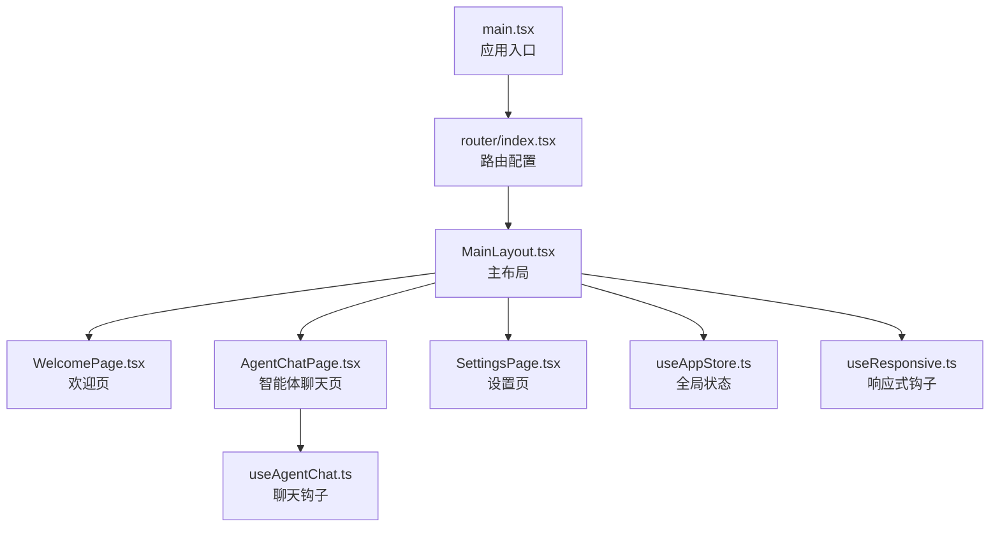
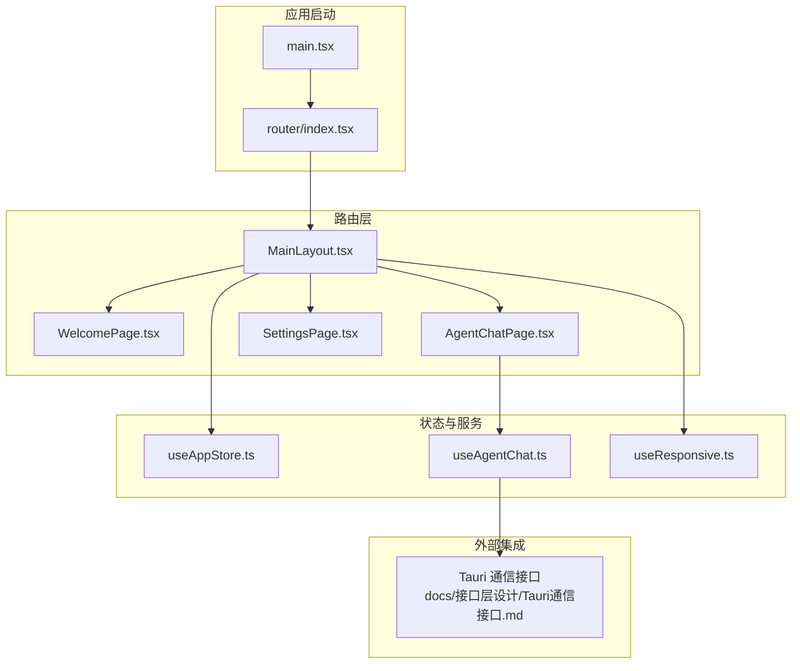
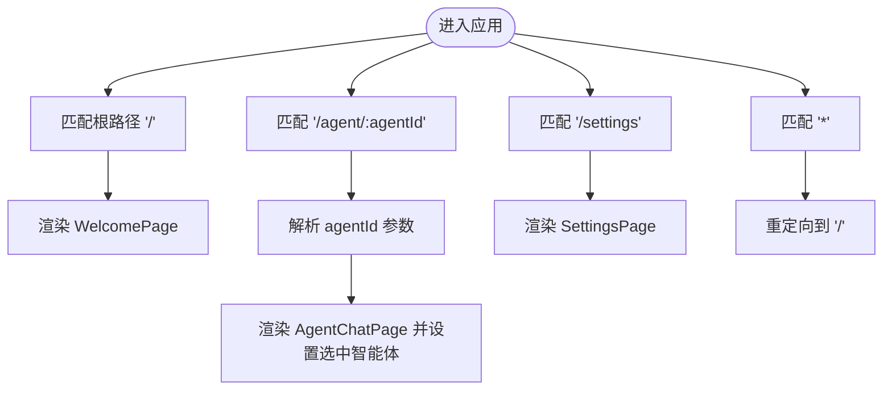
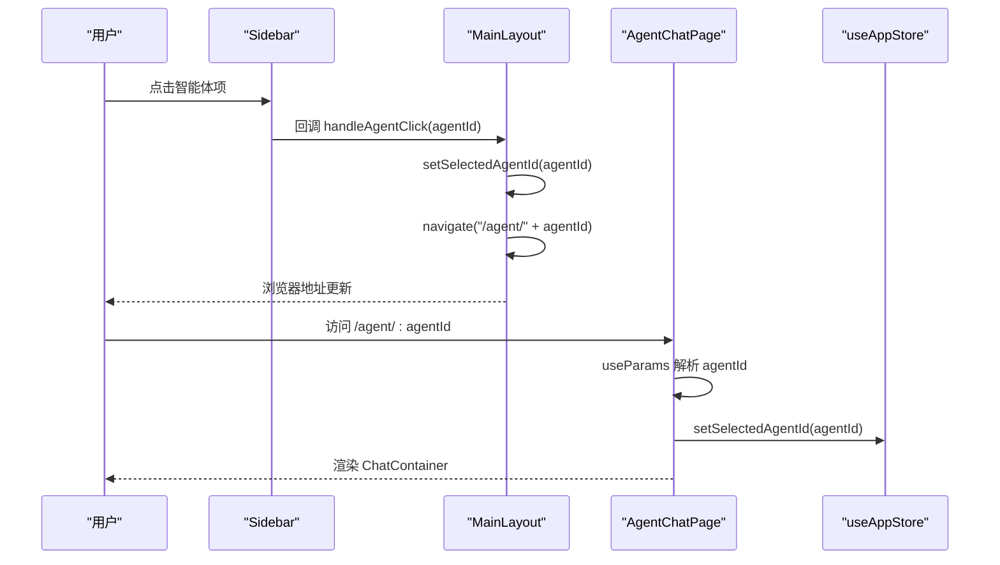
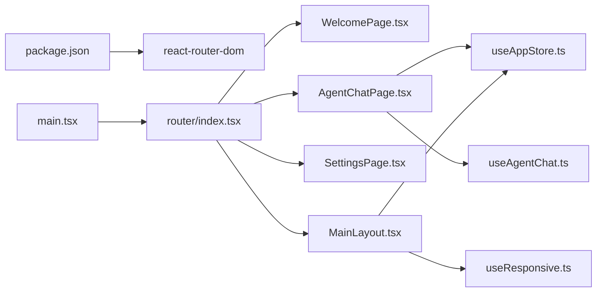

# 路由系统

<cite>
**本文引用的文件**
- [src/router/index.tsx](file://src/router/index.tsx)
- [src/main.tsx](file://src/main.tsx)
- [src/components/MainLayout.tsx](file://src/components/MainLayout.tsx)
- [src/pages/WelcomePage.tsx](file://src/pages/WelcomePage.tsx)
- [src/pages/AgentChatPage.tsx](file://src/pages/AgentChatPage.tsx)
- [src/pages/SettingsPage.tsx](file://src/pages/SettingsPage.tsx)
- [src/store/useAppStore.ts](file://src/store/useAppStore.ts)
- [src/hooks/useAgentChat.ts](file://src/hooks/useAgentChat.ts)
- [src/hooks/useResponsive.ts](file://src/hooks/useResponsive.ts)
- [package.json](file://package.json)
- [docs/接口层设计/Tauri通信接口.md](file://docs/接口层设计/Tauri通信接口.md)
</cite>

## 目录
1. [引言](#引言)
2. [项目结构](#项目结构)
3. [核心组件](#核心组件)
4. [架构总览](#架构总览)
5. [详细组件分析](#详细组件分析)
6. [依赖关系分析](#依赖关系分析)
7. [性能考量](#性能考量)
8. [故障排查指南](#故障排查指南)
9. [结论](#结论)
10. [附录](#附录)

## 引言
本文件系统性梳理 AutoMate 的前端路由体系，围绕 React Router v6 的配置与使用、路由层级设计、页面导航机制展开，重点覆盖：
- 路由表结构与动态路由参数
- 路由守卫与导航控制
- 页面组件组织与代码分割策略
- 页面间导航逻辑、路由状态管理与历史记录
- 性能优化、SEO 与用户体验设计
- 与 Tauri 框架的集成与原生导航思路

## 项目结构
AutoMate 前端采用 Vite + React + React Router v6 构建，路由入口位于 src/router/index.tsx，根组件在 src/main.tsx 中挂载。页面组件按功能分层放置于 src/pages，通用布局与侧边栏等复用组件位于 src/components。

图表来源
- [src/main.tsx](file://src/main.tsx#L1-L12)
- [src/router/index.tsx](file://src/router/index.tsx#L1-L43)
- [src/components/MainLayout.tsx](file://src/components/MainLayout.tsx#L1-L134)
- [src/pages/WelcomePage.tsx](file://src/pages/WelcomePage.tsx#L1-L110)
- [src/pages/AgentChatPage.tsx](file://src/pages/AgentChatPage.tsx#L1-L24)
- [src/pages/SettingsPage.tsx](file://src/pages/SettingsPage.tsx#L1-L33)
- [src/hooks/useAgentChat.ts](file://src/hooks/useAgentChat.ts#L1-L128)
- [src/store/useAppStore.ts](file://src/store/useAppStore.ts#L1-L306)
- [src/hooks/useResponsive.ts](file://src/hooks/useResponsive.ts#L1-L110)

章节来源
- [src/main.tsx](file://src/main.tsx#L1-L12)
- [src/router/index.tsx](file://src/router/index.tsx#L1-L43)

## 核心组件
- 路由器与路由表：基于 createBrowserRouter 定义根路径、智能体聊天页动态路由与设置页，并以通配符路由兜底重定向至首页。
- 主布局：统一承载侧边栏、搜索区、智能体列表、头部与内容区域，负责导航跳转与主题切换。
- 页面组件：欢迎页、智能体聊天页、设置页分别承担不同业务职责。
- 全局状态：Zustand 状态管理，集中维护智能体配置、当前选中智能体、聊天会话、用户设置与主题等。
- 导航钩子：useAgentChat 提供与智能体交互的封装；useResponsive 提供断点与视口尺寸响应能力。

章节来源
- [src/router/index.tsx](file://src/router/index.tsx#L1-L43)
- [src/components/MainLayout.tsx](file://src/components/MainLayout.tsx#L1-L134)
- [src/pages/WelcomePage.tsx](file://src/pages/WelcomePage.tsx#L1-L110)
- [src/pages/AgentChatPage.tsx](file://src/pages/AgentChatPage.tsx#L1-L24)
- [src/pages/SettingsPage.tsx](file://src/pages/SettingsPage.tsx#L1-L33)
- [src/store/useAppStore.ts](file://src/store/useAppStore.ts#L1-L306)
- [src/hooks/useAgentChat.ts](file://src/hooks/useAgentChat.ts#L1-L128)
- [src/hooks/useResponsive.ts](file://src/hooks/useResponsive.ts#L1-L110)

## 架构总览
下图展示路由系统在应用中的位置与交互关系：

图表来源
- [src/main.tsx](file://src/main.tsx#L1-L12)
- [src/router/index.tsx](file://src/router/index.tsx#L1-L43)
- [src/components/MainLayout.tsx](file://src/components/MainLayout.tsx#L1-L134)
- [src/pages/WelcomePage.tsx](file://src/pages/WelcomePage.tsx#L1-L110)
- [src/pages/AgentChatPage.tsx](file://src/pages/AgentChatPage.tsx#L1-L24)
- [src/pages/SettingsPage.tsx](file://src/pages/SettingsPage.tsx#L1-L33)
- [src/store/useAppStore.ts](file://src/store/useAppStore.ts#L1-L306)
- [src/hooks/useAgentChat.ts](file://src/hooks/useAgentChat.ts#L1-L128)
- [docs/接口层设计/Tauri通信接口.md](file://docs/接口层设计/Tauri通信接口.md#L1-L1013)

## 详细组件分析

### 路由表与路由层级
- 路由表定义
  - 根路径“/”：渲染 MainLayout 包裹的 WelcomePage。
  - 动态路由“/agent/:agentId”：渲染 MainLayout 包裹的 AgentChatPage，并通过 useParams 获取 agentId。
  - 设置页“/settings”：渲染 MainLayout 包裹的 SettingsPage。
  - 通配符兜底“*”：重定向至“/”。
- 路由层级
  - 所有页面均包裹 MainLayout，形成统一的侧边栏、头部与内容区布局。
  - 动态路由参数仅用于页面识别与状态同步，不涉及深层嵌套路由。

图表来源
- [src/router/index.tsx](file://src/router/index.tsx#L7-L36)
- [src/pages/AgentChatPage.tsx](file://src/pages/AgentChatPage.tsx#L6-L18)

章节来源
- [src/router/index.tsx](file://src/router/index.tsx#L1-L43)
- [src/pages/AgentChatPage.tsx](file://src/pages/AgentChatPage.tsx#L1-L24)

### 动态路由参数与页面状态
- 动态参数：AgentChatPage 使用 useParams 获取 agentId，并通过 useAppStore 将其写入全局状态，保证聊天容器与侧边栏状态一致。
- 参数校验与兜底：当 agentId 缺失时，直接重定向至首页，避免无效渲染。
- 状态同步：MainLayout 在点击智能体项时，调用 useNavigate 进行编程式导航，并更新选中智能体 ID。

图表来源
- [src/components/MainLayout.tsx](file://src/components/MainLayout.tsx#L51-L54)
- [src/pages/AgentChatPage.tsx](file://src/pages/AgentChatPage.tsx#L6-L14)
- [src/store/useAppStore.ts](file://src/store/useAppStore.ts#L129)

章节来源
- [src/components/MainLayout.tsx](file://src/components/MainLayout.tsx#L51-L54)
- [src/pages/AgentChatPage.tsx](file://src/pages/AgentChatPage.tsx#L1-L24)
- [src/store/useAppStore.ts](file://src/store/useAppStore.ts#L129)

### 路由守卫与导航控制
- 当前实现：通过通配符“*”兜底并重定向至“/”，实现基础的未匹配路由保护。
- 建议增强：
  - 在路由表层增加对受保护路径的守卫逻辑（如鉴权），结合 useNavigate 与全局状态进行条件跳转。
  - 对动态路由参数进行合法性校验（如 agentId 是否存在于已加载的智能体列表）。
  - 结合浏览器历史记录 API，实现更精细的前进/后退行为控制。

章节来源
- [src/router/index.tsx](file://src/router/index.tsx#L32-L36)

### 页面组件组织与代码分割
- 组件组织：页面组件按功能划分，统一由 MainLayout 包裹，便于共享布局与状态。
- 代码分割建议：
  - 使用 React.lazy 与 Suspense 对大型页面（如 ChatContainer）进行懒加载。
  - 将第三方依赖较大的组件拆分为独立包，配合动态 import 实现按需加载。
  - 为路由级组件配置独立打包块，减少首屏体积。

章节来源
- [src/components/MainLayout.tsx](file://src/components/MainLayout.tsx#L1-L134)
- [src/pages/WelcomePage.tsx](file://src/pages/WelcomePage.tsx#L1-L110)
- [src/pages/SettingsPage.tsx](file://src/pages/SettingsPage.tsx#L1-L33)

### 导航逻辑、历史记录与用户体验
- 导航逻辑：
  - 声明式：在侧边栏与链接中使用 React Router 提供的导航组件。
  - 编程式：MainLayout 使用 useNavigate 进行路由跳转。
- 历史记录：React Router 自动维护浏览器历史栈，支持前进/后退。
- 用户体验：
  - 响应式断点与视口监听：useResponsive 提供断点与方向检测，适配移动端与桌面端布局。
  - 主题切换：根据用户设置动态切换主题与样式类名，提升可访问性。

章节来源
- [src/components/MainLayout.tsx](file://src/components/MainLayout.tsx#L1-L134)
- [src/hooks/useResponsive.ts](file://src/hooks/useResponsive.ts#L1-L110)

### 与 Tauri 的集成与原生导航
- Tauri 通信：前端通过 @tauri-apps/api 调用后端函数（invoke），后端可返回数据或触发事件，前端据此更新路由或状态。
- 原生导航思路：
  - 在需要原生窗口行为时，可通过 Tauri 的命令与事件系统驱动前端路由变化。
  - 对于文件选择、系统对话框等场景，先通过 Tauri 触发系统交互，再根据结果更新路由或打开相应页面。

章节来源
- [docs/接口层设计/Tauri通信接口.md](file://docs/接口层设计/Tauri通信接口.md#L1-L1013)

## 依赖关系分析
- 路由依赖：main.tsx 依赖 router/index.tsx；router/index.tsx 依赖各页面组件与 MainLayout。
- 组件依赖：AgentChatPage 依赖 useAppStore；MainLayout 依赖 useNavigate、useAppStore 与 useResponsive。
- 状态依赖：useAgentChat 依赖 useAppStore 与类型定义，负责聊天流程与错误处理。
- 外部依赖：package.json 明确 react-router-dom 版本，确保路由能力稳定。

图表来源
- [package.json](file://package.json#L15-L27)
- [src/main.tsx](file://src/main.tsx#L1-L12)
- [src/router/index.tsx](file://src/router/index.tsx#L1-L43)
- [src/pages/WelcomePage.tsx](file://src/pages/WelcomePage.tsx#L1-L110)
- [src/pages/AgentChatPage.tsx](file://src/pages/AgentChatPage.tsx#L1-L24)
- [src/pages/SettingsPage.tsx](file://src/pages/SettingsPage.tsx#L1-L33)
- [src/components/MainLayout.tsx](file://src/components/MainLayout.tsx#L1-L134)
- [src/store/useAppStore.ts](file://src/store/useAppStore.ts#L1-L306)
- [src/hooks/useAgentChat.ts](file://src/hooks/useAgentChat.ts#L1-L128)
- [src/hooks/useResponsive.ts](file://src/hooks/useResponsive.ts#L1-L110)

章节来源
- [package.json](file://package.json#L15-L27)
- [src/main.tsx](file://src/main.tsx#L1-L12)
- [src/router/index.tsx](file://src/router/index.tsx#L1-L43)

## 性能考量
- 代码分割：对大型页面与组件进行懒加载，减少初始包体积。
- 路由预取：在用户可能访问的页面前进行资源预取，降低首次渲染延迟。
- 状态最小化：将与路由无关的状态移出路由组件，避免不必要的重渲染。
- 图片与静态资源：使用合适的图片格式与尺寸，结合懒加载与占位符提升感知性能。
- 浏览器缓存：合理配置静态资源缓存策略，提升二次访问速度。

## 故障排查指南
- 动态路由参数缺失
  - 现象：访问 /agent/:agentId 时页面空白或跳回首页。
  - 排查：确认 AgentChatPage 是否正确解析 agentId 并写入全局状态；检查 MainLayout 的导航逻辑是否传入有效 agentId。
- 路由兜底失效
  - 现象：访问不存在路径时未被重定向。
  - 排查：确认通配符路由已定义且优先级最低；检查 RouterProvider 是否正确挂载。
- 路由跳转异常
  - 现象：点击智能体项无法跳转或地址栏无变化。
  - 排查：检查 useNavigate 的调用时机与参数；确认 MainLayout 的 handleAgentClick 逻辑。
- 状态不一致
  - 现象：侧边栏与聊天区域显示的智能体不一致。
  - 排查：确认 setSelectedAgentId 的调用顺序与时机；检查 AgentChatPage 的 useEffect 是否在参数变化时更新状态。

章节来源
- [src/pages/AgentChatPage.tsx](file://src/pages/AgentChatPage.tsx#L6-L18)
- [src/components/MainLayout.tsx](file://src/components/MainLayout.tsx#L51-L54)
- [src/router/index.tsx](file://src/router/index.tsx#L32-L36)
- [src/store/useAppStore.ts](file://src/store/useAppStore.ts#L129)

## 结论
AutoMate 的路由系统以 React Router v6 为核心，采用简洁的路由表与统一布局，满足智能体选择、聊天与设置三大核心场景。通过全局状态与导航钩子，实现了参数传递、状态同步与响应式布局。建议后续引入更完善的路由守卫、代码分割与 SEO 优化，以进一步提升安全性、性能与可维护性。

## 附录
- 路由配置示例（路径）
  - [路由表定义](file://src/router/index.tsx#L7-L36)
- 导航守卫代码（路径）
  - [通配符兜底重定向](file://src/router/index.tsx#L32-L36)
- 页面组件模板（路径）
  - [欢迎页](file://src/pages/WelcomePage.tsx#L1-L110)
  - [智能体聊天页](file://src/pages/AgentChatPage.tsx#L1-L24)
  - [设置页](file://src/pages/SettingsPage.tsx#L1-L33)
- 状态与钩子（路径）
  - [全局状态](file://src/store/useAppStore.ts#L1-L306)
  - [聊天钩子](file://src/hooks/useAgentChat.ts#L1-L128)
  - [响应式钩子](file://src/hooks/useResponsive.ts#L1-L110)
- 与 Tauri 集成（路径）
  - [Tauri 通信接口规范](file://docs/接口层设计/Tauri通信接口.md#L1-L1013)