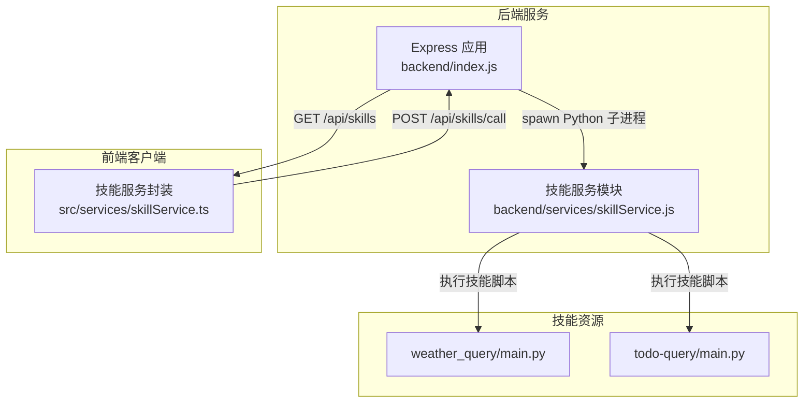
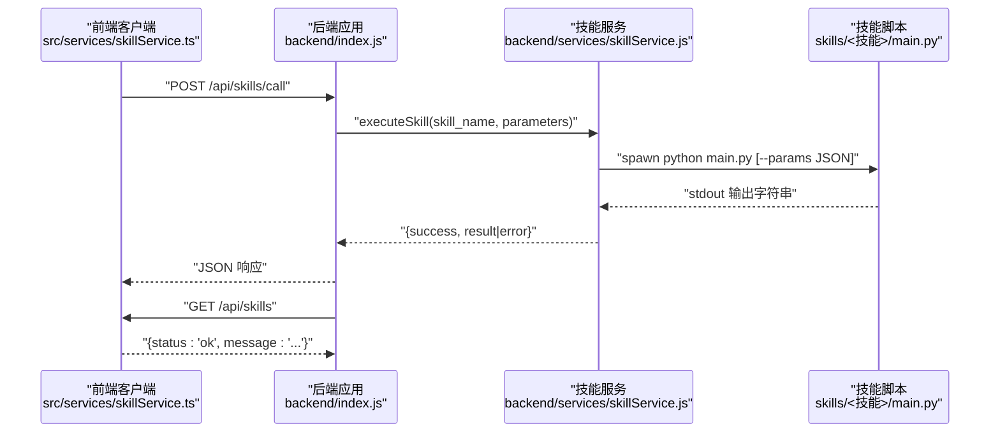
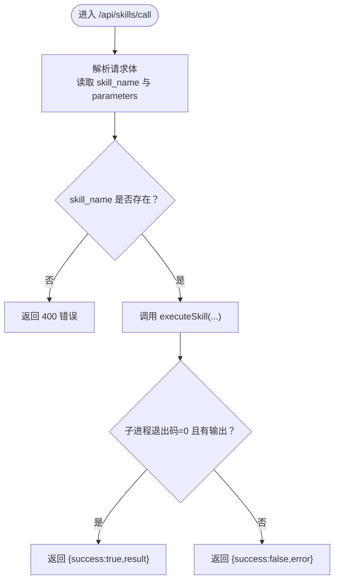
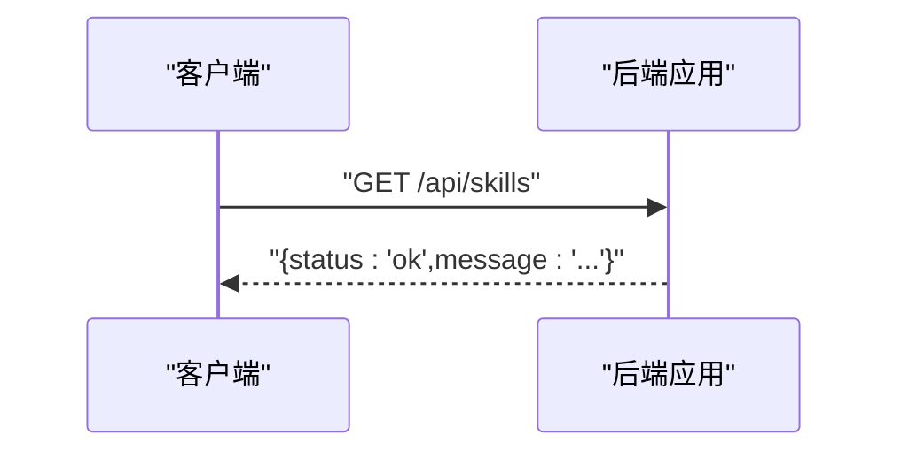
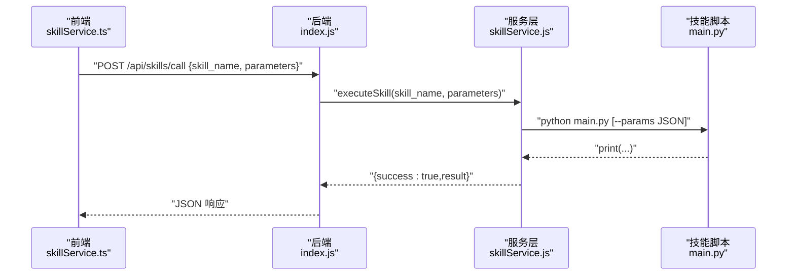
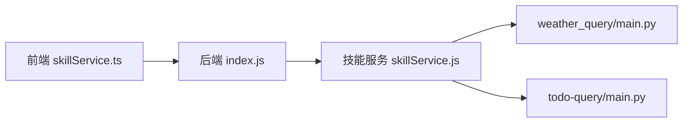

# API接口

<cite>
**本文引用的文件**
- [backend/index.js](file://backend/index.js)
- [backend/services/skillService.js](file://backend/services/skillService.js)
- [src/services/skillService.ts](file://src/services/skillService.ts)
- [skills/weather_query/main.py](file://skills/weather_query/main.py)
- [skills/todo-query/main.py](file://skills/todo-query/main.py)
- [skills/todo-query/SKILL.md](file://skills/todo-query/SKILL.md)
- [package.json](file://package.json)
</cite>

## 目录
1. [简介](#简介)
2. [项目结构](#项目结构)
3. [核心组件](#核心组件)
4. [架构总览](#架构总览)
5. [详细组件分析](#详细组件分析)
6. [依赖关系分析](#依赖关系分析)
7. [性能考虑](#性能考虑)
8. [故障排查指南](#故障排查指南)
9. [结论](#结论)
10. [附录](#附录)

## 简介
本文件面向AutoMate后端API接口的使用者与集成者，系统性说明以下两个关键接口：
- POST /api/skills/call：调用指定技能并返回执行结果
- GET /api/skills：健康检查接口，返回服务状态

文档涵盖请求格式、参数规范、响应结构、请求验证、错误处理、响应标准化、API版本管理、速率限制与安全防护等主题，并提供使用示例、客户端集成指南与最佳实践。

## 项目结构
后端采用Node.js + Express构建，核心逻辑集中在单入口文件与服务层模块；技能以独立Python脚本形式组织在skills目录下，通过子进程方式调用执行。

图表来源
- [backend/index.js](file://backend/index.js#L1-L117)
- [backend/services/skillService.js](file://backend/services/skillService.js#L1-L87)
- [src/services/skillService.ts](file://src/services/skillService.ts#L1-L73)
- [skills/weather_query/main.py](file://skills/weather_query/main.py#L1-L139)
- [skills/todo-query/main.py](file://skills/todo-query/main.py#L1-L34)

章节来源
- [backend/index.js](file://backend/index.js#L1-L117)
- [backend/services/skillService.js](file://backend/services/skillService.js#L1-L87)
- [src/services/skillService.ts](file://src/services/skillService.ts#L1-L73)

## 核心组件
- 后端入口与路由
  - 提供 /api/skills/call POST 与 /api/skills GET 两个端点
  - 使用CORS与JSON解析中间件
- 技能服务
  - 以子进程方式执行skills目录下的Python脚本
  - 统一返回标准化结果对象
- 前端技能服务封装
  - 对后端接口进行统一调用与错误处理
  - 支持超时控制与网络错误兜底

章节来源
- [backend/index.js](file://backend/index.js#L11-L117)
- [backend/services/skillService.js](file://backend/services/skillService.js#L16-L87)
- [src/services/skillService.ts](file://src/services/skillService.ts#L12-L73)

## 架构总览
下面的序列图展示了从前端发起调用到技能执行与结果返回的完整流程。

图表来源
- [src/services/skillService.ts](file://src/services/skillService.ts#L20-L34)
- [backend/index.js](file://backend/index.js#L81-L104)
- [backend/services/skillService.js](file://backend/services/skillService.js#L16-L71)
- [skills/weather_query/main.py](file://skills/weather_query/main.py#L128-L139)

## 详细组件分析

### POST /api/skills/call 接口
- 功能概述
  - 调用指定技能并执行，返回执行结果或错误信息
- 请求方法与路径
  - 方法：POST
  - 路径：/api/skills/call
- 请求头
  - Content-Type: application/json
- 请求体字段
  - skill_name: 字符串，必填。技能目录名，对应skills目录下的子目录名称
  - parameters: 对象，可选。传递给技能的参数集合；若存在，将作为JSON字符串传入Python脚本的命令行参数
- 响应结构
  - 成功响应：包含success与result字段
  - 失败响应：包含success与error字段
- 错误处理
  - 缺少必要参数时返回400
  - 技能执行异常或子进程错误时返回500
- 典型调用流程
  - 前端封装会自动拼装messageId与agentId等上下文参数
  - 后端收到请求后校验参数，调用技能服务执行Python脚本
  - 根据子进程退出码与输出决定成功或失败
- 示例（请求）
  - POST /api/skills/call
  - Body:
    - skill_name: "weather_query"
    - parameters: { input: "北京", customKey: "customValue" }
- 示例（成功响应）
  - { "success": true, "result": "技能执行输出文本" }
- 示例（失败响应）
  - { "success": false, "error": "错误描述信息" }

图表来源
- [backend/index.js](file://backend/index.js#L81-L104)
- [backend/services/skillService.js](file://backend/services/skillService.js#L16-L71)

章节来源
- [backend/index.js](file://backend/index.js#L81-L104)
- [backend/services/skillService.js](file://backend/services/skillService.js#L16-L71)
- [src/services/skillService.ts](file://src/services/skillService.ts#L20-L34)

### GET /api/skills 接口（健康检查）
- 功能概述
  - 健康检查端点，用于确认后端服务是否正常运行
- 请求方法与路径
  - 方法：GET
  - 路径：/api/skills
- 请求头
  - 无特殊要求
- 请求体
  - 无
- 响应结构
  - 包含status与message字段
- 示例（响应）
  - { "status": "ok", "message": "Skill API 服务运行中" }

图表来源
- [backend/index.js](file://backend/index.js#L106-L111)

章节来源
- [backend/index.js](file://backend/index.js#L106-L111)

### 技能执行与参数传递机制
- 执行方式
  - 后端通过spawn启动Python子进程执行对应技能脚本
  - 若存在parameters，将以命令行参数的形式传入脚本
- 参数约定
  - 前端封装会在parameters中注入messageId与agentId等上下文信息
  - 技能脚本通常通过命令行解析参数并读取JSON
- 输出约定
  - 技能脚本需将最终结果打印到标准输出
  - 后端捕获stdout作为result返回

图表来源
- [src/services/skillService.ts](file://src/services/skillService.ts#L20-L34)
- [backend/index.js](file://backend/index.js#L81-L104)
- [backend/services/skillService.js](file://backend/services/skillService.js#L16-L71)
- [skills/weather_query/main.py](file://skills/weather_query/main.py#L128-L139)

章节来源
- [backend/services/skillService.js](file://backend/services/skillService.js#L16-L71)
- [skills/weather_query/main.py](file://skills/weather_query/main.py#L128-L139)
- [skills/todo-query/main.py](file://skills/todo-query/main.py#L23-L34)

### 响应标准化与错误处理
- 统一响应结构
  - 成功：{ success: true, result: "..." }
  - 失败：{ success: false, error: "..." }
- 错误分类
  - 参数缺失：400
  - 执行异常：500
  - 网络/超时：由前端封装捕获并转换为统一错误结构
- 前端错误兜底
  - 超时：返回“请求超时”
  - 网络错误：提示后端服务未运行
  - Axios错误：透传后端返回的error字段或默认消息

章节来源
- [backend/index.js](file://backend/index.js#L86-L103)
- [src/services/skillService.ts](file://src/services/skillService.ts#L34-L61)

### API版本管理
- 技能元数据
  - 每个技能可通过其目录下的文档文件声明版本号（例如SKILL.md中的version字段）
- 后端版本
  - 项目根目录的package.json定义了整体版本（当前为1.0.0）
- 建议
  - 在调用时携带技能版本信息，以便后端按版本路由或兼容处理
  - 前端可在调用前查询技能元数据，确保与后端版本一致

章节来源
- [skills/todo-query/SKILL.md](file://skills/todo-query/SKILL.md#L5-L5)
- [package.json](file://package.json#L3-L3)

### 速率限制与安全防护
- CORS
  - 已启用CORS中间件，允许跨域访问
- 认证与授权
  - 当前未实现认证/授权中间件
- 速率限制
  - 当前未实现速率限制策略
- 建议
  - 在网关或反向代理层增加限流与黑白名单
  - 引入鉴权中间件，对敏感技能进行权限校验
  - 对skill_name与parameters进行白名单校验，避免任意命令执行

章节来源
- [backend/index.js](file://backend/index.js#L14-L15)

## 依赖关系分析
- 前端到后端
  - 前端通过Axios调用后端接口，统一处理超时与网络错误
- 后端到技能服务
  - 后端路由直接委托技能服务模块执行Python脚本
- 技能服务到技能脚本
  - 通过spawn子进程执行main.py，参数通过命令行传递

图表来源
- [src/services/skillService.ts](file://src/services/skillService.ts#L1-L73)
- [backend/index.js](file://backend/index.js#L1-L117)
- [backend/services/skillService.js](file://backend/services/skillService.js#L1-L87)
- [skills/weather_query/main.py](file://skills/weather_query/main.py#L1-L139)
- [skills/todo-query/main.py](file://skills/todo-query/main.py#L1-L34)

章节来源
- [src/services/skillService.ts](file://src/services/skillService.ts#L1-L73)
- [backend/index.js](file://backend/index.js#L1-L117)
- [backend/services/skillService.js](file://backend/services/skillService.js#L1-L87)

## 性能考虑
- 子进程开销
  - 每次调用都会启动新的Python进程，适合轻量技能；对于高频场景建议引入进程池或缓存
- I/O瓶颈
  - 技能脚本可能依赖外部API或文件系统，注意设置合理的超时与重试
- 并发与隔离
  - 子进程天然隔离，但并发过多可能导致系统负载升高；建议配合限流与资源配额

## 故障排查指南
- 常见问题与定位
  - 400 缺少 skill_name：检查请求体字段是否正确
  - 500 技能执行失败：查看后端日志与stderr输出
  - 网络错误：确认后端服务已启动（npm run backend），端口3001
  - 超时：调整前端超时时间或优化技能执行耗时
- 日志位置
  - 后端启动日志与技能执行日志均输出至控制台
- 建议排查步骤
  - 确认技能目录存在且包含main.py
  - 在skills目录下手动执行python main.py --params '{...}'验证脚本可用性
  - 检查技能脚本是否正确读取命令行参数并打印结果

章节来源
- [backend/index.js](file://backend/index.js#L113-L116)
- [backend/services/skillService.js](file://backend/services/skillService.js#L42-L64)

## 结论
- /api/skills/call 提供了统一的技能调用入口，具备标准化响应与基础错误处理
- /api/skills 提供健康检查能力，便于运维监控
- 当前未内置认证、限流与参数白名单，建议在生产环境中补充安全与性能策略
- 建议在调用侧携带技能版本信息，增强兼容性与可追踪性

## 附录

### 使用示例
- 调用天气查询技能
  - 请求
    - 方法：POST
    - 路径：/api/skills/call
    - Body：
      - skill_name: "weather_query"
      - parameters: { input: "北京" }
  - 响应
    - 成功：{ success: true, result: "技能输出文本" }
    - 失败：{ success: false, error: "错误描述" }

- 健康检查
  - 请求
    - 方法：GET
    - 路径：/api/skills
  - 响应
    - { status: "ok", message: "Skill API 服务运行中" }

章节来源
- [backend/index.js](file://backend/index.js#L81-L111)
- [skills/weather_query/main.py](file://skills/weather_query/main.py#L128-L139)

### 客户端集成指南
- 前端集成要点
  - 使用封装好的callSkill方法，自动注入messageId与agentId
  - 设置合理超时时间，避免长时间阻塞
  - 对失败场景进行统一提示与重试策略
- 后端集成要点
  - 确保skills目录结构正确，每个技能包含main.py
  - 在生产环境开启CORS白名单与限流策略
  - 对skill_name进行白名单校验，防止任意路径执行

章节来源
- [src/services/skillService.ts](file://src/services/skillService.ts#L12-L73)
- [backend/index.js](file://backend/index.js#L14-L15)

### 最佳实践
- 参数设计
  - 将上下文信息（如messageId、agentId）统一注入parameters
  - 对外部依赖（如API密钥）进行集中管理与脱敏
- 错误处理
  - 前端统一捕获超时与网络错误，给出明确提示
  - 后端记录详细日志，区分业务错误与系统错误
- 版本与兼容
  - 在调用侧携带技能版本，后端按版本路由或兼容处理
- 安全加固
  - 引入认证中间件与权限校验
  - 实施速率限制与IP白名单
  - 对skill_name与parameters进行严格白名单与模式校验