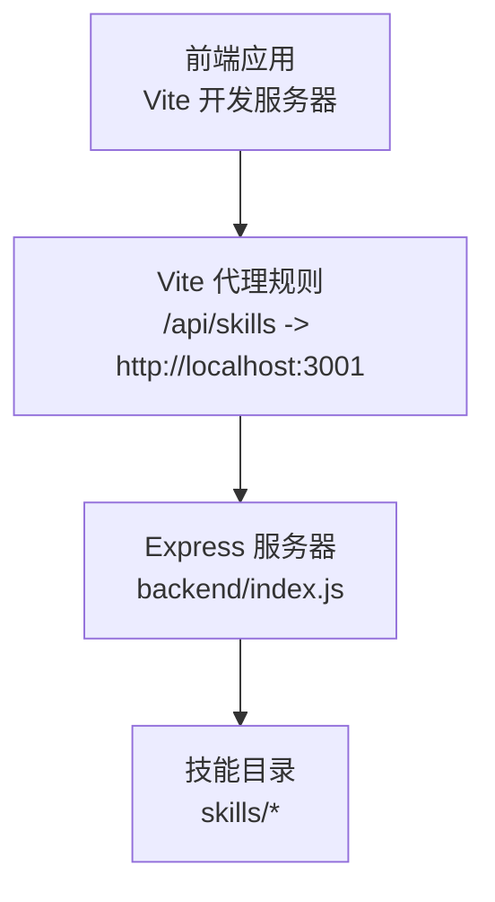
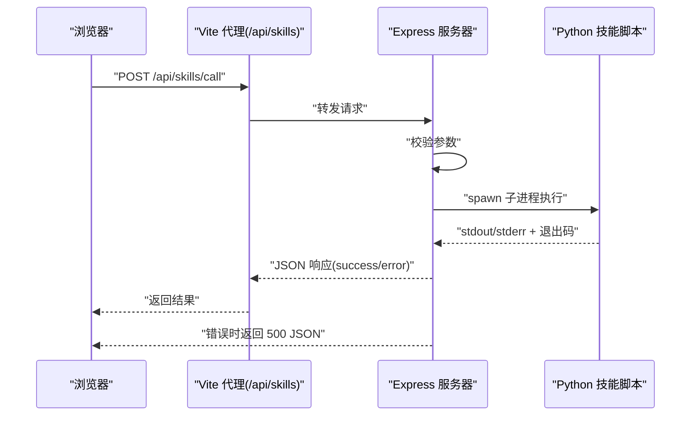
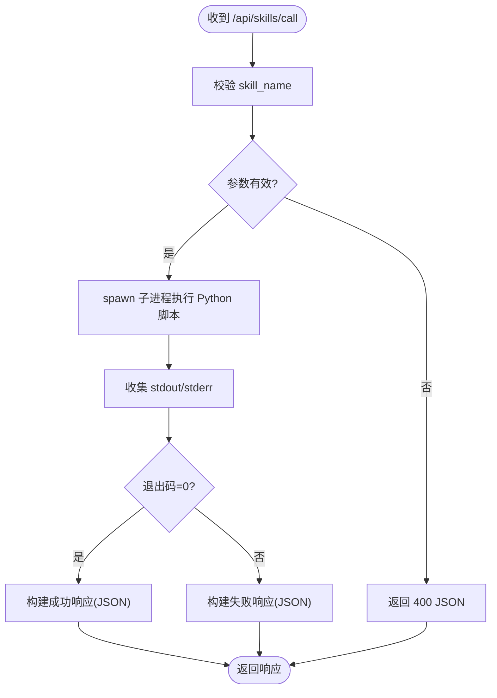
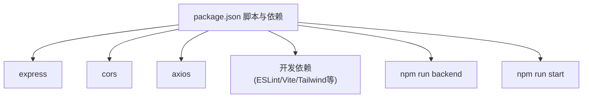

# Express服务器

<cite>
**本文引用的文件**
- [backend/index.js](file://backend/index.js)
- [package.json](file://package.json)
- [vite.config.ts](file://vite.config.ts)
</cite>

## 目录
1. [简介](#简介)
2. [项目结构](#项目结构)
3. [核心组件](#核心组件)
4. [架构总览](#架构总览)
5. [详细组件分析](#详细组件分析)
6. [依赖分析](#依赖分析)
7. [性能考虑](#性能考虑)
8. [故障排查指南](#故障排查指南)
9. [结论](#结论)
10. [附录](#附录)

## 简介
本文件面向AutoMate项目的Express服务器，聚焦于服务器初始化配置、端口设置、中间件配置（含CORS与JSON解析）、启动流程、日志记录与错误处理策略，并结合前端代理配置给出端到端工作流说明。同时提供最佳实践、性能优化建议与安全注意事项，帮助开发者快速理解并稳定运行该服务器。

## 项目结构
后端Express服务器位于backend目录，核心入口为index.js；前端开发服务器由Vite提供，通过vite.config.ts配置代理将/api/skills转发至后端3001端口；package.json中定义了后端脚本与依赖。

图表来源
- [vite.config.ts](file://vite.config.ts#L18-L29)
- [backend/index.js](file://backend/index.js#L113-L116)

章节来源
- [backend/index.js](file://backend/index.js#L1-L117)
- [package.json](file://package.json#L12-L13)
- [vite.config.ts](file://vite.config.ts#L1-L47)

## 核心组件
- 应用实例与端口：使用Express创建应用实例，默认监听3001端口。
- 中间件：
  - CORS：允许跨域访问，默认宽松策略。
  - JSON解析：解析请求体为JSON格式。
- 路由：
  - GET /api/skills：健康检查接口。
  - POST /api/skills/call：接收技能名称与参数，调用对应Python脚本并返回结果。
- 子进程执行：通过child_process调用Python脚本，收集标准输出与错误输出，按退出码判断成功与否。
- 日志与错误处理：控制台打印关键信息与错误；统一返回JSON响应，包含success与error字段。

章节来源
- [backend/index.js](file://backend/index.js#L11-L16)
- [backend/index.js](file://backend/index.js#L81-L104)
- [backend/index.js](file://backend/index.js#L19-L79)

## 架构总览
下图展示从浏览器到后端服务器再到技能脚本的调用链路，以及错误处理与返回路径。

图表来源
- [vite.config.ts](file://vite.config.ts#L24-L28)
- [backend/index.js](file://backend/index.js#L81-L104)
- [backend/index.js](file://backend/index.js#L19-L79)

## 详细组件分析

### 初始化与端口配置
- 应用创建：通过Express创建应用实例。
- 端口绑定：默认监听3001端口，启动时在控制台输出访问地址与技能目录路径。
- 环境变量：通过NODE_ENV可进一步控制生产/开发行为（当前未显式设置）。

章节来源
- [backend/index.js](file://backend/index.js#L11-L12)
- [backend/index.js](file://backend/index.js#L113-L116)

### CORS跨域配置
- 使用cors中间件，默认允许来自任意源的请求，适合开发阶段。
- 生产环境中建议明确指定origin白名单、允许方法与头，避免使用通配符带来的安全风险。

章节来源
- [backend/index.js](file://backend/index.js#L14)
- [package.json](file://package.json#L17)

### JSON解析中间件
- 使用express.json()解析application/json请求体，确保后续路由能正确读取req.body。
- 对于大体积请求体，建议限制大小以降低内存压力。

章节来源
- [backend/index.js](file://backend/index.js#L15)
- [package.json](file://package.json#L18)

### 技能调用流程（POST /api/skills/call）
- 请求参数校验：要求提供skill_name；缺失时返回400。
- 子进程执行：定位技能脚本路径，拼接参数并通过spawn执行；设置UTF-8编码环境变量以保证输出正确。
- 输出处理：聚合stdout与stderr，依据退出码判断成功或失败，返回统一JSON结构。
- 异常捕获：try/catch包裹，捕获异常后返回500与错误信息。

图表来源
- [backend/index.js](file://backend/index.js#L81-L104)
- [backend/index.js](file://backend/index.js#L19-L79)

章节来源
- [backend/index.js](file://backend/index.js#L81-L104)
- [backend/index.js](file://backend/index.js#L19-L79)

### 健康检查（GET /api/skills）
- 返回状态与提示信息，便于前端或外部系统探测服务可用性。

章节来源
- [backend/index.js](file://backend/index.js#L106-L111)

### 启动流程与日志记录
- 启动监听：绑定端口并输出访问地址与技能目录路径。
- 关键日志点：技能执行开始、脚本路径、传入参数、输出内容、退出码与错误信息。
- 建议：在生产环境引入结构化日志（如Winston/Pino）与日志级别控制，避免过多console输出影响性能。

章节来源
- [backend/index.js](file://backend/index.js#L113-L116)
- [backend/index.js](file://backend/index.js#L23-L25)
- [backend/index.js](file://backend/index.js#L49-L51)
- [backend/index.js](file://backend/index.js#L71-L77)

### 错误处理策略
- 参数缺失：立即返回400 JSON。
- 子进程错误：捕获error事件，返回500 JSON。
- 退出码非0：视为失败，返回包含错误信息的JSON。
- 建议：对不同错误类型进行分类（参数错误、脚本执行失败、超时等），并记录上下文信息以便排障。

章节来源
- [backend/index.js](file://backend/index.js#L86-L91)
- [backend/index.js](file://backend/index.js#L97-L103)
- [backend/index.js](file://backend/index.js#L63-L77)

### 前端代理与端口联动
- Vite开发服务器默认端口3000；通过代理将/api/skills转发至后端3001端口。
- 代理规则还包含其他后端接口示例，便于统一管理。

章节来源
- [vite.config.ts](file://vite.config.ts#L12-L30)
- [package.json](file://package.json#L12-L13)

## 依赖分析
- 运行时依赖：express、cors、axios（用于HTTP客户端场景）、React生态等。
- 开发依赖：TypeScript、ESLint、Vite、TailwindCSS等。
- 后端脚本：通过npm脚本“backend”启动后端服务；“start”脚本并发启动前端与后端。

图表来源
- [package.json](file://package.json#L15-L45)
- [package.json](file://package.json#L12-L13)

章节来源
- [package.json](file://package.json#L1-L47)

## 性能考虑
- 请求体大小限制：为express.json()设置合理maxBodySize，避免内存占用过高。
- 子进程并发：当前实现串行执行技能，若需并发，应引入队列与资源限制，防止CPU/IO过载。
- 输出缓冲：stdout/stderr累积字符串可能造成内存压力，建议分块处理或流式输出。
- 缓存与复用：对重复技能调用结果进行缓存，减少Python进程开销。
- 健康检查与限流：在网关或反向代理层增加限流与熔断，保护后端免受突发流量冲击。

## 故障排查指南
- 无法访问后端：
  - 确认后端脚本已启动且端口3001未被占用。
  - 检查Vite代理是否正确指向3001端口。
- 技能调用失败：
  - 查看后端控制台日志，确认skill_name与参数传递是否正确。
  - 检查技能脚本路径是否存在，Python环境是否可用。
  - 关注子进程退出码与stderr输出。
- CORS问题：
  - 开发阶段可接受默认CORS；生产环境需明确origin白名单。
- 性能问题：
  - 监控内存与CPU使用，必要时限制并发与输出缓冲。
  - 使用结构化日志定位瓶颈。

章节来源
- [backend/index.js](file://backend/index.js#L113-L116)
- [backend/index.js](file://backend/index.js#L81-L104)
- [backend/index.js](file://backend/index.js#L19-L79)
- [vite.config.ts](file://vite.config.ts#L24-L28)

## 结论
该Express服务器以最小实现提供了技能调用能力，配合Vite代理形成前后端一体化开发体验。建议在生产环境中完善CORS白名单、请求体限制、结构化日志与错误分类、并发控制与缓存策略，以提升安全性、稳定性与性能。

## 附录
- 最佳实践清单
  - 明确CORS白名单，避免通配符。
  - 限制JSON请求体大小，启用超时与重试。
  - 使用结构化日志与统一错误响应格式。
  - 对关键路径添加监控指标（QPS、P95、错误率）。
  - 在网关层实施限流与熔断。
- 安全建议
  - 仅暴露必要端点，隐藏内部细节。
  - 对输入参数进行严格校验与白名单过滤。
  - 限制子进程权限与工作目录，避免路径穿越。
  - 定期更新依赖，修复已知漏洞。