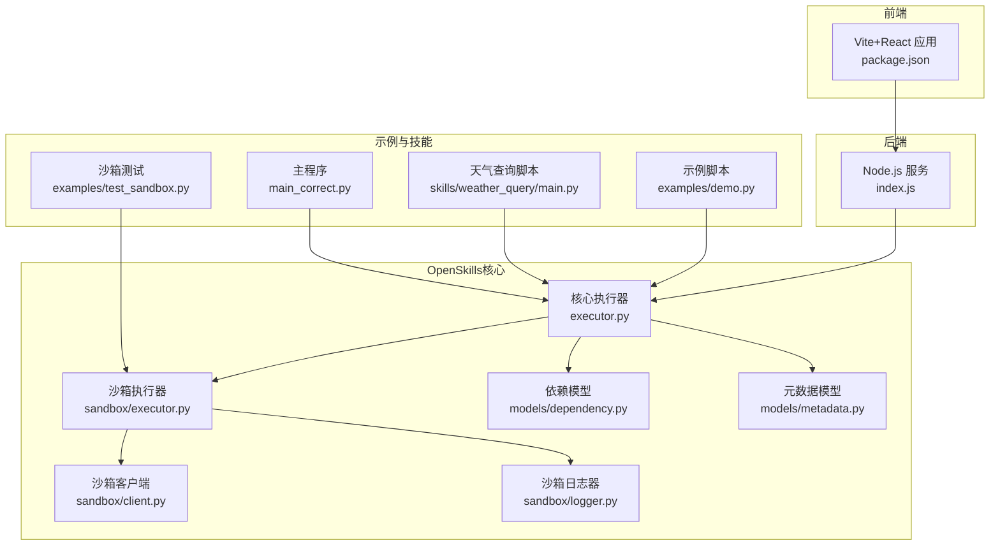
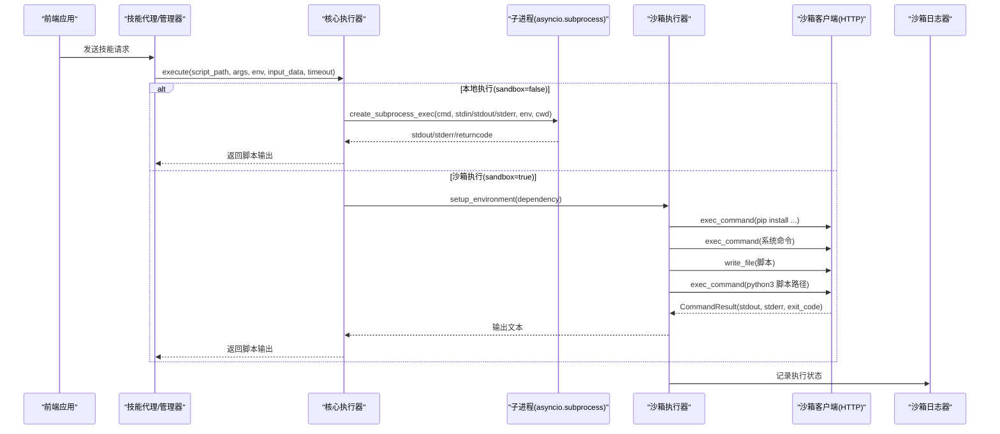
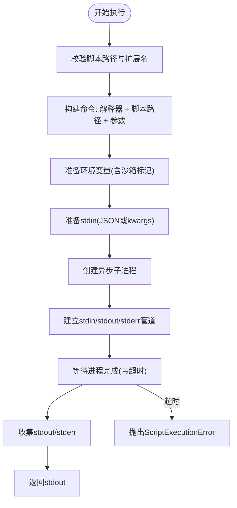
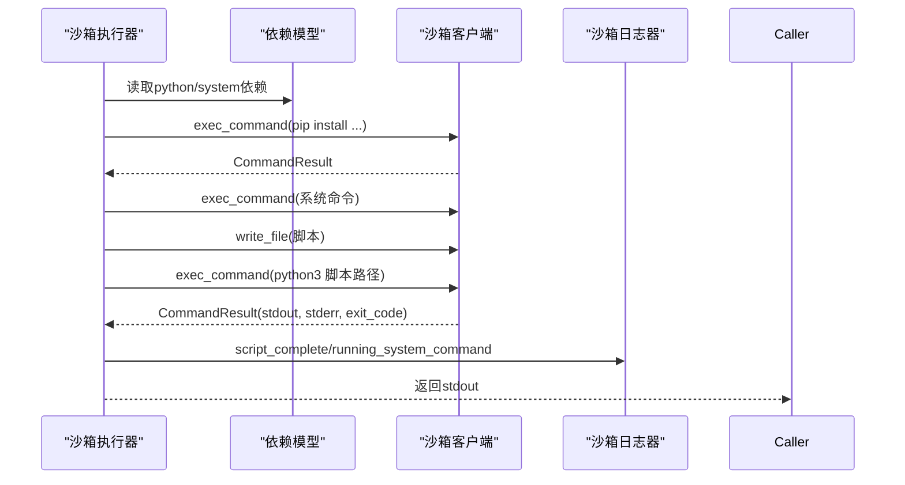
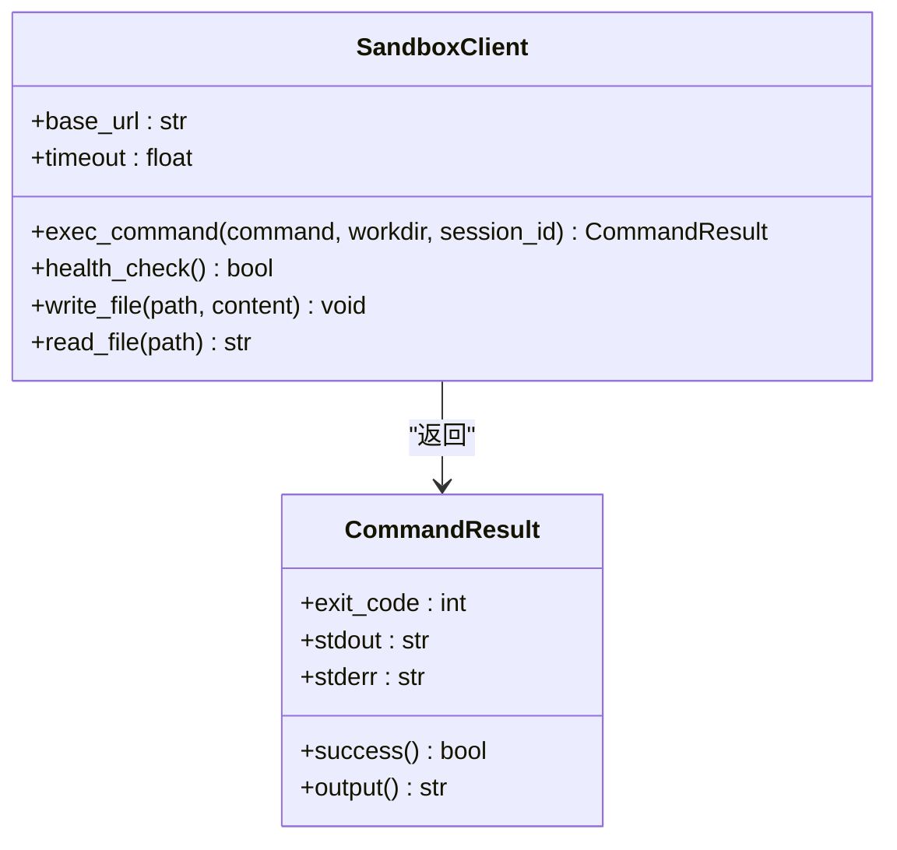
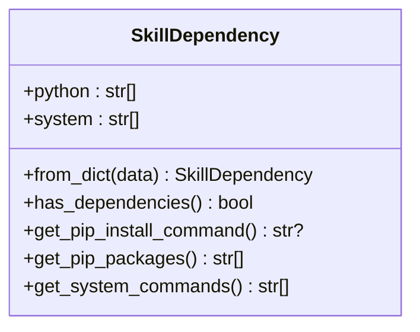
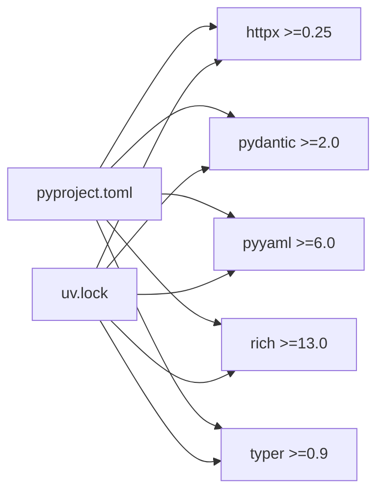

# Python集成

<cite>
**本文引用的文件**
- [OpenSkills核心执行器](file://OpenSkills-main/openskills/core/executor.py)
- [OpenSkills沙箱执行器](file://OpenSkills-main/openskills/sandbox/executor.py)
- [OpenSkills沙箱客户端](file://OpenSkills-main/openskills/sandbox/client.py)
- [OpenSkills沙箱日志器](file://OpenSkills-main/openskills/sandbox/logger.py)
- [OpenSkills依赖模型](file://OpenSkills-main/openskills/models/dependency.py)
- [OpenSkills元数据模型](file://OpenSkills-main/openskills/models/metadata.py)
- [OpenSkills项目配置(pyproject.toml)](file://OpenSkills-main/pyproject.toml)
- [OpenSkills锁定文件(uv.lock)](file://OpenSkills-main/uv.lock)
- [AIO沙箱集成指南](file://OpenSkills-main/docs/sandbox.md)
- [E2B沙箱集成指南](file://OpenSkills-main/docs/e2b-integration.md)
- [示例脚本(demo.py)](file://OpenSkills-main/examples/demo.py)
- [示例脚本(test_sandbox.py)](file://OpenSkills-main/examples/test_sandbox.py)
- [天气查询脚本(main.py)](file://skills/weather_query/main.py)
- [主程序(main_correct.py)](file://main_correct.py)
- [前端包配置(package.json)](file://package.json)
</cite>

## 目录
1. [简介](#简介)
2. [项目结构](#项目结构)
3. [核心组件](#核心组件)
4. [架构总览](#架构总览)
5. [详细组件分析](#详细组件分析)
6. [依赖分析](#依赖分析)
7. [性能考虑](#性能考虑)
8. [故障排除指南](#故障排除指南)
9. [结论](#结论)
10. [附录](#附录)

## 简介
本文件面向AutoMate平台的Python集成机制，系统性阐述以下主题：
- child_process模块的使用、spawn进程创建与进程间通信
- Python脚本路径解析、参数传递与环境变量配置
- stdout/stderr输出捕获、错误处理与进程状态监控
- Python环境配置、依赖管理与版本兼容性
- Python脚本开发规范与调试技巧

目标是帮助开发者在AutoMate中可靠地执行Python脚本，并在本地或远程沙箱环境中进行安全隔离的代码执行。

## 项目结构
AutoMate采用前后端分离架构，Python集成主要集中在OpenSkills子项目中，负责技能发现、脚本执行与沙箱管理；前端通过Vite+React提供交互界面；后端提供API服务。

**图表来源**
- [OpenSkills核心执行器](file://OpenSkills-main/openskills/core/executor.py#L61-L250)
- [OpenSkills沙箱执行器](file://OpenSkills-main/openskills/sandbox/executor.py#L1-L177)
- [OpenSkills沙箱客户端](file://OpenSkills-main/openskills/sandbox/client.py#L280-L302)
- [OpenSkills沙箱日志器](file://OpenSkills-main/openskills/sandbox/logger.py#L149-L187)
- [OpenSkills依赖模型](file://OpenSkills-main/openskills/models/dependency.py#L1-L86)
- [OpenSkills元数据模型](file://OpenSkills-main/openskills/models/metadata.py#L1-L83)
- [示例脚本(demo.py)](file://OpenSkills-main/examples/demo.py#L1-L290)
- [示例脚本(test_sandbox.py)](file://OpenSkills-main/examples/test_sandbox.py#L1-L85)
- [天气查询脚本(main.py)](file://skills/weather_query/main.py#L1-L139)
- [主程序(main_correct.py)](file://main_correct.py#L1-L75)
- [前端包配置(package.json)](file://package.json#L1-L47)

**章节来源**
- [OpenSkills核心执行器](file://OpenSkills-main/openskills/core/executor.py#L61-L250)
- [OpenSkills沙箱执行器](file://OpenSkills-main/openskills/sandbox/executor.py#L1-L177)
- [前端包配置(package.json)](file://package.json#L1-L47)

## 核心组件
本节聚焦Python集成的关键组件及其职责：
- 核心执行器：负责脚本路径校验、扩展名支持检测、命令构建、环境准备、stdin/stdout/stderr处理与超时控制。
- 沙箱执行器：在隔离环境中安装依赖、上传脚本、执行命令并捕获输出。
- 沙箱客户端：通过HTTP API与远程沙箱交互，支持命令执行、文件读写与健康检查。
- 依赖模型：定义技能所需的Python包与系统命令，生成pip安装命令。
- 日志器：统一记录沙箱执行过程中的关键事件，便于调试与审计。

**章节来源**
- [OpenSkills核心执行器](file://OpenSkills-main/openskills/core/executor.py#L61-L250)
- [OpenSkills沙箱执行器](file://OpenSkills-main/openskills/sandbox/executor.py#L1-L177)
- [OpenSkills沙箱客户端](file://OpenSkills-main/openskills/sandbox/client.py#L280-L302)
- [OpenSkills沙箱日志器](file://OpenSkills-main/openskills/sandbox/logger.py#L149-L187)
- [OpenSkills依赖模型](file://OpenSkills-main/openskills/models/dependency.py#L1-L86)

## 架构总览
下图展示了Python脚本在AutoMate中的执行路径，包括本地直连与沙箱两种模式：

**图表来源**
- [OpenSkills核心执行器](file://OpenSkills-main/openskills/core/executor.py#L61-L250)
- [OpenSkills沙箱执行器](file://OpenSkills-main/openskills/sandbox/executor.py#L137-L354)
- [OpenSkills沙箱客户端](file://OpenSkills-main/openskills/sandbox/client.py#L280-L302)
- [OpenSkills沙箱日志器](file://OpenSkills-main/openskills/sandbox/logger.py#L149-L187)

## 详细组件分析

### 核心执行器：脚本执行与进程管理
- 脚本路径解析与校验：检查文件是否存在、扩展名是否受支持(.py/.sh等)，对Python脚本进行语法编译验证。
- 命令构建：根据扩展名映射到对应解释器，拼接脚本路径与传入参数。
- 环境准备：合并传入env与沙箱标记，确保在沙箱模式下设置特定环境变量。
- 子进程创建：使用asyncio.create_subprocess_exec创建异步子进程，配置stdin/stdout/stderr管道与工作目录。
- 输入传递：支持通过stdin传入JSON字符串或关键字参数转为JSON。
- 超时控制：使用asyncio.wait_for包裹进程执行，超时抛出ScriptExecutionError。
- 输出捕获：收集stdout与stderr，返回stdout给调用方。

**图表来源**
- [OpenSkills核心执行器](file://OpenSkills-main/openskills/core/executor.py#L61-L250)

**章节来源**
- [OpenSkills核心执行器](file://OpenSkills-main/openskills/core/executor.py#L61-L250)

### 沙箱执行器：隔离环境下的脚本执行
- 环境准备：支持可选的pip升级、批量安装Python包、执行系统初始化命令。
- 文件上传：将待执行脚本写入沙箱工作目录，确保执行上下文完整。
- 命令执行：通过沙箱客户端执行命令，支持工作目录与会话标识。
- 输出处理：解析CommandResult，提取stdout并返回给上层。
- 日志记录：统一记录依赖安装、系统命令执行与脚本完成状态。

**图表来源**
- [OpenSkills沙箱执行器](file://OpenSkills-main/openskills/sandbox/executor.py#L137-L354)
- [OpenSkills沙箱客户端](file://OpenSkills-main/openskills/sandbox/client.py#L280-L302)
- [OpenSkills沙箱日志器](file://OpenSkills-main/openskills/sandbox/logger.py#L149-L187)
- [OpenSkills依赖模型](file://OpenSkills-main/openskills/models/dependency.py#L68-L86)

**章节来源**
- [OpenSkills沙箱执行器](file://OpenSkills-main/openskills/sandbox/executor.py#L1-L177)
- [OpenSkills沙箱执行器](file://OpenSkills-main/openskills/sandbox/executor.py#L137-L354)
- [OpenSkills沙箱客户端](file://OpenSkills-main/openskills/sandbox/client.py#L280-L302)
- [OpenSkills沙箱日志器](file://OpenSkills-main/openskills/sandbox/logger.py#L149-L187)
- [OpenSkills依赖模型](file://OpenSkills-main/openskills/models/dependency.py#L1-L86)

### 沙箱客户端：HTTP API交互
- 健康检查：通过POST /v1/shell/exec发送简单命令验证服务可用性。
- 命令执行：支持传入command与可选workdir/session_id，返回包含exit_code、stdout、stderr的结果对象。
- 超时与异常：基于httpx超时控制，异常转换为SandboxExecutionError。
- 文件操作：支持write_file/read_file，便于脚本与输入数据的传输。

**图表来源**
- [OpenSkills沙箱客户端](file://OpenSkills-main/openskills/sandbox/client.py#L280-L302)

**章节来源**
- [OpenSkills沙箱客户端](file://OpenSkills-main/openskills/sandbox/client.py#L280-L302)

### 依赖模型：Python包与系统命令管理
- 依赖声明：python字段为pip包列表，system字段为shell命令列表。
- 命令生成：get_pip_install_command()生成pip install命令字符串。
- 便捷方法：get_pip_packages()/get_system_commands()返回副本，避免外部修改影响内部状态。

**图表来源**
- [OpenSkills依赖模型](file://OpenSkills-main/openskills/models/dependency.py#L13-L86)

**章节来源**
- [OpenSkills依赖模型](file://OpenSkills-main/openskills/models/dependency.py#L1-L86)

### 日志器：执行过程可视化
- 统一输出：支持成功/失败/进度/系统命令执行等日志级别。
- 截断策略：对过长命令进行截断，提升可读性。
- 单次记录：_log_ready_once()确保“就绪”消息仅打印一次。

**章节来源**
- [OpenSkills沙箱日志器](file://OpenSkills-main/openskills/sandbox/logger.py#L149-L187)

### Python脚本开发规范与调试技巧
- 参数解析：脚本通过sys.argv读取命令行参数，支持--params传入JSON参数。
- 输入数据：支持stdin传入JSON，脚本内可重定向sys.stdin读取。
- 错误处理：脚本内部使用try/except捕获网络、解析等异常，返回结构化错误信息。
- 调试建议：
  - 在本地使用示例脚本验证参数传递与输出格式。
  - 通过AIO沙箱集成指南启动本地沙箱服务，进行端到端测试。
  - 使用日志器输出关键步骤，便于定位问题。

**章节来源**
- [天气查询脚本(main.py)](file://skills/weather_query/main.py#L1-L139)
- [主程序(main_correct.py)](file://main_correct.py#L1-L75)
- [示例脚本(demo.py)](file://OpenSkills-main/examples/demo.py#L1-L290)
- [示例脚本(test_sandbox.py)](file://OpenSkills-main/examples/test_sandbox.py#L1-L85)

## 依赖分析
- Python版本要求：requires-python = ">=3.10"，支持3.10/3.11/3.12。
- 核心依赖：httpx、pydantic、pyyaml、rich、typer。
- 可选依赖：pytest、pytest-asyncio、ruff(开发)；httpx(sandbox)。
- 锁定文件：uv.lock固定各包版本，确保一致性与可重现性。

**图表来源**
- [OpenSkills项目配置(pyproject.toml)](file://OpenSkills-main/pyproject.toml#L1-L75)
- [OpenSkills锁定文件(uv.lock)](file://OpenSkills-main/uv.lock#L1-L583)

**章节来源**
- [OpenSkills项目配置(pyproject.toml)](file://OpenSkills-main/pyproject.toml#L1-L75)
- [OpenSkills锁定文件(uv.lock)](file://OpenSkills-main/uv.lock#L1-L583)

## 性能考虑
- 异步执行：核心执行器使用asyncio子进程，避免阻塞主线程，适合高并发场景。
- 超时控制：统一的超时机制防止长时间阻塞，保障系统稳定性。
- 沙箱批处理：沙箱执行器集中安装依赖与执行系统命令，减少重复开销。
- I/O优化：通过stdin一次性传入JSON，避免多次文件读写。

[本节为通用指导，无需特定文件引用]

## 故障排除指南
- 脚本未找到/扩展名不受支持：检查脚本路径与扩展名映射，确认SUPPORTED_EXTENSIONS包含.py等。
- 超时错误：适当增大timeout，或优化脚本逻辑；检查网络与外部服务响应。
- 沙箱连接失败：确认沙箱服务地址与端口，使用健康检查接口验证连通性。
- 依赖安装失败：检查pip命令生成与网络访问；必要时启用pip升级。
- 输出为空：确认脚本正确输出到stdout，避免仅写入stderr；检查stdin数据格式。

**章节来源**
- [OpenSkills核心执行器](file://OpenSkills-main/openskills/core/executor.py#L61-L250)
- [OpenSkills沙箱客户端](file://OpenSkills-main/openskills/sandbox/client.py#L280-L302)
- [AIO沙箱集成指南](file://OpenSkills-main/docs/sandbox.md#L222-L232)

## 结论
AutoMate的Python集成通过核心执行器与沙箱执行器实现了安全、可控且高性能的脚本执行能力。结合依赖模型与日志器，开发者可以快速构建可维护的技能脚本，并在本地或远程沙箱环境中稳定运行。遵循本文的开发规范与调试技巧，可显著提升脚本质量与交付效率。

[本节为总结性内容，无需特定文件引用]

## 附录

### Python环境配置与版本兼容性
- Python版本：>=3.10，推荐3.10/3.11/3.12。
- 依赖安装：使用uv.lock锁定版本，确保一致性。
- 环境变量：在沙箱模式下自动设置OPENSKILLS_SANDBOX=1，便于脚本识别执行环境。

**章节来源**
- [OpenSkills项目配置(pyproject.toml)](file://OpenSkills-main/pyproject.toml#L6-L21)
- [OpenSkills核心执行器](file://OpenSkills-main/openskills/core/executor.py#L189-L192)

### 沙箱服务启动与验证
- AIO沙箱：Docker方式启动，本地默认端口8080；提供健康检查与API文档。
- E2B沙箱：通过API Key与SDK进行云端执行，支持文件读写与依赖安装。

**章节来源**
- [AIO沙箱集成指南](file://OpenSkills-main/docs/sandbox.md#L28-L50)
- [AIO沙箱集成指南](file://OpenSkills-main/docs/sandbox.md#L222-L232)
- [E2B沙箱集成指南](file://OpenSkills-main/docs/e2b-integration.md#L1-L219)

### 示例与最佳实践
- 示例脚本：演示Reference自动发现、LLM智能选择、Azure OpenAI支持与沙箱测试。
- 最佳实践：在脚本中显式处理异常与超时；使用stdin传递结构化参数；通过日志器记录关键步骤。

**章节来源**
- [示例脚本(demo.py)](file://OpenSkills-main/examples/demo.py#L1-L290)
- [示例脚本(test_sandbox.py)](file://OpenSkills-main/examples/test_sandbox.py#L1-L85)