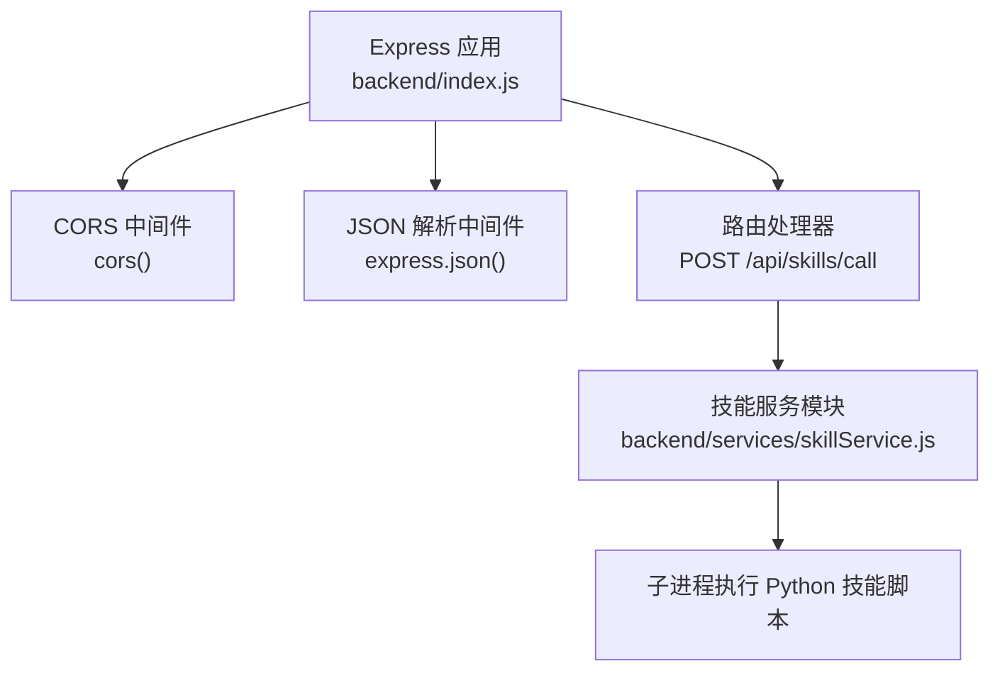
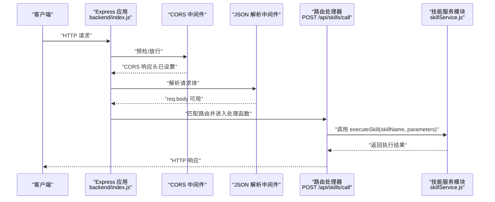
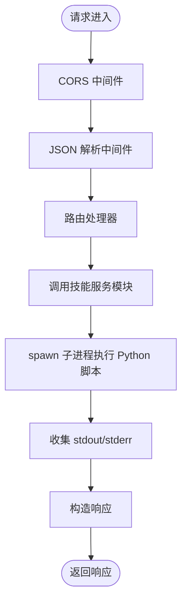
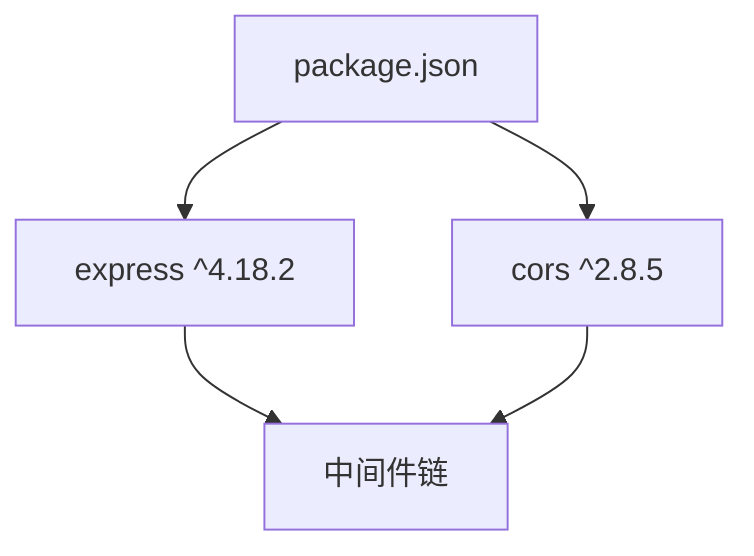

# 中间件系统

<cite>
**本文引用的文件**
- [backend/index.js](file://backend/index.js)
- [backend/services/skillService.js](file://backend/services/skillService.js)
- [package.json](file://package.json)
- [docs/技术架构/后端技术栈.md](file://docs/技术架构/后端技术栈.md)
- [docs/非功能设计/安全设计.md](file://docs/非功能设计/安全设计.md)
- [docs/非功能设计/可维护性设计.md](file://docs/非功能设计/可维护性设计.md)
</cite>

## 目录
1. [简介](#简介)
2. [项目结构](#项目结构)
3. [核心组件](#核心组件)
4. [架构总览](#架构总览)
5. [详细组件分析](#详细组件分析)
6. [依赖分析](#依赖分析)
7. [性能考虑](#性能考虑)
8. [故障排查指南](#故障排查指南)
9. [结论](#结论)
10. [附录](#附录)

## 简介
本文件面向AutoMate中间件系统，聚焦于CORS中间件的配置与作用机制、Express内置中间件的使用方式、自定义中间件的开发方法，并系统阐述中间件的执行顺序、错误传播路径与性能影响。同时结合项目中的日志记录与安全设计文档，给出中间件开发的最佳实践、常见使用场景以及与安全和可观测性的集成建议。

## 项目结构
AutoMate后端采用Express作为Web框架，核心入口位于backend/index.js，其中直接注册了CORS与JSON解析等内置中间件；技能调用通过独立的服务模块backend/services/skillService.js实现。整体结构简洁，便于理解中间件链路与执行顺序。

图表来源
- [backend/index.js](file://backend/index.js#L1-L117)
- [backend/services/skillService.js](file://backend/services/skillService.js#L1-L87)

章节来源
- [backend/index.js](file://backend/index.js#L1-L117)
- [backend/services/skillService.js](file://backend/services/skillService.js#L1-L87)

## 核心组件
- CORS中间件：在Express应用上启用跨域资源共享，允许来自不同源的前端访问后端API。
- JSON解析中间件：解析客户端发送的application/json请求体，供后续路由处理器使用。
- 技能调用中间件链：在CORS与JSON解析之后，进入具体的业务路由处理与子进程调用。

章节来源
- [backend/index.js](file://backend/index.js#L14-L16)
- [package.json](file://package.json#L15-L27)

## 架构总览
下图展示了从客户端请求到技能执行的整体流程，以及中间件在请求生命周期中的位置。

图表来源
- [backend/index.js](file://backend/index.js#L81-L104)
- [backend/services/skillService.js](file://backend/services/skillService.js#L16-L86)

章节来源
- [backend/index.js](file://backend/index.js#L81-L104)
- [backend/services/skillService.js](file://backend/services/skillService.js#L16-L86)

## 详细组件分析

### CORS中间件配置与作用机制
- 配置方式：在Express应用中直接调用cors()并挂载到app.use()，即可对所有路由生效。
- 作用范围：自动处理预检请求（OPTIONS）、设置响应头（如Access-Control-Allow-Origin等），使前端跨域请求得以通过。
- 默认行为：未显式传参时，遵循cors库的默认策略；若需要更严格的跨域策略（如指定允许的源、头部、凭证等），可在初始化时传入配置对象以精细化控制。

章节来源
- [backend/index.js](file://backend/index.js#L14-L14)
- [package.json](file://package.json#L17-L17)

### Express内置中间件使用
- JSON解析：通过express.json()解析application/json请求体，使路由处理器能够从req.body读取参数。
- 其他常用内置中间件（参考文档）：bodyParser、静态资源服务、Cookie解析等，均可按需挂载到中间件链中。

章节来源
- [backend/index.js](file://backend/index.js#L15-L15)
- [docs/技术架构/后端技术栈.md](file://docs/技术架构/后端技术栈.md#L291-L312)

### 自定义中间件开发
- 设计原则：保持单一职责、尽早返回、不阻塞后续中间件；在next()前进行校验，在next()后进行收尾。
- 错误处理：通过统一的错误中间件捕获上游抛出的错误，避免错误穿透至默认未处理异常。
- 典型场景：鉴权、速率限制、请求日志、参数校验、响应压缩等。

章节来源
- [docs/技术架构/后端技术栈.md](file://docs/技术架构/后端技术栈.md#L291-L312)

### 中间件执行顺序与错误传播
- 执行顺序：中间件按照app.use()与路由注册的先后顺序依次执行；同一层级的中间件遵循“先挂载者先执行”的规则。
- 错误传播：当某个中间件或路由处理器抛出错误时，Express会跳过后续正常中间件，直接进入错误处理中间件链。
- 性能影响：中间件数量与复杂度直接影响请求延迟；建议合并同类功能、避免重复解析、减少同步阻塞操作。

章节来源
- [backend/index.js](file://backend/index.js#L14-L16)
- [docs/技术架构/后端技术栈.md](file://docs/技术架构/后端技术栈.md#L291-L312)

### 技能调用流程与中间件交互
- 请求进入：CORS中间件先行处理跨域相关头部；JSON解析中间件负责将请求体转为对象。
- 业务处理：路由处理器读取请求体中的技能名称与参数，调用技能服务模块。
- 子进程执行：技能服务模块通过子进程调用Python脚本，收集标准输出与错误输出，最终将结果返回给客户端。

图表来源
- [backend/index.js](file://backend/index.js#L81-L104)
- [backend/services/skillService.js](file://backend/services/skillService.js#L16-L86)

章节来源
- [backend/index.js](file://backend/index.js#L81-L104)
- [backend/services/skillService.js](file://backend/services/skillService.js#L16-L86)

## 依赖分析
- CORS库版本：在package.json中声明为^2.8.5，实际安装版本为2.8.6；该库提供了轻量且稳定的跨域支持。
- Express版本：使用4.x系列，具备良好的中间件生态与性能表现。
- 依赖关系：CORS与Express均为运行时依赖，直接参与请求处理链。

图表来源
- [package.json](file://package.json#L15-L27)

章节来源
- [package.json](file://package.json#L15-L27)

## 性能考虑
- 中间件排序优化：将高频且低成本的中间件置于前部，将昂贵的校验或IO操作延后或缓存。
- 减少重复解析：确保body解析只执行一次，避免多次JSON解析带来的CPU与内存开销。
- 子进程管理：合理设置超时、并发上限与资源配额，避免子进程泄漏或阻塞主进程。
- 压缩与缓存：在生产环境启用响应压缩与静态资源缓存，降低带宽与延迟。

## 故障排查指南
- CORS相关问题
  - 症状：浏览器报跨域错误或预检失败。
  - 排查：确认是否正确挂载cors()；若需要严格策略，检查是否传入了正确的源、头部与凭证配置。
- JSON解析失败
  - 症状：req.body为空或解析异常。
  - 排查：检查Content-Type是否为application/json；确认请求体格式合法。
- 技能执行异常
  - 症状：技能调用返回失败或无输出。
  - 排查：查看技能服务模块的日志输出与子进程退出码；确认Python脚本路径与参数传递正确。
- 日志与监控
  - 建议：在中间件与路由层增加结构化日志，记录请求ID、时间戳、状态码与耗时；结合安全设计文档中的安全日志与审计日志，完善可观测性。

章节来源
- [backend/index.js](file://backend/index.js#L81-L104)
- [backend/services/skillService.js](file://backend/services/skillService.js#L16-L86)
- [docs/非功能设计/可维护性设计.md](file://docs/非功能设计/可维护性设计.md#L232-L292)
- [docs/非功能设计/安全设计.md](file://docs/非功能设计/安全设计.md#L373-L411)

## 结论
AutoMate的中间件体系以Express为核心，通过CORS与JSON解析两大内置中间件快速打通跨域与请求体解析，配合自定义中间件与服务模块实现完整的技能调用链路。建议在生产环境中进一步细化CORS策略、引入统一错误处理与日志监控，并结合安全设计文档强化访问控制与审计能力，从而在保证易用性的同时提升系统的安全性与可维护性。

## 附录
- 最佳实践清单
  - 明确中间件职责边界，避免“大杂烩”中间件。
  - 统一错误处理与响应格式，便于前端消费与监控。
  - 对外部调用（如子进程）设置超时与重试策略。
  - 在关键节点记录结构化日志，包含请求ID、时间戳、状态码与耗时。
  - 参考安全设计文档，落实最小权限、参数化查询、输入验证与命令注入防护等措施。