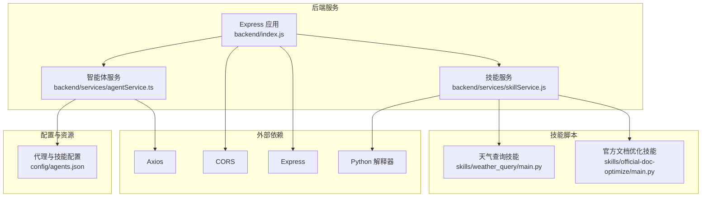
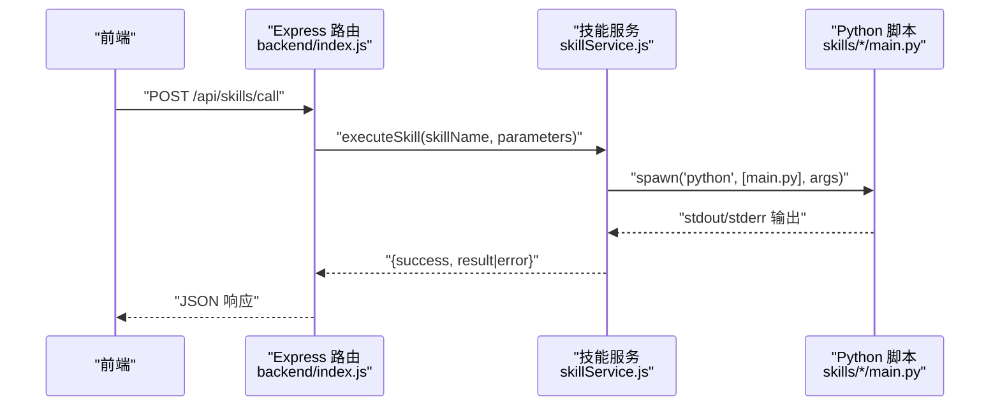
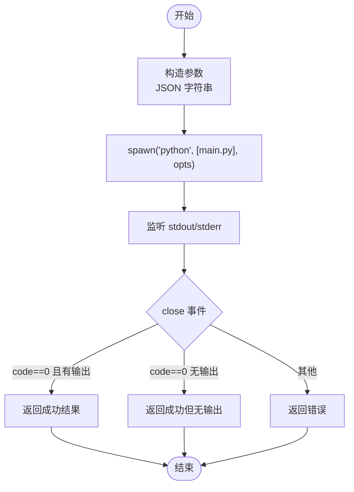
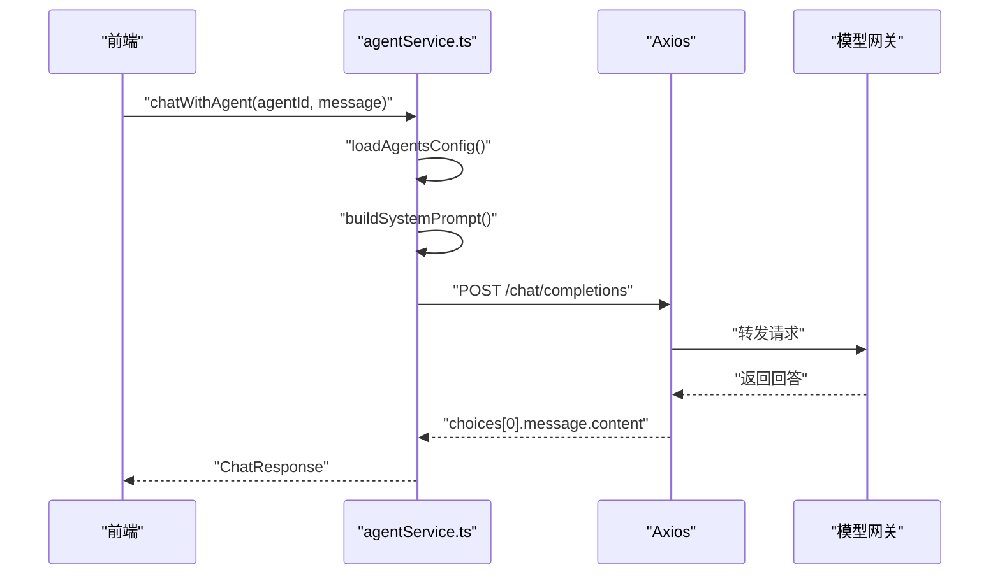
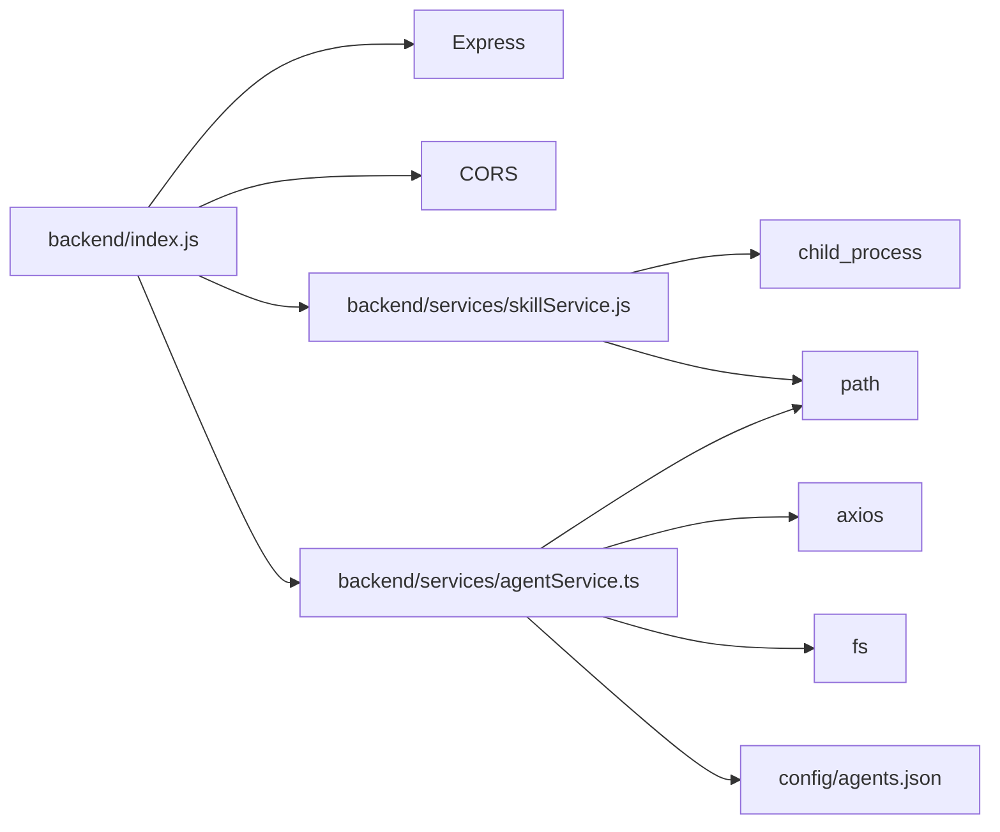

# 后端服务

<cite>
**本文引用的文件**
- [backend/index.js](file://backend/index.js)
- [backend/services/skillService.js](file://backend/services/skillService.js)
- [backend/services/agentService.ts](file://backend/services/agentService.ts)
- [package.json](file://package.json)
- [config/agents.json](file://config/agents.json)
- [skills/weather_query/main.py](file://skills/weather_query/main.py)
- [skills/official-doc-optimize/main.py](file://skills/official-doc-optimize/main.py)
</cite>

## 目录
1. [简介](#简介)
2. [项目结构](#项目结构)
3. [核心组件](#核心组件)
4. [架构总览](#架构总览)
5. [详细组件分析](#详细组件分析)
6. [依赖关系分析](#依赖关系分析)
7. [性能考虑](#性能考虑)
8. [故障排查指南](#故障排查指南)
9. [结论](#结论)
10. [附录](#附录)

## 简介
本文件为 AutoMate 后端服务的技术文档，聚焦于 Node.js 服务架构、Express 服务器配置与中间件系统、API 接口设计与请求处理流程、响应格式规范、技能执行服务的实现原理、Python 脚本调用机制与进程管理策略、CORS 配置、错误处理与日志记录、安全策略、性能优化与监控方案，以及与前端的通信协议与数据交换格式。

## 项目结构
后端采用 Node.js + Express 构建，核心入口位于 backend/index.js，提供技能调用与健康检查接口；技能执行通过子进程调用 Python 脚本；智能体与技能配置由 config/agents.json 提供；TypeScript 的 agentService.ts 负责与外部模型网关通信；package.json 统一管理脚本与依赖。

图表来源
- [backend/index.js](file://backend/index.js#L1-L117)
- [backend/services/skillService.js](file://backend/services/skillService.js#L1-L87)
- [backend/services/agentService.ts](file://backend/services/agentService.ts#L1-L245)
- [config/agents.json](file://config/agents.json#L1-L119)

章节来源
- [backend/index.js](file://backend/index.js#L1-L117)
- [package.json](file://package.json#L1-L47)

## 核心组件
- Express 服务器与中间件
  - CORS 允许跨域访问，便于前端直连后端。
  - JSON 解析中间件统一处理请求体。
  - 日志输出用于调试与追踪。
- 技能执行服务
  - 通过 child_process.spawn 调用 Python 脚本，支持传参与标准流捕获。
  - 返回统一的成功/失败结构，包含结果或错误信息。
- 智能体服务
  - 读取 agents.json 配置，构建系统提示词，调用外部模型网关。
  - 提供聊天与技能调用封装，统一错误处理。
- 配置与资源
  - agents.json 描述代理、模型网关地址、API Key、可用技能等。
  - 技能脚本以 main.py 为主入口，遵循约定参数传递方式。

章节来源
- [backend/index.js](file://backend/index.js#L14-L16)
- [backend/services/skillService.js](file://backend/services/skillService.js#L16-L86)
- [backend/services/agentService.ts](file://backend/services/agentService.ts#L58-L184)
- [config/agents.json](file://config/agents.json#L1-L119)

## 架构总览
后端服务采用“API 层 + 服务层 + 外部集成”的分层架构：
- API 层：Express 路由负责接收请求、参数校验与响应格式化。
- 服务层：技能服务负责本地 Python 脚本执行；智能体服务负责与外部模型网关通信。
- 外部集成：通过 Axios 访问模型网关，通过子进程调用本地 Python 脚本。

图表来源
- [backend/index.js](file://backend/index.js#L81-L104)
- [backend/services/skillService.js](file://backend/services/skillService.js#L16-L71)
- [skills/weather_query/main.py](file://skills/weather_query/main.py#L128-L139)

## 详细组件分析

### Express 服务器与中间件
- CORS：全局启用，允许前端跨域访问。
- JSON 中间件：统一解析 application/json 请求体。
- 路由：
  - GET /api/skills：健康检查，返回服务状态。
  - POST /api/skills/call：技能调用入口，参数包括 skill_name 与可选 parameters。
- 错误处理：
  - 缺少必要参数时返回 400。
  - 异常捕获后返回 500，并包含错误消息。

章节来源
- [backend/index.js](file://backend/index.js#L14-L16)
- [backend/index.js](file://backend/index.js#L81-L111)
- [backend/index.js](file://backend/index.js#L86-L91)
- [backend/index.js](file://backend/index.js#L97-L103)

### 技能执行服务（skillService.js）
- 路径与参数
  - 技能基础路径固定为 backend/skills。
  - 通过参数对象构造 JSON 字符串传入 Python 脚本。
- 子进程管理
  - 使用 spawn 启动 Python 进程，设置工作目录与环境变量。
  - 捕获 stdout/stderr 并在 close 事件汇总结果。
- 返回结构
  - 成功：success=true，result 为字符串。
  - 失败：success=false，error 为错误信息。
- 输入流写入
  - 若存在 input/query 参数，会向 Python 进程 stdin 写入并结束。

图表来源
- [backend/services/skillService.js](file://backend/services/skillService.js#L16-L71)

章节来源
- [backend/services/skillService.js](file://backend/services/skillService.js#L8-L86)

### 智能体服务（agentService.ts）
- 配置加载
  - 从 config/agents.json 读取代理组与代理列表。
- 系统提示词构建
  - 读取每个技能的 SKILL.md 片段，拼装成系统提示词，指导模型选择合适技能。
- 聊天与技能调用
  - chatWithAgent：组装 system+user 消息，调用模型网关，返回 assistant 回复。
  - callSkill：针对特定技能构造系统提示词，调用模型网关执行技能。
- 错误处理
  - AxiosError 分类处理：响应错误、网络错误、请求错误，统一返回错误信息。

图表来源
- [backend/services/agentService.ts](file://backend/services/agentService.ts#L118-L184)
- [config/agents.json](file://config/agents.json#L1-L119)

章节来源
- [backend/services/agentService.ts](file://backend/services/agentService.ts#L58-L184)
- [config/agents.json](file://config/agents.json#L1-L119)

### Python 技能脚本（示例）
- 天气查询技能（weather_query/main.py）
  - 支持命令行参数 --params，解析 JSON 含义为 input/location。
  - 调用开放天气 API，返回标准化天气报告。
- 官方文档优化技能（official-doc-optimize/main.py）
  - 将口语化表达替换为政府公文用语，规范化句式与标点，按目的/措施/结果组织段落。

章节来源
- [skills/weather_query/main.py](file://skills/weather_query/main.py#L100-L139)
- [skills/official-doc-optimize/main.py](file://skills/official-doc-optimize/main.py#L1-L208)

## 依赖关系分析
- 后端入口依赖：
  - Express、CORS、child_process（spawn）、path、fileURLToPath。
- 服务层依赖：
  - skillService.js 依赖 child_process 与 path。
  - agentService.ts 依赖 axios、fs、path。
- 配置依赖：
  - agents.json 提供代理与技能清单，被 agentService.ts 读取。
- 运行时依赖：
  - Python 解释器与第三方库（如 requests），由具体技能脚本决定。

图表来源
- [backend/index.js](file://backend/index.js#L1-L117)
- [backend/services/skillService.js](file://backend/services/skillService.js#L1-L8)
- [backend/services/agentService.ts](file://backend/services/agentService.ts#L1-L4)

章节来源
- [package.json](file://package.json#L15-L27)
- [backend/index.js](file://backend/index.js#L1-L117)

## 性能考虑
- 子进程生命周期
  - 当前实现每次调用 spawn 新进程，适合轻量任务；若频繁调用建议引入进程池或缓存策略，减少启动开销。
- I/O 与编码
  - 子进程 stdout/stderr 以字符串拼接，注意大输出时内存占用；可考虑流式处理或分块读取。
- 网络请求
  - 模型网关请求设置超时时间，避免阻塞；可根据场景调整超时阈值。
- 前端并发
  - 后端未限制并发数，需结合前端并发策略与网关限流共同控制压力。

## 故障排查指南
- 技能调用失败
  - 检查 skill_name 是否正确，对应 skills/<skill>/main.py 是否存在。
  - 查看后端日志中的 stdout/stderr 输出，定位 Python 脚本异常。
  - 确认 Python 环境与依赖是否安装（如 requests）。
- 参数传递问题
  - 确认前端发送的 parameters 为合法 JSON；后端会将其序列化为字符串传入 Python。
- CORS 与跨域
  - 后端已启用 CORS，若仍出现跨域错误，检查前端请求头与预检策略。
- 模型网关错误
  - 关注 agentService.ts 的错误分支：响应错误、网络错误、请求错误，分别对应不同处理策略。
- 健康检查
  - 访问 GET /api/skills 确认服务正常运行。

章节来源
- [backend/index.js](file://backend/index.js#L81-L111)
- [backend/services/skillService.js](file://backend/services/skillService.js#L42-L64)
- [backend/services/agentService.ts](file://backend/services/agentService.ts#L161-L184)

## 结论
AutoMate 后端以 Express 为基础，结合本地 Python 脚本与外部模型网关，形成“本地技能 + LLM 协作”的能力体系。通过统一的 API 设计与服务层封装，实现了清晰的职责分离与良好的可扩展性。后续可在进程池、流式处理、缓存与监控等方面进一步优化，以支撑更高并发与更复杂场景。

## 附录

### API 接口定义
- GET /api/skills
  - 用途：健康检查
  - 响应：包含状态与消息的对象
- POST /api/skills/call
  - 请求体字段：
    - skill_name: 字符串，必填
    - parameters: 对象，可选
  - 响应：
    - 成功：{ success: true, result: "字符串结果" }
    - 失败：{ success: false, error: "错误信息" }

章节来源
- [backend/index.js](file://backend/index.js#L81-L111)

### 响应格式规范
- 统一字段：
  - success: 布尔值
  - result 或 error: 字符串或对象（视场景而定）
- 错误码：
  - 400：缺少必要参数
  - 500：内部异常

章节来源
- [backend/index.js](file://backend/index.js#L86-L91)
- [backend/index.js](file://backend/index.js#L97-L103)

### 安全策略
- CORS：默认允许跨域，生产环境建议限定来源。
- 认证与密钥：模型网关使用 API Key，需妥善保管；避免在客户端暴露。
- 输入校验：对 skill_name 与 parameters 进行白名单与长度限制。
- 进程隔离：Python 脚本在独立子进程中运行，避免污染主进程。

章节来源
- [backend/index.js](file://backend/index.js#L14-L16)
- [backend/services/agentService.ts](file://backend/services/agentService.ts#L136-L151)
- [config/agents.json](file://config/agents.json#L12-L16)

### 监控与日志
- 后端日志：请求到达、技能执行、子进程输出与错误均输出到控制台。
- 建议：接入结构化日志（如 Winston）、指标采集（如 Prometheus）与链路追踪（如 Jaeger）。

章节来源
- [backend/index.js](file://backend/index.js#L23-L25)
- [backend/index.js](file://backend/index.js#L49-L51)
- [backend/index.js](file://backend/index.js#L71-L77)