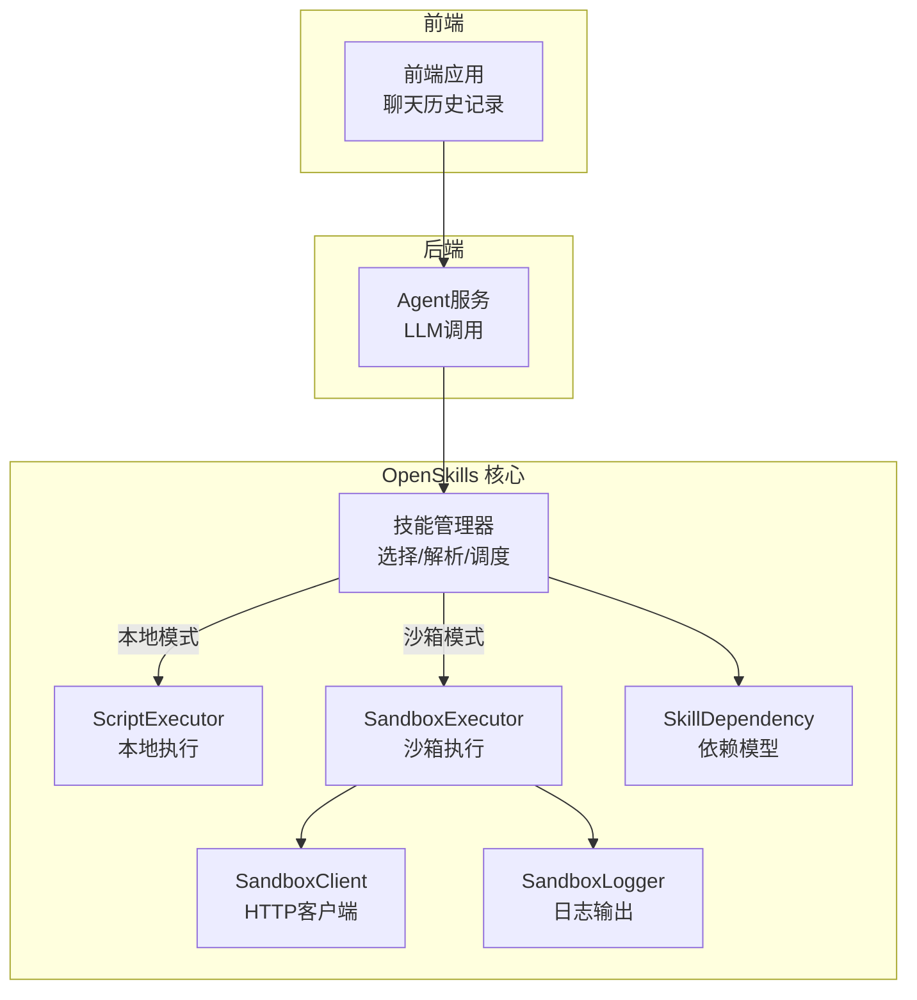
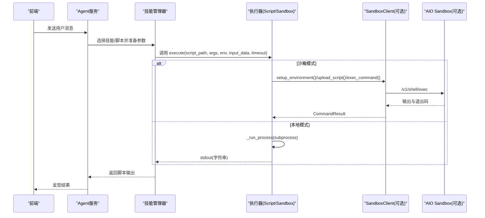
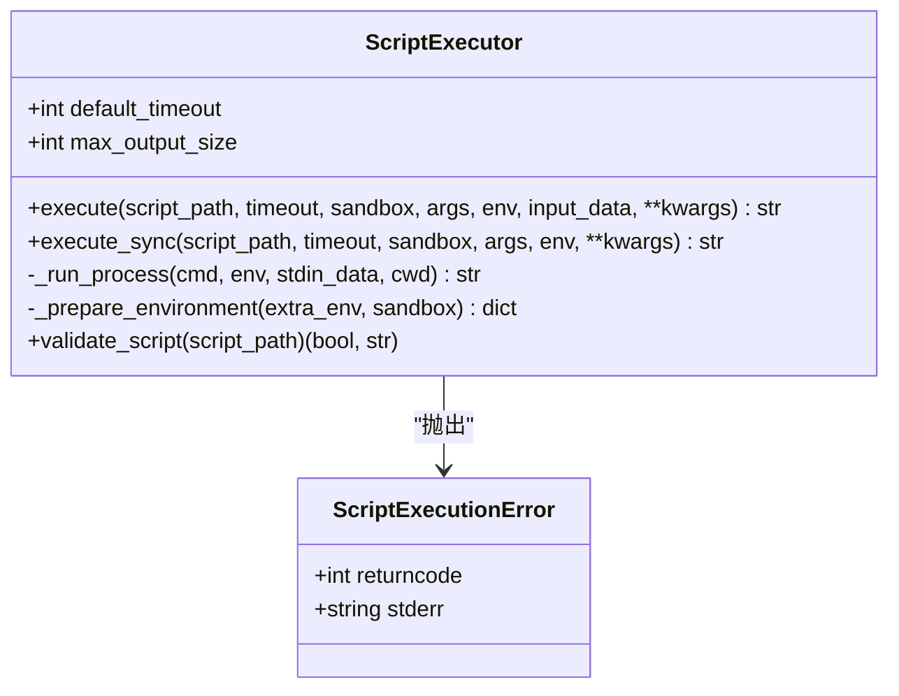
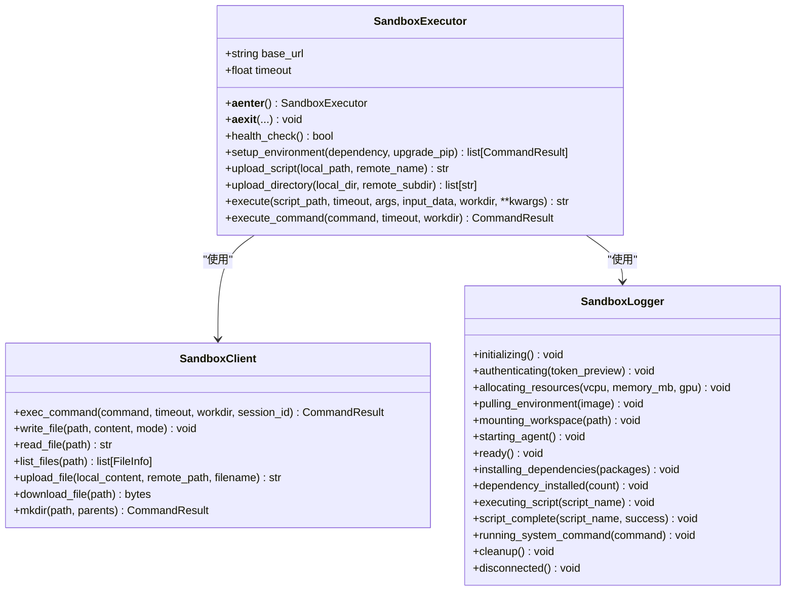
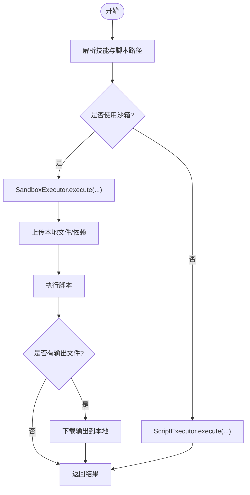
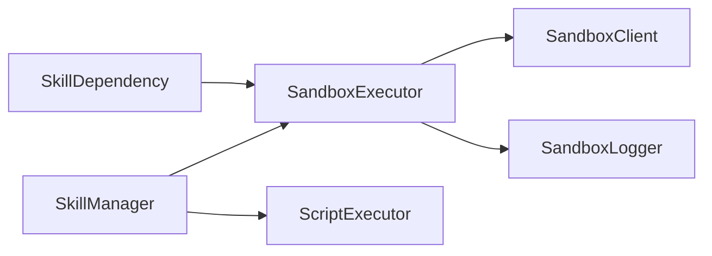

# 技能执行服务

<cite>
**本文引用的文件**
- [executor.py](file://OpenSkills-main/openskills/core/executor.py)
- [executor.py](file://OpenSkills-main/openskills/sandbox/executor.py)
- [client.py](file://OpenSkills-main/openskills/sandbox/client.py)
- [manager.py](file://OpenSkills-main/openskills/core/manager.py)
- [manager.py](file://OpenSkills-main/openskills/sandbox/manager.py)
- [logger.py](file://OpenSkills-main/openskills/sandbox/logger.py)
- [dependency.py](file://OpenSkills-main/openskills/models/dependency.py)
- [demo.py](file://OpenSkills-main/examples/demo.py)
- [SKILL.md](file://OpenSkills-main/examples/file-to-article-generator/SKILL.md)
- [fetch_feishu_doc.py](file://OpenSkills-main/examples/feishu-doc-to-dev-spec/scripts/fetch_feishu_doc.py)
- [agentService.ts](file://backend/services/agentService.ts)
- [chatHistoryService.ts](file://src/services/chatHistoryService.ts)
</cite>

## 目录
1. [简介](#简介)
2. [项目结构](#项目结构)
3. [核心组件](#核心组件)
4. [架构总览](#架构总览)
5. [详细组件分析](#详细组件分析)
6. [依赖关系分析](#依赖关系分析)
7. [性能考虑](#性能考虑)
8. [故障排除指南](#故障排除指南)
9. [结论](#结论)
10. [附录](#附录)

## 简介
本文件为 AutoMate 技能执行服务的技术文档，聚焦于“executeSkill”函数的实现原理、Python 脚本调用机制与进程管理策略，系统阐述参数传递、环境变量设置与工作目录配置，以及 stdout/stderr 输出捕获、错误处理与进程生命周期管理。同时覆盖安全策略、超时控制与资源限制，并提供调试方法与故障排除指南。

## 项目结构
AutoMate 的技能执行服务由两套执行器构成：
- 本地执行器：基于 asyncio 的子进程执行，支持超时、输出截断与基础沙箱隔离。
- 沙箱执行器：通过 AIO Sandbox HTTP API 在隔离环境中执行脚本，支持依赖安装、文件上传/下载与工作目录配置。

图表来源
- [manager.py](file://OpenSkills-main/openskills/core/manager.py#L280-L360)
- [executor.py](file://OpenSkills-main/openskills/core/executor.py#L24-L125)
- [executor.py](file://OpenSkills-main/openskills/sandbox/executor.py#L22-L108)
- [client.py](file://OpenSkills-main/openskills/sandbox/client.py#L119-L156)
- [logger.py](file://OpenSkills-main/openskills/sandbox/logger.py#L14-L53)
- [dependency.py](file://OpenSkills-main/openskills/models/dependency.py#L13-L44)

章节来源
- [manager.py](file://OpenSkills-main/openskills/core/manager.py#L280-L360)
- [executor.py](file://OpenSkills-main/openskills/core/executor.py#L24-L125)
- [executor.py](file://OpenSkills-main/openskills/sandbox/executor.py#L22-L108)
- [client.py](file://OpenSkills-main/openskills/sandbox/client.py#L119-L156)
- [logger.py](file://OpenSkills-main/openskills/sandbox/logger.py#L14-L53)
- [dependency.py](file://OpenSkills-main/openskills/models/dependency.py#L13-L44)

## 核心组件
- ScriptExecutor（本地执行器）
  - 支持 .py/.sh/.bash/.js/.ts 脚本执行，异步子进程调用，超时控制，输出截断，基础环境隔离。
- SandboxExecutor（沙箱执行器）
  - 通过 SandboxClient 调用 AIO Sandbox API，在隔离环境中执行脚本，支持依赖安装、文件上传/下载、工作目录与超时控制。
- SkillManager（技能管理器）
  - 负责技能解析、脚本定位、参数注入、本地/沙箱执行器选择与文件同步。
- SandboxManager（沙箱生命周期管理）
  - 提供按次执行、按技能缓存、持久化三种策略，统一管理沙箱实例生命周期。
- SandboxClient（沙箱HTTP客户端）
  - 封装 /v1/shell/exec、/v1/file/*、/v1/code/* 等接口，提供命令执行、文件操作与代码执行能力。
- SandboxLogger（沙箱日志）
  - 提供进度、状态、错误等可视化日志输出。
- SkillDependency（依赖模型）
  - 定义 Python 包与系统命令依赖，生成 pip install 命令与系统命令列表。

章节来源
- [executor.py](file://OpenSkills-main/openskills/core/executor.py#L24-L125)
- [executor.py](file://OpenSkills-main/openskills/sandbox/executor.py#L22-L108)
- [manager.py](file://OpenSkills-main/openskills/core/manager.py#L280-L360)
- [manager.py](file://OpenSkills-main/openskills/sandbox/manager.py#L30-L148)
- [client.py](file://OpenSkills-main/openskills/sandbox/client.py#L119-L156)
- [logger.py](file://OpenSkills-main/openskills/sandbox/logger.py#L14-L53)
- [dependency.py](file://OpenSkills-main/openskills/models/dependency.py#L13-L44)

## 架构总览
技能执行的整体流程如下：
- 前端触发技能调用，后端 Agent 服务根据技能描述与参数构造系统提示词并调用 LLM。
- LLM 生成脚本调用指令（包含参数与可选文件路径）。
- 技能管理器解析技能元数据与脚本，决定使用本地或沙箱执行器。
- 执行器负责：
  - 参数传递（stdin JSON 或 args）。
  - 环境变量设置（继承当前环境，沙箱模式下移除敏感变量并标记 OPENSKILLS_SANDBOX）。
  - 工作目录配置（cwd）。
  - stdout/stderr 捕获与错误处理（非零退出码抛出异常）。
  - 超时控制（asyncio.wait_for）。
  - 输出截断（超过阈值截断并追加提示）。
- 沙箱模式下，先上传依赖与输入文件，再执行脚本；执行完成后可下载输出文件。

图表来源
- [manager.py](file://OpenSkills-main/openskills/core/manager.py#L280-L360)
- [executor.py](file://OpenSkills-main/openskills/core/executor.py#L61-L125)
- [executor.py](file://OpenSkills-main/openskills/sandbox/executor.py#L255-L331)
- [client.py](file://OpenSkills-main/openskills/sandbox/client.py#L264-L325)

章节来源
- [manager.py](file://OpenSkills-main/openskills/core/manager.py#L280-L360)
- [executor.py](file://OpenSkills-main/openskills/core/executor.py#L61-L125)
- [executor.py](file://OpenSkills-main/openskills/sandbox/executor.py#L255-L331)
- [client.py](file://OpenSkills-main/openskills/sandbox/client.py#L264-L325)

## 详细组件分析

### ScriptExecutor（本地执行器）
- 支持脚本类型与解释器映射，构建命令行参数与 args。
- 环境准备：复制当前环境，合并额外 env；沙箱模式下移除敏感变量并设置 OPENSKILLS_SANDBOX 标记。
- 进程管理：异步创建子进程，stdin/stdout/stderr 管道，超时控制，非零退出码抛出 ScriptExecutionError。
- 输出处理：解码 stdout，超过 max_output_size 截断并追加提示。
- 同步封装：提供 execute_sync 适配非异步场景。

图表来源
- [executor.py](file://OpenSkills-main/openskills/core/executor.py#L24-L125)

章节来源
- [executor.py](file://OpenSkills-main/openskills/core/executor.py#L24-L125)

### SandboxExecutor（沙箱执行器）
- 生命周期：通过 async with 管理 SandboxClient 初始化与清理。
- 环境准备：setup_environment 支持 pip 安装与系统命令执行；可选择是否升级 pip。
- 文件同步：upload_script/upload_directory 将本地文件上传至 /home/gem；支持将输入参数中的本地路径替换为沙箱路径。
- 执行流程：构建命令（解释器 + 远程脚本 + args），stdin 通过 echo 管道注入 JSON；执行后记录成功/失败日志。
- 输出与错误：返回 stdout；非零退出码通过 CommandResult.raise_for_status 抛出 SandboxExecutionError。
- 工作目录：默认 /home/gem，可通过 workdir 参数覆盖。

图表来源
- [executor.py](file://OpenSkills-main/openskills/sandbox/executor.py#L22-L108)
- [client.py](file://OpenSkills-main/openskills/sandbox/client.py#L119-L156)
- [logger.py](file://OpenSkills-main/openskills/sandbox/logger.py#L14-L53)

章节来源
- [executor.py](file://OpenSkills-main/openskills/sandbox/executor.py#L22-L108)
- [client.py](file://OpenSkills-main/openskills/sandbox/client.py#L119-L156)
- [logger.py](file://OpenSkills-main/openskills/sandbox/logger.py#L14-L53)

### SkillManager（技能管理器）
- 脚本执行入口：根据 use_sandbox 决定走本地 ScriptExecutor 或 SandboxExecutor。
- 文件同步：在沙箱模式下扫描 input_data 与 kwargs，自动上传本地文件并替换为沙箱路径；执行后可批量下载指定输出路径。
- 依赖处理：从技能资源中提取 SkillDependency 并在 SandboxExecutor.setup_environment 中安装。

图表来源
- [manager.py](file://OpenSkills-main/openskills/core/manager.py#L280-L360)
- [manager.py](file://OpenSkills-main/openskills/core/manager.py#L362-L479)

章节来源
- [manager.py](file://OpenSkills-main/openskills/core/manager.py#L280-L360)
- [manager.py](file://OpenSkills-main/openskills/core/manager.py#L362-L479)

### SandboxManager（沙箱生命周期管理）
- 策略：
  - PER_EXECUTION：每次执行新建沙箱（最安全）。
  - PER_SKILL：按技能缓存，LRU 淘汰（平衡安全与性能）。
  - PERSISTENT：单实例常驻（最快，需谨慎）。
- 提供健康检查、预热、缓存信息查询与清理。

章节来源
- [manager.py](file://OpenSkills-main/openskills/sandbox/manager.py#L30-L148)
- [manager.py](file://OpenSkills-main/openskills/sandbox/manager.py#L177-L237)

### 参数传递、环境变量与工作目录
- 参数传递
  - stdin：优先使用 input_data；若 kwargs 存在且 input_data 为空，则将 kwargs 序列化为 JSON 注入。
  - args：直接拼接到命令行。
- 环境变量
  - 本地：复制当前环境，合并 extra_env；沙箱模式移除敏感变量并设置 OPENSKILLS_SANDBOX=1。
  - 沙箱：通过 exec_command 的 workdir 参数设置工作目录。
- 工作目录
  - 本地：_run_process 的 cwd 指定脚本所在目录。
  - 沙箱：默认 /home/gem，可显式传入 workdir。

章节来源
- [executor.py](file://OpenSkills-main/openskills/core/executor.py#L61-L125)
- [executor.py](file://OpenSkills-main/openskills/core/executor.py#L161-L192)
- [executor.py](file://OpenSkills-main/openskills/sandbox/executor.py#L255-L331)

### 输出捕获、错误处理与进程生命周期
- 输出捕获
  - 本地：stdout 解码为字符串；超过 max_output_size 截断并追加提示。
  - 沙箱：SandboxClient.exec_command 返回 stdout；SandboxExecutor.execute 返回 result.output。
- 错误处理
  - 本地：非零退出码抛出 ScriptExecutionError，携带 returncode 与 stderr。
  - 沙箱：CommandResult.raise_for_status 非零时抛出 SandboxExecutionError。
- 超时控制
  - 本地：asyncio.wait_for(timeout) 控制整体执行时间。
  - 沙箱：exec_command 与 exec_command() 支持 timeout 参数。
- 进程生命周期
  - 本地：_run_process 创建子进程，communicate 等待结束并回收。
  - 沙箱：SandboxExecutor 通过 async with 管理 SandboxClient 生命周期。

章节来源
- [executor.py](file://OpenSkills-main/openskills/core/executor.py#L126-L159)
- [client.py](file://OpenSkills-main/openskills/sandbox/client.py#L264-L325)
- [executor.py](file://OpenSkills-main/openskills/sandbox/executor.py#L73-L108)

### 安全策略、超时控制与资源限制
- 安全策略
  - 本地：移除敏感环境变量，标记 OPENSKILLS_SANDBOX=1，减少凭据泄露风险。
  - 沙箱：隔离执行环境，限制文件系统访问，通过 HTTP API 与 AIO Sandbox 通信。
- 超时控制
  - 默认超时来自构造函数参数；可按脚本配置覆盖。
- 资源限制
  - 沙箱侧由 AIO Sandbox 实例资源（CPU/内存/GPU）与网络策略控制；本地执行器无硬性资源限制，可通过外部进程管理器配合。

章节来源
- [executor.py](file://OpenSkills-main/openskills/core/executor.py#L161-L192)
- [executor.py](file://OpenSkills-main/openskills/sandbox/executor.py#L49-L72)
- [client.py](file://OpenSkills-main/openskills/sandbox/client.py#L157-L158)

### 调试方法与故障排除
- 日志与可视化
  - SandboxLogger 提供初始化、认证、资源分配、环境拉取、工作区挂载、脚本执行、清理等阶段的日志输出。
- 健康检查
  - SandboxExecutor.health_check 与 SandboxManager.health_check 可快速判断沙箱可用性。
- 常见问题
  - 脚本类型不支持：确认扩展名在映射表中。
  - 脚本不存在：确认路径与权限。
  - 超时：增大 timeout 或优化脚本逻辑。
  - 依赖缺失：在沙箱模式下确保 SkillDependency 正确配置并完成安装。
  - 文件路径：本地模式下直接传入绝对路径；沙箱模式下使用上传后返回的 /home/gem 路径。
- 前端/后端联动
  - 前端保存技能调用记录，后端 Agent 服务将用户消息与技能描述组合为系统提示词并调用 LLM，再由技能管理器执行脚本。

章节来源
- [logger.py](file://OpenSkills-main/openskills/sandbox/logger.py#L85-L170)
- [manager.py](file://OpenSkills-main/openskills/sandbox/manager.py#L208-L227)
- [agentService.ts](file://backend/services/agentService.ts#L210-L244)
- [chatHistoryService.ts](file://src/services/chatHistoryService.ts#L168-L208)

## 依赖关系分析
- SkillDependency 为技能提供依赖声明，SandboxExecutor.setup_environment 根据其生成 pip install 与系统命令。
- SkillManager 在沙箱模式下负责文件上传/下载与依赖安装，协调 SandboxExecutor 与 SandboxClient。
- SandboxExecutor 依赖 SandboxClient 的 exec_command、write_file、list_files、upload_file 等能力。

图表来源
- [dependency.py](file://OpenSkills-main/openskills/models/dependency.py#L13-L44)
- [executor.py](file://OpenSkills-main/openskills/sandbox/executor.py#L123-L171)
- [client.py](file://OpenSkills-main/openskills/sandbox/client.py#L264-L325)
- [manager.py](file://OpenSkills-main/openskills/core/manager.py#L319-L360)

章节来源
- [dependency.py](file://OpenSkills-main/openskills/models/dependency.py#L13-L44)
- [executor.py](file://OpenSkills-main/openskills/sandbox/executor.py#L123-L171)
- [client.py](file://OpenSkills-main/openskills/sandbox/client.py#L264-L325)
- [manager.py](file://OpenSkills-main/openskills/core/manager.py#L319-L360)

## 性能考虑
- 执行器选择
  - 本地执行器延迟低，适合轻量脚本；沙箱执行器具备更强隔离与依赖管理能力。
- 沙箱策略
  - PER_EXECUTION 安全性最高但启动成本高；PER_SKILL 适合多数场景；PERSISTENT 适合高频短脚本。
- I/O 优化
  - 沙箱模式下尽量批量上传/下载文件，减少往返次数。
- 超时与输出截断
  - 合理设置 timeout 与 max_output_size，避免长时间阻塞与内存占用过高。

## 故障排除指南
- 无法连接沙箱
  - 使用 health_check 或 SandboxManager.health_check 排查；检查 base_url 与网络连通性。
- 依赖安装失败
  - 检查 SkillDependency 的 python/system 字段；确认网络可达与 pip 源配置。
- 脚本执行失败
  - 查看 stderr/returncode；确认脚本可读、解释器可用、参数正确。
- 输出过大
  - 调整 max_output_size 或优化脚本输出；关注截断提示。
- 文件路径错误
  - 本地模式使用绝对路径；沙箱模式使用 /home/gem 下的路径。

章节来源
- [client.py](file://OpenSkills-main/openskills/sandbox/client.py#L203-L218)
- [manager.py](file://OpenSkills-main/openskills/sandbox/manager.py#L208-L227)
- [executor.py](file://OpenSkills-main/openskills/core/executor.py#L146-L158)
- [executor.py](file://OpenSkills-main/openskills/sandbox/executor.py#L328-L331)

## 结论
AutoMate 技能执行服务通过 ScriptExecutor 与 SandboxExecutor 提供灵活可靠的脚本执行能力。本地执行器强调低延迟与简单配置，沙箱执行器强调安全性与依赖管理。结合 SkillManager 的文件同步与依赖安装、SandboxManager 的生命周期策略与 SandboxClient 的 HTTP API，形成完整的技能执行闭环。建议根据场景选择合适的执行器与沙箱策略，并配合日志与健康检查进行运维与排障。

## 附录
- 示例技能与脚本
  - file-to-article-generator：展示依赖声明、脚本调用与输出文件管理。
  - feishu-doc-to-dev-spec：演示通过 stdin 传参、环境变量读取与输出 JSON 的典型模式。
- 前后端集成
  - Agent 服务将技能描述与用户参数组合为系统提示词并调用 LLM；前端负责记录技能调用历史。

章节来源
- [SKILL.md](file://OpenSkills-main/examples/file-to-article-generator/SKILL.md#L10-L25)
- [fetch_feishu_doc.py](file://OpenSkills-main/examples/feishu-doc-to-dev-spec/scripts/fetch_feishu_doc.py#L8-L28)
- [demo.py](file://OpenSkills-main/examples/demo.py#L87-L120)
- [agentService.ts](file://backend/services/agentService.ts#L210-L244)
- [chatHistoryService.ts](file://src/services/chatHistoryService.ts#L168-L208)