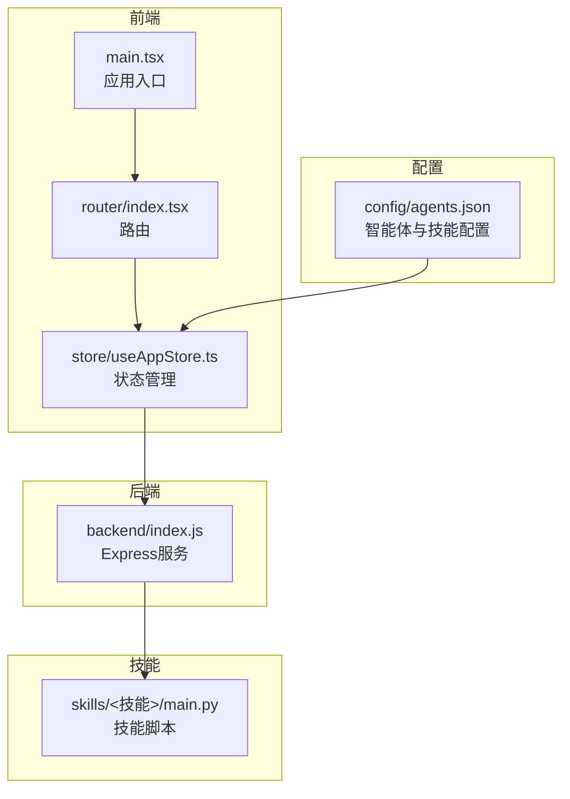
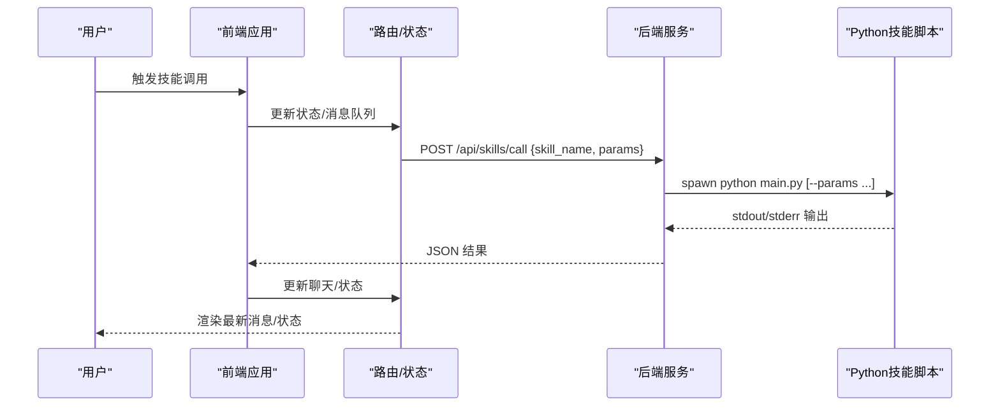
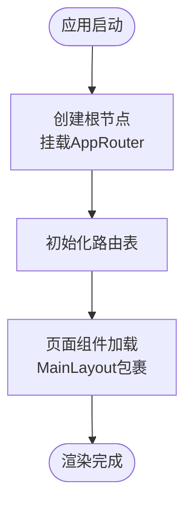
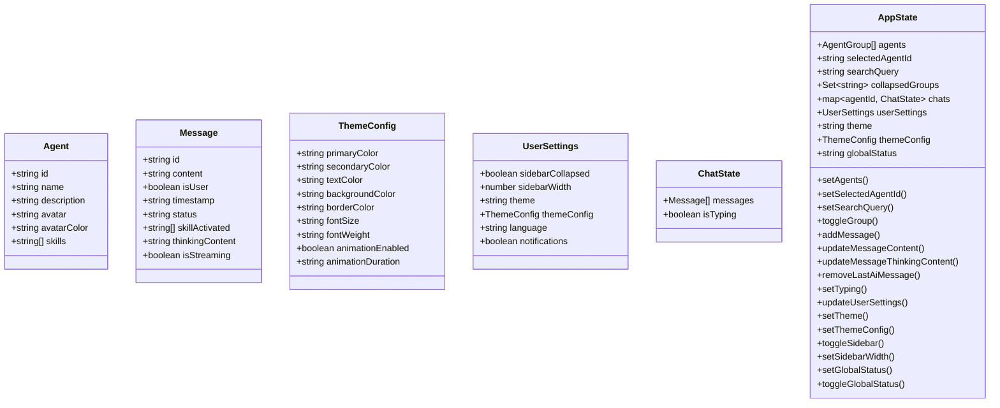
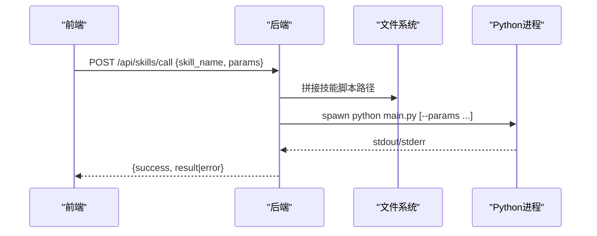
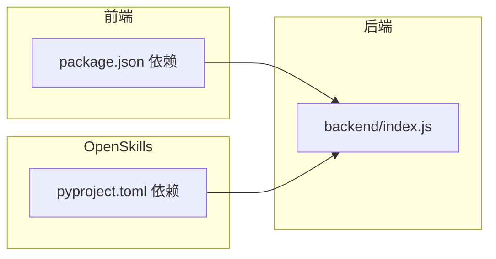

# 开发指南

<cite>
**本文引用的文件**
- [package.json](file://package.json)
- [pyproject.toml](file://OpenSkills-main/pyproject.toml)
- [开发环境配置.md](file://docs/基础规范/开发环境配置.md)
- [编码规范.md](file://docs/基础规范/编码规范.md)
- [命名规范.md](file://docs/基础规范/命名规范.md)
- [agents.json](file://config/agents.json)
- [ci.yml](file://OpenSkills-main/.github/workflows/ci.yml)
- [publish.yml](file://OpenSkills-main/.github/workflows/publish.yml)
- [index.js](file://backend/index.js)
- [main.tsx](file://src/main.tsx)
- [index.tsx](file://src/router/index.tsx)
- [useAppStore.ts](file://src/store/useAppStore.ts)
</cite>

## 目录
1. [简介](#简介)
2. [项目结构](#项目结构)
3. [核心组件](#核心组件)
4. [架构总览](#架构总览)
5. [详细组件分析](#详细组件分析)
6. [依赖分析](#依赖分析)
7. [性能考量](#性能考量)
8. [故障排查指南](#故障排查指南)
9. [结论](#结论)
10. [附录](#附录)

## 简介
本开发指南面向AutoMate项目的开发者，提供从环境搭建、代码规范、提交规范到模块划分、依赖管理、调试测试、性能分析、代码评审、质量保证与CI/CD、新功能开发流程、插件开发、版本控制与发布、团队协作与知识分享的全流程指导。内容基于仓库现有文档与代码进行提炼总结，帮助新老成员快速上手并保持高质量交付。

## 项目结构
AutoMate采用前后端分离与“技能”（Skill）模块化结合的架构：
- 前端：基于React + TypeScript + Vite，使用Zustand进行状态管理，Tailwind CSS进行样式组织。
- 后端：Node.js + Express提供技能调用代理，负责调用skills目录下的Python脚本。
- 技能（Skills）：独立的Python脚本模块，通过后端API统一调度。
- 配置：agents.json集中管理智能体与技能配置；开发环境通过Python内置HTTP服务器提供静态资源访问。
- 文档：docs目录提供基础规范与技术文档；OpenSkills子项目提供技能SDK与CI/CD参考。

图表来源
- [main.tsx](file://src/main.tsx#L1-L12)
- [index.tsx](file://src/router/index.tsx#L1-L43)
- [useAppStore.ts](file://src/store/useAppStore.ts#L1-L306)
- [index.js](file://backend/index.js#L1-L117)
- [agents.json](file://config/agents.json#L1-L119)

章节来源
- [main.tsx](file://src/main.tsx#L1-L12)
- [index.tsx](file://src/router/index.tsx#L1-L43)
- [useAppStore.ts](file://src/store/useAppStore.ts#L1-L306)
- [index.js](file://backend/index.js#L1-L117)
- [agents.json](file://config/agents.json#L1-L119)

## 核心组件
- 应用入口与路由：应用入口负责挂载根组件，路由定义页面级组件与导航。
- 状态管理：使用Zustand集中管理智能体、聊天会话、主题与用户设置。
- 后端服务：提供技能调用API，内部通过子进程执行Python技能脚本，并将结果返回给前端。
- 配置中心：agents.json集中定义智能体分组、配置与技能清单，前端按需加载。

章节来源
- [main.tsx](file://src/main.tsx#L1-L12)
- [index.tsx](file://src/router/index.tsx#L1-L43)
- [useAppStore.ts](file://src/store/useAppStore.ts#L1-L306)
- [index.js](file://backend/index.js#L1-L117)
- [agents.json](file://config/agents.json#L1-L119)

## 架构总览
前端通过路由与状态管理驱动UI，状态变更触发后端技能调用；后端以Express提供REST接口，内部调用Python技能脚本并返回结果。配置文件agents.json贯穿前端与后端，决定可用智能体与技能集合。

图表来源
- [index.tsx](file://src/router/index.tsx#L1-L43)
- [useAppStore.ts](file://src/store/useAppStore.ts#L1-L306)
- [index.js](file://backend/index.js#L1-L117)

## 详细组件分析

### 前端应用入口与路由
- 入口文件负责创建根节点并挂载路由容器。
- 路由定义首页、智能体聊天页与设置页，并对未知路径做重定向。

图表来源
- [main.tsx](file://src/main.tsx#L1-L12)
- [index.tsx](file://src/router/index.tsx#L1-L43)

章节来源
- [main.tsx](file://src/main.tsx#L1-L12)
- [index.tsx](file://src/router/index.tsx#L1-L43)

### 状态管理（Zustand）
- 管理智能体分组、当前选中智能体、搜索过滤、聊天消息、主题与用户设置、全局状态等。
- 提供消息增删改、打字态、主题切换、侧边栏控制等动作方法。

图表来源
- [useAppStore.ts](file://src/store/useAppStore.ts#L1-L306)

章节来源
- [useAppStore.ts](file://src/store/useAppStore.ts#L1-L306)

### 后端技能服务（Express）
- 提供技能调用接口与健康检查接口。
- 通过子进程执行skills目录下的Python脚本，传递参数并收集输出。
- 对stdout/stderr进行聚合，返回统一JSON结构。

图表来源
- [index.js](file://backend/index.js#L1-L117)

章节来源
- [index.js](file://backend/index.js#L1-L117)

### 配置中心（agents.json）
- 定义智能体分组、每个智能体的配置（模型URL、密钥、模型名）与技能清单（名称、类型、存储路径、版本）。
- 前端通过HTTP加载该配置，驱动智能体列表与技能展示。

章节来源
- [agents.json](file://config/agents.json#L1-L119)

## 依赖分析
- 前端依赖：React、React DOM、React Router、Zustand、Axios、Tailwind CSS等，构建与开发工具链由Vite与TypeScript提供。
- 后端依赖：Express、CORS、child_process（用于调用Python脚本）。
- OpenSkills子项目：Python SDK，使用Hatch构建系统、PyTest测试、Ruff代码检查与格式化、GitHub Actions进行CI/CD与PyPI发布。

图表来源
- [package.json](file://package.json#L1-L47)
- [index.js](file://backend/index.js#L1-L117)
- [pyproject.toml](file://OpenSkills-main/pyproject.toml#L1-L75)

章节来源
- [package.json](file://package.json#L1-L47)
- [pyproject.toml](file://OpenSkills-main/pyproject.toml#L1-L75)
- [index.js](file://backend/index.js#L1-L117)

## 性能考量
- 前端性能
  - 合理使用状态拆分与局部更新，避免不必要的重渲染。
  - 使用Zustand原子化状态，减少订阅范围。
  - 列表渲染提供稳定key，避免频繁重建DOM。
  - Tailwind类名优先，减少内联样式的开销。
- 后端性能
  - 技能调用采用子进程隔离，避免阻塞主进程。
  - 对stdout/stderr进行聚合，减少多次IO往返。
- 配置加载
  - agents.json体积控制与按需加载，避免首屏阻塞。

章节来源
- [编码规范.md](file://docs/基础规范/编码规范.md#L298-L334)
- [useAppStore.ts](file://src/store/useAppStore.ts#L1-L306)
- [index.js](file://backend/index.js#L1-L117)
- [agents.json](file://config/agents.json#L1-L119)

## 故障排查指南
- 开发环境问题
  - 服务器必须在项目根目录启动，否则静态资源与配置文件加载会失败。
  - 资源路径使用绝对路径，避免相对路径导致的跨目录访问问题。
- 配置加载失败
  - 检查agents.json格式与必填字段；确认浏览器Network标签中的请求状态。
- 技能调用失败
  - 检查后端日志与Python脚本输出；确认技能脚本路径与参数传递。
- 端口冲突
  - 使用netstat定位占用进程并释放端口，或更换端口。

章节来源
- [开发环境配置.md](file://docs/基础规范/开发环境配置.md#L1-L243)
- [index.js](file://backend/index.js#L1-L117)

## 结论
本指南基于仓库现有文档与代码，给出了AutoMate的开发环境、规范、模块划分、依赖与CI/CD实践的系统性说明。建议在实际开发中严格遵循命名与编码规范，配合状态管理与路由设计，确保前后端协同顺畅；通过OpenSkills的CI/CD参考，建立一致的质量与发布流程。

## 附录

### 开发环境配置
- 服务器启动位置与端口、资源路径规范、配置文件加载方式与常见问题排查详见开发环境配置文档。

章节来源
- [开发环境配置.md](file://docs/基础规范/开发环境配置.md#L1-L243)

### 代码规范与命名规范
- 前端React/TypeScript规范、Node.js编码规范、通用注释与格式化、代码审查清单与参考资源详见编码规范文档。
- 命名风格（文件、变量、函数、类型、CSS类名、数据库命名、配置文件与Git提交信息）详见命名规范文档。

章节来源
- [编码规范.md](file://docs/基础规范/编码规范.md#L1-L740)
- [命名规范.md](file://docs/基础规范/命名规范.md#L1-L370)

### 提交流程与质量保证
- Git提交信息格式与类型说明，以及代码审查清单，详见命名规范与编码规范文档。

章节来源
- [命名规范.md](file://docs/基础规范/命名规范.md#L296-L329)
- [编码规范.md](file://docs/基础规范/编码规范.md#L714-L728)

### 持续集成与发布
- OpenSkills子项目的CI工作流（Ruff检查与格式化）与发布到PyPI的工作流（构建、校验、上传、GitHub Release）可供参考。

章节来源
- [ci.yml](file://OpenSkills-main/.github/workflows/ci.yml#L1-L32)
- [publish.yml](file://OpenSkills-main/.github/workflows/publish.yml#L1-L99)

### 新功能开发流程
- 建议流程：需求分析 → 设计（含路由与状态规划）→ 实现（前端组件/状态 + 后端接口）→ 技能开发（Python脚本）→ 测试（单元/集成）→ 代码评审 → 提交与发布。

章节来源
- [index.tsx](file://src/router/index.tsx#L1-L43)
- [useAppStore.ts](file://src/store/useAppStore.ts#L1-L306)
- [index.js](file://backend/index.js#L1-L117)

### 插件/技能开发指南
- 技能脚本位于skills/<技能>/main.py，通过后端API统一调用；技能清单在agents.json中注册。

章节来源
- [index.js](file://backend/index.js#L1-L117)
- [agents.json](file://config/agents.json#L1-L119)

### 版本控制策略与分支管理
- Git提交信息采用约定式格式；分支命名建议使用feature/、bugfix/、hotfix/、refactor/等前缀。

章节来源
- [命名规范.md](file://docs/基础规范/命名规范.md#L296-L329)

### 团队协作与知识分享
- 建议定期进行代码评审与技术分享，统一遵循命名与编码规范，使用CI/CD保障质量与可重复发布。

章节来源
- [编码规范.md](file://docs/基础规范/编码规范.md#L714-L728)
- [publish.yml](file://OpenSkills-main/.github/workflows/publish.yml#L1-L99)