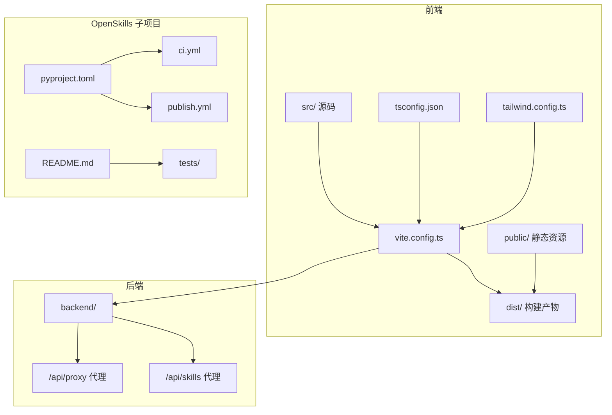
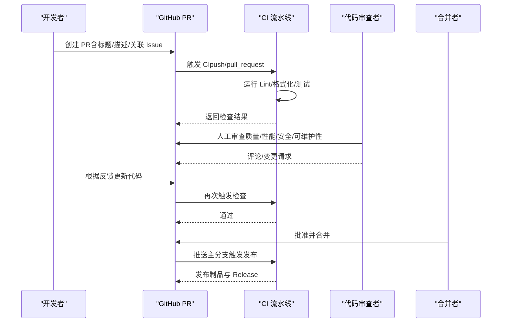
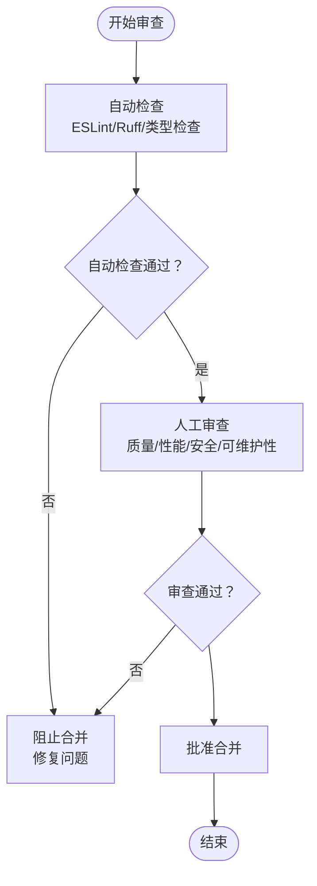
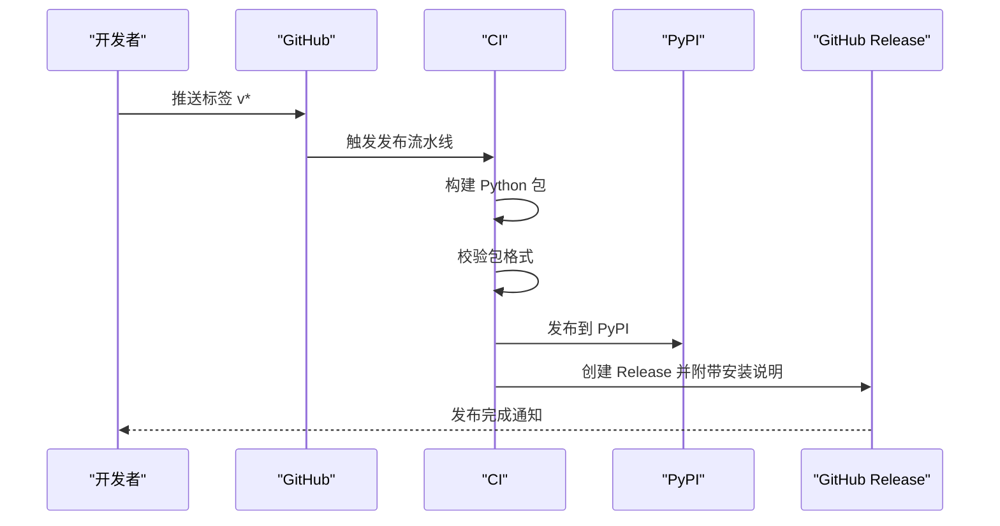
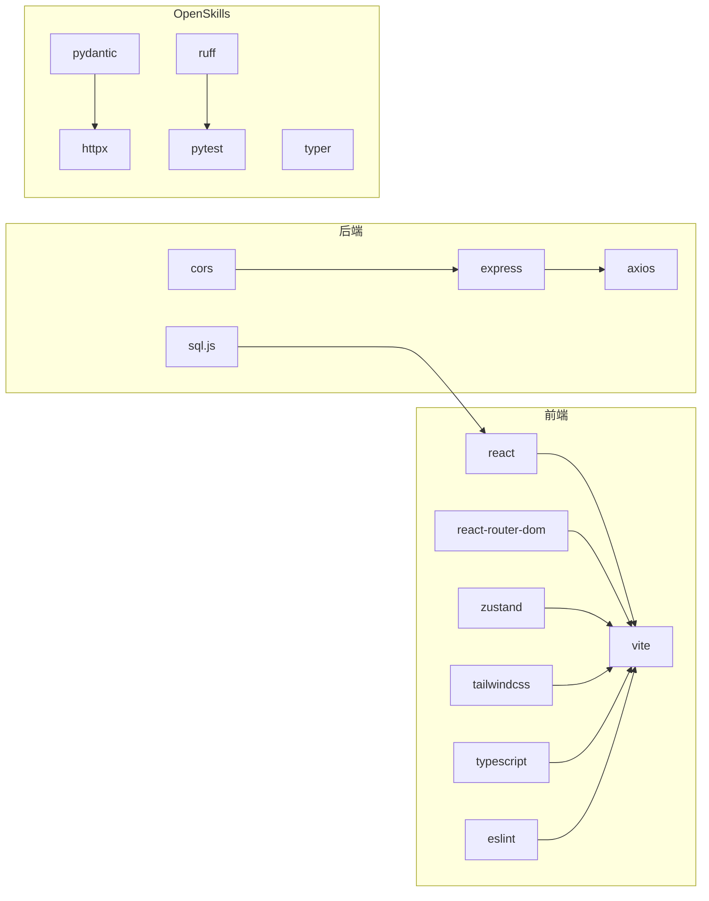

# 代码审查流程

<cite>
**本文引用的文件**
- [README.md](file://OpenSkills-main/README.md)
- [pyproject.toml](file://OpenSkills-main/pyproject.toml)
- [ci.yml](file://OpenSkills-main/.github/workflows/ci.yml)
- [publish.yml](file://OpenSkills-main/.github/workflows/publish.yml)
- [编码规范.md](file://docs/基础规范/编码规范.md)
- [命名规范.md](file://docs/基础规范/命名规范.md)
- [可维护性设计.md](file://docs/非功能设计/可维护性设计.md)
- [可扩展性设计.md](file://docs/非功能设计/可扩展性设计.md)
- [package.json](file://package.json)
- [tsconfig.json](file://tsconfig.json)
- [tailwind.config.ts](file://tailwind.config.ts)
- [vite.config.ts](file://vite.config.ts)
- [test_llm.py](file://OpenSkills-main/tests/test_llm.py)
</cite>

## 目录
1. [简介](#简介)
2. [项目结构](#项目结构)
3. [核心组件](#核心组件)
4. [架构总览](#架构总览)
5. [详细组件分析](#详细组件分析)
6. [依赖关系分析](#依赖关系分析)
7. [性能考量](#性能考量)
8. [故障排查指南](#故障排查指南)
9. [结论](#结论)
10. [附录](#附录)

## 简介
本文件为 AutoMate 项目建立标准化的代码审查流程，覆盖 Pull Request 创建规范、代码审查标准、审查流程（自动检查、人工审查、批准合并）、审查检查清单与常见问题解决方案，并解释与 CI/CD 的集成方式（自动化测试、构建验证、发布检查）。内容基于仓库现有规范与配置文件整理，确保流程可执行、可追溯、可度量。

## 项目结构
AutoMate 采用前后端分离与多模块并行的组织方式：
- 前端：Vite + React + TypeScript + TailwindCSS，位于 src/ 与 public/，构建产物 dist/
- 后端：Node.js/Express 提供 API 代理与服务（backend/），并与前端共享部分工具与类型
- OpenSkills 子项目：独立的 Python SDK，包含 CLI、测试与 GitHub Actions 工作流
- 文档：docs/ 下的“基础规范”和“非功能设计”文档定义了编码、命名、可维护性与可扩展性等规范
- 配置：package.json、tsconfig.json、tailwind.config.ts、vite.config.ts 等

图表来源
- [vite.config.ts](file://vite.config.ts#L1-L47)
- [tsconfig.json](file://tsconfig.json#L1-L26)
- [tailwind.config.ts](file://tailwind.config.ts#L1-L161)
- [package.json](file://package.json#L1-L47)
- [README.md](file://OpenSkills-main/README.md#L1-L411)
- [pyproject.toml](file://OpenSkills-main/pyproject.toml#L1-L75)
- [ci.yml](file://OpenSkills-main/.github/workflows/ci.yml#L1-L32)
- [publish.yml](file://OpenSkills-main/.github/workflows/publish.yml#L1-L99)

章节来源
- [vite.config.ts](file://vite.config.ts#L1-L47)
- [tsconfig.json](file://tsconfig.json#L1-L26)
- [tailwind.config.ts](file://tailwind.config.ts#L1-L161)
- [package.json](file://package.json#L1-L47)
- [README.md](file://OpenSkills-main/README.md#L1-L411)
- [pyproject.toml](file://OpenSkills-main/pyproject.toml#L1-L75)

## 核心组件
- 前端工程化：Vite 构建、TypeScript 类型检查、TailwindCSS 样式体系、ESLint 规范
- 后端工程化：Express 服务、API 代理（本地与外部网关）、并发启动脚本
- OpenSkills 子项目：Python SDK、Ruff 代码检查、PyTest 单元测试、GitHub Actions 发布流水线
- 文档规范：编码规范、命名规范、可维护性与可扩展性设计文档

章节来源
- [package.json](file://package.json#L1-L47)
- [tsconfig.json](file://tsconfig.json#L1-L26)
- [tailwind.config.ts](file://tailwind.config.ts#L1-L161)
- [vite.config.ts](file://vite.config.ts#L1-L47)
- [编码规范.md](file://docs/基础规范/编码规范.md#L1-L740)
- [命名规范.md](file://docs/基础规范/命名规范.md#L1-L370)
- [可维护性设计.md](file://docs/非功能设计/可维护性设计.md#L1-L490)
- [可扩展性设计.md](file://docs/非功能设计/可扩展性设计.md#L1-L624)
- [README.md](file://OpenSkills-main/README.md#L1-L411)
- [pyproject.toml](file://OpenSkills-main/pyproject.toml#L1-L75)

## 架构总览
下图展示 PR 审查流程与 CI/CD 集成的关键节点：PR 创建、自动检查（Lint/格式化/测试）、人工审查、批准与合并、发布与回滚。

图表来源
- [ci.yml](file://OpenSkills-main/.github/workflows/ci.yml#L1-L32)
- [publish.yml](file://OpenSkills-main/.github/workflows/publish.yml#L1-L99)
- [pyproject.toml](file://OpenSkills-main/pyproject.toml#L65-L75)

## 详细组件分析

### Pull Request 创建规范
- 标题格式：建议采用“类型(scope): 概述”的格式，参考命名规范中的提交信息格式
- 描述要求：简述变更动机、具体改动点、影响范围、测试情况；必要时附上截图或演示步骤
- 关联问题链接：在描述末尾使用“Closes/Fixes #编号”或“Related to #编号”
- 分支命名：feature/、bugfix/、hotfix/、refactor/ 等，与命名规范一致

章节来源
- [命名规范.md](file://docs/基础规范/命名规范.md#L296-L329)

### 代码审查标准
- 代码质量
  - 符合编码规范与命名规范，类型注解完整，函数与类具备文档字符串
  - 遵循可维护性设计目标：模块化、日志记录、注释覆盖率、测试覆盖率
- 性能考虑
  - 避免不必要的重渲染（React.memo、useMemo、useCallback）
  - 合理拆分构建产物，利用 Vite 的 manualChunks 优化
  - 后端接口代理与超时控制，避免阻塞
- 安全性检查
  - 输入校验与错误处理完善，避免注入与未捕获异常
  - 代理配置仅允许必要路径，避免路径穿越
- 可维护性评估
  - 遵循可扩展性设计：接口隔离、依赖倒置、插件化与版本化扩展
  - 日志分级与格式统一，便于问题定位

章节来源
- [编码规范.md](file://docs/基础规范/编码规范.md#L714-L728)
- [可维护性设计.md](file://docs/非功能设计/可维护性设计.md#L470-L484)
- [可扩展性设计.md](file://docs/非功能设计/可扩展性设计.md#L603-L618)
- [vite.config.ts](file://vite.config.ts#L32-L46)

### 审查流程
- 自动检查
  - 前端：ESLint、TypeScript 类型检查、构建
  - Python：Ruff Lint 与格式检查
  - 测试：PyTest（OpenSkills 子项目）
- 人工审查
  - 关注代码质量、性能、安全与可维护性
  - 检查是否满足审查清单与规范
- 批准合并
  - 至少一名审查者批准
  - CI 通过后方可合并

图表来源
- [ci.yml](file://OpenSkills-main/.github/workflows/ci.yml#L10-L32)
- [pyproject.toml](file://OpenSkills-main/pyproject.toml#L65-L75)
- [package.json](file://package.json#L6-L13)

章节来源
- [ci.yml](file://OpenSkills-main/.github/workflows/ci.yml#L1-L32)
- [pyproject.toml](file://OpenSkills-main/pyproject.toml#L65-L75)
- [package.json](file://package.json#L6-L13)

### 代码审查检查清单
- 前端
  - 命名与类型：组件/函数/变量命名符合规范，类型注解完整
  - React 最佳实践：避免重复渲染、正确使用 Hooks、事件处理与回调缓存
  - 样式与构建：Tailwind 使用规范、构建产物体积与分包策略
- 后端
  - 接口与代理：路径正确、超时与错误处理、日志记录
  - 并发与启动：脚本并发启动、端口与代理配置
- Python SDK
  - Lint 与格式：Ruff 检查通过
  - 测试：PyTest 覆盖关键逻辑（如消息、图像内容、消息序列化）

章节来源
- [编码规范.md](file://docs/基础规范/编码规范.md#L714-L728)
- [可维护性设计.md](file://docs/非功能设计/可维护性设计.md#L470-L484)
- [vite.config.ts](file://vite.config.ts#L32-L46)
- [package.json](file://package.json#L6-L13)
- [ci.yml](file://OpenSkills-main/.github/workflows/ci.yml#L25-L31)
- [test_llm.py](file://OpenSkills-main/tests/test_llm.py#L1-L235)

### 常见问题与解决方案
- ESLint 报错
  - 现象：ESLint 失败
  - 处理：根据报错逐项修复，确保规则通过
- Ruff 格式或 Lint 失败
  - 现象：Ruff 检查失败
  - 处理：运行格式化命令修复，再执行 Lint
- 构建失败或类型错误
  - 现象：TypeScript 类型检查失败或构建报错
  - 处理：补齐缺失类型注解，修复类型错误
- 代理路径错误
  - 现象：/api/proxy 或 /api/skills 无法访问
  - 处理：确认目标地址、changeOrigin 与 rewrite 规则
- 测试未覆盖
  - 现象：测试覆盖率不足
  - 处理：补充单元测试与集成测试，提升覆盖率

章节来源
- [package.json](file://package.json#L10-L11)
- [ci.yml](file://OpenSkills-main/.github/workflows/ci.yml#L25-L31)
- [vite.config.ts](file://vite.config.ts#L18-L29)
- [可维护性设计.md](file://docs/非功能设计/可维护性设计.md#L294-L377)

### CI/CD 集成
- 自动化测试与构建
  - 前端：ESLint、TypeScript 类型检查、Vite 构建
  - Python：Ruff Lint 与格式检查
- 构建验证
  - 通过后端脚本启动本地服务，验证代理与接口连通性
- 发布检查
  - PyPI 发布：打包、twine 校验、上传制品、创建 GitHub Release
  - 触发条件：打标签（如 v1.2.3）

图表来源
- [publish.yml](file://OpenSkills-main/.github/workflows/publish.yml#L1-L99)
- [pyproject.toml](file://OpenSkills-main/pyproject.toml#L1-L75)

章节来源
- [publish.yml](file://OpenSkills-main/.github/workflows/publish.yml#L1-L99)
- [pyproject.toml](file://OpenSkills-main/pyproject.toml#L1-L75)

## 依赖关系分析
- 前端依赖
  - React 生态、路由、状态管理、UI 组件库、TailwindCSS
  - 构建工具：Vite、TypeScript、ESLint、PostCSS、TailwindCSS
- 后端依赖
  - Express、CORS、Axios、Zustand（前端状态）、sql.js（前端数据库）
- OpenSkills 子项目
  - Python 依赖：Pydantic、HTTPX、Typer、Rich、PyYAML
  - 开发依赖：Ruff、PyTest、PyTest-Asyncio

图表来源
- [package.json](file://package.json#L15-L46)
- [pyproject.toml](file://OpenSkills-main/pyproject.toml#L22-L38)

章节来源
- [package.json](file://package.json#L15-L46)
- [pyproject.toml](file://OpenSkills-main/pyproject.toml#L22-L38)

## 性能考量
- 前端
  - 使用 React.memo、useMemo、useCallback 降低重渲染
  - 利用 Vite 的 manualChunks 对第三方库进行分包，减少首屏体积
  - TailwindCSS 按需引入，避免无用样式
- 后端
  - 合理设置代理超时与错误处理，避免阻塞
  - 并发启动前后端服务，提升开发体验
- Python SDK
  - 使用 Ruff 快速发现潜在性能问题（如复杂度高的函数）
  - 单测覆盖关键路径，保障稳定性

章节来源
- [编码规范.md](file://docs/基础规范/编码规范.md#L298-L334)
- [vite.config.ts](file://vite.config.ts#L32-L46)
- [可维护性设计.md](file://docs/非功能设计/可维护性设计.md#L294-L377)
- [ci.yml](file://OpenSkills-main/.github/workflows/ci.yml#L25-L31)

## 故障排查指南
- 本地开发
  - 端口冲突：调整 vite.server.port 或关闭占用进程
  - 代理不通：核对 /api/proxy 与 /api/skills 的 target、rewrite
  - 类型错误：执行类型检查脚本，补齐缺失类型
- CI 失败
  - Ruff 失败：运行格式化并修复 Lint 问题
  - PyTest 失败：补充测试用例，修复被测逻辑
- 发布失败
  - PyPI 发布：检查令牌与包格式，确认 twine 校验通过
  - Release：确认标签与提交信息，检查制品上传

章节来源
- [vite.config.ts](file://vite.config.ts#L12-L30)
- [package.json](file://package.json#L10-L11)
- [ci.yml](file://OpenSkills-main/.github/workflows/ci.yml#L25-L31)
- [publish.yml](file://OpenSkills-main/.github/workflows/publish.yml#L53-L54)

## 结论
通过标准化的 PR 创建规范、明确的审查标准、自动化的 CI/CD 流程以及完善的检查清单，AutoMate 项目可在保证质量的同时提升协作效率。建议持续完善测试覆盖率与文档，确保审查流程长期有效运行。

## 附录
- 审查检查清单（摘自规范）
  - 命名与编码规范符合
  - 类型注解完整且正确
  - 函数与类具备文档字符串
  - 错误处理与日志记录完善
  - 代码格式化与检查通过
  - 单元测试覆盖充分
  - 性能与可维护性考虑合理

章节来源
- [编码规范.md](file://docs/基础规范/编码规范.md#L714-L728)
- [可维护性设计.md](file://docs/非功能设计/可维护性设计.md#L470-L484)