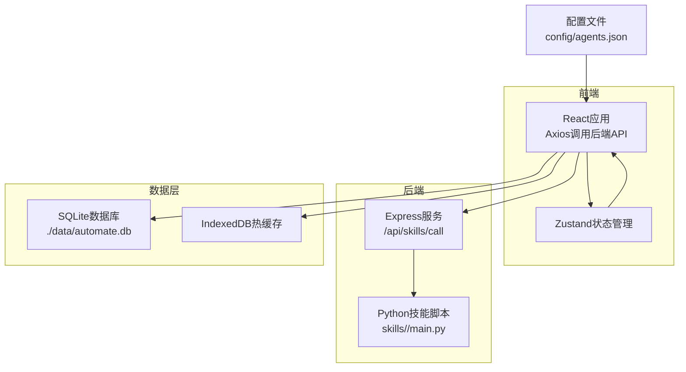
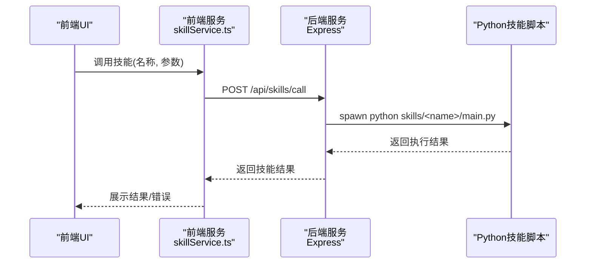
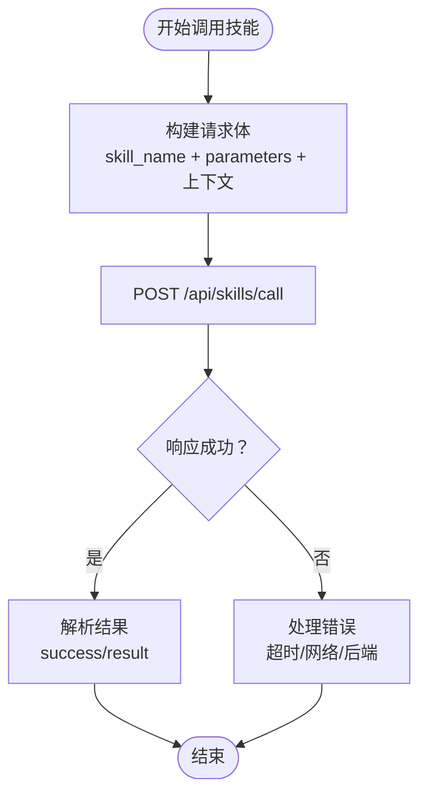
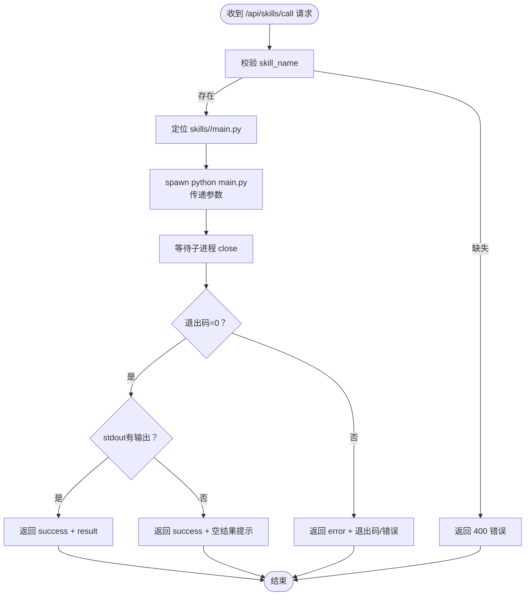
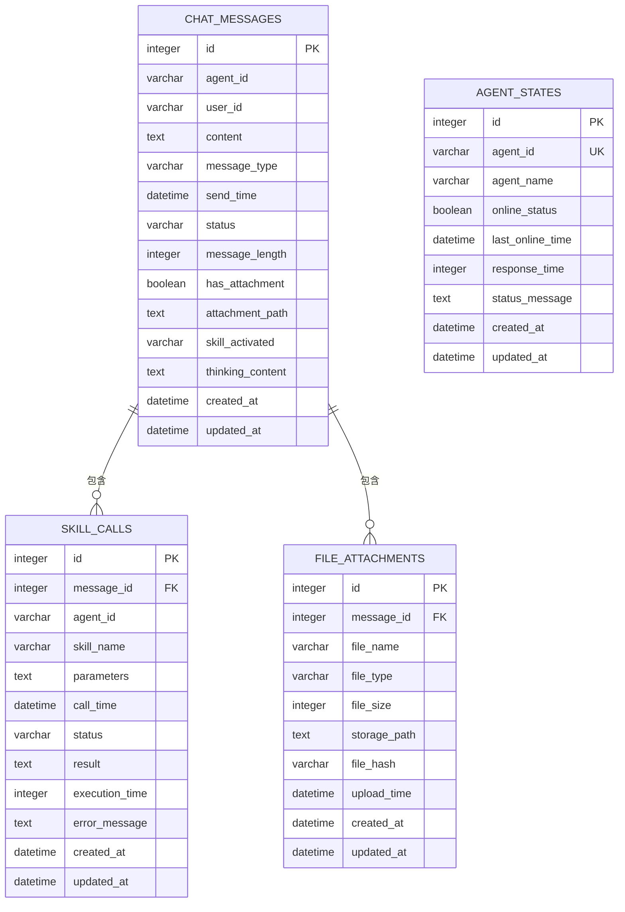
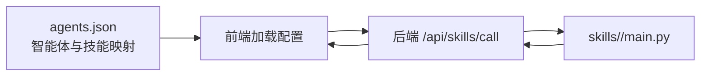
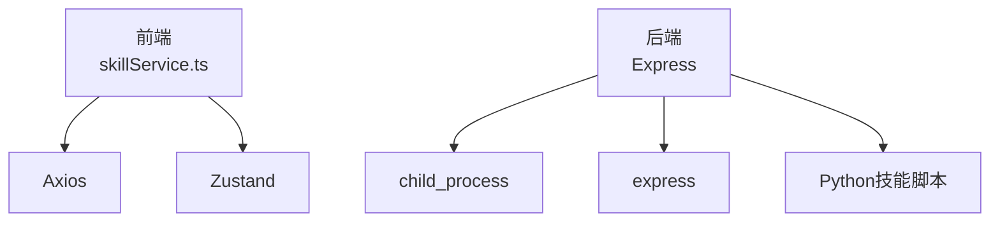

# 功能开发流程

<cite>
**本文引用的文件**
- [package.json](file://package.json)
- [backend/index.js](file://backend/index.js)
- [docs/基础规范/开发环境配置.md](file://docs/基础规范/开发环境配置.md)
- [docs/接口层设计/Tauri通信接口.md](file://docs/接口层设计/Tauri通信接口.md)
- [docs/数据层设计/数据库设计.md](file://docs/数据层设计/数据库设计.md)
- [docs/基础规范/编码规范.md](file://docs/基础规范/编码规范.md)
- [docs/基础规范/命名规范.md](file://docs/基础规范/命名规范.md)
- [src/services/skillService.ts](file://src/services/skillService.ts)
- [src/store/useAppStore.ts](file://src/store/useAppStore.ts)
- [config/agents.json](file://config/agents.json)
- [skills/weather_query/main.py](file://skills/weather_query/main.py)
</cite>

## 目录
1. [简介](#简介)
2. [项目结构](#项目结构)
3. [核心组件](#核心组件)
4. [架构总览](#架构总览)
5. [详细组件分析](#详细组件分析)
6. [依赖关系分析](#依赖关系分析)
7. [性能考量](#性能考量)
8. [故障排查指南](#故障排查指南)
9. [结论](#结论)
10. [附录](#附录)

## 简介
本文件为AutoMate项目提供标准化的功能开发流程文档，覆盖从需求分析、技术设计到代码实现的全流程，包括前端组件开发、后端API开发、数据库设计变更与技能脚本集成；明确Git工作流程（分支策略、提交规范、合并流程）；给出开发环境配置、本地调试方法与测试验证流程；并提供功能开发模板与检查清单，确保新功能的质量与一致性。

## 项目结构
AutoMate采用前后端分离与“技能脚本”解耦的设计：
- 前端基于React + TypeScript，使用Zustand进行状态管理，通过Axios调用后端API。
- 后端基于Node.js + Express，提供技能调用API，内部通过子进程调用Python技能脚本。
- 数据层采用SQLite（主存储）与IndexedDB（热缓存）混合存储策略，提升读写效率。
- 配置文件集中于config目录，前端通过HTTP加载agents.json等配置。

**图表来源**
- [backend/index.js](file://backend/index.js#L1-L117)
- [src/services/skillService.ts](file://src/services/skillService.ts#L1-L73)
- [docs/数据层设计/数据库设计.md](file://docs/数据层设计/数据库设计.md#L597-L728)
- [config/agents.json](file://config/agents.json#L1-L119)

**章节来源**
- [package.json](file://package.json#L1-L47)
- [docs/基础规范/开发环境配置.md](file://docs/基础规范/开发环境配置.md#L1-L243)

## 核心组件
- 技能服务（前端）：封装技能调用API，统一错误处理与超时控制。
- 后端技能服务：接收前端请求，定位并执行对应Python技能脚本，返回结果。
- 数据层：SQLite主存储 + IndexedDB热缓存，支持混合读写与定期同步。
- 配置管理：agents.json集中管理智能体与技能映射，前端通过HTTP加载。
- 状态管理：Zustand Store管理聊天状态、主题与用户设置。

**章节来源**
- [src/services/skillService.ts](file://src/services/skillService.ts#L1-L73)
- [backend/index.js](file://backend/index.js#L1-L117)
- [docs/数据层设计/数据库设计.md](file://docs/数据层设计/数据库设计.md#L597-L728)
- [config/agents.json](file://config/agents.json#L1-L119)
- [src/store/useAppStore.ts](file://src/store/useAppStore.ts#L1-L306)

## 架构总览
AutoMate采用“前端-后端-技能脚本-数据层”的分层架构。前端通过Axios调用后端API，后端通过子进程执行Python技能脚本，并将结果返回给前端。数据层采用SQLite与IndexedDB混合存储，确保历史数据持久化与近期数据高性能访问。

**图表来源**
- [src/services/skillService.ts](file://src/services/skillService.ts#L12-L61)
- [backend/index.js](file://backend/index.js#L19-L79)

## 详细组件分析

### 前端技能调用组件分析
- 职责：封装技能调用API，统一错误处理与超时控制。
- 关键点：
  - 使用Axios POST调用后端技能接口。
  - 统一超时时间与错误分类（网络错误、超时、后端错误）。
  - 将agentId、messageId等上下文参数透传至后端。

**图表来源**
- [src/services/skillService.ts](file://src/services/skillService.ts#L12-L61)

**章节来源**
- [src/services/skillService.ts](file://src/services/skillService.ts#L1-L73)

### 后端技能服务组件分析
- 职责：接收前端请求，定位技能脚本路径，通过子进程执行，收集输出并返回。
- 关键点：
  - 校验必填参数（skill_name）。
  - 通过子进程spawn执行Python脚本，传递参数。
  - 统一返回结构（success/result/error），并处理stderr与错误事件。

**图表来源**
- [backend/index.js](file://backend/index.js#L19-L104)

**章节来源**
- [backend/index.js](file://backend/index.js#L1-L117)

### 数据层设计与混合存储
- 设计要点：
  - SQLite为主存储，持久化历史数据。
  - IndexedDB为热缓存，存储最近N天数据，提升读取性能。
  - 通过后端API实现数据同步与查询。
- 索引与事务：
  - 为高频查询字段建立索引，优化时间范围与组合查询。
  - 使用事务保证写入一致性，避免长时间阻塞。

**图表来源**
- [docs/数据层设计/数据库设计.md](file://docs/数据层设计/数据库设计.md#L41-L264)

**章节来源**
- [docs/数据层设计/数据库设计.md](file://docs/数据层设计/数据库设计.md#L1-L738)

### 配置与技能映射
- agents.json集中管理智能体与技能映射，前端通过HTTP加载配置。
- 技能脚本位于skills/<skill>/main.py，后端通过skill_name定位并执行。

**图表来源**
- [config/agents.json](file://config/agents.json#L1-L119)
- [backend/index.js](file://backend/index.js#L17-L29)

**章节来源**
- [config/agents.json](file://config/agents.json#L1-L119)

## 依赖关系分析
- 前端依赖：
  - Axios：HTTP客户端，调用后端技能接口。
  - Zustand：轻量状态管理，维护聊天与用户设置。
- 后端依赖：
  - child_process：用于spawn Python技能脚本。
  - express：提供REST API。
- 技能脚本：
  - Python标准库与第三方库（如requests），按技能需求引入。

**图表来源**
- [src/services/skillService.ts](file://src/services/skillService.ts#L1-L10)
- [backend/index.js](file://backend/index.js#L1-L6)
- [package.json](file://package.json#L15-L27)

**章节来源**
- [package.json](file://package.json#L1-L47)

## 性能考量
- 前端：
  - 使用Axios超时控制，避免长时间挂起。
  - Zustand状态粒度拆分，减少不必要的重渲染。
- 后端：
  - 子进程执行技能脚本，避免阻塞主事件循环。
  - 对频繁查询建立索引，优化SQLite读取性能。
- 数据层：
  - SQLite + IndexedDB混合存储，热点数据走IndexedDB，历史数据落盘。
  - 定期同步与VACUUM/ANALYZE维护数据库健康。

[本节为通用指导，无需列出章节来源]

## 故障排查指南
- 前端技能调用失败：
  - 检查后端服务是否运行（npm run backend）。
  - 查看网络错误与超时提示，确认API路径与超时设置。
- 后端技能执行失败：
  - 检查skill_name是否正确，脚本路径是否存在。
  - 查看stderr输出与退出码，定位Python脚本异常。
- 配置加载失败：
  - 确认开发服务器在项目根目录启动，使用绝对路径访问配置文件。
- 数据库问题：
  - 检查索引是否缺失，必要时重建索引。
  - 定期执行VACUUM与ANALYZE，监控数据库大小。

**章节来源**
- [src/services/skillService.ts](file://src/services/skillService.ts#L34-L60)
- [backend/index.js](file://backend/index.js#L71-L77)
- [docs/基础规范/开发环境配置.md](file://docs/基础规范/开发环境配置.md#L168-L225)
- [docs/数据层设计/数据库设计.md](file://docs/数据层设计/数据库设计.md#L473-L516)

## 结论
通过标准化的功能开发流程与严格的组件职责划分，AutoMate能够在前端、后端、数据层与技能脚本之间形成高内聚、低耦合的协作体系。遵循本文档的流程与规范，可显著提升开发效率与系统稳定性。

[本节为总结性内容，无需列出章节来源]

## 附录

### Git工作流程（分支策略、提交规范、合并流程）
- 分支策略
  - feature/<功能名>：新功能开发
  - bugfix/<问题描述>：修复缺陷
  - hotfix/<紧急修复>：紧急修复
  - refactor/<重构范围>：重构
- 提交规范
  - 格式：<type>(<scope>): <subject>
  - 示例：feat(agent): add agent search functionality
- 合并流程
  - 通过Pull Request进行代码审查，确保通过ESLint与单元测试后再合并。

**章节来源**
- [docs/基础规范/命名规范.md](file://docs/基础规范/命名规范.md#L296-L329)

### 开发环境配置与本地调试
- 开发服务器必须在项目根目录启动，使用绝对路径访问资源。
- 前端通过npm run dev启动Vite，后端通过npm run backend启动Express。
- 浏览器开发者工具用于检查网络请求与控制台错误。

**章节来源**
- [docs/基础规范/开发环境配置.md](file://docs/基础规范/开发环境配置.md#L1-L243)
- [package.json](file://package.json#L6-L13)

### 测试验证流程
- 前端：使用ESLint与TypeScript类型检查，确保代码质量。
- 后端：对关键API进行单元测试，覆盖正常与异常路径。
- 集成测试：模拟技能调用与数据库读写，验证端到端流程。

**章节来源**
- [docs/基础规范/编码规范.md](file://docs/基础规范/编码规范.md#L687-L728)

### 功能开发模板与检查清单
- 需求分析
  - 明确功能目标、用户场景与验收标准。
- 技术设计
  - 前端组件设计（Props、状态、事件）、后端API设计（路由、参数、返回）、数据库变更（表/索引/事务）。
- 代码实现
  - 遵循命名与编码规范，使用Zustand管理状态，Axios调用API，后端通过子进程执行技能脚本。
- 测试验证
  - 单测覆盖、集成测试、端到端验证。
- 文档与发布
  - 更新配置文件（agents.json）、编写使用说明、提交PR并通过审查。

**章节来源**
- [docs/基础规范/编码规范.md](file://docs/基础规范/编码规范.md#L1-L740)
- [docs/基础规范/命名规范.md](file://docs/基础规范/命名规范.md#L1-L370)

### 技能脚本集成范例
- 新增技能步骤
  - 在skills/<skill>/目录下创建main.py，实现入口函数与参数解析。
  - 在agents.json中注册技能映射（名称、描述、存储路径、版本）。
  - 前端通过skillService调用，后端通过/ api/skills/call转发至脚本。
- 示例参考
  - 天气查询技能脚本展示了参数解析、API调用与结果格式化。

**章节来源**
- [skills/weather_query/main.py](file://skills/weather_query/main.py#L1-L139)
- [config/agents.json](file://config/agents.json#L17-L38)