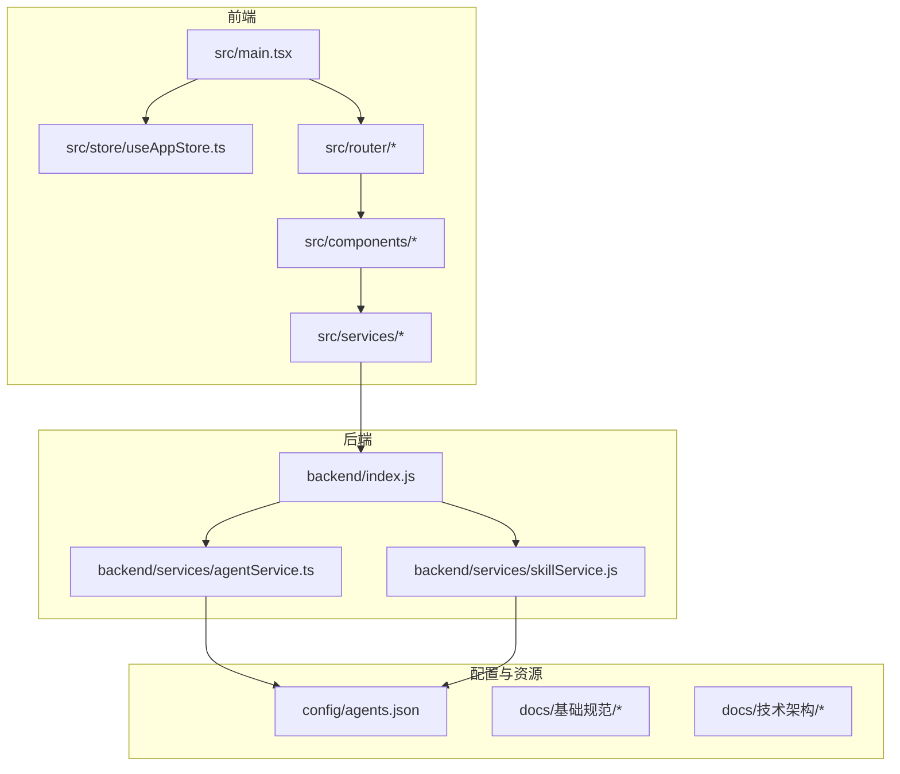
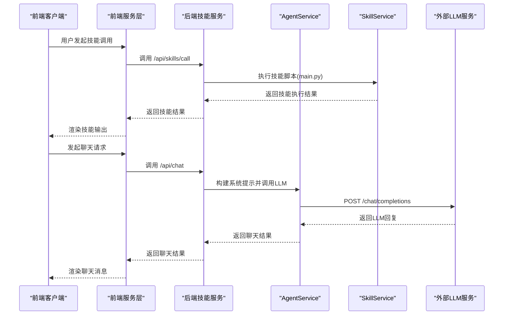
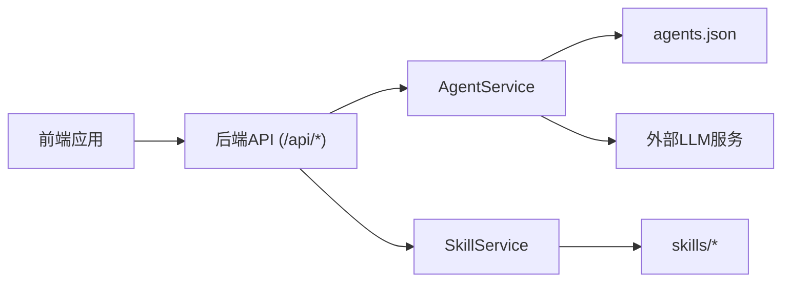

# 团队协作规范

<cite>
**本文档引用的文件**
- [package.json](file://package.json)
- [todo_list.md](file://todo_list.md)
- [开发环境配置.md](file://docs/基础规范/开发环境配置.md)
- [编码规范.md](file://docs/基础规范/编码规范.md)
- [命名规范.md](file://docs/基础规范/命名规范.md)
- [agents.json](file://config/agents.json)
- [backend/index.js](file://backend/index.js)
- [backend/services/agentService.ts](file://backend/services/agentService.ts)
- [backend/services/skillService.js](file://backend/services/skillService.js)
- [src/main.tsx](file://src/main.tsx)
- [src/store/useAppStore.ts](file://src/store/useAppStore.ts)
</cite>

## 目录
1. [引言](#引言)
2. [项目结构](#项目结构)
3. [核心组件](#核心组件)
4. [架构概览](#架构概览)
5. [详细组件分析](#详细组件分析)
6. [依赖分析](#依赖分析)
7. [性能考虑](#性能考虑)
8. [故障排除指南](#故障排除指南)
9. [结论](#结论)
10. [附录](#附录)

## 引言
本文件旨在建立AutoMate项目的团队协作标准与沟通机制，基于现有代码库与文档，制定任务分配原则、沟通渠道、进度跟踪方法、协作工具使用规范以及冲突解决机制。文档同时提供可视化图表帮助理解系统架构与协作流程。

## 项目结构
AutoMate采用前后端分离架构，前端使用React + TypeScript + Vite，后端使用Node.js + Express，技能执行通过Python脚本实现。项目包含明确的目录划分与配置文件，便于团队协作与版本管理。

**图表来源**
- [src/main.tsx](file://src/main.tsx#L1-L12)
- [src/store/useAppStore.ts](file://src/store/useAppStore.ts#L1-L306)
- [backend/index.js](file://backend/index.js#L1-L117)
- [backend/services/agentService.ts](file://backend/services/agentService.ts#L1-L245)
- [backend/services/skillService.js](file://backend/services/skillService.js#L1-L87)
- [config/agents.json](file://config/agents.json#L1-L119)

**章节来源**
- [package.json](file://package.json#L1-L47)
- [开发环境配置.md](file://docs/基础规范/开发环境配置.md#L1-L243)

## 核心组件
- 前端应用入口与状态管理：应用通过入口文件初始化路由与样式，全局状态通过Zustand集中管理，包含智能体、聊天、主题与用户设置等状态域。
- 后端技能服务：提供技能调用API，封装Python脚本执行逻辑，并与前端服务对接。
- 配置与协作：agents.json作为智能体与技能配置的权威来源，统一约束技能目录与调用方式。

**章节来源**
- [src/main.tsx](file://src/main.tsx#L1-L12)
- [src/store/useAppStore.ts](file://src/store/useAppStore.ts#L1-L306)
- [backend/index.js](file://backend/index.js#L1-L117)
- [config/agents.json](file://config/agents.json#L1-L119)

## 架构概览
前端通过服务层与后端交互，后端根据agents.json配置加载技能描述与模型参数，调用外部LLM服务或执行Python技能脚本，最终返回结果给前端渲染。

**图表来源**
- [backend/index.js](file://backend/index.js#L81-L111)
- [backend/services/agentService.ts](file://backend/services/agentService.ts#L118-L185)
- [backend/services/skillService.js](file://backend/services/skillService.js#L16-L87)

## 详细组件分析

### 任务分配原则
- 角色职责
  - 前端开发：负责组件实现、状态管理、路由与UI交互，遵循编码与命名规范。
  - 后端开发：负责技能服务、代理服务与API封装，确保与前端协议一致。
  - 配置维护：统一维护agents.json，确保技能目录与调用参数正确。
- 优先级排序
  - 基于功能重要性与依赖关系，优先完成核心交互（聊天、智能体列表）与基础设施（状态管理、路由）。
  - 依赖关系：前端组件依赖后端API；后端依赖agents.json配置；技能脚本依赖Python环境。
- 依赖关系管理
  - 前端通过服务层调用后端API；后端通过AgentService读取agents.json；SkillService执行Python脚本。
  - 配置变更需同步更新agents.json并验证路径与权限。

**章节来源**
- [编码规范.md](file://docs/基础规范/编码规范.md#L1-L740)
- [命名规范.md](file://docs/基础规范/命名规范.md#L1-L370)
- [开发环境配置.md](file://docs/基础规范/开发环境配置.md#L1-L243)
- [backend/services/agentService.ts](file://backend/services/agentService.ts#L58-L78)
- [backend/services/skillService.js](file://backend/services/skillService.js#L8-L8)
- [config/agents.json](file://config/agents.json#L1-L119)

### 沟通渠道
- 日常站会
  - 时间：每日上午9:30-10:00
  - 形式：线上视频会议，每人3分钟同步昨日进展、今日计划与阻塞问题
  - 工具：企业微信/钉钉会议室
- 异步沟通
  - 平台：企业微信群/飞书群
  - 场景：需求澄清、技术讨论、文档修订
- 决策流程
  - 小决策：负责人即时决定并在群内同步
  - 大决策：提出议题至周会，形成决议并更新文档

[本节为概念性内容，无需“章节来源”]

### 进度跟踪方法
- 任务看板
  - 工具：Trello/Jira（建议）
  - 分类：待办、进行中、测试中、已完成
  - 任务粒度：按组件/功能模块拆分，关联PR与Issue
- 里程碑管理
  - 第一阶段：核心UI组件完成（已完成）
  - 第二阶段：前后端联调与集成测试
  - 第三阶段：技能系统上线与性能优化
- 风险预警
  - 配置文件加载失败、技能脚本执行异常、LLM接口超时
  - 建立监控与告警机制，定期回顾风险清单

**章节来源**
- [todo_list.md](file://todo_list.md#L1-L250)

### 协作工具使用规范
- 代码共享
  - 分支策略：feature/xxx、bugfix/xxx、hotfix/xxx、refactor/xxx
  - 提交信息：遵循命名规范中的Git提交信息格式
- 文档维护
  - 统一存放于docs/基础规范与docs/技术架构目录，版本随代码迭代更新
- 知识传承
  - 新人入职：提供开发环境配置与编码规范培训
  - 技术分享：每月一次主题分享（前端/后端/架构）

**章节来源**
- [命名规范.md](file://docs/基础规范/命名规范.md#L296-L329)
- [开发环境配置.md](file://docs/基础规范/开发环境配置.md#L198-L243)

### 冲突解决机制
- 个人冲突
  - 双方协商；若无法解决，升级至技术负责人
- 技术分歧
  - 通过代码评审与技术讨论达成共识；必要时形成技术备忘录
- 决策升级
  - 项目经理/技术负责人仲裁；重大变更需团队投票

[本节为概念性内容，无需“章节来源”]

## 依赖分析
前端与后端通过明确的API契约交互，后端服务依赖agents.json配置与Python技能脚本，形成清晰的耦合边界。

**图表来源**
- [backend/index.js](file://backend/index.js#L81-L111)
- [backend/services/agentService.ts](file://backend/services/agentService.ts#L58-L78)
- [backend/services/skillService.js](file://backend/services/skillService.js#L16-L87)
- [config/agents.json](file://config/agents.json#L1-L119)

**章节来源**
- [backend/index.js](file://backend/index.js#L1-L117)
- [backend/services/agentService.ts](file://backend/services/agentService.ts#L1-L245)
- [backend/services/skillService.js](file://backend/services/skillService.js#L1-L87)

## 性能考虑
- 前端性能
  - 使用Zustand集中状态管理，避免不必要的重渲染
  - 组件懒加载与虚拟滚动优化长列表
- 后端性能
  - 技能执行超时控制与错误处理
  - LLM接口超时与重试策略

[本节为通用指导，无需“章节来源”]

## 故障排除指南
- 配置文件加载失败
  - 检查服务器启动位置与路径
  - 确认agents.json格式正确与必填字段完整
- 技能执行异常
  - 检查Python脚本路径与权限
  - 查看后端日志与stderr输出
- LLM接口超时
  - 检查网络连通性与API密钥
  - 调整超时参数与重试策略

**章节来源**
- [开发环境配置.md](file://docs/基础规范/开发环境配置.md#L178-L225)
- [backend/index.js](file://backend/index.js#L49-L78)
- [backend/services/agentService.ts](file://backend/services/agentService.ts#L161-L184)

## 结论
通过明确的角色分工、规范化的沟通流程、可视化的进度跟踪与严格的协作工具使用，AutoMate团队能够高效协同推进项目交付。建议在现有基础上持续完善文档与流程，确保知识沉淀与团队能力提升。

[本节为总结性内容，无需“章节来源”]

## 附录
- 术语表
  - 技能：可被智能体调用的功能模块，以Python脚本形式存在
  - 智能体：具备特定能力与技能集合的AI代理
  - 配置文件：agents.json，定义智能体分组、技能与调用参数

[本节为补充内容，无需“章节来源”]