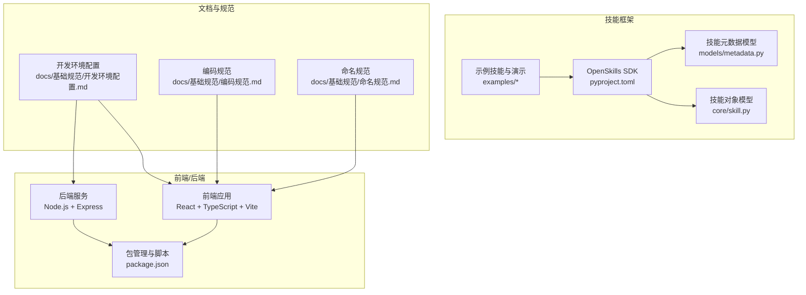
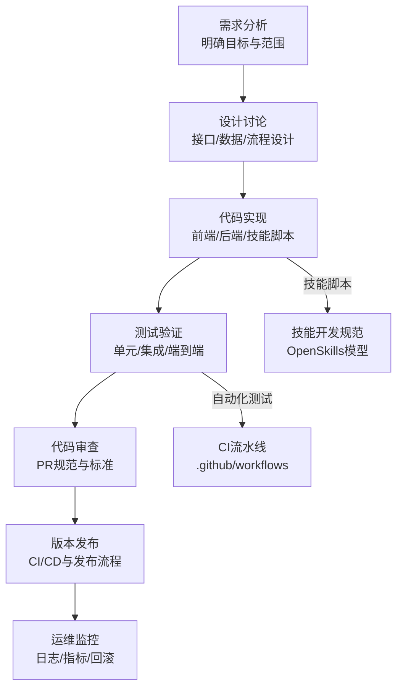
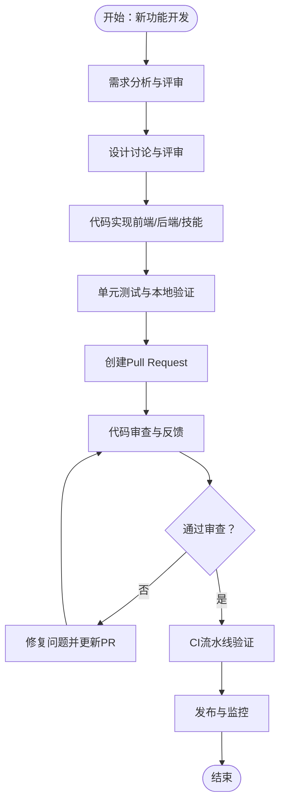
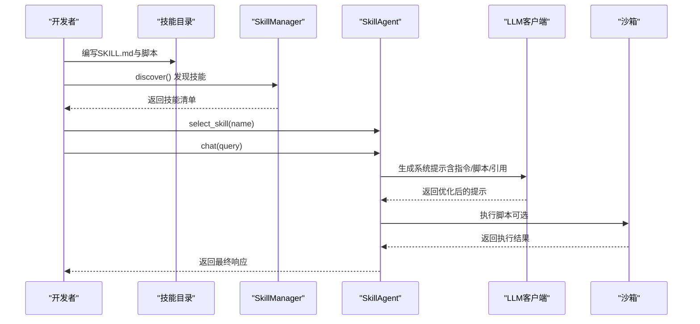
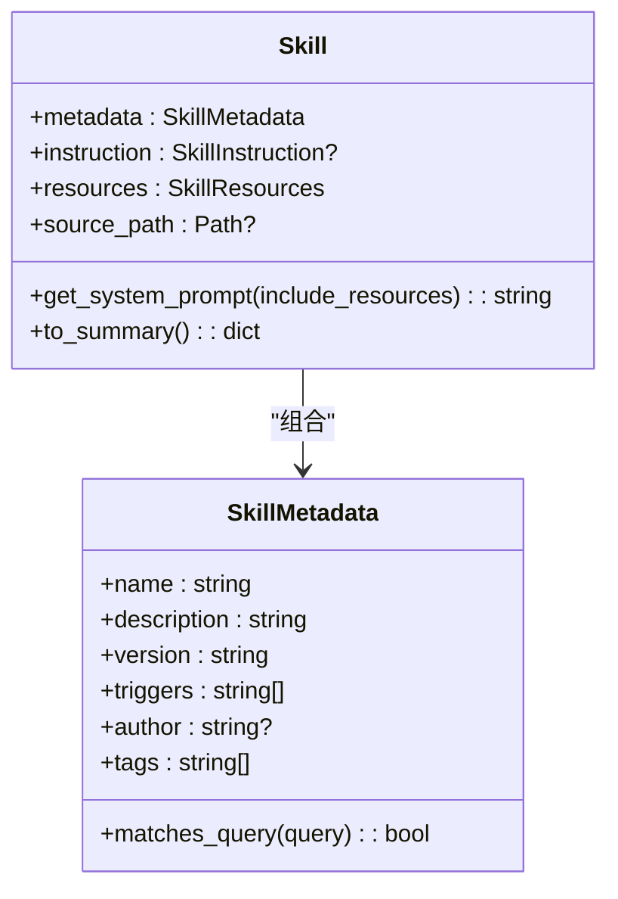
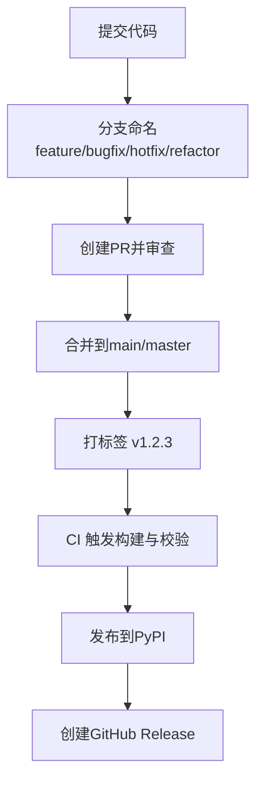
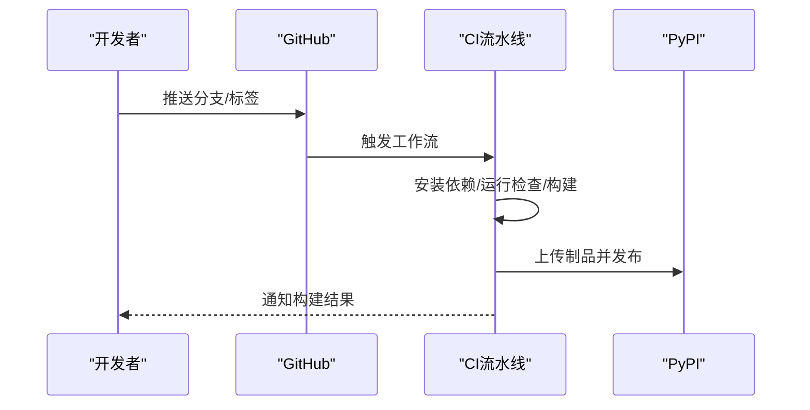
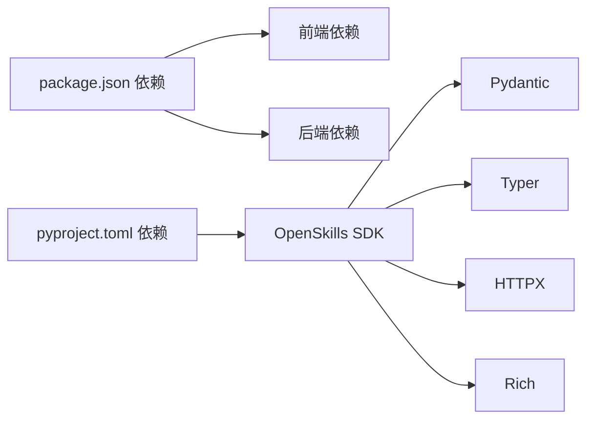

# 开发流程

<cite>
**本文引用的文件**   
- [package.json](file://package.json)
- [开发环境配置.md](file://docs/基础规范/开发环境配置.md)
- [编码规范.md](file://docs/基础规范/编码规范.md)
- [命名规范.md](file://docs/基础规范/命名规范.md)
- [pyproject.toml](file://OpenSkills-main/pyproject.toml)
- [ci.yml](file://OpenSkills-main/.github/workflows/ci.yml)
- [publish.yml](file://OpenSkills-main/.github/workflows/publish.yml)
- [metadata.py](file://OpenSkills-main/openskills/models/metadata.py)
- [skill.py](file://OpenSkills-main/openskills/core/skill.py)
- [demo.py](file://OpenSkills-main/examples/demo.py)
- [SKILL.md](file://OpenSkills-main/examples/prompt-optimizer/SKILL.md)
</cite>

## 目录
1. [简介](#简介)
2. [项目结构](#项目结构)
3. [核心组件](#核心组件)
4. [架构总览](#架构总览)
5. [详细组件分析](#详细组件分析)
6. [依赖分析](#依赖分析)
7. [性能考量](#性能考量)
8. [故障排查指南](#故障排查指南)
9. [结论](#结论)
10. [附录](#附录)

## 简介
本文件面向AutoMate项目，旨在建立标准化的开发流程体系，覆盖新功能开发、技能扩展开发、插件开发规范、代码审查、版本控制与发布、持续集成以及团队协作规范。内容基于仓库现有文档与代码结构提炼，并结合AutoMate前端、后端与OpenSkills技能框架的实际实现，形成可落地的流程与规范。

## 项目结构
AutoMate采用前后端分离与技能框架并行的组织方式：
- 前端与后端：基于Vite/React/TypeScript与Node.js/Express，通过package.json统一脚本与依赖管理。
- 技能框架（OpenSkills）：提供技能的三层渐进披露模型（元数据/指令/资源），配合示例技能与CLI工具，支撑技能的编写、发现、匹配与执行。
- 文档与规范：集中于docs/基础规范，涵盖开发环境、编码与命名规范，指导日常开发与协作。

图表来源
- [package.json](file://package.json#L1-L47)
- [pyproject.toml](file://OpenSkills-main/pyproject.toml#L1-L75)
- [metadata.py](file://OpenSkills-main/openskills/models/metadata.py#L1-L83)
- [skill.py](file://OpenSkills-main/openskills/core/skill.py#L1-L150)
- [开发环境配置.md](file://docs/基础规范/开发环境配置.md#L1-L243)
- [编码规范.md](file://docs/基础规范/编码规范.md#L1-L740)
- [命名规范.md](file://docs/基础规范/命名规范.md#L1-L370)

章节来源
- [package.json](file://package.json#L1-L47)
- [开发环境配置.md](file://docs/基础规范/开发环境配置.md#L1-L243)
- [编码规范.md](file://docs/基础规范/编码规范.md#L1-L740)
- [命名规范.md](file://docs/基础规范/命名规范.md#L1-L370)

## 核心组件
- 前端/后端：统一由package.json管理开发脚本（dev/build/preview/lint/typecheck/backend/start），支持并发启动前端与后端服务，便于本地联调。
- 技能框架：OpenSkills通过pyproject.toml定义Python包、依赖与构建配置；提供技能三层模型（metadata/instruction/resources），支持按需加载与渐进披露。
- 示例与演示：examples目录包含多类技能示例（如prompt-optimizer），并通过demo.py展示自动发现、LLM智能选择与沙箱执行流程。

章节来源
- [package.json](file://package.json#L6-L13)
- [pyproject.toml](file://OpenSkills-main/pyproject.toml#L1-L75)
- [metadata.py](file://OpenSkills-main/openskills/models/metadata.py#L11-L83)
- [skill.py](file://OpenSkills-main/openskills/core/skill.py#L19-L150)
- [demo.py](file://OpenSkills-main/examples/demo.py#L1-L290)

## 架构总览
AutoMate的开发流程围绕“需求—设计—实现—测试—发布—运维”闭环展开，技能框架贯穿其中，提供可插拔的能力扩展点。

## 详细组件分析

### 新功能开发流程（需求—设计—实现）
- 需求分析：明确功能边界、用户场景、性能与安全要求，产出需求文档与原型图。
- 设计讨论：确定前端组件结构、后端接口与数据模型，统一命名与编码规范。
- 实现阶段：
  - 前端：遵循编码规范与命名规范，使用React/TypeScript组件化开发，配合TypeScript类型检查与ESLint。
  - 后端：基于Express/Node.js，统一错误处理与日志记录，保证接口健壮性。
  - 技能扩展：若涉及智能体能力，参考OpenSkills技能模型，编写SKILL.md与脚本，确保触发词、指令与资源清晰。
- 测试验证：单元测试与集成测试覆盖关键路径，确保变更不破坏既有功能。
- 代码审查：遵循PR规范与审查清单，重点检查命名、类型、错误处理、性能与可维护性。
- 发布与监控：通过CI/CD完成构建与发布，上线后观察日志与指标，必要时回滚。

### 技能扩展开发流程（脚本—测试—集成）
- 技能脚本编写：参考OpenSkills技能模型，SKILL.md中定义元数据、触发词、指令与资源；脚本放置于scripts目录，遵循命名与职责单一原则。
- 测试验证：使用示例技能（如prompt-optimizer）与demo.py进行端到端验证，覆盖自动发现、LLM智能选择与沙箱执行。
- 集成部署：通过OpenSkills CLI或SDK集成到Agent系统，确保资源路径解析与脚本执行上下文正确。

图表来源
- [demo.py](file://OpenSkills-main/examples/demo.py#L37-L145)
- [skill.py](file://OpenSkills-main/openskills/core/skill.py#L103-L133)
- [SKILL.md](file://OpenSkills-main/examples/prompt-optimizer/SKILL.md#L1-L131)

章节来源
- [metadata.py](file://OpenSkills-main/openskills/models/metadata.py#L11-L83)
- [skill.py](file://OpenSkills-main/openskills/core/skill.py#L19-L150)
- [demo.py](file://OpenSkills-main/examples/demo.py#L1-L290)
- [SKILL.md](file://OpenSkills-main/examples/prompt-optimizer/SKILL.md#L1-L131)

### 插件开发规范（接口定义—依赖管理—兼容性）
- 接口定义：前端组件与后端接口均应遵循统一命名与类型约束，避免隐式依赖与类型漂移。
- 依赖管理：前端通过package.json统一管理依赖与脚本；技能框架通过pyproject.toml定义Python包与可选依赖，确保可移植性与可构建性。
- 兼容性保证：技能脚本与资源路径解析遵循OpenSkills的基路径策略，避免硬编码相对路径；同时在不同运行环境下（本地/沙箱/生产）验证路径与权限。

图表来源
- [metadata.py](file://OpenSkills-main/openskills/models/metadata.py#L11-L83)
- [skill.py](file://OpenSkills-main/openskills/core/skill.py#L19-L150)

章节来源
- [pyproject.toml](file://OpenSkills-main/pyproject.toml#L22-L38)
- [skill.py](file://OpenSkills-main/openskills/core/skill.py#L83-L101)

### 代码审查流程（PR规范—审查标准—合并策略）
- Pull Request规范：使用语义化提交信息与分支命名，确保变更可追溯；PR描述包含需求背景、改动范围与测试要点。
- 审查标准：遵循编码规范与命名规范，重点检查类型注解、错误处理、日志记录、性能与可维护性；单元测试覆盖率与ESLint通过率。
- 合并策略：至少一名维护者批准；阻塞式CI检查通过后方可合并；紧急修复走hotfix分支并快速回归测试。

章节来源
- [编码规范.md](file://docs/基础规范/编码规范.md#L714-L728)
- [命名规范.md](file://docs/基础规范/命名规范.md#L296-L329)

### 版本控制策略（分支—标签—发布）
- 分支管理：feature/*（新功能）、bugfix/*（缺陷修复）、hotfix/*（紧急修复）、refactor/*（重构）。
- 标签管理：语义化版本（SemVer），以vX.Y.Z命名；发布时创建对应标签并触发发布工作流。
- 发布流程：GitHub Actions在推送标签时自动构建、校验并发布至PyPI，同时创建GitHub Release并附带安装说明与变更摘要。

图表来源
- [命名规范.md](file://docs/基础规范/命名规范.md#L308-L329)
- [publish.yml](file://OpenSkills-main/.github/workflows/publish.yml#L1-L99)

章节来源
- [命名规范.md](file://docs/基础规范/命名规范.md#L308-L329)
- [publish.yml](file://OpenSkills-main/.github/workflows/publish.yml#L1-L99)

### 持续集成配置（自动化测试—构建—部署）
- 前端：ESLint与TypeScript类型检查在本地与CI中执行，确保代码质量与类型安全。
- 技能框架：Ruff用于Python代码风格与格式检查；Pytest用于测试；构建与发布通过Hatch与Twine完成。
- 发布：GitHub Actions在推送标签时自动构建wheel与sdist，上传制品并发布到PyPI，同时生成Release说明。

图表来源
- [ci.yml](file://OpenSkills-main/.github/workflows/ci.yml#L1-L32)
- [publish.yml](file://OpenSkills-main/.github/workflows/publish.yml#L1-L99)

章节来源
- [package.json](file://package.json#L10-L12)
- [ci.yml](file://OpenSkills-main/.github/workflows/ci.yml#L10-L31)
- [publish.yml](file://OpenSkills-main/.github/workflows/publish.yml#L8-L55)

### 团队协作规范（沟通—任务—进度）
- 沟通机制：每日站会同步进展与阻塞项；使用Issue与PR进行需求与变更追踪。
- 任务分配：按功能域划分任务，明确负责人与截止时间；复杂任务拆分为子任务并关联Issue。
- 进度跟踪：使用项目看板（如ZenHub/GitHub Projects）可视化任务状态；定期回顾迭代计划与交付物。

## 依赖分析
- 前端依赖：React、React Router、Zustand、Axios、Tailwind CSS等；TypeScript与ESLint保障类型安全与代码风格。
- 后端依赖：Express、CORS、SQL.js（浏览器端数据库）等；Node.js脚本统一管理开发与构建。
- 技能框架依赖：Pydantic、Typer、HTTPX、Rich等；可选dev依赖（pytest、ruff）用于测试与代码检查。

图表来源
- [package.json](file://package.json#L15-L27)
- [pyproject.toml](file://OpenSkills-main/pyproject.toml#L22-L28)

章节来源
- [package.json](file://package.json#L15-L27)
- [pyproject.toml](file://OpenSkills-main/pyproject.toml#L22-L38)

## 性能考量
- 前端性能：合理使用React.memo/useCallback/useMemo避免不必要重渲染；Tailwind CSS按需引入，减少打包体积。
- 后端性能：接口幂等与缓存策略、数据库查询优化与连接池管理；对长耗时操作采用异步处理与超时控制。
- 技能框架性能：利用OpenSkills的三层渐进披露，仅在需要时加载指令与资源，降低内存与IO开销。

## 故障排查指南
- 开发环境问题：确认服务器在项目根目录启动，使用绝对路径访问资源；检查端口占用与权限。
- 配置文件加载失败：核对agents.json格式与必填字段；检查fetch请求与CORS设置。
- 代码质量问题：运行ESLint与TypeScript类型检查；修复命名与类型不一致问题。
- CI失败：检查Ruff格式与风格检查、Pytest测试用例与构建产物；根据日志定位具体步骤。

章节来源
- [开发环境配置.md](file://docs/基础规范/开发环境配置.md#L178-L224)
- [编码规范.md](file://docs/基础规范/编码规范.md#L687-L728)

## 结论
通过标准化的开发流程与规范，AutoMate能够在保证质量与可维护性的前提下，高效推进新功能与技能扩展的开发。建议在团队内推广上述流程，并结合实际项目迭代持续优化。

## 附录
- 前端开发脚本与依赖参考：[package.json](file://package.json#L6-L13)
- 技能框架构建与发布参考：[pyproject.toml](file://OpenSkills-main/pyproject.toml#L49-L75)，[publish.yml](file://OpenSkills-main/.github/workflows/publish.yml#L8-L55)
- 技能模型与示例参考：[metadata.py](file://OpenSkills-main/openskills/models/metadata.py#L11-L83)，[skill.py](file://OpenSkills-main/openskills/core/skill.py#L19-L150)，[demo.py](file://OpenSkills-main/examples/demo.py#L37-L145)，[SKILL.md](file://OpenSkills-main/examples/prompt-optimizer/SKILL.md#L1-L131)