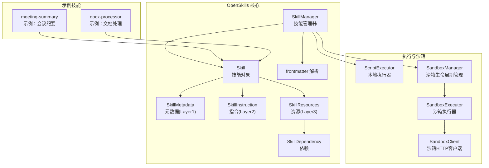
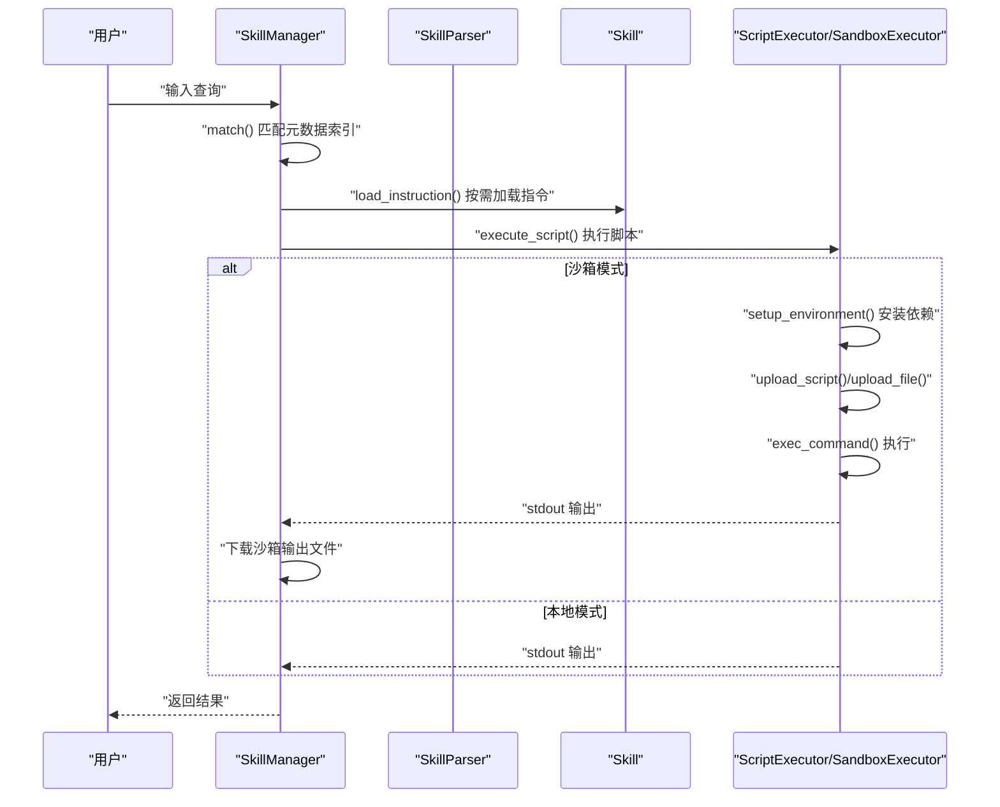
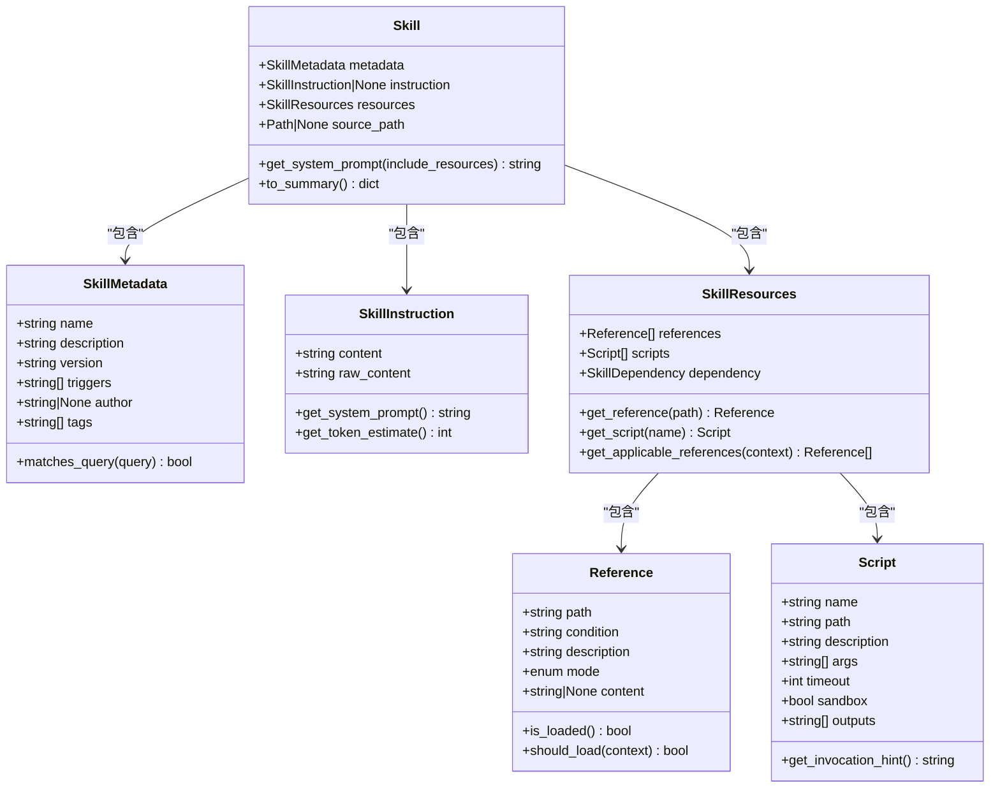
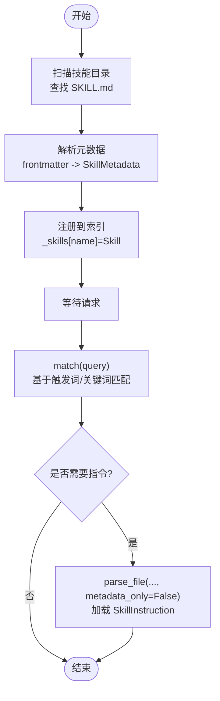
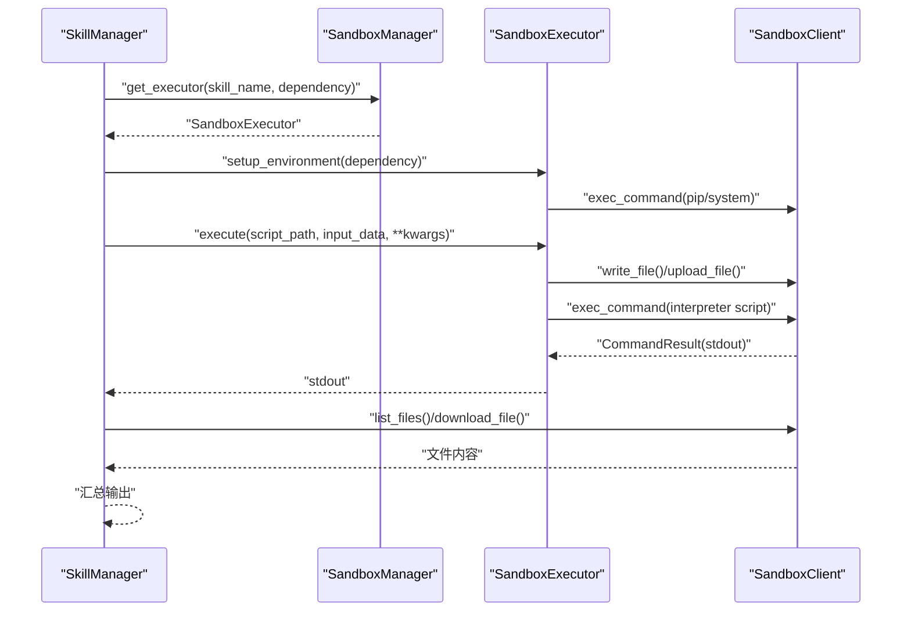
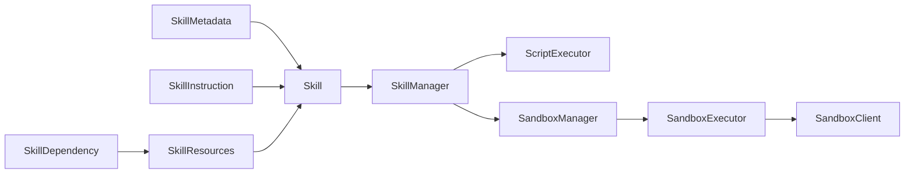

# 技能扩展开发

<cite>
**本文引用的文件**
- [metadata.py](file://OpenSkills-main/openskills/models/metadata.py)
- [instruction.py](file://OpenSkills-main/openskills/models/instruction.py)
- [resource.py](file://OpenSkills-main/openskills/models/resource.py)
- [dependency.py](file://OpenSkills-main/openskills/models/dependency.py)
- [skill.py](file://OpenSkills-main/openskills/core/skill.py)
- [manager.py](file://OpenSkills-main/openskills/core/manager.py)
- [frontmatter.py](file://OpenSkills-main/openskills/utils/frontmatter.py)
- [client.py](file://OpenSkills-main/openskills/sandbox/client.py)
- [executor.py](file://OpenSkills-main/openskills/sandbox/executor.py)
- [manager.py](file://OpenSkills-main/openskills/sandbox/manager.py)
- [upload.py](file://OpenSkills-main/examples/meeting-summary/scripts/upload.py)
- [SKILL.md](file://OpenSkills-main/examples/meeting-summary/SKILL.md)
- [read_docx.py](file://OpenSkills-main/examples/office-skills/docx-processor/scripts/read_docx.py)
- [convert_docx.py](file://OpenSkills-main/examples/office-skills/docx-processor/scripts/convert_docx.py)
- [SKILL.md](file://OpenSkills-main/examples/office-skills/docx-processor/SKILL.md)
</cite>

## 目录
1. [简介](#简介)
2. [项目结构](#项目结构)
3. [核心组件](#核心组件)
4. [架构总览](#架构总览)
5. [详细组件分析](#详细组件分析)
6. [依赖关系分析](#依赖关系分析)
7. [性能考虑](#性能考虑)
8. [故障排查指南](#故障排查指南)
9. [结论](#结论)
10. [附录](#附录)

## 简介
本指南面向希望在 AutoMate 平台中开发“技能扩展”的工程师与产品人员，系统讲解如何编写符合规范的技能脚本、完成 SKILL.md 配置与元数据管理、进行测试与性能优化，并解释与 OpenSkills 框架的集成方式与扩展机制。文档以仓库中的实际实现为依据，提供可操作的开发模板、最佳实践与可视化图示。

## 项目结构
AutoMate 的技能扩展能力由 OpenSkills 子项目提供，核心围绕三层模型（元数据、指令、资源）与执行器（本地/沙箱）展开；示例技能展示了标准目录结构与脚本调用模式。

图表来源
- [manager.py](file://OpenSkills-main/openskills/core/manager.py#L24-L110)
- [skill.py](file://OpenSkills-main/openskills/core/skill.py#L19-L56)
- [metadata.py](file://OpenSkills-main/openskills/models/metadata.py#L11-L82)
- [instruction.py](file://OpenSkills-main/openskills/models/instruction.py#L11-L47)
- [resource.py](file://OpenSkills-main/openskills/models/resource.py#L180-L203)
- [dependency.py](file://OpenSkills-main/openskills/models/dependency.py#L13-L86)
- [frontmatter.py](file://OpenSkills-main/openskills/utils/frontmatter.py#L19-L65)
- [executor.py](file://OpenSkills-main/openskills/sandbox/executor.py#L22-L108)
- [client.py](file://OpenSkills-main/openskills/sandbox/client.py#L119-L158)
- [manager.py](file://OpenSkills-main/openskills/sandbox/manager.py#L30-L88)

章节来源
- [manager.py](file://OpenSkills-main/openskills/core/manager.py#L24-L110)
- [skill.py](file://OpenSkills-main/openskills/core/skill.py#L19-L56)
- [metadata.py](file://OpenSkills-main/openskills/models/metadata.py#L11-L82)
- [instruction.py](file://OpenSkills-main/openskills/models/instruction.py#L11-L47)
- [resource.py](file://OpenSkills-main/openskills/models/resource.py#L180-L203)
- [dependency.py](file://OpenSkills-main/openskills/models/dependency.py#L13-L86)
- [frontmatter.py](file://OpenSkills-main/openskills/utils/frontmatter.py#L19-L65)
- [executor.py](file://OpenSkills-main/openskills/sandbox/executor.py#L22-L108)
- [client.py](file://OpenSkills-main/openskills/sandbox/client.py#L119-L158)
- [manager.py](file://OpenSkills-main/openskills/sandbox/manager.py#L30-L88)

## 核心组件
- 元数据层（Layer 1）：轻量信息，用于技能发现与匹配，始终加载。包含名称、描述、版本、触发词、作者、标签等字段，并提供基于查询的匹配逻辑。
- 指令层（Layer 2）：按需加载的技能说明正文，作为系统提示注入给大模型，包含技能目标、流程、输出格式与注意事项等。
- 资源层（Layer 3）：条件加载的参考资料与可执行脚本，包含引用文档、脚本参数、超时、沙箱开关与输出同步路径等。
- 依赖层：定义 Python 包与系统命令，用于安装与初始化环境。
- 技能对象：整合三层信息，提供系统提示拼装、摘要导出等能力。
- 管理器：负责扫描、注册、匹配、按需加载与执行脚本；支持本地执行与沙箱执行两种模式。
- 沙箱执行链：通过 SandboxManager/SandboxExecutor/SandboxClient 实现环境准备、脚本上传、命令执行与结果回传。

章节来源
- [metadata.py](file://OpenSkills-main/openskills/models/metadata.py#L11-L82)
- [instruction.py](file://OpenSkills-main/openskills/models/instruction.py#L11-L47)
- [resource.py](file://OpenSkills-main/openskills/models/resource.py#L45-L203)
- [dependency.py](file://OpenSkills-main/openskills/models/dependency.py#L13-L86)
- [skill.py](file://OpenSkills-main/openskills/core/skill.py#L19-L150)
- [manager.py](file://OpenSkills-main/openskills/core/manager.py#L24-L110)
- [executor.py](file://OpenSkills-main/openskills/sandbox/executor.py#L22-L108)
- [client.py](file://OpenSkills-main/openskills/sandbox/client.py#L119-L158)
- [manager.py](file://OpenSkills-main/openskills/sandbox/manager.py#L30-L88)

## 架构总览
下图展示从用户输入到技能执行与结果回传的关键流程，涵盖本地与沙箱两种执行路径。

图表来源
- [manager.py](file://OpenSkills-main/openskills/core/manager.py#L265-L360)
- [executor.py](file://OpenSkills-main/openskills/sandbox/executor.py#L255-L354)
- [client.py](file://OpenSkills-main/openskills/sandbox/client.py#L264-L324)

章节来源
- [manager.py](file://OpenSkills-main/openskills/core/manager.py#L265-L360)
- [executor.py](file://OpenSkills-main/openskills/sandbox/executor.py#L255-L354)
- [client.py](file://OpenSkills-main/openskills/sandbox/client.py#L264-L324)

## 详细组件分析

### 组件A：技能对象与三层模型
技能对象整合元数据、指令与资源，提供系统提示拼装与摘要导出。资源层包含引用与脚本两类条目，支持条件加载与脚本调用提示生成。

图表来源
- [metadata.py](file://OpenSkills-main/openskills/models/metadata.py#L11-L82)
- [instruction.py](file://OpenSkills-main/openskills/models/instruction.py#L11-L47)
- [resource.py](file://OpenSkills-main/openskills/models/resource.py#L45-L203)
- [skill.py](file://OpenSkills-main/openskills/core/skill.py#L19-L150)

章节来源
- [metadata.py](file://OpenSkills-main/openskills/models/metadata.py#L11-L82)
- [instruction.py](file://OpenSkills-main/openskills/models/instruction.py#L11-L47)
- [resource.py](file://OpenSkills-main/openskills/models/resource.py#L45-L203)
- [skill.py](file://OpenSkills-main/openskills/core/skill.py#L19-L150)

### 组件B：技能注册与匹配流程
技能注册采用渐进披露策略：仅在发现阶段加载元数据；按需加载指令与资源；匹配阶段基于元数据与触发词进行检索。

图表来源
- [manager.py](file://OpenSkills-main/openskills/core/manager.py#L116-L176)
- [frontmatter.py](file://OpenSkills-main/openskills/utils/frontmatter.py#L19-L65)
- [metadata.py](file://OpenSkills-main/openskills/models/metadata.py#L55-L82)

章节来源
- [manager.py](file://OpenSkills-main/openskills/core/manager.py#L116-L176)
- [frontmatter.py](file://OpenSkills-main/openskills/utils/frontmatter.py#L19-L65)
- [metadata.py](file://OpenSkills-main/openskills/models/metadata.py#L55-L82)

### 组件C：脚本执行与沙箱集成
脚本执行支持本地与沙箱两种模式。沙箱模式下，先安装依赖、上传脚本与输入文件，再执行并回传输出文件。

图表来源
- [manager.py](file://OpenSkills-main/openskills/core/manager.py#L319-L360)
- [manager.py](file://OpenSkills-main/openskills/sandbox/manager.py#L89-L147)
- [executor.py](file://OpenSkills-main/openskills/sandbox/executor.py#L123-L171)
- [executor.py](file://OpenSkills-main/openskills/sandbox/executor.py#L255-L354)
- [client.py](file://OpenSkills-main/openskills/sandbox/client.py#L487-L531)
- [client.py](file://OpenSkills-main/openskills/sandbox/client.py#L665-L712)

章节来源
- [manager.py](file://OpenSkills-main/openskills/core/manager.py#L319-L360)
- [manager.py](file://OpenSkills-main/openskills/sandbox/manager.py#L89-L147)
- [executor.py](file://OpenSkills-main/openskills/sandbox/executor.py#L123-L171)
- [executor.py](file://OpenSkills-main/openskills/sandbox/executor.py#L255-L354)
- [client.py](file://OpenSkills-main/openskills/sandbox/client.py#L487-L531)
- [client.py](file://OpenSkills-main/openskills/sandbox/client.py#L665-L712)

### 组件D：示例技能与脚本规范
- 会议纪要技能：演示了依赖声明、引用条件与脚本调用；脚本通过 stdin 接收 JSON 输入，返回结构化结果。
- 文档处理技能：包含读取与转换两个脚本，展示参数传递、错误处理与输出文件生成。

章节来源
- [SKILL.md](file://OpenSkills-main/examples/meeting-summary/SKILL.md#L1-L82)
- [upload.py](file://OpenSkills-main/examples/meeting-summary/scripts/upload.py#L15-L48)
- [SKILL.md](file://OpenSkills-main/examples/office-skills/docx-processor/SKILL.md#L1-L74)
- [read_docx.py](file://OpenSkills-main/examples/office-skills/docx-processor/scripts/read_docx.py#L37-L104)
- [convert_docx.py](file://OpenSkills-main/examples/office-skills/docx-processor/scripts/convert_docx.py#L62-L125)

## 依赖关系分析
- 模型层之间为组合关系：Skill 组合 SkillMetadata、SkillInstruction、SkillResources；Resource 组合 Reference、Script；Resource 还包含 SkillDependency。
- 管理器依赖解析器、匹配器与执行器；在沙箱模式下依赖 SandboxManager/SandboxExecutor/SandboxClient。
- 示例技能通过 SKILL.md 声明依赖与资源，脚本遵循 stdin/stdout 协议与 JSON 参数约定。

图表来源
- [skill.py](file://OpenSkills-main/openskills/core/skill.py#L19-L56)
- [resource.py](file://OpenSkills-main/openskills/models/resource.py#L180-L203)
- [dependency.py](file://OpenSkills-main/openskills/models/dependency.py#L13-L86)
- [manager.py](file://OpenSkills-main/openskills/core/manager.py#L24-L110)
- [executor.py](file://OpenSkills-main/openskills/sandbox/executor.py#L22-L108)
- [client.py](file://OpenSkills-main/openskills/sandbox/client.py#L119-L158)
- [manager.py](file://OpenSkills-main/openskills/sandbox/manager.py#L30-L88)

章节来源
- [skill.py](file://OpenSkills-main/openskills/core/skill.py#L19-L56)
- [resource.py](file://OpenSkills-main/openskills/models/resource.py#L180-L203)
- [dependency.py](file://OpenSkills-main/openskills/models/dependency.py#L13-L86)
- [manager.py](file://OpenSkills-main/openskills/core/manager.py#L24-L110)
- [executor.py](file://OpenSkills-main/openskills/sandbox/executor.py#L22-L108)
- [client.py](file://OpenSkills-main/openskills/sandbox/client.py#L119-L158)
- [manager.py](file://OpenSkills-main/openskills/sandbox/manager.py#L30-L88)

## 性能考虑
- 渐进披露：仅在发现阶段加载元数据，按需加载指令与资源，降低内存占用与启动延迟。
- 沙箱策略：支持按执行、按技能或持久化三种策略复用执行器，平衡安全性与性能。
- 令牌估算：指令层提供粗略令牌估算，便于控制上下文长度。
- I/O 优化：批量上传/下载文件、限制输出大小与列表数量，避免过度消耗带宽与磁盘。

章节来源
- [instruction.py](file://OpenSkills-main/openskills/models/instruction.py#L38-L47)
- [manager.py](file://OpenSkills-main/openskills/sandbox/manager.py#L17-L28)
- [manager.py](file://OpenSkills-main/openskills/core/manager.py#L362-L493)

## 故障排查指南
- 连接问题：沙箱健康检查失败或连接异常时，确认服务地址与网络可达性。
- 权限与路径：脚本/文件权限不足或路径不存在会导致执行失败，检查工作目录与上传路径。
- 超时与资源：设置合理的超时与资源限制，避免长时间阻塞。
- 日志定位：使用沙箱日志器输出进度与状态，结合异常类定位具体环节。

章节来源
- [client.py](file://OpenSkills-main/openskills/sandbox/client.py#L203-L218)
- [client.py](file://OpenSkills-main/openskills/sandbox/client.py#L532-L567)
- [executor.py](file://OpenSkills-main/openskills/sandbox/executor.py#L118-L121)
- [executor.py](file://OpenSkills-main/openskills/sandbox/executor.py#L318-L330)

## 结论
通过三层模型与渐进披露机制，AutoMate 的技能扩展具备良好的可发现性、可维护性与可扩展性。结合本地与沙箱执行模式，既能满足快速迭代，又能保障运行安全。建议开发者严格遵循 SKILL.md 规范、脚本参数与返回格式约定，并充分利用依赖声明与资源条件加载，提升技能质量与用户体验。

## 附录

### A. 技能脚本编写规范（Python）
- 输入：通过标准输入接收 JSON 字符串；若非 JSON 则视为纯文本内容。
- 参数：脚本 args 列表定义期望参数；调用时通过 stdin 或 kwargs 注入。
- 返回：统一输出 JSON 字符串，包含状态、消息、路径、大小、时间戳等字段，便于上层解析与展示。
- 错误处理：捕获异常并返回错误信息；必要时给出安装依赖的指引。
- 资源管理：输出文件写入沙箱临时目录，避免硬编码绝对路径。

章节来源
- [upload.py](file://OpenSkills-main/examples/meeting-summary/scripts/upload.py#L15-L48)
- [read_docx.py](file://OpenSkills-main/examples/office-skills/docx-processor/scripts/read_docx.py#L37-L104)
- [convert_docx.py](file://OpenSkills-main/examples/office-skills/docx-processor/scripts/convert_docx.py#L62-L125)

### B. SKILL.md 配置与元数据管理
- 必填字段：name、description、version、triggers、tags。
- 依赖声明：python 与 system 两部分，分别对应包安装与系统命令。
- 引用与脚本：references 支持条件加载；scripts 定义脚本路径、参数、超时与输出同步。
- 前言解析：使用 YAML frontmatter 解析工具读取与生成元数据。

章节来源
- [SKILL.md](file://OpenSkills-main/examples/meeting-summary/SKILL.md#L1-L82)
- [SKILL.md](file://OpenSkills-main/examples/office-skills/docx-processor/SKILL.md#L1-L74)
- [dependency.py](file://OpenSkills-main/openskills/models/dependency.py#L13-L86)
- [resource.py](file://OpenSkills-main/openskills/models/resource.py#L45-L203)
- [frontmatter.py](file://OpenSkills-main/openskills/utils/frontmatter.py#L19-L81)

### C. 测试方法与建议
- 单元测试：针对脚本的输入解析、参数校验与错误分支进行断言。
- 集成测试：在沙箱模式下模拟完整执行链路，覆盖依赖安装、文件上传/下载与输出回传。
- 性能测试：测量不同策略下的冷启动与执行耗时，评估缓存命中率与资源占用。

[本节为通用指导，不直接分析具体文件]

### D. 开发模板与最佳实践
- 目录结构：每个技能独立目录，包含 SKILL.md、references/ 与 scripts/。
- 参数与返回：严格遵循 JSON 协议；对敏感信息进行脱敏处理。
- 日志记录：使用沙箱日志器输出关键步骤，便于排障。
- 资源管理：限制输出文件大小与数量；清理临时文件。

章节来源
- [resource.py](file://OpenSkills-main/openskills/models/resource.py#L7-L16)
- [executor.py](file://OpenSkills-main/openskills/sandbox/executor.py#L318-L330)

### E. 与 OpenSkills 框架的集成方式
- 通过 SkillManager 发现与注册技能，按需加载指令与资源。
- 在沙箱模式下，SandboxManager 管理执行器生命周期，SandboxExecutor 完成依赖安装与脚本执行。
- 通过 get_system_prompt 汇总指令与可用动作，注入到大模型系统提示中。

章节来源
- [manager.py](file://OpenSkills-main/openskills/core/manager.py#L24-L110)
- [manager.py](file://OpenSkills-main/openskills/core/manager.py#L319-L360)
- [skill.py](file://OpenSkills-main/openskills/core/skill.py#L103-L132)
- [manager.py](file://OpenSkills-main/openskills/sandbox/manager.py#L30-L88)
- [executor.py](file://OpenSkills-main/openskills/sandbox/executor.py#L123-L171)