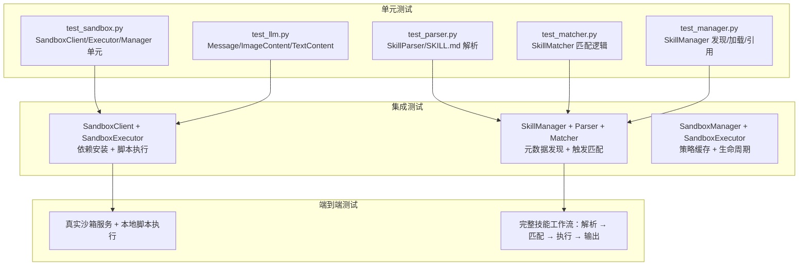
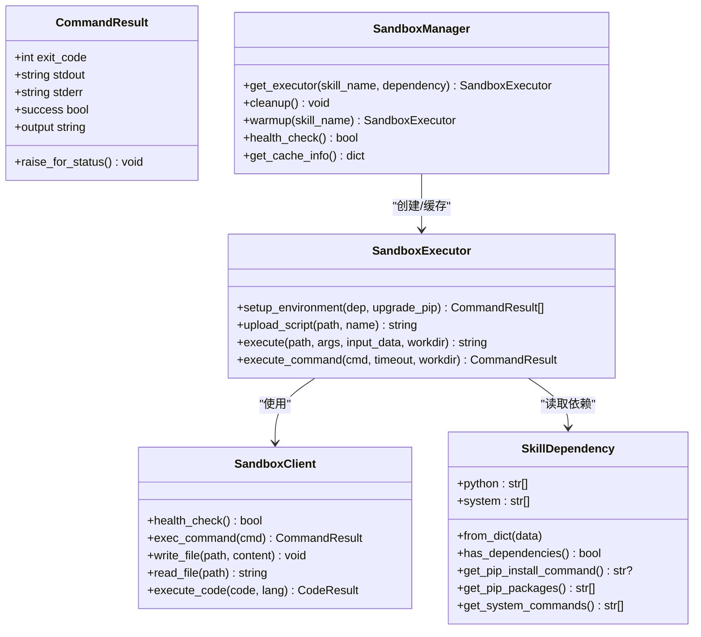
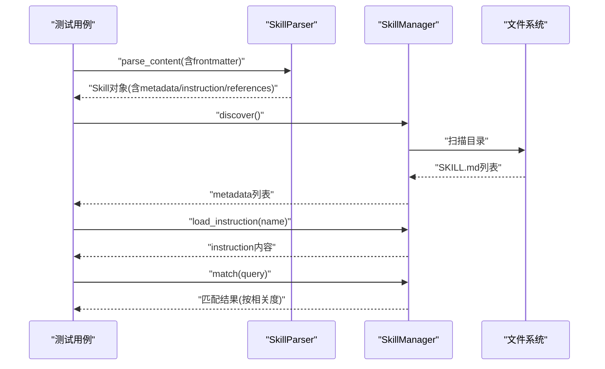
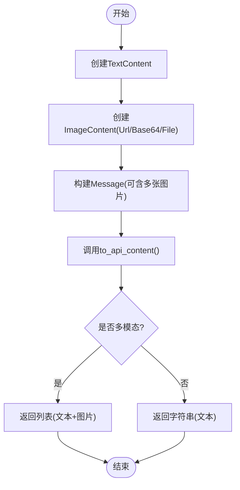
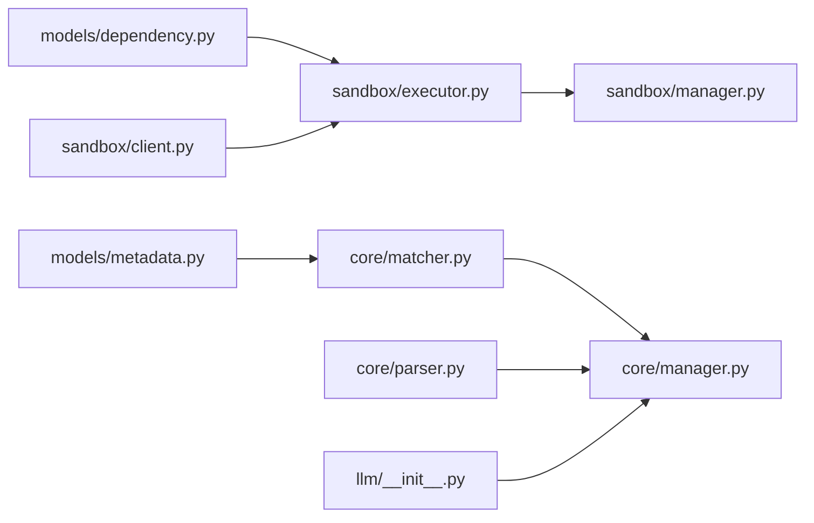

# 技能测试验证

<cite>
**本文引用的文件**
- [OpenSkills-main/pyproject.toml](file://OpenSkills-main/pyproject.toml)
- [OpenSkills-main/.github/workflows/ci.yml](file://OpenSkills-main/.github/workflows/ci.yml)
- [OpenSkills-main/tests/test_sandbox.py](file://OpenSkills-main/tests/test_sandbox.py)
- [OpenSkills-main/tests/test_manager.py](file://OpenSkills-main/tests/test_manager.py)
- [OpenSkills-main/tests/test_matcher.py](file://OpenSkills-main/tests/test_matcher.py)
- [OpenSkills-main/tests/test_parser.py](file://OpenSkills-main/tests/test_parser.py)
- [OpenSkills-main/tests/test_llm.py](file://OpenSkills-main/tests/test_llm.py)
- [OpenSkills-main/openskills/sandbox/__init__.py](file://OpenSkills-main/openskills/sandbox/__init__.py)
- [OpenSkills-main/openskills/core/__init__.py](file://OpenSkills-main/openskills/core/__init__.py)
- [OpenSkills-main/openskills/llm/__init__.py](file://OpenSkills-main/openskills/llm/__init__.py)
- [OpenSkills-main/openskills/models/metadata.py](file://OpenSkills-main/openskills/models/metadata.py)
- [OpenSkills-main/openskills/models/dependency.py](file://OpenSkills-main/openskills/models/dependency.py)
- [OpenSkills-main/openskills/sandbox/client.py](file://OpenSkills-main/openskills/sandbox/client.py)
- [OpenSkills-main/openskills/sandbox/executor.py](file://OpenSkills-main/openskills/sandbox/executor.py)
- [OpenSkills-main/openskills/sandbox/manager.py](file://OpenSkills-main/openskills/sandbox/manager.py)
</cite>

## 目录
1. [引言](#引言)
2. [项目结构](#项目结构)
3. [核心组件](#核心组件)
4. [架构总览](#架构总览)
5. [详细组件分析](#详细组件分析)
6. [依赖关系分析](#依赖关系分析)
7. [性能考虑](#性能考虑)
8. [故障排查指南](#故障排查指南)
9. [结论](#结论)
10. [附录](#附录)

## 引言
本指南面向AutoMate项目中的“技能测试验证”，系统化阐述从单元测试到集成测试再到端到端测试的分层验证策略，并结合现有测试用例与核心实现，给出pytest配置、测试用例设计、模拟对象创建、行为验证方法（输入输出、边界条件、异常处理）、测试自动化流程（CI、覆盖率与性能基准）以及最佳实践与调试技巧。目标是帮助开发者在不深入源码的前提下，也能高效地为技能系统编写与维护高质量测试。

## 项目结构
AutoMate仓库包含两套主要体系：前端与后端；同时在OpenSkills子项目中提供了技能框架与测试用例。与“技能测试验证”直接相关的核心位置如下：
- 测试层：OpenSkills-main/tests 下的各模块测试文件，覆盖sandbox、core、llm等模块
- 核心实现：openskills 子包下的模型、执行器、沙箱客户端与管理器
- 工程配置：pyproject.toml定义pytest配置与依赖；.github/workflows/ci.yml定义CI任务

```mermaid
graph TB
A["OpenSkills-main/tests"] --> A1["test_sandbox.py"]
A --> A2["test_manager.py"]
A --> A3["test_matcher.py"]
A --> A4["test_parser.py"]
A --> A5["test_llm.py"]
B["openskills 核心模块"] --> B1["models/metadata.py"]
B --> B2["models/dependency.py"]
B --> B3["sandbox/client.py"]
B --> B4["sandbox/executor.py"]
B --> B5["sandbox/manager.py"]
B --> B6["core/__init__.py"]
B --> B7["llm/__init__.py"]
B --> B8["sandbox/__init__.py"]
C["工程配置"] --> C1["pyproject.toml"]
C --> C2[".github/workflows/ci.yml"]
```

**图表来源**
- [OpenSkills-main/tests/test_sandbox.py](file://OpenSkills-main/tests/test_sandbox.py#L1-L297)
- [OpenSkills-main/tests/test_manager.py](file://OpenSkills-main/tests/test_manager.py#L1-L170)
- [OpenSkills-main/tests/test_matcher.py](file://OpenSkills-main/tests/test_matcher.py#L1-L99)
- [OpenSkills-main/tests/test_parser.py](file://OpenSkills-main/tests/test_parser.py#L1-L227)
- [OpenSkills-main/tests/test_llm.py](file://OpenSkills-main/tests/test_llm.py#L1-L235)
- [OpenSkills-main/openskills/models/metadata.py](file://OpenSkills-main/openskills/models/metadata.py#L1-L83)
- [OpenSkills-main/openskills/models/dependency.py](file://OpenSkills-main/openskills/models/dependency.py#L1-L87)
- [OpenSkills-main/openskills/sandbox/client.py](file://OpenSkills-main/openskills/sandbox/client.py#L1-L986)
- [OpenSkills-main/openskills/sandbox/executor.py](file://OpenSkills-main/openskills/sandbox/executor.py#L1-L355)
- [OpenSkills-main/openskills/sandbox/manager.py](file://OpenSkills-main/openskills/sandbox/manager.py#L1-L237)
- [OpenSkills-main/openskills/core/__init__.py](file://OpenSkills-main/openskills/core/__init__.py#L1-L10)
- [OpenSkills-main/openskills/llm/__init__.py](file://OpenSkills-main/openskills/llm/__init__.py#L1-L43)
- [OpenSkills-main/openskills/sandbox/__init__.py](file://OpenSkills-main/openskills/sandbox/__init__.py#L1-L42)
- [OpenSkills-main/pyproject.toml](file://OpenSkills-main/pyproject.toml#L1-L75)
- [OpenSkills-main/.github/workflows/ci.yml](file://OpenSkills-main/.github/workflows/ci.yml#L1-L32)

**章节来源**
- [OpenSkills-main/pyproject.toml](file://OpenSkills-main/pyproject.toml#L1-L75)
- [OpenSkills-main/.github/workflows/ci.yml](file://OpenSkills-main/.github/workflows/ci.yml#L1-L32)

## 核心组件
- 沙箱执行链路：SandboxClient（HTTP封装）→ SandboxExecutor（脚本执行）→ SandboxManager（生命周期与缓存）
- 技能元数据与解析：SkillMetadata（轻量元数据）→ SkillParser（SKILL.md解析）→ SkillManager（发现/匹配/加载）
- LLM模型与消息：Message/ImageContent 等数据结构与工具函数
- 依赖模型：SkillDependency（pip/system命令）

这些组件在测试中被分别覆盖，形成从底层沙箱到上层技能管理的完整测试矩阵。

**章节来源**
- [OpenSkills-main/openskills/sandbox/client.py](file://OpenSkills-main/openskills/sandbox/client.py#L1-L986)
- [OpenSkills-main/openskills/sandbox/executor.py](file://OpenSkills-main/openskills/sandbox/executor.py#L1-L355)
- [OpenSkills-main/openskills/sandbox/manager.py](file://OpenSkills-main/openskills/sandbox/manager.py#L1-L237)
- [OpenSkills-main/openskills/models/metadata.py](file://OpenSkills-main/openskills/models/metadata.py#L1-L83)
- [OpenSkills-main/openskills/models/dependency.py](file://OpenSkills-main/openskills/models/dependency.py#L1-L87)
- [OpenSkills-main/openskills/llm/__init__.py](file://OpenSkills-main/openskills/llm/__init__.py#L1-L43)

## 架构总览
下图展示了“技能测试验证”的分层视角：单元测试（单类/单模块）、集成测试（模块间协作）、端到端测试（真实沙箱或最小化替身）。

**图表来源**
- [OpenSkills-main/tests/test_sandbox.py](file://OpenSkills-main/tests/test_sandbox.py#L1-L297)
- [OpenSkills-main/tests/test_parser.py](file://OpenSkills-main/tests/test_parser.py#L1-L227)
- [OpenSkills-main/tests/test_matcher.py](file://OpenSkills-main/tests/test_matcher.py#L1-L99)
- [OpenSkills-main/tests/test_manager.py](file://OpenSkills-main/tests/test_manager.py#L1-L170)
- [OpenSkills-main/tests/test_llm.py](file://OpenSkills-main/tests/test_llm.py#L1-L235)
- [OpenSkills-main/openskills/sandbox/client.py](file://OpenSkills-main/openskills/sandbox/client.py#L1-L986)
- [OpenSkills-main/openskills/sandbox/executor.py](file://OpenSkills-main/openskills/sandbox/executor.py#L1-L355)
- [OpenSkills-main/openskills/sandbox/manager.py](file://OpenSkills-main/openskills/sandbox/manager.py#L1-L237)

## 详细组件分析

### 沙箱模块测试（单元/集成）
- 测试要点
  - 模型与数据结构：SkillDependency、CommandResult
  - 客户端行为：上下文管理、健康检查、命令执行、文件读写
  - 执行器行为：环境准备（pip/system）、脚本上传与执行、stdin参数传递
  - 管理器行为：策略选择（每执行一次/按技能缓存/持久化）、缓存命中与淘汰、健康检查
- 测试方法
  - 使用patch模拟httpx.AsyncClient，断言请求路径与参数
  - 使用AsyncMock模拟异步返回，验证成功/失败分支
  - 使用RuntimeError断言未正确使用上下文管理器的行为
- 行为验证
  - 输入输出：exec_command返回CommandResult，包含退出码、stdout/stderr
  - 边界条件：空依赖、仅python依赖、仅system命令、pip命令拼接
  - 异常处理：连接错误、状态码异常、raise_for_status抛出SandboxExecutionError

**图表来源**
- [OpenSkills-main/openskills/models/dependency.py](file://OpenSkills-main/openskills/models/dependency.py#L1-L87)
- [OpenSkills-main/openskills/sandbox/client.py](file://OpenSkills-main/openskills/sandbox/client.py#L1-L986)
- [OpenSkills-main/openskills/sandbox/executor.py](file://OpenSkills-main/openskills/sandbox/executor.py#L1-L355)
- [OpenSkills-main/openskills/sandbox/manager.py](file://OpenSkills-main/openskills/sandbox/manager.py#L1-L237)

**章节来源**
- [OpenSkills-main/tests/test_sandbox.py](file://OpenSkills-main/tests/test_sandbox.py#L1-L297)
- [OpenSkills-main/openskills/sandbox/client.py](file://OpenSkills-main/openskills/sandbox/client.py#L1-L986)
- [OpenSkills-main/openskills/sandbox/executor.py](file://OpenSkills-main/openskills/sandbox/executor.py#L1-L355)
- [OpenSkills-main/openskills/sandbox/manager.py](file://OpenSkills-main/openskills/sandbox/manager.py#L1-L237)
- [OpenSkills-main/openskills/models/dependency.py](file://OpenSkills-main/openskills/models/dependency.py#L1-L87)

### 技能解析与匹配测试（单元/集成）
- 测试要点
  - Frontmatter解析：无/空/有效三类场景
  - SkillParser：最小技能、仅元数据、引用、脚本、依赖
  - SkillMatcher：精确/部分触发词、中文触发、描述匹配、标签匹配、阈值限制
  - SkillManager：发现技能目录、按名称获取、加载指令、匹配触发、引用加载、空目录/不存在目录
- 行为验证
  - 输入输出：parse_content返回Skill对象，metadata字段齐全；match返回排序后的候选
  - 边界条件：空触发词、重复触发词、多标签、大小写不敏感
  - 异常处理：缺失必填字段抛出异常

**图表来源**
- [OpenSkills-main/tests/test_parser.py](file://OpenSkills-main/tests/test_parser.py#L1-L227)
- [OpenSkills-main/tests/test_matcher.py](file://OpenSkills-main/tests/test_matcher.py#L1-L99)
- [OpenSkills-main/tests/test_manager.py](file://OpenSkills-main/tests/test_manager.py#L1-L170)
- [OpenSkills-main/openskills/models/metadata.py](file://OpenSkills-main/openskills/models/metadata.py#L1-L83)

**章节来源**
- [OpenSkills-main/tests/test_parser.py](file://OpenSkills-main/tests/test_parser.py#L1-L227)
- [OpenSkills-main/tests/test_matcher.py](file://OpenSkills-main/tests/test_matcher.py#L1-L99)
- [OpenSkills-main/tests/test_manager.py](file://OpenSkills-main/tests/test_manager.py#L1-L170)
- [OpenSkills-main/openskills/models/metadata.py](file://OpenSkills-main/openskills/models/metadata.py#L1-L83)

### LLM模型与消息测试（单元）
- 测试要点
  - 文本内容：构造、to_dict、辅助函数
  - 图像内容：URL/base64/文件路径三种来源，细节级别，to_dict
  - 多模态消息：文本+图像组合，API内容转换
  - 文件加载：从文件读取二进制并转为data URL
- 行为验证
  - 输入输出：to_api_content根据是否多模态返回字符串或列表
  - 边界条件：多张图片、不同媒体类型、细节级别枚举
  - 异常处理：无数据源时抛出异常、文件不存在

**图表来源**
- [OpenSkills-main/tests/test_llm.py](file://OpenSkills-main/tests/test_llm.py#L1-L235)
- [OpenSkills-main/openskills/llm/__init__.py](file://OpenSkills-main/openskills/llm/__init__.py#L1-L43)

**章节来源**
- [OpenSkills-main/tests/test_llm.py](file://OpenSkills-main/tests/test_llm.py#L1-L235)
- [OpenSkills-main/openskills/llm/__init__.py](file://OpenSkills-main/openskills/llm/__init__.py#L1-L43)

## 依赖关系分析
- 组件耦合
  - SandboxExecutor依赖SandboxClient与SkillDependency
  - SandboxManager负责SandboxExecutor的生命周期与缓存
  - SkillManager依赖SkillParser与SkillMatcher进行发现与匹配
  - LLM模块提供消息与内容模型，供上层技能调用
- 外部依赖
  - httpx用于异步HTTP调用
  - pydantic用于数据模型校验
- 潜在循环依赖
  - 当前模块间为单向依赖，未见循环

**图表来源**
- [OpenSkills-main/openskills/models/dependency.py](file://OpenSkills-main/openskills/models/dependency.py#L1-L87)
- [OpenSkills-main/openskills/models/metadata.py](file://OpenSkills-main/openskills/models/metadata.py#L1-L83)
- [OpenSkills-main/openskills/sandbox/client.py](file://OpenSkills-main/openskills/sandbox/client.py#L1-L986)
- [OpenSkills-main/openskills/sandbox/executor.py](file://OpenSkills-main/openskills/sandbox/executor.py#L1-L355)
- [OpenSkills-main/openskills/sandbox/manager.py](file://OpenSkills-main/openskills/sandbox/manager.py#L1-L237)
- [OpenSkills-main/openskills/core/matcher.py](file://OpenSkills-main/openskills/core/matcher.py)
- [OpenSkills-main/openskills/core/manager.py](file://OpenSkills-main/openskills/core/manager.py)
- [OpenSkills-main/openskills/core/parser.py](file://OpenSkills-main/openskills/core/parser.py)
- [OpenSkills-main/openskills/llm/__init__.py](file://OpenSkills-main/openskills/llm/__init__.py#L1-L43)

## 性能考虑
- 沙箱执行性能
  - 策略选择：PER_EXECUTION最安全但启动开销大；PER_SKILL在速度与隔离间折中；PERSISTENT最快但需注意状态污染
  - 缓存大小：通过cache_size控制LRU缓存上限，避免内存膨胀
  - 预热：使用warmup提前初始化，减少首次执行延迟
- I/O与网络
  - 文件上传/下载采用二进制传输，建议对大文件分块或压缩
  - 健康检查超时短、默认超时较长，合理设置以平衡稳定性与响应时间
- 测试性能
  - 使用pytest标记跳过耗时测试（如需要），或并行运行独立测试
  - 对外部HTTP调用统一mock，避免真实网络抖动影响测试稳定性

[本节为通用指导，无需列出具体文件来源]

## 故障排查指南
- 上下文管理器错误
  - 症状：未使用async with导致运行时错误
  - 排查：确认SandboxClient/SandboxExecutor/SandboxManager均在上下文内使用
- 健康检查失败
  - 症状：health_check返回False
  - 排查：检查沙箱服务地址、网络连通性、超时设置；使用SandboxManager.health_check快速诊断
- 命令执行失败
  - 症状：CommandResult.success为False，raise_for_status抛出SandboxExecutionError
  - 排查：查看exit_code与stderr；确认命令存在、权限足够、工作目录正确
- 依赖安装问题
  - 症状：pip安装失败或system命令报错
  - 排查：核对SkillDependency配置；逐条执行setup_environment返回的命令；必要时开启upgrade_pip
- 文件操作异常
  - 症状：read_file/write_file抛出SandboxExecutionError或连接错误
  - 排查：确认路径存在、权限正确、编码一致；对二进制文件使用bytes模式

**章节来源**
- [OpenSkills-main/tests/test_sandbox.py](file://OpenSkills-main/tests/test_sandbox.py#L115-L297)
- [OpenSkills-main/openskills/sandbox/client.py](file://OpenSkills-main/openskills/sandbox/client.py#L200-L480)
- [OpenSkills-main/openskills/sandbox/executor.py](file://OpenSkills-main/openskills/sandbox/executor.py#L118-L184)
- [OpenSkills-main/openskills/sandbox/manager.py](file://OpenSkills-main/openskills/sandbox/manager.py#L208-L237)

## 结论
通过对OpenSkills子项目的测试用例与核心实现进行系统梳理，可以构建起从单元到端到端的完整技能测试验证体系。建议在实际项目中：
- 优先完善单元测试，确保模型与工具函数的正确性
- 在集成测试中重点验证沙箱执行链路与技能发现/匹配流程
- 在端到端测试中引入真实沙箱或最小化替身，覆盖真实环境下的脚本执行
- 将CI流水线与测试覆盖率、性能基准纳入标准流程，持续改进质量

[本节为总结性内容，无需列出具体文件来源]

## 附录

### 测试框架使用指南（pytest）
- 配置
  - 测试路径：通过pyproject.toml中的pytest配置指定testpaths
  - 异步支持：启用asyncio_mode
- 测试用例设计
  - 使用pytest.mark.asyncio标注异步测试
  - 使用pytest.fixture提供临时目录与测试数据
  - 使用pytest.raises断言异常类型与消息
- 模拟对象创建
  - 使用unittest.mock.patch替换httpx.AsyncClient
  - 使用AsyncMock模拟异步返回值
  - 使用MagicMock构造响应对象

**章节来源**
- [OpenSkills-main/pyproject.toml](file://OpenSkills-main/pyproject.toml#L72-L75)
- [OpenSkills-main/tests/test_sandbox.py](file://OpenSkills-main/tests/test_sandbox.py#L115-L192)
- [OpenSkills-main/tests/test_manager.py](file://OpenSkills-main/tests/test_manager.py#L12-L47)

### 技能行为验证方法
- 输入输出测试
  - 验证parse_content返回的Skill对象字段完整性
  - 验证exec_command返回的CommandResult属性
- 边界条件测试
  - 空依赖、仅python依赖、仅system命令、pip命令拼接
  - 中文触发词、大小写不敏感、标签匹配
- 异常情况处理
  - 连接错误、状态码异常、缺少必填字段、文件不存在

**章节来源**
- [OpenSkills-main/tests/test_parser.py](file://OpenSkills-main/tests/test_parser.py#L13-L196)
- [OpenSkills-main/tests/test_matcher.py](file://OpenSkills-main/tests/test_matcher.py#L34-L99)
- [OpenSkills-main/tests/test_sandbox.py](file://OpenSkills-main/tests/test_sandbox.py#L105-L113)

### 测试自动化流程
- 持续集成
  - 使用GitHub Actions在push/pull_request触发
  - 安装ruff并执行lint与format检查
- 测试覆盖率
  - 建议在pyproject.toml中添加pytest-cov配置，生成覆盖率报告
- 性能基准测试
  - 建议新增perf子目录，使用pytest-benchmark或自定义计时器测量关键路径（如沙箱预热、脚本执行）

**章节来源**
- [OpenSkills-main/.github/workflows/ci.yml](file://OpenSkills-main/.github/workflows/ci.yml#L1-L32)
- [OpenSkills-main/pyproject.toml](file://OpenSkills-main/pyproject.toml#L30-L38)

### 测试最佳实践与调试技巧
- 最佳实践
  - 用例命名清晰，聚焦单一行为
  - 使用fixture组织重复数据与临时目录
  - 对外部依赖统一mock，避免真实环境干扰
- 调试技巧
  - 使用pytest --capture=no输出日志
  - 在关键步骤打印中间状态（如CommandResult）
  - 对沙箱执行增加超时与重试策略

[本节为通用指导，无需列出具体文件来源]