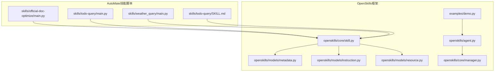
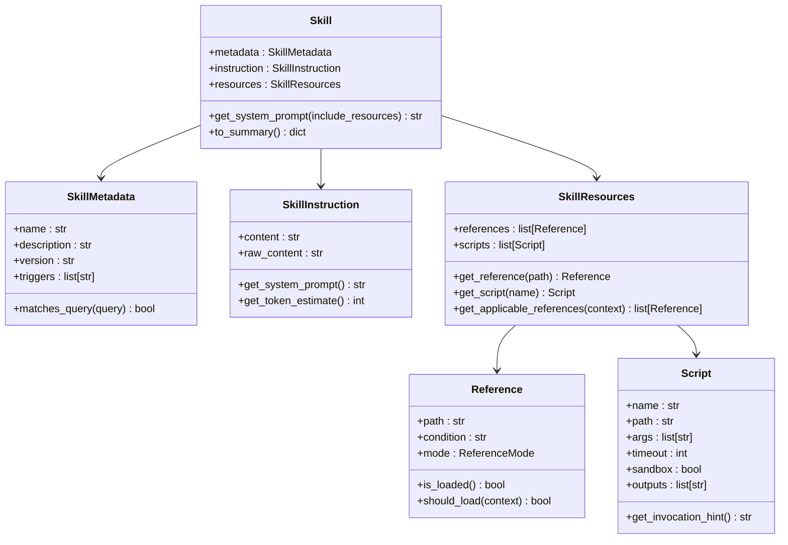
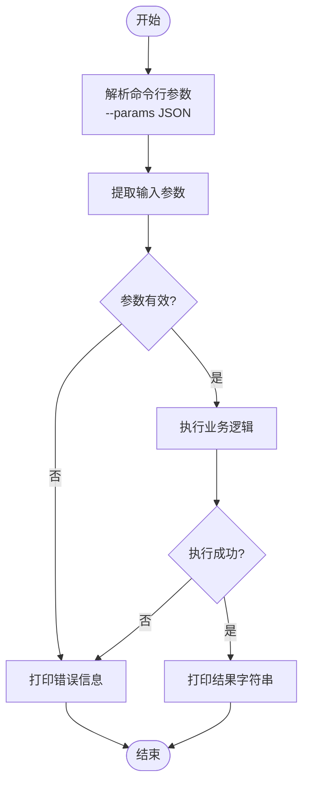
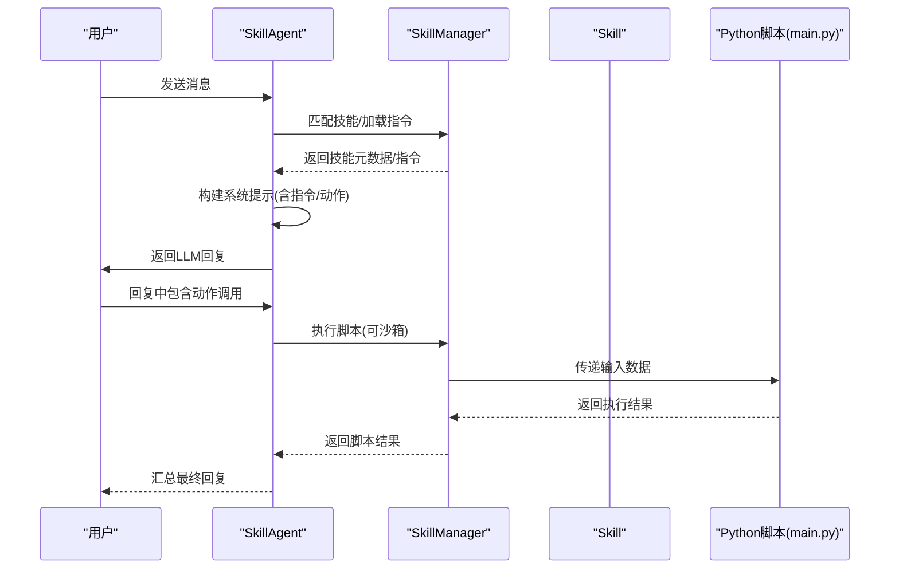
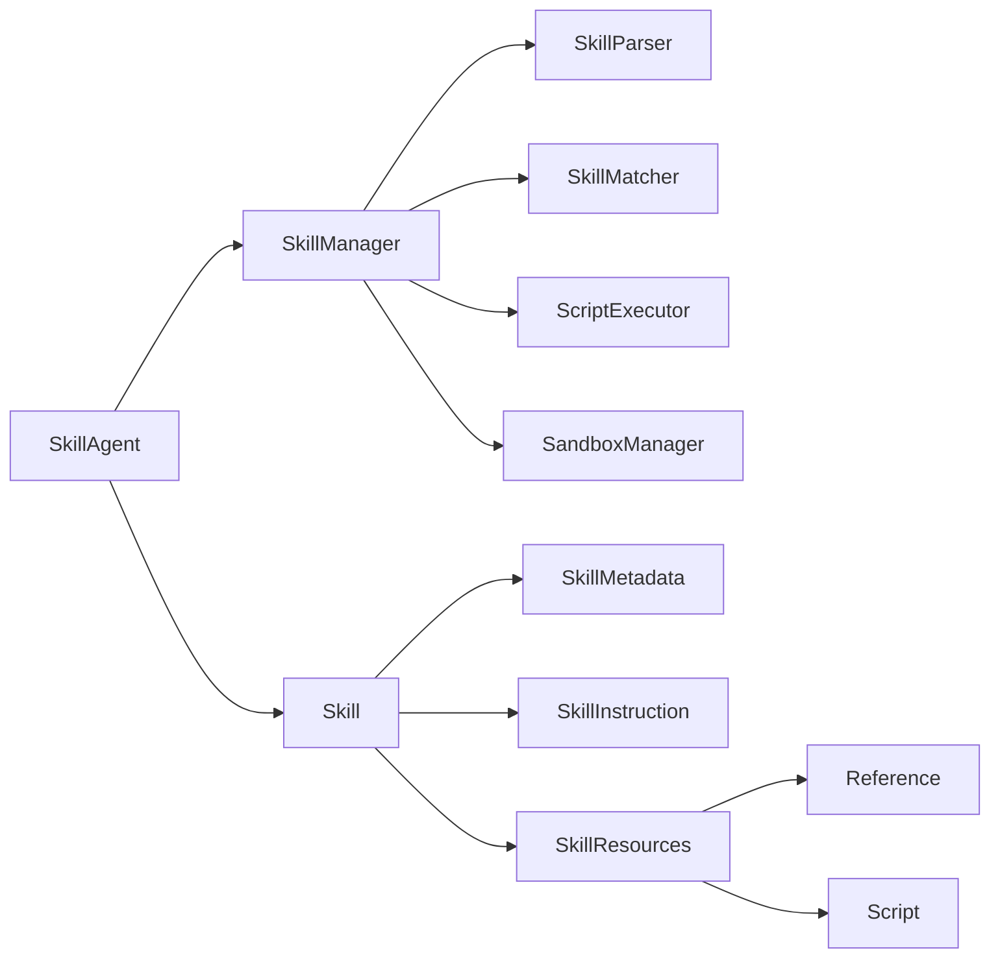

# 技能脚本开发

<cite>
**本文引用的文件**
- [skills/official-doc-optimize/main.py](file://skills/official-doc-optimize/main.py)
- [skills/todo-query/main.py](file://skills/todo-query/main.py)
- [skills/todo-query/SKILL.md](file://skills/todo-query/SKILL.md)
- [skills/weather_query/main.py](file://skills/weather_query/main.py)
- [OpenSkills-main/openskills/core/skill.py](file://OpenSkills-main/openskills/core/skill.py)
- [OpenSkills-main/openskills/models/metadata.py](file://OpenSkills-main/openskills/models/metadata.py)
- [OpenSkills-main/openskills/models/instruction.py](file://OpenSkills-main/openskills/models/instruction.py)
- [OpenSkills-main/openskills/models/resource.py](file://OpenSkills-main/openskills/models/resource.py)
- [OpenSkills-main/openskills/agent.py](file://OpenSkills-main/openskills/agent.py)
- [OpenSkills-main/openskills/core/manager.py](file://OpenSkills-main/openskills/core/manager.py)
- [OpenSkills-main/examples/demo.py](file://OpenSkills-main/examples/demo.py)
- [OpenSkills-main/examples/office-skills/docx-processor/scripts/convert_docx.py](file://OpenSkills-main/examples/office-skills/docx-processor/scripts/convert_docx.py)
- [OpenSkills-main/examples/meeting-summary/scripts/upload.py](file://OpenSkills-main/examples/meeting-summary/scripts/upload.py)
</cite>

## 目录
1. [简介](#简介)
2. [项目结构](#项目结构)
3. [核心组件](#核心组件)
4. [架构总览](#架构总览)
5. [组件详解](#组件详解)
6. [依赖关系分析](#依赖关系分析)
7. [性能考量](#性能考量)
8. [故障排查指南](#故障排查指南)
9. [结论](#结论)
10. [附录](#附录)

## 简介
本指南面向AutoMate平台的技能脚本开发者，系统讲解Python技能脚本的编写规范、结构约定、参数与返回值格式、异常处理策略，以及与OpenSkills框架的集成方式（技能基类、方法重写、生命周期管理）。文档同时提供模板与示例，覆盖用户输入处理、外部API调用、文件读写等常见场景，并给出错误处理最佳实践、日志记录规范与资源管理策略。

## 项目结构
AutoMate仓库包含两类技能脚本：
- 简单Python脚本技能：位于skills/<skill>/main.py，直接通过命令行参数接收输入并打印结果。
- OpenSkills框架技能：位于OpenSkills-main/openskills/及其examples下，采用三层模型（元数据/指令/资源），由SkillAgent与SkillManager驱动执行。

**图示来源**
- [skills/official-doc-optimize/main.py](file://skills/official-doc-optimize/main.py#L1-L208)
- [skills/todo-query/main.py](file://skills/todo-query/main.py#L1-L34)
- [skills/todo-query/SKILL.md](file://skills/todo-query/SKILL.md#L1-L24)
- [skills/weather_query/main.py](file://skills/weather_query/main.py#L1-L139)
- [OpenSkills-main/openskills/core/skill.py](file://OpenSkills-main/openskills/core/skill.py#L1-L150)
- [OpenSkills-main/openskills/models/metadata.py](file://OpenSkills-main/openskills/models/metadata.py#L1-L83)
- [OpenSkills-main/openskills/models/instruction.py](file://OpenSkills-main/openskills/models/instruction.py#L1-L48)
- [OpenSkills-main/openskills/models/resource.py](file://OpenSkills-main/openskills/models/resource.py#L1-L204)
- [OpenSkills-main/openskills/agent.py](file://OpenSkills-main/openskills/agent.py#L1-L858)
- [OpenSkills-main/openskills/core/manager.py](file://OpenSkills-main/openskills/core/manager.py#L1-L523)
- [OpenSkills-main/examples/demo.py](file://OpenSkills-main/examples/demo.py#L1-L290)

**章节来源**
- [skills/official-doc-optimize/main.py](file://skills/official-doc-optimize/main.py#L1-L208)
- [skills/todo-query/main.py](file://skills/todo-query/main.py#L1-L34)
- [skills/todo-query/SKILL.md](file://skills/todo-query/SKILL.md#L1-L24)
- [skills/weather_query/main.py](file://skills/weather_query/main.py#L1-L139)
- [OpenSkills-main/openskills/core/skill.py](file://OpenSkills-main/openskills/core/skill.py#L1-L150)
- [OpenSkills-main/openskills/models/metadata.py](file://OpenSkills-main/openskills/models/metadata.py#L1-L83)
- [OpenSkills-main/openskills/models/instruction.py](file://OpenSkills-main/openskills/models/instruction.py#L1-L48)
- [OpenSkills-main/openskills/models/resource.py](file://OpenSkills-main/openskills/models/resource.py#L1-L204)
- [OpenSkills-main/openskills/agent.py](file://OpenSkills-main/openskills/agent.py#L1-L858)
- [OpenSkills-main/openskills/core/manager.py](file://OpenSkills-main/openskills/core/manager.py#L1-L523)
- [OpenSkills-main/examples/demo.py](file://OpenSkills-main/examples/demo.py#L1-L290)

## 核心组件
- 技能对象（Skill）：封装三层渐进式加载的数据结构（元数据、指令、资源），支持系统提示拼装与脚本调用提示生成。
- 元数据（SkillMetadata）：轻量信息，用于发现与匹配，包含名称、描述、版本、触发词等。
- 指令（SkillInstruction）：按需加载的技能规则与指导，注入LLM系统提示。
- 资源（Reference/Script）：条件加载的参考文档与可执行脚本，支持沙箱执行与文件同步。
- 技能代理（SkillAgent）：自动发现、匹配、加载参考、执行脚本并管理对话上下文。
- 技能管理器（SkillManager）：扫描目录、注册技能、按需加载指令与资源、执行脚本。

**章节来源**
- [OpenSkills-main/openskills/core/skill.py](file://OpenSkills-main/openskills/core/skill.py#L1-L150)
- [OpenSkills-main/openskills/models/metadata.py](file://OpenSkills-main/openskills/models/metadata.py#L1-L83)
- [OpenSkills-main/openskills/models/instruction.py](file://OpenSkills-main/openskills/models/instruction.py#L1-L48)
- [OpenSkills-main/openskills/models/resource.py](file://OpenSkills-main/openskills/models/resource.py#L1-L204)
- [OpenSkills-main/openskills/agent.py](file://OpenSkills-main/openskills/agent.py#L1-L858)
- [OpenSkills-main/openskills/core/manager.py](file://OpenSkills-main/openskills/core/manager.py#L1-L523)

## 架构总览
OpenSkills采用“三层渐进式披露”与“按需加载”机制：
- 层1（元数据）：始终加载，用于快速发现与匹配。
- 层2（指令）：按需加载，注入LLM系统提示。
- 层3（资源）：条件加载，包含Reference与Script，后者可被LLM触发执行。

**图示来源**
- [OpenSkills-main/openskills/core/skill.py](file://OpenSkills-main/openskills/core/skill.py#L1-L150)
- [OpenSkills-main/openskills/models/metadata.py](file://OpenSkills-main/openskills/models/metadata.py#L1-L83)
- [OpenSkills-main/openskills/models/instruction.py](file://OpenSkills-main/openskills/models/instruction.py#L1-L48)
- [OpenSkills-main/openskills/models/resource.py](file://OpenSkills-main/openskills/models/resource.py#L1-L204)

## 组件详解

### Python技能脚本（命令行入口）
- 标准格式
  - main.py作为入口，支持通过sys.argv解析--params传参，参数为JSON字符串。
  - 函数签名应明确参数类型与用途，返回字符串或JSON字符串。
- 参数解析
  - 从命令行读取参数键值，使用JSON解析--params后提取所需字段。
- 返回值格式
  - 直接print输出字符串，供上层调用方消费。
- 异常处理
  - 对外部API或文件操作进行try-except，返回统一的错误消息字符串。

示例参考：
- 待办查询：[skills/todo-query/main.py](file://skills/todo-query/main.py#L1-L34)
- 天气查询：[skills/weather_query/main.py](file://skills/weather_query/main.py#L1-L139)
- 文档优化：[skills/official-doc-optimize/main.py](file://skills/official-doc-optimize/main.py#L1-L208)

**图示来源**
- [skills/todo-query/main.py](file://skills/todo-query/main.py#L23-L34)
- [skills/weather_query/main.py](file://skills/weather_query/main.py#L128-L139)

**章节来源**
- [skills/todo-query/main.py](file://skills/todo-query/main.py#L1-L34)
- [skills/weather_query/main.py](file://skills/weather_query/main.py#L1-L139)
- [skills/official-doc-optimize/main.py](file://skills/official-doc-optimize/main.py#L1-L208)

### OpenSkills技能脚本（框架集成）
- 技能定义文件（SKILL.md）
  - 必填字段：name、display_name、description、version、author、entry_point、function。
  - parameters与returns定义输入输出规范，examples提供用法示例。
  - 示例参考：[skills/todo-query/SKILL.md](file://skills/todo-query/SKILL.md#L1-L24)

- 与框架集成
  - 入口函数：在main.py中定义函数（如get_todo_count），由SKILL.md的function字段指定。
  - 系统提示：Skill.get_system_prompt()会拼装指令与可用动作提示，供LLM使用。
  - 脚本执行：LLM可通过动作提示触发scripts中的脚本，由SkillAgent/SkillManager负责执行与沙箱管理。

**图示来源**
- [OpenSkills-main/openskills/agent.py](file://OpenSkills-main/openskills/agent.py#L228-L322)
- [OpenSkills-main/openskills/core/manager.py](file://OpenSkills-main/openskills/core/manager.py#L265-L318)
- [OpenSkills-main/openskills/core/skill.py](file://OpenSkills-main/openskills/core/skill.py#L103-L133)
- [skills/todo-query/SKILL.md](file://skills/todo-query/SKILL.md#L1-L24)

**章节来源**
- [skills/todo-query/SKILL.md](file://skills/todo-query/SKILL.md#L1-L24)
- [OpenSkills-main/openskills/agent.py](file://OpenSkills-main/openskills/agent.py#L1-L858)
- [OpenSkills-main/openskills/core/manager.py](file://OpenSkills-main/openskills/core/manager.py#L1-L523)
- [OpenSkills-main/openskills/core/skill.py](file://OpenSkills-main/openskills/core/skill.py#L1-L150)

### 常见场景示例

#### 处理用户输入
- 命令行参数：解析--params JSON，提取字段如input/location等。
- 示例：[skills/todo-query/main.py](file://skills/todo-query/main.py#L23-L34)、[skills/weather_query/main.py](file://skills/weather_query/main.py#L128-L139)

**章节来源**
- [skills/todo-query/main.py](file://skills/todo-query/main.py#L1-L34)
- [skills/weather_query/main.py](file://skills/weather_query/main.py#L1-L139)

#### 调用外部API
- 天气查询：构造URL与参数，处理HTTP状态码与异常，返回结构化结果。
- 示例：[skills/weather_query/main.py](file://skills/weather_query/main.py#L10-L98)

**章节来源**
- [skills/weather_query/main.py](file://skills/weather_query/main.py#L1-L139)

#### 处理文件操作
- DOCX转Markdown/文本：读取文件、解析段落与表格、保存输出、返回结果。
- 示例：[OpenSkills-main/examples/office-skills/docx-processor/scripts/convert_docx.py](file://OpenSkills-main/examples/office-skills/docx-processor/scripts/convert_docx.py#L1-L126)

**章节来源**
- [OpenSkills-main/examples/office-skills/docx-processor/scripts/convert_docx.py](file://OpenSkills-main/examples/office-skills/docx-processor/scripts/convert_docx.py#L1-L126)

#### 上传/归档输出
- 模拟上传到本地临时目录，返回状态与路径。
- 示例：[OpenSkills-main/examples/meeting-summary/scripts/upload.py](file://OpenSkills-main/examples/meeting-summary/scripts/upload.py#L1-L49)

**章节来源**
- [OpenSkills-main/examples/meeting-summary/scripts/upload.py](file://OpenSkills-main/examples/meeting-summary/scripts/upload.py#L1-L49)

## 依赖关系分析
- 技能对象依赖元数据、指令与资源模型，用于构建系统提示与动作提示。
- SkillAgent依赖SkillManager进行技能发现、匹配与执行；同时负责对话上下文与引用摘要记忆。
- SkillManager依赖解析器、匹配器与脚本执行器，支持沙箱文件上传/下载与依赖安装。

**图示来源**
- [OpenSkills-main/openskills/agent.py](file://OpenSkills-main/openskills/agent.py#L1-L858)
- [OpenSkills-main/openskills/core/manager.py](file://OpenSkills-main/openskills/core/manager.py#L1-L523)
- [OpenSkills-main/openskills/core/skill.py](file://OpenSkills-main/openskills/core/skill.py#L1-L150)
- [OpenSkills-main/openskills/models/metadata.py](file://OpenSkills-main/openskills/models/metadata.py#L1-L83)
- [OpenSkills-main/openskills/models/instruction.py](file://OpenSkills-main/openskills/models/instruction.py#L1-L48)
- [OpenSkills-main/openskills/models/resource.py](file://OpenSkills-main/openskills/models/resource.py#L1-L204)

**章节来源**
- [OpenSkills-main/openskills/agent.py](file://OpenSkills-main/openskills/agent.py#L1-L858)
- [OpenSkills-main/openskills/core/manager.py](file://OpenSkills-main/openskills/core/manager.py#L1-L523)
- [OpenSkills-main/openskills/core/skill.py](file://OpenSkills-main/openskills/core/skill.py#L1-L150)
- [OpenSkills-main/openskills/models/metadata.py](file://OpenSkills-main/openskills/models/metadata.py#L1-L83)
- [OpenSkills-main/openskills/models/instruction.py](file://OpenSkills-main/openskills/models/instruction.py#L1-L48)
- [OpenSkills-main/openskills/models/resource.py](file://OpenSkills-main/openskills/models/resource.py#L1-L204)

## 性能考量
- 三层渐进式加载：仅在需要时加载指令与资源，减少内存占用与延迟。
- 引用摘要记忆：跨轮次保留摘要，避免重复加载全文，降低token消耗。
- 沙箱执行：按需安装依赖，共享执行器，提升脚本执行效率。
- Token估算：指令层提供粗略token估算，辅助控制上下文长度。

**章节来源**
- [OpenSkills-main/openskills/agent.py](file://OpenSkills-main/openskills/agent.py#L634-L661)
- [OpenSkills-main/openskills/models/instruction.py](file://OpenSkills-main/openskills/models/instruction.py#L38-L47)
- [OpenSkills-main/openskills/core/manager.py](file://OpenSkills-main/openskills/core/manager.py#L319-L360)

## 故障排查指南
- 参数解析失败
  - 确认命令行传入--params为合法JSON；捕获JSON解析异常并降级处理。
  - 参考：[skills/todo-query/main.py](file://skills/todo-query/main.py#L26-L31)
- 外部API异常
  - 捕获HTTP错误与请求异常，返回统一错误结构；检查超时与鉴权。
  - 参考：[skills/weather_query/main.py](file://skills/weather_query/main.py#L83-L97)
- 文件操作异常
  - 检查文件是否存在与权限；缺失依赖时给出安装指引。
  - 参考：[OpenSkills-main/examples/office-skills/docx-processor/scripts/convert_docx.py](file://OpenSkills-main/examples/office-skills/docx-processor/scripts/convert_docx.py#L81-L89)
- 沙箱执行失败
  - 确保SkillManager在异步上下文中初始化；检查沙箱地址与依赖安装。
  - 参考：[OpenSkills-main/openskills/core/manager.py](file://OpenSkills-main/openskills/core/manager.py#L80-L98)

**章节来源**
- [skills/todo-query/main.py](file://skills/todo-query/main.py#L1-L34)
- [skills/weather_query/main.py](file://skills/weather_query/main.py#L1-L139)
- [OpenSkills-main/examples/office-skills/docx-processor/scripts/convert_docx.py](file://OpenSkills-main/examples/office-skills/docx-processor/scripts/convert_docx.py#L1-L126)
- [OpenSkills-main/openskills/core/manager.py](file://OpenSkills-main/openskills/core/manager.py#L1-L523)

## 结论
通过遵循AutoMate与OpenSkills的技能脚本规范，开发者可以快速构建可发现、可匹配、可执行的技能。建议优先采用OpenSkills框架，利用其三层模型与沙箱能力，确保安全性与可维护性；对于简单场景，可沿用命令行参数与print输出的传统模式。结合本文提供的模板与示例，即可高效完成从输入解析、业务处理到输出返回的全流程开发。

## 附录

### 开发模板（命令行技能）
- 文件位置：skills/<skill>/main.py
- 关键点
  - 解析--params JSON，提取输入字段。
  - 执行业务逻辑，返回字符串。
  - 异常捕获，返回统一错误消息。
- 参考实现：[skills/todo-query/main.py](file://skills/todo-query/main.py#L1-L34)

**章节来源**
- [skills/todo-query/main.py](file://skills/todo-query/main.py#L1-L34)

### 开发模板（OpenSkills技能）
- 文件位置：skills/<skill>/SKILL.md + main.py
- 关键点
  - SKILL.md定义entry_point与function，声明parameters/returns与examples。
  - main.py实现指定函数，返回字符串或JSON字符串。
  - 通过SkillAgent/SkillManager自动发现与执行。
- 参考实现：[skills/todo-query/SKILL.md](file://skills/todo-query/SKILL.md#L1-L24)

**章节来源**
- [skills/todo-query/SKILL.md](file://skills/todo-query/SKILL.md#L1-L24)

### 日志记录规范
- 建议在脚本中使用标准日志库记录关键事件与错误，便于调试与审计。
- 在沙箱模式下，可借助框架提供的沙箱日志器输出进度与错误信息。

**章节来源**
- [OpenSkills-main/openskills/core/manager.py](file://OpenSkills-main/openskills/core/manager.py#L452-L493)

### 资源管理策略
- 引用文件：按需加载，避免一次性加载全部；跨轮次保留摘要，减少token消耗。
- 脚本执行：优先使用沙箱隔离，自动上传/下载文件，确保安全与可追溯。
- 依赖安装：按需安装，复用执行器，缩短冷启动时间。

**章节来源**
- [OpenSkills-main/openskills/agent.py](file://OpenSkills-main/openskills/agent.py#L471-L524)
- [OpenSkills-main/openskills/core/manager.py](file://OpenSkills-main/openskills/core/manager.py#L319-L360)