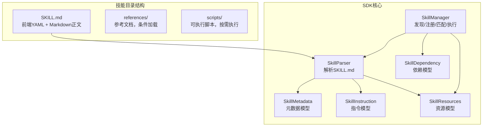
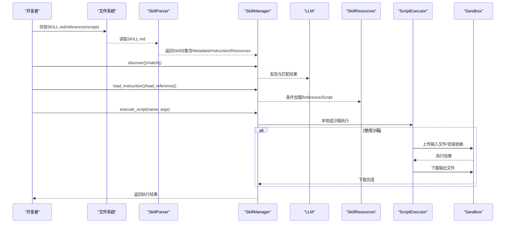
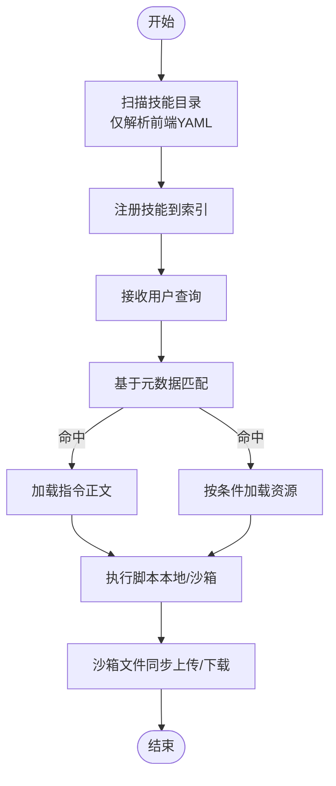
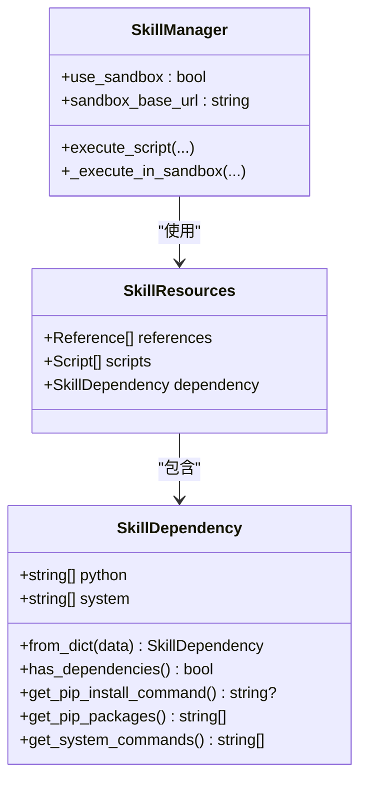
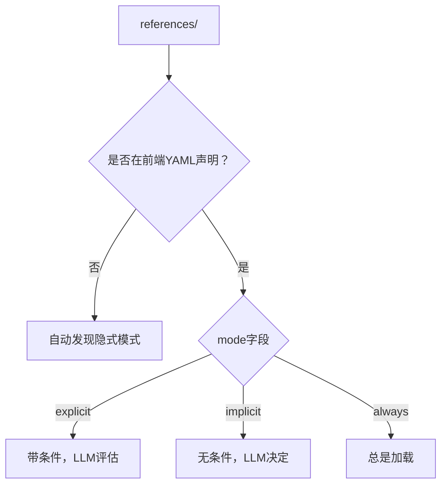
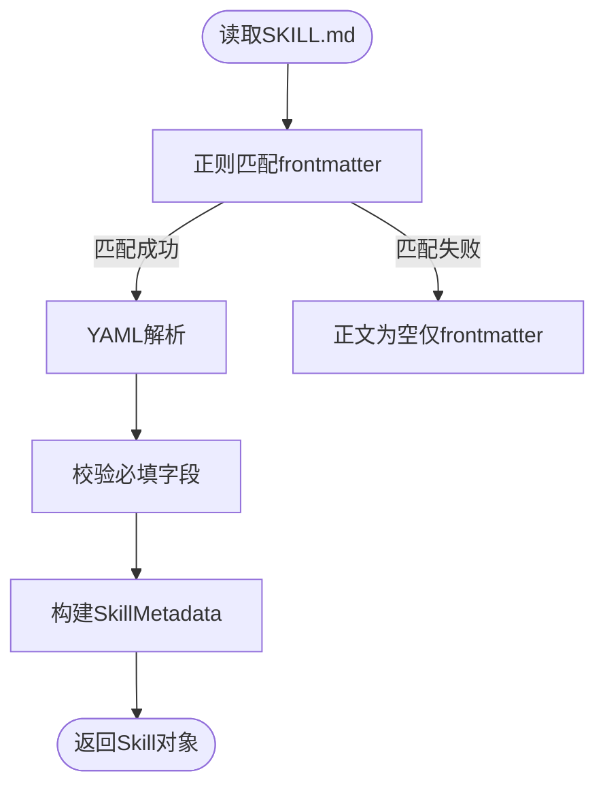
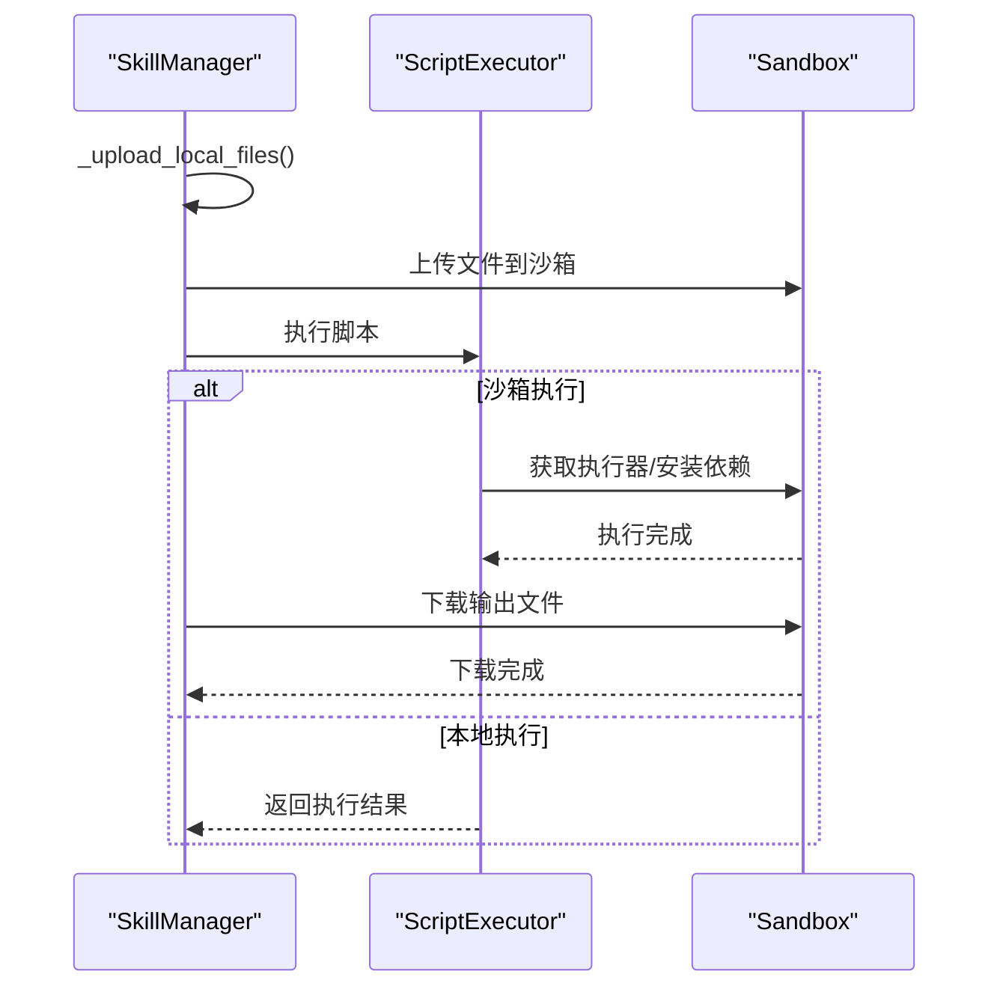
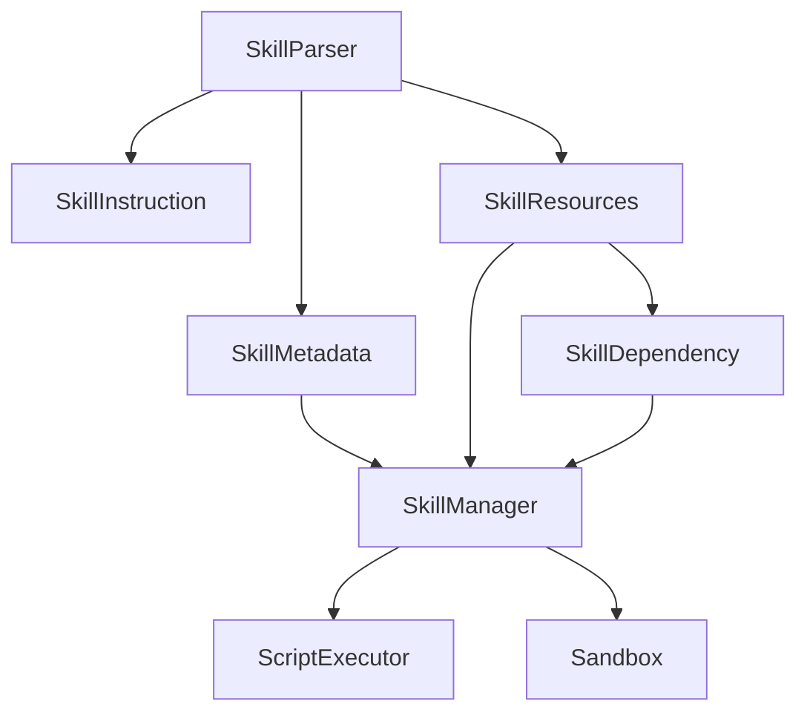

# 技能配置管理

<cite>
**本文引用的文件**
- [OpenSkills-main/README.md](file://OpenSkills-main/README.md)
- [OpenSkills-main/pyproject.toml](file://OpenSkills-main/pyproject.toml)
- [OpenSkills-main/openskills/models/metadata.py](file://OpenSkills-main/openskills/models/metadata.py)
- [OpenSkills-main/openskills/models/dependency.py](file://OpenSkills-main/openskills/models/dependency.py)
- [OpenSkills-main/openskills/models/resource.py](file://OpenSkills-main/openskills/models/resource.py)
- [OpenSkills-main/openskills/models/instruction.py](file://OpenSkills-main/openskills/models/instruction.py)
- [OpenSkills-main/openskills/utils/frontmatter.py](file://OpenSkills-main/openskills/utils/frontmatter.py)
- [OpenSkills-main/openskills/core/parser.py](file://OpenSkills-main/openskills/core/parser.py)
- [OpenSkills-main/openskills/core/manager.py](file://OpenSkills-main/openskills/core/manager.py)
- [OpenSkills-main/examples/feishu-doc-to-dev-spec/SKILL.md](file://OpenSkills-main/examples/feishu-doc-to-dev-spec/SKILL.md)
- [OpenSkills-main/examples/file-to-article-generator/SKILL.md](file://OpenSkills-main/examples/file-to-article-generator/SKILL.md)
- [OpenSkills-main/examples/infographic-skills/infographic-creator/SKILL.md](file://OpenSkills-main/examples/infographic-skills/infographic-creator/SKILL.md)
- [OpenSkills-main/examples/office-skills/docx-processor/SKILL.md](file://OpenSkills-main/examples/office-skills/docx-processor/SKILL.md)
- [OpenSkills-main/examples/prompt-optimizer/SKILL.md](file://OpenSkills-main/examples/prompt-optimizer/SKILL.md)
- [OpenSkills-main/examples/file-to-article-generator/scripts/parse_file.py](file://OpenSkills-main/examples/file-to-article-generator/scripts/parse_file.py)
- [OpenSkills-main/examples/meeting-summary/scripts/upload.py](file://OpenSkills-main/examples/meeting-summary/scripts/upload.py)
- [skills/todo-query/SKILL.md](file://skills/todo-query/SKILL.md)
</cite>

## 目录
1. [简介](#简介)
2. [项目结构](#项目结构)
3. [核心组件](#核心组件)
4. [架构总览](#架构总览)
5. [详细组件分析](#详细组件分析)
6. [依赖关系分析](#依赖关系分析)
7. [性能考虑](#性能考虑)
8. [故障排查指南](#故障排查指南)
9. [结论](#结论)
10. [附录](#附录)

## 简介
本文件系统化阐述AutoMate中基于OpenSkills的技能配置管理，围绕SKILL.md配置文件的编写规范、智能体注册流程、依赖管理与版本控制、以及最佳实践展开。文档以仓库中的真实实现与示例为依据，提供可操作的模板、字段说明、校验规则与排障建议。

## 项目结构
OpenSkills采用三层渐进披露架构：元数据层（Layer 1，始终加载）、指令层（Layer 2，按需加载）、资源层（Layer 3，条件加载）。技能以SKILL.md为核心定义文件，配合references/与scripts/目录组织参考文档与可执行脚本。

**图示来源**
- [OpenSkills-main/README.md](file://OpenSkills-main/README.md#L204-L269)
- [OpenSkills-main/openskills/core/manager.py](file://OpenSkills-main/openskills/core/manager.py#L24-L76)
- [OpenSkills-main/openskills/core/parser.py](file://OpenSkills-main/openskills/core/parser.py#L19-L30)
- [OpenSkills-main/openskills/models/metadata.py](file://OpenSkills-main/openskills/models/metadata.py#L11-L18)
- [OpenSkills-main/openskills/models/instruction.py](file://OpenSkills-main/openskills/models/instruction.py#L11-L17)
- [OpenSkills-main/openskills/models/resource.py](file://OpenSkills-main/openskills/models/resource.py#L180-L186)
- [OpenSkills-main/openskills/models/dependency.py](file://OpenSkills-main/openskills/models/dependency.py#L13-L19)

**章节来源**
- [OpenSkills-main/README.md](file://OpenSkills-main/README.md#L9-L26)
- [OpenSkills-main/README.md](file://OpenSkills-main/README.md#L204-L269)

## 核心组件
- 元数据模型（SkillMetadata）：承载名称、描述、版本、触发词、作者、标签等轻量信息，用于技能发现与匹配。
- 指令模型（SkillInstruction）：承载SKILL.md正文内容，按需注入LLM系统提示。
- 资源模型（SkillResources）：包含Reference与Script定义，支持显式/隐式/总是三种加载模式。
- 依赖模型（SkillDependency）：定义Python包与系统命令依赖，支持自动生成pip安装命令。
- 解析器（SkillParser）：解析SKILL.md，支持仅元数据解析与完整解析。
- 管理器（SkillManager）：负责技能发现、注册、匹配、指令与资源加载、脚本执行与沙箱文件同步。

**章节来源**
- [OpenSkills-main/openskills/models/metadata.py](file://OpenSkills-main/openskills/models/metadata.py#L11-L83)
- [OpenSkills-main/openskills/models/instruction.py](file://OpenSkills-main/openskills/models/instruction.py#L11-L48)
- [OpenSkills-main/openskills/models/resource.py](file://OpenSkills-main/openskills/models/resource.py#L45-L204)
- [OpenSkills-main/openskills/models/dependency.py](file://OpenSkills-main/openskills/models/dependency.py#L13-L87)
- [OpenSkills-main/openskills/core/parser.py](file://OpenSkills-main/openskills/core/parser.py#L19-L101)
- [OpenSkills-main/openskills/core/manager.py](file://OpenSkills-main/openskills/core/manager.py#L24-L76)

## 架构总览
下图展示从SKILL.md到智能体执行的关键流程：解析、发现、匹配、指令加载、资源加载、脚本执行与沙箱文件同步。

**图示来源**
- [OpenSkills-main/openskills/core/parser.py](file://OpenSkills-main/openskills/core/parser.py#L33-L101)
- [OpenSkills-main/openskills/core/manager.py](file://OpenSkills-main/openskills/core/manager.py#L116-L361)
- [OpenSkills-main/openskills/models/resource.py](file://OpenSkills-main/openskills/models/resource.py#L180-L204)
- [OpenSkills-main/README.md](file://OpenSkills-main/README.md#L102-L203)

## 详细组件分析

### SKILL.md配置文件规范
- 文件位置：技能根目录下的SKILL.md。
- 前端YAML（必需字段）：
  - name：技能唯一标识（字符串）。
  - description：技能简述（字符串）。
  - 可选字段：version（语义化版本）、triggers（触发词列表）、author（作者）、tags（标签列表）。
- 前端YAML（可选扩展）：
  - dependency：定义Python包与系统命令依赖。
  - references：引用文档定义（path、condition、description、mode）。
  - scripts：脚本定义（name、path、description、args、timeout、sandbox、outputs）。
- 正文Markdown：技能详细说明、前置准备、操作步骤、资源索引、注意事项、使用示例等。

字段含义与示例参考：
- 元数据字段：name、description、version、triggers、author、tags。
- 依赖声明：dependency.python、dependency.system。
- 资源声明：references[]、scripts[]。
- 示例参考：飞书文档转研发需求、文件转文章、信息图创建、Office技能、Prompt优化等。

**章节来源**
- [OpenSkills-main/openskills/core/parser.py](file://OpenSkills-main/openskills/core/parser.py#L102-L117)
- [OpenSkills-main/openskills/models/dependency.py](file://OpenSkills-main/openskills/models/dependency.py#L13-L43)
- [OpenSkills-main/openskills/models/resource.py](file://OpenSkills-main/openskills/models/resource.py#L45-L166)
- [OpenSkills-main/examples/feishu-doc-to-dev-spec/SKILL.md](file://OpenSkills-main/examples/feishu-doc-to-dev-spec/SKILL.md#L1-L222)
- [OpenSkills-main/examples/file-to-article-generator/SKILL.md](file://OpenSkills-main/examples/file-to-article-generator/SKILL.md#L1-L179)
- [OpenSkills-main/examples/infographic-skills/infographic-creator/SKILL.md](file://OpenSkills-main/examples/infographic-skills/infographic-creator/SKILL.md#L1-L377)
- [OpenSkills-main/examples/office-skills/docx-processor/SKILL.md](file://OpenSkills-main/examples/office-skills/docx-processor/SKILL.md#L1-L74)
- [OpenSkills-main/examples/prompt-optimizer/SKILL.md](file://OpenSkills-main/examples/prompt-optimizer/SKILL.md#L1-L131)

### 智能体注册与发现流程
- 发现阶段（Layer 1）：扫描技能目录，仅解析前端YAML元数据，建立索引。
- 注册阶段：将技能加入内部字典与元数据索引。
- 匹配阶段：基于查询与元数据进行匹配，返回候选技能。
- 指令加载（Layer 2）：按需加载SKILL.md正文为指令。
- 资源加载（Layer 3）：根据上下文与模式加载Reference或解析Script。
- 执行阶段：执行脚本，支持本地或沙箱执行，并进行文件上传/下载。

**图示来源**
- [OpenSkills-main/openskills/core/manager.py](file://OpenSkills-main/openskills/core/manager.py#L116-L144)
- [OpenSkills-main/openskills/core/manager.py](file://OpenSkills-main/openskills/core/manager.py#L181-L204)
- [OpenSkills-main/openskills/core/manager.py](file://OpenSkills-main/openskills/core/manager.py#L205-L264)
- [OpenSkills-main/openskills/core/manager.py](file://OpenSkills-main/openskills/core/manager.py#L265-L361)

**章节来源**
- [OpenSkills-main/openskills/core/manager.py](file://OpenSkills-main/openskills/core/manager.py#L116-L144)
- [OpenSkills-main/openskills/core/manager.py](file://OpenSkills-main/openskills/core/manager.py#L172-L176)
- [OpenSkills-main/openskills/core/manager.py](file://OpenSkills-main/openskills/core/manager.py#L495-L508)

### 依赖管理（Python包与系统依赖）
- Python包依赖：在前端YAML的dependency.python中声明，支持版本约束与范围；可自动生成pip安装命令。
- 系统依赖：在前端YAML的dependency.system中声明，支持mkdir/chmod等初始化命令。
- 依赖解析：SkillDependency.from_dict()从前端YAML解析依赖；has_dependencies()判断是否存在依赖；get_pip_install_command()生成pip命令。
- 沙箱集成：SkillManager在沙箱执行前自动安装依赖，并进行文件上传/下载。

**图示来源**
- [OpenSkills-main/openskills/models/dependency.py](file://OpenSkills-main/openskills/models/dependency.py#L13-L87)
- [OpenSkills-main/openskills/models/resource.py](file://OpenSkills-main/openskills/models/resource.py#L180-L186)
- [OpenSkills-main/openskills/core/manager.py](file://OpenSkills-main/openskills/core/manager.py#L319-L361)

**章节来源**
- [OpenSkills-main/openskills/models/dependency.py](file://OpenSkills-main/openskills/models/dependency.py#L45-L87)
- [OpenSkills-main/openskills/core/manager.py](file://OpenSkills-main/openskills/core/manager.py#L334-L361)

### 资源加载模式与自动发现
- 模式定义：
  - explicit：带条件，由LLM评估是否满足。
  - implicit：无条件，由LLM决定是否需要。
  - always：总是加载（如安全规范、规范文档）。
- 自动发现：references/目录下未在前端YAML声明的文件默认隐式加载。
- 脚本定义：name、path、description、args、timeout、sandbox、outputs等。

**图示来源**
- [OpenSkills-main/openskills/core/parser.py](file://OpenSkills-main/openskills/core/parser.py#L175-L209)
- [OpenSkills-main/openskills/models/resource.py](file://OpenSkills-main/openskills/models/resource.py#L38-L43)

**章节来源**
- [OpenSkills-main/openskills/models/resource.py](file://OpenSkills-main/openskills/models/resource.py#L45-L110)
- [OpenSkills-main/openskills/core/parser.py](file://OpenSkills-main/openskills/core/parser.py#L119-L174)

### 验证规则与前端YAML解析
- 必填字段：name、description。
- 前端YAML解析：使用正则与YAML解析器分离frontmatter与正文；非法frontmatter抛出异常。
- 版本格式：元数据模型对version进行正则校验（语义化版本）。

**图示来源**
- [OpenSkills-main/openskills/utils/frontmatter.py](file://OpenSkills-main/openskills/utils/frontmatter.py#L13-L66)
- [OpenSkills-main/openskills/core/parser.py](file://OpenSkills-main/openskills/core/parser.py#L102-L117)
- [OpenSkills-main/openskills/models/metadata.py](file://OpenSkills-main/openskills/models/metadata.py#L32-L36)

**章节来源**
- [OpenSkills-main/openskills/utils/frontmatter.py](file://OpenSkills-main/openskills/utils/frontmatter.py#L19-L66)
- [OpenSkills-main/openskills/core/parser.py](file://OpenSkills-main/openskills/core/parser.py#L102-L117)
- [OpenSkills-main/openskills/models/metadata.py](file://OpenSkills-main/openskills/models/metadata.py#L32-L36)

### 脚本执行与沙箱文件同步
- 脚本执行：支持本地执行与沙箱执行；可设置超时、沙箱开关、输出目录。
- 沙箱特性：自动安装依赖、上传输入文件、下载输出文件、日志进度提示。
- 文件路径处理：递归扫描输入数据中的本地文件路径并替换为沙箱路径。

**图示来源**
- [OpenSkills-main/openskills/core/manager.py](file://OpenSkills-main/openskills/core/manager.py#L265-L361)
- [OpenSkills-main/openskills/core/manager.py](file://OpenSkills-main/openskills/core/manager.py#L362-L494)

**章节来源**
- [OpenSkills-main/openskills/core/manager.py](file://OpenSkills-main/openskills/core/manager.py#L265-L361)
- [OpenSkills-main/openskills/core/manager.py](file://OpenSkills-main/openskills/core/manager.py#L362-L494)

## 依赖关系分析
- 组件耦合：
  - SkillParser依赖frontmatter解析与模型定义。
  - SkillManager依赖Parser、Matcher、Executor与Sandbox。
  - SkillResources包含Reference/Script与Dependency。
- 外部依赖：
  - YAML解析、Pydantic模型校验、HTTP客户端（用于沙箱）。
- 版本与兼容：
  - Python版本要求与依赖版本范围在pyproject.toml中声明。
  - SDK提供CLI工具与示例，便于验证与演示。

**图示来源**
- [OpenSkills-main/openskills/core/parser.py](file://OpenSkills-main/openskills/core/parser.py#L19-L101)
- [OpenSkills-main/openskills/models/resource.py](file://OpenSkills-main/openskills/models/resource.py#L180-L186)
- [OpenSkills-main/openskills/models/dependency.py](file://OpenSkills-main/openskills/models/dependency.py#L13-L43)
- [OpenSkills-main/openskills/core/manager.py](file://OpenSkills-main/openskills/core/manager.py#L24-L76)

**章节来源**
- [OpenSkills-main/pyproject.toml](file://OpenSkills-main/pyproject.toml#L1-L75)

## 性能考虑
- 层次化加载：仅在发现阶段加载元数据，按需加载指令与资源，降低内存占用与启动时间。
- Token估算：指令模型提供粗略token估算，辅助上下文规划。
- 并发与异步：管理器与沙箱执行均采用异步模式，提升I/O密集型场景吞吐。
- 依赖最小化：前端YAML仅包含必要字段，避免冗余信息影响匹配效率。

**章节来源**
- [OpenSkills-main/openskills/models/instruction.py](file://OpenSkills-main/openskills/models/instruction.py#L38-L48)
- [OpenSkills-main/openskills/core/manager.py](file://OpenSkills-main/openskills/core/manager.py#L80-L99)

## 故障排查指南
- 前端YAML无效：检查YAML语法与格式，确保frontmatter被正确识别。
- 缺少必填字段：确认name与description存在，避免解析失败。
- 依赖安装失败：核对dependency.python与dependency.system，确保版本兼容与网络可达。
- 脚本执行超时：调整scripts[].timeout，或优化脚本逻辑。
- 沙箱连接失败：确认沙箱服务运行状态与端口连通性。
- 文件同步异常：检查输出目录权限与沙箱路径映射。

**章节来源**
- [OpenSkills-main/openskills/utils/frontmatter.py](file://OpenSkills-main/openskills/utils/frontmatter.py#L56-L66)
- [OpenSkills-main/openskills/core/parser.py](file://OpenSkills-main/openskills/core/parser.py#L102-L107)
- [OpenSkills-main/openskills/core/manager.py](file://OpenSkills-main/openskills/core/manager.py#L328-L333)
- [OpenSkills-main/README.md](file://OpenSkills-main/README.md#L110-L145)

## 结论
通过SKILL.md统一定义技能的元数据、指令与资源，结合OpenSkills的三层架构与沙箱执行能力，实现了高效、安全、可扩展的智能体技能管理体系。遵循本文的编写规范与最佳实践，可显著提升技能开发与维护效率，并确保跨环境的一致性与稳定性。

## 附录

### 配置文件模板（字段分类）
- 元数据区（前端YAML）
  - 必填：name、description
  - 常用：version、triggers、author、tags
- 依赖区（前端YAML）
  - dependency.python：Python包列表（支持版本约束）
  - dependency.system：系统命令列表（初始化/环境准备）
- 资源区（前端YAML）
  - references[]：path、condition、description、mode
  - scripts[]：name、path、description、args、timeout、sandbox、outputs
- 正文区（Markdown）
  - 任务目标、前置准备、操作步骤、资源索引、注意事项、使用示例

**章节来源**
- [OpenSkills-main/openskills/core/parser.py](file://OpenSkills-main/openskills/core/parser.py#L108-L174)
- [OpenSkills-main/openskills/models/dependency.py](file://OpenSkills-main/openskills/models/dependency.py#L33-L43)
- [OpenSkills-main/openskills/models/resource.py](file://OpenSkills-main/openskills/models/resource.py#L57-L166)

### 最佳实践
- 字段分类：将技能元数据、依赖、资源与说明分别置于前端YAML与正文，保持结构清晰。
- 注释规范：在正文中使用小节标题与编号，便于阅读与检索。
- 版本兼容：在dependency.python中使用兼容性范围，避免破坏性升级。
- 触发词设计：triggers应覆盖用户常用表达，提高匹配召回率。
- 资源模式：优先使用隐式模式，必要时使用显式/总是模式限定加载时机。
- 示例与测试：提供典型使用示例与脚本执行示例，便于验证与演示。

**章节来源**
- [OpenSkills-main/examples/feishu-doc-to-dev-spec/SKILL.md](file://OpenSkills-main/examples/feishu-doc-to-dev-spec/SKILL.md#L1-L222)
- [OpenSkills-main/examples/file-to-article-generator/SKILL.md](file://OpenSkills-main/examples/file-to-article-generator/SKILL.md#L1-L179)
- [OpenSkills-main/examples/infographic-skills/infographic-creator/SKILL.md](file://OpenSkills-main/examples/infographic-skills/infographic-creator/SKILL.md#L1-L377)
- [OpenSkills-main/examples/office-skills/docx-processor/SKILL.md](file://OpenSkills-main/examples/office-skills/docx-processor/SKILL.md#L1-L74)
- [OpenSkills-main/examples/prompt-optimizer/SKILL.md](file://OpenSkills-main/examples/prompt-optimizer/SKILL.md#L1-L131)

### 版本控制与兼容性管理
- 版本字段：version采用语义化版本，便于依赖锁定与升级策略制定。
- 依赖范围：在dependency.python中使用范围约束，平衡功能与稳定性。
- 环境声明：在pyproject.toml中声明最低Python版本与关键依赖版本范围。
- 迁移策略：变更重大时提升主版本号，保持向后兼容或提供迁移指引。

**章节来源**
- [OpenSkills-main/openskills/models/metadata.py](file://OpenSkills-main/openskills/models/metadata.py#L32-L36)
- [OpenSkills-main/pyproject.toml](file://OpenSkills-main/pyproject.toml#L1-L75)