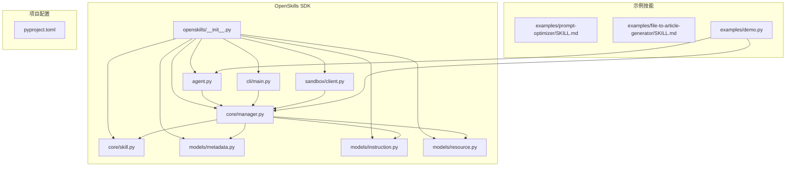
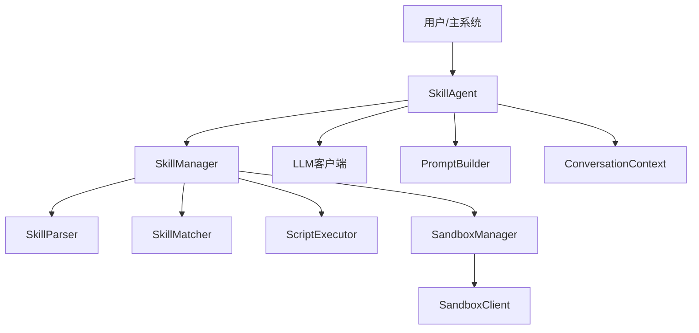
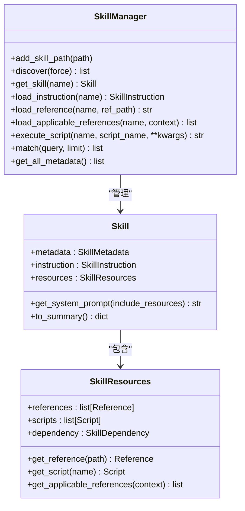
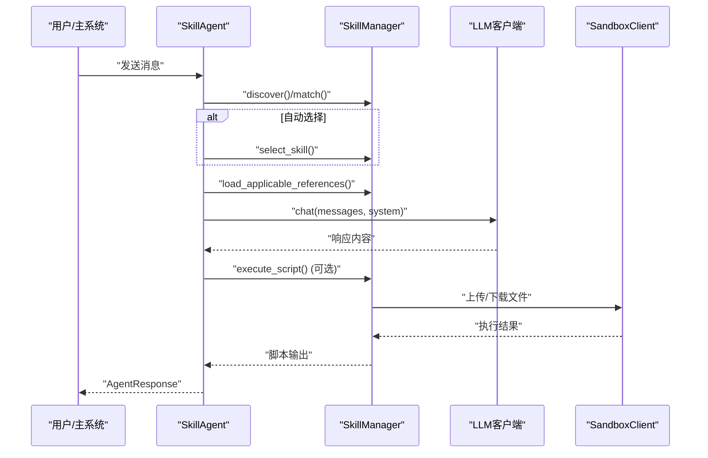
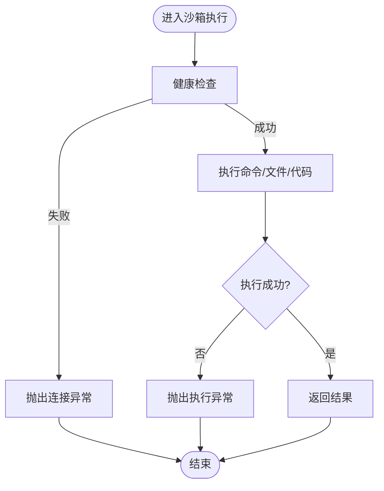
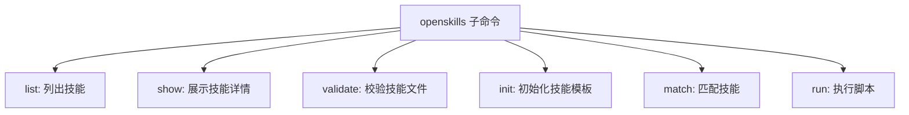
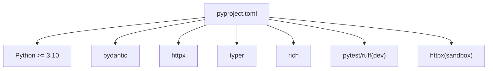

# 技能集成部署

<cite>
**本文档引用的文件**
- [OpenSkills-main/openskills/__init__.py](file://OpenSkills-main/openskills/__init__.py)
- [OpenSkills-main/openskills/core/manager.py](file://OpenSkills-main/openskills/core/manager.py)
- [OpenSkills-main/openskills/core/skill.py](file://OpenSkills-main/openskills/core/skill.py)
- [OpenSkills-main/openskills/models/metadata.py](file://OpenSkills-main/openskills/models/metadata.py)
- [OpenSkills-main/openskills/models/instruction.py](file://OpenSkills-main/openskills/models/instruction.py)
- [OpenSkills-main/openskills/models/resource.py](file://OpenSkills-main/openskills/models/resource.py)
- [OpenSkills-main/openskills/agent.py](file://OpenSkills-main/openskills/agent.py)
- [OpenSkills-main/openskills/cli/main.py](file://OpenSkills-main/openskills/cli/main.py)
- [OpenSkills-main/openskills/sandbox/client.py](file://OpenSkills-main/openskills/sandbox/client.py)
- [OpenSkills-main/examples/demo.py](file://OpenSkills-main/examples/demo.py)
- [OpenSkills-main/examples/prompt-optimizer/SKILL.md](file://OpenSkills-main/examples/prompt-optimizer/SKILL.md)
- [OpenSkills-main/examples/file-to-article-generator/SKILL.md](file://OpenSkills-main/examples/file-to-article-generator/SKILL.md)
- [OpenSkills-main/pyproject.toml](file://OpenSkills-main/pyproject.toml)
</cite>

## 目录
1. [简介](#简介)
2. [项目结构](#项目结构)
3. [核心组件](#核心组件)
4. [架构总览](#架构总览)
5. [详细组件分析](#详细组件分析)
6. [依赖关系分析](#依赖关系分析)
7. [性能考虑](#性能考虑)
8. [故障排查指南](#故障排查指南)
9. [结论](#结论)
10. [附录](#附录)

## 简介
本文件面向AutoMate技能集成部署，围绕OpenSkills框架的技能生命周期、部署流程、与主系统的集成方式、错误处理与最佳实践展开。内容涵盖：
- 技能的打包、依赖安装与环境配置
- 与主系统的API调用、数据交换格式与错误处理
- 版本管理、回滚策略与监控告警
- 技能的安装、更新、卸载与维护
- OpenSkills扩展机制与第三方技能集成方法

## 项目结构
AutoMate仓库包含OpenSkills SDK、示例技能与前端后端代码。与技能集成部署直接相关的关键目录与文件：
- OpenSkills SDK：核心框架，提供技能管理、匹配、执行与沙箱交互能力
- 示例技能：展示标准技能目录结构与SKILL.md规范
- CLI工具：提供技能发现、校验、初始化与脚本执行命令
- 沙箱客户端：封装AIO Sandbox的HTTP API，支持文件与代码执行

**图表来源**
- [OpenSkills-main/openskills/__init__.py](file://OpenSkills-main/openskills/__init__.py#L1-L50)
- [OpenSkills-main/openskills/core/manager.py](file://OpenSkills-main/openskills/core/manager.py#L1-L120)
- [OpenSkills-main/openskills/core/skill.py](file://OpenSkills-main/openskills/core/skill.py#L1-L60)
- [OpenSkills-main/openskills/models/metadata.py](file://OpenSkills-main/openskills/models/metadata.py#L1-L40)
- [OpenSkills-main/openskills/models/instruction.py](file://OpenSkills-main/openskills/models/instruction.py#L1-L30)
- [OpenSkills-main/openskills/models/resource.py](file://OpenSkills-main/openskills/models/resource.py#L1-L60)
- [OpenSkills-main/openskills/agent.py](file://OpenSkills-main/openskills/agent.py#L1-L80)
- [OpenSkills-main/openskills/cli/main.py](file://OpenSkills-main/openskills/cli/main.py#L1-L60)
- [OpenSkills-main/openskills/sandbox/client.py](file://OpenSkills-main/openskills/sandbox/client.py#L1-L60)
- [OpenSkills-main/examples/prompt-optimizer/SKILL.md](file://OpenSkills-main/examples/prompt-optimizer/SKILL.md#L1-L40)
- [OpenSkills-main/examples/file-to-article-generator/SKILL.md](file://OpenSkills-main/examples/file-to-article-generator/SKILL.md#L1-L40)
- [OpenSkills-main/examples/demo.py](file://OpenSkills-main/examples/demo.py#L1-L40)
- [OpenSkills-main/pyproject.toml](file://OpenSkills-main/pyproject.toml#L1-L40)

**章节来源**
- [OpenSkills-main/openskills/__init__.py](file://OpenSkills-main/openskills/__init__.py#L1-L50)
- [OpenSkills-main/pyproject.toml](file://OpenSkills-main/pyproject.toml#L1-L40)

## 核心组件
- SkillManager：技能发现、注册、按需加载指令与资源、脚本执行与沙箱集成
- Skill：技能对象，分三层渐进披露（元数据、指令、资源）
- SkillAgent：对话代理，自动技能选择、引用加载、脚本执行与流式响应
- SandboxClient：AIO Sandbox的HTTP客户端，提供命令执行、文件操作、代码执行等能力
- CLI：命令行工具，支持列出、展示、校验、初始化技能与执行脚本
- 模型层：Metadata、Instruction、Resource（Reference、Script、SkillResources）

**章节来源**
- [OpenSkills-main/openskills/core/manager.py](file://OpenSkills-main/openskills/core/manager.py#L24-L120)
- [OpenSkills-main/openskills/core/skill.py](file://OpenSkills-main/openskills/core/skill.py#L19-L82)
- [OpenSkills-main/openskills/agent.py](file://OpenSkills-main/openskills/agent.py#L61-L120)
- [OpenSkills-main/openskills/sandbox/client.py](file://OpenSkills-main/openskills/sandbox/client.py#L119-L160)
- [OpenSkills-main/openskills/cli/main.py](file://OpenSkills-main/openskills/cli/main.py#L19-L40)
- [OpenSkills-main/openskills/models/metadata.py](file://OpenSkills-main/openskills/models/metadata.py#L11-L40)
- [OpenSkills-main/openskills/models/instruction.py](file://OpenSkills-main/openskills/models/instruction.py#L11-L30)
- [OpenSkills-main/openskills/models/resource.py](file://OpenSkills-main/openskills/models/resource.py#L45-L120)

## 架构总览
OpenSkills采用“渐进披露”架构：技能发现阶段仅加载元数据；激活技能时按需加载指令与资源；执行脚本时可选择沙箱隔离执行。Agent负责对话上下文管理、技能路由、引用加载与脚本调用。

**图表来源**
- [OpenSkills-main/openskills/agent.py](file://OpenSkills-main/openskills/agent.py#L61-L120)
- [OpenSkills-main/openskills/core/manager.py](file://OpenSkills-main/openskills/core/manager.py#L24-L120)
- [OpenSkills-main/openskills/sandbox/client.py](file://OpenSkills-main/openskills/sandbox/client.py#L119-L160)

## 详细组件分析

### 组件A：SkillManager（技能管理器）
职责与流程：
- 发现：扫描技能目录，解析SKILL.md为元数据
- 注册：建立技能名到Skill对象的映射与元数据索引
- 加载：按需加载指令与资源（引用内容）
- 匹配：基于查询匹配技能
- 执行：执行脚本，支持沙箱与本地两种模式

**图表来源**
- [OpenSkills-main/openskills/core/manager.py](file://OpenSkills-main/openskills/core/manager.py#L24-L120)
- [OpenSkills-main/openskills/core/skill.py](file://OpenSkills-main/openskills/core/skill.py#L19-L82)
- [OpenSkills-main/openskills/models/resource.py](file://OpenSkills-main/openskills/models/resource.py#L180-L204)

**章节来源**
- [OpenSkills-main/openskills/core/manager.py](file://OpenSkills-main/openskills/core/manager.py#L116-L204)
- [OpenSkills-main/openskills/core/skill.py](file://OpenSkills-main/openskills/core/skill.py#L103-L150)

### 组件B：SkillAgent（对话代理）
职责与流程：
- 初始化：发现技能、预装依赖（沙箱模式）
- 对话：自动技能选择、引用加载、构建系统提示、调用LLM
- 脚本：解析并执行模型发出的脚本调用
- 上下文：维护消息历史、已加载引用摘要与跨轮次记忆

**图表来源**
- [OpenSkills-main/openskills/agent.py](file://OpenSkills-main/openskills/agent.py#L228-L322)
- [OpenSkills-main/openskills/core/manager.py](file://OpenSkills-main/openskills/core/manager.py#L265-L361)
- [OpenSkills-main/openskills/sandbox/client.py](file://OpenSkills-main/openskills/sandbox/client.py#L119-L160)

**章节来源**
- [OpenSkills-main/openskills/agent.py](file://OpenSkills-main/openskills/agent.py#L155-L322)

### 组件C：SandboxClient（沙箱客户端）
职责与流程：
- 健康检查、环境信息获取
- Shell命令执行、会话管理
- 文件读写、上传下载、目录遍历
- 代码执行（Python/JavaScript）、包管理
- 错误封装：连接异常、执行异常

**图表来源**
- [OpenSkills-main/openskills/sandbox/client.py](file://OpenSkills-main/openskills/sandbox/client.py#L203-L220)
- [OpenSkills-main/openskills/sandbox/client.py](file://OpenSkills-main/openskills/sandbox/client.py#L264-L325)
- [OpenSkills-main/openskills/sandbox/client.py](file://OpenSkills-main/openskills/sandbox/client.py#L487-L567)

**章节来源**
- [OpenSkills-main/openskills/sandbox/client.py](file://OpenSkills-main/openskills/sandbox/client.py#L104-L117)
- [OpenSkills-main/openskills/sandbox/client.py](file://OpenSkills-main/openskills/sandbox/client.py#L203-L220)

### 组件D：CLI（命令行工具）
职责与流程：
- 列出技能、展示详情、校验技能文件
- 初始化技能模板、匹配技能、执行脚本

**图表来源**
- [OpenSkills-main/openskills/cli/main.py](file://OpenSkills-main/openskills/cli/main.py#L19-L40)
- [OpenSkills-main/openskills/cli/main.py](file://OpenSkills-main/openskills/cli/main.py#L40-L90)
- [OpenSkills-main/openskills/cli/main.py](file://OpenSkills-main/openskills/cli/main.py#L202-L201)

**章节来源**
- [OpenSkills-main/openskills/cli/main.py](file://OpenSkills-main/openskills/cli/main.py#L40-L201)

## 依赖关系分析
- 语言与版本：Python >= 3.10
- 核心依赖：pydantic（数据模型）、httpx（HTTP）、typer（CLI）、rich（终端输出）
- 可选依赖：dev（测试与lint）、sandbox（HTTP客户端）
- 构建系统：Hatch（版本管理、打包）

**图表来源**
- [OpenSkills-main/pyproject.toml](file://OpenSkills-main/pyproject.toml#L1-L40)

**章节来源**
- [OpenSkills-main/pyproject.toml](file://OpenSkills-main/pyproject.toml#L22-L38)

## 性能考虑
- 渐进披露：仅在需要时加载指令与资源，降低内存占用与延迟
- 引用加载策略：先加载“总是”模式引用，再由LLM评估显式/隐式引用，减少不必要的上下文注入
- 沙箱预热：Agent初始化时预装依赖，缩短首次执行脚本的等待时间
- 超时控制：脚本超时参数限制长耗时任务影响

[本节为通用指导，无需具体文件分析]

## 故障排查指南
- 沙箱连接失败：确认AIO Sandbox服务可达，检查健康检查接口
- 脚本执行异常：查看SandboxExecutionError与stderr输出，定位命令/权限/依赖问题
- 技能未发现：检查SKILL.md路径与权限，确认manager扫描路径正确
- LLM调用失败：检查API密钥、模型名称与网络连通性
- 引用加载失败：确认引用文件存在且路径正确，检查条件评估逻辑

**章节来源**
- [OpenSkills-main/openskills/sandbox/client.py](file://OpenSkills-main/openskills/sandbox/client.py#L104-L117)
- [OpenSkills-main/openskills/sandbox/client.py](file://OpenSkills-main/openskills/sandbox/client.py#L203-L220)
- [OpenSkills-main/openskills/core/manager.py](file://OpenSkills-main/openskills/core/manager.py#L265-L318)

## 结论
OpenSkills为AutoMate提供了可扩展、可隔离的技能集成框架。通过渐进披露与沙箱执行，既能保证性能又能确保安全性。结合CLI与Agent，可实现从技能开发、部署到运行期管理的闭环。

[本节为总结，无需具体文件分析]

## 附录

### A. 技能部署流程（打包、依赖、环境）
- 目录结构
  - SKILL.md：技能定义（元数据、触发词、依赖、脚本、引用）
  - references/：条件引用文档
  - scripts/：可执行脚本
- 依赖安装
  - 本地模式：直接安装Python依赖
  - 沙箱模式：通过SandboxClient安装系统/Python依赖
- 环境配置
  - OPENAI/Azure OpenAI环境变量
  - 沙箱地址（SANDBOX_URL）
  - 技能路径（scan目录）

**章节来源**
- [OpenSkills-main/examples/file-to-article-generator/SKILL.md](file://OpenSkills-main/examples/file-to-article-generator/SKILL.md#L10-L25)
- [OpenSkills-main/examples/demo.py](file://OpenSkills-main/examples/demo.py#L8-L25)
- [OpenSkills-main/openskills/sandbox/client.py](file://OpenSkills-main/openskills/sandbox/client.py#L160-L175)

### B. 与主系统的集成方式
- API接口调用
  - Agent聊天：chat/chat_stream
  - 脚本执行：execute_script
  - 技能选择：select_skill/deselect_skill
- 数据交换格式
  - 消息：Message（文本/图片）
  - 响应：AgentResponse（内容、引用、脚本执行记录、用量）
  - 系统提示：PromptBuilder构建，包含技能指令、脚本调用提示与引用内容
- 错误处理机制
  - SandboxExecutionError：沙箱执行失败
  - SandboxConnectionError：沙箱连接失败
  - ValueError/RuntimeError：技能/脚本不存在、沙箱未初始化等

**章节来源**
- [OpenSkills-main/openskills/agent.py](file://OpenSkills-main/openskills/agent.py#L228-L322)
- [OpenSkills-main/openskills/agent.py](file://OpenSkills-main/openskills/agent.py#L525-L576)
- [OpenSkills-main/openskills/sandbox/client.py](file://OpenSkills-main/openskills/sandbox/client.py#L104-L117)

### C. 部署最佳实践
- 版本管理
  - 使用语义化版本（metadata.version）
  - 通过Git标签/分支管理技能版本
- 回滚策略
  - 保留历史版本目录，切换scan路径
  - 沙箱依赖按技能隔离，便于回滚
- 监控告警
  - 记录AgentResponse.usage与脚本执行时间
  - 沙箱执行日志与错误上报
  - CLI校验与健康检查纳入CI/CD

**章节来源**
- [OpenSkills-main/openskills/models/metadata.py](file://OpenSkills-main/openskills/models/metadata.py#L32-L36)
- [OpenSkills-main/openskills/cli/main.py](file://OpenSkills-main/openskills/cli/main.py#L155-L201)

### D. 生命周期管理
- 安装：将技能目录加入scan路径，执行discover
- 更新：替换SKILL.md与资源文件，必要时清理缓存
- 卸载：移除scan路径中的技能目录
- 维护：定期校验（validate）、更新依赖、优化脚本

**章节来源**
- [OpenSkills-main/openskills/core/manager.py](file://OpenSkills-main/openskills/core/manager.py#L116-L144)
- [OpenSkills-main/openskills/cli/main.py](file://OpenSkills-main/openskills/cli/main.py#L155-L201)

### E. OpenSkills扩展机制与第三方技能集成
- 扩展机制
  - 自定义SkillParser/SkillMatcher/ScriptExecutor
  - 自定义LLM客户端（BaseLLMClient）
  - 自定义PromptBuilder
- 第三方技能集成
  - 遵循SKILL.md规范，放置于scan路径
  - 使用CLI初始化模板快速生成标准结构
  - 在沙箱中隔离执行，保障安全

**章节来源**
- [OpenSkills-main/openskills/__init__.py](file://OpenSkills-main/openskills/__init__.py#L21-L49)
- [OpenSkills-main/openskills/cli/main.py](file://OpenSkills-main/openskills/cli/main.py#L202-L357)
- [OpenSkills-main/examples/prompt-optimizer/SKILL.md](file://OpenSkills-main/examples/prompt-optimizer/SKILL.md#L1-L40)