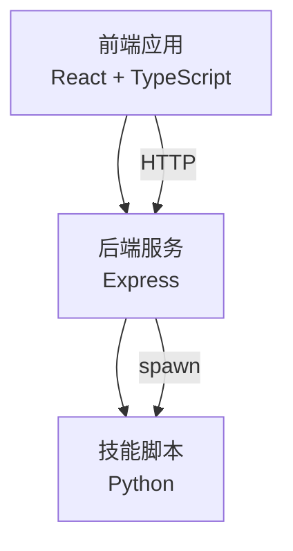
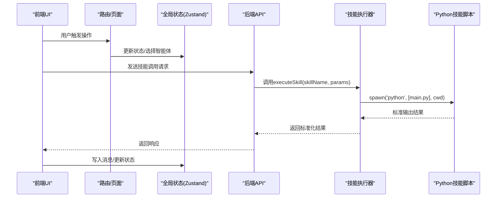
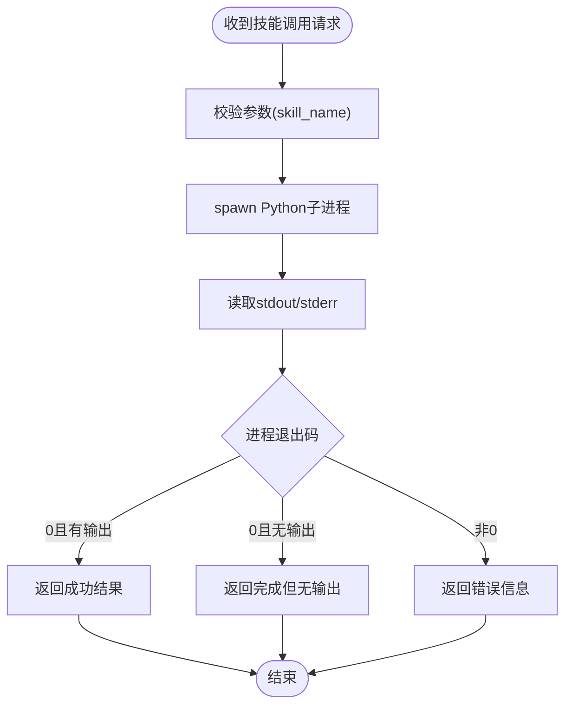
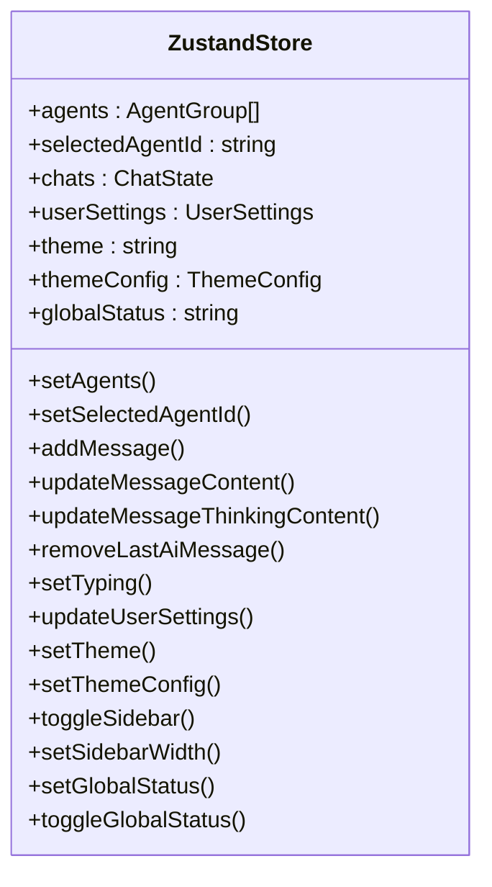
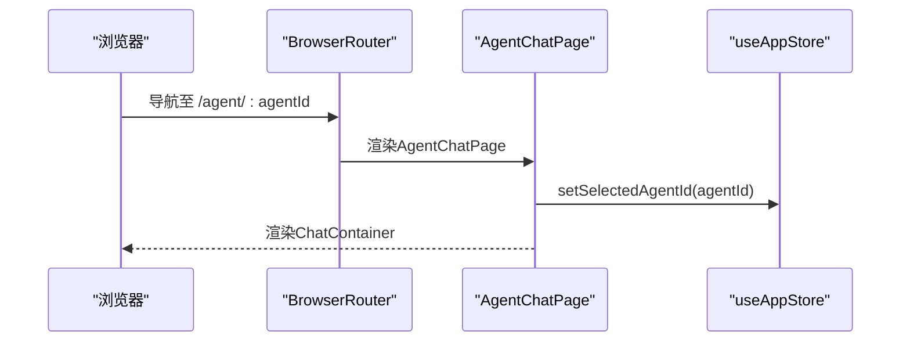
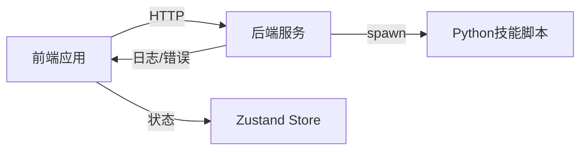

# 插件开发规范

<cite>
**本文引用的文件**
- [package.json](file://package.json)
- [backend/index.js](file://backend/index.js)
- [backend/services/skillService.js](file://backend/services/skillService.js)
- [src/main.tsx](file://src/main.tsx)
- [src/router/index.tsx](file://src/router/index.tsx)
- [src/store/useAppStore.ts](file://src/store/useAppStore.ts)
- [src/types/chat.ts](file://src/types/chat.ts)
- [src/components/Sidebar/Sidebar.tsx](file://src/components/Sidebar/Sidebar.tsx)
- [src/pages/AgentChatPage.tsx](file://src/pages/AgentChatPage.tsx)
- [skills/weather_query/main.py](file://skills/weather_query/main.py)
</cite>

## 目录
1. [引言](#引言)
2. [项目结构](#项目结构)
3. [核心组件](#核心组件)
4. [架构总览](#架构总览)
5. [详细组件分析](#详细组件分析)
6. [依赖关系分析](#依赖关系分析)
7. [性能考虑](#性能考虑)
8. [故障排查指南](#故障排查指南)
9. [结论](#结论)
10. [附录](#附录)

## 引言
本规范面向AutoMate插件开发者，提供统一的插件架构设计、接口定义、开发流程、生命周期管理、资源清理、插件间通信机制以及兼容性与版本管理策略。目标是确保插件在前端React应用与后端Node.js服务之间稳定协作，同时保持良好的可维护性与扩展性。

## 项目结构
AutoMate采用前后端分离架构：
- 前端基于React + TypeScript，使用Vite构建，状态管理采用Zustand。
- 后端基于Express，提供技能调用API，内部通过子进程调用Python技能脚本。
- 技能以独立目录形式组织，每个技能包含一个入口脚本与描述文件。

图表来源
- [backend/index.js](file://backend/index.js#L1-L117)
- [backend/services/skillService.js](file://backend/services/skillService.js#L1-L87)
- [skills/weather_query/main.py](file://skills/weather_query/main.py#L1-L139)

章节来源
- [package.json](file://package.json#L1-L47)
- [src/main.tsx](file://src/main.tsx#L1-L12)
- [src/router/index.tsx](file://src/router/index.tsx#L1-L43)

## 核心组件
- 前端状态与路由
  - 应用根节点与路由配置位于前端入口与路由模块。
  - 全局状态通过Zustand管理，涵盖智能体列表、聊天会话、主题与用户设置等。
- 后端服务与技能执行
  - Express提供技能调用接口，内部通过子进程执行Python脚本。
  - 技能结果以标准化结构返回，包含成功标志、结果文本或错误信息。
- 技能脚本
  - 每个技能为独立Python脚本，支持命令行参数解析与标准输出作为结果。

章节来源
- [src/store/useAppStore.ts](file://src/store/useAppStore.ts#L1-L306)
- [backend/index.js](file://backend/index.js#L1-L117)
- [backend/services/skillService.js](file://backend/services/skillService.js#L1-L87)
- [skills/weather_query/main.py](file://skills/weather_query/main.py#L1-L139)

## 架构总览
下图展示从前端到后端再到技能脚本的完整调用链路与数据流。

图表来源
- [src/pages/AgentChatPage.tsx](file://src/pages/AgentChatPage.tsx#L1-L24)
- [src/store/useAppStore.ts](file://src/store/useAppStore.ts#L1-L306)
- [backend/index.js](file://backend/index.js#L81-L104)
- [backend/services/skillService.js](file://backend/services/skillService.js#L16-L87)
- [skills/weather_query/main.py](file://skills/weather_query/main.py#L116-L139)

## 详细组件分析

### 组件A：技能调用与执行（后端）
- 接口职责
  - 提供技能调用REST接口，接收技能名与参数，返回执行结果。
  - 内部通过子进程执行对应Python脚本，捕获标准输出与错误输出。
- 关键数据结构
  - 技能执行结果接口：包含成功标志、结果文本与错误信息。
- 错误处理
  - 子进程关闭码非0时视为失败；捕获stderr并回传；异常时统一返回错误信息。
- 性能与健壮性
  - 使用UTF-8编码环境变量避免中文输出问题。
  - 对空输出进行特殊提示，便于前端展示。

图表来源
- [backend/index.js](file://backend/index.js#L19-L79)
- [backend/services/skillService.js](file://backend/services/skillService.js#L16-L87)

章节来源
- [backend/index.js](file://backend/index.js#L81-L104)
- [backend/services/skillService.js](file://backend/services/skillService.js#L10-L87)

### 组件B：前端状态管理（Zustand）
- 状态模型
  - 包含智能体分组、当前选中智能体、搜索条件、聊天会话、主题与用户设置、全局状态等。
  - 提供增删改查与批量更新方法，确保状态变更原子化与可追踪。
- 聊天消息与流式更新
  - 支持添加消息、更新内容、更新思考内容、移除最后一条AI消息、打字态控制等。
- 主题与布局
  - 内置明暗主题配置，支持侧边栏折叠与宽度调整，鼠标拖拽动态调整宽度。

图表来源
- [src/store/useAppStore.ts](file://src/store/useAppStore.ts#L56-L305)

章节来源
- [src/store/useAppStore.ts](file://src/store/useAppStore.ts#L1-L306)
- [src/components/Sidebar/Sidebar.tsx](file://src/components/Sidebar/Sidebar.tsx#L1-L179)

### 组件C：前端路由与页面
- 路由设计
  - 主页、智能体聊天页、设置页三类路由，支持通配符重定向。
- 页面逻辑
  - 智能体聊天页根据URL参数设置当前选中智能体，确保上下文一致。
- 入口渲染
  - 应用根节点挂载路由容器，加载全局样式。

图表来源
- [src/router/index.tsx](file://src/router/index.tsx#L7-L36)
- [src/pages/AgentChatPage.tsx](file://src/pages/AgentChatPage.tsx#L6-L23)

章节来源
- [src/router/index.tsx](file://src/router/index.tsx#L1-L43)
- [src/pages/AgentChatPage.tsx](file://src/pages/AgentChatPage.tsx#L1-L24)
- [src/main.tsx](file://src/main.tsx#L1-L12)

### 组件D：技能脚本（Python）
- 规范要求
  - 每个技能目录包含入口脚本，遵循统一的参数解析与输出格式。
  - 支持通过命令行参数接收输入，标准输出作为最终结果。
- 示例参考
  - 天气查询技能展示了参数解析、外部API调用、错误处理与格式化输出的完整流程。

章节来源
- [skills/weather_query/main.py](file://skills/weather_query/main.py#L116-L139)

### 组件E：类型与接口（TypeScript）
- 类型定义
  - 智能体、技能、聊天消息、系统提示构建、流式响应等类型与工具函数。
- 工具函数
  - 加载技能描述、构建系统提示、流式与非流式对话、代理请求适配等。

章节来源
- [src/types/chat.ts](file://src/types/chat.ts#L3-L280)

## 依赖关系分析
- 前端依赖
  - React、React Router、Zustand、Axios、TailwindCSS等。
- 后端依赖
  - Express、CORS、child_process用于子进程调用。
- 技能依赖
  - 技能脚本按需引入第三方库（如requests），由后端统一spawn执行。

图表来源
- [package.json](file://package.json#L15-L45)
- [backend/index.js](file://backend/index.js#L1-L117)
- [backend/services/skillService.js](file://backend/services/skillService.js#L1-L87)

章节来源
- [package.json](file://package.json#L1-L47)

## 性能考虑
- 子进程隔离
  - 通过子进程执行技能脚本，避免阻塞后端主线程，提升稳定性。
- 流式响应
  - 前端支持流式读取LLM响应，改善用户体验；技能脚本应尽快输出，减少等待时间。
- 状态更新
  - Zustand局部状态更新，避免不必要的重渲染；合理拆分状态域。
- 网络与超时
  - 对外部API调用设置合理超时与错误提示，防止长时间阻塞。

## 故障排查指南
- 技能调用失败
  - 检查技能名是否正确、参数是否符合预期、Python环境是否可用。
  - 查看后端日志中的stderr输出，定位具体错误原因。
- 空输出或无结果
  - 确认技能脚本是否正确解析参数并输出结果；必要时在后端返回“完成但无输出”的提示。
- 前端状态异常
  - 检查Zustand状态更新方法调用顺序与参数；确认消息ID生成唯一性。
- 路由与页面
  - 确认URL参数是否存在，页面是否正确设置当前智能体ID。

章节来源
- [backend/index.js](file://backend/index.js#L81-L104)
- [backend/services/skillService.js](file://backend/services/skillService.js#L16-L87)
- [src/store/useAppStore.ts](file://src/store/useAppStore.ts#L143-L240)
- [src/pages/AgentChatPage.tsx](file://src/pages/AgentChatPage.tsx#L6-L23)

## 结论
本规范建立了AutoMate插件开发的统一标准：从前端状态与路由、到后端技能执行与接口、再到技能脚本的参数与输出约定。通过明确的生命周期与资源清理策略、清晰的错误处理与可观测性、以及可扩展的状态管理与路由设计，确保插件在复杂场景下的稳定性与可维护性。

## 附录

### A. 插件开发流程与生命周期
- 初始化
  - 在skills目录下创建新技能目录与入口脚本；编写技能描述文件。
  - 在前端类型与状态中注册新技能与智能体。
- 生命周期
  - 加载阶段：读取技能描述、构建系统提示。
  - 执行阶段：后端调用子进程执行脚本，前端接收结果并更新状态。
  - 清理阶段：释放临时资源、关闭流式连接、清理定时器。
- 资源清理
  - 子进程退出码处理、stderr收集、异常捕获与降级提示。

章节来源
- [skills/weather_query/main.py](file://skills/weather_query/main.py#L116-L139)
- [backend/index.js](file://backend/index.js#L19-L79)
- [src/types/chat.ts](file://src/types/chat.ts#L53-L74)

### B. 插件间通信机制
- 消息传递
  - 前端通过HTTP向后端发送技能调用请求，后端返回标准化结果。
- 事件订阅
  - 前端使用Zustand订阅状态变化，驱动UI更新；可扩展为事件总线模式。
- 数据共享
  - 共享状态集中于Zustand；跨页面共享通过路由参数与全局状态。

章节来源
- [backend/index.js](file://backend/index.js#L81-L104)
- [src/store/useAppStore.ts](file://src/store/useAppStore.ts#L1-L306)

### C. 插件开发模板与示例
- TypeScript接口定义
  - 参考智能体、技能、聊天消息等类型定义，确保前后端一致。
- React组件封装
  - 使用Zustand状态钩子与路由参数，封装页面与容器组件。
- Node.js服务集成
  - 使用后端技能服务接口，统一执行与错误处理。

章节来源
- [src/types/chat.ts](file://src/types/chat.ts#L3-L46)
- [src/pages/AgentChatPage.tsx](file://src/pages/AgentChatPage.tsx#L1-L24)
- [backend/services/skillService.js](file://backend/services/skillService.js#L16-L87)

### D. 兼容性保证与版本管理策略
- 版本标识
  - 技能与智能体配置中包含版本字段，便于追踪与回滚。
- 接口兼容
  - 后端技能调用接口保持稳定；新增参数建议向后兼容。
- 运行时兼容
  - Python脚本需声明所需依赖；后端统一管理执行环境。
- 升级策略
  - 逐步替换旧技能脚本，保留过渡期的降级方案；前端兼容旧状态字段。

章节来源
- [src/types/chat.ts](file://src/types/chat.ts#L9-L15)
- [skills/weather_query/main.py](file://skills/weather_query/main.py#L1-L139)