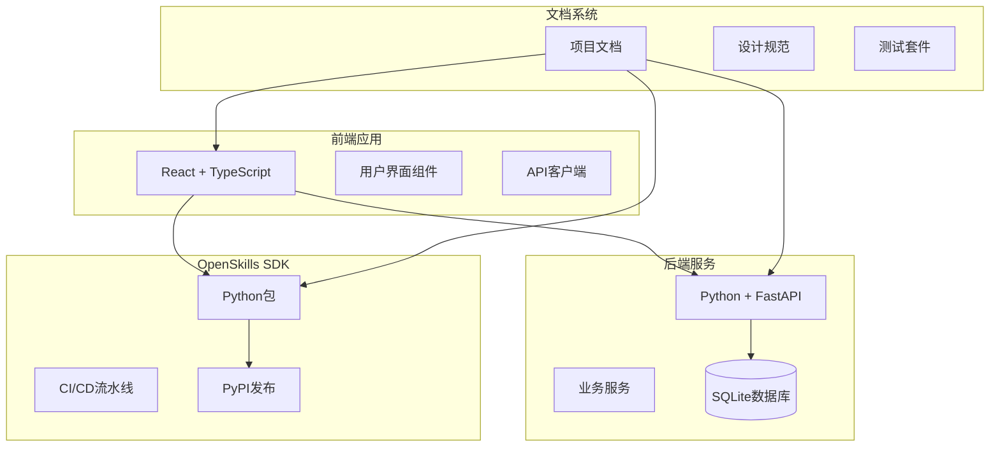
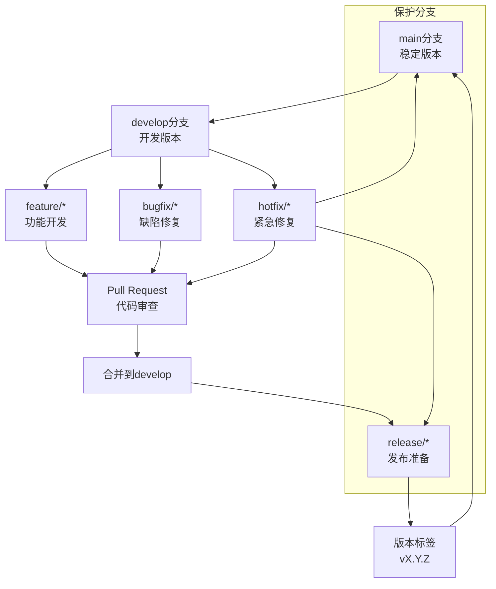
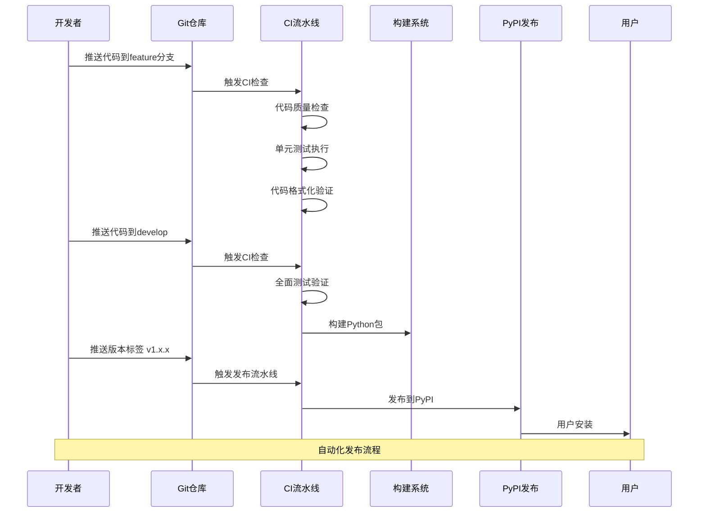
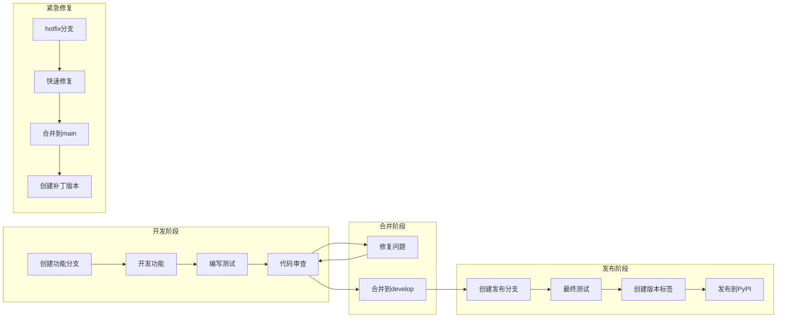
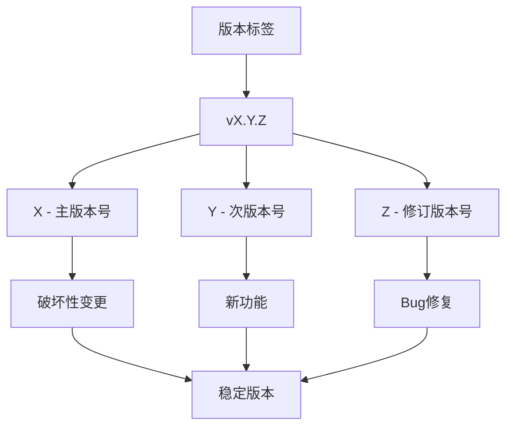
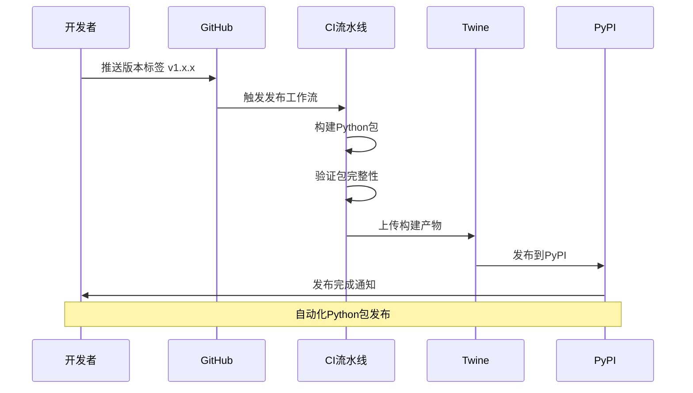
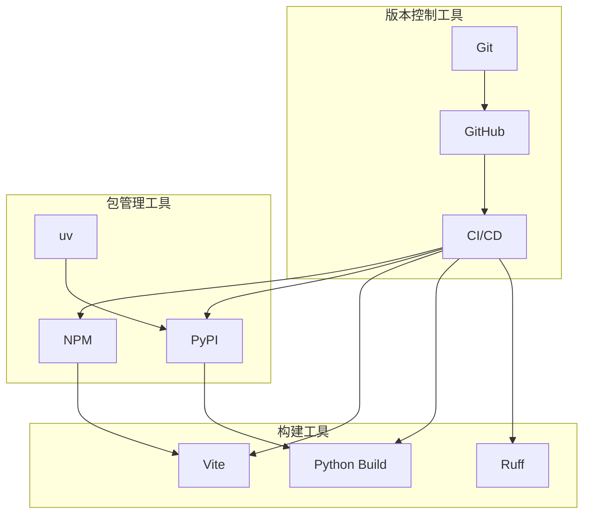
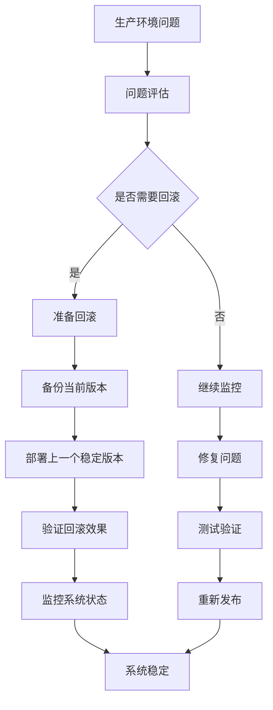

# 版本控制策略

<cite>
**本文档引用的文件**
- [package.json](file://package.json)
- [pyproject.toml](file://OpenSkills-main/pyproject.toml)
- [ci.yml](file://OpenSkills-main/.github/workflows/ci.yml)
- [publish.yml](file://OpenSkills-main/.github/workflows/publish.yml)
- [README.md](file://OpenSkills-main/README.md)
- [可维护性设计.md](file://docs/非功能设计/可维护性设计.md)
- [命名规范.md](file://docs/基础规范/命名规范.md)
- [.gitignore](file://.gitignore)
</cite>

## 目录
1. [简介](#简介)
2. [项目结构](#项目结构)
3. [核心组件](#核心组件)
4. [架构概览](#架构概览)
5. [详细组件分析](#详细组件分析)
6. [依赖关系分析](#依赖关系分析)
7. [性能考虑](#性能考虑)
8. [故障排除指南](#故障排除指南)
9. [结论](#结论)

## 简介

AutoMate项目采用多语言混合架构，包含前端React应用、后端Python服务以及OpenSkills SDK组件。本文档制定了完整的版本控制和发布管理策略，涵盖分支管理模型、版本号规则、Git工作流程、发布检查清单以及回滚策略。

## 项目结构

AutoMate项目采用模块化组织结构，主要包含以下核心部分：

**图表来源**
- [package.json](file://package.json#L1-L47)
- [pyproject.toml](file://OpenSkills-main/pyproject.toml#L1-L75)

**章节来源**
- [package.json](file://package.json#L1-L47)
- [pyproject.toml](file://OpenSkills-main/pyproject.toml#L1-L75)

## 核心组件

### 分支管理模型

AutoMate项目采用Git Flow分支管理模型，结合功能驱动的开发流程：

**图表来源**
- [可维护性设计.md](file://docs/非功能设计/可维护性设计.md#L382-L397)

### 版本号规则

项目采用语义化版本控制（SemVer）规范：

| 版本类型 | 语义 | 触发条件 | 示例 |
|---------|------|----------|------|
| MAJOR | 不兼容的API修改 | 破坏性变更 | 2.0.0 |
| MINOR | 向下兼容的功能新增 | 新功能发布 | 1.1.0 |
| PATCH | 向下兼容的问题修正 | Bug修复 | 1.0.1 |

**章节来源**
- [可维护性设计.md](file://docs/非功能设计/可维护性设计.md#L415-L432)

## 架构概览

### CI/CD流水线架构

**图表来源**
- [ci.yml](file://OpenSkills-main/.github/workflows/ci.yml#L1-L32)
- [publish.yml](file://OpenSkills-main/.github/workflows/publish.yml#L1-L99)

### Git工作流程

项目采用集中式Git工作流程，结合严格的代码审查机制：

**章节来源**
- [命名规范.md](file://docs/基础规范/命名规范.md#L296-L329)

## 详细组件分析

### 分支管理策略

#### 主分支保护

主分支采用严格的保护策略：

- **强制合并要求**：必须通过CI检查和代码审查
- **管理员权限**：仅限项目维护者推送
- **标签保护**：禁止直接推送标签到主分支
- **签名要求**：所有提交必须包含GPG签名

#### 功能分支策略

功能分支采用基于功能的命名约定：

| 分支类型 | 命名模式 | 使用场景 |
|---------|----------|----------|
| 功能开发 | `feature/模块名-功能描述` | 新功能开发 |
| 缺陷修复 | `bugfix/模块名-问题描述` | Bug修复 |
| 紧急修复 | `hotfix/紧急问题描述` | 生产环境紧急修复 |
| 发布准备 | `release/version` | 版本发布准备 |

#### 版本标签管理

版本标签采用标准化格式：

**图表来源**
- [publish.yml](file://OpenSkills-main/.github/workflows/publish.yml#L4-L6)

**章节来源**
- [可维护性设计.md](file://docs/非功能设计/可维护性设计.md#L382-L397)

### 提交信息规范

项目采用Conventional Commits规范：

| 类型 | 描述 | 示例 |
|------|------|------|
| feat | 新功能 | `feat(agent): add agent search functionality` |
| fix | 修复bug | `fix(chat): resolve message display issue` |
| docs | 文档更新 | `docs: update installation guide` |
| style | 代码格式调整 | `style: format code according to standards` |
| refactor | 重构 | `refactor(api): optimize request handling` |
| perf | 性能优化 | `perf(database): improve query performance` |
| test | 测试相关 | `test(agent): add unit tests` |
| chore | 构建配置 | `chore(deps): update dependencies` |

**章节来源**
- [命名规范.md](file://docs/基础规范/命名规范.md#L300-L329)

### 发布流程

#### Python包发布流程

**图表来源**
- [publish.yml](file://OpenSkills-main/.github/workflows/publish.yml#L1-L99)

#### 前端应用发布流程

前端应用采用静态站点部署策略：

1. **构建阶段**：TypeScript编译和Vite打包
2. **测试阶段**：单元测试和集成测试
3. **部署阶段**：静态文件部署到CDN
4. **验证阶段**：健康检查和功能验证

**章节来源**
- [package.json](file://package.json#L6-L13)

### 版本发布检查清单

#### 代码质量检查

- [ ] 所有代码通过ESLint检查
- [ ] TypeScript类型检查通过
- [ ] Python代码通过Ruff检查
- [ ] 代码格式化符合规范
- [ ] 单元测试覆盖率≥80%
- [ ] 集成测试通过

#### 文档更新检查

- [ ] API文档更新
- [ ] 用户手册更新
- [ ] 开发指南更新
- [ ] 变更日志更新
- [ ] 发布说明生成

#### 兼容性检查

- [ ] 向后兼容性验证
- [ ] 跨平台兼容性测试
- [ ] 依赖版本锁定
- [ ] 环境配置验证

**章节来源**
- [可维护性设计.md](file://docs/非功能设计/可维护性设计.md#L470-L483)

## 依赖关系分析

### 版本控制依赖

**图表来源**
- [ci.yml](file://OpenSkills-main/.github/workflows/ci.yml#L1-L32)
- [publish.yml](file://OpenSkills-main/.github/workflows/publish.yml#L1-L99)

### 依赖版本管理

项目采用严格的依赖版本管理策略：

- **前端依赖**：使用package-lock.json锁定版本
- **Python依赖**：使用uv.lock锁定版本
- **开发依赖**：明确版本范围和兼容性
- **运行时依赖**：固定版本确保稳定性

**章节来源**
- [package.json](file://package.json#L15-L45)
- [pyproject.toml](file://OpenSkills-main/pyproject.toml#L22-L28)

## 性能考虑

### CI/CD性能优化

1. **并行执行**：多个测试任务并行运行
2. **缓存策略**：依赖缓存和构建缓存
3. **增量构建**：仅构建变更的模块
4. **资源优化**：合理分配CI资源

### 发布性能优化

1. **多阶段构建**：构建和发布分离
2. **并行发布**：多个包并行发布
3. **CDN加速**：静态资源CDN分发
4. **镜像优化**：容器镜像层优化

## 故障排除指南

### 常见问题及解决方案

#### 分支合并冲突

**问题**：feature分支与develop分支合并失败
**解决方案**：
1. 更新develop分支到最新状态
2. rebase feature分支到develop
3. 解决冲突后提交
4. 创建Pull Request

#### CI检查失败

**问题**：CI流水线执行失败
**解决方案**：
1. 检查代码质量检查结果
2. 运行本地测试验证
3. 修复格式化问题
4. 重新触发CI流水线

#### 发布失败

**问题**：PyPI发布失败
**解决方案**：
1. 检查包构建状态
2. 验证包完整性
3. 检查PyPI认证
4. 重新发布

**章节来源**
- [可维护性设计.md](file://docs/非功能设计/可维护性设计.md#L378-L432)

### 回滚策略

#### 紧急回滚流程

#### 版本回滚检查清单

- [ ] 确认问题影响范围
- [ ] 选择合适的回滚版本
- [ ] 通知相关团队
- [ ] 执行回滚操作
- [ ] 验证系统功能
- [ ] 监控系统状态
- [ ] 记录回滚过程

**章节来源**
- [可维护性设计.md](file://docs/非功能设计/可维护性设计.md#L378-L432)

## 结论

AutoMate项目的版本控制和发布管理策略建立了完善的多语言混合开发流程。通过采用Git Flow分支模型、语义化版本控制、自动化CI/CD流水线以及严格的发布检查清单，确保了代码质量和发布效率。

关键成功因素包括：
1. **标准化流程**：统一的分支管理和提交规范
2. **自动化工具**：CI/CD流水线减少人工干预
3. **质量保证**：全面的测试和代码审查机制
4. **文档管理**：完整的文档更新和版本同步
5. **应急响应**：完善的回滚和紧急修复流程

该策略为项目的长期发展奠定了坚实的技术基础，支持团队高效协作和持续交付。