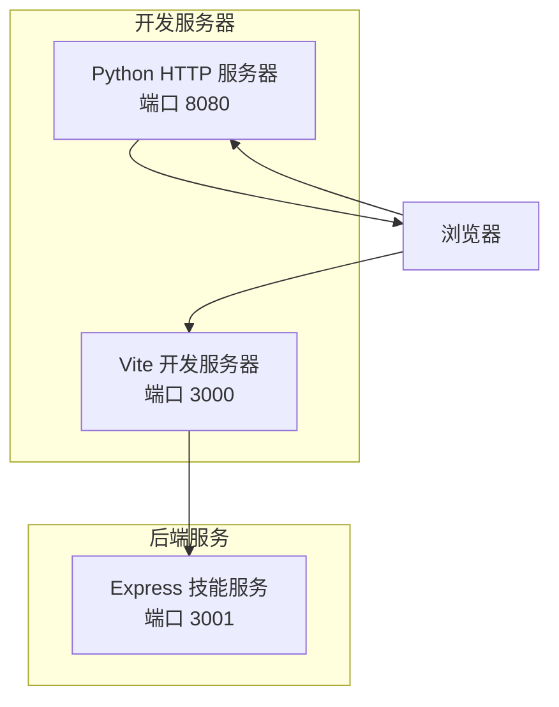
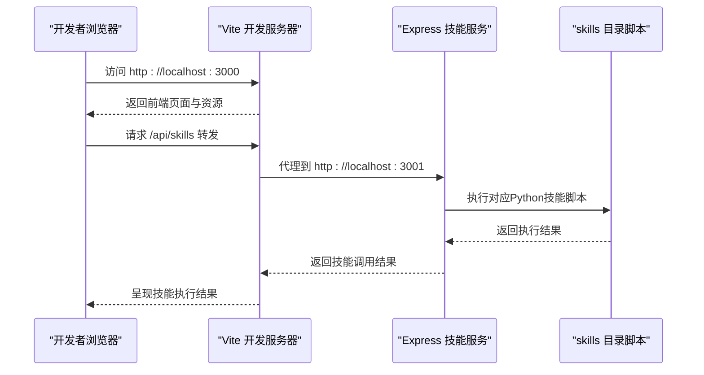
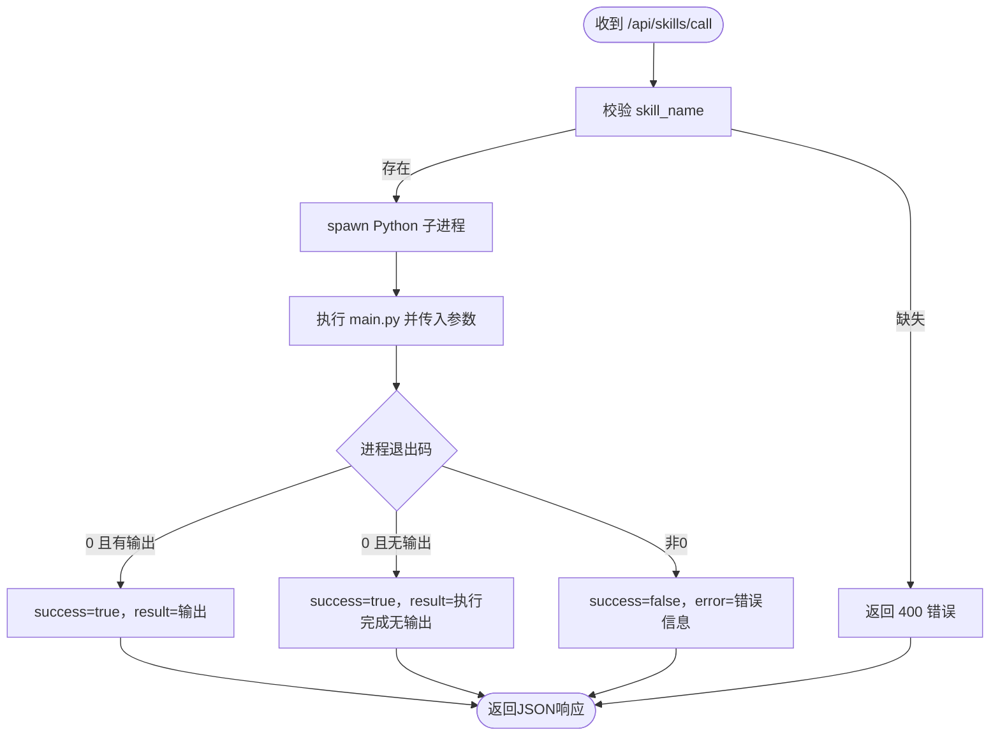
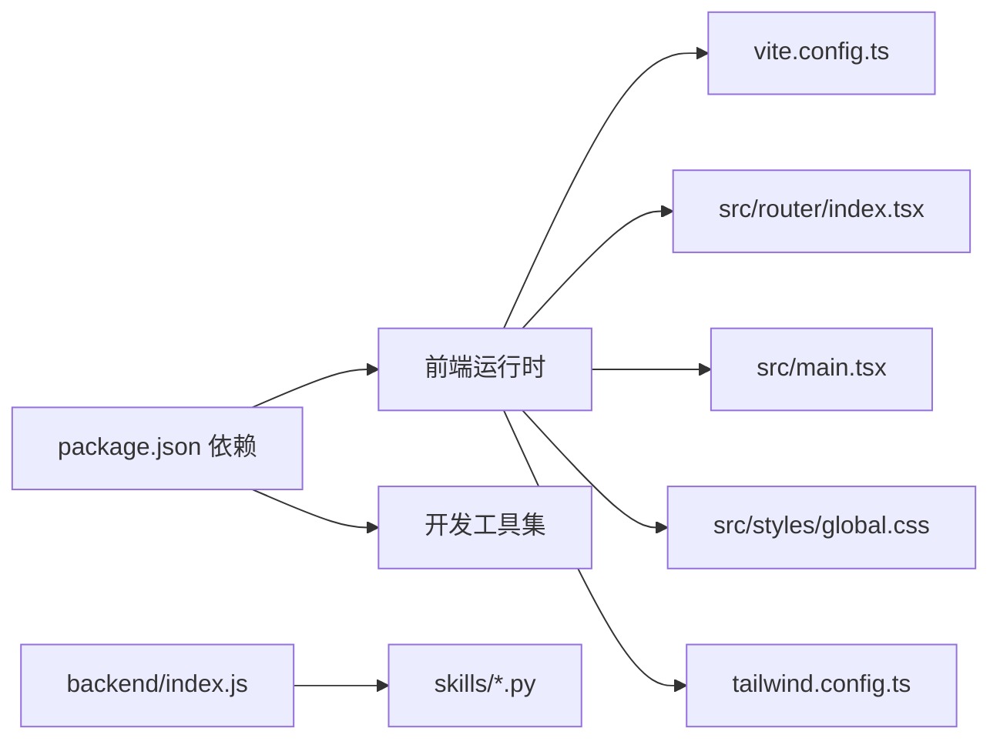

# 开发环境配置

<cite>
**本文引用的文件**
- [package.json](file://package.json)
- [vite.config.ts](file://vite.config.ts)
- [backend/index.js](file://backend/index.js)
- [docs/基础规范/开发环境配置.md](file://docs/基础规范/开发环境配置.md)
- [config/agents.json](file://config/agents.json)
- [prototypes/MainLayout.html](file://prototypes/MainLayout.html)
- [src/main.tsx](file://src/main.tsx)
- [src/router/index.tsx](file://src/router/index.tsx)
- [tailwind.config.ts](file://tailwind.config.ts)
- [src/components/MainLayout.tsx](file://src/components/MainLayout.tsx)
- [src/styles/global.css](file://src/styles/global.css)
- [postcss.config.js](file://postcss.config.js)
- [skills/weather_query/main.py](file://skills/weather_query/main.py)
- [main_correct.py](file://main_correct.py)
</cite>

## 目录
1. [简介](#简介)
2. [项目结构](#项目结构)
3. [核心组件](#核心组件)
4. [架构总览](#架构总览)
5. [详细组件分析](#详细组件分析)
6. [依赖关系分析](#依赖关系分析)
7. [性能考虑](#性能考虑)
8. [故障排查指南](#故障排查指南)
9. [结论](#结论)
10. [附录](#附录)

## 简介
本指南面向AutoMate项目的开发团队，提供从零到一的开发环境搭建与运行说明，重点覆盖：
- 正确启动Python HTTP服务器与Vite开发服务器的位置与路径规范
- 项目根目录启动的重要性与常见错误做法
- 目录结构规范、关键目录权限要求与资源配置
- 端口配置、端口冲突处理与网络代理配置
- 浏览器开发者工具使用指南（Console、Network、Elements、Sources）
- 常见问题排查（配置文件加载失败、样式加载失败、JavaScript错误）
- 最佳实践（开发流程、错误处理策略、性能优化技巧）

## 项目结构
AutoMate采用前后端分离的混合架构：
- 前端基于React + Vite，构建与开发由Vite负责
- 后端提供技能调用服务，使用Express监听本地端口
- 原型与静态资源通过Python内置HTTP服务器提供
- 配置文件与技能脚本位于项目根目录下的特定目录

图表来源
- [vite.config.ts](file://vite.config.ts#L12-L30)
- [backend/index.js](file://backend/index.js#L113-L116)
- [docs/基础规范/开发环境配置.md](file://docs/基础规范/开发环境配置.md#L4-L47)

章节来源
- [package.json](file://package.json#L6-L13)
- [vite.config.ts](file://vite.config.ts#L12-L30)
- [backend/index.js](file://backend/index.js#L113-L116)
- [docs/基础规范/开发环境配置.md](file://docs/基础规范/开发环境配置.md#L4-L47)

## 核心组件
- Vite开发服务器：负责前端资源的热更新与打包，端口默认3000，开启自动打开浏览器与文件系统允许列表
- Express技能服务：提供技能调用API，监听3001端口，执行skills目录下的Python脚本
- Python HTTP服务器：用于原型页面与静态资源访问，推荐在项目根目录启动，端口8080
- 前端入口与路由：React应用入口与路由配置，加载全局样式与Tailwind样式
- 配置文件agents.json：前端通过绝对路径加载，作为智能体与技能的配置源

章节来源
- [vite.config.ts](file://vite.config.ts#L12-L30)
- [backend/index.js](file://backend/index.js#L113-L116)
- [docs/基础规范/开发环境配置.md](file://docs/基础规范/开发环境配置.md#L13-L47)
- [src/main.tsx](file://src/main.tsx#L1-L12)
- [src/router/index.tsx](file://src/router/index.tsx#L1-L43)
- [config/agents.json](file://config/agents.json#L1-L119)

## 架构总览
下图展示开发阶段的请求流与组件交互：

图表来源
- [vite.config.ts](file://vite.config.ts#L18-L29)
- [backend/index.js](file://backend/index.js#L81-L104)

章节来源
- [vite.config.ts](file://vite.config.ts#L18-L29)
- [backend/index.js](file://backend/index.js#L81-L104)

## 详细组件分析

### Vite开发服务器配置
- 端口：3000
- 自动打开浏览器：true
- 文件系统允许：允许访问上层目录（解决原型与静态资源访问）
- 代理规则：
  - /api/proxy → 目标 https://api.fgw.sz.gov.cn:9016，路径重写
  - /api/skills → 目标 http://localhost:3001，转发至后端技能服务
- 构建产物：dist目录，启用SourceMap，按vendor拆分代码块

章节来源
- [vite.config.ts](file://vite.config.ts#L12-L46)

### Express技能服务
- 端口：3001
- 路由：
  - POST /api/skills/call：接收skill_name与parameters，调用对应Python脚本
  - GET /api/skills：健康检查
- 执行逻辑：定位skills/{skillName}/main.py，传入JSON参数，捕获stdout/stderr，返回统一结构

图表来源
- [backend/index.js](file://backend/index.js#L19-L79)
- [backend/index.js](file://backend/index.js#L81-L104)

章节来源
- [backend/index.js](file://backend/index.js#L11-L116)

### Python HTTP服务器与路径规范
- 必须在项目根目录启动，避免访问上级目录的安全限制
- 原型页面与静态资源通过绝对路径访问，如/config/agents.json
- 常用端口：8080；端口冲突时需检查占用并更换端口

章节来源
- [docs/基础规范/开发环境配置.md](file://docs/基础规范/开发环境配置.md#L7-L47)

### 前端入口与路由
- 入口：src/main.tsx，挂载React根节点，引入全局样式与Tailwind样式
- 路由：src/router/index.tsx，定义欢迎页、Agent聊天页、设置页与通配符重定向
- 主布局：src/components/MainLayout.tsx，通过fetch加载agents.json，渲染侧边栏与内容区

章节来源
- [src/main.tsx](file://src/main.tsx#L1-L12)
- [src/router/index.tsx](file://src/router/index.tsx#L1-L43)
- [src/components/MainLayout.tsx](file://src/components/MainLayout.tsx#L17-L49)

### 样式与主题
- Tailwind配置：content扫描范围包含src与根html，启用暗色模式类名
- 全局样式：定义CSS变量与深浅主题切换，提供滚动条、动画、响应式等通用样式
- PostCSS：集成Tailwind与Autoprefixer

章节来源
- [tailwind.config.ts](file://tailwind.config.ts#L1-L161)
- [src/styles/global.css](file://src/styles/global.css#L1-L664)
- [postcss.config.js](file://postcss.config.js#L1-L7)

### 技能脚本示例
- skills/weather_query/main.py：天气查询技能，支持中文城市名识别与参数传递
- main_correct.py：示例脚本，演示参数解析与输出格式化

章节来源
- [skills/weather_query/main.py](file://skills/weather_query/main.py#L1-L139)
- [main_correct.py](file://main_correct.py#L1-L75)

## 依赖关系分析
- 前端依赖：React、React Router、Zustand、Lucide等
- 开发依赖：Vite、TypeScript、TailwindCSS、ESLint等
- 后端依赖：Express、CORS、child_process（调用Python脚本）
- 构建链路：TypeScript编译 → Vite打包 → dist输出

图表来源
- [package.json](file://package.json#L15-L44)
- [vite.config.ts](file://vite.config.ts#L1-L46)
- [src/router/index.tsx](file://src/router/index.tsx#L1-L43)
- [src/main.tsx](file://src/main.tsx#L1-L12)
- [src/styles/global.css](file://src/styles/global.css#L1-L664)
- [tailwind.config.ts](file://tailwind.config.ts#L1-L161)
- [backend/index.js](file://backend/index.js#L1-L12)

章节来源
- [package.json](file://package.json#L15-L44)

## 性能考虑
- 减少刷新次数：使用Vite热重载，仅修改必要代码
- 缓存管理：开发时禁用缓存，必要时强制刷新
- 构建优化：启用SourceMap便于调试；按vendor拆分代码块降低首屏包体
- 网络代理：合理配置代理，避免不必要的跨域与重复请求

## 故障排查指南

### 配置文件加载失败
- 症状：控制台出现“Failed to load agents configuration”或Network显示404
- 排查步骤：
  - 确认在项目根目录启动Python HTTP服务器
  - 检查浏览器Network标签中的请求状态与响应
  - 确认agents.json路径与内容格式正确
- 相关文件
  - [src/components/MainLayout.tsx](file://src/components/MainLayout.tsx#L18-L49)
  - [config/agents.json](file://config/agents.json#L1-L119)

章节来源
- [src/components/MainLayout.tsx](file://src/components/MainLayout.tsx#L18-L49)
- [config/agents.json](file://config/agents.json#L1-L119)

### 样式加载失败
- 症状：页面样式异常或主题不生效
- 排查步骤：
  - 检查全局样式与Tailwind样式是否正确引入
  - 清除浏览器缓存或强制刷新
  - 检查Network标签中的CSS加载状态
- 相关文件
  - [src/main.tsx](file://src/main.tsx#L4-L5)
  - [src/styles/global.css](file://src/styles/global.css#L1-L664)
  - [tailwind.config.ts](file://tailwind.config.ts#L1-L161)

章节来源
- [src/main.tsx](file://src/main.tsx#L4-L5)
- [src/styles/global.css](file://src/styles/global.css#L1-L664)
- [tailwind.config.ts](file://tailwind.config.ts#L1-L161)

### JavaScript错误
- 症状：控制台报语法错误、变量未定义或异步错误
- 排查步骤：
  - 打开Sources标签定位具体行号
  - 结合Console日志与Network请求进行上下文分析
- 相关文件
  - [src/router/index.tsx](file://src/router/index.tsx#L1-L43)
  - [src/components/MainLayout.tsx](file://src/components/MainLayout.tsx#L1-L134)

章节来源
- [src/router/index.tsx](file://src/router/index.tsx#L1-L43)
- [src/components/MainLayout.tsx](file://src/components/MainLayout.tsx#L1-L134)

### 端口冲突
- 症状：启动失败并提示端口占用
- 处理步骤：
  - 检查端口占用：netstat -ano | findstr :8080 / 3000 / 3001
  - 更换端口：修改Python HTTP服务器端口或Vite/Express配置
  - 停止占用进程：taskkill /PID <pid> /F
- 相关文件
  - [docs/基础规范/开发环境配置.md](file://docs/基础规范/开发环境配置.md#L156-L167)
  - [vite.config.ts](file://vite.config.ts#L12-L14)
  - [backend/index.js](file://backend/index.js#L12-L12)

章节来源
- [docs/基础规范/开发环境配置.md](file://docs/基础规范/开发环境配置.md#L156-L167)
- [vite.config.ts](file://vite.config.ts#L12-L14)
- [backend/index.js](file://backend/index.js#L12-L12)

### 技能调用失败
- 症状：/api/skills/call返回错误或无输出
- 排查步骤：
  - 检查技能脚本路径与参数传递
  - 查看后端控制台日志与stderr输出
  - 确认Python环境与第三方库可用
- 相关文件
  - [backend/index.js](file://backend/index.js#L19-L79)
  - [skills/weather_query/main.py](file://skills/weather_query/main.py#L1-L139)

章节来源
- [backend/index.js](file://backend/index.js#L19-L79)
- [skills/weather_query/main.py](file://skills/weather_query/main.py#L1-L139)

## 结论
- 开发服务器必须在项目根目录启动，确保静态资源与配置文件的正确访问
- Vite与Express分别承担前端开发与后端技能服务，代理配置是关键
- 前端通过绝对路径加载agents.json，确保与生产环境一致
- 使用浏览器开发者工具进行快速定位与修复，结合端口冲突处理与缓存策略提升开发效率

## 附录

### 开发流程最佳实践
- 在项目根目录启动Python HTTP服务器与Vite开发服务器
- 打开浏览器访问原型页面与前端应用，使用开发者工具实时调试
- 修改代码后保存，利用热重载观察效果
- 对配置文件与网络请求进行错误处理与日志记录

章节来源
- [docs/基础规范/开发环境配置.md](file://docs/基础规范/开发环境配置.md#L198-L236)

### 浏览器开发者工具使用指南
- Console：查看JavaScript错误与日志
- Network：检查静态资源与API请求状态
- Elements：检查DOM结构与样式
- Sources：调试JavaScript代码与断点

章节来源
- [docs/基础规范/开发环境配置.md](file://docs/基础规范/开发环境配置.md#L168-L197)