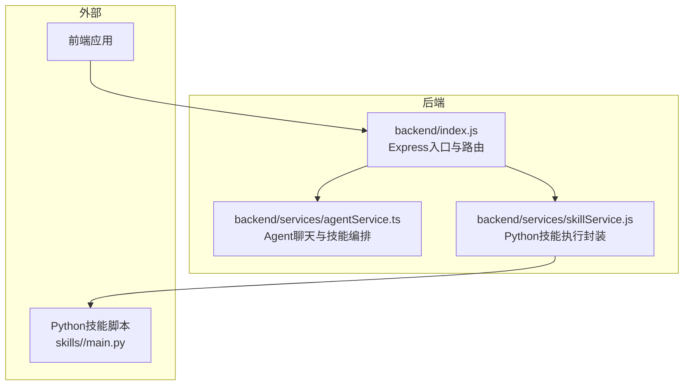
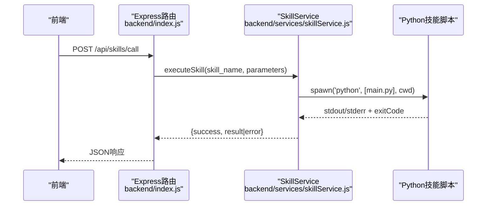
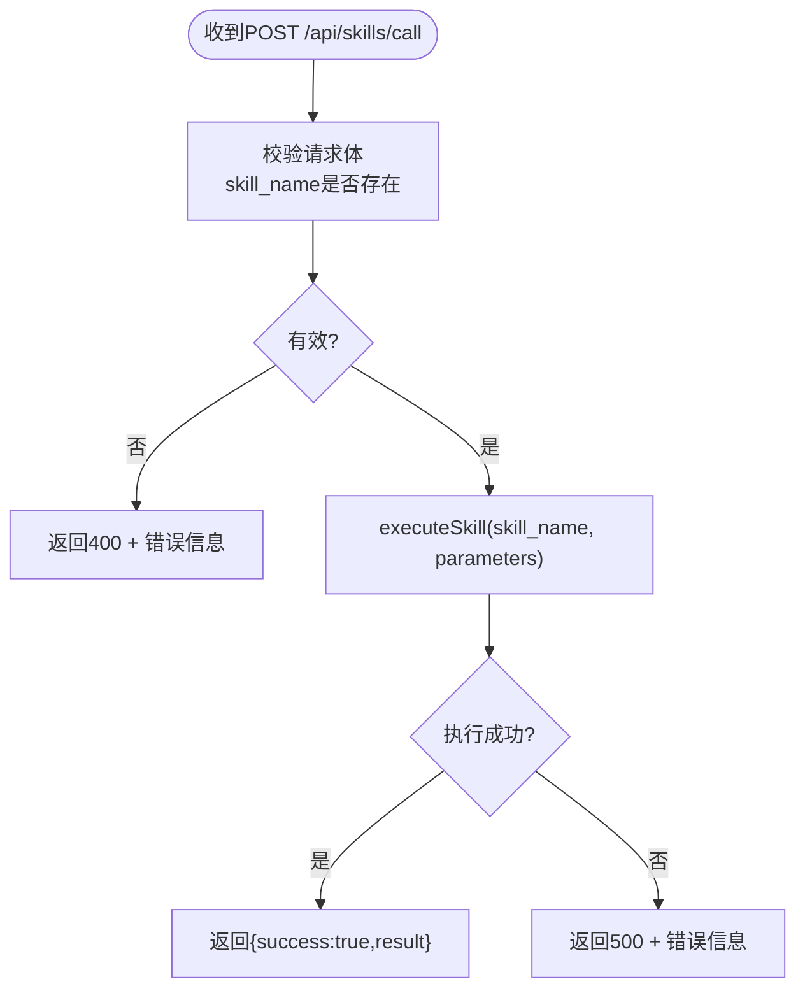
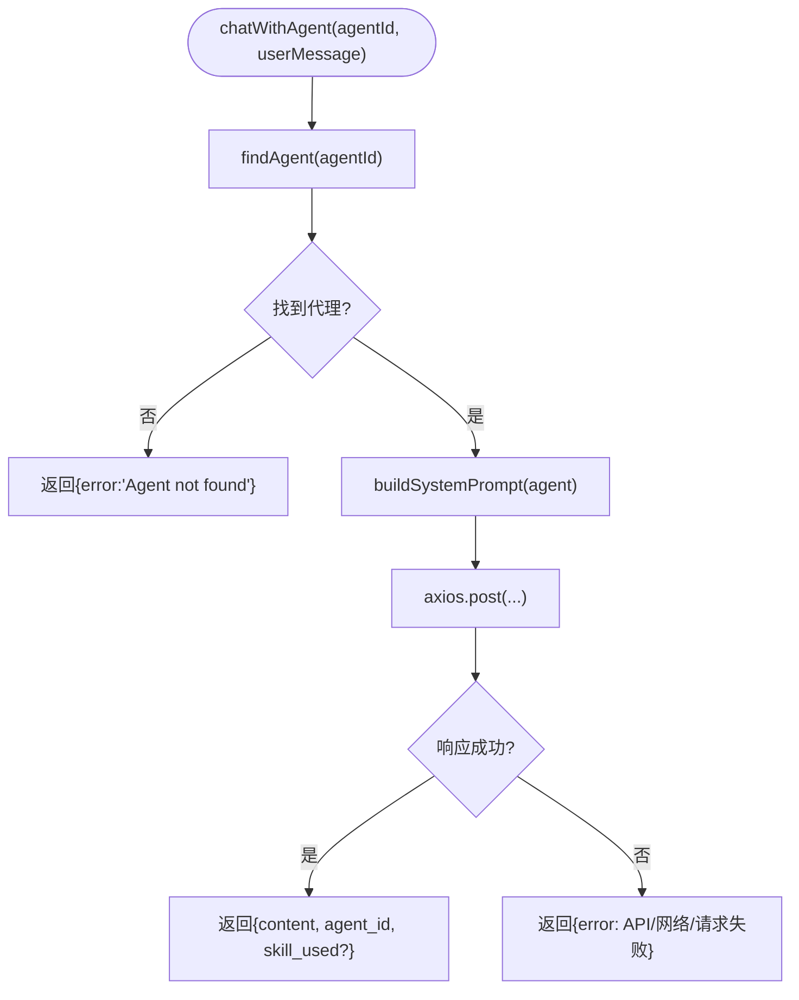
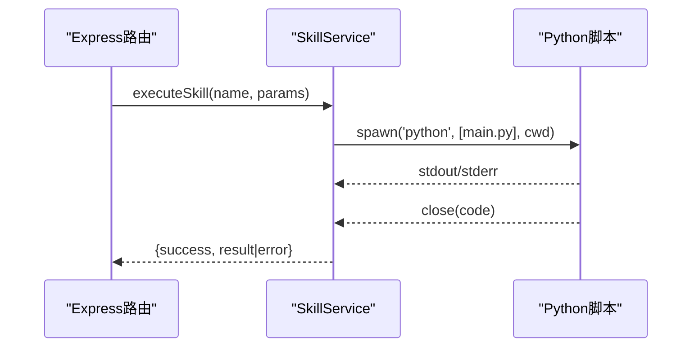
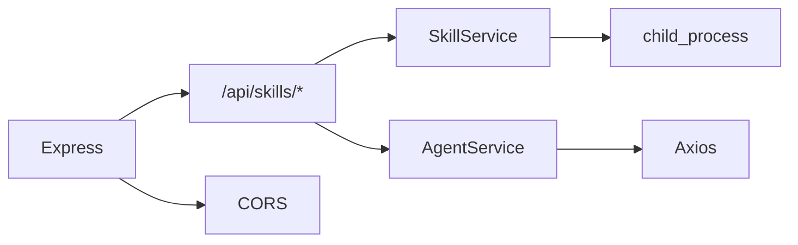

# Node.js后端规范

<cite>
**本文引用的文件**
- [backend/index.js](file://backend/index.js)
- [backend/services/agentService.ts](file://backend/services/agentService.ts)
- [backend/services/skillService.js](file://backend/services/skillService.js)
- [docs/基础规范/编码规范.md](file://docs/基础规范/编码规范.md)
- [package.json](file://package.json)
</cite>

## 目录
1. [简介](#简介)
2. [项目结构](#项目结构)
3. [核心组件](#核心组件)
4. [架构总览](#架构总览)
5. [详细组件分析](#详细组件分析)
6. [依赖关系分析](#依赖关系分析)
7. [性能考量](#性能考量)
8. [故障排查指南](#故障排查指南)
9. [结论](#结论)
10. [附录](#附录)

## 简介
本规范面向AutoMate项目的Node.js后端，聚焦于JavaScript代码风格、JSDoc注释、异步编程、错误处理、Express路由设计与实现，并结合AgentService与SkillService的实际实现模式给出落地建议与最佳实践。目标是统一代码风格、提升可读性与可维护性，降低集成风险。

## 项目结构
后端采用按职责分层的组织方式：
- 入口与路由：backend/index.js 提供REST接口与技能执行能力
- 服务层：backend/services 下包含AgentService与SkillService
- 配置与工具：backend/config、backend/utils（当前为空或未使用）
- 文档与规范：docs/基础规范/编码规范.md 提供统一的编码与风格指导

图表来源
- [backend/index.js](file://backend/index.js#L1-L117)
- [backend/services/agentService.ts](file://backend/services/agentService.ts#L1-L245)
- [backend/services/skillService.js](file://backend/services/skillService.js#L1-L87)

章节来源
- [backend/index.js](file://backend/index.js#L1-L117)
- [backend/services/agentService.ts](file://backend/services/agentService.ts#L1-L245)
- [backend/services/skillService.js](file://backend/services/skillService.js#L1-L87)

## 核心组件
- Express入口与路由：提供技能调用与健康检查接口，内置CORS与JSON解析
- AgentService：加载代理配置、构建系统提示词、调用LLM完成对话与技能执行
- SkillService：封装Python子进程执行流程，统一返回结构

章节来源
- [backend/index.js](file://backend/index.js#L1-L117)
- [backend/services/agentService.ts](file://backend/services/agentService.ts#L1-L245)
- [backend/services/skillService.js](file://backend/services/skillService.js#L1-L87)

## 架构总览
后端通过Express提供HTTP接口，内部通过SkillService与AgentService分别对接Python技能与LLM聊天能力。SkillService负责子进程管理与结果归一化；AgentService负责代理配置加载、提示词构建与LLM调用。

图表来源
- [backend/index.js](file://backend/index.js#L81-L104)
- [backend/services/skillService.js](file://backend/services/skillService.js#L16-L87)

## 详细组件分析

### Express路由设计规范
- 中间件使用
  - CORS：允许跨域访问
  - JSON解析：支持application/json请求体
- 请求验证
  - 对必填字段进行校验（如skill_name），缺失时返回400
- 响应格式化
  - 统一返回结构：success布尔值，result或error字段
  - 异常时返回500并包含错误信息
- 错误传播
  - 捕获异常并向上游返回，避免内部错误泄露细节

图表来源
- [backend/index.js](file://backend/index.js#L81-L104)

章节来源
- [backend/index.js](file://backend/index.js#L14-L16)
- [backend/index.js](file://backend/index.js#L81-L104)

### AgentService实现模式
- 配置加载：从本地JSON文件读取代理与技能配置
- 提示词构建：解析技能描述并拼接系统提示
- LLM调用：通过Axios向远端模型服务发起请求，统一处理Axios错误
- 结果封装：返回标准化的聊天响应结构，包含错误信息便于上层处理

图表来源
- [backend/services/agentService.ts](file://backend/services/agentService.ts#L118-L185)

章节来源
- [backend/services/agentService.ts](file://backend/services/agentService.ts#L58-L78)
- [backend/services/agentService.ts](file://backend/services/agentService.ts#L98-L116)
- [backend/services/agentService.ts](file://backend/services/agentService.ts#L118-L185)

### SkillService实现模式
- 子进程执行：spawn Python脚本，传递参数并通过stdin注入输入
- 输出收集：监听stdout/stderr，汇总输出与错误
- 结果归一化：统一返回{success, result|error}结构
- 错误处理：捕获子进程错误与非零退出码，保证上层稳定

图表来源
- [backend/services/skillService.js](file://backend/services/skillService.js#L16-L87)

章节来源
- [backend/services/skillService.js](file://backend/services/skillService.js#L16-L87)

## 依赖关系分析
- Express：提供Web框架与路由
- Axios：用于调用远端LLM服务
- child_process：用于执行Python技能脚本
- CORS：跨域支持
- TypeScript：类型安全与IDE支持（AgentService）

图表来源
- [backend/index.js](file://backend/index.js#L1-L16)
- [backend/services/agentService.ts](file://backend/services/agentService.ts#L1-L1)
- [backend/services/skillService.js](file://backend/services/skillService.js#L1-L6)

章节来源
- [package.json](file://package.json#L15-L26)
- [backend/index.js](file://backend/index.js#L1-L16)

## 性能考量
- I/O密集：Python子进程与网络请求均可能成为瓶颈，建议：
  - 合理设置超时时间（AgentService中对Axios设置了超时）
  - 对频繁调用的技能进行缓存与去重
  - 控制并发数量，避免资源争用
- 序列化开销：统一响应结构，减少前端解析成本
- 日志频率：避免高频写入，保留关键路径日志

## 故障排查指南
- 技能执行失败
  - 检查Python脚本路径与权限
  - 查看stderr输出与退出码
  - 确认工作目录与环境变量
- LLM调用异常
  - 检查远端服务可用性与鉴权头
  - 关注Axios错误类型（响应/请求/未知）
- 路由错误
  - 确认CORS与JSON解析中间件顺序
  - 校验必填参数是否传入

章节来源
- [backend/index.js](file://backend/index.js#L81-L104)
- [backend/services/agentService.ts](file://backend/services/agentService.ts#L161-L184)
- [backend/services/skillService.js](file://backend/services/skillService.js#L58-L70)

## 结论
通过统一的代码风格、完善的JSDoc注释、一致的异步与错误处理策略以及清晰的Express路由设计，可以显著提升后端的稳定性与可维护性。建议在后续迭代中逐步引入控制器与中间件层，完善请求验证与日志体系，并补充单元测试与集成测试。

## 附录

### JavaScript代码风格规范
- 缩进与行长
  - 使用2空格缩进
  - 行长不超过100字符
- 函数分隔
  - 使用空行分隔函数与模块
- JSDoc注释
  - 为函数参数与返回值添加类型注解
  - 描述异常场景与抛出的错误
- 变量命名
  - 使用camelCase命名变量与函数
  - 使用PascalCase命名类

章节来源
- [docs/基础规范/编码规范.md](file://docs/基础规范/编码规范.md#L461-L520)
- [docs/基础规范/编码规范.md](file://docs/基础规范/编码规范.md#L639-L674)

### JSDoc注释规范
- 函数参数类型注解：使用@type或JSDoc类型标注
- 返回值描述：明确返回结构与含义
- 异常处理说明：列出可能抛出的错误类型与触发条件

章节来源
- [docs/基础规范/编码规范.md](file://docs/基础规范/编码规范.md#L482-L508)
- [docs/基础规范/编码规范.md](file://docs/基础规范/编码规范.md#L641-L659)

### 异步编程规范
- async/await优先：简化异步流程，提升可读性
- Promise链式调用：在必要时使用，注意错误捕获
- 错误捕获策略：在调用点集中处理异常，避免吞异常

章节来源
- [docs/基础规范/编码规范.md](file://docs/基础规范/编码规范.md#L521-L540)

### 错误处理规范
- 自定义错误类：定义领域特定错误，携带上下文信息
- 错误传播：在中间层统一包装，向上抛出结构化错误
- 日志记录：区分debug/log/warn/error级别，保留关键路径日志

章节来源
- [docs/基础规范/编码规范.md](file://docs/基础规范/编码规范.md#L542-L600)

### Express路由设计规范
- 中间件使用：CORS与JSON解析需置于路由之前
- 请求验证：对必填参数进行校验，返回明确错误
- 响应格式化：统一success/result/error结构，便于前端处理

章节来源
- [backend/index.js](file://backend/index.js#L14-L16)
- [backend/index.js](file://backend/index.js#L81-L104)

### AgentService实现要点
- 配置加载：从本地JSON读取代理与技能列表
- 提示词构建：解析技能描述并拼接系统提示
- LLM调用：统一处理Axios错误，返回结构化响应

章节来源
- [backend/services/agentService.ts](file://backend/services/agentService.ts#L58-L78)
- [backend/services/agentService.ts](file://backend/services/agentService.ts#L98-L116)
- [backend/services/agentService.ts](file://backend/services/agentService.ts#L118-L185)

### SkillService实现要点
- 子进程管理：spawn Python脚本，监听stdout/stderr
- 结果归一化：统一返回{success, result|error}
- 错误处理：捕获子进程错误与非零退出码

章节来源
- [backend/services/skillService.js](file://backend/services/skillService.js#L16-L87)