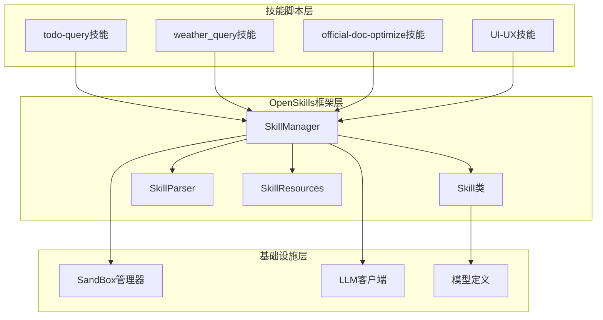
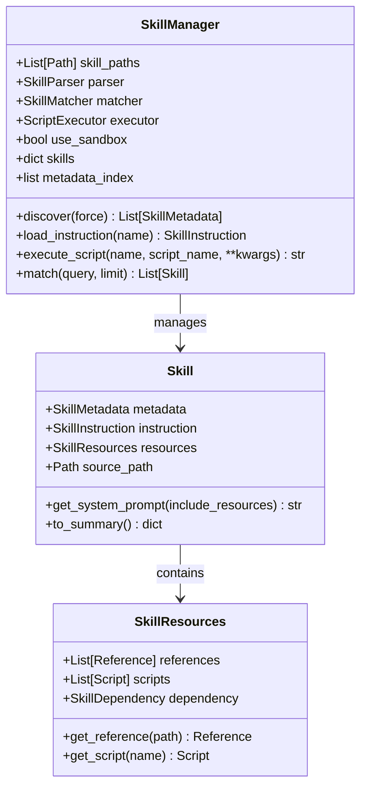
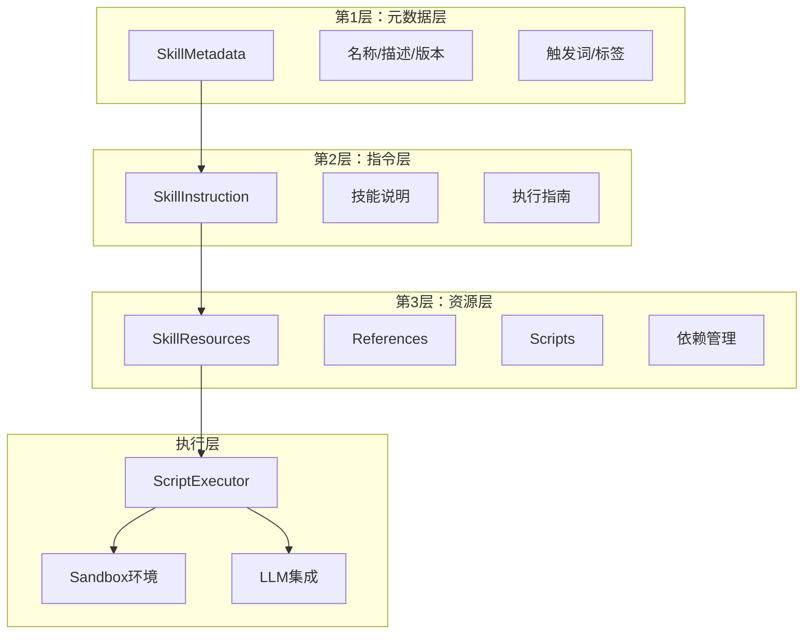
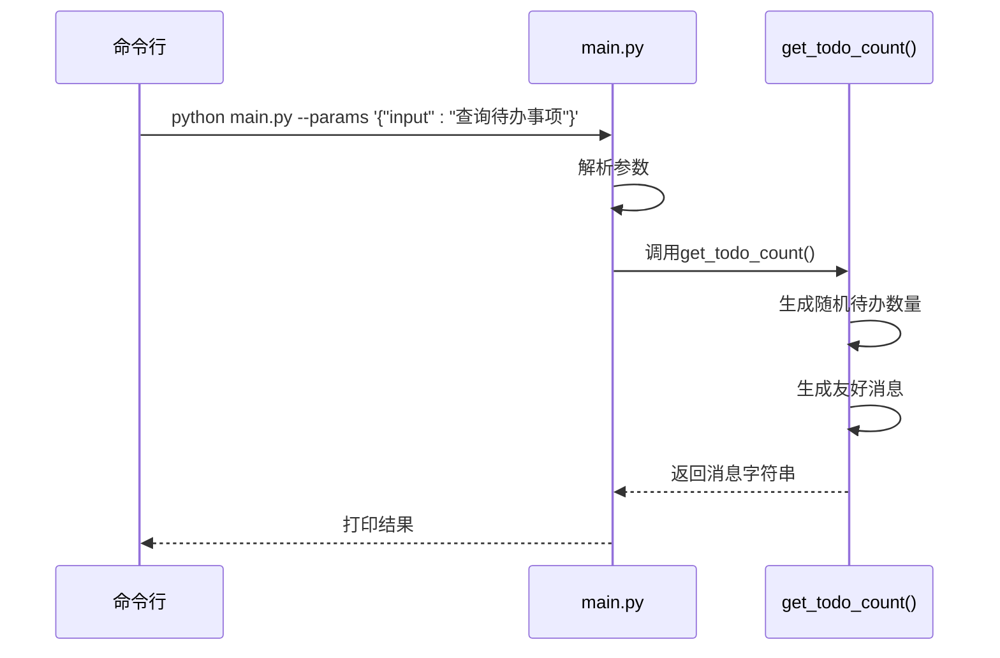
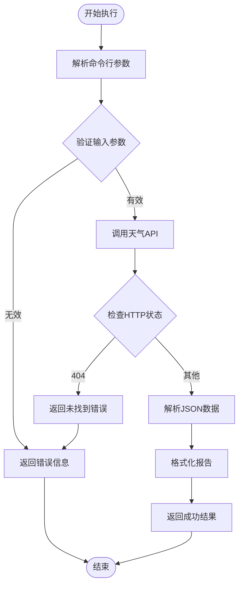
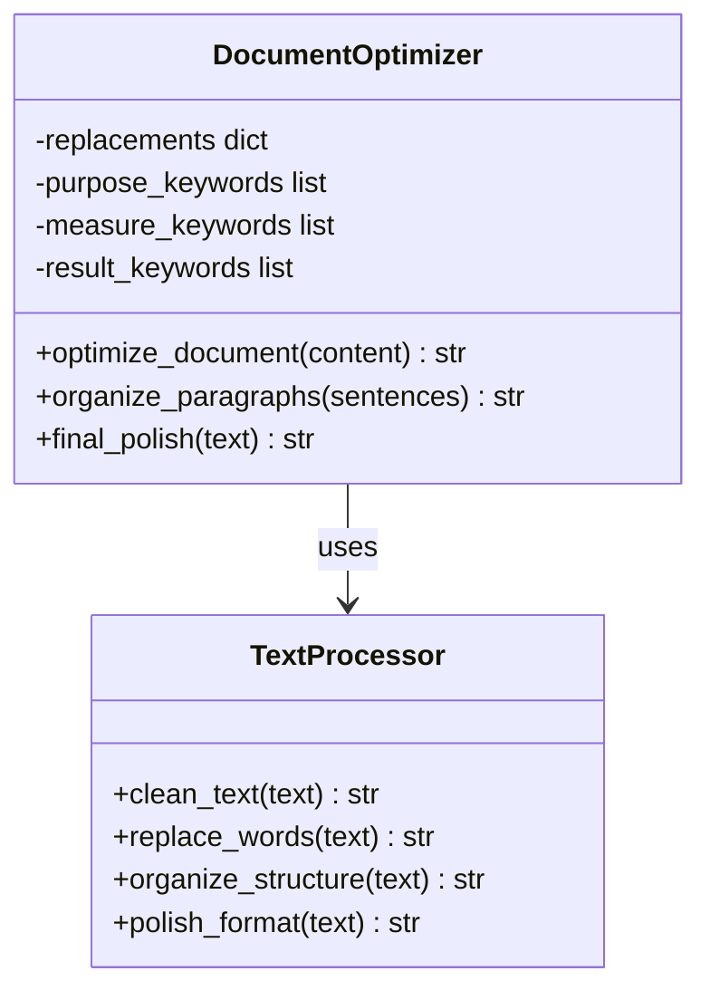
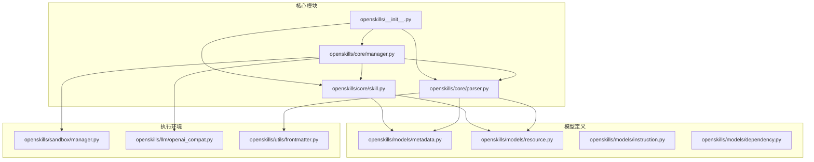

# Python技能脚本规范

<cite>
**本文档引用的文件**
- [skills/todo-query/main.py](file://skills/todo-query/main.py)
- [skills/todo-query/SKILL.md](file://skills/todo-query/SKILL.md)
- [skills/weather_query/main.py](file://skills/weather_query/main.py)
- [skills/official-doc-optimize/main.py](file://skills/official-doc-optimize/main.py)
- [OpenSkills-main/openskills/core/skill.py](file://OpenSkills-main/openskills/core/skill.py)
- [OpenSkills-main/openskills/core/manager.py](file://OpenSkills-main/openskills/core/manager.py)
- [OpenSkills-main/openskills/models/metadata.py](file://OpenSkills-main/openskills/models/metadata.py)
- [OpenSkills-main/openskills/models/resource.py](file://OpenSkills-main/openskills/models/resource.py)
- [OpenSkills-main/openskills/core/parser.py](file://OpenSkills-main/openskills/core/parser.py)
- [OpenSkills-main/openskills/__init__.py](file://OpenSkills-main/openskills/__init__.py)
- [OpenSkills-main/examples/demo.py](file://OpenSkills-main/examples/demo.py)
</cite>

## 目录
1. [引言](#引言)
2. [项目结构](#项目结构)
3. [核心组件](#核心组件)
4. [架构概览](#架构概览)
5. [详细组件分析](#详细组件分析)
6. [依赖分析](#依赖分析)
7. [性能考虑](#性能考虑)
8. [故障排除指南](#故障排除指南)
9. [结论](#结论)
10. [附录](#附录)

## 引言

AutoMate项目是一个基于OpenSkills框架的AI代理技能系统，专门用于开发和管理Python技能脚本。本文档制定了完整的Python技能脚本编码规范，涵盖函数定义、错误处理、模块组织、技能开发等各个方面，为开发者提供标准化的开发指导。

## 项目结构

AutoMate项目采用分层架构设计，主要包含以下核心组件：



**图表来源**
- [OpenSkills-main/openskills/core/manager.py](file://OpenSkills-main/openskills/core/manager.py#L24-L523)
- [OpenSkills-main/openskills/core/skill.py](file://OpenSkills-main/openskills/core/skill.py#L19-L150)

**章节来源**
- [OpenSkills-main/openskills/core/manager.py](file://OpenSkills-main/openskills/core/manager.py#L1-L523)
- [OpenSkills-main/openskills/core/skill.py](file://OpenSkills-main/openskills/core/skill.py#L1-L150)

## 核心组件

### 技能管理器（SkillManager）

SkillManager是OpenSkills框架的核心入口点，负责技能的发现、注册和生命周期管理。它实现了渐进式披露模式，按需懒加载技能内容。



**图表来源**
- [OpenSkills-main/openskills/core/manager.py](file://OpenSkills-main/openskills/core/manager.py#L24-L523)
- [OpenSkills-main/openskills/core/skill.py](file://OpenSkills-main/openskills/core/skill.py#L19-L150)
- [OpenSkills-main/openskills/models/resource.py](file://OpenSkills-main/openskills/models/resource.py#L180-L204)

### 技能元数据模型

技能元数据模型定义了技能的基本信息，支持快速发现和匹配。

**章节来源**
- [OpenSkills-main/openskills/models/metadata.py](file://OpenSkills-main/openskills/models/metadata.py#L11-L83)
- [OpenSkills-main/openskills/models/resource.py](file://OpenSkills-main/openskills/models/resource.py#L45-L110)

## 架构概览

AutoMate项目采用三层渐进式披露架构：



**图表来源**
- [OpenSkills-main/openskills/core/skill.py](file://OpenSkills-main/openskills/core/skill.py#L19-L150)
- [OpenSkills-main/openskills/models/metadata.py](file://OpenSkills-main/openskills/models/metadata.py#L11-L83)
- [OpenSkills-main/openskills/models/resource.py](file://OpenSkills-main/openskills/models/resource.py#L180-L204)

## 详细组件分析

### TodoQuery技能实现

TodoQuery技能展示了最简化的技能脚本实现模式：



**图表来源**
- [skills/todo-query/main.py](file://skills/todo-query/main.py#L23-L34)
- [skills/todo-query/main.py](file://skills/todo-query/main.py#L5-L21)

#### 函数定义规范

TodoQuery技能体现了以下函数定义最佳实践：

1. **函数命名约定**：使用下划线命名法，清晰表达功能
2. **参数处理**：简单直接的参数传递，无需复杂类型注解
3. **返回值格式**：统一返回字符串格式，便于前端展示

**章节来源**
- [skills/todo-query/main.py](file://skills/todo-query/main.py#L5-L21)

### WeatherQuery技能实现

WeatherQuery技能展示了复杂的技能脚本实现模式：



**图表来源**
- [skills/weather_query/main.py](file://skills/weather_query/main.py#L116-L139)
- [skills/weather_query/main.py](file://skills/weather_query/main.py#L100-L113)

#### 错误处理规范

WeatherQuery技能展示了完整的错误处理模式：

1. **异常捕获层次**：针对不同类型的异常进行专门处理
2. **错误信息格式化**：统一的错误消息格式，包含错误类型和详细信息
3. **返回值一致性**：所有分支都返回结构化的字典格式

**章节来源**
- [skills/weather_query/main.py](file://skills/weather_query/main.py#L83-L97)

### OfficialDocOptimize技能分析

OfficialDocOptimize技能展示了文本处理的最佳实践：



**图表来源**
- [skills/official-doc-optimize/main.py](file://skills/official-doc-optimize/main.py#L3-L113)
- [skills/official-doc-optimize/main.py](file://skills/official-doc-optimize/main.py#L116-L179)

**章节来源**
- [skills/official-doc-optimize/main.py](file://skills/official-doc-optimize/main.py#L1-L208)

## 依赖分析

### OpenSkills框架依赖关系



**图表来源**
- [OpenSkills-main/openskills/__init__.py](file://OpenSkills-main/openskills/__init__.py#L21-L49)
- [OpenSkills-main/openskills/core/manager.py](file://OpenSkills-main/openskills/core/manager.py#L15-L21)
- [OpenSkills-main/openskills/core/parser.py](file://OpenSkills-main/openskills/core/parser.py#L11-L16)

**章节来源**
- [OpenSkills-main/openskills/__init__.py](file://OpenSkills-main/openskills/__init__.py#L1-L50)
- [OpenSkills-main/openskills/core/manager.py](file://OpenSkills-main/openskills/core/manager.py#L1-L523)

## 性能考虑

### 渐进式披露优化

OpenSkills框架通过三层渐进式披露实现性能优化：

1. **元数据层快速加载**：仅加载必要信息用于发现和匹配
2. **指令层按需加载**：只有在需要时才加载详细的技能说明
3. **资源层条件加载**：根据上下文动态决定是否加载引用文件

### 内存管理策略


## 故障排除指南

### 常见错误类型及处理

| 错误类型 | 触发条件 | 处理方式 | 示例 |
|---------|---------|---------|------|
| 参数解析错误 | JSON参数格式不正确 | 捕获异常并返回默认值 | `except: pass` |
| 网络请求超时 | API响应时间超过阈值 | 设置合理超时时间 | `timeout=10` |
| 数据解析错误 | API返回格式不符合预期 | 检查键值存在性 | `data.get('key', default)` |
| 城市识别失败 | 输入城市不在支持列表中 | 提供友好的错误提示 | `return {'success': False, 'error': ...}` |

**章节来源**
- [skills/weather_query/main.py](file://skills/weather_query/main.py#L83-L97)
- [skills/todo-query/main.py](file://skills/todo-query/main.py#L28-L31)

### 调试技巧

1. **日志记录**：在关键步骤添加调试信息
2. **参数验证**：对所有外部输入进行验证
3. **异常链追踪**：保留原始异常信息
4. **资源清理**：确保所有打开的资源都被正确关闭

## 结论

AutoMate项目的Python技能脚本规范为开发者提供了完整的开发指导。通过遵循这些规范，可以确保技能脚本的一致性、可靠性和可维护性。关键要点包括：

1. **标准化的函数定义**：清晰的命名约定和参数处理
2. **健壮的错误处理**：多层次的异常捕获和错误信息格式化
3. **模块化组织**：合理的导入顺序和辅助函数组织
4. **OpenSkills框架集成**：正确的技能注册和参数传递机制

这些规范不仅适用于当前的技能实现，也为未来的技能扩展奠定了坚实的基础。

## 附录

### 技能脚本开发模板

```python
#!/usr/bin/env python3
# -*- coding: utf-8 -*-

import sys
import json

def main_function(parameters):
    """
    主要业务逻辑函数
    
    Args:
        parameters: 技能参数字典
        
    Returns:
        str: 处理结果字符串
    """
    try:
        # 业务逻辑实现
        return result
    except Exception as e:
        return f"❌ 处理失败：{str(e)}"

if __name__ == '__main__':
    # 参数解析
    params = {}
    args = sys.argv[1:]
    for i, arg in enumerate(args):
        if arg == '--params' and i + 1 < len(args):
            try:
                params = json.loads(args[i + 1])
            except:
                pass
    
    # 执行主函数
    result = main_function(params)
    print(result)
```

### OpenSkills集成示例

```python
# 基于OpenSkills框架的技能集成
from openskills import SkillManager

# 初始化技能管理器
manager = SkillManager([skills_path])

# 发现技能
await manager.discover()

# 执行技能脚本
result = await manager.execute_script(
    skill_name="weather_query",
    script_name="main",
    input_data={"location": "深圳"}
)
```