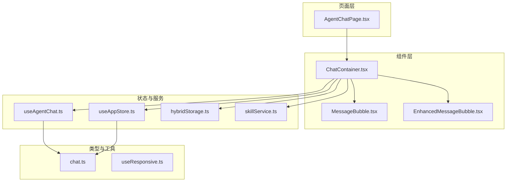
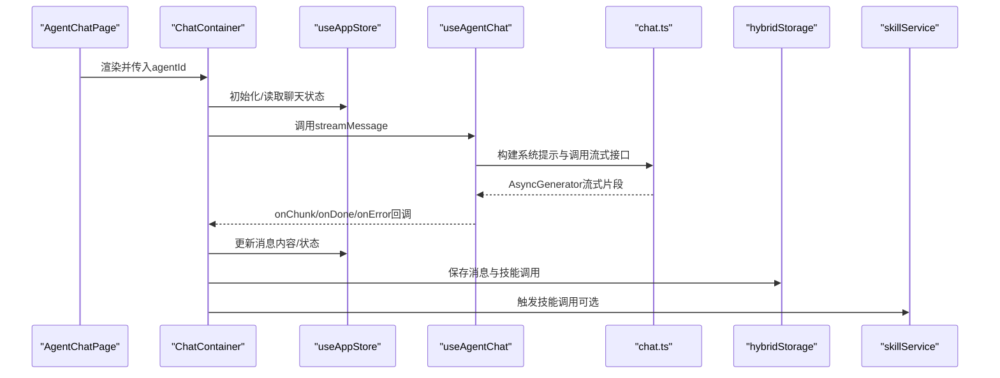
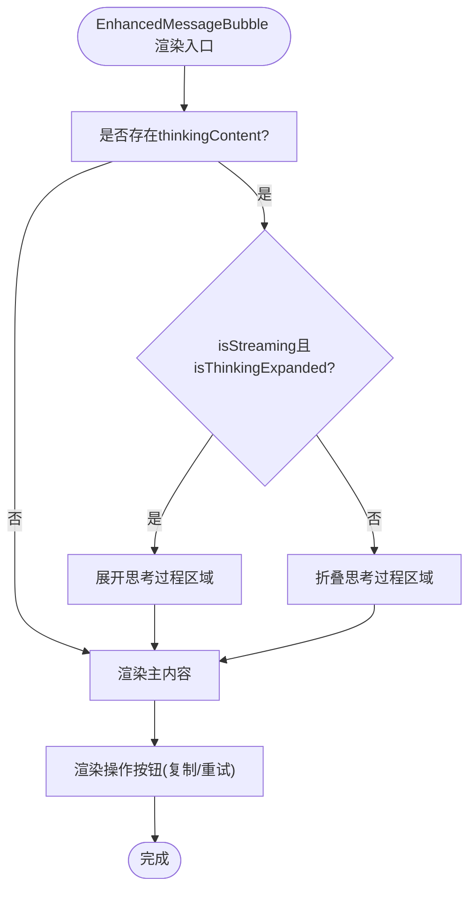
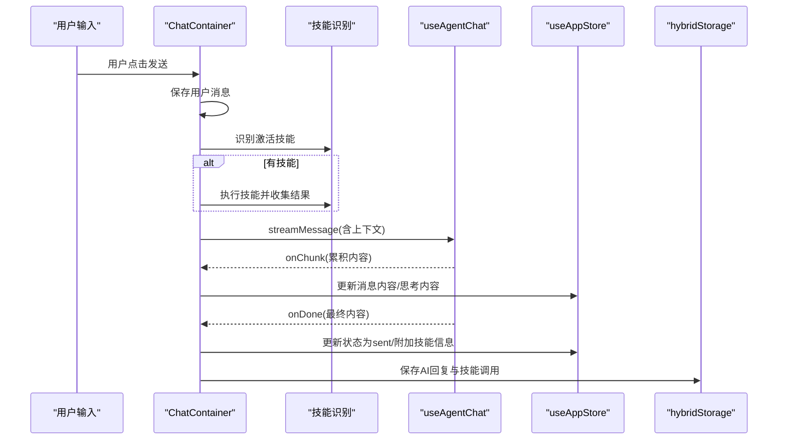
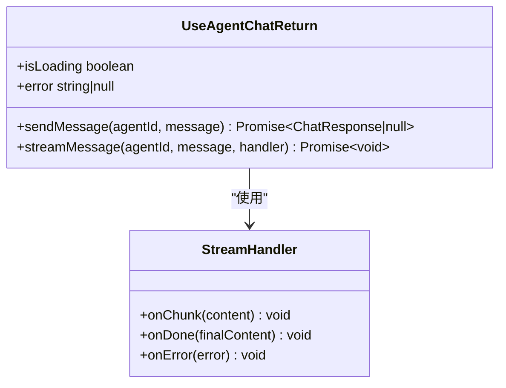
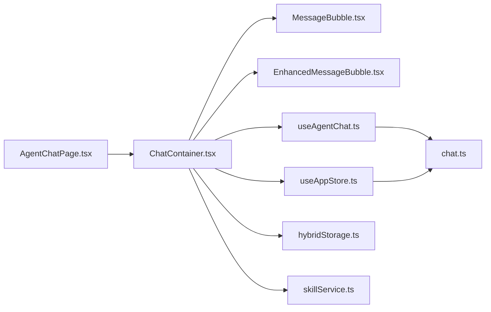

# React与TypeScript规范

<cite>
**本文档引用的文件**
- [EnhancedMessageBubble.tsx](file://src/components/chat/EnhancedMessageBubble.tsx)
- [MessageBubble.tsx](file://src/components/chat/MessageBubble.tsx)
- [ChatContainer.tsx](file://src/components/chat/ChatContainer.tsx)
- [useAgentChat.ts](file://src/hooks/useAgentChat.ts)
- [useResponsive.ts](file://src/hooks/useResponsive.ts)
- [chat.ts](file://src/types/chat.ts)
- [useAppStore.ts](file://src/store/useAppStore.ts)
- [AgentChatPage.tsx](file://src/pages/AgentChatPage.tsx)
- [hybridStorage.ts](file://src/services/hybridStorage.ts)
- [skillService.ts](file://src/services/skillService.ts)
- [package.json](file://package.json)
- [tsconfig.json](file://tsconfig.json)
</cite>

## 目录
1. [引言](#引言)
2. [项目结构](#项目结构)
3. [核心组件](#核心组件)
4. [架构总览](#架构总览)
5. [详细组件分析](#详细组件分析)
6. [依赖关系分析](#依赖关系分析)
7. [性能考量](#性能考量)
8. [故障排查指南](#故障排查指南)
9. [结论](#结论)
10. [附录](#附录)

## 引言
本规范面向AutoMate前端团队，聚焦于React与TypeScript在项目中的编码实践，围绕函数组件开发、Hooks使用、TypeScript类型系统、组件状态管理以及消息气泡与聊天容器等核心模块，提供可操作的规范与最佳实践，帮助提升代码一致性、可维护性与可扩展性。

## 项目结构
AutoMate采用基于功能域的组织方式，前端代码主要位于src目录：
- components：UI组件，按功能域分层（chat、theme、Sidebar等）
- hooks：自定义Hook
- types：共享类型定义
- store：状态管理（Zustand）
- services：业务服务（聊天、技能、存储）
- pages：页面级组件
- router：路由配置

图表来源
- [AgentChatPage.tsx](file://src/pages/AgentChatPage.tsx#L1-L24)
- [ChatContainer.tsx](file://src/components/chat/ChatContainer.tsx#L1-L756)
- [MessageBubble.tsx](file://src/components/chat/MessageBubble.tsx#L1-L90)
- [EnhancedMessageBubble.tsx](file://src/components/chat/EnhancedMessageBubble.tsx#L1-L217)
- [useAgentChat.ts](file://src/hooks/useAgentChat.ts#L1-L128)
- [useAppStore.ts](file://src/store/useAppStore.ts#L1-L306)
- [hybridStorage.ts](file://src/services/hybridStorage.ts#L1-L262)
- [skillService.ts](file://src/services/skillService.ts#L1-L73)
- [chat.ts](file://src/types/chat.ts#L1-L280)
- [useResponsive.ts](file://src/hooks/useResponsive.ts#L1-L110)

章节来源
- [package.json](file://package.json#L1-L47)
- [tsconfig.json](file://tsconfig.json#L1-L26)

## 核心组件
- 函数组件统一采用PascalCase命名，如EnhancedMessageBubble、MessageBubble、ChatContainer。
- Props接口以Props后缀命名，如EnhancedMessageBubbleProps、MessageBubbleProps、ChatContainerProps。
- 组件内部使用React.FC显式声明类型，箭头函数定义组件，避免类组件。
- 使用解构赋值接收Props，提供默认值，减少重复判断。
- 在组件内部通过useAppStore读取主题、聊天状态等全局状态，避免在Props中传递过多状态。

章节来源
- [EnhancedMessageBubble.tsx](file://src/components/chat/EnhancedMessageBubble.tsx#L6-L24)
- [MessageBubble.tsx](file://src/components/chat/MessageBubble.tsx#L4-L16)
- [ChatContainer.tsx](file://src/components/chat/ChatContainer.tsx#L9-L37)
- [useAppStore.ts](file://src/store/useAppStore.ts#L17-L33)

## 架构总览
AutoMate前端采用“页面-组件-服务-状态”的分层架构：
- 页面层负责路由与参数解析（AgentChatPage）。
- 组件层包含聊天容器与消息气泡，负责渲染与交互。
- 服务层封装聊天、技能调用与本地存储。
- 状态层使用Zustand集中管理聊天会话、主题与用户设置。

图表来源
- [AgentChatPage.tsx](file://src/pages/AgentChatPage.tsx#L1-L24)
- [ChatContainer.tsx](file://src/components/chat/ChatContainer.tsx#L213-L392)
- [useAgentChat.ts](file://src/hooks/useAgentChat.ts#L84-L119)
- [chat.ts](file://src/types/chat.ts#L96-L189)
- [hybridStorage.ts](file://src/services/hybridStorage.ts#L129-L184)
- [skillService.ts](file://src/services/skillService.ts#L12-L61)

## 详细组件分析

### 消息气泡组件规范
- Props接口设计：明确content、isUser、status、skillActivated、thinkingContent、isStreaming、onRetry等字段，提供合理默认值。
- 组件职责单一：EnhancedMessageBubble专注于渲染增强版消息气泡，包含思考过程展开、技能徽章、复制与重试按钮。
- 状态管理：内部使用useState管理展开状态与复制反馈；通过useAppStore读取主题以动态切换样式。
- 错误处理：在复制失败时记录日志，避免阻断主流程。
- 渲染策略：使用ReactMarkdown渲染富文本，针对代码块与行内代码进行差异化样式处理。

图表来源
- [EnhancedMessageBubble.tsx](file://src/components/chat/EnhancedMessageBubble.tsx#L62-L96)
- [EnhancedMessageBubble.tsx](file://src/components/chat/EnhancedMessageBubble.tsx#L125-L133)
- [EnhancedMessageBubble.tsx](file://src/components/chat/EnhancedMessageBubble.tsx#L135-L160)

章节来源
- [EnhancedMessageBubble.tsx](file://src/components/chat/EnhancedMessageBubble.tsx#L6-L217)

### 聊天容器组件规范
- Props与状态：接收agentId，内部维护输入文本、滚动控制、发送状态、当前AI消息ID引用等。
- 生命周期：初始化混合存储、加载最近24小时历史消息、监听滚动显示底部按钮。
- 技能识别与执行：根据关键词匹配激活技能，先于AI回复执行技能，再将结果注入上下文。
- 流式渲染：使用useAgentChat.streamMessage接收增量内容，定时刷新以平滑更新，同时提取<think>标签内的思考过程。
- 错误处理：捕获API错误，保存失败消息并展示失败状态。
- 重试机制：删除最后一条AI消息及其技能调用记录，重新发起流式请求。

图表来源
- [ChatContainer.tsx](file://src/components/chat/ChatContainer.tsx#L213-L392)
- [useAgentChat.ts](file://src/hooks/useAgentChat.ts#L84-L119)
- [useAppStore.ts](file://src/store/useAppStore.ts#L167-L209)
- [hybridStorage.ts](file://src/services/hybridStorage.ts#L129-L184)

章节来源
- [ChatContainer.tsx](file://src/components/chat/ChatContainer.tsx#L1-L756)

### 自定义Hook规范
- 命名约定：以use开头，返回值包含方法与状态，如useAgentChat、useResponsive。
- 依赖管理：useCallback包裹异步方法，确保依赖数组稳定，避免不必要的重渲染。
- 状态分离：将加载状态、错误状态与业务方法分离，便于上层组件消费。
- 类型约束：StreamHandler接口明确回调签名，确保调用方契约一致。

图表来源
- [useAgentChat.ts](file://src/hooks/useAgentChat.ts#L5-L16)
- [useAgentChat.ts](file://src/hooks/useAgentChat.ts#L84-L119)

章节来源
- [useAgentChat.ts](file://src/hooks/useAgentChat.ts#L1-L128)
- [useResponsive.ts](file://src/hooks/useResponsive.ts#L1-L110)

### TypeScript类型定义规范
- interface vs type选择：
  - interface用于对象结构（如Agent、Message、ChatState），便于扩展与合并。
  - type用于联合类型或字面量类型（如status枚举、StreamChunk），表达更精确。
- 泛型应用：在loadAllSkillsDescriptions中使用Map<string, string>表示技能描述映射。
- 类型守卫：在chatWithAgent中对unknown类型的错误进行类型收窄，区分axios错误与网络错误。
- 严格模式：tsconfig启用strict、noUnusedLocals、noUnusedParameters等，减少隐式any与未使用变量。

章节来源
- [chat.ts](file://src/types/chat.ts#L3-L46)
- [chat.ts](file://src/types/chat.ts#L237-L259)
- [tsconfig.json](file://tsconfig.json#L14-L17)

### 组件状态管理规范
- Zustand store设计：
  - 明确Message接口与ChatState结构，支持多智能体会话。
  - 提供addMessage、updateMessageContent、updateMessageThinkingContent、removeLastAiMessage、setTyping等原子操作。
  - 主题与用户设置独立管理，setTheme自动同步主题配置。
- 组件内状态：
  - ChatContainer内部使用useState管理输入文本、滚动按钮可见性、发送状态与引用。
  - 消息气泡内部使用useState管理思考过程展开与复制反馈。
- 状态更新函数命名：
  - addMessage、updateMessageContent、updateMessageThinkingContent、removeLastAiMessage、setTyping等语义化命名，便于理解职责。

章节来源
- [useAppStore.ts](file://src/store/useAppStore.ts#L17-L83)
- [useAppStore.ts](file://src/store/useAppStore.ts#L143-L240)
- [ChatContainer.tsx](file://src/components/chat/ChatContainer.tsx#L31-L37)
- [EnhancedMessageBubble.tsx](file://src/components/chat/EnhancedMessageBubble.tsx#L26-L27)

## 依赖关系分析
- 组件依赖：AgentChatPage -> ChatContainer -> MessageBubble/EnhancedMessageBubble；ChatContainer依赖useAgentChat与useAppStore。
- 服务依赖：ChatContainer依赖hybridStorage与skillService；useAgentChat依赖chat.ts中的类型与流式接口。
- 类型依赖：所有组件与Hook均依赖chat.ts中的Agent、ChatResponse、StreamChunk等类型。

图表来源
- [AgentChatPage.tsx](file://src/pages/AgentChatPage.tsx#L1-L24)
- [ChatContainer.tsx](file://src/components/chat/ChatContainer.tsx#L1-L756)
- [useAgentChat.ts](file://src/hooks/useAgentChat.ts#L1-L128)
- [useAppStore.ts](file://src/store/useAppStore.ts#L1-L306)
- [hybridStorage.ts](file://src/services/hybridStorage.ts#L1-L262)
- [skillService.ts](file://src/services/skillService.ts#L1-L73)
- [chat.ts](file://src/types/chat.ts#L1-L280)

章节来源
- [package.json](file://package.json#L15-L26)

## 性能考量
- 渲染优化：
  - ChatContainer中对消息列表使用React.Fragment与条件渲染，避免不必要节点。
  - 滚动监听仅在需要时绑定，组件卸载时及时移除事件监听。
- 状态更新：
  - 使用Zustand原子化更新，避免深层嵌套导致的不必要重渲染。
  - useAgentChat中对sendMessage与streamMessage使用useCallback，确保依赖稳定。
- I/O优化：
  - hybridStorage对过期数据进行每日清理，避免数据库膨胀。
  - 流式渲染采用定时器批量flush，平衡实时性与性能。

章节来源
- [ChatContainer.tsx](file://src/components/chat/ChatContainer.tsx#L48-L65)
- [useAgentChat.ts](file://src/hooks/useAgentChat.ts#L51-L82)
- [hybridStorage.ts](file://src/services/hybridStorage.ts#L117-L127)

## 故障排查指南
- 技能调用失败：
  - 检查skillService返回的error字段，确认后端服务是否正常运行。
  - 查看hybridStorage保存的技能调用记录，定位具体失败原因。
- 流式输出异常：
  - 在useAgentChat中捕获错误并调用handler.onError，确保UI层收到错误状态。
  - ChatContainer中onError分支保存失败消息并展示失败状态。
- 存储初始化失败：
  - ChatContainer初始化混合存储时若失败，仍继续渲染，避免阻断用户体验。
- 复制失败：
  - EnhancedMessageBubble在复制失败时记录错误日志，避免影响主流程。

章节来源
- [skillService.ts](file://src/services/skillService.ts#L34-L60)
- [useAgentChat.ts](file://src/hooks/useAgentChat.ts#L112-L118)
- [ChatContainer.tsx](file://src/components/chat/ChatContainer.tsx#L377-L390)
- [EnhancedMessageBubble.tsx](file://src/components/chat/EnhancedMessageBubble.tsx#L130-L132)

## 结论
本规范总结了AutoMate项目在React与TypeScript方面的最佳实践，覆盖函数组件命名、Props设计、自定义Hook使用、类型系统应用、状态管理与错误处理等方面。建议团队在后续开发中遵循上述规范，持续优化组件职责边界与状态管理策略，确保代码质量与可维护性。

## 附录
- 代码示例路径参考：
  - 消息气泡组件：[EnhancedMessageBubble.tsx](file://src/components/chat/EnhancedMessageBubble.tsx#L1-L217)
  - 聊天容器组件：[ChatContainer.tsx](file://src/components/chat/ChatContainer.tsx#L1-L756)
  - 自定义Hook实现：[useAgentChat.ts](file://src/hooks/useAgentChat.ts#L1-L128)
  - 状态管理Hook：[useAppStore.ts](file://src/store/useAppStore.ts#L1-L306)
  - 类型定义：[chat.ts](file://src/types/chat.ts#L1-L280)
  - 页面路由：[AgentChatPage.tsx](file://src/pages/AgentChatPage.tsx#L1-L24)
  - 本地存储服务：[hybridStorage.ts](file://src/services/hybridStorage.ts#L1-L262)
  - 技能服务：[skillService.ts](file://src/services/skillService.ts#L1-L73)