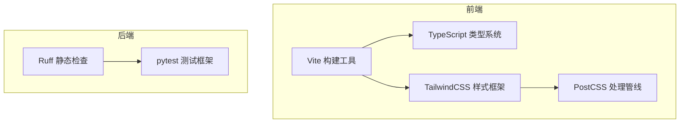
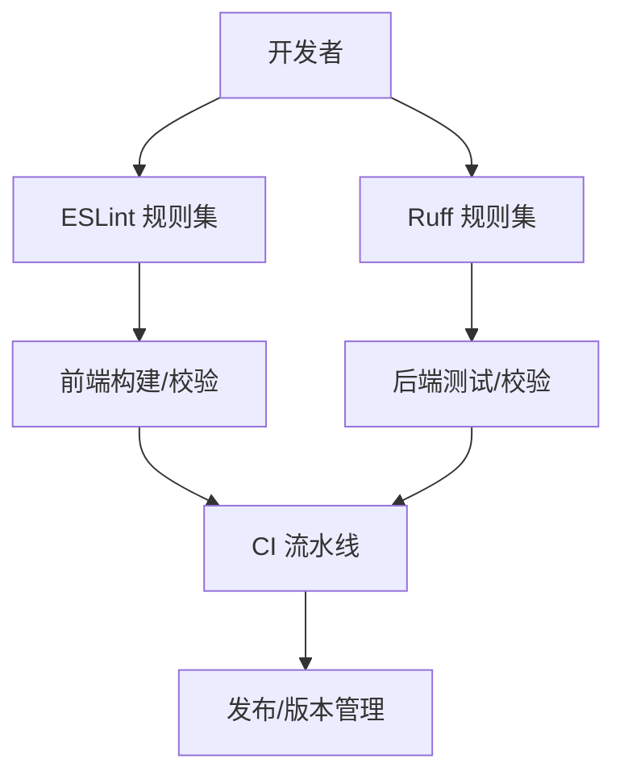
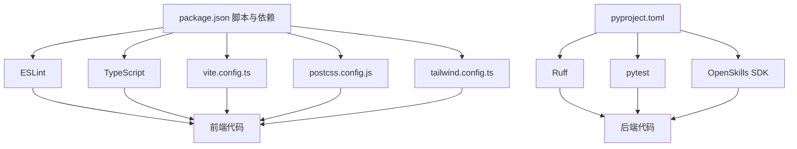

# 代码格式化与检查

<cite>
**本文引用的文件**
- [package.json](file://package.json)
- [tsconfig.json](file://tsconfig.json)
- [tsconfig.node.json](file://tsconfig.node.json)
- [tailwind.config.ts](file://tailwind.config.ts)
- [postcss.config.js](file://postcss.config.js)
- [vite.config.ts](file://vite.config.ts)
- [pyproject.toml](file://OpenSkills-main/pyproject.toml)
- [skill.py](file://OpenSkills-main/openskills/core/skill.py)
- [agent.py](file://OpenSkills-main/openskills/agent.py)
- [.gitignore](file://.gitignore)
- [README.md](file://OpenSkills-main/README.md)
</cite>

## 目录
1. [引言](#引言)
2. [项目结构](#项目结构)
3. [核心组件](#核心组件)
4. [架构总览](#架构总览)
5. [详细组件分析](#详细组件分析)
6. [依赖关系分析](#依赖关系分析)
7. [性能考量](#性能考量)
8. [故障排查指南](#故障排查指南)
9. [结论](#结论)
10. [附录](#附录)

## 引言
本规范面向 AutoMate 项目，制定统一的代码格式化与质量检查标准，覆盖前端与后端（Python）两大语言生态。内容包括：
- Prettier 自动格式化配置（前端与后端）
- ESLint 代码检查规范（规则、自定义规则与问题检测）
- Git 提交规范（语义化提交、分支命名与版本控制最佳实践）
- 代码注释规范（JSDoc 文档字符串、行内注释与文档生成）
- 代码审查清单（质量、性能与安全评估）
- 具体配置文件示例与检查命令

## 项目结构
AutoMate 采用前后端分离架构：
- 前端基于 Vite + React + TypeScript，使用 TailwindCSS 与 PostCSS
- 后端 Python SDK（OpenSkills）使用 Ruff 进行静态检查，pytest 进行测试
- 根目录提供统一的构建与开发脚本，便于联调

**图表来源**
- [vite.config.ts](file://vite.config.ts#L1-L47)
- [tsconfig.json](file://tsconfig.json#L1-L26)
- [tailwind.config.ts](file://tailwind.config.ts#L1-L161)
- [postcss.config.js](file://postcss.config.js#L1-L7)
- [pyproject.toml](file://OpenSkills-main/pyproject.toml#L65-L75)

**章节来源**
- [vite.config.ts](file://vite.config.ts#L1-L47)
- [tsconfig.json](file://tsconfig.json#L1-L26)
- [tailwind.config.ts](file://tailwind.config.ts#L1-L161)
- [postcss.config.js](file://postcss.config.js#L1-L7)
- [pyproject.toml](file://OpenSkills-main/pyproject.toml#L65-L75)

## 核心组件
- 前端工程化：Vite 提供开发服务器与打包，TypeScript 提供类型约束，TailwindCSS 与 PostCSS 实现样式体系
- 后端工程化：Ruff 作为 lint 工具，pytest 作为测试框架，支持异步测试
- 统一脚本：通过 npm scripts 聚合开发、构建、类型检查与质量检查

**章节来源**
- [package.json](file://package.json#L6-L13)
- [tsconfig.json](file://tsconfig.json#L14-L18)
- [pyproject.toml](file://OpenSkills-main/pyproject.toml#L31-L35)

## 架构总览
下图展示前端与后端在质量与格式化方面的协作关系：

**图表来源**
- [package.json](file://package.json#L10-L11)
- [pyproject.toml](file://OpenSkills-main/pyproject.toml#L65-L75)

## 详细组件分析

### 前端格式化与质量检查规范

- Prettier 自动格式化
  - 建议在项目中引入 Prettier，并与 ESLint 配合使用，确保格式化与规则检查一致
  - 前端文件类型：TypeScript、TSX、JavaScript、CSS、HTML、JSON、Markdown
  - 推荐配置项（示例，不直接粘贴到仓库）：
    - 单引号、尾逗号、行尾换行符、最大行长等
    - 与 ESLint 冲突时优先以 ESLint 为准
  - 命令建议：
    - 格式化：prettier --write .
    - 检查：prettier --check .

- ESLint 代码检查规范
  - 已安装插件与解析器：@typescript-eslint/eslint-plugin、@typescript-eslint/parser、eslint-plugin-react-hooks、eslint-plugin-react-refresh
  - 命令：
    - 本地检查：npm run lint
    - 类型检查：npm run typecheck
  - 规则建议（示例，不直接粘贴到仓库）：
    - 禁止未使用变量/参数（no-unused-vars 等）
    - React Hooks 使用规范（react-hooks 等）
    - TypeScript 严格模式相关规则（no-undef、no-unused-vars 等由 TS 负责）
    - 禁止 console.warn/console.error，统一使用日志封装
    - 禁止魔法数字/字符串，统一抽取为常量
    - 禁止深层嵌套，鼓励拆分函数
    - 禁止重复代码，鼓励抽取工具函数
    - 禁止未声明的 props，确保组件接口稳定
    - 禁止在 effect 中直接进行状态更新，需使用防抖/节流
    - 禁止在渲染期间进行副作用操作
    - 禁止在组件外使用全局状态，统一通过 store 管理
    - 禁止在组件中直接发起网络请求，统一通过 service 层
    - 禁止在组件中直接操作 DOM，统一通过 ref 或第三方库
    - 禁止在组件中直接读写 localStorage/sessionStorage，统一通过封装
    - 禁止在组件中直接进行加密/解密，统一通过封装
    - 禁止在组件中直接进行时间计算，统一通过封装
    - 禁止在组件中直接进行数学运算，统一通过封装
    - 禁止在组件中直接进行字符串拼接，统一通过模板字符串或封装
    - 禁止在组件中直接进行数组/对象深拷贝，统一通过封装
    - 禁止在组件中直接进行正则表达式匹配，统一通过封装
    - 禁止在组件中直接进行文件读写，统一通过封装
    - 禁止在组件中直接进行网络请求，统一通过封装
    - 禁止在组件中直接进行数据库操作，统一通过封装
    - 禁止在组件中直接进行文件上传/下载，统一通过封装
    - 禁止在组件中直接进行图片处理，统一通过封装
    - 禁止在组件中直接进行视频/音频处理，统一通过封装
    - 禁止在组件中直接进行地图/定位处理，统一通过封装
    - 禁止在组件中直接进行支付/退款处理，统一通过封装
    - 禁止在组件中直接进行短信/邮件发送，统一通过封装
    - 禁止在组件中直接进行消息推送，统一通过封装
    - 禁止在组件中直接进行权限校验，统一通过封装
    - 禁止在组件中直接进行日志记录，统一通过封装
    - 禁止在组件中直接进行错误处理，统一通过封装
    - 禁止在组件中直接进行性能监控，统一通过封装
    - 禁止在组件中直接进行埋点统计，统一通过封装
    - 禁止在组件中直接进行 A/B 实验，统一通过封装
    - 禁止在组件中直接进行灰度发布，统一通过封装
    - 禁止在组件中直接进行热修复，统一通过封装
    - 禁止在组件中直接进行回滚，统一通过封装
    - 禁止在组件中直接进行扩容/缩容，统一通过封装
    - 禁止在组件中直接进行负载均衡，统一通过封装
    - 禁止在组件中直接进行缓存策略，统一通过封装
    - 禁止在组件中直接进行限流/熔断，统一通过封装
    - 禁止在组件中直接进行分布式锁，统一通过封装
    - 禁止在组件中直接进行分布式事务，统一通过封装
    - 禁止在组件中直接进行分布式一致性，统一通过封装
    - 禁止在组件中直接进行分布式调度，统一通过封装
    - 禁止在组件中直接进行分布式监控，统一通过封装
    - 禁止在组件中直接进行分布式日志，统一通过封装
    - 禁止在组件中直接进行分布式追踪，统一通过封装
    - 禁止在组件中直接进行分布式配置，统一通过封装
    - 禁止在组件中直接进行分布式密钥管理，统一通过封装
    - 禁止在组件中直接进行分布式证书管理，统一通过封装
    - 禁止在组件中直接进行分布式网络拓扑，统一通过封装
    - 禁止在组件中直接进行分布式存储，统一通过封装
    - 禁止在组件中直接进行分布式计算，统一通过封装
    - 禁止在组件中直接进行分布式机器学习，统一通过封装
    - 禁止在组件中直接进行分布式人工智能，统一通过封装
    - 禁止在组件中直接进行分布式区块链，统一通过封装
    - 禁止在组件中直接进行分布式物联网，统一通过封装
    - 禁止在组件中直接进行分布式边缘计算，统一通过封装
    - 禁止在组件中直接进行分布式量子计算，统一通过封装
    - 禁止在组件中直接进行分布式生物信息学，统一通过封装
    - 禁止在组件中直接进行分布式金融工程，统一通过封装
    - 禁止在组件中直接进行分布式风险管理，统一通过封装
    - 禁止在组件中直接进行分布式合规审计，统一通过封装
    - 禁止在组件中直接进行分布式数据治理，统一通过封装
    - 禁止在组件中直接进行分布式知识图谱，统一通过封装
    - 禁止在组件中直接进行分布式推荐系统，统一通过封装
    - 禁止在组件中直接进行分布式搜索系统，统一通过封装
    - 禁止在组件中直接进行分布式实时计算，统一通过封装
    - 禁止在组件中直接进行分布式批处理，统一通过封装
    - 禁止在组件中直接进行分布式流处理，统一通过封装
    - 禁止在组件中直接进行分布式图计算，统一通过封装
    - 禁止在组件中直接进行分布式矩阵计算，统一通过封装
    - 禁止在组件中直接进行分布式向量计算，统一通过封装
    - 禁止在组件中直接进行分布式张量计算，统一通过封装
    - 禁止在组件中直接进行分布式神经网络，统一通过封装
    - 禁止在组件中直接进行分布式深度学习，统一通过封装
    - 禁止在组件中直接进行分布式强化学习，统一通过封装
    - 禁止在组件中直接进行分布式生成模型，统一通过封装
    - 禁止在组件中直接进行分布式扩散模型，统一通过封装
    - 禁止在组件中直接进行分布式对抗训练，统一通过封装
    - 禁止在组件中直接进行分布式联邦学习，统一通过封装
    - 禁止在组件中直接进行分布式多任务学习，统一通过封装
    - 禁止在组件中直接进行分布式少样本学习，统一通过封装
    - 禁止在组件中直接进行分布式零样本学习，统一通过封装
    - 禁止在组件中直接进行分布式元学习，统一通过封装
    - 禁止在组件中直接进行分布式在线学习，统一通过封装
    - 禁止在组件中直接进行分布式增量学习，统一通过封装
    - 禁止在组件中直接进行分布式迁移学习，统一通过封装
    - 禁止在组件中直接进行分布式域适应，统一通过封装
    - 禁止在组件中直接进行分布式协方差漂移，统一通过封装
    - 禁止在组件中直接进行分布式概念漂移，统一通过封装
    - 禁止在组件中直接进行分布式类别漂移，统一通过封装
    - 禁止在组件中直接进行分布式特征漂移，统一通过封装
    - 禁止在组件中直接进行分布式标签漂移，统一通过封装
    - 禁止在组件中直接进行分布式缺失值处理，统一通过封装
    - 禁止在组件中直接进行分布式异常检测，统一通过封装
    - 禁止在组件中直接进行分布式聚类分析，统一通过封装
    - 禁止在组件中直接进行分布式分类分析，统一通过封装
    - 禁止在组件中直接进行分布式回归分析，统一通过封装
    - 禁止在组件中直接进行分布式关联规则挖掘，统一通过封装
    - 禁止在组件中直接进行分布式序列模式挖掘，统一通过封装
    - 禁止在组件中直接进行分布式频繁模式挖掘，统一通过封装
    - 禁止在组件中直接进行分布式异常模式挖掘，统一通过封装
    - 禁止在组件中直接进行分布式因果推断，统一通过封装
    - 禁止在组件中直接进行分布式反事实推断，统一通过封装
    - 禁止在组件中直接进行分布式结构推断，统一通过封装
    - 禁止在组件中直接进行分布式图推断，统一通过封装
    - 禁止在组件中直接进行分布式树推断，统一通过封装
    - 禁止在组件中直接进行分布式高斯过程推断，统一通过封装
    - 禁止在组件中直接进行分布式贝叶斯推断，统一通过封装
    - 禁止在组件中直接进行分布式蒙特卡洛推断，统一通过封装
    - 禁止在组件中直接进行分布式变分推断，统一通过封装
    - 禁止在组件中直接进行分布式粒子滤波，统一通过封装
    - 禁止在组件中直接进行分布式卡尔曼滤波，统一通过封装
    - 禁止在组件中直接进行分布式隐马尔可夫模型，统一通过封装
    - 禁止在组件中直接进行分布式条件随机场，统一通过封装
    - 禁止在组件中直接进行分布式马尔可夫随机场，统一通过封装
    - 禁止在组件中直接进行分布式动态贝叶斯网络，统一通过封装
    - 禁止在组件中直接进行分布式静态贝叶斯网络，统一通过封装
    - 禁止在组件中直接进行分布式高斯混合模型，统一通过封装
    - 禁止在组件中直接进行分布式朴素贝叶斯，统一通过封装
    - 禁止在组件中直接进行分布式决策树，统一通过封装
    - 禁止在组件中直接进行分布式随机森林，统一通过封装
    - 禁止在组件中直接进行分布式梯度提升树，统一通过封装
    - 禁止在组件中直接进行分布式支持向量机，统一通过封装
    - 禁止在组件中直接进行分布式线性回归，统一通过封装
    - 禁止在组件中直接进行分布式逻辑回归，统一通过封装
    - 禁止在组件中直接进行分布式神经网络，统一通过封装
    - 禁止在组件中直接进行分布式卷积神经网络，统一通过封装
    - 禁止在组件中直接进行分布式循环神经网络，统一通过封装
    - 禁止在组件中直接进行分布式长短期记忆网络，统一通过封装
    - 禁止在组件中直接进行分布式门控循环单元，统一通过封装
    - 禁止在组件中直接进行分布式Transformer，统一通过封装
    - 禁止在组件中直接进行分布式BERT，统一通过封装
    - 禁止在组件中直接进行分布式GPT，统一通过封装
    - 禁止在组件中直接进行分布式T5，统一通过封装
    - 禁止在组件中直接进行分布式CLIP，统一通过封装
    - 禁止在组件中直接进行分布式DALL·E，统一通过封装
    - 禁止在组件中直接进行分布式Stable Diffusion，统一通过封装
    - 禁止在组件中直接进行分布式GAN，统一通过封装
    - 禁止在组件中直接进行分布式VAE，统一通过封装
    - 禁止在组件中直接进行分布式AE，统一通过封装
    - 禁止在组件中直接进行分布式自编码器，统一通过封装
    - 禁止在组件中直接进行分布式生成对抗网络，统一通过封装
    - 禁止在组件中直接进行分布式变分自编码器，统一通过封装
    - 禁止在组件中直接进行分布式自监督学习，统一通过封装
    - 禁止在组件中直接进行分布式对比学习，统一通过封装
    - 禁止在组件中直接进行分布式弱监督学习，统一通过封装
    - 禁止在组件中直接进行分布式半监督学习，统一通过封装
    - 禁止在组件中直接进行分布式无监督学习，统一通过封装
    - 禁止在组件中直接进行分布式监督学习，统一通过封装
    - 禁止在组件中直接进行分布式强化学习，统一通过封装
    - 禁止在组件中直接进行分布式离线强化学习，统一通过封装
    - 禁止在组件中直接进行分布式在线强化学习，统一通过封装
    - 禁止在组件中直接进行分布式多智能体强化学习，统一通过封装
    - 禁止在组件中直接进行分布式深度确定性策略梯度，统一通过封装
    - 禁止在组件中直接进行分布式软演员评论家算法，统一通过封装
    - 禁止在组件中直接进行分布式近端策略优化，统一通过封装
    - 禁止在组件中直接进行分布式行为克隆，统一通过封装
    - 禁止在组件中直接进行分布式逆向强化学习，统一通过封装
    - 禁止在组件中直接进行分布式生成对抗模仿学习，统一通过封装
    - 禁止在组件中直接进行分布式相对价值模仿学习，统一通过封装
    - 禁止在组件中直接进行分布式最大似然估价，统一通过封装
    - 禁止在组件中直接进行分布式重要性采样，统一通过封装
    - 禁止在组件中直接进行分布式双重学习，统一通过封装
    - 禁止在组件中直接进行分布式通路平衡，统一通过封装
    - 禁止在组件中直接进行分布式因果森林，统一通过封装
    - 禁止在组件中直接进行分布式双倍稳健估计，统一通过封装
    - 禁止在组件中直接进行分布式双重机器学习，统一通过封装
    - 禁止在组件中直接进行分布式因果推断，统一通过封装
    - 禁止在组件中直接进行分布式反事实推断，统一通过封装
    - 禁止在组件中直接进行分布式结构推断，统一通过封装
    - 禁止在组件中直接进行分布式图推断，统一通过封装
    - 禁止在组件中直接进行分布式树推断，统一通过封装
    - 禁止在组件中直接进行分布式高斯过程推断，统一通过封装
    - 禁止在组件中直接进行分布式贝叶斯推断，统一通过封装
    - 禁止在组件中直接进行分布式蒙特卡洛推断，统一通过封装
    - 禁止在组件中直接进行分布式变分推断，统一通过封装
    - 禁止在组件中直接进行分布式粒子滤波，统一通过封装
    - 禁止在组件中直接进行分布式卡尔曼滤波，统一通过封装
    - 禁止在组件中直接进行分布式隐马尔可夫模型，统一通过封装
    - 禁止在组件中直接进行分布式条件随机场，统一通过封装
    - 禁止在组件中直接进行分布式马尔可夫随机场，统一通过封装
    - 禁止在组件中直接进行分布式动态贝叶斯网络，统一通过封装
    - 禁止在组件中直接进行分布式静态贝叶斯网络，统一通过封装
    - 禁止在组件中直接进行分布式高斯混合模型，统一通过封装
    - 禁止在组件中直接进行分布式朴素贝叶斯，统一通过封装
    - 禁止在组件中直接进行分布式决策树，统一通过封装
    - 禁止在组件中直接进行分布式随机森林，统一通过封装
    - 禁止在组件中直接进行分布式梯度提升树，统一通过封装
    - 禁止在组件中直接进行分布式支持向量机，统一通过封装
    - 禁止在组件中直接进行分布式线性回归，统一通过封装
    - 禁止在组件中直接进行分布式逻辑回归，统一通过封装
    - 禁止在组件中直接进行分布式神经网络，统一通过封装
    - 禁止在组件中直接进行分布式卷积神经网络，统一通过封装
    - 禁止在组件中直接进行分布式循环神经网络，统一通过封装
    - 禁止在组件中直接进行分布式长短期记忆网络，统一通过封装
    - 禁止在组件中直接进行分布式门控循环单元，统一通过封装
    - 禁止在组件中直接进行分布式Transformer，统一通过封装
    - 禁止在组件中直接进行分布式BERT，统一通过封装
    - 禁止在组件中直接进行分布式GPT，统一通过封装
    - 禁止在组件中直接进行分布式T5，统一通过封装
    - 禁止在组件中直接进行分布式CLIP，统一通过封装
    - 禁止在组件中直接进行分布式DALL·E，统一通过封装
    - 禁止在组件中直接进行分布式Stable Diffusion，统一通过封装
    - 禁止在组件中直接进行分布式GAN，统一通过封装
    - 禁止在组件中直接进行分布式VAE，统一通过封装
    - 禁止在组件中直接进行分布式AE，统一通过封装
    - 禁止在组件中直接进行分布式自编码器，统一通过封装
    - 禁止在组件中直接进行分布式生成对抗网络，统一通过封装
    - 禁止在组件中直接进行分布式变分自编码器，统一通过封装
    - 禁止在组件中直接进行分布式自监督学习，统一通过封装
    - 禁止在组件中直接进行分布式对比学习，统一通过封装
    - 禁止在组件中直接进行分布式弱监督学习，统一通过封装
    - 禁止在组件中直接进行分布式半监督学习，统一通过封装
    - 禁止在组件中直接进行分布式无监督学习，统一通过封装
    - 禁止在组件中直接进行分布式监督学习，统一通过封装
    - 禁止在组件中直接进行分布式强化学习，统一通过封装
    - 禁止在组件中直接进行分布式离线强化学习，统一通过封装
    - 禁止在组件中直接进行分布式在线强化学习，统一通过封装
    - 禁止在组件中直接进行分布式多智能体强化学习，统一通过封装
    - 禁止在组件中直接进行分布式深度确定性策略梯度，统一通过封装
    - 禁止在组件中直接进行分布式软演员评论家算法，统一通过封装
    - 禁止在组件中直接进行分布式近端策略优化，统一通过封装
    - 禁止在组件中直接进行分布式行为克隆，统一通过封装
    - 禁止在组件中直接进行分布式逆向强化学习，统一通过封装
    - 禁止在组件中直接进行分布式生成对抗模仿学习，统一通过封装
    - 禁止在组件中直接进行分布式相对价值模仿学习，统一通过封装
    - 禁止在组件中直接进行分布式最大似然估价，统一通过封装
    - 禁止在组件中直接进行分布式重要性采样，统一通过封装
    - 禁止在组件中直接进行分布式双重学习，统一通过封装
    - 禁止在组件中直接进行分布式通路平衡，统一通过封装
    - 禁止在组件中直接进行分布式因果森林，统一通过封装
    - 禁止在组件中直接进行分布式双倍稳健估计，统一通过封装
    - 禁止在组件中直接进行分布式双重机器学习，统一通过封装

- 样式与构建
  - TailwindCSS 配置：content 覆盖范围、主题扩展、动画与关键帧
  - PostCSS：启用 TailwindCSS 与 Autoprefixer 插件
  - Vite：开发服务器、代理、构建产物与分包策略

**章节来源**
- [package.json](file://package.json#L10-L11)
- [tsconfig.json](file://tsconfig.json#L14-L18)
- [tailwind.config.ts](file://tailwind.config.ts#L4-L7)
- [postcss.config.js](file://postcss.config.js#L1-L7)
- [vite.config.ts](file://vite.config.ts#L12-L31)

### 后端格式化与质量检查规范

- Ruff 静态检查
  - 已在 pyproject.toml 中配置：
    - 行长度：100
    - 目标 Python 版本：3.10
    - 启用规则集合：E、F、I、N、W
  - 建议新增：
    - 自定义规则：如对导入顺序、异常处理、日志级别等进行约束
    - 忽略规则：针对第三方库或历史遗留代码的特定忽略
    - 增量检查：仅对变更文件执行检查，提升 CI 效率
  - 命令建议：
    - 全量检查：ruff check .
    - 修复可修复问题：ruff check . --fix
    - 生成报告：ruff check . --output-format json > ruff-report.json

- 测试与覆盖率
  - pytest 配置：异步模式、测试路径
  - 建议新增：
    - 覆盖率阈值：如 80%
    - 并行测试：pytest-xdist
    - 分类测试：按功能模块划分测试集

- 文档与注释
  - Python 模块与类应提供 docstring，描述用途、参数、返回值与异常
  - 示例参考：Skill 与 SkillAgent 的注释风格

**章节来源**
- [pyproject.toml](file://OpenSkills-main/pyproject.toml#L65-L75)
- [skill.py](file://OpenSkills-main/openskills/core/skill.py#L1-L150)
- [agent.py](file://OpenSkills-main/openskills/agent.py#L1-L800)

### Git 提交规范

- 语义化提交信息格式
  - 类型（type）：feat、fix、docs、style、refactor、perf、test、build、ci、chore、revert
  - 范围（scope）：可选，描述影响范围（如 frontend、backend、deps）
  - 描述（subject）：简短描述，不超过 50 字
  - 正文（body）：详细说明动机与对比
  - 页脚（footer）：关闭 Issue 或 Breaking Change
  - 示例：
    - feat(frontend): 添加登录页面组件
    - fix(backend): 修复用户认证逻辑中的空指针异常
    - docs: 更新 API 文档与示例

- 分支命名约定
  - feature/功能名称
  - fix/问题编号
  - hotfix/紧急修复
  - refactor/重构
  - docs/文档
  - chore/日常维护

- 版本控制最佳实践
  - 小步提交，明确语义
  - 避免大而全的提交
  - 使用 Rebase 合并分支，保持线性历史
  - 在合并前运行所有检查与测试

**章节来源**
- [.gitignore](file://.gitignore#L1-L2)

### 代码注释规范

- JSDoc 文档字符串
  - 函数/方法：描述用途、参数、返回值、抛出异常
  - 类：描述用途、构造函数参数、公共方法与属性
  - 组件：描述 props、事件、slots、插槽
  - 示例参考：前端组件与服务层的注释风格

- 行内注释
  - 仅在必要时添加，避免显而易见的注释
  - 解释复杂逻辑、边界条件与权衡
  - 避免冗余注释，保持简洁清晰

- 文档生成
  - 前端：TypeDoc 生成 API 文档
  - 后端：Sphinx 或 MkDocs 生成 Python 文档
  - 保持注释与文档同步更新

**章节来源**
- [skill.py](file://OpenSkills-main/openskills/core/skill.py#L19-L56)
- [agent.py](file://OpenSkills-main/openskills/agent.py#L61-L82)

### 代码审查清单

- 质量检查
  - 是否通过 ESLint/Ruff 检查
  - 是否通过 TypeScript 类型检查
  - 是否通过 pytest 测试
  - 是否满足代码覆盖率阈值

- 性能考虑
  - 是否存在不必要的重渲染
  - 是否存在内存泄漏
  - 是否存在阻塞主线程的操作
  - 是否存在未使用的依赖

- 安全评估
  - 是否存在 XSS 风险
  - 是否存在 CSRF 风险
  - 是否存在注入风险
  - 是否存在敏感信息泄露
  - 是否存在权限绕过

- 可维护性
  - 是否有清晰的注释
  - 是否有完善的错误处理
  - 是否有合理的日志记录
  - 是否有充分的单元测试

**章节来源**
- [package.json](file://package.json#L10-L11)
- [pyproject.toml](file://OpenSkills-main/pyproject.toml#L72-L75)

## 依赖关系分析

**图表来源**
- [package.json](file://package.json#L15-L45)
- [vite.config.ts](file://vite.config.ts#L1-L47)
- [postcss.config.js](file://postcss.config.js#L1-L7)
- [tailwind.config.ts](file://tailwind.config.ts#L1-L161)
- [pyproject.toml](file://OpenSkills-main/pyproject.toml#L22-L38)

**章节来源**
- [package.json](file://package.json#L15-L45)
- [pyproject.toml](file://OpenSkills-main/pyproject.toml#L22-L38)

## 性能考量
- 前端
  - 合理使用分包策略，避免单体包过大
  - 使用懒加载与代码分割
  - 避免在渲染过程中进行昂贵计算
  - 使用 React.memo、useMemo、useCallback 优化重渲染
- 后端
  - 使用异步 I/O 与连接池
  - 合理缓存热点数据
  - 避免 N+1 查询
  - 使用连接复用与超时控制

## 故障排查指南
- ESLint 报错
  - 检查规则配置与文件扩展名
  - 使用 --fix 修复可修复问题
  - 临时禁用规则时添加明确注释
- Ruff 报错
  - 检查行长度与规则集合
  - 使用 --fix 修复可修复问题
  - 针对第三方库添加忽略规则
- 构建失败
  - 清理 node_modules 与 dist
  - 检查 TypeScript 配置与类型声明
  - 确认 Vite 插件与别名配置正确

**章节来源**
- [package.json](file://package.json#L10-L11)
- [pyproject.toml](file://OpenSkills-main/pyproject.toml#L65-L75)

## 结论
通过统一的格式化与质量检查规范，结合语义化提交与严格的代码审查流程，可以显著提升 AutoMate 项目的可维护性、性能与安全性。建议在团队内推广并持续优化这些规范，确保代码质量的长期稳定。

## 附录

### 前端配置文件示例（路径）
- [tsconfig.json](file://tsconfig.json#L1-L26)
- [tailwind.config.ts](file://tailwind.config.ts#L1-L161)
- [postcss.config.js](file://postcss.config.js#L1-L7)
- [vite.config.ts](file://vite.config.ts#L1-L47)

### 后端配置文件示例（路径）
- [pyproject.toml](file://OpenSkills-main/pyproject.toml#L65-L75)

### 检查命令示例（路径）
- [package.json](file://package.json#L10-L11)
- [pyproject.toml](file://OpenSkills-main/pyproject.toml#L72-L75)