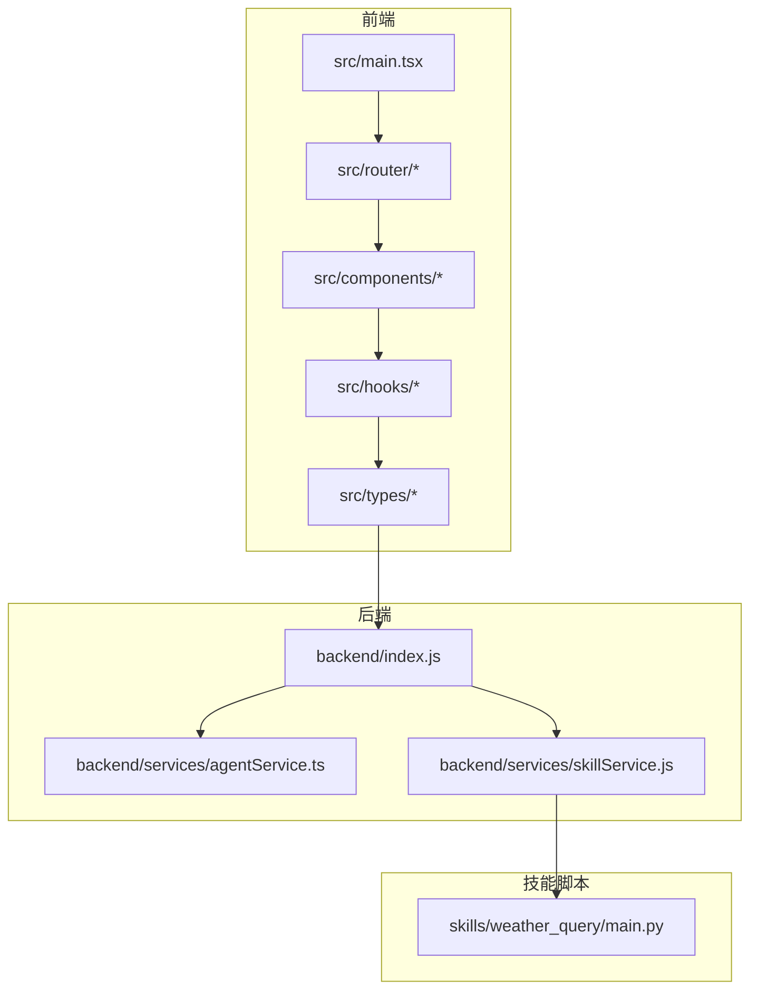
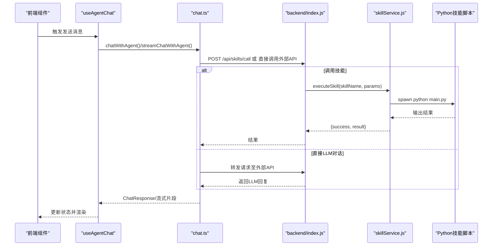
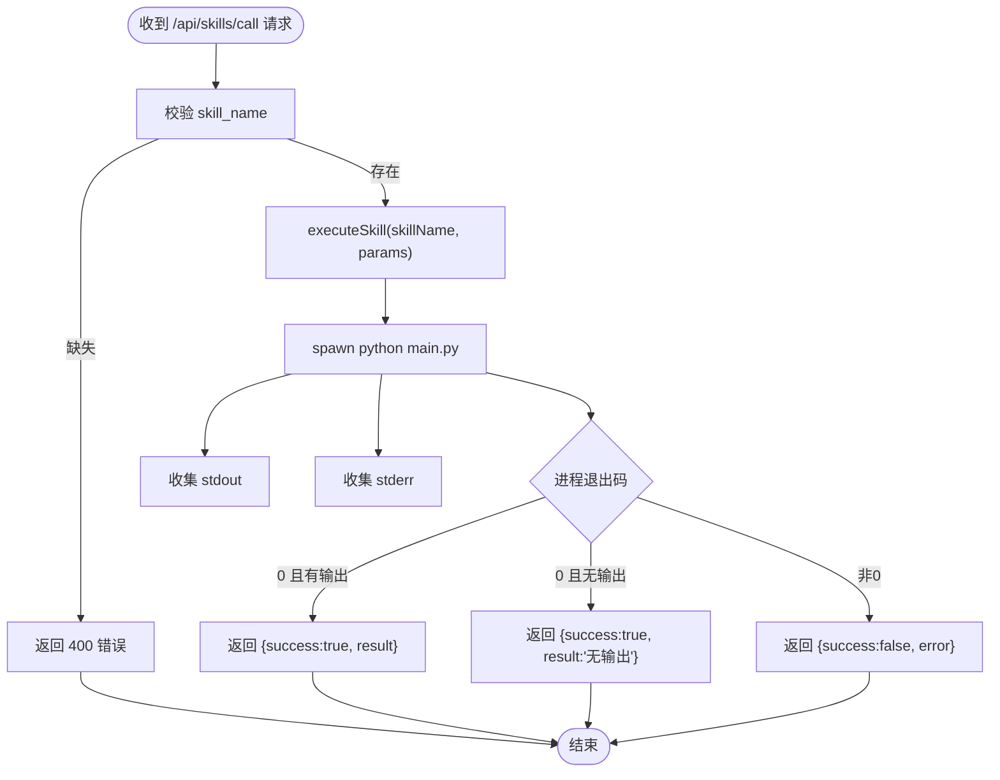
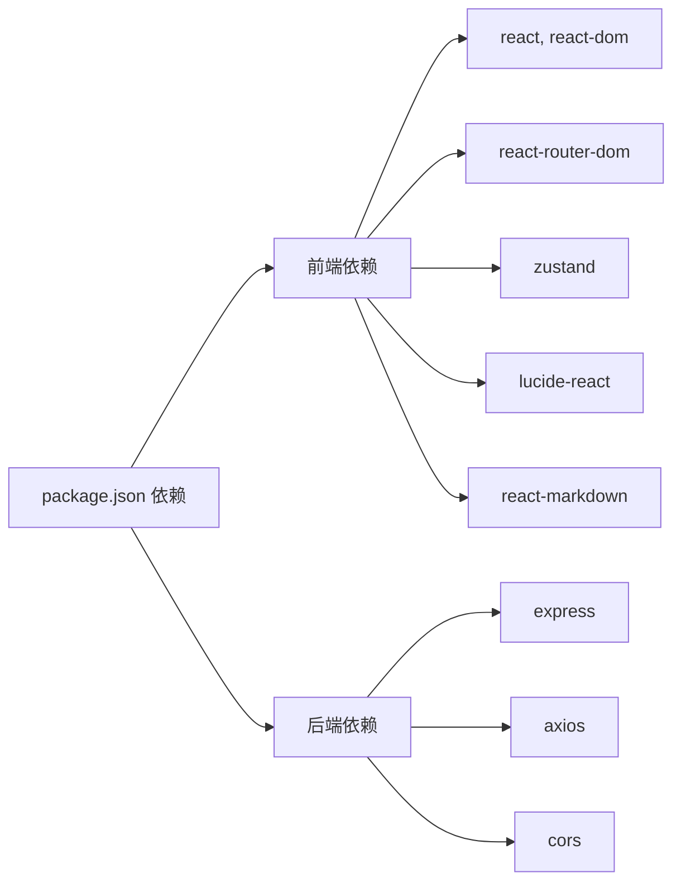

# 编码规范

<cite>
**本文引用的文件**
- [编码规范.md](file://docs/基础规范/编码规范.md)
- [命名规范.md](file://docs/基础规范/命名规范.md)
- [package.json](file://package.json)
- [tsconfig.json](file://tsconfig.json)
- [tailwind.config.ts](file://tailwind.config.ts)
- [vite.config.ts](file://vite.config.ts)
- [backend/index.js](file://backend/index.js)
- [backend/services/agentService.ts](file://backend/services/agentService.ts)
- [backend/services/skillService.js](file://backend/services/skillService.js)
- [src/main.tsx](file://src/main.tsx)
- [src/types/chat.ts](file://src/types/chat.ts)
- [src/hooks/useAgentChat.ts](file://src/hooks/useAgentChat.ts)
- [skills/weather_query/main.py](file://skills/weather_query/main.py)
</cite>

## 目录
1. [简介](#简介)
2. [项目结构](#项目结构)
3. [核心组件](#核心组件)
4. [架构总览](#架构总览)
5. [详细组件分析](#详细组件分析)
6. [依赖关系分析](#依赖关系分析)
7. [性能考量](#性能考量)
8. [故障排查指南](#故障排查指南)
9. [结论](#结论)
10. [附录](#附录)

## 简介
本文件为 AutoMate 项目的全面编码规范标准，覆盖前端（React + TypeScript）、后端（Node.js + Express）、以及 Python 技能脚本的开发规范，并统一代码格式化、注释与文档要求，提供代码审查清单与质量保障措施，明确多技术栈协作与接口约定。

## 项目结构
AutoMate 采用前后端同仓库的混合架构：
- 前端基于 Vite + React + TypeScript，使用 Tailwind CSS 进行样式管理
- 后端基于 Node.js + Express，提供技能调用代理与服务
- 技能脚本采用 Python，通过子进程方式在后端调用
- 配置与类型定义集中于 docs 与 src/types 目录

图表来源
- [src/main.tsx](file://src/main.tsx#L1-L12)
- [backend/index.js](file://backend/index.js#L1-L117)
- [backend/services/agentService.ts](file://backend/services/agentService.ts#L1-L245)
- [backend/services/skillService.js](file://backend/services/skillService.js#L1-L87)
- [skills/weather_query/main.py](file://skills/weather_query/main.py#L1-L139)

章节来源
- [package.json](file://package.json#L1-L47)
- [tsconfig.json](file://tsconfig.json#L1-L26)
- [tailwind.config.ts](file://tailwind.config.ts#L1-L161)
- [vite.config.ts](file://vite.config.ts#L1-L47)

## 核心组件
- 前端入口与路由：应用根节点、路由与页面组件
- 类型与接口：统一的 Agent、Skill、ChatMessage、ChatResponse 等类型定义
- Hook：封装聊天流程的状态与异步交互
- 后端服务：代理技能调用、调用外部 LLM API
- 技能脚本：Python 实现的具体业务能力

章节来源
- [src/main.tsx](file://src/main.tsx#L1-L12)
- [src/types/chat.ts](file://src/types/chat.ts#L1-L280)
- [src/hooks/useAgentChat.ts](file://src/hooks/useAgentChat.ts#L1-L128)
- [backend/services/agentService.ts](file://backend/services/agentService.ts#L1-L245)
- [backend/services/skillService.js](file://backend/services/skillService.js#L1-L87)

## 架构总览
前端通过 fetch/axios 与后端交互；后端负责：
- 代理技能调用（spawn 子进程执行 Python 脚本）
- 调用外部 LLM API（支持直连与反向代理）
- 统一错误处理与响应格式

图表来源
- [src/hooks/useAgentChat.ts](file://src/hooks/useAgentChat.ts#L1-L128)
- [src/types/chat.ts](file://src/types/chat.ts#L96-L260)
- [backend/index.js](file://backend/index.js#L81-L111)
- [backend/services/skillService.js](file://backend/services/skillService.js#L16-L87)
- [skills/weather_query/main.py](file://skills/weather_query/main.py#L116-L139)

## 详细组件分析

### 前端：React + TypeScript 编码规范
- 组件与Hook
  - 优先使用函数组件与 Hooks
  - 组件名使用 PascalCase；自定义 Hook 以 use 开头
  - Props 使用 TypeScript 接口定义，回调以 on 开头
- 状态管理
  - useState 解构命名以 set 开头；使用函数式更新避免闭包陷阱
  - 使用 useCallback/useMemo 缓存回调与计算结果
- 事件处理
  - 事件处理函数以 handle 开头；使用 React 事件类型
- 条件与列表渲染
  - 三元与逻辑与用于简单条件；复杂逻辑拆分为独立函数
  - 列表渲染必须提供稳定唯一 key
- 样式
  - 优先使用 Tailwind CSS 类名；动态类名使用模板字符串或第三方库
- 性能
  - 对稳定组件使用 React.memo；对频繁计算使用 useMemo；对回调使用 useCallback

章节来源
- [编码规范.md](file://docs/基础规范/编码规范.md#L5-L335)
- [命名规范.md](file://docs/基础规范/命名规范.md#L21-L134)

### 前端：类型系统与严格模式
- 接口与类型别名
  - 使用 interface 定义对象结构；使用 type 定义联合/交叉类型
  - 泛型提升复用性；类型守卫缩小范围
- 严格模式
  - 启用 tsconfig 严格模式；使用可选链与空值合并
- 导入导出
  - 显式导出类型；使用 import type 导入类型

章节来源
- [编码规范.md](file://docs/基础规范/编码规范.md#L336-L458)
- [tsconfig.json](file://tsconfig.json#L1-L26)

### 前端：组件与Hook实现要点
- 入口与路由
  - 应用根节点使用 StrictMode 包裹；路由按页面拆分
- Hook 设计
  - useAgentChat：封装加载配置、拉取技能描述、发送消息、流式输出
  - 返回值包含发送与流式两套方法，以及加载状态与错误信息
- 类型与接口
  - ChatResponse、StreamChunk、Agent/Skill 等类型集中定义，便于跨模块复用

章节来源
- [src/main.tsx](file://src/main.tsx#L1-L12)
- [src/hooks/useAgentChat.ts](file://src/hooks/useAgentChat.ts#L1-L128)
- [src/types/chat.ts](file://src/types/chat.ts#L1-L280)

### 后端：Node.js + Express 编码规范
- 代码风格
  - 遵循 ESLint 规则；2 空格缩进；每行不超过 100 字符；空行分隔函数与模块
- 异步与错误处理
  - 使用 async/await；try-catch 捕获异常；自定义错误类
- 日志记录
  - 使用 console 或 winston 记录 debug/log/warn/error
- 数据验证
  - 自定义验证函数校验请求参数
- 中间件与路由
  - CORS、JSON 解析中间件；路由按功能拆分（技能调用、健康检查）

章节来源
- [编码规范.md](file://docs/基础规范/编码规范.md#L459-L635)
- [package.json](file://package.json#L10-L13)

### 后端：服务与接口设计
- 技能服务
  - executeSkill：spawn 子进程执行 Python 脚本；收集 stdout/stderr；返回统一结构
  - callSkill：对外暴露的调用入口，捕获异常并返回结构化错误
- 代理服务
  - /api/skills/call：接收 skill_name 与 parameters，转发给 executeSkill
  - /api/skills：健康检查接口
- LLM 服务
  - agentService：读取 agents.json，拼装 system prompt，调用外部 LLM API；支持错误分类与返回

图表来源
- [backend/index.js](file://backend/index.js#L81-L111)
- [backend/services/skillService.js](file://backend/services/skillService.js#L16-L87)

章节来源
- [backend/index.js](file://backend/index.js#L1-L117)
- [backend/services/skillService.js](file://backend/services/skillService.js#L1-L87)
- [backend/services/agentService.ts](file://backend/services/agentService.ts#L1-L245)

### Python 技能脚本：编写规范
- 函数定义
  - 使用 snake_case；函数职责单一；必要时提供 docstring
- 输入参数
  - 通过命令行参数解析；JSON 参数通过 --params 传入
- 错误处理
  - 捕获具体异常并返回结构化错误；区分网络、HTTP、解析等错误
- 输出格式
  - 统一返回文本报告；失败时返回带错误标记的字符串

章节来源
- [skills/weather_query/main.py](file://skills/weather_query/main.py#L1-L139)
- [命名规范.md](file://docs/基础规范/命名规范.md#L135-L195)

### 代码格式化与检查
- 前端
  - Prettier 自动格式化；ESLint 检查质量；TypeScript 类型检查
- 后端
  - Prettier（JS）；ESLint（JS）；Node.js 严格模式
- 工程配置
  - Vite 配置别名、代理、构建分包策略
  - Tailwind 配置主题、动画、暗色模式

章节来源
- [编码规范.md](file://docs/基础规范/编码规范.md#L675-L740)
- [package.json](file://package.json#L10-L13)
- [vite.config.ts](file://vite.config.ts#L1-L47)
- [tailwind.config.ts](file://tailwind.config.ts#L1-L161)

### 注释与文档
- 函数文档字符串
  - JSDoc 风格；描述参数、返回值、可能抛出的异常
- 行内注释
  - 解释复杂逻辑；避免显而易见的注释
- 文档与规范
  - 命名规范、编码规范、开发环境配置等文档作为参考

章节来源
- [编码规范.md](file://docs/基础规范/编码规范.md#L639-L674)
- [命名规范.md](file://docs/基础规范/命名规范.md#L1-L370)

### 代码审查清单
- 命名与风格
  - 符合命名规范；文件/变量/函数/类型/接口命名一致
- 类型与注释
  - TypeScript 类型完整；JSDoc 注释齐全
- 错误处理与日志
  - 异常捕获与分类；日志级别恰当
- 格式化与检查
  - Prettier 格式化；ESLint 通过；类型检查无告警
- 性能与健壮性
  - 避免重复渲染；合理使用缓存；超时与重试策略
- 测试与覆盖率
  - 单元测试覆盖关键路径；集成测试覆盖端到端流程

章节来源
- [编码规范.md](file://docs/基础规范/编码规范.md#L714-L728)

## 依赖关系分析
- 前端依赖
  - React 生态、路由、状态管理、图标库、Markdown 渲染、Tailwind CSS
- 构建与工具
  - Vite、ESLint、TypeScript、Tailwind、PostCSS
- 后端依赖
  - Express、CORS、Axios、child_process（调用 Python）

图表来源
- [package.json](file://package.json#L15-L45)

章节来源
- [package.json](file://package.json#L1-L47)

## 性能考量
- 前端
  - 使用 React.memo、useMemo、useCallback 降低重渲染
  - 懒加载与代码分割（Vite 分包策略）
  - Tailwind 原子类减少样式体积
- 后端
  - 子进程并发控制与资源回收
  - 超时与错误快速失败，避免阻塞
- 网络
  - 代理统一出口，减少跨域与证书问题
  - 流式响应提升用户体验

## 故障排查指南
- 前端
  - 检查路由与别名配置；确认代理目标与重写规则
  - 检查类型定义与接口一致性
- 后端
  - 检查技能脚本路径与权限；确认 Python 环境可用
  - 检查 CORS 与 Content-Type 设置
- 技能脚本
  - 检查命令行参数解析；确认网络访问与超时设置

章节来源
- [vite.config.ts](file://vite.config.ts#L18-L30)
- [backend/index.js](file://backend/index.js#L14-L16)
- [skills/weather_query/main.py](file://skills/weather_query/main.py#L128-L139)

## 结论
本规范统一了 AutoMate 项目在前端、后端与 Python 技能脚本的开发标准，结合工程化配置与代码审查清单，确保代码质量、可维护性与跨技术栈协作效率。建议在团队内定期回顾与更新，持续改进。

## 附录
- 参考资源
  - React、TypeScript、Node.js、Express、Tailwind CSS、ESLint、开发环境配置

章节来源
- [编码规范.md](file://docs/基础规范/编码规范.md#L729-L740)