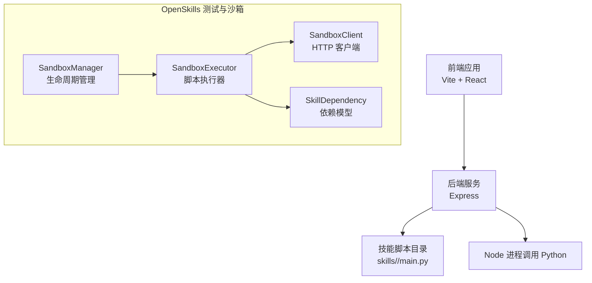
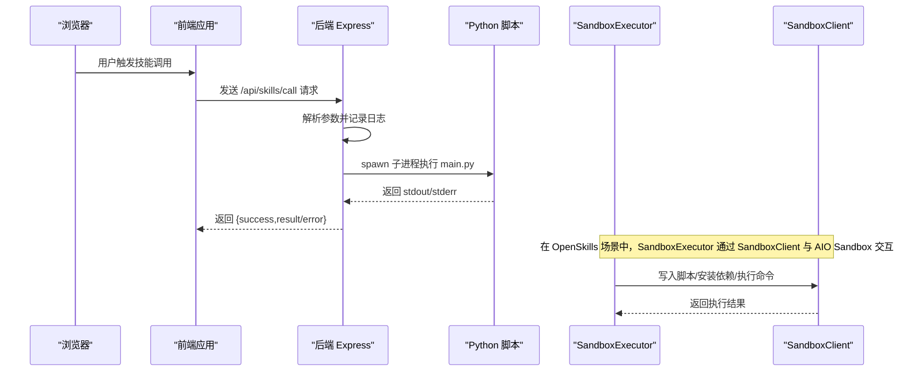
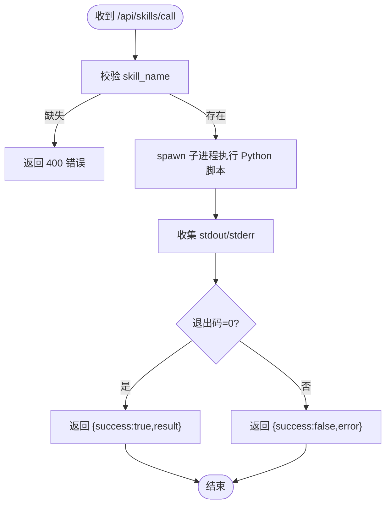
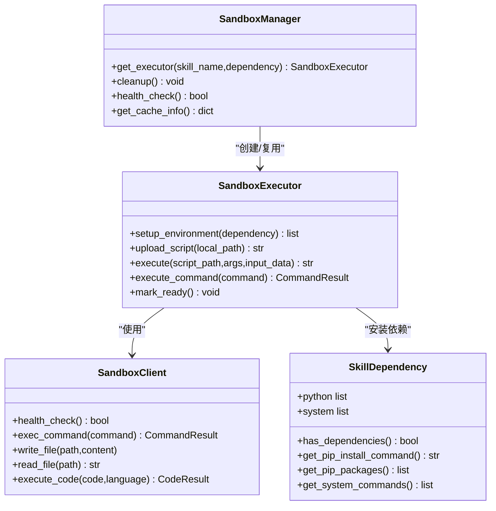
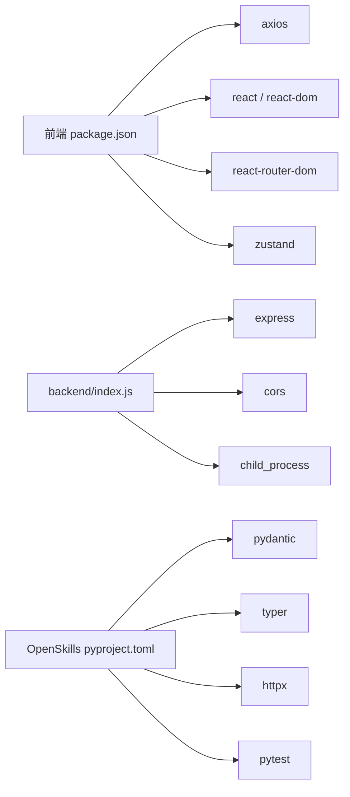

# 调试与测试

<cite>
**本文引用的文件**
- [package.json](file://package.json)
- [backend/index.js](file://backend/index.js)
- [src/main.tsx](file://src/main.tsx)
- [OpenSkills-main/pyproject.toml](file://OpenSkills-main/pyproject.toml)
- [OpenSkills-main/tests/test_sandbox.py](file://OpenSkills-main/tests/test_sandbox.py)
- [OpenSkills-main/openskills/sandbox/manager.py](file://OpenSkills-main/openskills/sandbox/manager.py)
- [OpenSkills-main/openskills/sandbox/client.py](file://OpenSkills-main/openskills/sandbox/client.py)
- [OpenSkills-main/openskills/sandbox/executor.py](file://OpenSkills-main/openskills/sandbox/executor.py)
- [OpenSkills-main/openskills/models/dependency.py](file://OpenSkills-main/openskills/models/dependency.py)
- [OpenSkills-main/tests/test_manager.py](file://OpenSkills-main/tests/test_manager.py)
- [OpenSkills-main/tests/test_matcher.py](file://OpenSkills-main/tests/test_matcher.py)
</cite>

## 目录
1. [引言](#引言)
2. [项目结构](#项目结构)
3. [核心组件](#核心组件)
4. [架构总览](#架构总览)
5. [详细组件分析](#详细组件分析)
6. [依赖关系分析](#依赖关系分析)
7. [性能考虑](#性能考虑)
8. [故障排查指南](#故障排查指南)
9. [结论](#结论)
10. [附录](#附录)

## 引言
本文件面向 AutoMate 项目的调试与测试体系建设，覆盖前端、后端、Python 技能脚本三类调试方法，以及单元测试、集成测试与性能分析的实践指南。文档以仓库现有代码为依据，结合实际可操作的流程与图示，帮助开发者快速定位问题、提升质量与稳定性。

## 项目结构
AutoMate 采用前后端分离与“技能脚本”解耦的设计：前端通过 Vite + React 构建，后端以 Express 提供 API 并调用 skills 目录下的 Python 脚本；同时在 OpenSkills 子项目中提供了沙箱执行、依赖管理与测试框架，便于对技能脚本进行隔离执行与自动化测试。

图表来源
- [backend/index.js](file://backend/index.js#L1-L117)
- [package.json](file://package.json#L1-L47)
- [OpenSkills-main/openskills/sandbox/client.py](file://OpenSkills-main/openskills/sandbox/client.py#L1-L986)
- [OpenSkills-main/openskills/sandbox/executor.py](file://OpenSkills-main/openskills/sandbox/executor.py#L1-L355)
- [OpenSkills-main/openskills/sandbox/manager.py](file://OpenSkills-main/openskills/sandbox/manager.py#L1-L237)
- [OpenSkills-main/openskills/models/dependency.py](file://OpenSkills-main/openskills/models/dependency.py#L1-L87)

章节来源
- [package.json](file://package.json#L1-L47)
- [backend/index.js](file://backend/index.js#L1-L117)

## 核心组件
- 前端入口与路由
  - 应用根节点与路由挂载，便于在浏览器中使用 React DevTools 进行组件树与状态检查。
- 后端服务
  - 提供技能调用 API 与健康检查，内部通过子进程调用 Python 脚本，并收集标准输出与错误输出。
- OpenSkills 沙箱体系
  - SandboxClient：封装 AIO Sandbox 的 HTTP API，支持命令执行、文件读写、代码执行等。
  - SandboxExecutor：统一脚本执行流程，负责上传脚本、安装依赖、执行与输出捕获。
  - SandboxManager：按策略复用/缓存执行器，支持 PER_EXECUTION、PER_SKILL、PERSISTENT 三种策略。
  - SkillDependency：描述技能所需的 Python 包与系统命令，生成 pip install 命令与系统指令列表。

章节来源
- [src/main.tsx](file://src/main.tsx#L1-L12)
- [backend/index.js](file://backend/index.js#L1-L117)
- [OpenSkills-main/openskills/sandbox/client.py](file://OpenSkills-main/openskills/sandbox/client.py#L1-L986)
- [OpenSkills-main/openskills/sandbox/executor.py](file://OpenSkills-main/openskills/sandbox/executor.py#L1-L355)
- [OpenSkills-main/openskills/sandbox/manager.py](file://OpenSkills-main/openskills/sandbox/manager.py#L1-L237)
- [OpenSkills-main/openskills/models/dependency.py](file://OpenSkills-main/openskills/models/dependency.py#L1-L87)

## 架构总览
下图展示从浏览器到后端再到 Python 技能脚本的整体调用链路，以及 OpenSkills 沙箱执行器在其中的角色。

图表来源
- [backend/index.js](file://backend/index.js#L19-L104)
- [OpenSkills-main/openskills/sandbox/executor.py](file://OpenSkills-main/openskills/sandbox/executor.py#L255-L331)
- [OpenSkills-main/openskills/sandbox/client.py](file://OpenSkills-main/openskills/sandbox/client.py#L264-L325)

## 详细组件分析

### 前端调试要点（React DevTools、状态与组件）
- 组件树与 Props 检查
  - 使用 React DevTools 查看组件层级、Props 传递与渲染次数，定位不必要重渲染。
- 状态调试
  - 结合 Zustand Store（如 useAppStore）在 DevTools 中观察状态变化，确认数据流向。
- Hooks 调试
  - 在自定义 Hook（如 useAgentChat、useResponsive）中插入日志或断点，验证响应式行为。
- 路由与页面切换
  - 通过路由切换验证页面生命周期钩子与资源释放，避免内存泄漏。

章节来源
- [src/main.tsx](file://src/main.tsx#L1-L12)

### 后端调试（Node.js 调试器、API 与子进程）
- 启动与监听
  - 后端监听端口并打印启动日志，便于确认服务状态。
- 技能调用流程
  - 记录请求体、参数、子进程输出与错误，便于定位脚本执行失败原因。
- 错误处理
  - 对缺失参数、执行异常与子进程错误进行结构化返回，便于前端与日志分析。

图表来源
- [backend/index.js](file://backend/index.js#L81-L104)
- [backend/index.js](file://backend/index.js#L19-L79)

章节来源
- [backend/index.js](file://backend/index.js#L1-L117)

### Python 技能脚本调试策略
- print 调试
  - 在脚本关键路径添加输出，结合后端日志查看 stdout/stderr。
- 异常捕获
  - 使用 try/except 捕获异常并返回结构化错误信息，便于后端统一处理。
- 日志分析
  - 利用后端日志与 Python 脚本输出定位输入参数、工作目录与依赖问题。

章节来源
- [backend/index.js](file://backend/index.js#L38-L78)

### 单元测试编写规范（基于 OpenSkills 测试）
- 测试组织
  - 使用 pytest 与 asyncio，按功能模块划分测试文件（如 test_sandbox.py、test_manager.py、test_matcher.py）。
- Mock 使用
  - 对外部依赖（如 HTTP 客户端、文件系统）进行 Mock，确保测试稳定与可重复。
- 断言方法
  - 对返回值、异常类型与副作用进行断言，覆盖成功与失败分支。
- 示例规范
  - 为每个被测类/函数提供最小可运行的测试用例，明确输入、期望输出与边界条件。

章节来源
- [OpenSkills-main/pyproject.toml](file://OpenSkills-main/pyproject.toml#L72-L75)
- [OpenSkills-main/tests/test_sandbox.py](file://OpenSkills-main/tests/test_sandbox.py#L1-L297)
- [OpenSkills-main/tests/test_manager.py](file://OpenSkills-main/tests/test_manager.py#L1-L170)
- [OpenSkills-main/tests/test_matcher.py](file://OpenSkills-main/tests/test_matcher.py#L1-L99)

### 集成测试与端到端测试
- 端到端测试建议
  - 前端：使用 E2E 工具（如 Playwright/Cypress）模拟用户操作，验证从输入到输出的完整链路。
  - 后端：通过 API 测试框架（如 Supertest/pytest）对 /api/skills/call 与 /api/skills 进行集成验证。
- OpenSkills 沙箱集成
  - 使用 SandboxManager 的不同策略（PER_SKILL/PERSISTENT）进行缓存与复用场景的回归测试。
  - 验证依赖安装、脚本上传与执行的完整流程，覆盖超时、权限与路径错误等异常分支。

章节来源
- [OpenSkills-main/openskills/sandbox/manager.py](file://OpenSkills-main/openskills/sandbox/manager.py#L17-L28)
- [OpenSkills-main/openskills/sandbox/manager.py](file://OpenSkills-main/openskills/sandbox/manager.py#L109-L147)
- [OpenSkills-main/openskills/sandbox/executor.py](file://OpenSkills-main/openskills/sandbox/executor.py#L123-L171)

### 沙箱执行器与依赖管理（类图）

图表来源
- [OpenSkills-main/openskills/sandbox/client.py](file://OpenSkills-main/openskills/sandbox/client.py#L119-L986)
- [OpenSkills-main/openskills/sandbox/executor.py](file://OpenSkills-main/openskills/sandbox/executor.py#L22-L355)
- [OpenSkills-main/openskills/sandbox/manager.py](file://OpenSkills-main/openskills/sandbox/manager.py#L30-L237)
- [OpenSkills-main/openskills/models/dependency.py](file://OpenSkills-main/openskills/models/dependency.py#L13-L87)

## 依赖关系分析
- 前端
  - 依赖 axios、react、react-router-dom、zustand 等，构建与预览脚本由 Vite 管理。
- 后端
  - 依赖 express、cors，通过 child_process 调用 Python 脚本。
- OpenSkills
  - 依赖 pydantic、typer、httpx 等，提供沙箱客户端、执行器与管理器，配合 pytest 进行测试。

图表来源
- [package.json](file://package.json#L15-L45)
- [backend/index.js](file://backend/index.js#L1-L12)
- [OpenSkills-main/pyproject.toml](file://OpenSkills-main/pyproject.toml#L22-L38)

章节来源
- [package.json](file://package.json#L1-L47)
- [backend/index.js](file://backend/index.js#L1-L117)
- [OpenSkills-main/pyproject.toml](file://OpenSkills-main/pyproject.toml#L1-L75)

## 性能考虑
- 前端性能
  - 使用 React DevTools 分析渲染次数与重渲染热点，结合 Suspense/Lazy 优化首屏与大组件加载。
  - 使用浏览器性能面板（Performance）录制交互过程，识别长任务与布局抖动。
- 后端性能
  - 关注子进程创建与 I/O 开销，避免频繁 spawn；对 Python 脚本执行设置合理超时。
  - 使用日志记录耗时关键点，定位慢调用与阻塞源。
- 沙箱执行
  - 利用 SandboxManager 的 PER_SKILL/PERSISTENT 策略减少初始化开销；对大量依赖安装进行批处理与去重。
  - 通过健康检查与缓存信息（get_cache_info）监控资源占用与命中率。

章节来源
- [OpenSkills-main/openskills/sandbox/manager.py](file://OpenSkills-main/openskills/sandbox/manager.py#L193-L236)
- [OpenSkills-main/openskills/sandbox/executor.py](file://OpenSkills-main/openskills/sandbox/executor.py#L123-L171)

## 故障排查指南
- 常见问题与定位
  - 技能调用 400：检查请求体是否包含 skill_name。
  - 技能执行失败：查看后端日志中的 stdout/stderr，确认脚本路径、参数与依赖。
  - 子进程错误：关注 error 回调与退出码，结合 Python 脚本异常堆栈定位。
  - 沙箱连接失败：使用 SandboxClient.health_check 与 SandboxManager.health_check 快速判断服务可用性。
- 建议流程
  - 启动顺序：先启动后端服务，再启动前端；若使用沙箱，确保 AIO Sandbox 服务可用。
  - 日志优先：优先查看后端控制台与 Python 脚本输出，其次查看前端网络面板与 React DevTools。
  - 复现最小化：构造最小输入参数与依赖，逐步缩小问题范围。

章节来源
- [backend/index.js](file://backend/index.js#L81-L104)
- [backend/index.js](file://backend/index.js#L71-L78)
- [OpenSkills-main/openskills/sandbox/client.py](file://OpenSkills-main/openskills/sandbox/client.py#L203-L218)
- [OpenSkills-main/openskills/sandbox/manager.py](file://OpenSkills-main/openskills/sandbox/manager.py#L208-L226)

## 结论
通过前端 React DevTools、后端 Node.js 调试器与 Python 脚本日志相结合，辅以 OpenSkills 沙箱执行器与完善的单元/集成测试，AutoMate 可形成从组件到服务再到脚本的全链路调试与测试体系。建议在开发流程中固化日志规范、Mock 策略与测试覆盖率目标，持续提升系统的可观测性与稳定性。

## 附录
- 调试快捷键与工具
  - Chrome DevTools：Elements/Console/Network/Performance/Timeline。
  - VS Code 调试：前端可使用 React DevTools 扩展；后端可设置断点与条件断点；Python 可使用内置调试器或 IDE 断点。
- 测试运行建议
  - 使用 pytest 并开启 asyncio 模式，结合覆盖率工具（如 pytest-cov）评估测试完整性。
  - 对 OpenSkills 的 SandboxExecutor/SandboxManager 进行参数化测试，覆盖不同依赖组合与异常路径。