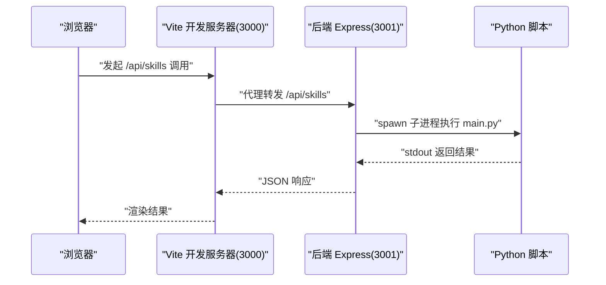
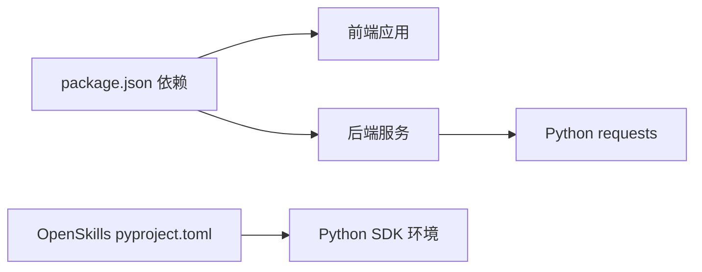

# 快速开始

<cite>
**本文引用的文件**
- [package.json](file://package.json)
- [vite.config.ts](file://vite.config.ts)
- [backend/index.js](file://backend/index.js)
- [skills/weather_query/main.py](file://skills/weather_query/main.py)
- [main_correct.py](file://main_correct.py)
- [docs/基础规范/开发环境配置.md](file://docs/基础规范/开发环境配置.md)
- [config/agents.json](file://config/agents.json)
- [src/main.tsx](file://src/main.tsx)
- [OpenSkills-main/pyproject.toml](file://OpenSkills-main/pyproject.toml)
- [OpenSkills-main/README.md](file://OpenSkills-main/README.md)
</cite>

## 目录
1. [简介](#简介)
2. [项目结构](#项目结构)
3. [核心组件](#核心组件)
4. [架构总览](#架构总览)
5. [详细组件分析](#详细组件分析)
6. [依赖分析](#依赖分析)
7. [性能考虑](#性能考虑)
8. [故障排除指南](#故障排除指南)
9. [结论](#结论)
10. [附录](#附录)

## 简介
本指南面向新手开发者，帮助你在最短时间内成功运行 AutoMate 项目。你将获得完整的安装步骤、环境配置要求、首次运行指导、开发环境搭建命令、依赖安装过程、常见问题解决方案，以及如何启动前端开发服务器、后端服务和 Python 脚本执行环境。同时提供基本使用示例，让你快速体验核心功能。

## 项目结构
AutoMate 是一个前后端分离的项目，前端基于 React + Vite，后端采用 Node.js + Express，技能执行通过 Python 脚本实现，并由后端统一调度。核心目录与职责如下：
- 前端入口与路由：src/main.tsx、src/router
- 构建与代理：vite.config.ts（本地开发代理、端口、别名）
- 后端服务：backend/index.js（技能调用接口、Python 子进程执行）
- 技能脚本：skills/weather_query/main.py 等
- 配置文件：config/agents.json（智能体与技能配置）
- 开发环境规范：docs/基础规范/开发环境配置.md（端口、路径、HTTP 服务器）

```mermaid
graph TB
subgraph "前端(Vite)"
FE["React 应用<br/>src/main.tsx"]
VITE["Vite 开发服务器<br/>端口 3000"]
end
subgraph "后端(Node.js)"
BE["Express 服务<br/>backend/index.js"]
PY["Python 子进程<br/>skills/*/main.py"]
end
CFG["配置文件<br/>config/agents.json"]
FE --> |"HTTP 请求"| VITE
VITE --> |"代理到"/api/skills"| BE
VITE --> |"代理到"/api/proxy"| BE
BE --> |"调用"| PY
FE --> |"读取"| CFG
```

图表来源
- [src/main.tsx](file://src/main.tsx#L1-L12)
- [vite.config.ts](file://vite.config.ts#L12-L30)
- [backend/index.js](file://backend/index.js#L1-L117)
- [config/agents.json](file://config/agents.json#L1-L119)

章节来源
- [package.json](file://package.json#L6-L13)
- [vite.config.ts](file://vite.config.ts#L1-L47)
- [backend/index.js](file://backend/index.js#L1-L117)
- [docs/基础规范/开发环境配置.md](file://docs/基础规范/开发环境配置.md#L1-L243)

## 核心组件
- 前端开发服务器：使用 Vite 在本地启动，端口 3000，默认打开浏览器，支持代理到后端与外部模型网关。
- 后端技能服务：提供 /api/skills 调用接口，内部通过子进程执行 skills 目录下的 Python 脚本。
- 技能脚本：每个技能为独立的 Python 脚本，接收参数并通过标准输出返回结果。
- 配置文件：agents.json 描述智能体分组、配置与技能清单，前端按需加载。

章节来源
- [vite.config.ts](file://vite.config.ts#L12-L30)
- [backend/index.js](file://backend/index.js#L19-L79)
- [config/agents.json](file://config/agents.json#L1-L119)

## 架构总览
下图展示了从浏览器到后端再到 Python 脚本的完整调用链路，以及代理规则如何将前端请求转发至后端与外部模型网关。



图表来源
- [vite.config.ts](file://vite.config.ts#L18-L29)
- [backend/index.js](file://backend/index.js#L19-L79)

## 详细组件分析

### 前端开发服务器与代理配置
- 端口：3000（vite.config.ts），自动打开浏览器。
- 代理规则：
  - /api/skills → http://localhost:3001/api/skills（技能调用）
  - /api/proxy → https://api.fgw.sz.gov.cn:9016/modelgateway/compatible-model/v1（模型网关）
- 资源访问：允许访问上一级目录，便于读取 config/agents.json 等资源。

章节来源
- [vite.config.ts](file://vite.config.ts#L12-L30)
- [docs/基础规范/开发环境配置.md](file://docs/基础规范/开发环境配置.md#L13-L28)

### 后端技能服务
- 路由：
  - POST /api/skills/call：接收 skill_name 与 parameters，调用对应 Python 脚本。
  - GET /api/skills：健康检查。
- 执行逻辑：
  - 通过 child_process.spawn 调用 python，传递参数 JSON 字符串。
  - 捕获 stdout/stderr，根据退出码返回成功或错误信息。
- 技能目录：backend/index.js 中定义 SKILLS_BASE_PATH 为 skills 目录。

章节来源
- [backend/index.js](file://backend/index.js#L19-L79)
- [backend/index.js](file://backend/index.js#L81-L111)

### 技能脚本（以天气查询为例）
- 输入参数：通过命令行参数 --params 接收 JSON，解析出 location。
- 天气查询：调用开放天气 API，返回结构化数据。
- 输出格式：将结果格式化为自然语言报告，打印到标准输出。
- 兼容性：支持中文城市名与英文城市名映射，增强鲁棒性。

章节来源
- [skills/weather_query/main.py](file://skills/weather_query/main.py#L116-L139)
- [skills/weather_query/main.py](file://skills/weather_query/main.py#L10-L98)

### 配置文件 agents.json
- 结构：包含 agents 数组，每项含分组、智能体信息、头像、类型与配置，以及技能列表。
- 技能字段：name、description、type、storage_path、version。
- 前端加载：通过 fetch /config/agents.json 获取配置。

章节来源
- [config/agents.json](file://config/agents.json#L1-L119)

### OpenSkills Python SDK（可选）
- 用途：提供技能框架、自动发现、脚本沙箱执行等能力，适合构建复杂技能生态。
- 环境要求：Python >= 3.10。
- 安装与示例：README 提供 pip 安装与示例命令；pyproject.toml 指定依赖与脚本入口。

章节来源
- [OpenSkills-main/pyproject.toml](file://OpenSkills-main/pyproject.toml#L1-L75)
- [OpenSkills-main/README.md](file://OpenSkills-main/README.md#L26-L80)

## 依赖分析
- 前端依赖：React、React Router、Zustand、Axios、TailwindCSS 等。
- 后端依赖：Express、CORS。
- Python 技能依赖：requests（示例脚本）。
- OpenSkills SDK：PyYAML、Pydantic、Typer、HTTPX、Rich 等。



图表来源
- [package.json](file://package.json#L15-L27)
- [backend/index.js](file://backend/index.js#L1-L10)
- [OpenSkills-main/pyproject.toml](file://OpenSkills-main/pyproject.toml#L22-L28)

章节来源
- [package.json](file://package.json#L15-L27)
- [OpenSkills-main/pyproject.toml](file://OpenSkills-main/pyproject.toml#L22-L28)

## 性能考虑
- 前端打包：vite.config.ts 对第三方库进行手动分包，减少首屏体积。
- 代理与缓存：开发阶段建议禁用浏览器缓存，避免静态资源缓存导致的更新不生效。
- 技能执行：Python 子进程启动有开销，建议复用已有实例或在后端做轻量级缓存。

章节来源
- [vite.config.ts](file://vite.config.ts#L32-L45)

## 故障排除指南
- 启动顺序错误
  - 症状：前端无法加载配置或技能调用失败。
  - 排查：确保先启动后端服务（监听 3001），再启动前端（监听 3000）。
- 端口冲突
  - 症状：Vite 或后端启动失败。
  - 排查：使用 netstat 检查 3000/3001 端口占用，必要时更换端口。
- 路径访问问题
  - 症状：浏览器访问 /config/agents.json 返回 404。
  - 排查：按照开发环境配置文档，在项目根目录启动 Python HTTP 服务器或使用 Vite 代理。
- 技能执行失败
  - 症状：后端返回技能执行失败或空输出。
  - 排查：确认 skills 目录下存在对应 skill_name 的 main.py；检查 Python 环境与依赖；查看后端控制台日志。
- 模型网关访问异常
  - 症状：/api/proxy 无法访问外部模型网关。
  - 排查：检查代理 rewrite 规则与目标地址；确认网络连通性与证书配置。

章节来源
- [docs/基础规范/开发环境配置.md](file://docs/基础规范/开发环境配置.md#L156-L167)
- [vite.config.ts](file://vite.config.ts#L18-L29)
- [backend/index.js](file://backend/index.js#L19-L79)

## 结论
通过本指南，你可以完成 AutoMate 的环境准备、依赖安装与首次运行。建议优先验证后端技能服务与前端代理配置，再逐步接入真实模型网关与技能脚本。遇到问题时，结合端口、路径与代理规则进行排查，通常能快速定位并解决。

## 附录

### 系统要求与兼容性
- 前端
  - Node.js 版本：满足 package.json 中依赖版本范围
  - 浏览器：现代浏览器（支持 ES 模块与 Fetch API）
- 后端
  - Node.js：支持 ES 模块与 child_process
  - 运行时：Windows/Linux/macOS
- Python 技能
  - Python：示例脚本使用 requests，确保网络可达
- OpenSkills SDK（可选）
  - Python：>= 3.10

章节来源
- [package.json](file://package.json#L15-L27)
- [OpenSkills-main/pyproject.toml](file://OpenSkills-main/pyproject.toml#L6-L21)

### 安装与首次运行步骤
- 安装前端依赖
  - 在项目根目录执行安装命令（例如使用 npm 或 pnpm）
- 启动后端服务
  - 在项目根目录执行后端启动命令（参考 package.json 中的 scripts）
- 启动前端开发服务器
  - 在项目根目录执行前端启动命令（Vite 默认端口 3000）
- 验证代理与技能调用
  - 访问前端页面，触发 /api/skills 调用，观察后端控制台输出
- 加载配置
  - 确认 /config/agents.json 可被前端正常加载

章节来源
- [package.json](file://package.json#L6-L13)
- [vite.config.ts](file://vite.config.ts#L12-L30)
- [backend/index.js](file://backend/index.js#L113-L116)
- [config/agents.json](file://config/agents.json#L1-L119)

### 常用命令速查
- 启动前端开发服务器：在项目根目录执行前端启动命令
- 启动后端服务：在项目根目录执行后端启动命令
- 同时启动前后端：在项目根目录执行“同时启动”命令
- 构建产物：执行构建命令生成 dist 目录
- 类型检查与 ESLint：分别执行类型检查与代码质量检查命令

章节来源
- [package.json](file://package.json#L6-L13)

### 基本使用示例
- 天气查询技能
  - 在前端页面触发技能调用，传入城市参数
  - 后端接收到请求后，调用 skills/weather_query/main.py
  - Python 脚本返回格式化后的天气报告
- 模型网关代理
  - 前端通过 /api/proxy 访问外部模型网关，代理规则已在 vite.config.ts 中配置

章节来源
- [skills/weather_query/main.py](file://skills/weather_query/main.py#L116-L139)
- [vite.config.ts](file://vite.config.ts#L18-L29)