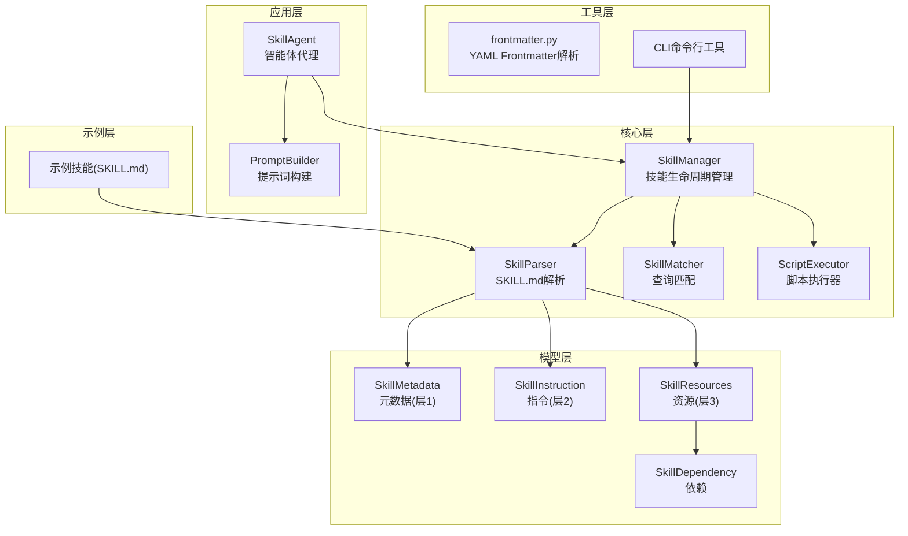
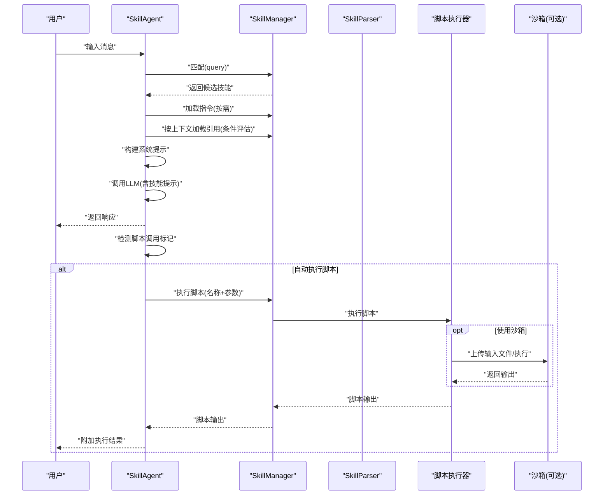
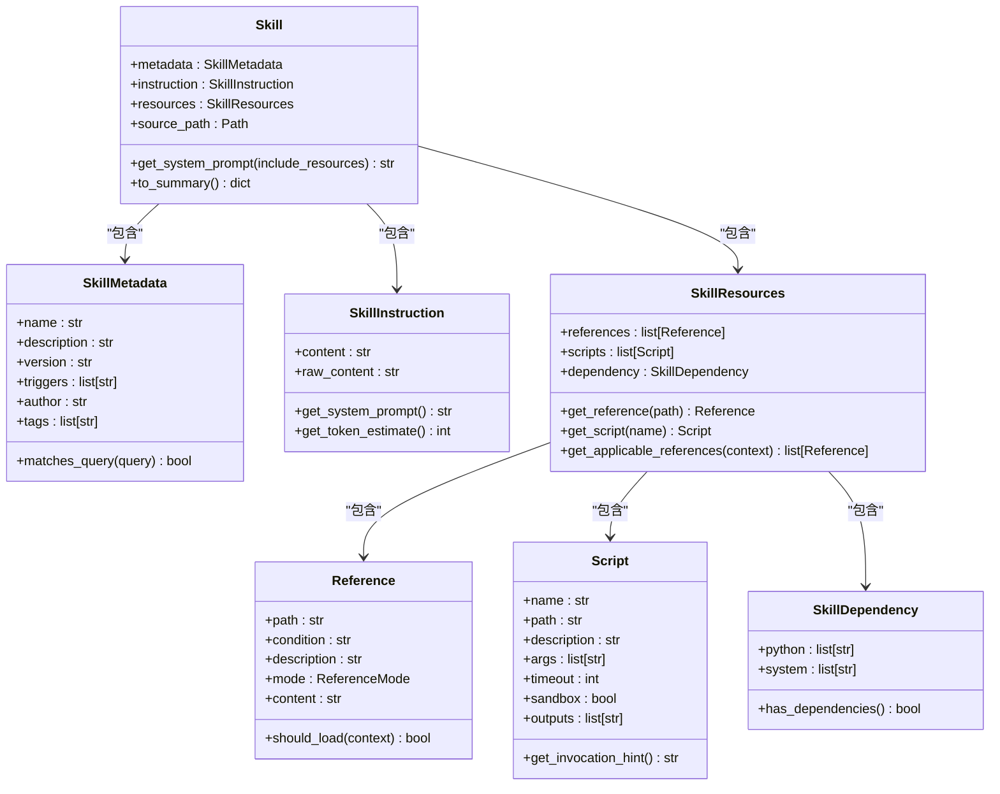
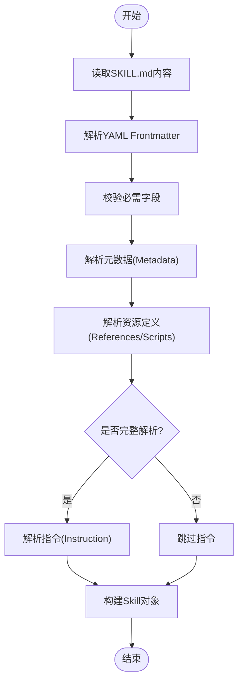
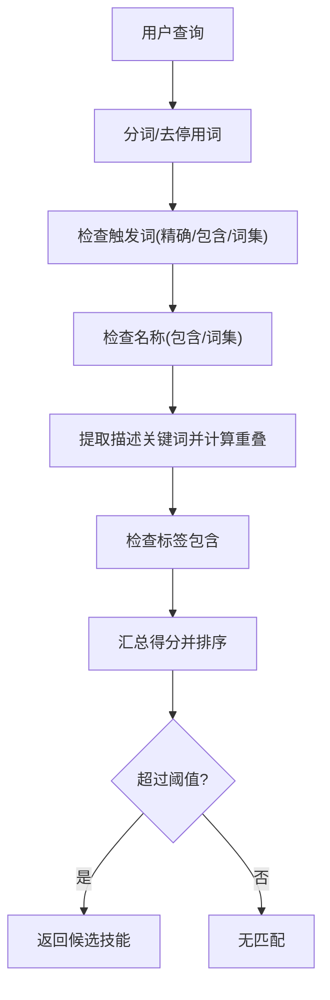
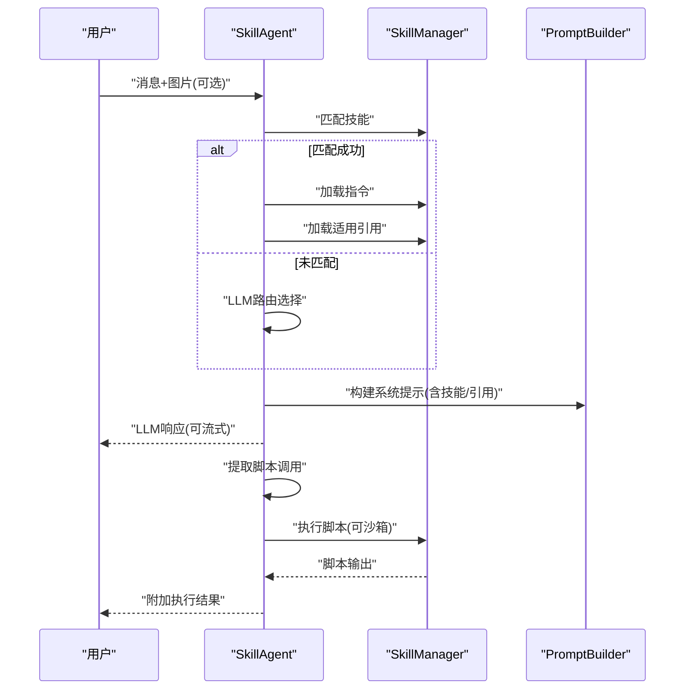
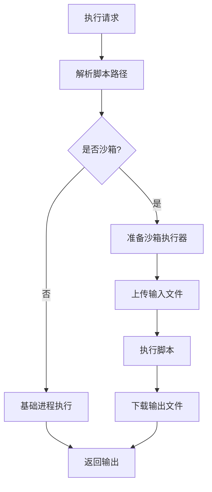
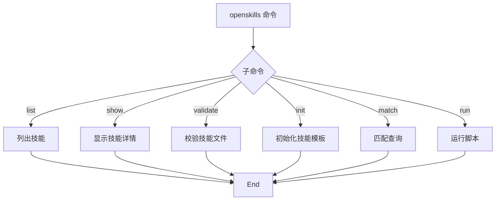
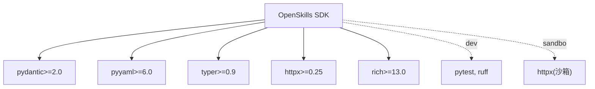

# Trae框架开发

<cite>
**本文引用的文件**
- [openskills/__init__.py](file://OpenSkills-main/openskills/__init__.py)
- [openskills/core/skill.py](file://OpenSkills-main/openskills/core/skill.py)
- [openskills/core/parser.py](file://OpenSkills-main/openskills/core/parser.py)
- [openskills/models/metadata.py](file://OpenSkills-main/openskills/models/metadata.py)
- [openskills/models/instruction.py](file://OpenSkills-main/openskills/models/instruction.py)
- [openskills/models/resource.py](file://OpenSkills-main/openskills/models/resource.py)
- [openskills/core/manager.py](file://OpenSkills-main/openskills/core/manager.py)
- [openskills/agent.py](file://OpenSkills-main/openskills/agent.py)
- [openskills/utils/frontmatter.py](file://OpenSkills-main/openskills/utils/frontmatter.py)
- [pyproject.toml](file://OpenSkills-main/pyproject.toml)
- [examples/meeting-summary/SKILL.md](file://OpenSkills-main/examples/meeting-summary/SKILL.md)
- [openskills/cli/main.py](file://OpenSkills-main/openskills/cli/main.py)
- [openskills/core/matcher.py](file://OpenSkills-main/openskills/core/matcher.py)
- [openskills/core/executor.py](file://OpenSkills-main/openskills/core/executor.py)
- [openskills/models/dependency.py](file://OpenSkills-main/openskills/models/dependency.py)
</cite>

## 目录
1. [引言](#引言)
2. [项目结构](#项目结构)
3. [核心组件](#核心组件)
4. [架构总览](#架构总览)
5. [详细组件分析](#详细组件分析)
6. [依赖分析](#依赖分析)
7. [性能考虑](#性能考虑)
8. [故障排查指南](#故障排查指南)
9. [结论](#结论)
10. [附录](#附录)

## 引言
本指南面向希望基于Trae框架（即OpenSkills SDK）进行智能体技能开发与知识管理的工程师与产品人员。文档系统化阐述框架的三层渐进披露架构、技能定义与文档模板、规则匹配与执行引擎、依赖与沙箱管理、以及CLI工具链与扩展实践。通过本指南，读者可以快速掌握如何以SKILL.md为载体定义技能、如何在对话中自动触发技能、如何编写脚本并安全执行、以及如何构建可扩展的知识库与规则体系。

## 项目结构
OpenSkills SDK采用“模块化+分层”的组织方式：
- 核心层：技能对象、解析器、匹配器、执行器、管理器
- 模型层：元数据、指令、资源（引用与脚本）、依赖
- 应用层：智能体代理、提示词构建、前端交互
- 工具层：YAML Frontmatter解析、CLI命令行工具
- 示例层：多类技能样例，演示引用与脚本的组合使用

图表来源
- [openskills/core/manager.py](file://OpenSkills-main/openskills/core/manager.py#L24-L523)
- [openskills/core/parser.py](file://OpenSkills-main/openskills/core/parser.py#L19-L225)
- [openskills/models/metadata.py](file://OpenSkills-main/openskills/models/metadata.py#L11-L83)
- [openskills/models/instruction.py](file://OpenSkills-main/openskills/models/instruction.py#L11-L48)
- [openskills/models/resource.py](file://OpenSkills-main/openskills/models/resource.py#L180-L204)
- [openskills/models/dependency.py](file://OpenSkills-main/openskills/models/dependency.py#L13-L87)
- [openskills/agent.py](file://OpenSkills-main/openskills/agent.py#L61-L800)
- [openskills/utils/frontmatter.py](file://OpenSkills-main/openskills/utils/frontmatter.py#L19-L81)
- [openskills/cli/main.py](file://OpenSkills-main/openskills/cli/main.py#L19-L437)
- [examples/meeting-summary/SKILL.md](file://OpenSkills-main/examples/meeting-summary/SKILL.md#L1-L82)

章节来源
- [openskills/__init__.py](file://OpenSkills-main/openskills/__init__.py#L21-L49)
- [pyproject.toml](file://OpenSkills-main/pyproject.toml#L1-L75)

## 核心组件
- Skill：封装三层渐进披露的完整技能对象，包含元数据、指令与资源，并提供系统提示拼装能力。
- SkillManager：技能发现、注册、按需加载指令与资源、脚本执行、沙箱集成。
- SkillParser：解析SKILL.md，支持仅元数据模式与完整模式，自动扫描references目录。
- SkillMatcher：基于关键词、触发词、标签等策略的多级评分匹配。
- SkillAgent：自动技能选择、条件引用加载、脚本调用与执行、流式响应。
- ScriptExecutor：脚本安全执行器，支持超时、输出截断、环境隔离。
- Frontmatter解析：YAML Frontmatter解析与重建。
- CLI：列出技能、显示详情、校验、初始化模板、匹配查询、运行脚本。

章节来源
- [openskills/core/skill.py](file://OpenSkills-main/openskills/core/skill.py#L19-L150)
- [openskills/core/manager.py](file://OpenSkills-main/openskills/core/manager.py#L24-L523)
- [openskills/core/parser.py](file://OpenSkills-main/openskills/core/parser.py#L19-L225)
- [openskills/core/matcher.py](file://OpenSkills-main/openskills/core/matcher.py#L22-L221)
- [openskills/agent.py](file://OpenSkills-main/openskills/agent.py#L61-L800)
- [openskills/core/executor.py](file://OpenSkills-main/openskills/core/executor.py#L24-L251)
- [openskills/utils/frontmatter.py](file://OpenSkills-main/openskills/utils/frontmatter.py#L19-L81)
- [openskills/cli/main.py](file://OpenSkills-main/openskills/cli/main.py#L19-L437)

## 架构总览
下图展示了从用户输入到技能执行的关键流程：发现与匹配、指令与资源加载、提示词构建、LLM推理、脚本调用与输出回传。

图表来源
- [openskills/agent.py](file://OpenSkills-main/openskills/agent.py#L228-L321)
- [openskills/core/manager.py](file://OpenSkills-main/openskills/core/manager.py#L181-L317)
- [openskills/core/executor.py](file://OpenSkills-main/openskills/core/executor.py#L61-L159)

## 详细组件分析

### 组件A：技能对象与三层渐进披露
- 层1（元数据）：始终加载，用于发现与匹配，字段包括名称、描述、版本、触发词、作者、标签。
- 层2（指令）：按需加载，注入系统提示，包含具体规则与约束。
- 层3（资源）：条件加载，分为引用与脚本两类，支持显式/隐式/总是三种加载模式。
- 系统提示拼装：将指令、可用动作提示、已加载引用内容整合为最终系统提示。

图表来源
- [openskills/core/skill.py](file://OpenSkills-main/openskills/core/skill.py#L19-L150)
- [openskills/models/metadata.py](file://OpenSkills-main/openskills/models/metadata.py#L11-L83)
- [openskills/models/instruction.py](file://OpenSkills-main/openskills/models/instruction.py#L11-L48)
- [openskills/models/resource.py](file://OpenSkills-main/openskills/models/resource.py#L45-L204)
- [openskills/models/dependency.py](file://OpenSkills-main/openskills/models/dependency.py#L13-L87)

章节来源
- [openskills/core/skill.py](file://OpenSkills-main/openskills/core/skill.py#L19-L150)
- [openskills/models/metadata.py](file://OpenSkills-main/openskills/models/metadata.py#L11-L83)
- [openskills/models/instruction.py](file://OpenSkills-main/openskills/models/instruction.py#L11-L48)
- [openskills/models/resource.py](file://OpenSkills-main/openskills/models/resource.py#L45-L204)
- [openskills/models/dependency.py](file://OpenSkills-main/openskills/models/dependency.py#L13-L87)

### 组件B：解析器与Frontmatter
- 支持仅解析元数据（快速发现）与完整解析（含指令）两种模式。
- 自动扫描references目录，补充未在frontmatter声明的引用。
- Frontmatter解析采用正则与YAML解析，确保健壮性。

图表来源
- [openskills/core/parser.py](file://OpenSkills-main/openskills/core/parser.py#L33-L100)
- [openskills/utils/frontmatter.py](file://OpenSkills-main/openskills/utils/frontmatter.py#L19-L65)

章节来源
- [openskills/core/parser.py](file://OpenSkills-main/openskills/core/parser.py#L19-L225)
- [openskills/utils/frontmatter.py](file://OpenSkills-main/openskills/utils/frontmatter.py#L19-L81)

### 组件C：匹配器与规则系统
- 匹配策略：精确触发词、部分触发词、名称匹配、描述关键词、标签匹配。
- 评分归一化与排序，支持阈值过滤与上限限制。
- 未来可扩展语义相似度与LLM意图分类。

图表来源
- [openskills/core/matcher.py](file://OpenSkills-main/openskills/core/matcher.py#L53-L160)

章节来源
- [openskills/core/matcher.py](file://OpenSkills-main/openskills/core/matcher.py#L22-L221)

### 组件D：智能体代理与对话流程
- 自动技能选择：优先关键字匹配，其次LLM路由。
- 条件引用加载：显式/隐式由LLM评估，总是模式直接加载。
- 脚本执行：检测响应中的脚本调用标记，按需执行并回传结果。
- 流式输出：支持流式聊天，逐步拼接与回调。

图表来源
- [openskills/agent.py](file://OpenSkills-main/openskills/agent.py#L228-L321)
- [openskills/agent.py](file://OpenSkills-main/openskills/agent.py#L404-L470)

章节来源
- [openskills/agent.py](file://OpenSkills-main/openskills/agent.py#L61-L800)

### 组件E：脚本执行与沙箱集成
- 支持Python、Shell、JS、TS等脚本类型。
- 超时控制、输出截断、环境变量清理、敏感变量屏蔽。
- 沙箱模式：自动上传本地输入文件、执行、下载输出文件，支持持久化执行器与依赖预热。

图表来源
- [openskills/core/manager.py](file://OpenSkills-main/openskills/core/manager.py#L265-L360)
- [openskills/core/executor.py](file://OpenSkills-main/openskills/core/executor.py#L61-L159)

章节来源
- [openskills/core/manager.py](file://OpenSkills-main/openskills/core/manager.py#L265-L494)
- [openskills/core/executor.py](file://OpenSkills-main/openskills/core/executor.py#L24-L251)

### 组件F：CLI工具链与工作流
- 列出技能、显示详情、验证技能文件、初始化模板、匹配查询、直接运行脚本。
- 默认搜索路径：用户家目录下的技能仓库与本地示例目录。

图表来源
- [openskills/cli/main.py](file://OpenSkills-main/openskills/cli/main.py#L40-L437)

章节来源
- [openskills/cli/main.py](file://OpenSkills-main/openskills/cli/main.py#L19-L437)

## 依赖分析
- 运行时依赖：PyYAML、Pydantic、Typer、HTTPX、Rich。
- 可选依赖：开发测试、沙箱客户端。
- 版本与打包：使用Hatch构建，版本由VCS管理，wheel与sdist打包。

图表来源
- [pyproject.toml](file://OpenSkills-main/pyproject.toml#L22-L38)

章节来源
- [pyproject.toml](file://OpenSkills-main/pyproject.toml#L1-L75)

## 性能考虑
- 渐进披露：仅在发现阶段加载元数据，按需加载指令与资源，降低内存占用与启动延迟。
- 匹配优化：触发词优先、评分阈值与上限限制，减少无关匹配成本。
- 提示词拼装：仅在激活技能时注入指令与引用，避免冗余上下文。
- 执行优化：脚本超时与输出截断，防止长时间阻塞与内存膨胀。
- 沙箱复用：持久化执行器与依赖预热，减少冷启动开销。

## 故障排查指南
- 技能未被发现
  - 检查目录结构与SKILL.md是否存在，确认默认搜索路径与自定义路径。
  - 使用CLI列出技能核对元数据。
- 技能无法加载指令
  - 确认SKILL.md的body存在且Frontmatter合法。
  - 使用CLI验证技能文件。
- 引用未加载
  - 检查引用路径与模式（always/implicit/explicit），确认文件存在。
  - 若为显式条件，确认LLM评估逻辑与提示词正确。
- 脚本执行失败
  - 检查脚本类型是否受支持、路径是否存在、权限是否正确。
  - 查看执行器错误码与标准错误输出。
- 沙箱执行异常
  - 确认沙箱服务可用、上传/下载路径正确、依赖已预热。
  - 检查敏感变量是否被清理、输出是否过大被截断。

章节来源
- [openskills/cli/main.py](file://OpenSkills-main/openskills/cli/main.py#L155-L200)
- [openskills/core/manager.py](file://OpenSkills-main/openskills/core/manager.py#L265-L360)
- [openskills/core/executor.py](file://OpenSkills-main/openskills/core/executor.py#L16-L251)

## 结论
Trae框架通过三层渐进披露与模块化设计，实现了从技能定义、发现匹配、条件引用到脚本执行的完整闭环。借助统一的SKILL.md文档规范与CLI工具链，开发者可以高效地构建与迭代智能体技能，同时通过沙箱与依赖管理保障安全性与可维护性。建议在实际项目中遵循“先模板、再验证、后扩展”的流程，持续完善技能目录与规则体系。

## 附录

### A. SKILL.md文档规范与示例
- 必填字段：name、description
- 可选字段：version、triggers、author、tags、dependency、references、scripts
- 示例参考：会议纪要技能，包含触发词、依赖、引用与脚本定义。

章节来源
- [openskills/core/parser.py](file://OpenSkills-main/openskills/core/parser.py#L102-L117)
- [examples/meeting-summary/SKILL.md](file://OpenSkills-main/examples/meeting-summary/SKILL.md#L1-L82)

### B. 规则系统与技能分类
- 触发词与标签：用于快速发现与排序。
- 匹配策略：多级评分与阈值过滤。
- 分类建议：按业务域（如会议、文档处理、数据分析）建立子目录与标签体系。

章节来源
- [openskills/models/metadata.py](file://OpenSkills-main/openskills/models/metadata.py#L55-L82)
- [openskills/core/matcher.py](file://OpenSkills-main/openskills/core/matcher.py#L37-L42)

### C. 知识库管理机制
- 引用模式：always（始终加载）、implicit（LLM决定）、explicit（条件驱动）。
- 上下文感知：按当前对话上下文动态评估引用加载。
- 记忆增强：对已加载引用生成摘要并跨轮次保留，必要时重新加载完整内容。

章节来源
- [openskills/models/resource.py](file://OpenSkills-main/openskills/models/resource.py#L38-L110)
- [openskills/agent.py](file://OpenSkills-main/openskills/agent.py#L471-L523)
- [openskills/agent.py](file://OpenSkills-main/openskills/agent.py#L634-L711)

### D. 框架扩展与插件开发
- 自定义解析器：继承SkillParser，扩展资源定义或Frontmatter字段。
- 自定义匹配器：扩展SkillMatcher，增加语义相似度或意图分类。
- 自定义执行器：扩展ScriptExecutor，接入容器化或远程执行平台。
- 插件化脚本：通过scripts目录与outputs字段实现外部系统集成。

章节来源
- [openskills/core/parser.py](file://OpenSkills-main/openskills/core/parser.py#L19-L225)
- [openskills/core/matcher.py](file://OpenSkills-main/openskills/core/matcher.py#L22-L221)
- [openskills/core/executor.py](file://OpenSkills-main/openskills/core/executor.py#L24-L251)
- [openskills/models/resource.py](file://OpenSkills-main/openskills/models/resource.py#L112-L178)

### E. Trae文档生成与规则验证
- 文档生成：CLI show命令展示技能详情与指令内容。
- 规则验证：CLI validate命令校验Frontmatter完整性、引用与脚本文件存在性。
- 技能测试：CLI run命令直接执行脚本，结合日志与输出进行回归测试。

章节来源
- [openskills/cli/main.py](file://OpenSkills-main/openskills/cli/main.py#L91-L200)
- [openskills/cli/main.py](file://OpenSkills-main/openskills/cli/main.py#L395-L423)