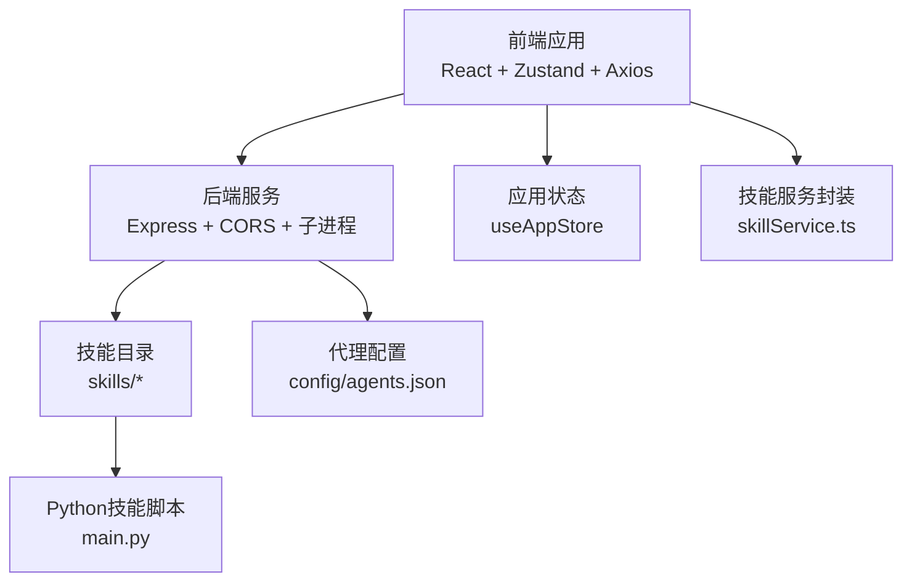
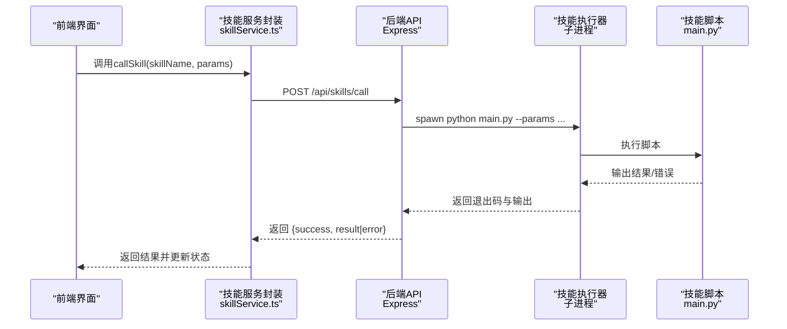
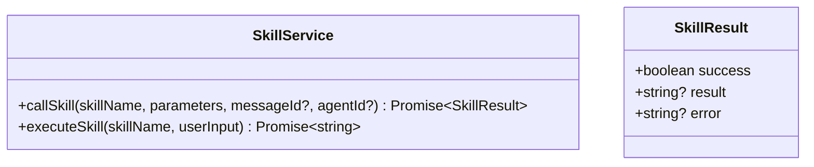
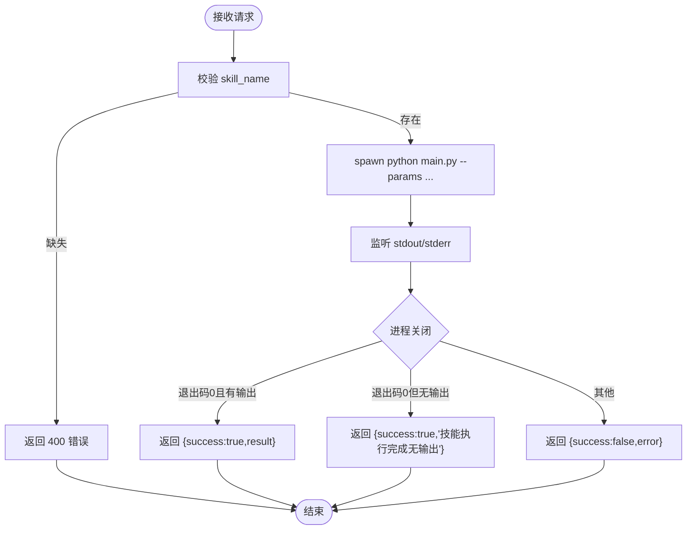
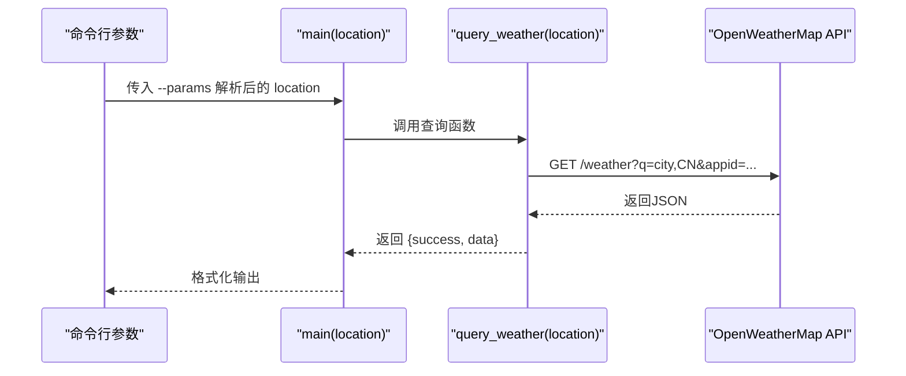
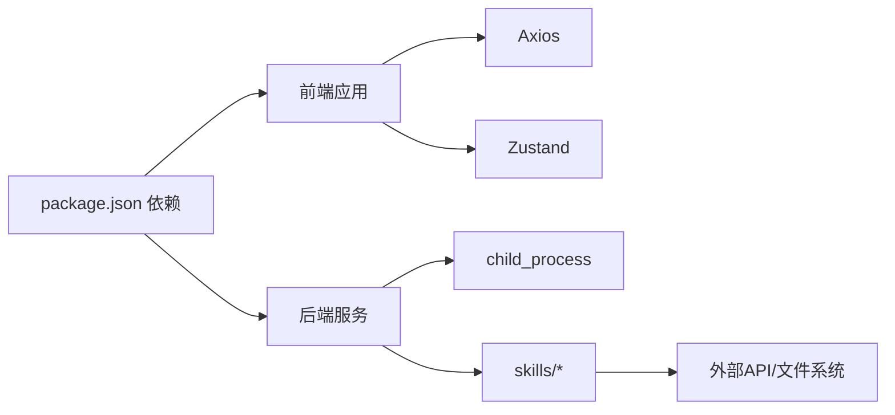

# 业务模块扩展

<cite>
**本文引用的文件**
- [package.json](file://package.json)
- [backend/index.js](file://backend/index.js)
- [src/main.tsx](file://src/main.tsx)
- [config/agents.json](file://config/agents.json)
- [skills/weather_query/main.py](file://skills/weather_query/main.py)
- [src/services/skillService.ts](file://src/services/skillService.ts)
- [src/store/useAppStore.ts](file://src/store/useAppStore.ts)
- [OpenSkills-main/README.md](file://OpenSkills-main/README.md)
- [OpenSkills-main/pyproject.toml](file://OpenSkills-main/pyproject.toml)
- [docs/业务功能模块/主题模块.md](file://docs/业务功能模块/主题模块.md)
- [docs/业务功能模块/聊天交互模块.md](file://docs/业务功能模块/聊天交互模块.md)
</cite>

## 目录
1. [引言](#引言)
2. [项目结构](#项目结构)
3. [核心组件](#核心组件)
4. [架构总览](#架构总览)
5. [详细组件分析](#详细组件分析)
6. [依赖分析](#依赖分析)
7. [性能考虑](#性能考虑)
8. [故障排查指南](#故障排查指南)
9. [结论](#结论)
10. [附录](#附录)

## 引言
本指南面向希望在AutoMate平台上快速扩展业务功能模块的开发者。内容覆盖业务需求分析、功能模块设计与实现策略；深入解释现有业务模块架构、扩展点识别与集成方法；阐述新业务场景开发、工作流设计与数据模型扩展；包含业务规则配置、流程控制与状态管理实现；解释模块间依赖关系、接口设计与数据共享机制；并提供业务模块测试、部署与维护流程，帮助你基于AutoMate的技能体系与前端状态管理，高效构建新的功能模块。

## 项目结构
AutoMate采用前后端分离架构：
- 前端基于React + TypeScript，通过Zustand进行全局状态管理，通过Axios调用后端API。
- 后端使用Express提供REST API，统一调度skills目录下的Python技能脚本。
- 技能以独立目录组织，每个技能包含入口脚本与可选的参考文档与脚本资源。
- OpenSkills框架提供了技能发现、指令层加载与脚本沙箱执行等能力，便于扩展复杂业务场景。



图表来源
- [backend/index.js](file://backend/index.js#L1-L117)
- [src/services/skillService.ts](file://src/services/skillService.ts#L1-L73)
- [src/store/useAppStore.ts](file://src/store/useAppStore.ts#L1-L306)
- [config/agents.json](file://config/agents.json#L1-L119)

章节来源
- [package.json](file://package.json#L1-L47)
- [backend/index.js](file://backend/index.js#L1-L117)
- [src/main.tsx](file://src/main.tsx#L1-L12)
- [config/agents.json](file://config/agents.json#L1-L119)

## 核心组件
- 技能服务封装：封装前端调用后端技能API的逻辑，统一错误处理与超时控制。
- 后端技能执行器：接收前端请求，定位技能脚本，通过子进程执行Python脚本，并收集标准输出与错误输出。
- 应用状态管理：集中管理代理分组、消息会话、打字态、主题与用户设置等状态。
- 代理配置：集中声明代理、类型、LLM配置与可用技能清单，驱动前端UI与技能调用。
- 示例技能：以天气查询为例，展示技能脚本的输入解析、外部服务调用、结果格式化与错误处理。

章节来源
- [src/services/skillService.ts](file://src/services/skillService.ts#L1-L73)
- [backend/index.js](file://backend/index.js#L19-L79)
- [src/store/useAppStore.ts](file://src/store/useAppStore.ts#L1-L306)
- [config/agents.json](file://config/agents.json#L1-L119)
- [skills/weather_query/main.py](file://skills/weather_query/main.py#L1-L139)

## 架构总览
AutoMate的业务模块扩展围绕“前端状态管理 + 后端技能调度 + 技能脚本执行”三层展开。前端通过Axios调用后端API，后端通过子进程执行对应技能脚本，技能脚本可访问外部服务或文件系统，最终将结果以字符串形式返回给后端，再由后端返回给前端渲染。



图表来源
- [src/services/skillService.ts](file://src/services/skillService.ts#L12-L61)
- [backend/index.js](file://backend/index.js#L81-L104)
- [skills/weather_query/main.py](file://skills/weather_query/main.py#L116-L139)

## 详细组件分析

### 组件A：技能服务封装（前端）
职责与特性
- 统一封装技能调用，支持超时控制、网络错误与后端错误处理。
- 自动注入消息ID与代理ID，便于追踪与审计。
- 提供简化版executeSkill，直接返回字符串结果或抛出错误。



图表来源
- [src/services/skillService.ts](file://src/services/skillService.ts#L6-L72)

章节来源
- [src/services/skillService.ts](file://src/services/skillService.ts#L1-L73)

### 组件B：后端技能执行器
职责与特性
- 校验必填参数，拼接技能脚本路径与参数，通过子进程执行Python脚本。
- 捕获标准输出与标准错误，区分成功与失败场景，返回统一结构。
- 对错误进行分类处理，包括脚本执行失败、无输出、异常等。



图表来源
- [backend/index.js](file://backend/index.js#L19-L79)
- [backend/index.js](file://backend/index.js#L81-L104)

章节来源
- [backend/index.js](file://backend/index.js#L1-L117)

### 组件C：应用状态管理（Zustand）
职责与特性
- 管理代理分组与选中代理、聊天消息列表、打字态、主题与用户设置。
- 提供消息增删改、思考内容更新、主题切换与全局状态切换等动作。
- 通过原子化的状态更新保证UI一致性与性能。

```mermaid
classDiagram
class useAppStore {
+agents : AgentGroup[]
+selectedAgentId : string?
+chats : ChatState
+userSettings : UserSettings
+setAgents()
+addMessage()
+updateMessageContent()
+updateMessageThinkingContent()
+removeLastAiMessage()
+setTyping()
+setTheme()
+toggleGlobalStatus()
}
class ChatState {
+[agentId] : { messages : Message[], isTyping : boolean }
}
class Message {
+string id
+string content
+boolean isUser
+string timestamp
+enum status
+string[]? skillActivated
+string? thinkingContent
+boolean? isStreaming
}
```

图表来源
- [src/store/useAppStore.ts](file://src/store/useAppStore.ts#L28-L83)

章节来源
- [src/store/useAppStore.ts](file://src/store/useAppStore.ts#L1-L306)

### 组件D：示例技能（天气查询）
职责与特性
- 解析输入参数，支持命令行参数或默认值。
- 调用外部天气API，进行数据清洗与格式化。
- 统一返回结构，便于前端展示。



图表来源
- [skills/weather_query/main.py](file://skills/weather_query/main.py#L10-L98)
- [skills/weather_query/main.py](file://skills/weather_query/main.py#L116-L139)

章节来源
- [skills/weather_query/main.py](file://skills/weather_query/main.py#L1-L139)

### 组件E：代理配置与技能清单
职责与特性
- 在agents.json中声明代理、类型、LLM配置与可用技能清单。
- 前端读取该配置，驱动UI渲染与技能调用路由。

章节来源
- [config/agents.json](file://config/agents.json#L1-L119)

### 组件F：OpenSkills框架（可选扩展）
职责与特性
- 提供技能的三层渐进披露架构：元数据层、指令层、资源层。
- 支持自动发现参考文档、脚本执行、沙箱隔离与文件同步。
- 适合需要复杂业务规则、多模态输入与自动化脚本执行的场景。

章节来源
- [OpenSkills-main/README.md](file://OpenSkills-main/README.md#L1-L411)
- [OpenSkills-main/pyproject.toml](file://OpenSkills-main/pyproject.toml#L1-L75)

## 依赖分析
- 前端依赖
  - React、React Router、Axios、Zustand等，支撑UI与状态管理。
  - Tailwind CSS与全局样式，支撑主题与视觉设计。
- 后端依赖
  - Express、CORS，提供HTTP服务与跨域支持。
  - child_process，用于调用Python技能脚本。
- 技能依赖
  - 外部API（如OpenWeatherMap）或本地文件系统，技能脚本自行管理。
- OpenSkills依赖
  - Python生态与可选沙箱环境，提供更强的脚本执行与安全隔离能力。



图表来源
- [package.json](file://package.json#L15-L45)
- [backend/index.js](file://backend/index.js#L1-L10)
- [src/services/skillService.ts](file://src/services/skillService.ts#L1)

章节来源
- [package.json](file://package.json#L1-L47)
- [backend/index.js](file://backend/index.js#L1-L117)

## 性能考虑
- 前端
  - 使用Zustand减少不必要的重渲染，合理拆分状态域。
  - 对长列表消息采用虚拟滚动与懒加载策略（建议在后续实现中引入）。
- 后端
  - 控制子进程生命周期，避免并发过多导致资源耗尽。
  - 对外部API调用增加超时与重试策略，防止阻塞。
- 技能脚本
  - 尽量复用外部服务缓存，避免重复请求。
  - 对大文件处理建议结合OpenSkills沙箱与文件同步能力。
- 主题与渲染
  - 使用CSS变量与Tailwind类，减少样式计算开销。
  - 避免在主题切换时强制重排大量DOM节点。

## 故障排查指南
- 技能调用失败
  - 检查后端日志与子进程输出，确认脚本路径与参数是否正确。
  - 确认Python环境与依赖安装完整。
- 网络错误
  - 前端捕获ERR_NETWORK，提示“请确保后端服务正在运行”，检查端口占用与CORS配置。
- 超时错误
  - 前端设置超时阈值，必要时延长后端脚本执行时间或拆分任务。
- 外部API异常
  - 技能脚本需对HTTP错误、解析异常进行分类处理并返回可读错误信息。
- 主题切换异常
  - 检查本地存储写入权限与格式，必要时回退到默认主题配置。

章节来源
- [src/services/skillService.ts](file://src/services/skillService.ts#L34-L60)
- [backend/index.js](file://backend/index.js#L49-L78)
- [skills/weather_query/main.py](file://skills/weather_query/main.py#L83-L97)

## 结论
AutoMate通过清晰的三层架构与标准化的技能执行机制，为业务模块扩展提供了稳定基础。结合Zustand状态管理与Express后端，开发者可以快速实现新业务场景。对于更复杂的业务规则与脚本执行需求，OpenSkills框架提供了强大的技能发现、指令加载与沙箱执行能力。遵循本文的扩展流程与最佳实践，可在保持系统稳定性的同时，高效交付高质量的功能模块。

## 附录

### 新业务场景开发流程（步骤化）
- 需求分析
  - 明确业务目标、输入输出、边界条件与性能要求。
- 功能设计
  - 设计技能脚本的输入参数、外部依赖与输出格式。
  - 设计前端状态与UI交互，确定消息状态流转。
- 实现策略
  - 创建技能目录与入口脚本，实现参数解析与外部服务调用。
  - 在前端封装技能服务调用，处理成功与失败分支。
  - 在应用状态中新增必要的状态字段与动作。
- 工作流设计
  - 设计消息状态机（发送中/已发送/已送达/已读/失败）。
  - 设计技能调用流程（参数校验 → 记录 → 执行 → 展示结果）。
- 数据模型扩展
  - 如需持久化，设计表结构与索引，确保查询效率。
  - 若使用本地存储，注意序列化与版本兼容。
- 业务规则配置
  - 在agents.json中注册新技能，配置代理与类型。
  - 如使用OpenSkills，编写SKILL.md并组织references与scripts。
- 流程控制与状态管理
  - 在Zustand中新增状态域与动作，确保UI一致更新。
  - 对异步流程使用中间态（如打字态）提升用户体验。
- 模块间依赖与接口设计
  - 前端通过Axios调用后端API，后端通过子进程调用技能脚本。
  - 统一返回结构，便于前端统一处理。
- 数据共享机制
  - 全局状态共享：Zustand集中管理。
  - 技能间数据：通过参数传递或共享文件系统（结合OpenSkills沙箱）。
- 测试
  - 单元测试：技能脚本的输入输出与异常分支。
  - 集成测试：前端调用链路与后端API连通性。
  - 端到端测试：从UI触发到结果展示的完整流程。
- 部署与维护
  - 前端打包与后端服务部署，确保端口开放与CORS配置。
  - 监控技能执行日志与错误率，定期评估性能与稳定性。
  - 版本化管理agents.json与技能脚本，保障可回滚性。

### 业务模块测试清单
- 前端
  - 技能调用成功路径与失败路径。
  - 超时与网络错误处理。
  - UI状态一致性（消息状态、打字态、主题切换）。
- 后端
  - 必填参数校验与错误返回。
  - 子进程执行与输出解析。
  - 并发场景下的稳定性。
- 技能脚本
  - 外部API可用性与错误处理。
  - 参数边界与异常输入。
- OpenSkills（如使用）
  - 参考文档自动发现与条件加载。
  - 沙箱执行与文件同步。

### 部署与维护流程
- 本地开发
  - 启动前端与后端：使用npm脚本同时启动。
  - 配置代理与技能路径，确保Python可执行。
- 生产部署
  - 前端静态资源托管，后端服务常驻运行。
  - 配置反向代理与健康检查。
- 监控与告警
  - 记录技能执行日志与错误统计。
  - 设置性能指标与错误率阈值。
- 回滚与升级
  - 版本化agents.json与技能脚本。
  - 逐步灰度发布，保留回滚路径。