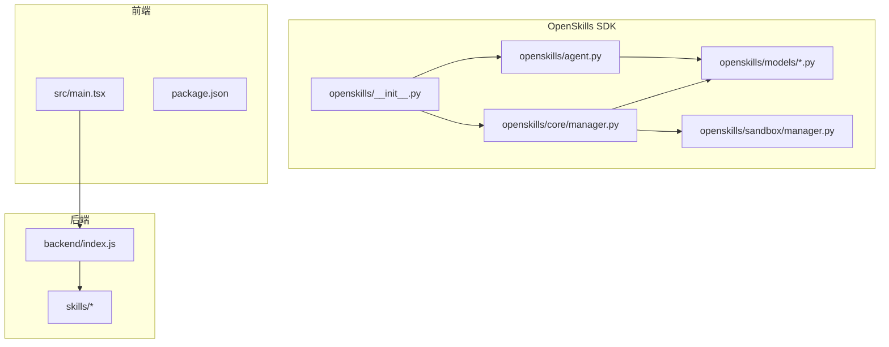
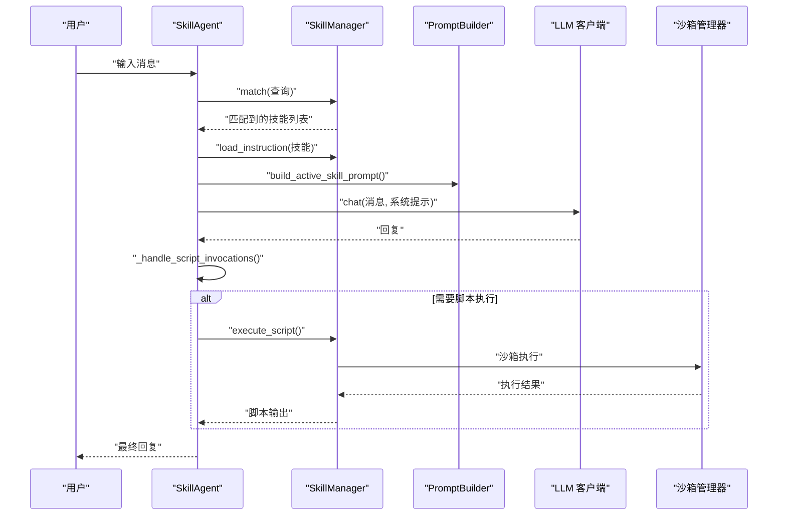
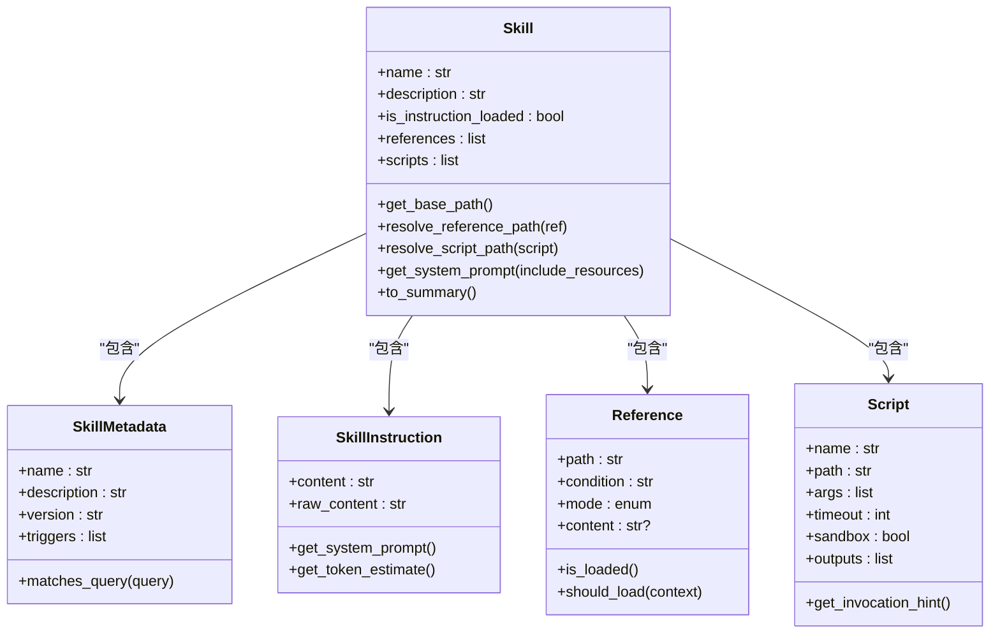
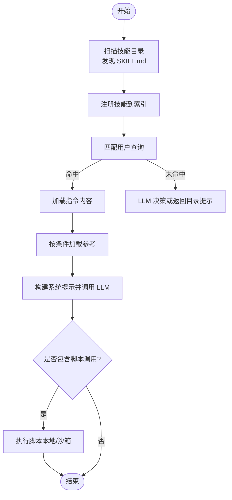
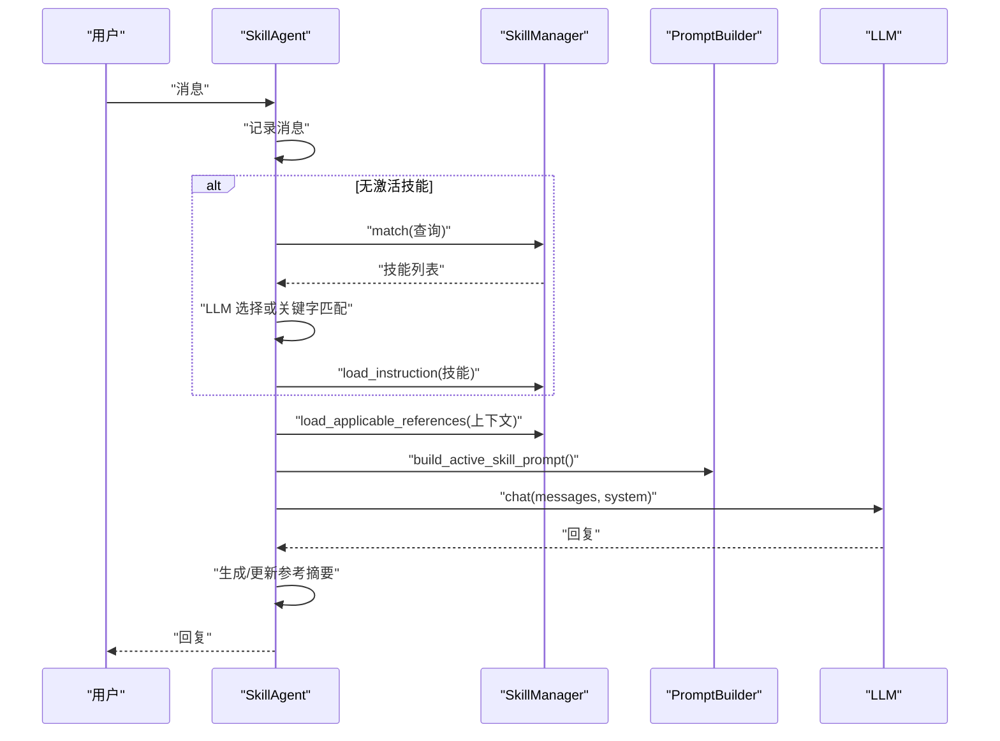
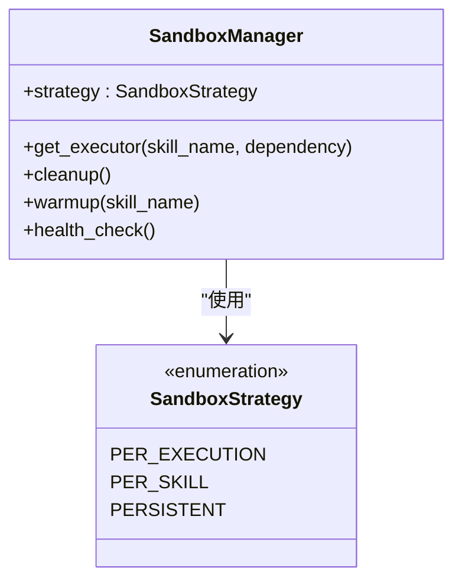
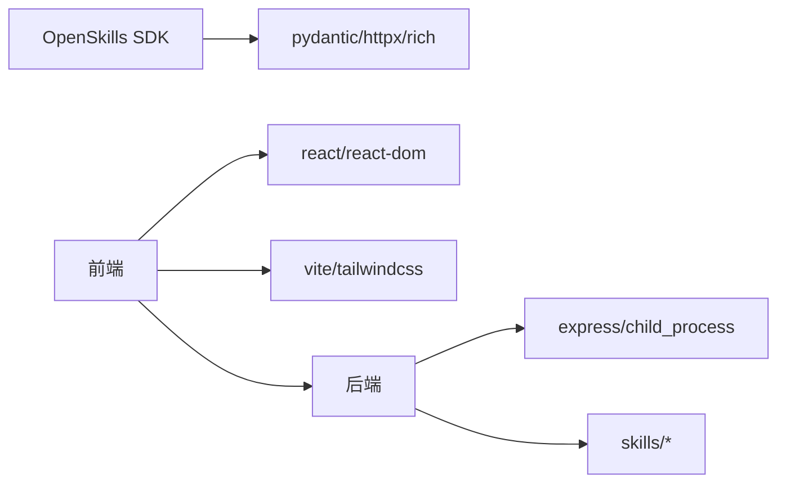

# 扩展开发

<cite>
**本文引用的文件**
- [OpenSkills 主入口](file://OpenSkills-main/openskills/__init__.py)
- [技能模型](file://OpenSkills-main/openskills/core/skill.py)
- [技能管理器](file://OpenSkills-main/openskills/core/manager.py)
- [智能体代理](file://OpenSkills-main/openskills/agent.py)
- [元数据模型](file://OpenSkills-main/openskills/models/metadata.py)
- [指令模型](file://OpenSkills-main/openskills/models/instruction.py)
- [资源模型](file://OpenSkills-main/openskills/models/resource.py)
- [沙箱管理器](file://OpenSkills-main/openskills/sandbox/manager.py)
- [项目配置](file://OpenSkills-main/pyproject.toml)
- [示例技能 SKILL.md](file://OpenSkills-main/examples/prompt-optimizer/SKILL.md)
- [示例框架文档](file://OpenSkills-main/examples/prompt-optimizer/references/frameworks/01_RACEF_Framework.md)
- [示例演示脚本](file://OpenSkills-main/examples/demo.py)
- [SDK 说明文档](file://OpenSkills-main/README.md)
- [前端入口](file://src/main.tsx)
- [后端服务](file://backend/index.js)
- [包管理配置](file://package.json)
</cite>

## 目录
1. [简介](#简介)
2. [项目结构](#项目结构)
3. [核心组件](#核心组件)
4. [架构总览](#架构总览)
5. [详细组件分析](#详细组件分析)
6. [依赖关系分析](#依赖关系分析)
7. [性能考虑](#性能考虑)
8. [故障排查指南](#故障排查指南)
9. [结论](#结论)
10. [附录](#附录)

## 简介
本指南面向希望基于 AutoMate 平台开发扩展（技能）的开发者，系统讲解以下主题：
- 新技能开发流程与模板使用
- 插件架构设计与三层渐进披露机制
- 第三方集成方法（LLM、沙箱、文件系统）
- 开发工具配置与调试技巧
- 自定义组件与 UI 扩展思路
- Trae 框架与规则系统的结合方式
- 技能规范与版本管理
- 发布流程与社区贡献
- 安全性、性能优化与兼容性策略

## 项目结构
AutoMate 由三部分组成：
- OpenSkills SDK：技能框架与智能体核心逻辑
- 前端（React + Vite）：用户界面与交互
- 后端（Node.js + Express）：本地技能执行桥接

**图表来源**
- [OpenSkills 主入口](file://OpenSkills-main/openskills/__init__.py#L1-L50)
- [技能管理器](file://OpenSkills-main/openskills/core/manager.py#L1-L120)
- [智能体代理](file://OpenSkills-main/openskills/agent.py#L1-L120)
- [前端入口](file://src/main.tsx#L1-L12)
- [后端服务](file://backend/index.js#L1-L40)

**章节来源**
- [OpenSkills 主入口](file://OpenSkills-main/openskills/__init__.py#L1-L50)
- [项目配置](file://OpenSkills-main/pyproject.toml#L1-L40)
- [前端入口](file://src/main.tsx#L1-L12)
- [后端服务](file://backend/index.js#L1-L40)

## 核心组件
- 三层渐进披露架构
  - 元数据层（Layer 1）：始终加载，用于发现与匹配
  - 指令层（Layer 2）：按需加载，注入系统提示
  - 资源层（Layer 3）：条件加载，包含参考文档与可执行脚本
- 智能体代理（SkillAgent）：自动发现、匹配、加载、执行技能
- 技能管理器（SkillManager）：扫描、注册、索引、执行脚本
- 沙箱执行：隔离环境中的脚本执行与文件同步

**章节来源**
- [技能模型](file://OpenSkills-main/openskills/core/skill.py#L1-L150)
- [智能体代理](file://OpenSkills-main/openskills/agent.py#L61-L120)
- [技能管理器](file://OpenSkills-main/openskills/core/manager.py#L24-L120)
- [资源模型](file://OpenSkills-main/openskills/models/resource.py#L1-L120)

## 架构总览
OpenSkills 将“技能”抽象为 SKILL.md 文件，配合 references 与 scripts 目录，形成可发现、可匹配、可执行的扩展单元。智能体代理在对话过程中根据用户输入自动选择最合适的技能，并在需要时加载相关参考文档与执行脚本。

**图表来源**
- [智能体代理](file://OpenSkills-main/openskills/agent.py#L228-L322)
- [技能管理器](file://OpenSkills-main/openskills/core/manager.py#L265-L361)
- [沙箱管理器](file://OpenSkills-main/openskills/sandbox/manager.py#L89-L148)

## 详细组件分析

### 组件一：技能模型（Skill）
- 职责：封装元数据、指令与资源，支持相对路径解析与系统提示拼装
- 关键能力：
  - 层次化访问：name/description/is_instruction_loaded/references/scripts
  - 路径解析：resolve_reference_path/resolve_script_path
  - 系统提示生成：get_system_prompt(include_resources)

**图表来源**
- [技能模型](file://OpenSkills-main/openskills/core/skill.py#L19-L150)
- [元数据模型](file://OpenSkills-main/openskills/models/metadata.py#L11-L83)
- [指令模型](file://OpenSkills-main/openskills/models/instruction.py#L11-L48)
- [资源模型](file://OpenSkills-main/openskills/models/resource.py#L45-L204)

**章节来源**
- [技能模型](file://OpenSkills-main/openskills/core/skill.py#L1-L150)
- [元数据模型](file://OpenSkills-main/openskills/models/metadata.py#L1-L83)
- [指令模型](file://OpenSkills-main/openskills/models/instruction.py#L1-L48)
- [资源模型](file://OpenSkills-main/openskills/models/resource.py#L1-L204)

### 组件二：技能管理器（SkillManager）
- 职责：扫描目录、注册技能、按需加载指令与参考、执行脚本、沙箱编排
- 关键流程：
  - discover：扫描 SKILL.md，仅加载元数据
  - load_instruction：按需加载指令
  - load_reference/load_applicable_references：条件加载参考
  - execute_script：执行脚本（本地或沙箱）

**图表来源**
- [技能管理器](file://OpenSkills-main/openskills/core/manager.py#L116-L264)
- [智能体代理](file://OpenSkills-main/openskills/agent.py#L471-L524)

**章节来源**
- [技能管理器](file://OpenSkills-main/openskills/core/manager.py#L116-L361)

### 组件三：智能体代理（SkillAgent）
- 职责：维护对话上下文、自动选择技能、加载参考、生成系统提示、触发脚本执行
- 关键特性：
  - 自动技能选择与 LLM 辅助路由
  - 参考加载策略（always/explicit/implicit）
  - 跨轮次记忆与摘要缓存
  - 流式与非流式对话

**图表来源**
- [智能体代理](file://OpenSkills-main/openskills/agent.py#L228-L470)
- [技能管理器](file://OpenSkills-main/openskills/core/manager.py#L495-L523)

**章节来源**
- [智能体代理](file://OpenSkills-main/openskills/agent.py#L155-L470)

### 组件四：沙箱执行（SandboxManager）
- 职责：生命周期管理、实例复用策略（按执行/按技能/持久）、依赖安装、文件同步
- 关键点：
  - 策略枚举：PER_EXECUTION、PER_SKILL、PERSISTENT
  - 依赖去重安装、健康检查、预热

**图表来源**
- [沙箱管理器](file://OpenSkills-main/openskills/sandbox/manager.py#L17-L88)

**章节来源**
- [沙箱管理器](file://OpenSkills-main/openskills/sandbox/manager.py#L1-L237)

### 组件五：技能模板与示例
- 示例技能：prompt-optimizer
  - SKILL.md 定义元数据、触发词、引用与脚本
  - references/frameworks 下的框架文档作为条件加载的参考
- 示例演示：展示自动发现、LLM 条件加载、沙箱执行与文件同步

**章节来源**
- [示例技能 SKILL.md](file://OpenSkills-main/examples/prompt-optimizer/SKILL.md#L1-L131)
- [示例框架文档](file://OpenSkills-main/examples/prompt-optimizer/references/frameworks/01_RACEF_Framework.md#L1-L83)
- [示例演示脚本](file://OpenSkills-main/examples/demo.py#L1-L290)

## 依赖关系分析
- OpenSkills SDK 依赖 pydantic、httpx、rich 等库，提供模型校验、HTTP 客户端与日志输出
- 前端依赖 React、TailwindCSS、Vite 等，提供现代化 UI 与构建工具链
- 后端通过 child_process 调用 Python 脚本，实现本地技能执行桥接

**图表来源**
- [项目配置](file://OpenSkills-main/pyproject.toml#L22-L38)
- [包管理配置](file://package.json#L15-L46)
- [后端服务](file://backend/index.js#L1-L20)

**章节来源**
- [项目配置](file://OpenSkills-main/pyproject.toml#L1-L75)
- [包管理配置](file://package.json#L1-L47)
- [后端服务](file://backend/index.js#L1-L117)

## 性能考虑
- 渐进披露降低内存占用：仅在发现阶段加载元数据，按需加载指令与参考
- LLM 评估参考加载：避免一次性加载所有参考，减少上下文开销
- 沙箱复用策略：PER_SKILL/PERSISTENT 减少冷启动成本
- 跨轮次摘要缓存：减少重复加载与 Token 消耗
- 流式输出：提升用户体验与响应感知

[本节为通用性能建议，无需特定文件引用]

## 故障排查指南
- 沙箱不可用
  - 确认沙箱服务已启动且健康检查通过
  - 检查 base_url 与网络连通性
- 脚本执行失败
  - 查看后端日志与子进程退出码
  - 确认脚本路径与权限
- 参考加载异常
  - 检查 references 目录结构与 frontmatter 配置
  - 确认条件表达式与 LLM 评估逻辑
- LLM 集成问题
  - 校验 API Key、Base URL、模型名称
  - 在演示脚本中验证环境变量配置

**章节来源**
- [沙箱管理器](file://OpenSkills-main/openskills/sandbox/manager.py#L208-L227)
- [后端服务](file://backend/index.js#L19-L79)
- [示例演示脚本](file://OpenSkills-main/examples/demo.py#L244-L290)

## 结论
AutoMate 的扩展体系以 OpenSkills SDK 为核心，通过三层渐进披露与智能体代理实现了“可发现、可匹配、可执行”的技能生态。结合沙箱执行与文件同步，开发者可以在安全可控的前提下扩展 AI 功能。建议在开发中遵循技能规范、做好性能与安全设计，并通过示例与 CLI 工具快速验证与迭代。

[本节为总结性内容，无需特定文件引用]

## 附录

### 新技能开发流程
- 创建技能目录与 SKILL.md
- 在 references 目录下组织参考文档
- 在 scripts 目录下编写可执行脚本
- 使用演示脚本验证自动发现与条件加载
- 如需脚本执行，启用沙箱并配置依赖与输出目录

**章节来源**
- [SDK 说明文档](file://OpenSkills-main/README.md#L204-L250)
- [示例演示脚本](file://OpenSkills-main/examples/demo.py#L37-L145)

### Trae 框架与规则系统
- Trae 规则系统可与 OpenSkills 的引用加载机制结合：将规则文件放入 references，通过条件表达式控制加载时机
- 智能体代理的 LLM 评估逻辑可作为规则匹配的辅助判断

**章节来源**
- [智能体代理](file://OpenSkills-main/openskills/agent.py#L577-L633)
- [资源模型](file://OpenSkills-main/openskills/models/resource.py#L91-L110)

### 扩展发布与版本管理
- 使用 pyproject.toml 管理依赖与脚手架命令
- 通过 CLI 命令列出、展示、验证技能
- 建议在仓库中提供 CI/CD 流水线与发布脚本

**章节来源**
- [项目配置](file://OpenSkills-main/pyproject.toml#L46-L75)
- [SDK 说明文档](file://OpenSkills-main/README.md#L392-L407)

### 社区贡献指南
- 遵循编码规范与测试要求
- 提供示例技能与文档
- 使用 GitHub Issues 与 Pull Request 流程协作

**章节来源**
- [项目配置](file://OpenSkills-main/pyproject.toml#L30-L38)
- [SDK 说明文档](file://OpenSkills-main/README.md#L1-L20)

### 安全性、性能与兼容性
- 安全性：优先使用沙箱执行脚本，限制文件系统访问
- 性能：采用渐进披露、缓存摘要、复用沙箱实例
- 兼容性：支持多 LLM 提供商，统一客户端接口

**章节来源**
- [沙箱管理器](file://OpenSkills-main/openskills/sandbox/manager.py#L17-L47)
- [SDK 说明文档](file://OpenSkills-main/README.md#L102-L123)