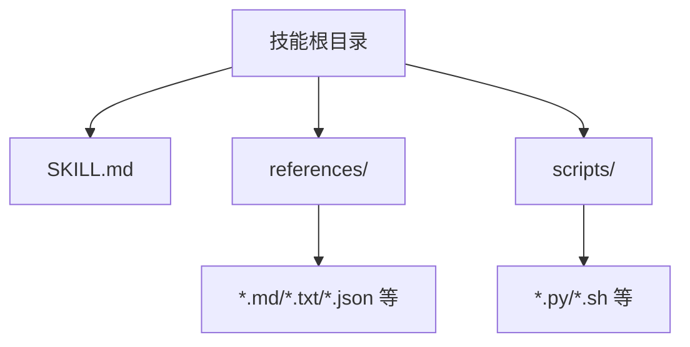
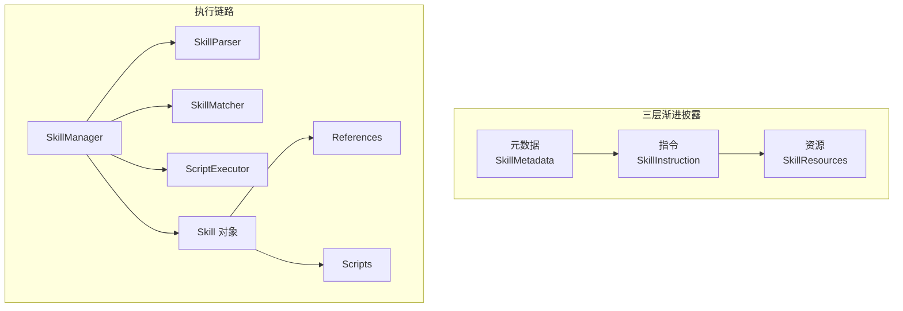
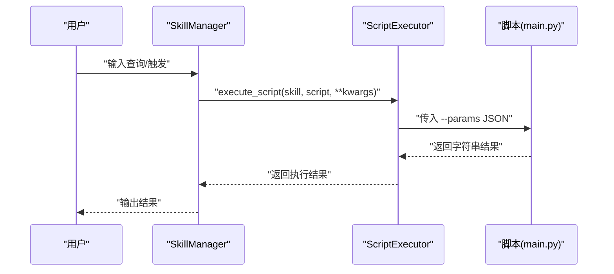
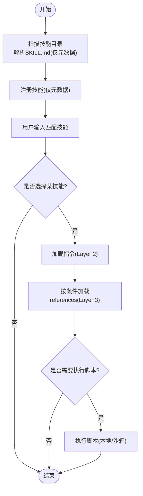
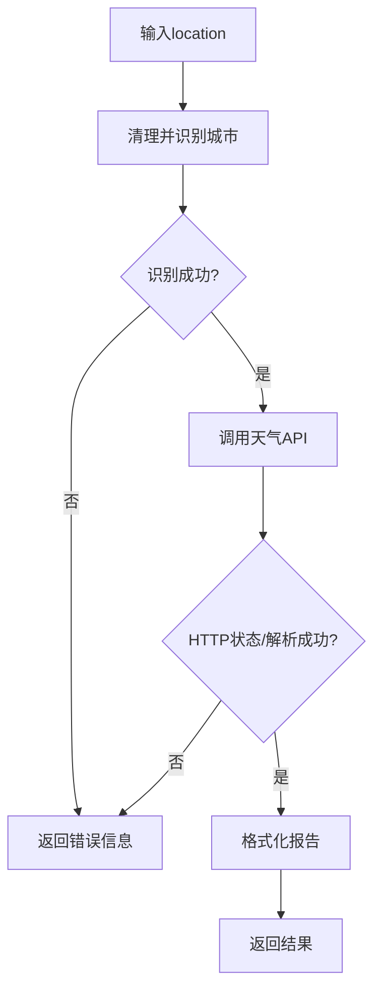
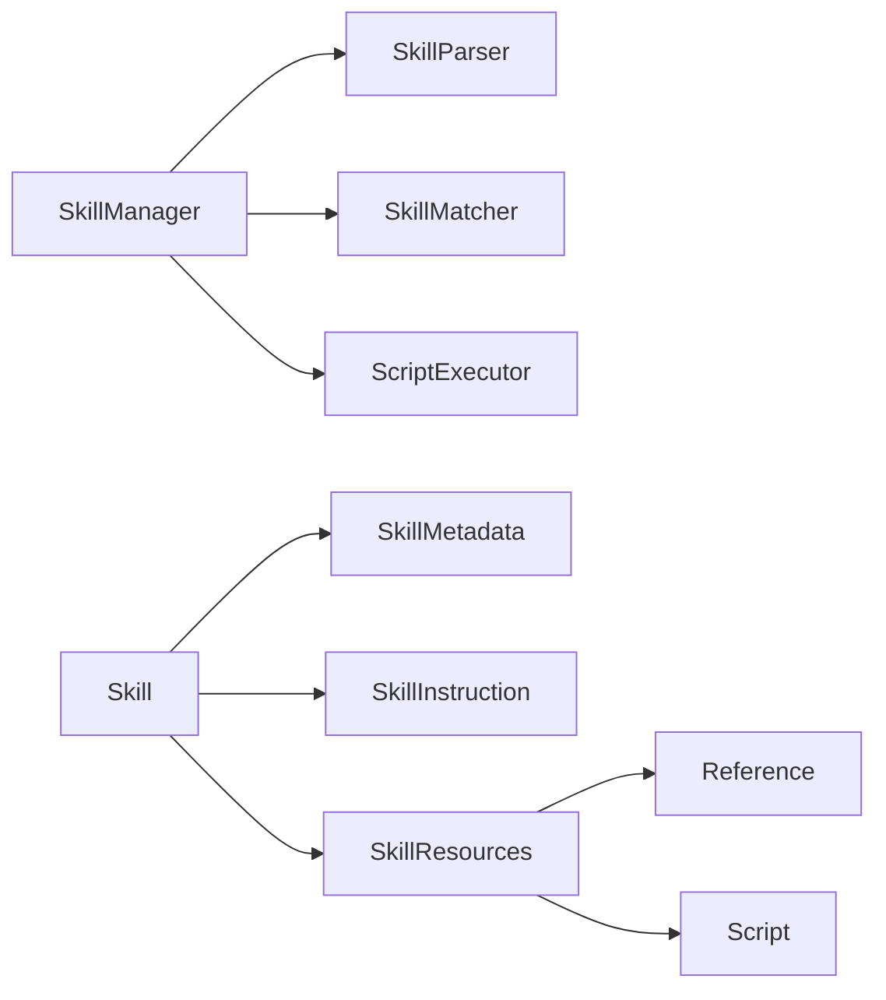

# 技能开发

<cite>
**本文引用的文件**
- [skills/todolist查询/SKILL.md](file://skills/todo-query/SKILL.md)
- [skills/todolist查询/main.py](file://skills/todo-query/main.py)
- [skills/天气查询/main.py](file://skills/weather_query/main.py)
- [OpenSkills核心/技能对象/skill.py](file://OpenSkills-main/openskills/core/skill.py)
- [OpenSkills核心/管理器/manager.py](file://OpenSkills-main/openskills/core/manager.py)
- [OpenSkills核心/解析器/parser.py](file://OpenSkills-main/openskills/core/parser.py)
- [OpenSkills核心/匹配器/matcher.py](file://OpenSkills-main/openskills/core/matcher.py)
- [OpenSkills核心/执行器/executor.py](file://OpenSkills-main/openskills/core/executor.py)
- [OpenSkills模型/元数据/metadata.py](file://OpenSkills-main/openskills/models/metadata.py)
- [OpenSkills模型/指令/instruction.py](file://OpenSkills-main/openskills/models/instruction.py)
- [OpenSkills模型/资源/resource.py](file://OpenSkills-main/openskills/models/resource.py)
- [OpenSkills示例/demo.py](file://OpenSkills-main/examples/demo.py)
- [OpenSkills示例/飞书文档转研发/SKILL.md](file://OpenSkills-main/examples/feishu-doc-to-dev-spec/SKILL.md)
- [OpenSkills示例/文件转文章生成器/SKILL.md](file://OpenSkills-main/examples/file-to-article-generator/SKILL.md)
- [OpenSkills测试/天气查询测试/test_weather.py](file://OpenSkills-main/test_weather.py)
- [OpenSkills说明/README.md](file://OpenSkills-main/README.md)
</cite>

## 目录
1. [简介](#简介)
2. [项目结构](#项目结构)
3. [核心组件](#核心组件)
4. [架构总览](#架构总览)
5. [详细组件分析](#详细组件分析)
6. [依赖分析](#依赖分析)
7. [性能考虑](#性能考虑)
8. [故障排查指南](#故障排查指南)
9. [结论](#结论)
10. [附录](#附录)

## 简介
本指南面向AutoMate技能开发者，系统讲解如何基于OpenSkills框架创建、注册、加载与执行技能。内容覆盖：
- 技能模板SKILL.md规范与目录结构
- Python脚本编写与参数传递机制
- 技能注册、发现、匹配与执行流程
- 最佳实践、错误处理与调试技巧
- 内置技能示例（weather_query、todo-query）的实现要点
- 测试方法与性能优化建议

## 项目结构
AutoMate仓库包含两套技能体系：
- 本地内置技能：skills/ 下的weather_query、todo-query等
- OpenSkills SDK示例与核心库：OpenSkills-main/ 下的SDK实现与示例技能

技能通用目录结构（由OpenSkills规范定义）：
- SKILL.md：技能定义文件（必填）
- references/：可选参考文档目录（可被LLM按条件加载）
- scripts/：可选脚本目录（可被LLM触发执行）

**图表来源**
- [OpenSkills说明/README.md](file://OpenSkills-main/README.md#L204-L213)

**章节来源**
- [OpenSkills说明/README.md](file://OpenSkills-main/README.md#L204-L213)

## 核心组件
- Skill（技能对象）：封装三层渐进披露（元数据、指令、资源）
- SkillManager（技能管理器）：负责发现、注册、匹配、加载与执行
- SkillParser（解析器）：解析SKILL.md为Skill对象
- SkillMatcher（匹配器）：基于触发词与描述匹配技能
- ScriptExecutor（脚本执行器）：安全执行脚本（支持超时、输出截断、沙箱环境）
- 模型层：SkillMetadata、SkillInstruction、SkillResources（Reference/Script）

**章节来源**
- [OpenSkills核心/技能对象/skill.py](file://OpenSkills-main/openskills/core/skill.py#L19-L150)
- [OpenSkills核心/管理器/manager.py](file://OpenSkills-main/openskills/core/manager.py#L24-L523)
- [OpenSkills核心/解析器/parser.py](file://OpenSkills-main/openskills/core/parser.py#L19-L225)
- [OpenSkills核心/匹配器/matcher.py](file://OpenSkills-main/openskills/core/matcher.py#L22-L221)
- [OpenSkills核心/执行器/executor.py](file://OpenSkills-main/openskills/core/executor.py#L24-L251)
- [OpenSkills模型/元数据/metadata.py](file://OpenSkills-main/openskills/models/metadata.py#L11-L83)
- [OpenSkills模型/指令/instruction.py](file://OpenSkills-main/openskills/models/instruction.py#L11-L48)
- [OpenSkills模型/资源/resource.py](file://OpenSkills-main/openskills/models/resource.py#L45-L204)

## 架构总览
OpenSkills采用“三层渐进披露”架构：
- 第一层（元数据）：始终加载，用于快速发现与匹配
- 第二层（指令）：按需加载，注入LLM系统提示
- 第三层（资源）：条件加载，包含Reference与Script

**图表来源**
- [OpenSkills核心/技能对象/skill.py](file://OpenSkills-main/openskills/core/skill.py#L19-L150)
- [OpenSkills核心/管理器/manager.py](file://OpenSkills-main/openskills/core/manager.py#L24-L523)
- [OpenSkills核心/解析器/parser.py](file://OpenSkills-main/openskills/core/parser.py#L19-L225)
- [OpenSkills核心/匹配器/matcher.py](file://OpenSkills-main/openskills/core/matcher.py#L22-L221)
- [OpenSkills核心/执行器/executor.py](file://OpenSkills-main/openskills/core/executor.py#L24-L251)
- [OpenSkills模型/资源/resource.py](file://OpenSkills-main/openskills/models/resource.py#L180-L204)

## 详细组件分析

### SKILL.md配置规范与目录结构
- 必填字段：name、description
- 可选字段：version、triggers、author、tags、references、scripts、dependency
- references支持三种加载模式：explicit（显式条件）、implicit（隐式由LLM决定）、always（总是加载）
- scripts支持name、path、description、args、timeout、sandbox、outputs等
- dependency用于声明Python与系统依赖，便于沙箱自动安装

示例参考：
- [todolist查询/SKILL.md](file://skills/todo-query/SKILL.md#L1-L24)
- [飞书文档转研发/SKILL.md](file://OpenSkills-main/examples/feishu-doc-to-dev-spec/SKILL.md#L1-L16)
- [文件转文章生成器/SKILL.md](file://OpenSkills-main/examples/file-to-article-generator/SKILL.md#L1-L25)

**章节来源**
- [OpenSkills模型/元数据/metadata.py](file://OpenSkills-main/openskills/models/metadata.py#L11-L83)
- [OpenSkills模型/资源/resource.py](file://OpenSkills-main/openskills/models/resource.py#L45-L204)
- [OpenSkills核心/解析器/parser.py](file://OpenSkills-main/openskills/core/parser.py#L108-L173)
- [OpenSkills说明/README.md](file://OpenSkills-main/README.md#L215-L249)

### main.py主程序设计与参数传递机制
- 参数传递：脚本通过命令行参数接收--params，其后跟随JSON字符串；脚本内部解析该JSON以获取输入参数
- 返回值：脚本应返回字符串，作为LLM的输出或后续处理结果
- 示例：
  - [todolist查询/main.py](file://skills/todo-query/main.py#L23-L34)
  - [天气查询/main.py](file://skills/weather_query/main.py#L128-L139)

**图表来源**
- [OpenSkills核心/管理器/manager.py](file://OpenSkills-main/openskills/core/manager.py#L265-L317)
- [OpenSkills核心/执行器/executor.py](file://OpenSkills-main/openskills/core/executor.py#L61-L125)
- [skills/todo-query/main.py](file://skills/todo-query/main.py#L23-L34)
- [skills/天气查询/main.py](file://skills/weather_query/main.py#L128-L139)

**章节来源**
- [OpenSkills核心/管理器/manager.py](file://OpenSkills-main/openskills/core/manager.py#L265-L317)
- [OpenSkills核心/执行器/executor.py](file://OpenSkills-main/openskills/core/executor.py#L61-L125)
- [skills/todo-query/main.py](file://skills/todo-query/main.py#L23-L34)
- [skills/天气查询/main.py](file://skills/weather_query/main.py#L128-L139)

### 技能注册、加载与执行机制
- 注册与发现：扫描技能目录，解析SKILL.md为Skill对象，仅加载元数据（Layer 1）
- 匹配：基于triggers、name、description与tags进行评分匹配
- 加载指令：按需加载SKILL.md正文为指令（Layer 2）
- 加载资源：按条件加载references（Layer 3），或执行scripts（Layer 3）
- 执行脚本：支持本地执行或沙箱执行，自动上传输入文件、下载输出文件

**图表来源**
- [OpenSkills核心/管理器/manager.py](file://OpenSkills-main/openskills/core/manager.py#L116-L176)
- [OpenSkills核心/匹配器/matcher.py](file://OpenSkills-main/openskills/core/matcher.py#L53-L81)
- [OpenSkills核心/解析器/parser.py](file://OpenSkills-main/openskills/core/parser.py#L33-L100)
- [OpenSkills核心/执行器/executor.py](file://OpenSkills-main/openskills/core/executor.py#L61-L125)

**章节来源**
- [OpenSkills核心/管理器/manager.py](file://OpenSkills-main/openskills/core/manager.py#L116-L176)
- [OpenSkills核心/匹配器/matcher.py](file://OpenSkills-main/openskills/core/matcher.py#L53-L81)
- [OpenSkills核心/解析器/parser.py](file://OpenSkills-main/openskills/core/parser.py#L33-L100)
- [OpenSkills核心/执行器/executor.py](file://OpenSkills-main/openskills/core/executor.py#L61-L125)

### 内置技能示例：weather_query
- 功能：根据输入城市查询天气并格式化输出
- 关键点：
  - 城市映射与识别逻辑
  - 天气API调用与异常处理
  - 格式化报告输出
  - main()入口与命令行参数解析
- 参考：
  - [天气查询/main.py](file://skills/weather_query/main.py#L10-L139)

**图表来源**
- [skills/天气查询/main.py](file://skills/weather_query/main.py#L10-L98)

**章节来源**
- [skills/天气查询/main.py](file://skills/weather_query/main.py#L10-L139)

### 内置技能示例：todo-query
- 功能：随机生成待办事项统计消息（用于演示）
- 关键点：
  - 随机数生成与消息模板
  - main()入口与命令行参数解析
- 参考：
  - [todolist查询/SKILL.md](file://skills/todo-query/SKILL.md#L1-L24)
  - [todolist查询/main.py](file://skills/todo-query/main.py#L1-L34)

**章节来源**
- [skills/todo-query/SKILL.md](file://skills/todo-query/SKILL.md#L1-L24)
- [skills/todo-query/main.py](file://skills/todo-query/main.py#L1-L34)

### OpenSkills示例技能：飞书文档转研发、文件转文章生成器
- 飞书文档转研发：展示依赖声明、脚本调用、参考文档加载与输出结构
- 文件转文章生成器：展示脚本执行、图片处理、类型判断、质量评估与输出模板
- 参考：
  - [飞书文档转研发/SKILL.md](file://OpenSkills-main/examples/feishu-doc-to-dev-spec/SKILL.md#L1-L222)
  - [文件转文章生成器/SKILL.md](file://OpenSkills-main/examples/file-to-article-generator/SKILL.md#L1-L179)

**章节来源**
- [OpenSkills说明/README.md](file://OpenSkills-main/README.md#L354-L383)
- [OpenSkills示例/demo.py](file://OpenSkills-main/examples/demo.py#L1-L290)

## 依赖分析
- 组件耦合
  - SkillManager依赖SkillParser、SkillMatcher、ScriptExecutor
  - Skill持有SkillMetadata、SkillInstruction、SkillResources
  - SkillResources包含Reference与Script两类资源
- 外部依赖
  - 脚本执行依赖Python解释器与外部系统命令
  - 沙箱模式依赖AIO Sandbox服务（可选）
- 循环依赖
  - 未发现循环导入；模块职责清晰

**图表来源**
- [OpenSkills核心/管理器/manager.py](file://OpenSkills-main/openskills/core/manager.py#L15-L70)
- [OpenSkills核心/技能对象/skill.py](file://OpenSkills-main/openskills/core/skill.py#L19-L52)
- [OpenSkills模型/资源/resource.py](file://OpenSkills-main/openskills/models/resource.py#L180-L204)

**章节来源**
- [OpenSkills核心/管理器/manager.py](file://OpenSkills-main/openskills/core/manager.py#L15-L70)
- [OpenSkills核心/技能对象/skill.py](file://OpenSkills-main/openskills/core/skill.py#L19-L52)
- [OpenSkills模型/资源/resource.py](file://OpenSkills-main/openskills/models/resource.py#L180-L204)

## 性能考虑
- 层级加载策略
  - 仅在发现阶段加载元数据，减少内存占用
  - 指令与资源按需加载，避免不必要的I/O
- 匹配效率
  - 使用多级评分与关键词过滤，降低匹配成本
- 脚本执行
  - 设置合理的超时时间与输出大小限制
  - 沙箱模式下自动上传/下载文件，减少重复传输
- 依赖管理
  - 在沙箱中按需安装依赖，避免全局污染

**章节来源**
- [OpenSkills核心/匹配器/matcher.py](file://OpenSkills-main/openskills/core/matcher.py#L44-L51)
- [OpenSkills核心/执行器/executor.py](file://OpenSkills-main/openskills/core/executor.py#L46-L60)
- [OpenSkills说明/README.md](file://OpenSkills-main/README.md#L146-L177)

## 故障排查指南
- 常见问题
  - 脚本未找到：检查SKILL.md中scripts.path与实际文件路径一致
  - 超时错误：适当提高timeout或优化脚本逻辑
  - 沙箱未初始化：使用异步上下文管理器或设置use_sandbox=True
  - 参数解析失败：确认传入--params JSON格式正确
- 调试技巧
  - 使用本地执行器验证脚本逻辑
  - 在脚本中打印中间状态（谨慎使用，避免泄露敏感信息）
  - 使用示例脚本与测试用例对比行为差异
- 参考：
  - [OpenSkills核心/执行器/executor.py](file://OpenSkills-main/openskills/core/executor.py#L16-L22)
  - [OpenSkills核心/管理器/manager.py](file://OpenSkills-main/openskills/core/manager.py#L319-L360)
  - [OpenSkills测试/天气查询测试/test_weather.py](file://OpenSkills-main/test_weather.py#L1-L29)

**章节来源**
- [OpenSkills核心/执行器/executor.py](file://OpenSkills-main/openskills/core/executor.py#L16-L22)
- [OpenSkills核心/管理器/manager.py](file://OpenSkills-main/openskills/core/manager.py#L319-L360)
- [OpenSkills测试/天气查询测试/test_weather.py](file://OpenSkills-main/test_weather.py#L1-L29)

## 结论
通过遵循OpenSkills的三层渐进披露架构与SKILL.md规范，开发者可以高效地构建可发现、可匹配、可执行的技能系统。结合脚本参数传递机制与沙箱执行能力，既能保证安全性又能提升扩展性。建议在开发过程中重视测试与性能优化，确保技能在真实场景中的稳定性与响应速度。

## 附录

### SKILL.md字段说明（节选）
- name：技能唯一标识
- description：技能简述
- version：语义化版本
- triggers：触发关键词
- author/tags：作者与标签
- references：参考文档定义（path、condition、mode、description）
- scripts：脚本定义（name、path、description、args、timeout、sandbox、outputs）
- dependency：依赖声明（python/system）

**章节来源**
- [OpenSkills模型/元数据/metadata.py](file://OpenSkills-main/openskills/models/metadata.py#L20-L53)
- [OpenSkills模型/资源/resource.py](file://OpenSkills-main/openskills/models/resource.py#L57-L163)
- [OpenSkills核心/解析器/parser.py](file://OpenSkills-main/openskills/core/parser.py#L119-L173)

### 脚本执行参数约定
- 命令行参数：--params 后跟JSON字符串
- JSON键：input/location等（由脚本自行约定）
- 返回值：字符串（LLM可见的结果）

**章节来源**
- [skills/todo-query/main.py](file://skills/todo-query/main.py#L23-L34)
- [skills/天气查询/main.py](file://skills/weather_query/main.py#L128-L139)
- [OpenSkills核心/执行器/executor.py](file://OpenSkills-main/openskills/core/executor.py#L108-L111)