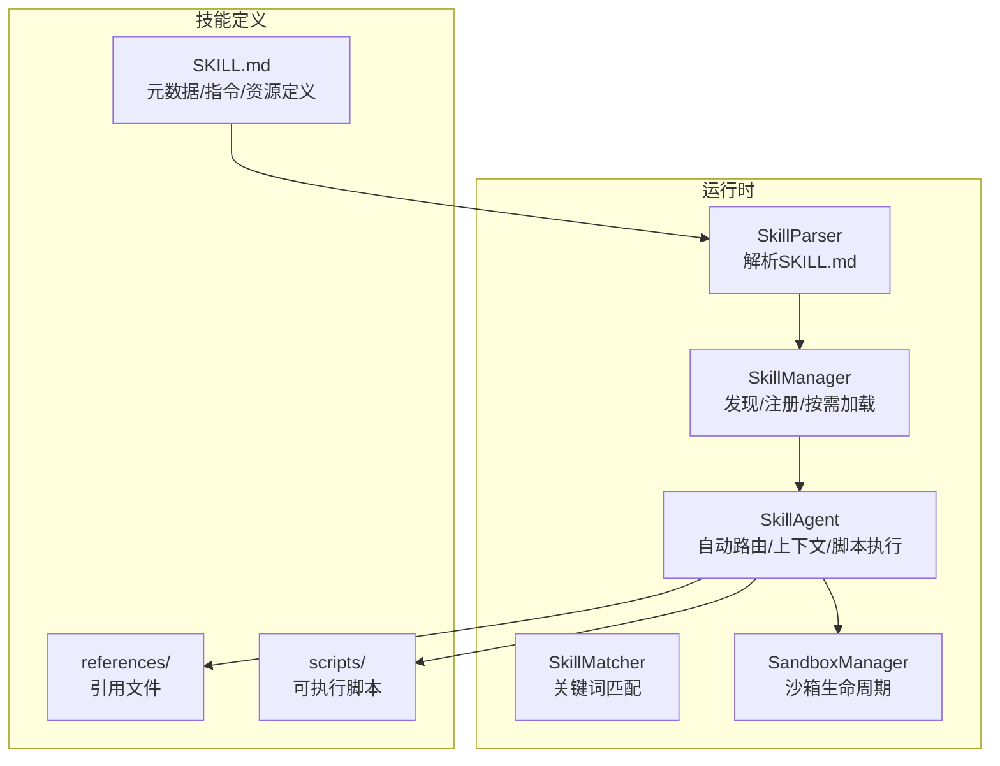
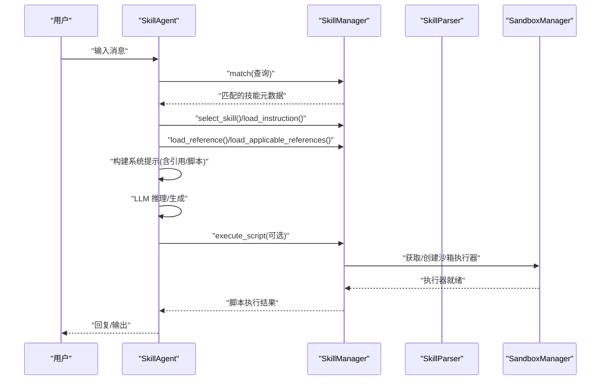
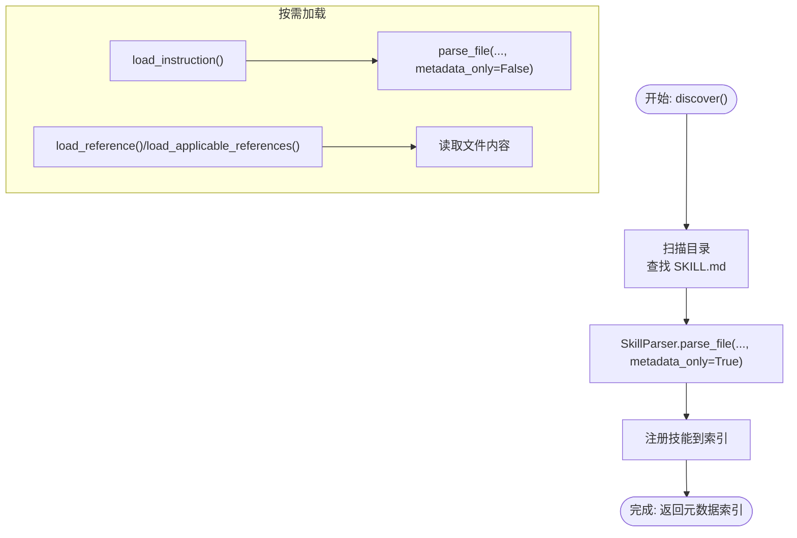
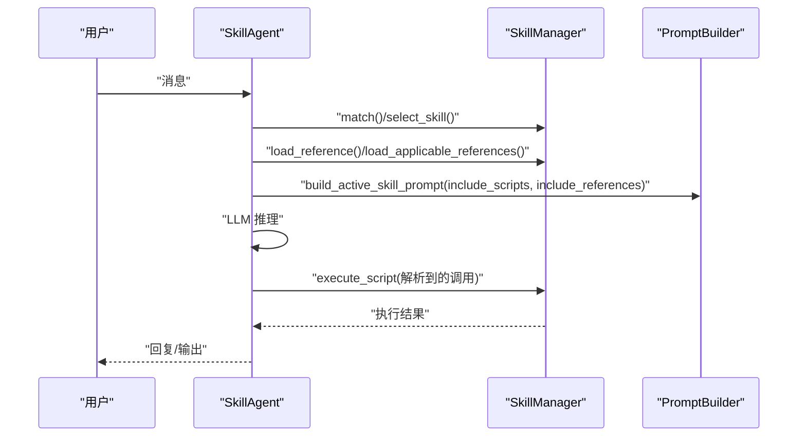
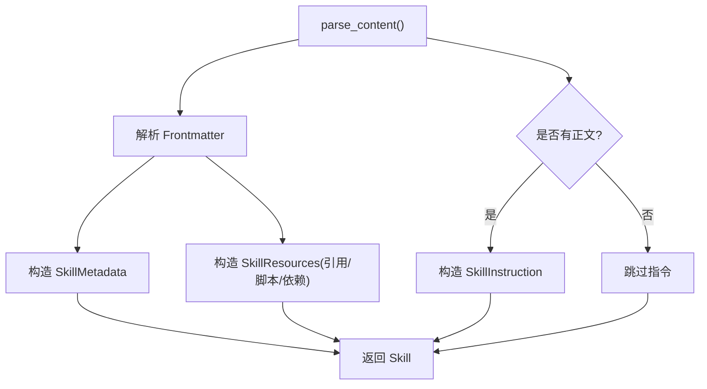
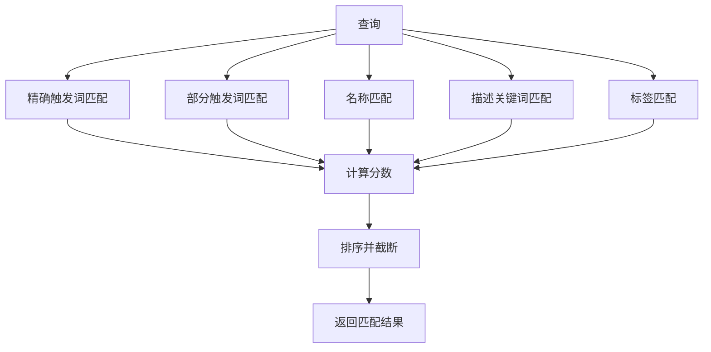
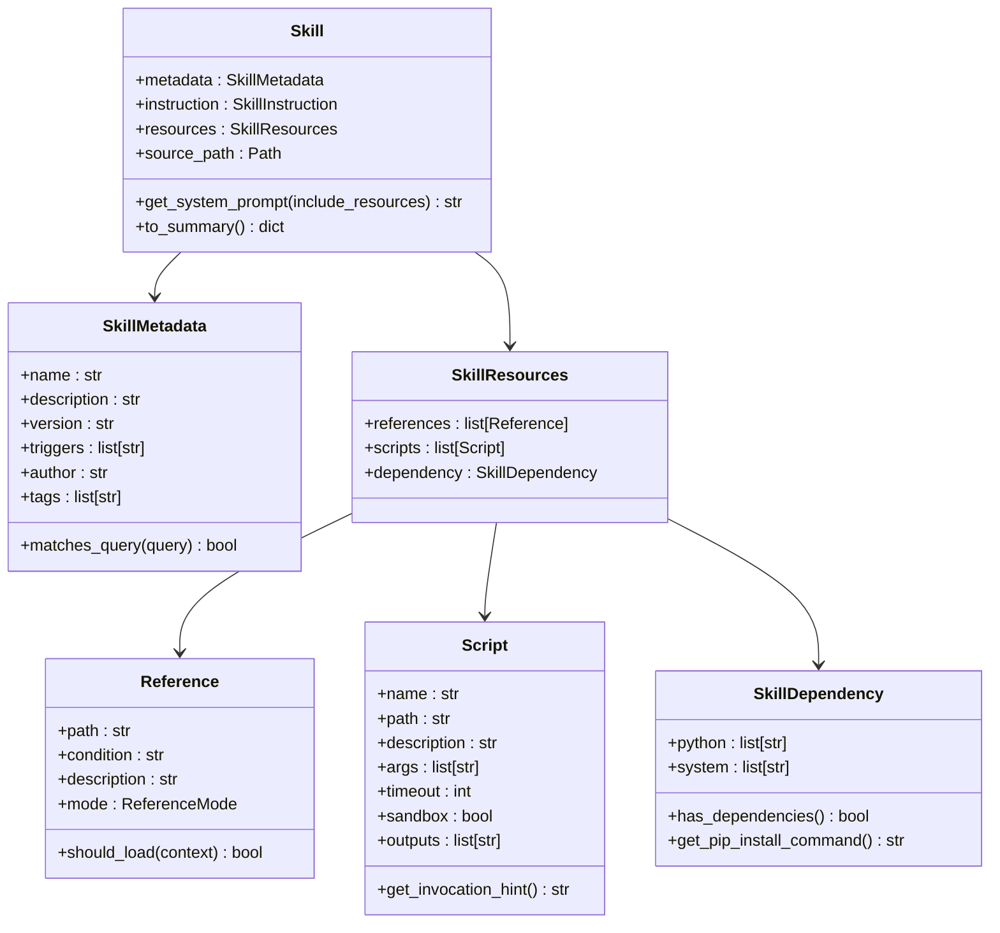
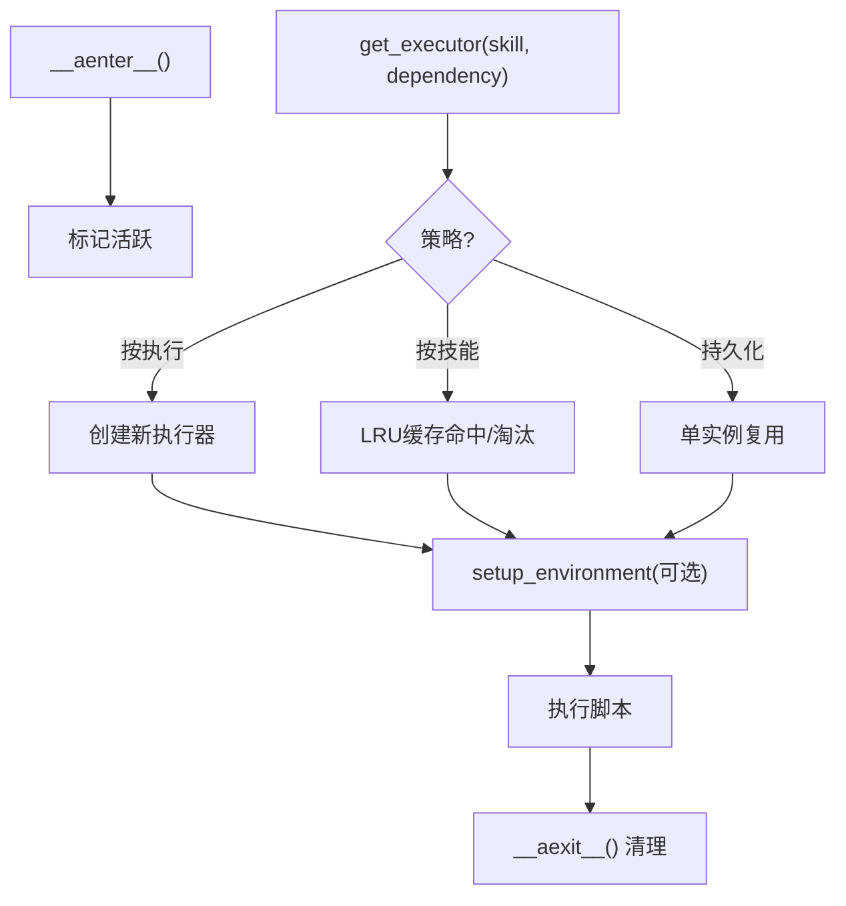
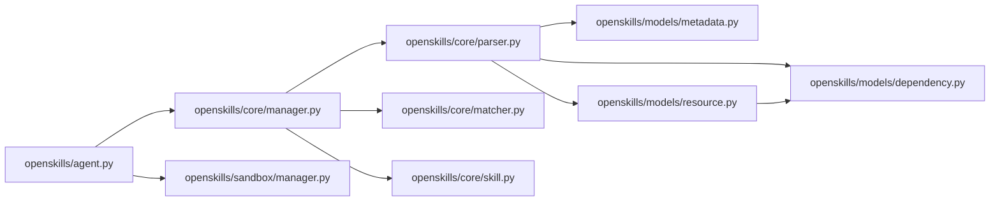

# 插件开发

<cite>
**本文引用的文件**
- [OpenSkills-main/openskills/__init__.py](file://OpenSkills-main/openskills/__init__.py)
- [OpenSkills-main/openskills/core/manager.py](file://OpenSkills-main/openskills/core/manager.py)
- [OpenSkills-main/openskills/core/skill.py](file://OpenSkills-main/openskills/core/skill.py)
- [OpenSkills-main/openskills/models/metadata.py](file://OpenSkills-main/openskills/models/metadata.py)
- [OpenSkills-main/openskills/models/resource.py](file://OpenSkills-main/openskills/models/resource.py)
- [OpenSkills-main/openskills/models/dependency.py](file://OpenSkills-main/openskills/models/dependency.py)
- [OpenSkills-main/openskills/core/parser.py](file://OpenSkills-main/openskills/core/parser.py)
- [OpenSkills-main/openskills/core/matcher.py](file://OpenSkills-main/openskills/core/matcher.py)
- [OpenSkills-main/openskills/agent.py](file://OpenSkills-main/openskills/agent.py)
- [OpenSkills-main/openskills/sandbox/manager.py](file://OpenSkills-main/openskills/sandbox/manager.py)
- [OpenSkills-main/examples/demo.py](file://OpenSkills-main/examples/demo.py)
- [OpenSkills-main/examples/prompt-optimizer/SKILL.md](file://OpenSkills-main/examples/prompt-optimizer/SKILL.md)
- [OpenSkills-main/examples/multi-chart-draw/demo.py](file://OpenSkills-main/examples/multi-chart-draw/demo.py)
- [OpenSkills-main/pyproject.toml](file://OpenSkills-main/pyproject.toml)
</cite>

## 目录
1. [简介](#简介)
2. [项目结构](#项目结构)
3. [核心组件](#核心组件)
4. [架构总览](#架构总览)
5. [详细组件分析](#详细组件分析)
6. [依赖分析](#依赖分析)
7. [性能考虑](#性能考虑)
8. [故障排查指南](#故障排查指南)
9. [结论](#结论)
10. [附录](#附录)

## 简介
本指南面向希望基于 AutoMate 的 OpenSkills 框架开发“插件”（在本框架中称为“技能”）的开发者。文档系统性讲解三层渐进披露架构、技能加载与匹配流程、依赖管理与沙箱执行、资源与脚本机制、事件回调与钩子、以及如何扩展与发布技能。同时提供开发模板、配置规范、测试与调试建议，帮助快速上手并构建高质量的技能。

## 项目结构
OpenSkills 将技能定义与运行时能力解耦：技能通过统一的 SKILL.md 描述文件声明元数据、指令、引用与脚本；运行时由 SkillManager 负责发现、注册、按需加载与执行；SkillAgent 提供自动技能选择、上下文注入与脚本调用能力；SandboxManager 提供可选的安全沙箱执行环境。

**图表来源**
- [OpenSkills-main/openskills/agent.py](file://OpenSkills-main/openskills/agent.py#L61-L140)
- [OpenSkills-main/openskills/core/manager.py](file://OpenSkills-main/openskills/core/manager.py#L24-L115)
- [OpenSkills-main/openskills/core/parser.py](file://OpenSkills-main/openskills/core/parser.py#L19-L100)
- [OpenSkills-main/openskills/core/matcher.py](file://OpenSkills-main/openskills/core/matcher.py#L22-L80)
- [OpenSkills-main/openskills/sandbox/manager.py](file://OpenSkills-main/openskills/sandbox/manager.py#L30-L88)

**章节来源**
- [OpenSkills-main/openskills/__init__.py](file://OpenSkills-main/openskills/__init__.py#L1-L50)
- [OpenSkills-main/pyproject.toml](file://OpenSkills-main/pyproject.toml#L1-L75)

## 核心组件
- SkillManager：技能发现、注册、按需加载指令与引用、执行脚本、沙箱集成。
- SkillAgent：对话代理，自动匹配技能、注入系统提示、按需加载引用、执行脚本。
- SkillParser：解析 SKILL.md，支持仅元数据解析与完整解析。
- SkillMatcher：基于触发词、名称、描述、标签的多级评分匹配。
- Skill 模型：三层渐进披露（元数据 Layer1、指令 Layer2、资源 Layer3）。
- 资源模型：Reference（条件加载）、Script（可执行脚本）、SkillResources（容器）。
- 依赖模型：SkillDependency（Python 包与系统命令）。
- SandboxManager：沙箱生命周期管理与依赖安装。

**章节来源**
- [OpenSkills-main/openskills/core/manager.py](file://OpenSkills-main/openskills/core/manager.py#L24-L115)
- [OpenSkills-main/openskills/agent.py](file://OpenSkills-main/openskills/agent.py#L61-L140)
- [OpenSkills-main/openskills/core/parser.py](file://OpenSkills-main/openskills/core/parser.py#L19-L100)
- [OpenSkills-main/openskills/core/matcher.py](file://OpenSkills-main/openskills/core/matcher.py#L22-L80)
- [OpenSkills-main/openskills/core/skill.py](file://OpenSkills-main/openskills/core/skill.py#L19-L56)
- [OpenSkills-main/openskills/models/resource.py](file://OpenSkills-main/openskills/models/resource.py#L45-L120)
- [OpenSkills-main/openskills/models/dependency.py](file://OpenSkills-main/openskills/models/dependency.py#L13-L66)
- [OpenSkills-main/openskills/sandbox/manager.py](file://OpenSkills-main/openskills/sandbox/manager.py#L30-L88)

## 架构总览
下图展示了从用户输入到技能执行的关键流程：自动发现与匹配、按需加载引用、构建系统提示、LLM 推理与脚本调用、沙箱执行与文件同步。

**图表来源**
- [OpenSkills-main/openskills/agent.py](file://OpenSkills-main/openskills/agent.py#L228-L321)
- [OpenSkills-main/openskills/core/manager.py](file://OpenSkills-main/openskills/core/manager.py#L495-L523)
- [OpenSkills-main/openskills/core/manager.py](file://OpenSkills-main/openskills/core/manager.py#L181-L203)
- [OpenSkills-main/openskills/core/manager.py](file://OpenSkills-main/openskills/core/manager.py#L205-L263)
- [OpenSkills-main/openskills/core/manager.py](file://OpenSkills-main/openskills/core/manager.py#L265-L360)
- [OpenSkills-main/openskills/sandbox/manager.py](file://OpenSkills-main/openskills/sandbox/manager.py#L89-L147)

## 详细组件分析

### 组件一：SkillManager（技能管理器）
职责
- 发现：扫描目录中的 SKILL.md，仅解析元数据（Layer1）。
- 注册：建立技能名到 Skill 对象的索引与元数据索引。
- 加载：按需加载指令（Layer2）与引用（Layer3）。
- 匹配：基于关键词与评分返回最相关技能。
- 执行：执行脚本，支持本地或沙箱模式，并进行文件上传/下载。

关键流程
- 发现与注册：遍历 skill_paths，解析 SKILL.md，仅元数据。
- 指令加载：读取 SKILL.md 正文作为指令。
- 引用加载：根据上下文条件或显式/隐式模式决定是否加载。
- 脚本执行：解析脚本路径，选择本地或沙箱执行，必要时上传输入文件、下载输出文件。

**图表来源**
- [OpenSkills-main/openskills/core/manager.py](file://OpenSkills-main/openskills/core/manager.py#L116-L175)
- [OpenSkills-main/openskills/core/manager.py](file://OpenSkills-main/openskills/core/manager.py#L181-L263)
- [OpenSkills-main/openskills/core/parser.py](file://OpenSkills-main/openskills/core/parser.py#L33-L100)

**章节来源**
- [OpenSkills-main/openskills/core/manager.py](file://OpenSkills-main/openskills/core/manager.py#L24-L115)
- [OpenSkills-main/openskills/core/manager.py](file://OpenSkills-main/openskills/core/manager.py#L116-L175)
- [OpenSkills-main/openskills/core/manager.py](file://OpenSkills-main/openskills/core/manager.py#L181-L263)
- [OpenSkills-main/openskills/core/manager.py](file://OpenSkills-main/openskills/core/manager.py#L265-L360)

### 组件二：SkillAgent（对话代理）
职责
- 初始化：发现技能、预装依赖（沙箱模式）。
- 自动技能选择：关键词匹配或 LLM 决策。
- 上下文构建：注入历史摘要、重新加载引用、拼接系统提示。
- 引用加载：显式/隐式/总是三种模式，支持 LLM 评估。
- 脚本执行：解析响应中的脚本调用标记并执行。
- 回调钩子：技能选择、引用加载、脚本执行事件。

**图表来源**
- [OpenSkills-main/openskills/agent.py](file://OpenSkills-main/openskills/agent.py#L228-L321)
- [OpenSkills-main/openskills/agent.py](file://OpenSkills-main/openskills/agent.py#L404-L469)
- [OpenSkills-main/openskills/agent.py](file://OpenSkills-main/openskills/agent.py#L577-L633)
- [OpenSkills-main/openskills/agent.py](file://OpenSkills-main/openskills/agent.py#L734-L760)

**章节来源**
- [OpenSkills-main/openskills/agent.py](file://OpenSkills-main/openskills/agent.py#L61-L140)
- [OpenSkills-main/openskills/agent.py](file://OpenSkills-main/openskills/agent.py#L228-L321)
- [OpenSkills-main/openskills/agent.py](file://OpenSkills-main/openskills/agent.py#L404-L469)
- [OpenSkills-main/openskills/agent.py](file://OpenSkills-main/openskills/agent.py#L577-L633)
- [OpenSkills-main/openskills/agent.py](file://OpenSkills-main/openskills/agent.py#L734-L760)

### 组件三：SkillParser（SKILL.md 解析器）
职责
- 快速解析：仅提取 Frontmatter 作为元数据（Layer1）。
- 完整解析：解析正文作为指令（Layer2），并解析资源定义（Layer3）。
- 资源发现：自动扫描 references/ 目录补充引用定义。
- 依赖解析：从 Frontmatter 提取依赖配置。

**图表来源**
- [OpenSkills-main/openskills/core/parser.py](file://OpenSkills-main/openskills/core/parser.py#L58-L100)
- [OpenSkills-main/openskills/core/parser.py](file://OpenSkills-main/openskills/core/parser.py#L119-L173)
- [OpenSkills-main/openskills/core/parser.py](file://OpenSkills-main/openskills/core/parser.py#L175-L208)

**章节来源**
- [OpenSkills-main/openskills/core/parser.py](file://OpenSkills-main/openskills/core/parser.py#L19-L100)
- [OpenSkills-main/openskills/core/parser.py](file://OpenSkills-main/openskills/core/parser.py#L119-L173)
- [OpenSkills-main/openskills/core/parser.py](file://OpenSkills-main/openskills/core/parser.py#L175-L208)

### 组件四：SkillMatcher（技能匹配器）
职责
- 多级评分：精确触发词、部分触发词、名称匹配、描述关键词、标签匹配。
- 令牌化与关键词提取：支持中英文与 CJK 字符处理。
- 结果排序与限制：按分数降序返回前 N 个。

**图表来源**
- [OpenSkills-main/openskills/core/matcher.py](file://OpenSkills-main/openskills/core/matcher.py#L53-L80)
- [OpenSkills-main/openskills/core/matcher.py](file://OpenSkills-main/openskills/core/matcher.py#L82-L160)
- [OpenSkills-main/openskills/core/matcher.py](file://OpenSkills-main/openskills/core/matcher.py#L162-L202)

**章节来源**
- [OpenSkills-main/openskills/core/matcher.py](file://OpenSkills-main/openskills/core/matcher.py#L22-L80)
- [OpenSkills-main/openskills/core/matcher.py](file://OpenSkills-main/openskills/core/matcher.py#L82-L160)

### 组件五：Skill（三层渐进披露）
职责
- Layer1：SkillMetadata（名称、描述、触发词、作者、标签等）。
- Layer2：SkillInstruction（技能说明与工作流）。
- Layer3：SkillResources（引用与脚本定义，按需加载）。

**图表来源**
- [OpenSkills-main/openskills/core/skill.py](file://OpenSkills-main/openskills/core/skill.py#L19-L150)
- [OpenSkills-main/openskills/models/metadata.py](file://OpenSkills-main/openskills/models/metadata.py#L11-L82)
- [OpenSkills-main/openskills/models/resource.py](file://OpenSkills-main/openskills/models/resource.py#L45-L203)
- [OpenSkills-main/openskills/models/dependency.py](file://OpenSkills-main/openskills/models/dependency.py#L13-L86)

**章节来源**
- [OpenSkills-main/openskills/core/skill.py](file://OpenSkills-main/openskills/core/skill.py#L19-L150)
- [OpenSkills-main/openskills/models/metadata.py](file://OpenSkills-main/openskills/models/metadata.py#L11-L82)
- [OpenSkills-main/openskills/models/resource.py](file://OpenSkills-main/openskills/models/resource.py#L45-L203)
- [OpenSkills-main/openskills/models/dependency.py](file://OpenSkills-main/openskills/models/dependency.py#L13-L86)

### 组件六：SandboxManager（沙箱生命周期）
职责
- 生命周期：异步上下文管理，进入/退出时清理。
- 策略：按执行、按技能、持久化三种策略复用执行器。
- 依赖安装：按技能与依赖配置安装 Python 包与执行系统命令。
- 并发：锁保护与 LRU 缓存，避免重复创建。

**图表来源**
- [OpenSkills-main/openskills/sandbox/manager.py](file://OpenSkills-main/openskills/sandbox/manager.py#L79-L147)
- [OpenSkills-main/openskills/sandbox/manager.py](file://OpenSkills-main/openskills/sandbox/manager.py#L149-L168)
- [OpenSkills-main/openskills/sandbox/manager.py](file://OpenSkills-main/openskills/sandbox/manager.py#L177-L192)

**章节来源**
- [OpenSkills-main/openskills/sandbox/manager.py](file://OpenSkills-main/openskills/sandbox/manager.py#L30-L88)
- [OpenSkills-main/openskills/sandbox/manager.py](file://OpenSkills-main/openskills/sandbox/manager.py#L89-L147)
- [OpenSkills-main/openskills/sandbox/manager.py](file://OpenSkills-main/openskills/sandbox/manager.py#L149-L168)

## 依赖分析
- 模块内聚：核心运行时（manager、agent、parser、matcher）围绕 Skill 概念紧密协作。
- 外部依赖：Pydantic（数据校验）、httpx（网络）、rich（日志）、pytest/ruff（测试与规范）。
- 可选依赖：sandbox（沙箱相关）。
- 循环依赖：未见循环导入；沙箱管理器与 SkillManager 通过接口解耦。

**图表来源**
- [OpenSkills-main/openskills/agent.py](file://OpenSkills-main/openskills/agent.py#L18-L28)
- [OpenSkills-main/openskills/core/manager.py](file://OpenSkills-main/openskills/core/manager.py#L15-L21)
- [OpenSkills-main/openskills/core/parser.py](file://OpenSkills-main/openskills/core/parser.py#L11-L16)
- [OpenSkills-main/openskills/models/resource.py](file://OpenSkills-main/openskills/models/resource.py#L24-L25)

**章节来源**
- [OpenSkills-main/pyproject.toml](file://OpenSkills-main/pyproject.toml#L22-L38)

## 性能考虑
- 渐进披露：仅在需要时加载指令与引用，减少内存占用与 IO。
- 匹配评分：多级评分与令牌化，兼顾速度与准确性。
- 沙箱复用：按技能或持久化策略复用执行器，降低冷启动开销。
- 文件同步：仅在沙箱执行后同步输出文件，避免不必要的网络传输。
- LLM 调用：通过系统提示聚合上下文，减少重复信息。

[本节为通用指导，无需特定文件引用]

## 故障排查指南
常见问题与定位
- 技能未被发现：确认 SKILL.md 路径正确且存在；检查 discover() 是否被调用；查看日志输出。
- 引用未加载：检查引用模式（always/implicit/explicit）与条件；确认 LLM 评估逻辑；查看 on_reference_loaded 回调。
- 脚本执行失败：确认脚本路径与权限；检查沙箱是否启用与可用；查看沙箱输出目录同步情况。
- 依赖安装失败：检查 SkillDependency 的 python/system 配置；确认沙箱环境可联网；查看安装日志。
- 匹配不准确：调整触发词与描述关键词；提高最小阈值；必要时扩展匹配策略。

**章节来源**
- [OpenSkills-main/openskills/core/manager.py](file://OpenSkills-main/openskills/core/manager.py#L116-L175)
- [OpenSkills-main/openskills/agent.py](file://OpenSkills-main/openskills/agent.py#L577-L633)
- [OpenSkills-main/openskills/sandbox/manager.py](file://OpenSkills-main/openskills/sandbox/manager.py#L149-L168)

## 结论
OpenSkills 通过三层渐进披露与可插拔的技能体系，实现了“按需加载、按需执行”的高效代理能力。结合 SkillAgent 的自动路由与 SkillManager 的资源管理，开发者可以快速构建与扩展各类技能，覆盖从文档处理到图表生成、从知识检索到自动化脚本执行的广泛场景。

[本节为总结，无需特定文件引用]

## 附录

### A. 插件（技能）开发模板
- 目录结构
  - SKILL.md（必填）
  - references/（可选，引用文件）
  - scripts/（可选，脚本文件）
- SKILL.md 建议字段
  - 必填：name、description
  - 可选：version、triggers、author、tags、dependency、references、scripts
- 引用模式
  - explicit：由 LLM 评估是否加载
  - implicit：默认由 LLM 决定
  - always：始终加载（如安全规范）
- 脚本
  - name、path、description、args、timeout、sandbox、outputs

参考示例
- [OpenSkills-main/examples/prompt-optimizer/SKILL.md](file://OpenSkills-main/examples/prompt-optimizer/SKILL.md#L1-L131)

**章节来源**
- [OpenSkills-main/openskills/core/parser.py](file://OpenSkills-main/openskills/core/parser.py#L119-L173)
- [OpenSkills-main/openskills/models/resource.py](file://OpenSkills-main/openskills/models/resource.py#L45-L203)
- [OpenSkills-main/openskills/models/dependency.py](file://OpenSkills-main/openskills/models/dependency.py#L13-L86)

### B. 配置文件与元数据规范
- 元数据（Layer1）
  - name、description、version、triggers、author、tags
- 指令（Layer2）
  - SKILL.md 正文内容，描述工作流与执行细节
- 资源（Layer3）
  - references：path、condition、mode、description
  - scripts：name、path、description、args、timeout、sandbox、outputs
- 依赖（Layer3）
  - dependency.python：pip 安装包列表
  - dependency.system：执行的系统命令

**章节来源**
- [OpenSkills-main/openskills/models/metadata.py](file://OpenSkills-main/openskills/models/metadata.py#L11-L82)
- [OpenSkills-main/openskills/core/parser.py](file://OpenSkills-main/openskills/core/parser.py#L108-L173)
- [OpenSkills-main/openskills/models/resource.py](file://OpenSkills-main/openskills/models/resource.py#L45-L203)
- [OpenSkills-main/openskills/models/dependency.py](file://OpenSkills-main/openskills/models/dependency.py#L13-L86)

### C. 插件间通信、资源共享与冲突解决
- 通信方式
  - 通过 SkillAgent 的系统提示共享上下文；脚本通过 outputs 将产物回传到本地 output 目录
- 资源共享
  - 引用按需加载，避免重复；沙箱模式下通过统一的 SandboxManager 管理执行器与依赖
- 冲突解决
  - 触发词优先级与评分排序；显式/隐式模式由 LLM 决策；always 模式强制加载以保证一致性

**章节来源**
- [OpenSkills-main/openskills/agent.py](file://OpenSkills-main/openskills/agent.py#L404-L469)
- [OpenSkills-main/openskills/core/manager.py](file://OpenSkills-main/openskills/core/manager.py#L205-L263)
- [OpenSkills-main/openskills/sandbox/manager.py](file://OpenSkills-main/openskills/sandbox/manager.py#L89-L147)

### D. 测试、调试与发布流程
- 测试
  - 单元测试：pytest + pytest-asyncio
  - 示例演示：examples 下的 demo.py 展示典型用法
- 调试
  - 使用回调 on_reference_loaded/on_skill_selected/on_script_executed 观察执行链路
  - 沙箱模式下关注日志与输出目录同步
- 发布
  - 通过 pyproject.toml 配置依赖与脚本入口
  - 使用 hatch 构建与打包

**章节来源**
- [OpenSkills-main/pyproject.toml](file://OpenSkills-main/pyproject.toml#L30-L38)
- [OpenSkills-main/pyproject.toml](file://OpenSkills-main/pyproject.toml#L72-L75)
- [OpenSkills-main/examples/demo.py](file://OpenSkills-main/examples/demo.py#L1-L290)
- [OpenSkills-main/examples/multi-chart-draw/demo.py](file://OpenSkills-main/examples/multi-chart-draw/demo.py#L1-L261)

### E. 扩展现有功能与创建全新插件类型
- 扩展匹配策略：在 SkillMatcher 中增加新的评分维度或语义相似度
- 新增脚本类型：在 Script 中扩展参数与输出格式，配合 outputs 实现多类型产物同步
- 新增资源类型：在 SkillResources 中引入新的资源类型并在加载流程中处理
- 新增 LLM 客户端：实现 BaseLLMClient 接口以适配不同推理服务

**章节来源**
- [OpenSkills-main/openskills/core/matcher.py](file://OpenSkills-main/openskills/core/matcher.py#L22-L80)
- [OpenSkills-main/openskills/models/resource.py](file://OpenSkills-main/openskills/models/resource.py#L112-L178)
- [OpenSkills-main/openskills/agent.py](file://OpenSkills-main/openskills/agent.py#L18-L28)