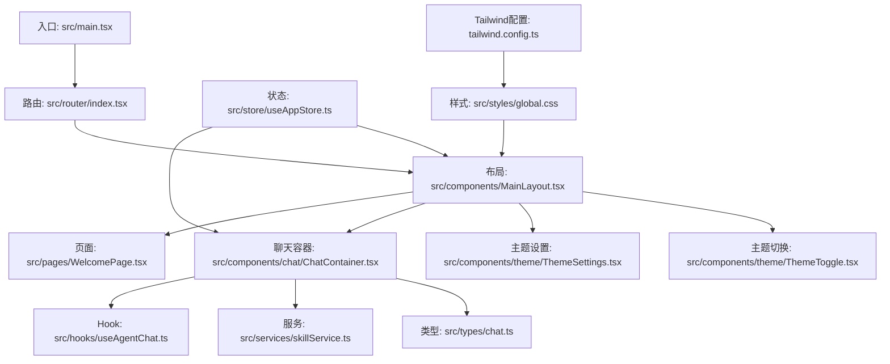
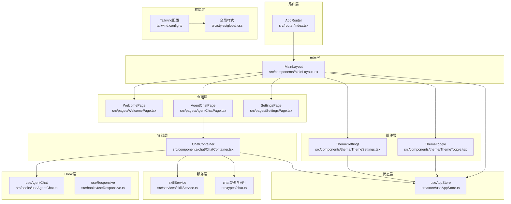
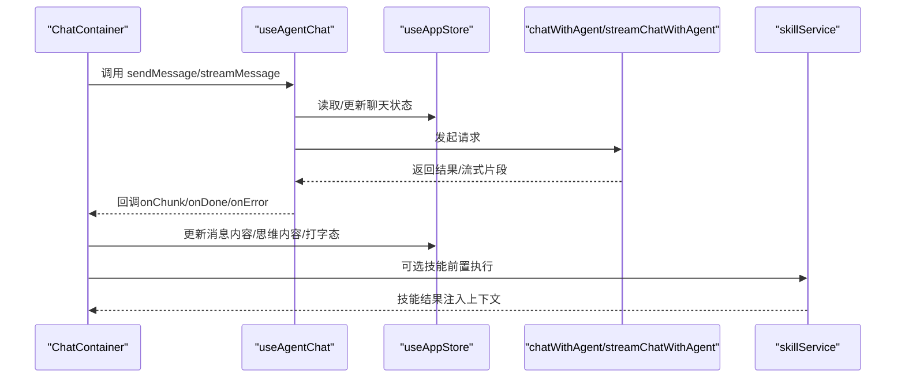
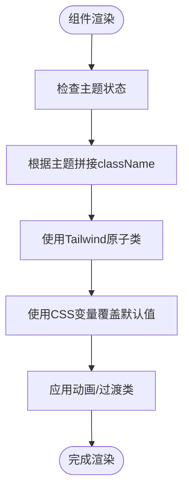
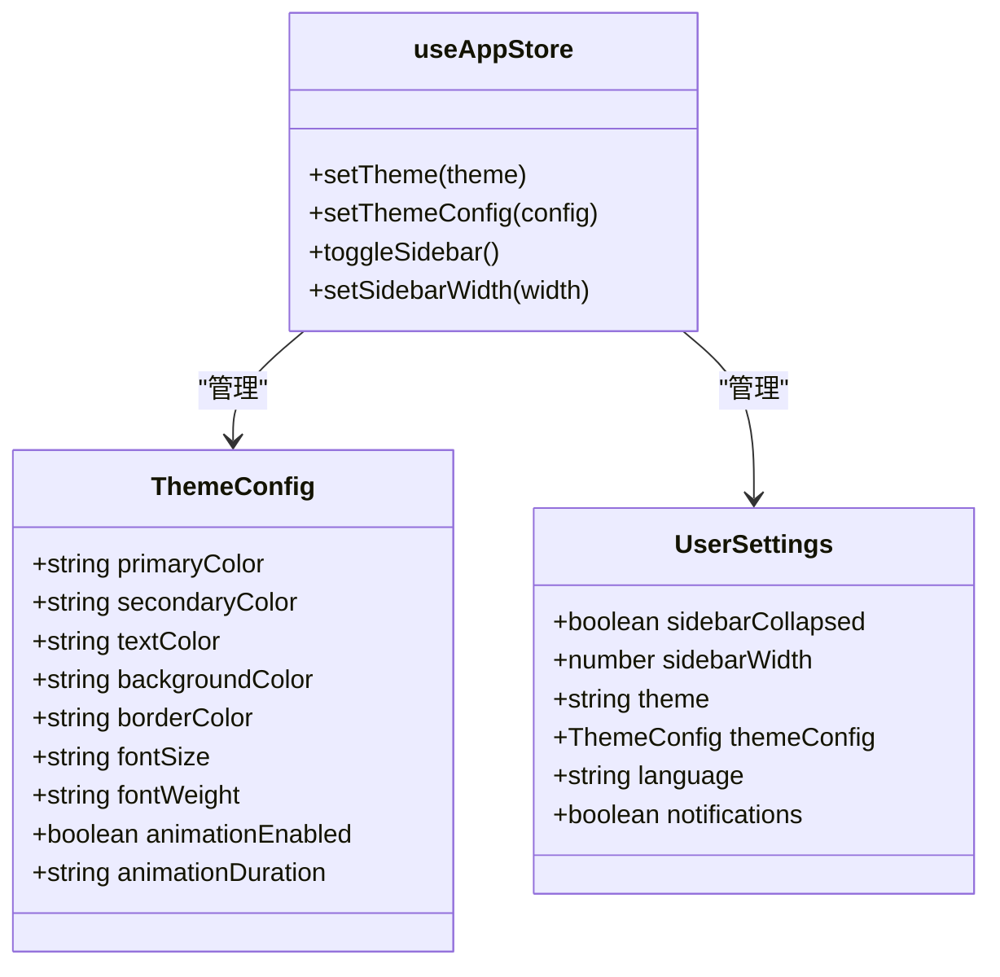
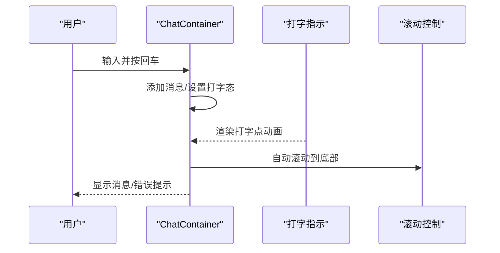
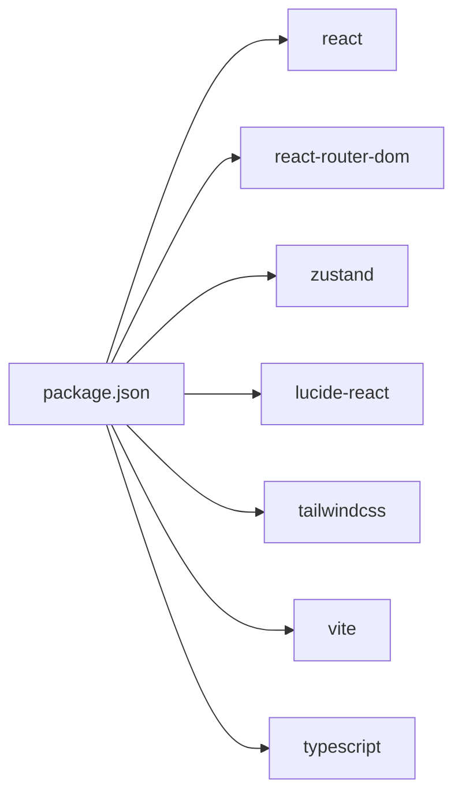

# 界面扩展

<cite>
**本文引用的文件**
- [package.json](file://package.json)
- [src/main.tsx](file://src/main.tsx)
- [src/router/index.tsx](file://src/router/index.tsx)
- [src/store/useAppStore.ts](file://src/store/useAppStore.ts)
- [tailwind.config.ts](file://tailwind.config.ts)
- [src/components/MainLayout.tsx](file://src/components/MainLayout.tsx)
- [src/hooks/useAgentChat.ts](file://src/hooks/useAgentChat.ts)
- [src/hooks/useResponsive.ts](file://src/hooks/useResponsive.ts)
- [src/styles/global.css](file://src/styles/global.css)
- [src/pages/WelcomePage.tsx](file://src/pages/WelcomePage.tsx)
- [src/types/chat.ts](file://src/types/chat.ts)
- [src/components/theme/ThemeSettings.tsx](file://src/components/theme/ThemeSettings.tsx)
- [src/components/theme/ThemeToggle.tsx](file://src/components/theme/ThemeToggle.tsx)
- [src/services/skillService.ts](file://src/services/skillService.ts)
- [src/components/chat/ChatContainer.tsx](file://src/components/chat/ChatContainer.tsx)
</cite>

## 目录
1. [引言](#引言)
2. [项目结构](#项目结构)
3. [核心组件](#核心组件)
4. [架构总览](#架构总览)
5. [详细组件分析](#详细组件分析)
6. [依赖关系分析](#依赖关系分析)
7. [性能考虑](#性能考虑)
8. [故障排查指南](#故障排查指南)
9. [结论](#结论)
10. [附录](#附录)

## 引言
本指南面向需要在AutoMate项目中进行界面扩展与定制的开发者，围绕React组件扩展、自定义UI组件开发、样式与主题系统、状态管理与Hooks使用、组件复用策略、动画与过渡效果、响应式设计、无障碍支持、测试与性能优化、以及页面与功能模块的新增路径，提供系统化的方法论与实践建议。内容基于仓库现有代码结构与实现细节，帮助你在不破坏既有架构的前提下，高效地扩展与优化用户界面。

## 项目结构
AutoMate采用前端单页应用架构，以React + TypeScript为主，结合Zustand状态管理、TailwindCSS样式体系与Vite构建工具。路由通过React Router v6组织页面级组件，全局状态集中在Zustand Store中，主题与动画通过Tailwind配置与CSS变量协同实现。

**图表来源**
- [src/main.tsx](file://src/main.tsx#L1-L12)
- [src/router/index.tsx](file://src/router/index.tsx#L1-L43)
- [src/components/MainLayout.tsx](file://src/components/MainLayout.tsx#L1-L134)
- [src/pages/WelcomePage.tsx](file://src/pages/WelcomePage.tsx#L1-L110)
- [src/components/chat/ChatContainer.tsx](file://src/components/chat/ChatContainer.tsx#L1-L756)
- [src/hooks/useAgentChat.ts](file://src/hooks/useAgentChat.ts#L1-L128)
- [src/services/skillService.ts](file://src/services/skillService.ts#L1-L73)
- [src/types/chat.ts](file://src/types/chat.ts#L1-L280)
- [src/components/theme/ThemeSettings.tsx](file://src/components/theme/ThemeSettings.tsx#L1-L262)
- [src/components/theme/ThemeToggle.tsx](file://src/components/theme/ThemeToggle.tsx#L1-L40)
- [src/store/useAppStore.ts](file://src/store/useAppStore.ts#L1-L306)
- [src/styles/global.css](file://src/styles/global.css#L1-L664)
- [tailwind.config.ts](file://tailwind.config.ts#L1-L161)

**章节来源**
- [src/main.tsx](file://src/main.tsx#L1-L12)
- [src/router/index.tsx](file://src/router/index.tsx#L1-L43)
- [src/store/useAppStore.ts](file://src/store/useAppStore.ts#L1-L306)
- [tailwind.config.ts](file://tailwind.config.ts#L1-L161)
- [src/styles/global.css](file://src/styles/global.css#L1-L664)

## 核心组件
- 应用入口与路由
  - 入口文件负责挂载根组件与引入全局样式。
  - 路由定义了主页、智能体聊天页与设置页，并统一包裹在MainLayout中。
- 状态中心
  - 使用Zustand集中管理智能体列表、聊天会话、用户设置、主题配置与全局状态。
- 主题与样式
  - Tailwind配置提供颜色、字体、间距、圆角、阴影、过渡与动画等原子类。
  - CSS变量与深色类名实现主题切换与暗色适配。
- Hook体系
  - useAgentChat封装与智能体的聊天交互逻辑，包括同步与流式输出。
  - useResponsive提供断点检测、媒体查询、横竖屏判断与视口尺寸监听。
- 页面与容器
  - WelcomePage为欢迎页，展示统计信息与引导步骤。
  - ChatContainer承载聊天界面，包含消息渲染、输入区、滚动控制、打字指示与发送/停止流程。

**章节来源**
- [src/main.tsx](file://src/main.tsx#L1-L12)
- [src/router/index.tsx](file://src/router/index.tsx#L1-L43)
- [src/store/useAppStore.ts](file://src/store/useAppStore.ts#L1-L306)
- [tailwind.config.ts](file://tailwind.config.ts#L1-L161)
- [src/styles/global.css](file://src/styles/global.css#L1-L664)
- [src/hooks/useAgentChat.ts](file://src/hooks/useAgentChat.ts#L1-L128)
- [src/hooks/useResponsive.ts](file://src/hooks/useResponsive.ts#L1-L110)
- [src/pages/WelcomePage.tsx](file://src/pages/WelcomePage.tsx#L1-L110)
- [src/components/chat/ChatContainer.tsx](file://src/components/chat/ChatContainer.tsx#L1-L756)

## 架构总览
AutoMate的前端采用“布局-页面-容器-组件-Hook-服务-状态”的分层架构。路由驱动页面，布局统一承载侧边栏、搜索、底部设置与主内容区；容器组件负责复杂交互与数据流；Hook抽取可复用的业务逻辑；服务层对接外部API；状态中心统一管理UI与业务状态。

**图表来源**
- [src/router/index.tsx](file://src/router/index.tsx#L1-L43)
- [src/components/MainLayout.tsx](file://src/components/MainLayout.tsx#L1-L134)
- [src/pages/WelcomePage.tsx](file://src/pages/WelcomePage.tsx#L1-L110)
- [src/components/chat/ChatContainer.tsx](file://src/components/chat/ChatContainer.tsx#L1-L756)
- [src/components/theme/ThemeSettings.tsx](file://src/components/theme/ThemeSettings.tsx#L1-L262)
- [src/components/theme/ThemeToggle.tsx](file://src/components/theme/ThemeToggle.tsx#L1-L40)
- [src/hooks/useAgentChat.ts](file://src/hooks/useAgentChat.ts#L1-L128)
- [src/hooks/useResponsive.ts](file://src/hooks/useResponsive.ts#L1-L110)
- [src/services/skillService.ts](file://src/services/skillService.ts#L1-L73)
- [src/types/chat.ts](file://src/types/chat.ts#L1-L280)
- [src/store/useAppStore.ts](file://src/store/useAppStore.ts#L1-L306)
- [tailwind.config.ts](file://tailwind.config.ts#L1-L161)
- [src/styles/global.css](file://src/styles/global.css#L1-L664)

## 详细组件分析

### 状态管理扩展与Hooks使用
- Zustand Store设计
  - 结构清晰：包含智能体、聊天会话、用户设置、主题配置、全局状态等字段与对应Action。
  - 主题配置支持浅色/深色默认值与可编辑项（主色、辅色、文本色、背景色、边框色、字号、字重、动画开关与时长）。
  - 聊天状态支持消息增删改、打字态、流式更新与思维内容提取。
- Hooks使用建议
  - useAgentChat：封装与智能体交互，支持同步与流式输出，返回loading/error与回调处理器。
  - useResponsive：提供断点、媒体查询、横竖屏与视口尺寸，便于条件渲染与布局适配。
- 组件复用策略
  - 将通用逻辑下沉至Hook，UI组件仅关注渲染与事件绑定。
  - Store Action尽量保持单一职责，避免跨域耦合。

**图表来源**
- [src/components/chat/ChatContainer.tsx](file://src/components/chat/ChatContainer.tsx#L213-L392)
- [src/hooks/useAgentChat.ts](file://src/hooks/useAgentChat.ts#L18-L127)
- [src/store/useAppStore.ts](file://src/store/useAppStore.ts#L143-L210)
- [src/types/chat.ts](file://src/types/chat.ts#L96-L189)
- [src/services/skillService.ts](file://src/services/skillService.ts#L12-L72)

**章节来源**
- [src/store/useAppStore.ts](file://src/store/useAppStore.ts#L1-L306)
- [src/hooks/useAgentChat.ts](file://src/hooks/useAgentChat.ts#L1-L128)
- [src/hooks/useResponsive.ts](file://src/hooks/useResponsive.ts#L1-L110)
- [src/components/chat/ChatContainer.tsx](file://src/components/chat/ChatContainer.tsx#L1-L756)

### 自定义UI组件开发与样式定制
- 组件开发原则
  - 以Props为中心，明确输入输出，避免直接依赖全局状态。
  - 使用Tailwind原子类与CSS变量组合，保证主题一致性。
  - 通过className动态拼接与条件渲染实现状态态样式。
- 样式定制方法
  - Tailwind配置提供颜色、字体、间距、圆角、阴影、过渡与动画键值，可在组件中直接使用。
  - CSS变量定义在全局样式中，支持深色类名切换与动画降敏适配。
- 动画与过渡
  - 内置多种动画（淡入、滑入/滑出、缩放、脉冲、旋转、浮动、打字动画），可通过类名或变量控制时长与缓动。
  - 响应式断点通过媒体查询与Tailwind断点类配合实现。

**图表来源**
- [tailwind.config.ts](file://tailwind.config.ts#L8-L158)
- [src/styles/global.css](file://src/styles/global.css#L1-L664)
- [src/components/MainLayout.tsx](file://src/components/MainLayout.tsx#L67-L77)
- [src/components/chat/ChatContainer.tsx](file://src/components/chat/ChatContainer.tsx#L518-L608)

**章节来源**
- [tailwind.config.ts](file://tailwind.config.ts#L1-L161)
- [src/styles/global.css](file://src/styles/global.css#L1-L664)
- [src/components/MainLayout.tsx](file://src/components/MainLayout.tsx#L1-L134)
- [src/components/chat/ChatContainer.tsx](file://src/components/chat/ChatContainer.tsx#L1-L756)

### 主题系统扩展与颜色方案定制
- 主题切换
  - 通过Store中的theme与themeConfig字段控制主题模式与配置项。
  - ThemeToggle提供一键切换，ThemeSettings提供可视化配置与导入导出。
- 颜色方案定制
  - Tailwind配置提供primary/secondary/success/warning/error等语义色，支持hover/light变体。
  - CSS变量定义主色、文本色、背景色、边框色、阴影、字体大小与粗细等，深色主题通过类名覆盖。
- 响应式设计
  - 断点常量与媒体查询Hook提供移动端优先的布局策略，侧边栏支持折叠与图标化显示。

**图表来源**
- [src/store/useAppStore.ts](file://src/store/useAppStore.ts#L35-L83)
- [src/components/theme/ThemeSettings.tsx](file://src/components/theme/ThemeSettings.tsx#L1-L262)
- [src/components/theme/ThemeToggle.tsx](file://src/components/theme/ThemeToggle.tsx#L1-L40)
- [tailwind.config.ts](file://tailwind.config.ts#L10-L158)
- [src/styles/global.css](file://src/styles/global.css#L1-L129)

**章节来源**
- [src/store/useAppStore.ts](file://src/store/useAppStore.ts#L1-L306)
- [src/components/theme/ThemeSettings.tsx](file://src/components/theme/ThemeSettings.tsx#L1-L262)
- [src/components/theme/ThemeToggle.tsx](file://src/components/theme/ThemeToggle.tsx#L1-L40)
- [tailwind.config.ts](file://tailwind.config.ts#L1-L161)
- [src/styles/global.css](file://src/styles/global.css#L1-L664)

### 动画效果、过渡效果与用户体验优化
- 动画与过渡
  - Tailwind动画键值提供fade-in/slide-in/out/scale-in/bounce/pulse/spin/float/typing-bounce等。
  - CSS变量与深色类名配合，实现动画降敏与视觉一致性。
- 用户体验优化
  - 打字指示器、滚动到底部按钮、消息时间戳分隔、输入区自适应高度、发送/停止按钮状态反馈。
  - 无障碍属性：按钮title/aria-label，键盘回车发送，焦点管理。

**图表来源**
- [src/components/chat/ChatContainer.tsx](file://src/components/chat/ChatContainer.tsx#L42-L71)
- [src/components/chat/ChatContainer.tsx](file://src/components/chat/ChatContainer.tsx#L687-L697)
- [src/components/chat/ChatContainer.tsx](file://src/components/chat/ChatContainer.tsx#L703-L713)

**章节来源**
- [src/components/chat/ChatContainer.tsx](file://src/components/chat/ChatContainer.tsx#L1-L756)
- [tailwind.config.ts](file://tailwind.config.ts#L98-L146)
- [src/styles/global.css](file://src/styles/global.css#L287-L313)

### 组件测试、性能优化与无障碍支持
- 组件测试
  - 建议对ChatContainer的关键分支（发送/停止/重试、技能激活、流式更新、错误处理）编写单元与集成测试。
  - 对useAgentChat的错误分支与streamMessage回调进行Mock与断言。
- 性能优化
  - 使用React.memo与useMemo/useCallback减少重渲染。
  - 聊天消息列表使用虚拟滚动（如react-window）处理长列表。
  - 图片与资源懒加载，动画降敏模式（prefers-reduced-motion）。
- 无障碍支持
  - 为按钮提供title与aria-label，确保键盘可达。
  - 语义化标签与正确的颜色对比度，深色模式下保持可读性。

**章节来源**
- [src/components/chat/ChatContainer.tsx](file://src/components/chat/ChatContainer.tsx#L1-L756)
- [src/hooks/useAgentChat.ts](file://src/hooks/useAgentChat.ts#L1-L128)
- [src/styles/global.css](file://src/styles/global.css#L210-L218)

### 界面布局调整、导航增强与交互改进
- 布局调整
  - 侧边栏宽度与折叠状态通过Store与CSS变量控制，支持最小/最大宽度约束。
  - 主内容区根据主题切换背景色与边框色，确保对比度。
- 导航增强
  - 路由统一包裹MainLayout，页面间共享侧边栏与设置区。
  - 搜索区域支持实时过滤，无结果时友好提示。
- 交互改进
  - 输入区自适应高度，附件按钮与发送按钮状态联动。
  - 滚动到最新消息的快捷按钮，提升连续对话体验。

**章节来源**
- [src/components/MainLayout.tsx](file://src/components/MainLayout.tsx#L1-L134)
- [src/router/index.tsx](file://src/router/index.tsx#L1-L43)
- [src/components/chat/ChatContainer.tsx](file://src/components/chat/ChatContainer.tsx#L1-L756)
- [src/styles/global.css](file://src/styles/global.css#L381-L434)

### 创建新的页面组件与功能模块
- 新增页面步骤
  - 在pages目录创建新页面组件（如NewFeaturePage.tsx），在路由中注册路径并包裹MainLayout。
  - 如需独立布局，可参考MainLayout的结构拆分或复用其子组件。
- 新增功能模块
  - 将通用交互抽象为Hook（如useNewFeature），将UI组件化并在页面中组合使用。
  - 通过Store扩展Action或新增独立Store模块，避免过度耦合。
  - 使用Tailwind与CSS变量快速实现主题一致的样式，必要时在tailwind.config.ts中扩展原子类。

**章节来源**
- [src/router/index.tsx](file://src/router/index.tsx#L1-L43)
- [src/pages/WelcomePage.tsx](file://src/pages/WelcomePage.tsx#L1-L110)
- [src/components/MainLayout.tsx](file://src/components/MainLayout.tsx#L1-L134)
- [src/hooks/useAgentChat.ts](file://src/hooks/useAgentChat.ts#L1-L128)
- [src/store/useAppStore.ts](file://src/store/useAppStore.ts#L1-L306)

## 依赖关系分析
- 依赖概览
  - React生态：React、React DOM、React Router DOM、Lucide React。
  - 状态管理：Zustand。
  - 工具链：TypeScript、Vite、TailwindCSS、ESLint、PostCSS。
- 关键依赖路径
  - 入口依赖路由与样式；路由依赖布局与页面；布局依赖Store与主题组件；容器依赖Hook、服务与类型；主题组件依赖Store；样式依赖Tailwind配置。

**图表来源**
- [package.json](file://package.json#L1-L47)

**章节来源**
- [package.json](file://package.json#L1-L47)

## 性能考虑
- 渲染性能
  - 使用React.memo与useMemo/useCallback缓存计算结果与子组件。
  - 列表渲染使用稳定key，避免不必要的重排。
- 网络与I/O
  - 对API调用设置合理超时与重试策略，流式输出分块处理。
  - 混合存储初始化与消息持久化异步进行，避免阻塞主线程。
- 主题与动画
  - 深色模式与动画降敏通过CSS变量与媒体查询实现，减少额外计算。

[本节为通用指导，无需特定文件引用]

## 故障排查指南
- 聊天发送失败
  - 检查Agent配置是否完整（URL、API Key、模型），确认网络连通性与超时设置。
  - 查看useAgentChat的错误分支与ChatContainer的错误保存逻辑。
- 主题切换异常
  - 确认Store中theme与themeConfig同步更新，ThemeSettings的导入导出逻辑正常。
- 响应式布局错乱
  - 检查断点常量与媒体查询Hook，确认侧边栏折叠样式与屏幕尺寸匹配。
- 动画不生效
  - 确认Tailwind动画键值存在且未被覆盖，深色类名是否正确应用。

**章节来源**
- [src/hooks/useAgentChat.ts](file://src/hooks/useAgentChat.ts#L51-L82)
- [src/components/chat/ChatContainer.tsx](file://src/components/chat/ChatContainer.tsx#L377-L391)
- [src/components/theme/ThemeSettings.tsx](file://src/components/theme/ThemeSettings.tsx#L73-L106)
- [src/hooks/useResponsive.ts](file://src/hooks/useResponsive.ts#L14-L41)
- [tailwind.config.ts](file://tailwind.config.ts#L98-L146)

## 结论
通过Zustand集中状态、Tailwind统一样式与响应式设计、Hook抽取通用逻辑与服务层对接外部能力，AutoMate实现了可扩展的前端架构。遵循本文的组件扩展、主题定制、动画与无障碍、测试与性能优化建议，可以在不破坏现有架构的前提下，持续迭代与增强用户界面体验。

## 附录
- 快速定位
  - 入口与路由：[src/main.tsx](file://src/main.tsx#L1-L12)、[src/router/index.tsx](file://src/router/index.tsx#L1-L43)
  - 状态中心：[src/store/useAppStore.ts](file://src/store/useAppStore.ts#L1-L306)
  - 主题与样式：[tailwind.config.ts](file://tailwind.config.ts#L1-L161)、[src/styles/global.css](file://src/styles/global.css#L1-L664)
  - 聊天容器：[src/components/chat/ChatContainer.tsx](file://src/components/chat/ChatContainer.tsx#L1-L756)
  - Hook与服务：[src/hooks/useAgentChat.ts](file://src/hooks/useAgentChat.ts#L1-L128)、[src/services/skillService.ts](file://src/services/skillService.ts#L1-L73)
  - 类型定义：[src/types/chat.ts](file://src/types/chat.ts#L1-L280)