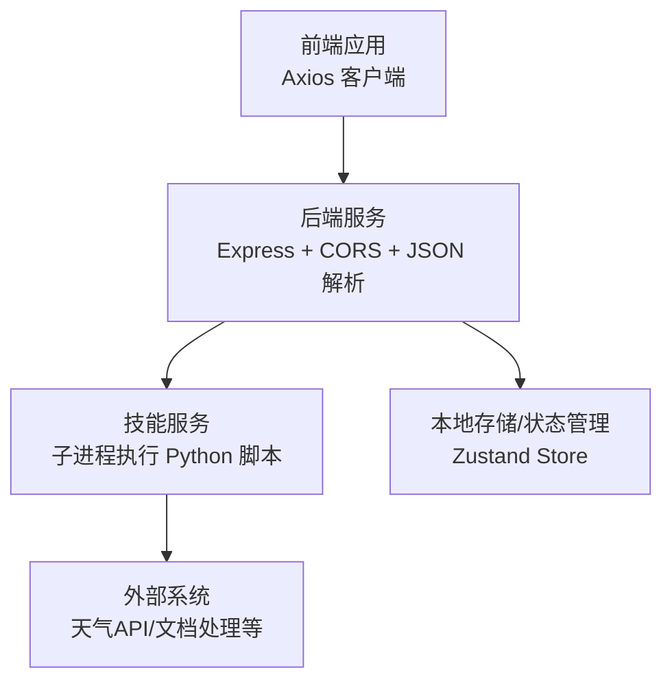
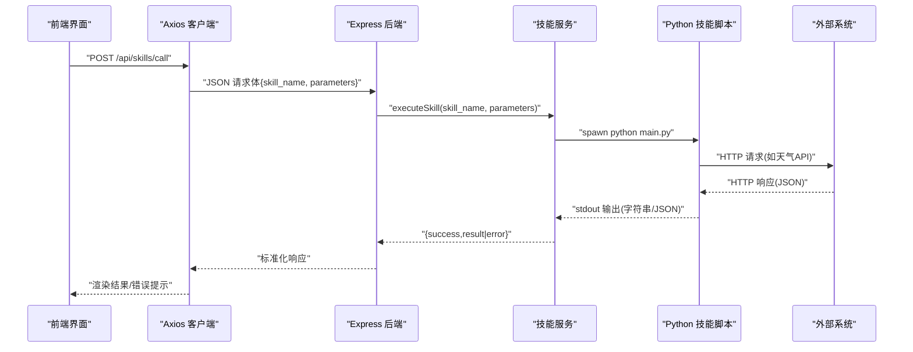
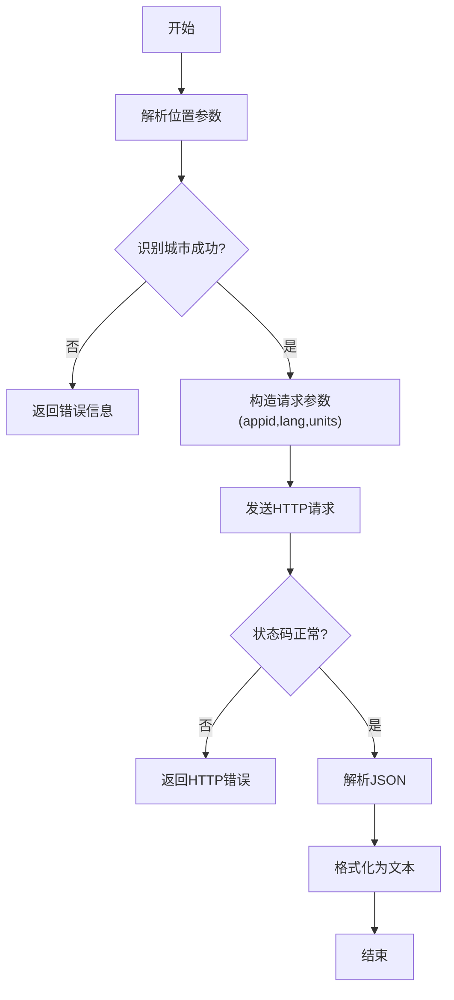
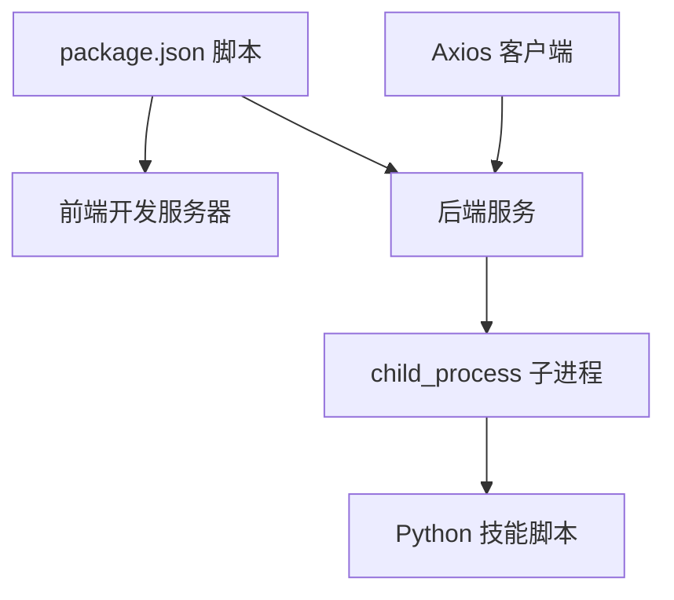

# 第三方集成

<cite>
**本文引用的文件**
- [backend/index.js](file://backend/index.js)
- [backend/services/skillService.js](file://backend/services/skillService.js)
- [src/services/skillService.ts](file://src/services/skillService.ts)
- [skills/weather_query/main.py](file://skills/weather_query/main.py)
- [skills/official-doc-optimize/main.py](file://skills/official-doc-optimize/main.py)
- [src/store/useAppStore.ts](file://src/store/useAppStore.ts)
- [config/agents.json](file://config/agents.json)
- [package.json](file://package.json)
</cite>

## 目录
1. [简介](#简介)
2. [项目结构](#项目结构)
3. [核心组件](#核心组件)
4. [架构总览](#架构总览)
5. [详细组件分析](#详细组件分析)
6. [依赖分析](#依赖分析)
7. [性能考虑](#性能考虑)
8. [故障排查指南](#故障排查指南)
9. [结论](#结论)
10. [附录](#附录)

## 简介
本指南面向需要将外部系统与 AutoMate 平台集成的开发者，围绕“API 接口设计、认证机制、数据交换协议、HTTP 客户端配置、请求处理与响应格式标准化、Webhook 实时同步与事件通知、OAuth 与 API 密钥管理、安全策略、数据映射与格式转换、错误重试与集成测试、监控告警与故障恢复”等方面，提供可操作的集成方案与最佳实践。本文以仓库现有代码为依据，结合前端、后端与技能脚本的实现，给出可落地的集成步骤与注意事项。

## 项目结构
AutoMate 采用前后端分离与“技能脚本”解耦的设计：前端通过 Axios 发起调用，后端 Express 提供统一 API，后端再以子进程方式调用 Python 技能脚本，实现对外部服务的封装与统一输出。

图表来源
- [backend/index.js](file://backend/index.js#L1-L117)
- [src/services/skillService.ts](file://src/services/skillService.ts#L1-L73)
- [backend/services/skillService.js](file://backend/services/skillService.js#L1-L87)

章节来源
- [backend/index.js](file://backend/index.js#L1-L117)
- [src/services/skillService.ts](file://src/services/skillService.ts#L1-L73)
- [backend/services/skillService.js](file://backend/services/skillService.js#L1-L87)
- [package.json](file://package.json#L1-L47)

## 核心组件
- 前端 Axios 客户端：负责向后端发起技能调用请求，并处理超时与网络错误。
- 后端 Express 服务：提供 /api/skills/call 接口，接收技能名与参数，转发给技能服务。
- 技能服务：以子进程方式执行 Python 技能脚本，收集 stdout/stderr，返回统一结构。
- 技能脚本：具体实现对外部系统的调用（如天气 API）、数据清洗与格式化。
- 应用状态：前端使用 Zustand 管理聊天消息、代理与全局状态，便于在 UI 中展示技能执行结果。

章节来源
- [src/services/skillService.ts](file://src/services/skillService.ts#L1-L73)
- [backend/index.js](file://backend/index.js#L81-L104)
- [backend/services/skillService.js](file://backend/services/skillService.js#L16-L86)
- [skills/weather_query/main.py](file://skills/weather_query/main.py#L100-L126)
- [src/store/useAppStore.ts](file://src/store/useAppStore.ts#L17-L33)

## 架构总览
下图展示了从前端到后端再到技能脚本与外部系统的调用链路与数据流。

图表来源
- [src/services/skillService.ts](file://src/services/skillService.ts#L20-L33)
- [backend/index.js](file://backend/index.js#L81-L104)
- [backend/services/skillService.js](file://backend/services/skillService.js#L16-L71)
- [skills/weather_query/main.py](file://skills/weather_query/main.py#L10-L98)

## 详细组件分析

### 1) API 接口设计与数据交换协议
- 接口定义
  - 方法与路径：POST /api/skills/call
  - 请求体字段：
    - skill_name: 必填，技能名称（对应 skills 目录下的子目录）
    - parameters: 可选，传递给技能脚本的参数对象
  - 响应体字段：
    - success: 布尔值，表示执行是否成功
    - result: 字符串或对象（由技能脚本决定），成功时返回
    - error: 字符串，失败时返回错误信息
- 请求处理流程
  - 后端校验 skill_name 是否存在
  - 通过子进程执行对应 Python 脚本
  - 捕获 stdout/stderr，按退出码判断成功/失败
  - 返回统一结构
- 前端调用
  - Axios POST 到 /api/skills/call
  - 自动设置超时时间
  - 对网络错误、超时、后端错误进行分类处理

章节来源
- [backend/index.js](file://backend/index.js#L81-L104)
- [backend/services/skillService.js](file://backend/services/skillService.js#L16-L86)
- [src/services/skillService.ts](file://src/services/skillService.ts#L12-L61)

### 2) 认证机制与安全策略
- 当前实现
  - 后端未内置鉴权中间件，使用 CORS 允许跨域访问
  - 技能脚本内部可能直接硬编码外部 API 的密钥（如天气 API 的 appid）
- 安全建议
  - 在后端增加鉴权中间件（如基于 API Key 或 JWT 的校验）
  - 将敏感配置移出代码仓库，使用环境变量或配置中心
  - 对外部 API 的密钥进行最小权限授权与限额控制
  - 对输入参数进行白名单校验与长度限制，防止注入攻击
  - 对外暴露的接口启用 HTTPS 与速率限制

章节来源
- [backend/index.js](file://backend/index.js#L14-L15)
- [skills/weather_query/main.py](file://skills/weather_query/main.py#L10-L13)

### 3) HTTP 客户端配置与请求处理
- 超时与错误处理
  - 前端 Axios 设置超时时间
  - 对 ECONNABORTED、ERR_NETWORK 等错误进行分类反馈
  - 对后端返回的 error 字段进行兜底显示
- 请求参数传递
  - 前端将 messageId、agentId 等上下文信息透传至后端
  - 后端将 parameters 原样传递给技能脚本

章节来源
- [src/services/skillService.ts](file://src/services/skillService.ts#L4-L30)
- [src/services/skillService.ts](file://src/services/skillService.ts#L34-L60)

### 4) 响应格式标准化
- 统一响应结构
  - success: 布尔值
  - result: 成功时返回字符串或对象
  - error: 失败时返回错误信息
- 技能脚本内部
  - 天气查询技能返回结构化的天气数据，再由脚本格式化为可读文本
  - 文档优化技能返回规范化后的文本

章节来源
- [backend/services/skillService.js](file://backend/services/skillService.js#L10-L14)
- [skills/weather_query/main.py](file://skills/weather_query/main.py#L72-L82)
- [skills/weather_query/main.py](file://skills/weather_query/main.py#L100-L113)
- [skills/official-doc-optimize/main.py](file://skills/official-doc-optimize/main.py#L3-L113)

### 5) Webhook 集成与实时数据同步
- 现状
  - 仓库未提供 Webhook 相关实现
- 建议方案
  - 在后端新增 Webhook 接收端点，校验签名与来源
  - 将事件推送到消息队列或直接触发前端 WebSocket 通知
  - 对重复事件进行幂等处理（去重键：事件 ID/时间戳+内容摘要）

[本节为概念性建议，不直接分析具体文件，故无章节来源]

### 6) OAuth 认证与 API 密钥管理
- OAuth
  - 在后端增加 OAuth 登录流程，颁发短期访问令牌
  - 将令牌与用户会话绑定，限制调用频次与资源范围
- API 密钥
  - 将外部系统密钥集中管理，支持轮换与审计
  - 在技能脚本中通过环境变量注入，避免硬编码

[本节为概念性建议，不直接分析具体文件，故无章节来源]

### 7) 数据映射与格式转换
- 输入映射
  - 前端将用户输入与上下文参数合并后传递给后端
  - 后端将 parameters 传递给技能脚本
- 输出转换
  - 技能脚本内部对原始数据进行清洗与格式化
  - 前端根据 success 与 result 渲染 UI

章节来源
- [src/services/skillService.ts](file://src/services/skillService.ts#L20-L27)
- [backend/services/skillService.js](file://backend/services/skillService.js#L24-L26)
- [skills/weather_query/main.py](file://skills/weather_query/main.py#L100-L113)

### 8) 错误重试机制
- 建议
  - 对外部系统调用失败进行指数退避重试
  - 对网络超时、临时性错误进行自动重试
  - 对不可恢复错误（如参数错误）直接返回并记录日志

[本节为概念性建议，不直接分析具体文件，故无章节来源]

### 9) 集成测试方法
- 单元测试
  - 对技能脚本进行输入输出断言（如天气查询的错误城市返回）
- 接口测试
  - 使用工具对 /api/skills/call 进行冒烟测试与边界测试
- 端到端测试
  - 模拟前端调用，验证 UI 展示与错误提示

章节来源
- [skills/weather_query/main.py](file://skills/weather_query/main.py#L50-L54)
- [skills/weather_query/main.py](file://skills/weather_query/main.py#L83-L97)

### 10) 监控告警与故障恢复
- 监控指标
  - 请求量、成功率、P95 延迟、外部系统可用性
- 告警策略
  - 失败率阈值、超时占比、外部系统错误数
- 故障恢复
  - 降级策略：外部系统不可用时返回缓存或默认值
  - 熔断：连续失败达到阈值后短时间拒绝请求

[本节为概念性建议，不直接分析具体文件，故无章节来源]

### 11) 天气 API 集成示例
- 技能脚本职责
  - 解析城市参数，调用外部天气 API
  - 处理 HTTP 错误与解析异常
  - 格式化为可读文本
- 前端展示
  - 将返回的文本渲染到消息气泡中

图表来源
- [skills/weather_query/main.py](file://skills/weather_query/main.py#L10-L98)

章节来源
- [skills/weather_query/main.py](file://skills/weather_query/main.py#L10-L126)

### 12) 文档处理服务集成示例
- 技能脚本职责
  - 将输入内容优化为政府公文格式
  - 执行词汇替换、句式优化、段落重组与标点规范化
- 前端展示
  - 将优化后的文本作为结果返回

章节来源
- [skills/official-doc-optimize/main.py](file://skills/official-doc-optimize/main.py#L3-L208)

### 13) 代理与技能注册
- 代理配置
  - 代理配置位于 agents.json，包含 URL、API Key、模型等
- 技能注册
  - 每个代理可关联多个技能，技能目录与版本信息在配置中声明

章节来源
- [config/agents.json](file://config/agents.json#L12-L38)
- [config/agents.json](file://config/agents.json#L52-L91)

## 依赖分析
- 前端依赖
  - axios：HTTP 客户端
  - react/react-dom：UI 框架
  - zustand：状态管理
- 后端依赖
  - express：Web 框架
  - cors：跨域支持
  - child_process：子进程执行 Python 脚本
- 运行脚本
  - package.json 提供 dev、backend、start 等脚本，支持前后端联调

图表来源
- [package.json](file://package.json#L6-L13)
- [src/services/skillService.ts](file://src/services/skillService.ts#L1-L3)
- [backend/index.js](file://backend/index.js#L32-L36)

章节来源
- [package.json](file://package.json#L1-L47)

## 性能考虑
- 超时与并发
  - 前端设置合理超时，避免长时间阻塞 UI
  - 后端对子进程执行进行超时控制与退出码检查
- 外部系统限流
  - 对外部 API 进行配额与速率限制，必要时引入缓存
- 内存与资源
  - 子进程 stdout/stderr 流式读取，避免内存溢出
  - 技能脚本内部对大文本进行分段处理与清理

[本节提供一般性指导，不直接分析具体文件，故无章节来源]

## 故障排查指南
- 常见问题
  - 技能执行失败：检查 skill_name 是否正确、脚本路径是否存在、Python 环境是否就绪
  - 网络错误：确认后端服务已启动，前端 Axios 超时设置是否合理
  - 外部 API 错误：检查 appid、请求参数与网络连通性
- 日志定位
  - 后端打印技能执行过程与退出码
  - 技能脚本捕获异常并返回结构化错误

章节来源
- [backend/index.js](file://backend/index.js#L23-L78)
- [backend/services/skillService.js](file://backend/services/skillService.js#L42-L64)
- [skills/weather_query/main.py](file://skills/weather_query/main.py#L83-L97)

## 结论
AutoMate 已具备“前端 → 后端 → 技能脚本 → 外部系统”的清晰调用链路。建议在现有基础上补充鉴权、密钥管理、Webhook、监控告警与故障恢复能力，即可满足企业级第三方系统集成需求。对于具体外部服务（如天气 API、文档处理），可复用当前技能脚本模式进行扩展与标准化。

## 附录
- 关键实现路径参考
  - 技能调用入口：[src/services/skillService.ts](file://src/services/skillService.ts#L12-L33)
  - 后端路由与执行：[backend/index.js](file://backend/index.js#L81-L104)
  - 子进程执行逻辑：[backend/services/skillService.js](file://backend/services/skillService.js#L16-L71)
  - 天气查询技能：[skills/weather_query/main.py](file://skills/weather_query/main.py#L10-L126)
  - 文档优化技能：[skills/official-doc-optimize/main.py](file://skills/official-doc-optimize/main.py#L3-L208)
  - 代理与技能配置：[config/agents.json](file://config/agents.json#L12-L38)