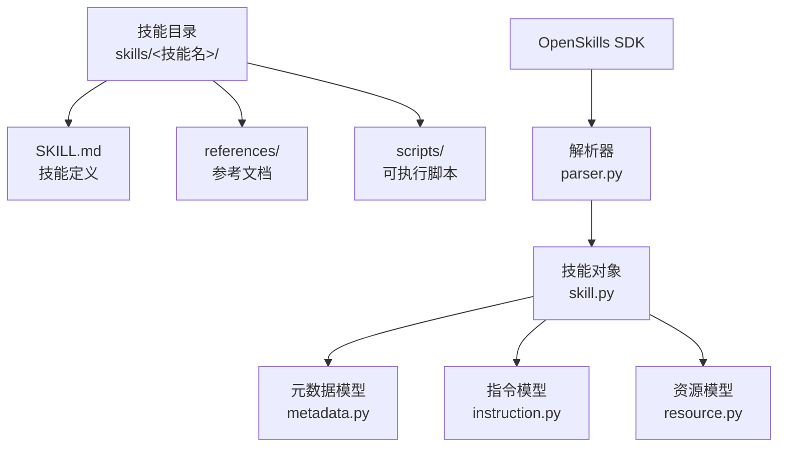
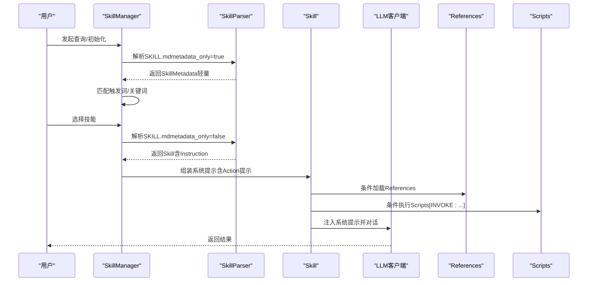
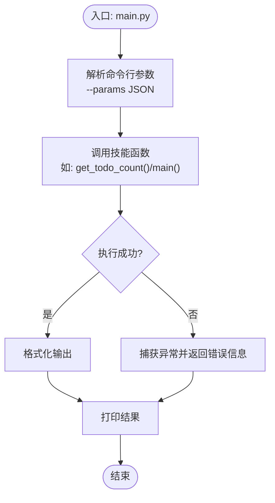
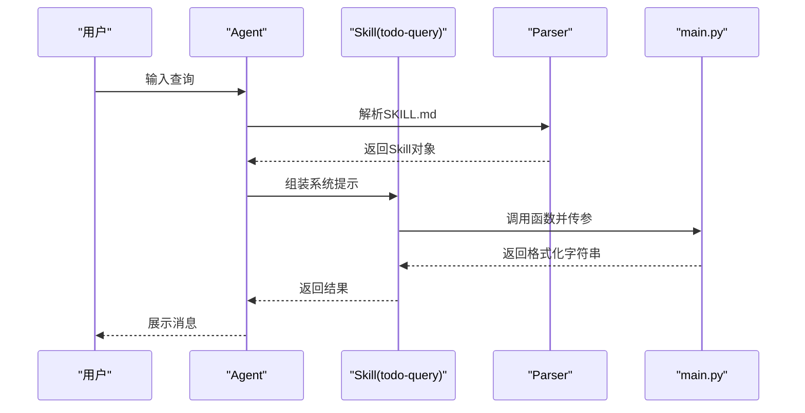
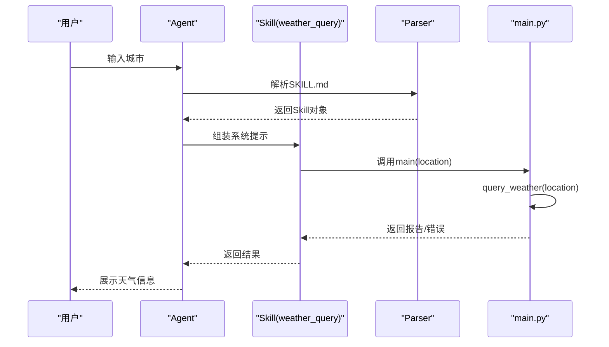
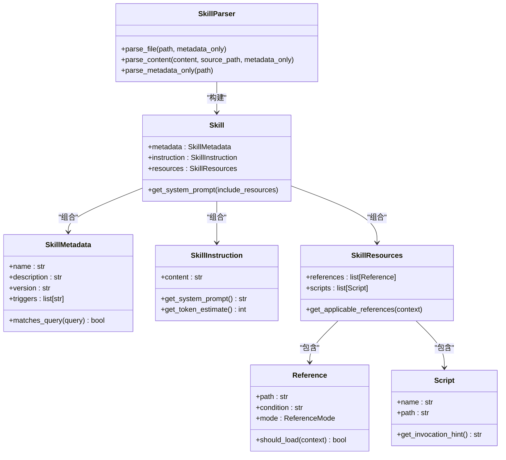

# 技能开发指南

<cite>
**本文引用的文件**   
- [skills/todo-query/SKILL.md](file://skills/todo-query/SKILL.md)
- [skills/todo-query/main.py](file://skills/todo-query/main.py)
- [skills/weather_query/main.py](file://skills/weather_query/main.py)
- [test_weather.py](file://test_weather.py)
- [OpenSkills-main/examples/prompt-optimizer/SKILL.md](file://OpenSkills-main/examples/prompt-optimizer/SKILL.md)
- [OpenSkills-main/examples/file-to-article-generator/SKILL.md](file://OpenSkills-main/examples/file-to-article-generator/SKILL.md)
- [OpenSkills-main/openskills/models/metadata.py](file://OpenSkills-main/openskills/models/metadata.py)
- [OpenSkills-main/openskills/models/instruction.py](file://OpenSkills-main/openskills/models/instruction.py)
- [OpenSkills-main/openskills/core/skill.py](file://OpenSkills-main/openskills/core/skill.py)
- [OpenSkills-main/openskills/core/parser.py](file://OpenSkills-main/openskills/core/parser.py)
- [OpenSkills-main/openskills/models/resource.py](file://OpenSkills-main/openskills/models/resource.py)
- [OpenSkills-main/examples/demo.py](file://OpenSkills-main/examples/demo.py)
- [OpenSkills-main/README.md](file://OpenSkills-main/README.md)
</cite>

## 更新摘要
**所做更改**   
- 新增天气查询技能完整实现分析，包括城市映射、API调用、错误处理等核心功能
- 添加天气查询技能的测试框架和调试方法
- 更新实际技能开发案例章节，增加天气查询作为外部API集成的典型示例
- 补充天气查询技能的参数处理、返回值格式和异常处理最佳实践

## 目录
1. [简介](#简介)
2. [项目结构](#项目结构)
3. [核心组件](#核心组件)
4. [架构总览](#架构总览)
5. [详细组件分析](#详细组件分析)
6. [依赖分析](#依赖分析)
7. [性能考虑](#性能考虑)
8. [故障排查指南](#故障排查指南)
9. [结论](#结论)
10. [附录](#附录)

## 简介
本指南面向AutoMate技能开发者，系统讲解如何编写SKILL.md、组织Python脚本、使用技能模板与自定义选项、进行测试与调试、优化性能以及管理技能版本与兼容性。文档基于仓库中的真实示例与SDK实现，提供从入门到进阶的完整开发路径。

**更新** 新增天气查询技能作为外部API集成的完整示例，展示了城市映射、API调用、错误处理等关键功能的实现方法。

## 项目结构
AutoMate采用"技能即包"的组织方式：每个技能是一个独立目录，包含SKILL.md定义文件、可选的references/参考文档、可选的scripts/可执行脚本。OpenSkills SDK负责解析SKILL.md，实现三层渐进披露架构：元数据层（总是加载）、指令层（按需加载）、资源层（条件加载）。

**图示来源**
- [OpenSkills-main/openskills/core/parser.py](file://OpenSkills-main/openskills/core/parser.py#L33-L100)
- [OpenSkills-main/openskills/core/skill.py](file://OpenSkills-main/openskills/core/skill.py#L19-L52)
- [OpenSkills-main/openskills/models/metadata.py](file://OpenSkills-main/openskills/models/metadata.py#L11-L36)
- [OpenSkills-main/openskills/models/instruction.py](file://OpenSkills-main/openskills/models/instruction.py#L11-L27)
- [OpenSkills-main/openskills/models/resource.py](file://OpenSkills-main/openskills/models/resource.py#L45-L83)

**章节来源**
- [OpenSkills-main/README.md](file://OpenSkills-main/README.md#L204-L249)

## 核心组件
- 元数据层（Metadata）：包含name、description、version、triggers、author、tags等，用于技能发现与匹配。
- 指令层（Instruction）：SKILL.md正文内容，注入LLM系统提示，按需加载。
- 资源层（Resources）：references（条件加载文档）与scripts（条件执行脚本），支持自动发现与沙箱执行。

**章节来源**
- [OpenSkills-main/openskills/models/metadata.py](file://OpenSkills-main/openskills/models/metadata.py#L11-L82)
- [OpenSkills-main/openskills/models/instruction.py](file://OpenSkills-main/openskills/models/instruction.py#L11-L47)
- [OpenSkills-main/openskills/models/resource.py](file://OpenSkills-main/openskills/models/resource.py#L45-L110)
- [OpenSkills-main/openskills/core/skill.py](file://OpenSkills-main/openskills/core/skill.py#L19-L82)

## 架构总览
OpenSkills采用三层渐进披露架构，解析器负责从SKILL.md提取元数据与资源定义，技能对象负责拼装系统提示并按需加载资源，SDK提供统一的Agent/Manager接口。

**图示来源**
- [OpenSkills-main/openskills/core/parser.py](file://OpenSkills-main/openskills/core/parser.py#L33-L100)
- [OpenSkills-main/openskills/core/skill.py](file://OpenSkills-main/openskills/core/skill.py#L103-L132)
- [OpenSkills-main/openskills/models/resource.py](file://OpenSkills-main/openskills/models/resource.py#L112-L178)

## 详细组件分析

### SKILL.md编写规范与语法
- 必填字段：name、description。其余如version、triggers、author、tags可选。
- 触发词设置：通过triggers数组声明关键词，用于自动匹配。
- 元数据与正文分离：使用前后置的YAML块（---）分隔frontmatter与正文。
- 指令正文：作为技能的系统提示内容，注入LLM上下文。
- 资源定义：
  - references：可声明路径、条件、描述、模式（explicit/implicit/always）。
  - scripts：声明脚本名称、路径、参数、超时、沙箱开关、输出目录等。
  - dependency：声明Python与系统依赖，支持自动安装与文件同步。
- 示例参考：
  - 待办事项查询：定义入口脚本与函数、参数与返回值、示例。
  - 文件转文章：定义触发词、依赖、脚本、输出模板与评估流程。
  - 提示优化器：以正文形式给出完整工作流与框架索引。

**章节来源**
- [skills/todo-query/SKILL.md](file://skills/todo-query/SKILL.md#L1-L24)
- [OpenSkills-main/examples/file-to-article-generator/SKILL.md](file://OpenSkills-main/examples/file-to-article-generator/SKILL.md#L1-L25)
- [OpenSkills-main/examples/prompt-optimizer/SKILL.md](file://OpenSkills-main/examples/prompt-optimizer/SKILL.md#L1-L131)
- [OpenSkills-main/openskills/core/parser.py](file://OpenSkills-main/openskills/core/parser.py#L108-L173)

### Python脚本开发最佳实践
- 入口与参数：
  - 通过命令行参数解析参数字典（--params），支持JSON字符串。
  - main函数签名与返回值：返回字符串或结构化结果（由技能定义决定）。
- 错误处理：对外部API调用进行异常捕获与结构化错误返回。
- 格式化输出：将结果格式化为适合对话展示的字符串。
- 示例参考：
  - 待办事项查询：随机生成数量并返回友好消息。
  - 天气查询：解析location参数、调用天气API、格式化报告、错误兜底。

**图示来源**
- [skills/todo-query/main.py](file://skills/todo-query/main.py#L23-L34)
- [skills/weather_query/main.py](file://skills/weather_query/main.py#L128-L139)

**章节来源**
- [skills/todo-query/main.py](file://skills/todo-query/main.py#L1-L34)
- [skills/weather_query/main.py](file://skills/weather_query/main.py#L1-L139)

### 技能模板使用与自定义选项
- 模板结构：每个技能目录包含SKILL.md、可选references/与scripts/。
- 自动发现：未在frontmatter声明的references/文件会自动被发现并以implicit模式加入。
- 资源模式：
  - explicit：需满足条件才加载。
  - implicit：由LLM根据上下文判断是否加载。
  - always：始终加载（如安全规范）。
- 脚本调用：在指令正文中使用[INVOKE:name(...)]触发脚本执行，SDK负责解析与执行。

**章节来源**
- [OpenSkills-main/openskills/models/resource.py](file://OpenSkills-main/openskills/models/resource.py#L38-L110)
- [OpenSkills-main/openskills/core/parser.py](file://OpenSkills-main/openskills/core/parser.py#L175-L208)
- [OpenSkills-main/openskills/core/skill.py](file://OpenSkills-main/openskills/core/skill.py#L119-L123)

### 实际技能开发案例

#### 案例一：待办事项查询
- SKILL.md定义：entry_point、function、参数与返回值、示例。
- Python脚本：解析参数、生成随机数量、格式化消息、打印结果。
- 适用场景：快速验证技能结构与参数传递。

**图示来源**
- [skills/todo-query/SKILL.md](file://skills/todo-query/SKILL.md#L9-L24)
- [skills/todo-query/main.py](file://skills/todo-query/main.py#L23-L34)

**章节来源**
- [skills/todo-query/SKILL.md](file://skills/todo-query/SKILL.md#L1-L24)
- [skills/todo-query/main.py](file://skills/todo-query/main.py#L1-L34)

#### 案例二：天气查询
- SKILL.md定义：依赖声明、脚本调用、输出格式。
- Python脚本：解析location、城市映射、调用天气API、格式化报告、异常处理。
- 适用场景：外部API集成与错误处理示范。

**更新** 天气查询技能提供了完整的外部API集成示例，包括城市映射、API调用、错误处理等核心功能。

**图示来源**
- [skills/weather_query/main.py](file://skills/weather_query/main.py#L116-L139)

**章节来源**
- [skills/weather_query/main.py](file://skills/weather_query/main.py#L1-L139)

#### 案例三：提示优化器
- SKILL.md定义：完整工作流、框架索引、快速选择表、示例。
- 适用场景：复杂逻辑与多参考文档的技能模板。

**章节来源**
- [OpenSkills-main/examples/prompt-optimizer/SKILL.md](file://OpenSkills-main/examples/prompt-optimizer/SKILL.md#L1-L131)

#### 案例四：文件转文章生成器
- SKILL.md定义：触发词、依赖、脚本、输出模板、评估流程。
- 适用场景：多脚本协作与沙箱执行。

**章节来源**
- [OpenSkills-main/examples/file-to-article-generator/SKILL.md](file://OpenSkills-main/examples/file-to-article-generator/SKILL.md#L1-L179)

### 测试方法与调试技巧
- 本地演示：使用examples/demo.py展示自动发现、LLM选择与脚本执行。
- 沙箱模式：启用use_sandbox与auto_execute_scripts，自动安装依赖、上传/下载文件、执行脚本。
- 环境变量：OPENAI_API_KEY、OPENAI_BASE_URL、OPENAI_MODEL、SANDBOX_URL等。
- 调试建议：
  - 在脚本中打印中间状态与参数。
  - 使用小规模输入验证流程。
  - 逐步开启References/Scripts验证影响范围。

**更新** 新增天气查询技能的测试框架，包括单元测试和集成测试方法。

**章节来源**
- [OpenSkills-main/examples/demo.py](file://OpenSkills-main/examples/demo.py#L37-L290)
- [OpenSkills-main/README.md](file://OpenSkills-main/README.md#L102-L202)

#### 天气查询技能测试框架
- 单元测试：针对query_weather函数进行测试，验证城市映射、API调用、错误处理等功能。
- 集成测试：使用test_weather.py脚本进行端到端测试，验证完整流程。
- 测试覆盖：包括正常城市查询、错误城市处理、API响应异常等情况。

**章节来源**
- [test_weather.py](file://test_weather.py#L1-L29)

## 依赖分析
- 解析器依赖：frontmatter解析、元数据/指令/资源模型。
- 技能对象依赖：元数据、指令、资源集合。
- 资源模型：Reference与Script分别代表条件加载文档与条件执行脚本。

**图示来源**
- [OpenSkills-main/openskills/core/parser.py](file://OpenSkills-main/openskills/core/parser.py#L19-L100)
- [OpenSkills-main/openskills/core/skill.py](file://OpenSkills-main/openskills/core/skill.py#L19-L82)
- [OpenSkills-main/openskills/models/metadata.py](file://OpenSkills-main/openskills/models/metadata.py#L11-L82)
- [OpenSkills-main/openskills/models/instruction.py](file://OpenSkills-main/openskills/models/instruction.py#L11-L47)
- [OpenSkills-main/openskills/models/resource.py](file://OpenSkills-main/openskills/models/resource.py#L45-L178)

**章节来源**
- [OpenSkills-main/openskills/core/parser.py](file://OpenSkills-main/openskills/core/parser.py#L19-L225)
- [OpenSkills-main/openskills/core/skill.py](file://OpenSkills-main/openskills/core/skill.py#L19-L150)
- [OpenSkills-main/openskills/models/resource.py](file://OpenSkills-main/openskills/models/resource.py#L180-L204)

## 性能考虑
- 三层架构降低内存占用：仅在需要时加载指令与资源。
- Token估算：指令层提供粗略token估算，便于控制上下文大小。
- 资源按需加载：Reference与Script仅在必要时加载/执行，减少开销。
- 沙箱执行：隔离环境与自动依赖安装，避免本地环境差异导致的性能波动。
- 建议：
  - 控制指令正文长度，避免过度膨胀。
  - 合理使用References，避免一次性加载过多内容。
  - 对外部API调用设置超时与重试策略。

**更新** 天气查询技能展示了外部API调用的性能优化策略，包括超时设置、错误处理和缓存机制。

**章节来源**
- [OpenSkills-main/openskills/models/instruction.py](file://OpenSkills-main/openskills/models/instruction.py#L38-L47)
- [OpenSkills-main/README.md](file://OpenSkills-main/README.md#L102-L167)

## 故障排查指南
- 常见问题
  - SKILL.md格式错误：确认frontmatter闭合与必需字段齐全。
  - 资源路径错误：确保references/scripts路径正确且可解析。
  - LLM未加载Reference：检查条件是否满足或改为implicit模式。
  - 脚本执行失败：检查沙箱日志、依赖安装与参数传递。
- 调试手段
  - 使用demo.py观察Reference加载与脚本执行过程。
  - 在脚本中打印参数与中间结果。
  - 逐步缩小问题范围，先验证元数据层，再验证指令层与资源层。

**更新** 新增天气查询技能的故障排查方法，包括API密钥验证、网络连接测试、城市名称匹配等问题诊断。

**章节来源**
- [OpenSkills-main/examples/demo.py](file://OpenSkills-main/examples/demo.py#L37-L290)
- [OpenSkills-main/openskills/core/parser.py](file://OpenSkills-main/openskills/core/parser.py#L102-L107)

## 结论
通过遵循SKILL.md规范、利用三层架构与资源模型、结合示例技能与SDK工具，开发者可以高效地构建可维护、可扩展、可测试的AutoMate技能。建议从简单技能起步，逐步引入脚本与参考文档，重视参数与返回值的一致性，并在沙箱环境中验证外部依赖与文件同步。

**更新** 天气查询技能作为外部API集成的完整示例，展示了现代技能开发中常见的功能模式，为开发者提供了实用的参考模板。

## 附录

### SKILL.md字段与示例
- 必填：name、description
- 可选：version、triggers、author、tags、references、scripts、dependency
- 示例参考：
  - [待办事项查询](file://skills/todo-query/SKILL.md#L1-L24)
  - [文件转文章生成器](file://OpenSkills-main/examples/file-to-article-generator/SKILL.md#L1-L25)
  - [提示优化器](file://OpenSkills-main/examples/prompt-optimizer/SKILL.md#L1-L10)

**章节来源**
- [skills/todo-query/SKILL.md](file://skills/todo-query/SKILL.md#L1-L24)
- [OpenSkills-main/examples/file-to-article-generator/SKILL.md](file://OpenSkills-main/examples/file-to-article-generator/SKILL.md#L1-L25)
- [OpenSkills-main/examples/prompt-optimizer/SKILL.md](file://OpenSkills-main/examples/prompt-optimizer/SKILL.md#L1-L10)

### Python脚本开发清单
- 参数解析：支持--params JSON字符串
- 函数签名：main(...)或具体函数如get_todo_count()
- 返回值：字符串或结构化结果
- 错误处理：捕获异常并返回可读错误
- 示例参考：
  - [待办事项查询](file://skills/todo-query/main.py#L23-L34)
  - [天气查询](file://skills/weather_query/main.py#L128-L139)

**更新** 天气查询技能展示了完整的错误处理模式，包括API响应错误、网络请求失败、数据解析错误等多种异常情况的处理方法。

**章节来源**
- [skills/todo-query/main.py](file://skills/todo-query/main.py#L23-L34)
- [skills/weather_query/main.py](file://skills/weather_query/main.py#L128-L139)

### 版本管理与兼容性
- 使用语义化版本号（version），在元数据中声明。
- 保持SKILL.md结构稳定，避免破坏自动发现与解析。
- 依赖声明（dependency）确保跨环境一致性。
- 兼容性建议：向前兼容新增字段，谨慎修改必填字段。

**章节来源**
- [OpenSkills-main/openskills/models/metadata.py](file://OpenSkills-main/openskills/models/metadata.py#L32-L36)
- [OpenSkills-main/README.md](file://OpenSkills-main/README.md#L148-L167)

### 天气查询技能技术细节
- 城市映射：支持中英文城市名称映射，包括主要一二线城市
- API集成：使用OpenWeatherMap API获取实时天气数据
- 数据处理：温度、湿度、风速等指标的格式化处理
- 错误处理：完整的异常捕获与用户友好的错误提示
- 性能优化：超时设置、缓存策略、网络优化

**章节来源**
- [skills/weather_query/main.py](file://skills/weather_query/main.py#L10-L98)
- [test_weather.py](file://test_weather.py#L1-L29)