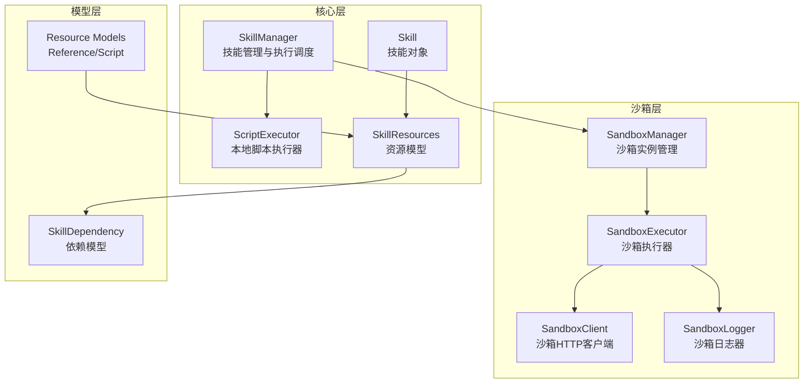
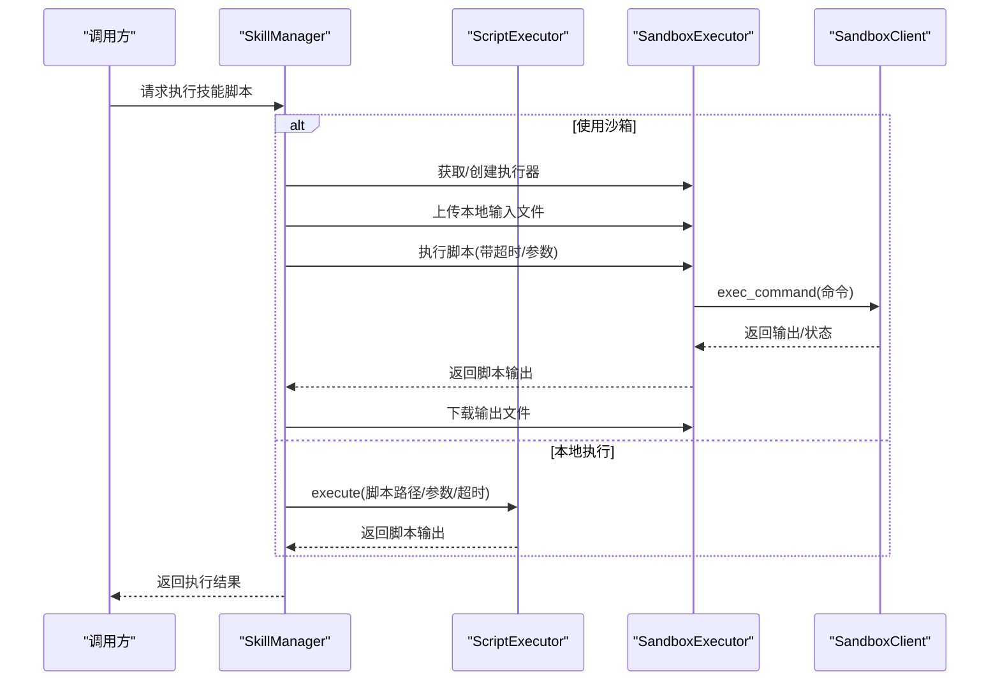
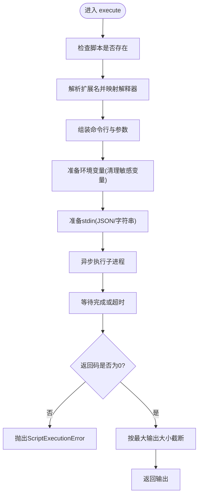
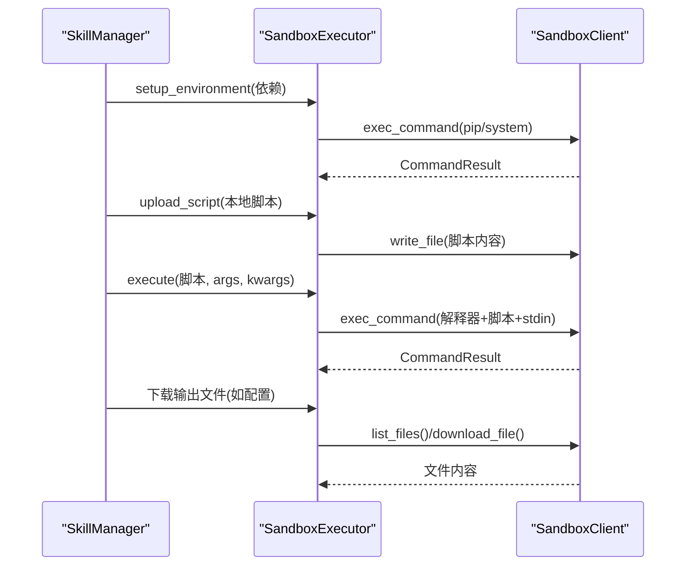
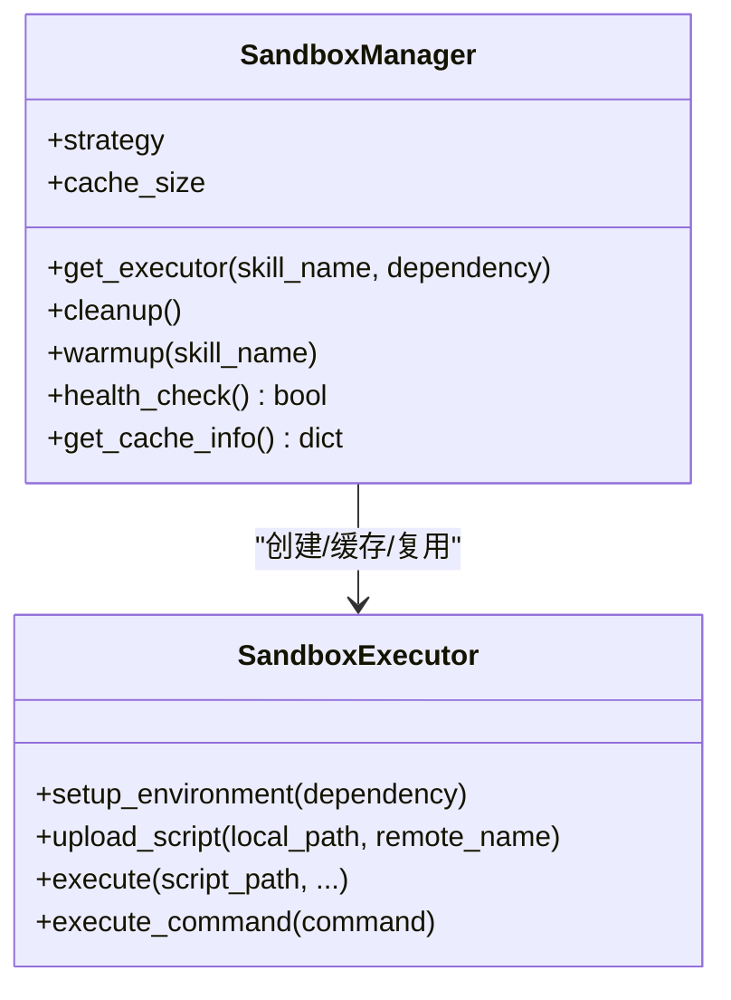
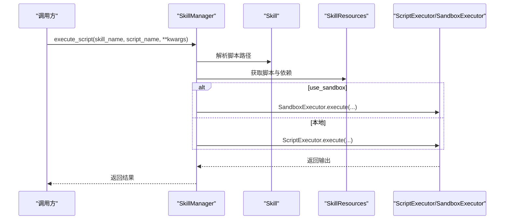
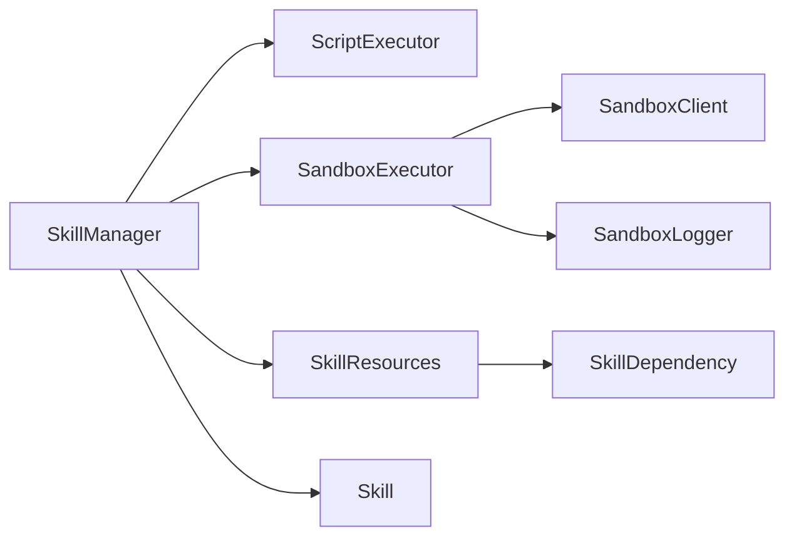

# 技能执行引擎

<cite>
**本文引用的文件**
- [OpenSkills-main/openskills/core/executor.py](file://OpenSkills-main/openskills/core/executor.py)
- [OpenSkills-main/openskills/core/manager.py](file://OpenSkills-main/openskills/core/manager.py)
- [OpenSkills-main/openskills/core/skill.py](file://OpenSkills-main/openskills/core/skill.py)
- [OpenSkills-main/openskills/models/resource.py](file://OpenSkills-main/openskills/models/resource.py)
- [OpenSkills-main/openskills/models/dependency.py](file://OpenSkills-main/openskills/models/dependency.py)
- [OpenSkills-main/openskills/sandbox/client.py](file://OpenSkills-main/openskills/sandbox/client.py)
- [OpenSkills-main/openskills/sandbox/executor.py](file://OpenSkills-main/openskills/sandbox/executor.py)
- [OpenSkills-main/openskills/sandbox/manager.py](file://OpenSkills-main/openskills/sandbox/manager.py)
- [OpenSkills-main/openskills/sandbox/logger.py](file://OpenSkills-main/openskills/sandbox/logger.py)
- [OpenSkills-main/tests/test_sandbox.py](file://OpenSkills-main/tests/test_sandbox.py)
- [OpenSkills-main/examples/demo.py](file://OpenSkills-main/examples/demo.py)
</cite>

## 目录
1. [简介](#简介)
2. [项目结构](#项目结构)
3. [核心组件](#核心组件)
4. [架构总览](#架构总览)
5. [详细组件分析](#详细组件分析)
6. [依赖关系分析](#依赖关系分析)
7. [性能考虑](#性能考虑)
8. [故障排除指南](#故障排除指南)
9. [结论](#结论)
10. [附录](#附录)

## 简介
本文件面向AutoMate技能执行引擎，聚焦以下目标：
- 深入解释技能执行器(SkillExecutor)的工作原理，包括Python脚本执行、参数传递和结果处理机制
- 详细说明沙箱客户端和管理器的安全隔离机制，包括进程管理、资源限制和权限控制
- 阐述技能执行的异步处理、超时控制和错误恢复策略
- 包含执行上下文管理、日志记录和性能监控实现
- 提供技能执行的调试工具、故障排除方法和性能优化建议

## 项目结构
OpenSkills子项目提供了完整的技能生命周期管理与执行能力，核心由三层组成：
- 核心层：技能解析、匹配、执行调度
- 沙箱层：HTTP API封装、执行器、管理器、日志器
- 模型层：资源与依赖定义

图表来源
- [OpenSkills-main/openskills/core/manager.py](file://OpenSkills-main/openskills/core/manager.py#L24-L100)
- [OpenSkills-main/openskills/core/executor.py](file://OpenSkills-main/openskills/core/executor.py#L24-L60)
- [OpenSkills-main/openskills/core/skill.py](file://OpenSkills-main/openskills/core/skill.py#L19-L56)
- [OpenSkills-main/openskills/models/resource.py](file://OpenSkills-main/openskills/models/resource.py#L180-L204)
- [OpenSkills-main/openskills/models/dependency.py](file://OpenSkills-main/openskills/models/dependency.py#L13-L44)
- [OpenSkills-main/openskills/sandbox/manager.py](file://OpenSkills-main/openskills/sandbox/manager.py#L30-L78)
- [OpenSkills-main/openskills/sandbox/executor.py](file://OpenSkills-main/openskills/sandbox/executor.py#L22-L72)
- [OpenSkills-main/openskills/sandbox/client.py](file://OpenSkills-main/openskills/sandbox/client.py#L119-L158)
- [OpenSkills-main/openskills/sandbox/logger.py](file://OpenSkills-main/openskills/sandbox/logger.py#L14-L53)

章节来源
- [OpenSkills-main/openskills/core/manager.py](file://OpenSkills-main/openskills/core/manager.py#L24-L100)
- [OpenSkills-main/openskills/sandbox/manager.py](file://OpenSkills-main/openskills/sandbox/manager.py#L30-L78)

## 核心组件
- ScriptExecutor：本地脚本执行器，支持Python/Shell/JS等，具备超时、输出截断、环境隔离（敏感变量清理）等能力
- SandboxExecutor：沙箱执行器，负责依赖安装、文件上传/下载、脚本执行与输出捕获
- SandboxManager：沙箱实例生命周期管理，支持按次执行、按技能缓存、持久化三种策略
- SandboxClient：AIO Sandbox HTTP API封装，提供健康检查、命令执行、文件操作、代码执行等
- SkillManager：技能管理入口，负责发现、注册、匹配、按需加载指令与资源，并统一调度本地或沙箱执行
- 模型层：Skill、SkillResources、Reference、Script、SkillDependency等

章节来源
- [OpenSkills-main/openskills/core/executor.py](file://OpenSkills-main/openskills/core/executor.py#L24-L60)
- [OpenSkills-main/openskills/sandbox/executor.py](file://OpenSkills-main/openskills/sandbox/executor.py#L22-L72)
- [OpenSkills-main/openskills/sandbox/manager.py](file://OpenSkills-main/openskills/sandbox/manager.py#L30-L78)
- [OpenSkills-main/openskills/sandbox/client.py](file://OpenSkills-main/openskills/sandbox/client.py#L119-L158)
- [OpenSkills-main/openskills/core/manager.py](file://OpenSkills-main/openskills/core/manager.py#L24-L100)
- [OpenSkills-main/openskills/models/resource.py](file://OpenSkills-main/openskills/models/resource.py#L180-L204)
- [OpenSkills-main/openskills/models/dependency.py](file://OpenSkills-main/openskills/models/dependency.py#L13-L44)

## 架构总览
技能执行流程分为“本地执行”和“沙箱执行”两条路径，均由SkillManager统一调度。

图表来源
- [OpenSkills-main/openskills/core/manager.py](file://OpenSkills-main/openskills/core/manager.py#L265-L361)
- [OpenSkills-main/openskills/core/executor.py](file://OpenSkills-main/openskills/core/executor.py#L61-L125)
- [OpenSkills-main/openskills/sandbox/executor.py](file://OpenSkills-main/openskills/sandbox/executor.py#L255-L355)
- [OpenSkills-main/openskills/sandbox/client.py](file://OpenSkills-main/openskills/sandbox/client.py#L264-L325)

## 详细组件分析

### ScriptExecutor（本地脚本执行器）
- 功能要点
  - 支持脚本类型：Python、Shell、Bash、Node、TS
  - 异步执行：基于asyncio与子进程，支持超时控制
  - 参数传递：支持args与kwargs（JSON序列化后经stdin传入）
  - 输出处理：捕获stdout/stderr，超过最大输出大小进行截断
  - 环境隔离：移除敏感环境变量，标记沙箱标识
  - 同步包装：提供同步execute_sync便于非异步场景
  - 脚本校验：检查文件存在、扩展名支持、Python语法
- 关键流程
  - 解析扩展名与解释器映射
  - 组装命令行与环境变量
  - 异步等待子进程完成或超时
  - 处理非零退出码并抛出ScriptExecutionError
- 错误与异常
  - ScriptExecutionError：包含returncode与stderr
  - FileNotFoundError：脚本不存在
  - ValueError：不支持的脚本类型
  - 超时：抛出ScriptExecutionError并返回超时信息

图表来源
- [OpenSkills-main/openskills/core/executor.py](file://OpenSkills-main/openskills/core/executor.py#L61-L159)

章节来源
- [OpenSkills-main/openskills/core/executor.py](file://OpenSkills-main/openskills/core/executor.py#L24-L251)

### SandboxExecutor（沙箱执行器）
- 功能要点
  - 生命周期：异步上下文管理，初始化时创建工作区目录
  - 依赖安装：pip安装与系统命令执行，支持可选pip升级
  - 文件同步：上传单个/目录文件；执行后下载指定输出路径
  - 脚本执行：上传脚本至沙箱，构造命令并通过exec_command执行
  - 日志：SandboxLogger提供可视化进度与状态
- 关键流程
  - setup_environment：生成pip安装命令并执行；执行系统命令
  - upload_script：读取本地脚本内容，写入沙箱并设置权限
  - execute：构建命令（含stdin数据），调用exec_command，记录成功/失败
  - _upload_local_files/_download_sandbox_files：递归扫描并同步文件
- 错误与异常
  - SandboxExecutionError：来自SandboxClient的命令执行失败
  - FileNotFoundError：本地文件不存在
  - ValueError：不支持的脚本类型

图表来源
- [OpenSkills-main/openskills/sandbox/executor.py](file://OpenSkills-main/openskills/sandbox/executor.py#L123-L171)
- [OpenSkills-main/openskills/sandbox/executor.py](file://OpenSkills-main/openskills/sandbox/executor.py#L185-L254)
- [OpenSkills-main/openskills/sandbox/executor.py](file://OpenSkills-main/openskills/sandbox/executor.py#L255-L355)
- [OpenSkills-main/openskills/sandbox/client.py](file://OpenSkills-main/openskills/sandbox/client.py#L264-L325)
- [OpenSkills-main/openskills/sandbox/client.py](file://OpenSkills-main/openskills/sandbox/client.py#L487-L567)
- [OpenSkills-main/openskills/sandbox/client.py](file://OpenSkills-main/openskills/sandbox/client.py#L699-L713)

章节来源
- [OpenSkills-main/openskills/sandbox/executor.py](file://OpenSkills-main/openskills/sandbox/executor.py#L22-L355)

### SandboxManager（沙箱管理器）
- 功能要点
  - 实例策略：每执行一次新建、按技能缓存、持久化共享
  - 并发安全：使用锁保护缓存与清理
  - 缓存淘汰：LRU策略，超出容量时清理最旧实例
  - 预热：提前初始化以展示环境准备过程
  - 健康检查：临时创建执行器进行连通性检测
- 关键流程
  - get_executor：根据策略返回或创建执行器
  - cleanup：关闭所有缓存与持久化实例
  - warmup：提前初始化
  - health_check：静默健康检查

图表来源
- [OpenSkills-main/openskills/sandbox/manager.py](file://OpenSkills-main/openskills/sandbox/manager.py#L30-L237)
- [OpenSkills-main/openskills/sandbox/executor.py](file://OpenSkills-main/openskills/sandbox/executor.py#L22-L108)

章节来源
- [OpenSkills-main/openskills/sandbox/manager.py](file://OpenSkills-main/openskills/sandbox/manager.py#L30-L237)

### SandboxClient（沙箱HTTP客户端）
- 功能要点
  - 健康检查：快速超时检测沙箱可达性
  - 信息获取：获取沙箱版本、OS、可用工具、运行时信息
  - Shell：执行命令、会话管理、终端WebSocket URL
  - 文件：读写、列出、查找、搜索、上传、下载
  - 代码：直接执行Python/JavaScript代码
  - 包管理：pip/npm等（在对应API下）
- 错误与异常
  - SandboxConnectionError：连接失败
  - SandboxExecutionError：执行失败，携带exit_code与stderr

章节来源
- [OpenSkills-main/openskills/sandbox/client.py](file://OpenSkills-main/openskills/sandbox/client.py#L119-L986)

### SkillManager（技能管理器）
- 功能要点
  - 发现与注册：扫描目录，仅加载元数据（Layer 1）
  - 指令与资源：按需加载指令（Layer 2）与引用（Layer 3）
  - 执行调度：根据use_sandbox选择本地或沙箱执行
  - 文件同步：在沙箱执行前上传输入文件，在执行后下载输出文件
  - 匹配：基于查询匹配技能
- 关键流程
  - execute_script：解析脚本路径，决定执行方式，调用对应执行器
  - _execute_in_sandbox：获取执行器、上传输入、执行脚本、下载输出
  - _upload_local_files/_download_sandbox_files：递归处理文件路径

图表来源
- [OpenSkills-main/openskills/core/manager.py](file://OpenSkills-main/openskills/core/manager.py#L265-L361)
- [OpenSkills-main/openskills/models/resource.py](file://OpenSkills-main/openskills/models/resource.py#L112-L178)

章节来源
- [OpenSkills-main/openskills/core/manager.py](file://OpenSkills-main/openskills/core/manager.py#L24-L523)

### 模型与资源
- Skill：技能对象，包含元数据、指令、资源
- SkillResources：引用与脚本集合，以及依赖
- Reference：条件加载的文档，支持显式/隐式/总是三种模式
- Script：可执行脚本，支持超时、沙箱开关、输出同步路径
- SkillDependency：依赖声明，支持Python包与系统命令

章节来源
- [OpenSkills-main/openskills/core/skill.py](file://OpenSkills-main/openskills/core/skill.py#L19-L150)
- [OpenSkills-main/openskills/models/resource.py](file://OpenSkills-main/openskills/models/resource.py#L180-L204)
- [OpenSkills-main/openskills/models/dependency.py](file://OpenSkills-main/openskills/models/dependency.py#L13-L87)

## 依赖关系分析
- 组件耦合
  - SkillManager依赖ScriptExecutor与SandboxManager/SandboxExecutor
  - SandboxExecutor依赖SandboxClient与SandboxLogger
  - SkillResources与SkillDependency为数据模型，被SkillManager与SandboxExecutor使用
- 外部依赖
  - httpx（异步HTTP）
  - rich（日志输出）
  - asyncio/subprocess（异步与子进程）
  - pydantic（模型校验）

图表来源
- [OpenSkills-main/openskills/core/manager.py](file://OpenSkills-main/openskills/core/manager.py#L18-L70)
- [OpenSkills-main/openskills/sandbox/executor.py](file://OpenSkills-main/openskills/sandbox/executor.py#L13-L20)
- [OpenSkills-main/openskills/models/resource.py](file://OpenSkills-main/openskills/models/resource.py#L180-L204)
- [OpenSkills-main/openskills/models/dependency.py](file://OpenSkills-main/openskills/models/dependency.py#L13-L44)

章节来源
- [OpenSkills-main/openskills/core/manager.py](file://OpenSkills-main/openskills/core/manager.py#L18-L70)
- [OpenSkills-main/openskills/sandbox/executor.py](file://OpenSkills-main/openskills/sandbox/executor.py#L13-L20)

## 性能考虑
- 超时与并发
  - ScriptExecutor与SandboxExecutor均支持超时，避免长时间阻塞
  - SandboxManager提供多种实例策略，平衡安全性与性能
- I/O与网络
  - 文件上传/下载采用流式写入，避免大文件内存占用
  - SandboxClient使用异步HTTP，提升并发吞吐
- 输出与日志
  - ScriptExecutor对输出进行截断，防止过大响应
  - SandboxLogger提供可视化进度，便于定位瓶颈
- 依赖安装
  - SandboxExecutor按需安装依赖，避免重复安装
  - 支持pip升级以减少兼容问题

[本节为通用性能建议，无需特定文件引用]

## 故障排除指南
- 常见错误与定位
  - ScriptExecutionError：检查脚本返回码与stderr，确认参数与环境
  - SandboxConnectionError：检查沙箱服务可达性与URL配置
  - SandboxExecutionError：查看exit_code与stderr，确认命令与权限
  - FileNotFoundError：确认脚本路径与文件存在
  - ValueError：确认脚本扩展名受支持
- 调试步骤
  - 启用SandboxLogger可视化输出，观察初始化与执行阶段
  - 在沙箱模式下，先执行health_check确认连通性
  - 使用SandboxManager.warmup提前暴露初始化问题
  - 对于文件同步问题，检查输入/输出路径与权限
- 单元测试参考
  - 依赖模型与命令结果的正确性
  - SandboxClient上下文管理与健康检查
  - SandboxExecutor环境搭建与命令执行
  - SandboxManager策略缓存与清理

章节来源
- [OpenSkills-main/openskills/core/executor.py](file://OpenSkills-main/openskills/core/executor.py#L16-L22)
- [OpenSkills-main/openskills/sandbox/client.py](file://OpenSkills-main/openskills/sandbox/client.py#L104-L117)
- [OpenSkills-main/openskills/sandbox/manager.py](file://OpenSkills-main/openskills/sandbox/manager.py#L208-L227)
- [OpenSkills-main/tests/test_sandbox.py](file://OpenSkills-main/tests/test_sandbox.py#L115-L192)
- [OpenSkills-main/tests/test_sandbox.py](file://OpenSkills-main/tests/test_sandbox.py#L193-L236)
- [OpenSkills-main/tests/test_sandbox.py](file://OpenSkills-main/tests/test_sandbox.py#L238-L297)

## 结论
AutoMate技能执行引擎通过SkillManager统一调度，结合ScriptExecutor与SandboxExecutor实现灵活的本地与沙箱执行模式。沙箱层提供HTTP API封装、实例管理与日志输出，配合严格的依赖安装与文件同步机制，保障执行的安全性与可维护性。通过超时控制、输出截断与可视化日志，系统在复杂任务场景下仍保持稳定与可观测性。

[本节为总结性内容，无需特定文件引用]

## 附录
- 示例与演示
  - 示例脚本演示了沙箱模式下的技能执行与LLM集成
- 最佳实践
  - 优先使用沙箱执行以获得更强隔离
  - 合理设置脚本超时与输出大小阈值
  - 使用SandboxManager的PER_SKILL策略在安全与性能间取得平衡
  - 在执行前进行health_check与warmup

章节来源
- [OpenSkills-main/examples/demo.py](file://OpenSkills-main/examples/demo.py#L1-L290)