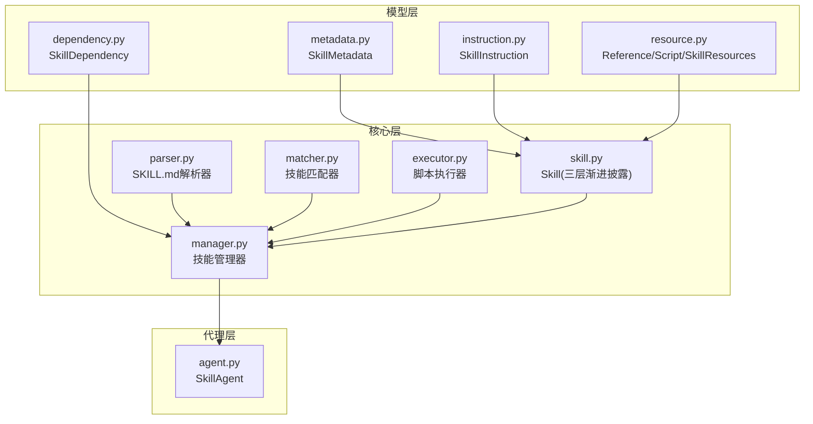
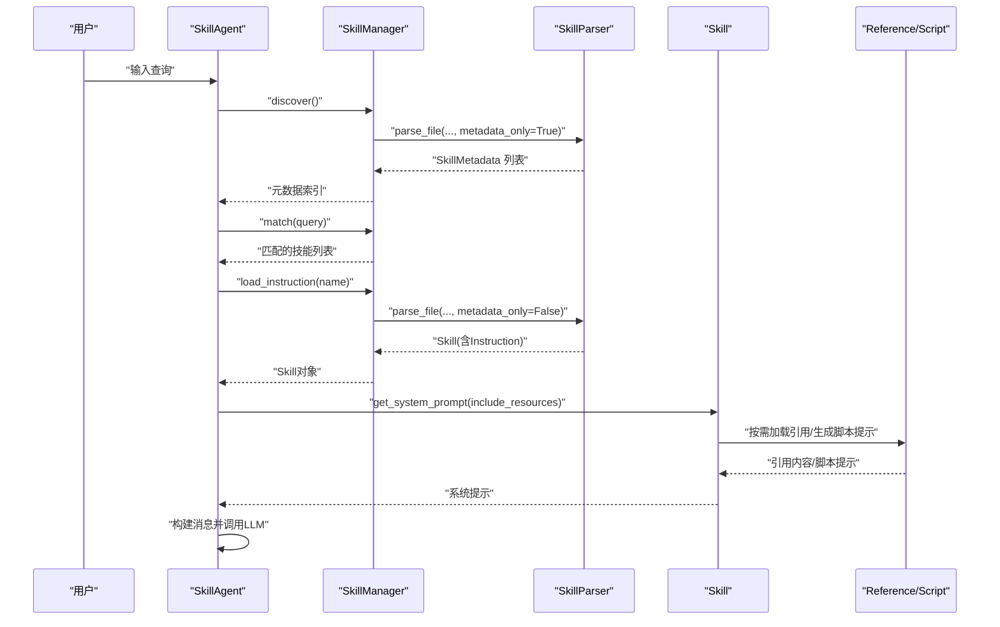
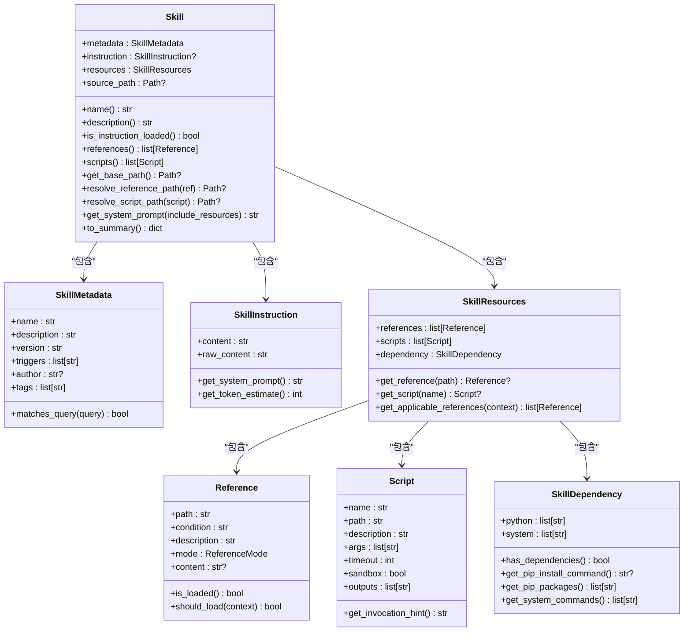
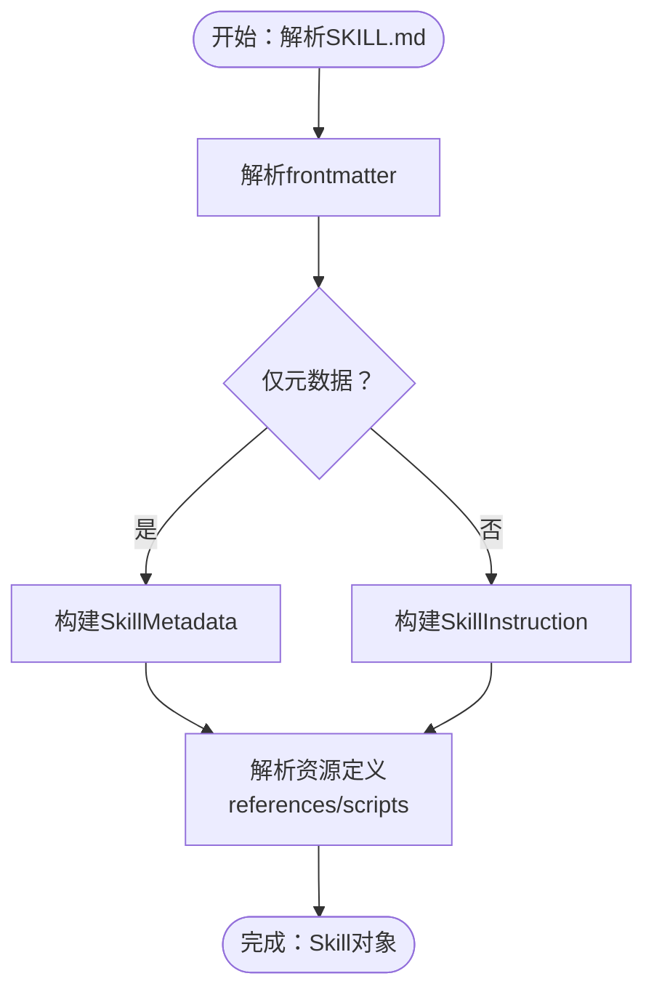
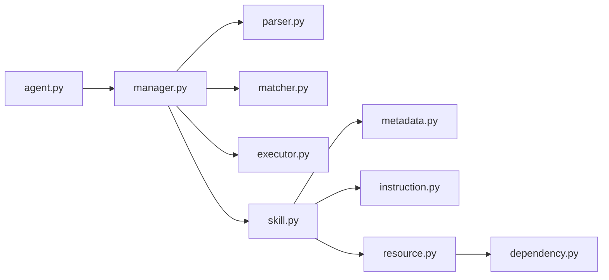

# 技能框架核心

<cite>
**本文引用的文件**
- [openskills/core/skill.py](file://OpenSkills-main/openskills/core/skill.py)
- [openskills/models/metadata.py](file://OpenSkills-main/openskills/models/metadata.py)
- [openskills/models/instruction.py](file://OpenSkills-main/openskills/models/instruction.py)
- [openskills/models/resource.py](file://OpenSkills-main/openskills/models/resource.py)
- [openskills/core/manager.py](file://OpenSkills-main/openskills/core/manager.py)
- [openskills/core/parser.py](file://OpenSkills-main/openskills/core/parser.py)
- [openskills/models/dependency.py](file://OpenSkills-main/openskills/models/dependency.py)
- [openskills/core/executor.py](file://OpenSkills-main/openskills/core/executor.py)
- [openskills/core/matcher.py](file://OpenSkills-main/openskills/core/matcher.py)
- [openskills/agent.py](file://OpenSkills-main/openskills/agent.py)
- [openskills/__init__.py](file://OpenSkills-main/openskills/__init__.py)
- [pyproject.toml](file://OpenSkills-main/pyproject.toml)
- [examples/demo.py](file://OpenSkills-main/examples/demo.py)
- [examples/prompt-optimizer/SKILL.md](file://OpenSkills-main/examples/prompt-optimizer/SKILL.md)
</cite>

## 目录
1. [简介](#简介)
2. [项目结构](#项目结构)
3. [核心组件](#核心组件)
4. [架构总览](#架构总览)
5. [详细组件分析](#详细组件分析)
6. [依赖分析](#依赖分析)
7. [性能考虑](#性能考虑)
8. [故障排查指南](#故障排查指南)
9. [结论](#结论)
10. [附录](#附录)

## 简介
本文件为AutoMate技能框架核心的技术文档，聚焦于Skill类的三层渐进披露设计模式，系统阐述元数据层(Layer 1)、指令层(Layer 2)与资源层(Layer 3)的加载机制；详解SkillMetadata、SkillInstruction、SkillResources及其子模型的数据结构与字段定义；说明技能对象的属性访问、路径解析与系统提示生成；覆盖技能摘要生成、引用内容按需加载与脚本调用提示的实现细节，并给出框架初始化流程、内存管理与性能优化策略。

## 项目结构
OpenSkills位于OpenSkills-main目录下，核心代码集中在openskills包内，采用“模型-核心-执行-代理”分层组织：
- 模型层：metadata、instruction、resource、dependency
- 核心层：skill、parser、manager、matcher、executor
- 代理层：agent
- 示例与CLI：examples、pyproject.toml

图表来源
- [openskills/core/skill.py](file://OpenSkills-main/openskills/core/skill.py#L1-L150)
- [openskills/models/metadata.py](file://OpenSkills-main/openskills/models/metadata.py#L1-L83)
- [openskills/models/instruction.py](file://OpenSkills-main/openskills/models/instruction.py#L1-L48)
- [openskills/models/resource.py](file://OpenSkills-main/openskills/models/resource.py#L1-L204)
- [openskills/models/dependency.py](file://OpenSkills-main/openskills/models/dependency.py#L1-L87)
- [openskills/core/parser.py](file://OpenSkills-main/openskills/core/parser.py#L1-L225)
- [openskills/core/manager.py](file://OpenSkills-main/openskills/core/manager.py#L1-L523)
- [openskills/core/matcher.py](file://OpenSkills-main/openskills/core/matcher.py#L1-L221)
- [openskills/core/executor.py](file://OpenSkills-main/openskills/core/executor.py#L1-L251)
- [openskills/agent.py](file://OpenSkills-main/openskills/agent.py#L1-L200)

章节来源
- [openskills/core/skill.py](file://OpenSkills-main/openskills/core/skill.py#L1-L150)
- [openskills/core/manager.py](file://OpenSkills-main/openskills/core/manager.py#L1-L523)
- [openskills/core/parser.py](file://OpenSkills-main/openskills/core/parser.py#L1-L225)
- [openskills/core/matcher.py](file://OpenSkills-main/openskills/core/matcher.py#L1-L221)
- [openskills/core/executor.py](file://OpenSkills-main/openskills/core/executor.py#L1-L251)
- [openskills/agent.py](file://OpenSkills-main/openskills/agent.py#L1-L200)

## 核心组件
- Skill：三层渐进披露的完整技能对象，包含元数据、指令与资源三部分，支持懒加载与按需解析。
- SkillMetadata：轻量元数据，用于发现与匹配，包含名称、描述、版本、触发词、作者、标签等。
- SkillInstruction：指令内容，来自SKILL.md正文，注入到系统提示中。
- SkillResources：资源容器，包含Reference与Script列表及依赖配置。
- SkillManager：技能生命周期管理，负责发现、注册、按需加载指令与资源、匹配与执行脚本。
- SkillParser：SKILL.md解析器，支持仅元数据解析与完整解析两种模式。
- SkillMatcher：基于触发词、名称、描述关键词与标签的多策略匹配。
- ScriptExecutor：脚本执行器，支持超时、输出截断与沙箱环境。
- SkillAgent：对话代理，自动发现与加载技能、构建系统提示、处理引用与脚本执行。

章节来源
- [openskills/core/skill.py](file://OpenSkills-main/openskills/core/skill.py#L1-L150)
- [openskills/models/metadata.py](file://OpenSkills-main/openskills/models/metadata.py#L1-L83)
- [openskills/models/instruction.py](file://OpenSkills-main/openskills/models/instruction.py#L1-L48)
- [openskills/models/resource.py](file://OpenSkills-main/openskills/models/resource.py#L1-L204)
- [openskills/core/manager.py](file://OpenSkills-main/openskills/core/manager.py#L1-L523)
- [openskills/core/parser.py](file://OpenSkills-main/openskills/core/parser.py#L1-L225)
- [openskills/core/matcher.py](file://OpenSkills-main/openskills/core/matcher.py#L1-L221)
- [openskills/core/executor.py](file://OpenSkills-main/openskills/core/executor.py#L1-L251)
- [openskills/agent.py](file://OpenSkills-main/openskills/agent.py#L1-L200)

## 架构总览
三层渐进披露的加载顺序与职责：
- Layer 1（元数据）：始终加载，用于快速索引与匹配。
- Layer 2（指令）：按需加载，仅在技能被选中时读取SKILL.md正文。
- Layer 3（资源）：条件加载，引用内容与脚本定义在前，具体内容按上下文或显式调用加载。

图表来源
- [openskills/core/manager.py](file://OpenSkills-main/openskills/core/manager.py#L116-L203)
- [openskills/core/parser.py](file://OpenSkills-main/openskills/core/parser.py#L33-L100)
- [openskills/core/skill.py](file://OpenSkills-main/openskills/core/skill.py#L103-L132)

## 详细组件分析

### Skill类与三层渐进披露
- 属性与职责
  - metadata：总是可用，承载发现与匹配所需信息。
  - instruction：按需加载，仅在技能激活时读取正文。
  - resources：条件加载，包含Reference与Script定义与依赖。
  - source_path：源SKILL.md路径，用于相对路径解析。
- 关键方法
  - 属性访问：name、description、is_instruction_loaded、references、scripts。
  - 路径解析：get_base_path、resolve_reference_path、resolve_script_path。
  - 系统提示生成：get_system_prompt，按需拼接指令、脚本调用提示与已加载引用。
  - 摘要生成：to_summary，返回轻量信息避免加载全部内容。

图表来源
- [openskills/core/skill.py](file://OpenSkills-main/openskills/core/skill.py#L19-L150)
- [openskills/models/metadata.py](file://OpenSkills-main/openskills/models/metadata.py#L11-L83)
- [openskills/models/instruction.py](file://OpenSkills-main/openskills/models/instruction.py#L11-L48)
- [openskills/models/resource.py](file://OpenSkills-main/openskills/models/resource.py#L45-L204)
- [openskills/models/dependency.py](file://OpenSkills-main/openskills/models/dependency.py#L13-L87)

章节来源
- [openskills/core/skill.py](file://OpenSkills-main/openskills/core/skill.py#L19-L150)

### 元数据层（Layer 1）：SkillMetadata
- 字段定义
  - name：唯一标识，作为技能名称。
  - description：简要描述技能用途。
  - version：语义化版本号，默认1.0.0。
  - triggers：触发关键词或短语，用于快速匹配。
  - author：作者信息。
  - tags：分类标签。
- 匹配逻辑
  - 精确触发词匹配优先级最高；
  - 子串匹配与词集合匹配作为次优；
  - 名称匹配与描述关键词匹配进一步降级；
  - 标签匹配作为最低优先级。

章节来源
- [openskills/models/metadata.py](file://OpenSkills-main/openskills/models/metadata.py#L11-L83)
- [openskills/core/matcher.py](file://OpenSkills-main/openskills/core/matcher.py#L53-L160)

### 指令层（Layer 2）：SkillInstruction
- 字段定义
  - content：来自SKILL.md正文的Markdown内容，作为系统提示注入。
  - raw_content：包含frontmatter的原始内容。
- 方法
  - get_system_prompt：返回清理后的指令文本。
  - get_token_estimate：按字符数粗略估算token数量（每4字符约1token）。

章节来源
- [openskills/models/instruction.py](file://OpenSkills-main/openskills/models/instruction.py#L11-L48)

### 资源层（Layer 3）：SkillResources与Reference/Script
- Reference
  - path：相对路径（通常位于references/目录）。
  - condition：自然语言条件，用于LLM评估是否加载。
  - description：简要说明。
  - mode：加载模式（explicit/implicit/always）。
  - content：加载后的内容，序列化时排除。
  - is_loaded/should_load：状态检查与简易判定。
- Script
  - name/path/description：脚本标识与说明。
  - args：期望参数列表。
  - timeout：最大执行时间（秒）。
  - sandbox：是否沙箱执行。
  - outputs：执行后需同步回本地的沙箱路径。
  - get_invocation_hint：生成模型可理解的调用提示。
- SkillResources
  - references/scripts：资源列表。
  - dependency：依赖配置。
  - get_reference/get_script：按路径/名称检索。
  - get_applicable_references：根据上下文筛选应加载的引用。

章节来源
- [openskills/models/resource.py](file://OpenSkills-main/openskills/models/resource.py#L45-L204)
- [openskills/models/dependency.py](file://OpenSkills-main/openskills/models/dependency.py#L13-L87)

### 解析与发现：SkillParser与SkillManager
- SkillParser
  - parse_file/parse_content：支持仅元数据解析与完整解析。
  - _parse_metadata：从frontmatter提取元数据。
  - _parse_resources：解析frontmatter中的references/scripts并自动发现references/目录下的文件。
- SkillManager
  - discover：扫描目录，仅解析元数据，建立索引。
  - load_instruction：按需加载指令全文。
  - load_reference/load_applicable_references：按上下文加载引用。
  - execute_script：执行脚本，支持本地或沙箱模式。
  - 路径上传/下载：在沙箱模式下自动处理文件同步。

图表来源
- [openskills/core/parser.py](file://OpenSkills-main/openskills/core/parser.py#L33-L100)

章节来源
- [openskills/core/parser.py](file://OpenSkills-main/openskills/core/parser.py#L19-L225)
- [openskills/core/manager.py](file://OpenSkills-main/openskills/core/manager.py#L116-L318)

### 脚本执行与沙箱集成
- ScriptExecutor
  - 支持Python、Shell、JS、TS等脚本类型。
  - 超时控制、输出大小限制、敏感环境变量清理。
  - 同步/异步执行接口与脚本校验。
- 沙箱模式
  - 自动上传输入文件、执行、下载输出文件。
  - 依赖安装与持久化策略由SandboxManager协调。

章节来源
- [openskills/core/executor.py](file://OpenSkills-main/openskills/core/executor.py#L24-L251)
- [openskills/core/manager.py](file://OpenSkills-main/openskills/core/manager.py#L319-L493)

### 代理与系统提示生成
- SkillAgent
  - initialize：发现技能并预装依赖（沙箱模式）。
  - select_skill/chat/chat_stream：管理对话状态、构建系统提示、自动加载引用与脚本。
  - get_system_prompt：整合指令、脚本提示与已加载引用，形成最终系统提示。
- 提示构建要点
  - 先指令，再脚本调用提示，最后按需追加引用内容。
  - 严格区分“已加载引用”与“待加载引用”，避免token浪费。

章节来源
- [openskills/agent.py](file://OpenSkills-main/openskills/agent.py#L61-L200)
- [openskills/core/skill.py](file://OpenSkills-main/openskills/core/skill.py#L103-L132)

## 依赖分析
- 内部依赖
  - Skill依赖metadata、instruction、resources三类模型。
  - SkillManager依赖parser、matcher、executor与Skill对象。
  - SkillAgent依赖SkillManager与LLM客户端。
- 外部依赖
  - pydantic用于数据模型与校验。
  - httpx用于沙箱通信。
  - yaml用于frontmatter解析。

图表来源
- [openskills/agent.py](file://OpenSkills-main/openskills/agent.py#L1-L200)
- [openskills/core/manager.py](file://OpenSkills-main/openskills/core/manager.py#L1-L523)
- [openskills/core/parser.py](file://OpenSkills-main/openskills/core/parser.py#L1-L225)
- [openskills/core/matcher.py](file://OpenSkills-main/openskills/core/matcher.py#L1-L221)
- [openskills/core/executor.py](file://OpenSkills-main/openskills/core/executor.py#L1-L251)
- [openskills/core/skill.py](file://OpenSkills-main/openskills/core/skill.py#L1-L150)
- [openskills/models/metadata.py](file://OpenSkills-main/openskills/models/metadata.py#L1-L83)
- [openskills/models/instruction.py](file://OpenSkills-main/openskills/models/instruction.py#L1-L48)
- [openskills/models/resource.py](file://OpenSkills-main/openskills/models/resource.py#L1-L204)
- [openskills/models/dependency.py](file://OpenSkills-main/openskills/models/dependency.py#L1-L87)

章节来源
- [pyproject.toml](file://OpenSkills-main/pyproject.toml#L22-L28)

## 性能考虑
- 懒加载与按需解析
  - 发现阶段仅解析元数据，避免加载指令与资源。
  - 指令与引用仅在需要时加载，减少内存占用。
- Token估算与截断
  - 指令层提供token估算，便于预算控制。
  - 脚本执行输出有大小限制，防止过大输出影响性能。
- 路径解析与缓存
  - 相对路径统一解析，避免重复计算。
  - 沙箱模式下文件上传/下载采用增量策略，减少网络开销。
- 匹配策略优化
  - 多级评分与阈值控制，减少无关技能的后续处理。

[本节为通用性能建议，不直接分析具体文件]

## 故障排查指南
- 脚本执行错误
  - 现象：脚本执行失败，抛出ScriptExecutionError。
  - 排查：确认脚本类型受支持、文件存在、权限正确；检查超时与输出截断。
- 沙箱未初始化
  - 现象：请求沙箱执行时报错，提示未初始化。
  - 排查：使用异步上下文管理器初始化SkillManager或SkillAgent；确认沙箱URL可达。
- 引用加载失败
  - 现象：引用内容为空。
  - 排查：确认引用路径正确、文件存在且可读；检查是否已resolve绝对路径。
- 匹配不到技能
  - 现象：match返回空列表。
  - 排查：检查triggers、name、description与查询的匹配度；调整阈值或触发词。

章节来源
- [openskills/core/executor.py](file://OpenSkills-main/openskills/core/executor.py#L16-L251)
- [openskills/core/manager.py](file://OpenSkills-main/openskills/core/manager.py#L319-L360)
- [openskills/core/manager.py](file://OpenSkills-main/openskills/core/manager.py#L205-L263)
- [openskills/core/matcher.py](file://OpenSkills-main/openskills/core/matcher.py#L44-L80)

## 结论
AutoMate技能框架通过三层渐进披露实现了高效、可扩展的技能管理：以轻量元数据支撑快速发现与匹配，按需加载指令与资源降低内存与token消耗，结合脚本执行与沙箱能力提供强大的外部能力扩展。Skill类作为核心载体，统一了属性访问、路径解析与系统提示生成；SkillManager负责生命周期管理；SkillAgent则将上述能力无缝集成到对话流程中。配合完善的解析、匹配与执行组件，框架在易用性与性能之间取得良好平衡。

[本节为总结性内容，不直接分析具体文件]

## 附录

### 初始化流程与最佳实践
- 初始化步骤
  - 创建SkillManager并discover，建立元数据索引。
  - 如使用沙箱，预热SandboxManager并安装各技能依赖。
  - 创建SkillAgent并initialize，准备对话。
- 最佳实践
  - 将常用技能置于前缀目录，提升发现效率。
  - 合理设置触发词与描述关键词，提高匹配准确率。
  - 在沙箱模式下谨慎开启自动脚本执行，必要时改为手动确认。

章节来源
- [openskills/core/manager.py](file://OpenSkills-main/openskills/core/manager.py#L80-L115)
- [openskills/agent.py](file://OpenSkills-main/openskills/agent.py#L155-L179)

### 示例参考
- 示例技能：prompt-optimizer展示了引用自动发现与框架式工作流。
- 示例脚本：演示如何在沙箱模式下加载引用、选择框架并生成优化后的提示。

章节来源
- [examples/demo.py](file://OpenSkills-main/examples/demo.py#L37-L145)
- [examples/prompt-optimizer/SKILL.md](file://OpenSkills-main/examples/prompt-optimizer/SKILL.md#L1-L131)