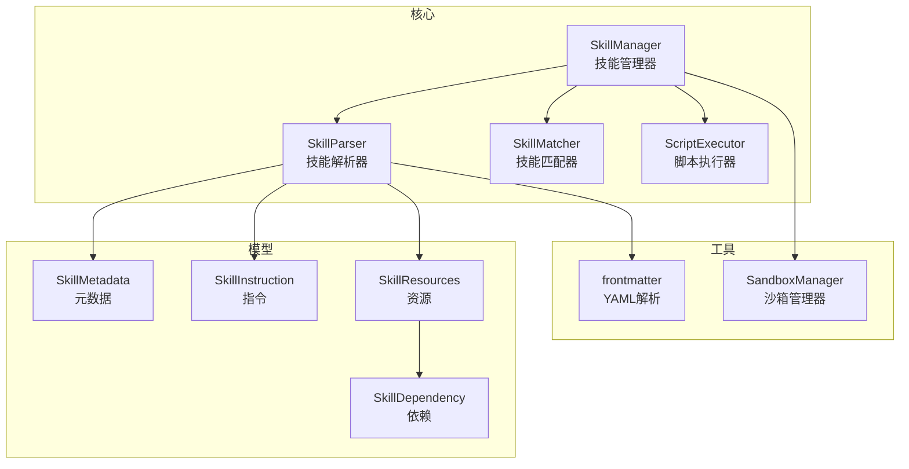
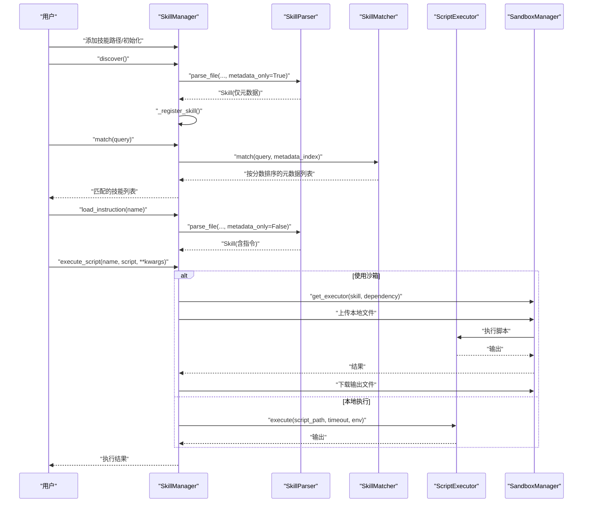
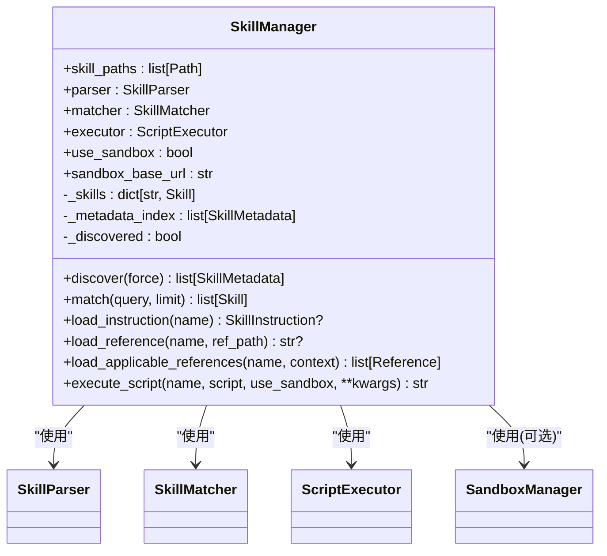
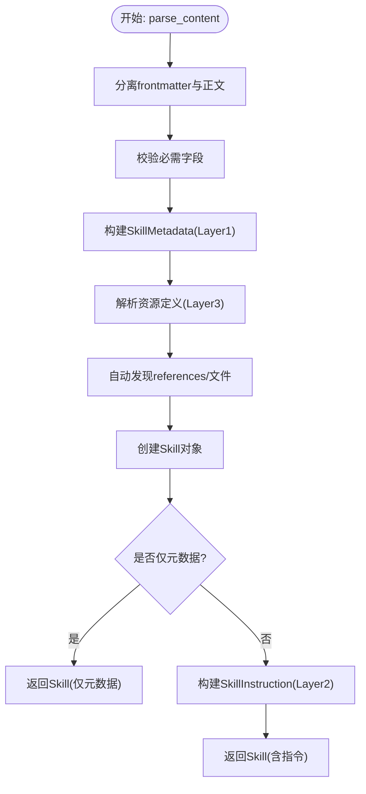
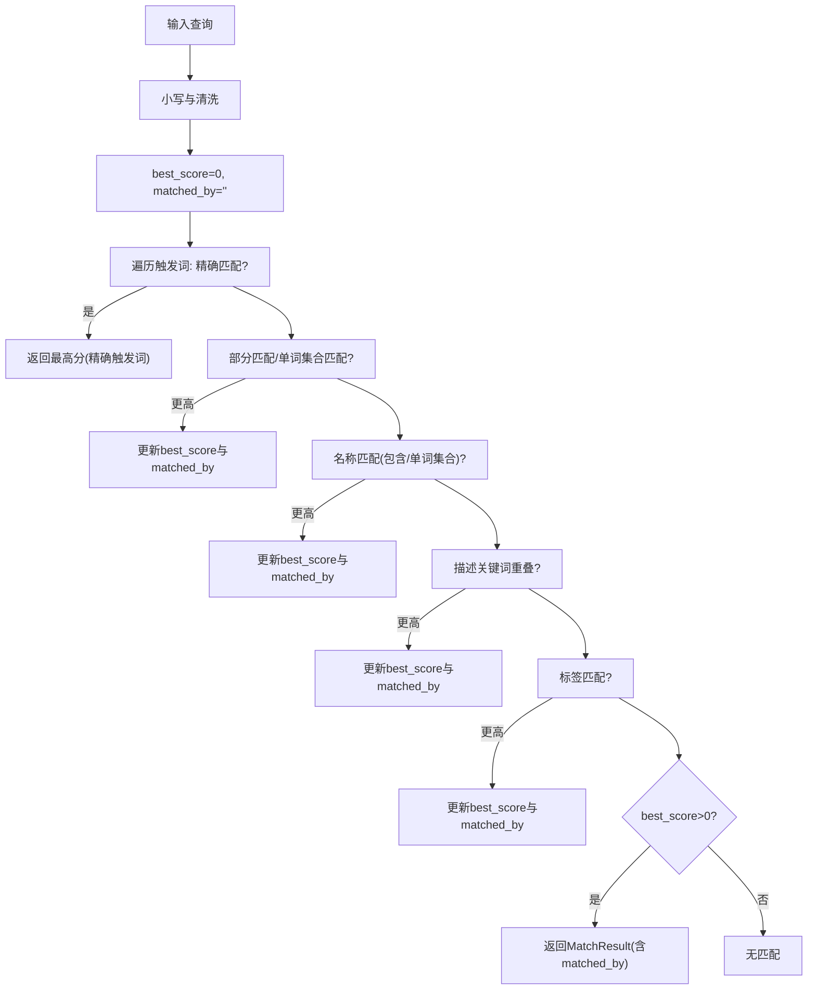
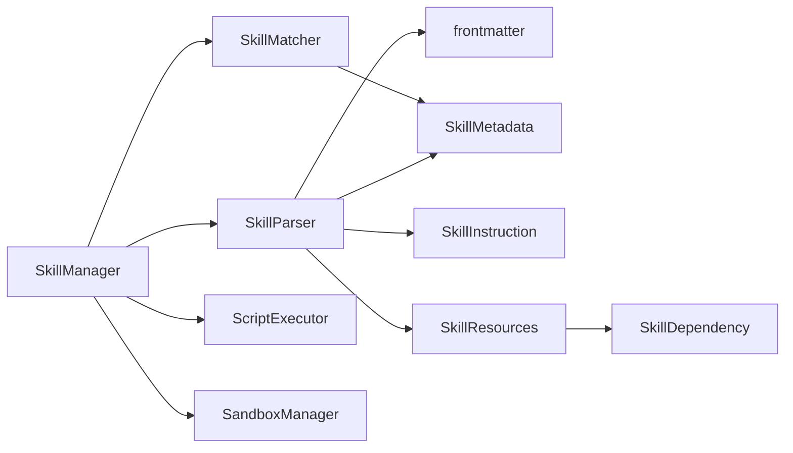

# 技能管理器

<cite>
**本文引用的文件**
- [manager.py](file://OpenSkills-main/openskills/core/manager.py)
- [parser.py](file://OpenSkills-main/openskills/core/parser.py)
- [matcher.py](file://OpenSkills-main/openskills/core/matcher.py)
- [skill.py](file://OpenSkills-main/openskills/core/skill.py)
- [executor.py](file://OpenSkills-main/openskills/core/executor.py)
- [metadata.py](file://OpenSkills-main/openskills/models/metadata.py)
- [instruction.py](file://OpenSkills-main/openskills/models/instruction.py)
- [resource.py](file://OpenSkills-main/openskills/models/resource.py)
- [dependency.py](file://OpenSkills-main/openskills/models/dependency.py)
- [frontmatter.py](file://OpenSkills-main/openskills/utils/frontmatter.py)
- [manager.py（沙箱）](file://OpenSkills-main/openskills/sandbox/manager.py)
- [SKILL.md（会议纪要示例）](file://OpenSkills-main/examples/meeting-summary/SKILL.md)
- [SKILL.md（文件转文章示例）](file://OpenSkills-main/examples/file-to-article-generator/SKILL.md)
- [SKILL.md（Office技能示例）](file://OpenSkills-main/examples/office-skills/docx-processor/SKILL.md)
- [test_manager.py](file://OpenSkills-main/tests/test_manager.py)
- [test_matcher.py](file://OpenSkills-main/tests/test_matcher.py)
- [test_parser.py](file://OpenSkills-main/tests/test_parser.py)
</cite>

## 目录
1. [简介](#简介)
2. [项目结构](#项目结构)
3. [核心组件](#核心组件)
4. [架构总览](#架构总览)
5. [组件详解](#组件详解)
6. [依赖关系分析](#依赖关系分析)
7. [性能考量](#性能考量)
8. [故障排查指南](#故障排查指南)
9. [结论](#结论)
10. [附录](#附录)

## 简介
本文件为AutoMate技能管理器的技术文档，聚焦于SkillManager类的职责与工作机制，覆盖技能注册、发现、匹配与执行的完整流程；深入解释SkillParser如何从SKILL.md中提取技能定义；阐述SkillMatcher的触发词匹配算法与优先级排序；说明技能缓存策略、动态加载与卸载机制；提供配置选项、错误处理与调试方法；并解释技能生命周期管理与状态跟踪。

## 项目结构
AutoMate采用“三层渐进披露”架构：Layer 1（元数据）始终加载，用于发现与匹配；Layer 2（指令）按需加载，注入系统提示；Layer 3（资源）条件加载，包含引用与脚本。核心模块围绕SkillManager展开，配合SkillParser、SkillMatcher、ScriptExecutor以及模型与工具模块协同工作。

图表来源
- [manager.py](file://OpenSkills-main/openskills/core/manager.py#L24-L523)
- [parser.py](file://OpenSkills-main/openskills/core/parser.py#L19-L225)
- [matcher.py](file://OpenSkills-main/openskills/core/matcher.py#L22-L221)
- [executor.py](file://OpenSkills-main/openskills/core/executor.py#L24-L251)
- [metadata.py](file://OpenSkills-main/openskills/models/metadata.py#L11-L83)
- [instruction.py](file://OpenSkills-main/openskills/models/instruction.py#L11-L48)
- [resource.py](file://OpenSkills-main/openskills/models/resource.py#L180-L204)
- [dependency.py](file://OpenSkills-main/openskills/models/dependency.py#L13-L87)
- [frontmatter.py](file://OpenSkills-main/openskills/utils/frontmatter.py#L19-L81)
- [manager.py（沙箱）](file://OpenSkills-main/openskills/sandbox/manager.py#L30-L237)

章节来源
- [manager.py](file://OpenSkills-main/openskills/core/manager.py#L24-L523)
- [parser.py](file://OpenSkills-main/openskills/core/parser.py#L19-L225)
- [matcher.py](file://OpenSkills-main/openskills/core/matcher.py#L22-L221)
- [executor.py](file://OpenSkills-main/openskills/core/executor.py#L24-L251)
- [metadata.py](file://OpenSkills-main/openskills/models/metadata.py#L11-L83)
- [instruction.py](file://OpenSkills-main/openskills/models/instruction.py#L11-L48)
- [resource.py](file://OpenSkills-main/openskills/models/resource.py#L180-L204)
- [dependency.py](file://OpenSkills-main/openskills/models/dependency.py#L13-L87)
- [frontmatter.py](file://OpenSkills-main/openskills/utils/frontmatter.py#L19-L81)
- [manager.py（沙箱）](file://OpenSkills-main/openskills/sandbox/manager.py#L30-L237)

## 核心组件
- SkillManager：技能生命周期与控制中心，负责发现、注册、按需加载指令与资源、匹配与执行脚本，支持沙箱执行与文件同步。
- SkillParser：解析SKILL.md，产出Skill对象（含元数据、指令、资源定义），支持仅解析元数据以加速发现。
- SkillMatcher：基于触发词、名称、描述、标签的多策略匹配，返回带分数的结果并排序。
- ScriptExecutor：安全执行脚本，支持超时、输出截断、环境隔离与错误封装。
- 模型层：SkillMetadata、SkillInstruction、SkillResources、SkillDependency等，承载三层数据结构。
- 工具层：frontmatter解析、沙箱管理器（SandboxManager）。

章节来源
- [manager.py](file://OpenSkills-main/openskills/core/manager.py#L24-L523)
- [parser.py](file://OpenSkills-main/openskills/core/parser.py#L19-L225)
- [matcher.py](file://OpenSkills-main/openskills/core/matcher.py#L22-L221)
- [executor.py](file://OpenSkills-main/openskills/core/executor.py#L24-L251)
- [metadata.py](file://OpenSkills-main/openskills/models/metadata.py#L11-L83)
- [instruction.py](file://OpenSkills-main/openskills/models/instruction.py#L11-L48)
- [resource.py](file://OpenSkills-main/openskills/models/resource.py#L180-L204)
- [dependency.py](file://OpenSkills-main/openskills/models/dependency.py#L13-L87)
- [frontmatter.py](file://OpenSkills-main/openskills/utils/frontmatter.py#L19-L81)
- [manager.py（沙箱）](file://OpenSkills-main/openskills/sandbox/manager.py#L30-L237)

## 架构总览
SkillManager作为入口，协调解析、匹配与执行。解析阶段仅在发现时加载元数据，按需加载指令与资源；匹配阶段使用多策略打分；执行阶段可选择本地或沙箱环境，并自动同步输入输出文件。

图表来源
- [manager.py](file://OpenSkills-main/openskills/core/manager.py#L116-L523)
- [parser.py](file://OpenSkills-main/openskills/core/parser.py#L33-L100)
- [matcher.py](file://OpenSkills-main/openskills/core/matcher.py#L53-L81)
- [executor.py](file://OpenSkills-main/openskills/core/executor.py#L61-L159)
- [manager.py（沙箱）](file://OpenSkills-main/openskills/sandbox/manager.py#L89-L147)

## 组件详解

### SkillManager：技能生命周期与控制中心
职责与特性
- 发现与注册：扫描技能路径，解析SKILL.md为Skill（仅元数据），建立内存索引。
- 动态加载：按需加载指令（Layer 2）与引用（Layer 3），支持条件加载。
- 匹配：委托SkillMatcher进行查询匹配，返回排序后的技能列表。
- 执行：支持本地与沙箱两种执行模式，自动上传/下载文件，统一超时与错误处理。
- 生命周期：支持异步上下文管理，沙箱生命周期由SandboxManager管理。

关键方法与行为
- discover(force)：遍历路径，扫描子目录与自身目录下的SKILL.md，仅解析元数据并注册。
- load_instruction(name)：按需加载指令内容。
- load_reference(name, ref_path)：按需加载引用内容。
- load_applicable_references(name, context)：按上下文筛选并加载适用引用。
- execute_script(name, script_name, use_sandbox, **kwargs)：执行脚本，自动路径解析与沙箱同步。
- _execute_in_sandbox/_upload_local_files/_download_sandbox_files：沙箱执行与文件同步。
- match(query, limit)：委托匹配器返回排序后的技能。

图表来源
- [manager.py](file://OpenSkills-main/openskills/core/manager.py#L24-L523)
- [manager.py（沙箱）](file://OpenSkills-main/openskills/sandbox/manager.py#L30-L237)

章节来源
- [manager.py](file://OpenSkills-main/openskills/core/manager.py#L116-L523)

### SkillParser：从SKILL.md提取技能定义
职责与特性
- 解析frontmatter与正文，校验必需字段（name、description）。
- 生成SkillMetadata（Layer 1），可选择不解析正文（仅元数据）。
- 解析资源定义：references（显式/隐式/总是）、scripts（名称、路径、参数、超时、沙箱、输出）。
- 自动发现references/目录下的文件，补充隐式引用。
- 解析依赖：python与system命令，生成安装与初始化指令。

图表来源
- [parser.py](file://OpenSkills-main/openskills/core/parser.py#L58-L100)
- [frontmatter.py](file://OpenSkills-main/openskills/utils/frontmatter.py#L19-L65)
- [resource.py](file://OpenSkills-main/openskills/models/resource.py#L180-L204)
- [dependency.py](file://OpenSkills-main/openskills/models/dependency.py#L45-L87)

章节来源
- [parser.py](file://OpenSkills-main/openskills/core/parser.py#L33-L225)
- [frontmatter.py](file://OpenSkills-main/openskills/utils/frontmatter.py#L19-L81)
- [resource.py](file://OpenSkills-main/openskills/models/resource.py#L180-L204)
- [dependency.py](file://OpenSkills-main/openskills/models/dependency.py#L45-L87)

### SkillMatcher：触发词匹配与优先级排序
职责与特性
- 多策略匹配：精确触发词、部分触发词、名称匹配、描述关键词、标签匹配。
- 评分与排序：为每条匹配计算分数，按降序返回，支持最小阈值过滤与数量限制。
- 分词与关键词提取：支持Unicode与CJK字符，过滤停用词，提升匹配鲁棒性。

匹配策略与权重
- 精确触发词：最高分
- 部分触发词（包含/单词集合）：中高分
- 名称匹配（包含/单词集合）：中分
- 描述关键词重叠：低中分（随重叠比例调整）
- 标签匹配：最低分

图表来源
- [matcher.py](file://OpenSkills-main/openskills/core/matcher.py#L82-L161)
- [metadata.py](file://OpenSkills-main/openskills/models/metadata.py#L55-L83)

章节来源
- [matcher.py](file://OpenSkills-main/openskills/core/matcher.py#L53-L221)
- [metadata.py](file://OpenSkills-main/openskills/models/metadata.py#L55-L83)

### ScriptExecutor：脚本安全执行
职责与特性
- 支持多种脚本类型（Python、Shell、JS、TS）。
- 异步执行，支持超时、输出截断、错误封装。
- 环境隔离：移除敏感变量，标记沙箱环境。
- 同步版本：execute_sync便于非异步场景。

章节来源
- [executor.py](file://OpenSkills-main/openskills/core/executor.py#L61-L251)

### 模型与资源：三层数据结构
- SkillMetadata：轻量元数据，包含name、description、version、triggers、author、tags。
- SkillInstruction：指令正文与原始内容，用于系统提示注入。
- SkillResources：引用与脚本集合，以及依赖配置。
- Reference：条件加载的文档，支持显式/隐式/总是三种模式。
- Script：可执行脚本，支持参数、超时、沙箱与输出同步。
- SkillDependency：Python包与系统命令依赖，生成安装与初始化命令。

章节来源
- [metadata.py](file://OpenSkills-main/openskills/models/metadata.py#L11-L83)
- [instruction.py](file://OpenSkills-main/openskills/models/instruction.py#L11-L48)
- [resource.py](file://OpenSkills-main/openskills/models/resource.py#L45-L204)
- [dependency.py](file://OpenSkills-main/openskills/models/dependency.py#L13-L87)

### 沙箱管理：生命周期与策略
- 策略：按执行（PER_EXECUTION）、按技能（PER_SKILL）、持久（PERSISTENT）。
- 缓存：LRU缓存executor，限制最大缓存大小。
- 依赖：按需安装Python包与执行系统命令。
- 预热：warmup提前初始化，改善首次体验。
- 健康检查：health_check探测沙箱服务可用性。

章节来源
- [manager.py（沙箱）](file://OpenSkills-main/openskills/sandbox/manager.py#L30-L237)

## 依赖关系分析
- SkillManager依赖SkillParser、SkillMatcher、ScriptExecutor与SandboxManager。
- SkillParser依赖frontmatter解析与模型层。
- SkillMatcher依赖SkillMetadata。
- ScriptExecutor独立，可与沙箱管理器协作。
- 模型层之间松耦合，通过SkillResources聚合。

图表来源
- [manager.py](file://OpenSkills-main/openskills/core/manager.py#L15-L70)
- [parser.py](file://OpenSkills-main/openskills/core/parser.py#L15-L16)
- [matcher.py](file://OpenSkills-main/openskills/core/matcher.py#L11-L11)
- [executor.py](file://OpenSkills-main/openskills/core/executor.py#L1-L14)
- [manager.py（沙箱）](file://OpenSkills-main/openskills/sandbox/manager.py#L13-L14)

章节来源
- [manager.py](file://OpenSkills-main/openskills/core/manager.py#L15-L70)
- [parser.py](file://OpenSkills-main/openskills/core/parser.py#L15-L16)
- [matcher.py](file://OpenSkills-main/openskills/core/matcher.py#L11-L11)
- [executor.py](file://OpenSkills-main/openskills/core/executor.py#L1-L14)
- [manager.py（沙箱）](file://OpenSkills-main/openskills/sandbox/manager.py#L13-L14)

## 性能考量
- 渐进披露：发现阶段仅解析元数据，显著降低内存占用与I/O开销。
- 按需加载：指令与引用仅在使用前加载，避免不必要的磁盘访问。
- 匹配优化：基于分词与关键词的快速过滤，结合最小阈值与limit限制结果规模。
- 沙箱策略：PER_SKILL与PERSISTENT策略减少重复初始化成本，LRU缓存控制资源上限。
- 执行限制：超时与输出截断防止长时间阻塞与内存膨胀。

## 故障排查指南
常见问题与定位
- 发现阶段无技能：确认技能路径存在且包含有效SKILL.md；检查权限与编码。
- 匹配无结果：检查triggers、name、description与标签是否合理；适当降低min_score或增加limit。
- 加载指令/引用失败：确认source_path与相对路径正确；检查文件是否存在与可读。
- 执行超时/失败：检查脚本类型与解释器；增大timeout；查看stderr；确认依赖已安装。
- 沙箱未初始化：使用异步上下文管理器初始化SandboxManager；确认沙箱服务可用。

调试建议
- 使用get_all_metadata导出技能目录供LLM参考。
- 在开发阶段启用verbose日志，观察沙箱预热与健康检查。
- 单元测试覆盖：参考测试用例验证解析、匹配与执行流程。

章节来源
- [manager.py](file://OpenSkills-main/openskills/core/manager.py#L495-L523)
- [manager.py（沙箱）](file://OpenSkills-main/openskills/sandbox/manager.py#L193-L227)
- [test_manager.py](file://OpenSkills-main/tests/test_manager.py#L1-L170)
- [test_matcher.py](file://OpenSkills-main/tests/test_matcher.py#L1-L99)
- [test_parser.py](file://OpenSkills-main/tests/test_parser.py#L1-L227)

## 结论
SkillManager通过“三层渐进披露”与“按需加载”实现了高性能的技能管理：发现与匹配快速、执行灵活可控。SkillParser提供稳定的SKILL.md解析，SkillMatcher实现多策略匹配，ScriptExecutor与SandboxManager保障执行安全与效率。整体架构清晰、扩展性强，适合在复杂技能生态中稳定运行。

## 附录

### 配置选项与默认值
- SkillManager
  - skill_paths：技能目录列表
  - use_sandbox：是否启用沙箱
  - sandbox_base_url：沙箱服务地址
- SkillMatcher
  - min_score：最小匹配分数
- ScriptExecutor
  - default_timeout：默认超时秒数
  - max_output_size：最大输出字节数
- SandboxManager
  - strategy：沙箱策略（PER_EXECUTION/PER_SKILL/PERSISTENT）
  - cache_size：缓存大小
  - timeout：操作超时
  - verbose：是否打印进度日志

章节来源
- [manager.py](file://OpenSkills-main/openskills/core/manager.py#L45-L71)
- [matcher.py](file://OpenSkills-main/openskills/core/matcher.py#L44-L51)
- [executor.py](file://OpenSkills-main/openskills/core/executor.py#L46-L59)
- [manager.py（沙箱）](file://OpenSkills-main/openskills/sandbox/manager.py#L48-L77)

### 技能示例参考
- 会议纪要：包含triggers、references、scripts与依赖配置
- 文件转文章：包含多类型引用、脚本输出同步与详细流程说明
- Office技能：包含简单triggers与脚本定义

章节来源
- [SKILL.md（会议纪要示例）](file://OpenSkills-main/examples/meeting-summary/SKILL.md#L1-L82)
- [SKILL.md（文件转文章示例）](file://OpenSkills-main/examples/file-to-article-generator/SKILL.md#L1-L179)
- [SKILL.md（Office技能示例）](file://OpenSkills-main/examples/office-skills/docx-processor/SKILL.md#L1-L74)