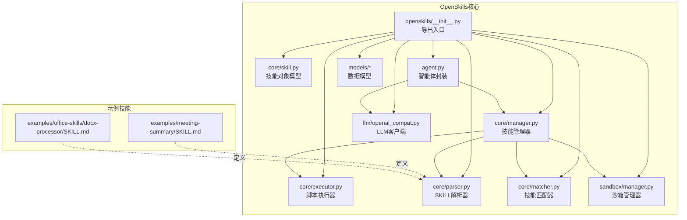
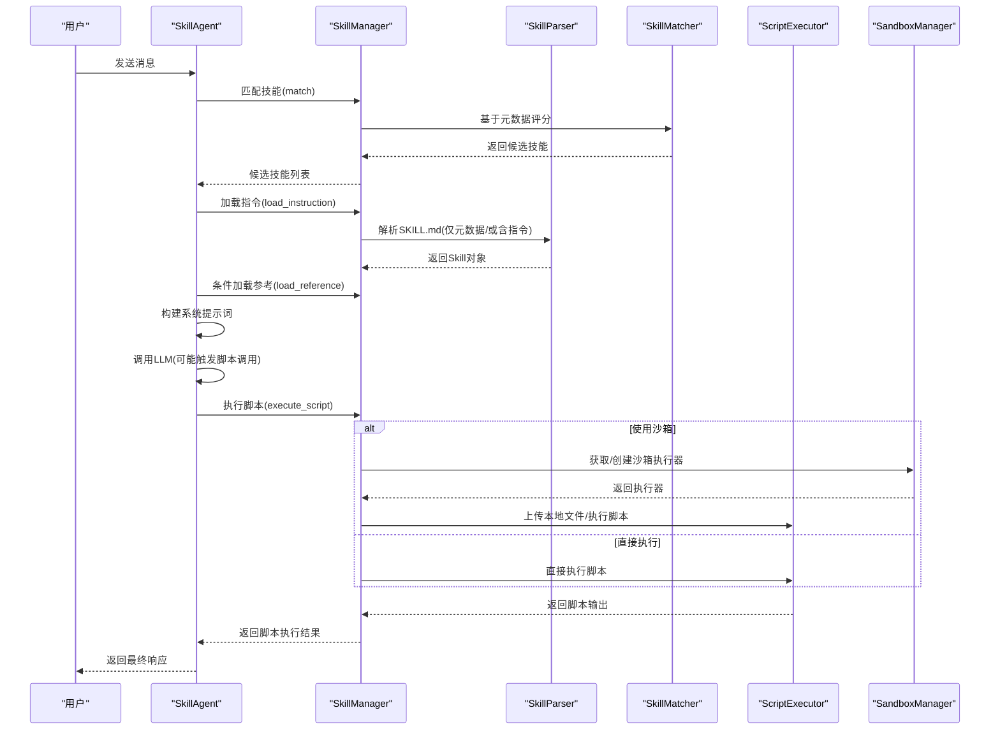
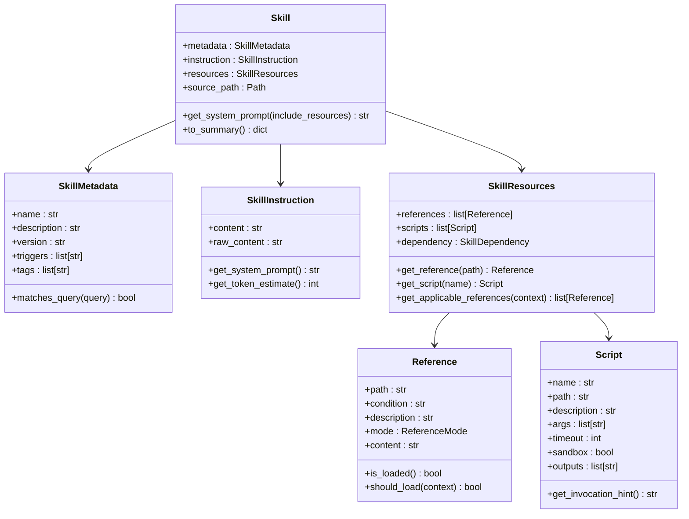
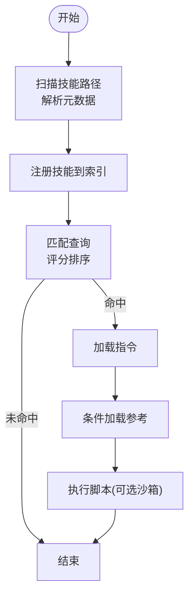
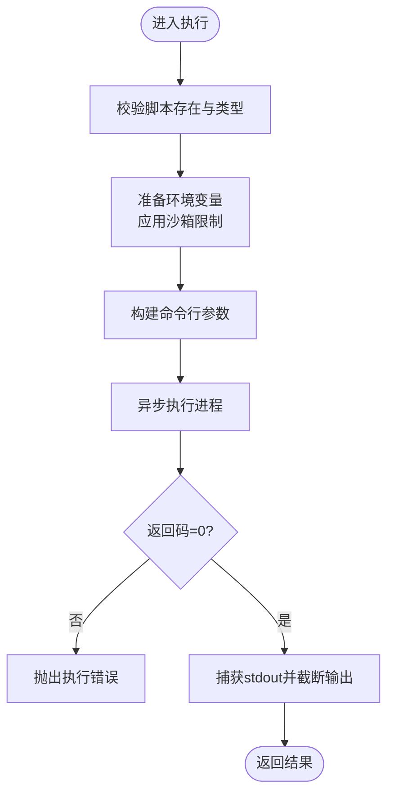
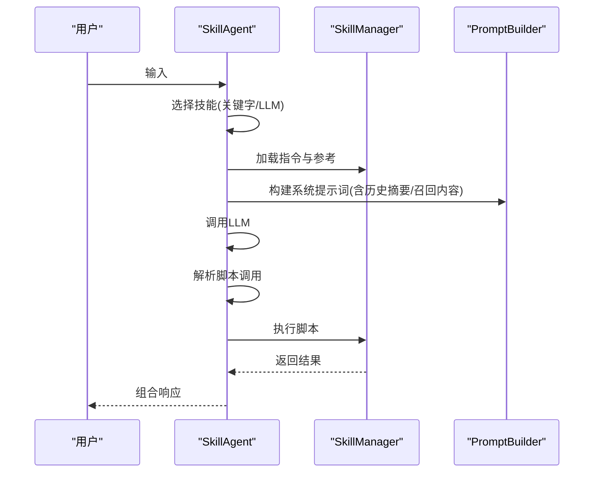
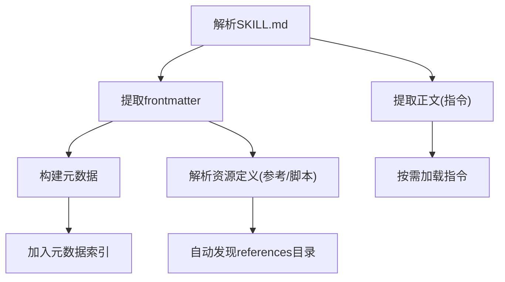
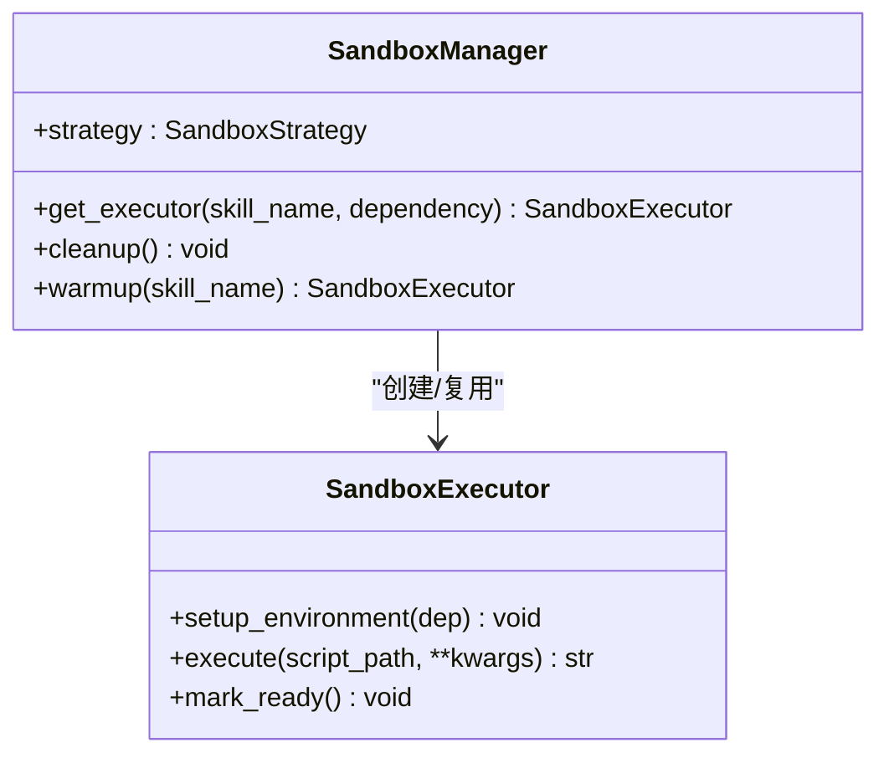
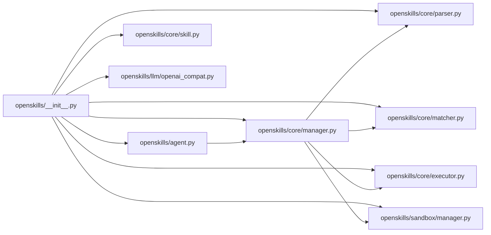

# 技能系统

<cite>
**本文引用的文件**
- [openskills/__init__.py](file://OpenSkills-main/openskills/__init__.py)
- [openskills/core/skill.py](file://OpenSkills-main/openskills/core/skill.py)
- [openskills/core/manager.py](file://OpenSkills-main/openskills/core/manager.py)
- [openskills/core/executor.py](file://OpenSkills-main/openskills/core/executor.py)
- [openskills/agent.py](file://OpenSkills-main/openskills/agent.py)
- [openskills/models/metadata.py](file://OpenSkills-main/openskills/models/metadata.py)
- [openskills/models/instruction.py](file://OpenSkills-main/openskills/models/instruction.py)
- [openskills/models/resource.py](file://OpenSkills-main/openskills/models/resource.py)
- [openskills/core/parser.py](file://OpenSkills-main/openskills/core/parser.py)
- [openskills/core/matcher.py](file://OpenSkills-main/openskills/core/matcher.py)
- [openskills/sandbox/manager.py](file://OpenSkills-main/openskills/sandbox/manager.py)
- [openskills/llm/openai_compat.py](file://OpenSkills-main/openskills/llm/openai_compat.py)
- [examples/meeting-summary/SKILL.md](file://OpenSkills-main/examples/meeting-summary/SKILL.md)
- [examples/office-skills/docx-processor/SKILL.md](file://OpenSkills-main/examples/office-skills/docx-processor/SKILL.md)
</cite>

## 目录
1. [引言](#引言)
2. [项目结构](#项目结构)
3. [核心组件](#核心组件)
4. [架构总览](#架构总览)
5. [详细组件分析](#详细组件分析)
6. [依赖关系分析](#依赖关系分析)
7. [性能考虑](#性能考虑)
8. [故障排查指南](#故障排查指南)
9. [结论](#结论)
10. [附录](#附录)

## 引言
本文件面向AutoMate技能系统，围绕OpenSkills开源框架的集成与落地，系统化阐述技能框架的设计理念、技能定义规范、参数传递与返回值处理、技能管理器工作原理、技能注册与动态加载机制、以及与智能体的绑定关系与执行优先级管理。同时提供技能开发指南、调试方法、性能优化策略、最佳实践与模板使用说明，并给出可直接定位到源码位置的“章节来源”与“图示来源”，便于读者快速溯源与深入学习。

## 项目结构
AutoMate仓库中，技能系统主要由OpenSkills子项目提供核心能力，前端与后端通过统一的技能服务对接该框架。技能定义采用SKILL.md规范，结合三层渐进披露（Metadata/Instructions/Resources）实现按需加载与高效运行。

**图示来源**
- [openskills/__init__.py](file://OpenSkills-main/openskills/__init__.py#L21-L49)
- [openskills/core/manager.py](file://OpenSkills-main/openskills/core/manager.py#L24-L78)
- [openskills/agent.py](file://OpenSkills-main/openskills/agent.py#L61-L139)

**章节来源**
- [openskills/__init__.py](file://OpenSkills-main/openskills/__init__.py#L21-L49)

## 核心组件
- 技能对象模型：实现三层渐进披露，分别承载元数据、指令与资源，支持懒加载与路径解析。
- 技能管理器：负责发现、注册、匹配、按需加载指令与资源、执行脚本与沙箱编排。
- 脚本执行器：统一的脚本执行抽象，支持超时、输出截断、环境隔离与错误封装。
- 智能体：自动路由查询、选择技能、注入提示词、条件加载参考、触发脚本执行并汇总结果。
- 解析器与匹配器：解析SKILL.md为技能对象，基于关键词与语义启发式匹配技能。
- 沙箱管理器：生命周期管理与复用策略，按执行粒度控制沙箱实例。
- LLM客户端：兼容OpenAI风格的多模态对话与流式响应。

**章节来源**
- [openskills/core/skill.py](file://OpenSkills-main/openskills/core/skill.py#L19-L150)
- [openskills/core/manager.py](file://OpenSkills-main/openskills/core/manager.py#L24-L523)
- [openskills/core/executor.py](file://OpenSkills-main/openskills/core/executor.py#L24-L251)
- [openskills/agent.py](file://OpenSkills-main/openskills/agent.py#L61-L800)
- [openskills/core/parser.py](file://OpenSkills-main/openskills/core/parser.py#L19-L225)
- [openskills/core/matcher.py](file://OpenSkills-main/openskills/core/matcher.py#L22-L221)
- [openskills/sandbox/manager.py](file://OpenSkills-main/openskills/sandbox/manager.py#L30-L200)
- [openskills/llm/openai_compat.py](file://OpenSkills-main/openskills/llm/openai_compat.py#L24-L200)

## 架构总览
OpenSkills以“智能体-技能管理器-解析器/匹配器-执行器-沙箱”的分层架构组织，形成“发现→匹配→加载→执行”的闭环。智能体在会话中根据用户输入自动选择技能，构建系统提示词，必要时调用脚本执行器或沙箱执行器完成外部动作。

**图示来源**
- [openskills/agent.py](file://OpenSkills-main/openskills/agent.py#L228-L321)
- [openskills/core/manager.py](file://OpenSkills-main/openskills/core/manager.py#L495-L523)
- [openskills/core/parser.py](file://OpenSkills-main/openskills/core/parser.py#L33-L100)
- [openskills/core/executor.py](file://OpenSkills-main/openskills/core/executor.py#L61-L159)
- [openskills/sandbox/manager.py](file://OpenSkills-main/openskills/sandbox/manager.py#L89-L147)

## 详细组件分析

### 技能对象与三层渐进披露
- 层1（元数据）：始终加载，包含名称、描述、触发词、标签等，用于快速索引与匹配。
- 层2（指令）：按需加载，包含技能的系统提示词正文，注入到LLM系统提示中。
- 层3（资源）：条件加载，包含参考文档与可执行脚本，支持相对路径解析与条件评估。

**图示来源**
- [openskills/core/skill.py](file://OpenSkills-main/openskills/core/skill.py#L19-L150)
- [openskills/models/metadata.py](file://OpenSkills-main/openskills/models/metadata.py#L11-L83)
- [openskills/models/instruction.py](file://OpenSkills-main/openskills/models/instruction.py#L11-L48)
- [openskills/models/resource.py](file://OpenSkills-main/openskills/models/resource.py#L45-L204)

**章节来源**
- [openskills/core/skill.py](file://OpenSkills-main/openskills/core/skill.py#L19-L150)
- [openskills/models/metadata.py](file://OpenSkills-main/openskills/models/metadata.py#L11-L83)
- [openskills/models/instruction.py](file://OpenSkills-main/openskills/models/instruction.py#L11-L48)
- [openskills/models/resource.py](file://OpenSkills-main/openskills/models/resource.py#L45-L204)

### 技能管理器：发现、注册、匹配与执行
- 发现与注册：扫描技能路径，解析SKILL.md为元数据，建立技能索引。
- 懒加载：仅在需要时加载指令与资源，降低内存占用。
- 匹配：基于触发词、名称、描述关键词与标签进行评分排序。
- 执行：支持直接执行与沙箱执行，自动上传/下载文件，处理超时与错误。

**图示来源**
- [openskills/core/manager.py](file://OpenSkills-main/openskills/core/manager.py#L116-L176)
- [openskills/core/manager.py](file://OpenSkills-main/openskills/core/manager.py#L495-L523)
- [openskills/core/manager.py](file://OpenSkills-main/openskills/core/manager.py#L181-L203)
- [openskills/core/manager.py](file://OpenSkills-main/openskills/core/manager.py#L205-L264)
- [openskills/core/manager.py](file://OpenSkills-main/openskills/core/manager.py#L265-L361)

**章节来源**
- [openskills/core/manager.py](file://OpenSkills-main/openskills/core/manager.py#L24-L523)

### 脚本执行器：参数传递与返回值处理
- 支持多种脚本类型（Python、Shell、JS、TS），统一命令行与stdin传参。
- 默认超时与输出大小限制，异常封装为可识别的执行错误。
- 环境变量清理与沙箱标记，保障安全性。

**图示来源**
- [openskills/core/executor.py](file://OpenSkills-main/openskills/core/executor.py#L61-L159)

**章节来源**
- [openskills/core/executor.py](file://OpenSkills-main/openskills/core/executor.py#L24-L251)

### 智能体：与技能的绑定与执行优先级
- 自动技能选择：优先关键字匹配，其次LLM路由，支持手动选择。
- 参考加载策略：先加载“总是”模式，再由LLM评估显式/隐式参考是否加载。
- 脚本执行：当LLM响应中包含脚本调用标记时，自动执行并收集结果。
- 上下文记忆：对已加载参考生成摘要并跨轮次保留，必要时重新加载完整内容。

**图示来源**
- [openskills/agent.py](file://OpenSkills-main/openskills/agent.py#L228-L321)
- [openskills/agent.py](file://OpenSkills-main/openskills/agent.py#L404-L470)
- [openskills/agent.py](file://OpenSkills-main/openskills/agent.py#L525-L633)
- [openskills/agent.py](file://OpenSkills-main/openskills/agent.py#L734-L761)

**章节来源**
- [openskills/agent.py](file://OpenSkills-main/openskills/agent.py#L61-L800)

### 解析器与匹配器：定义规范与意图理解
- 解析器：从SKILL.md提取frontmatter与正文，解析依赖、参考与脚本定义，支持自动发现references目录。
- 匹配器：基于触发词、名称、描述关键词与标签进行评分，支持Unicode分词与CJK字符处理。

**图示来源**
- [openskills/core/parser.py](file://OpenSkills-main/openskills/core/parser.py#L33-L100)
- [openskills/core/parser.py](file://OpenSkills-main/openskills/core/parser.py#L119-L174)
- [openskills/core/parser.py](file://OpenSkills-main/openskills/core/parser.py#L175-L209)
- [openskills/core/matcher.py](file://OpenSkills-main/openskills/core/matcher.py#L53-L81)

**章节来源**
- [openskills/core/parser.py](file://OpenSkills-main/openskills/core/parser.py#L19-L225)
- [openskills/core/matcher.py](file://OpenSkills-main/openskills/core/matcher.py#L22-L221)

### 沙箱管理器：生命周期与复用策略
- 支持三种策略：每次执行新建、按技能缓存、持久单例。
- LRU缓存与依赖安装去重，避免重复初始化。
- 提供预热接口，加速首次体验。

**图示来源**
- [openskills/sandbox/manager.py](file://OpenSkills-main/openskills/sandbox/manager.py#L30-L200)

**章节来源**
- [openskills/sandbox/manager.py](file://OpenSkills-main/openskills/sandbox/manager.py#L30-L200)

### LLM客户端：多模态与流式响应
- 兼容OpenAI/Claude/Azure等接口，支持多模态消息、工具调用与流式输出。
- 统一请求构造与响应解析，便于替换不同推理后端。

**章节来源**
- [openskills/llm/openai_compat.py](file://OpenSkills-main/openskills/llm/openai_compat.py#L24-L200)

## 依赖关系分析
- 导出入口集中于包级__init__，统一暴露核心类与工厂函数。
- 智能体依赖技能管理器与LLM客户端；管理器内部依赖解析器、匹配器、执行器与沙箱管理器。
- 资源模型独立于执行链路，仅在需要时被加载。

**图示来源**
- [openskills/__init__.py](file://OpenSkills-main/openskills/__init__.py#L21-L49)
- [openskills/agent.py](file://OpenSkills-main/openskills/agent.py#L18-L28)
- [openskills/core/manager.py](file://OpenSkills-main/openskills/core/manager.py#L15-L22)

**章节来源**
- [openskills/__init__.py](file://OpenSkills-main/openskills/__init__.py#L21-L49)

## 性能考虑
- 渐进披露：仅在发现阶段加载轻量元数据，按需加载指令与资源，显著降低内存占用。
- 匹配评分：基于关键词与多维权重，减少无关技能的加载与执行。
- 沙箱策略：按技能缓存或持久化可减少冷启动开销；按需安装依赖避免重复初始化。
- 执行限制：统一超时与输出截断，防止长时间阻塞与内存膨胀。
- LLM调用：通过系统提示词聚合上下文，避免冗余信息；对参考摘要进行跨轮次记忆，减少重复加载。

[本节为通用指导，无需列出具体文件来源]

## 故障排查指南
- 脚本执行失败：检查脚本类型是否受支持、路径是否存在、stdin参数是否正确JSON序列化。
- 沙箱未初始化：使用上下文管理器或确保在管理器上启用沙箱并正确进入异步上下文。
- 技能未匹配：确认SKILL.md frontmatter字段完整、触发词设置合理、匹配阈值适当。
- 参考未加载：检查Reference模式与条件，必要时改为“总是”模式或调整LLM评估逻辑。
- LLM路由异常：检查可用技能元数据是否正确注册，或临时关闭自动选择改为手动选择。

**章节来源**
- [openskills/core/executor.py](file://OpenSkills-main/openskills/core/executor.py#L86-L125)
- [openskills/core/manager.py](file://OpenSkills-main/openskills/core/manager.py#L319-L361)
- [openskills/core/matcher.py](file://OpenSkills-main/openskills/core/matcher.py#L44-L51)
- [openskills/agent.py](file://OpenSkills-main/openskills/agent.py#L525-L576)

## 结论
AutoMate技能系统以OpenSkills为核心，通过三层渐进披露、智能匹配与按需加载，实现了高扩展、低耦合的技能生态。智能体在会话中自动路由技能、注入提示词、条件加载参考并触发脚本执行，结合沙箱与执行器的安全与性能保障，为复杂业务场景提供了稳定可靠的自动化能力。

[本节为总结性内容，无需列出具体文件来源]

## 附录

### 技能定义规范与示例
- 必填字段：name、description；可选：version、triggers、tags、author、references、scripts、dependency。
- 参考模式：显式（condition）、隐式（LLM决定）、总是（ALWAYS）。
- 脚本参数：args声明期望参数，timeout控制执行时限，outputs声明沙箱输出同步路径。
- 示例参考：会议纪要与Office技能示例展示了完整的定义与使用流程。

**章节来源**
- [examples/meeting-summary/SKILL.md](file://OpenSkills-main/examples/meeting-summary/SKILL.md#L1-L82)
- [examples/office-skills/docx-processor/SKILL.md](file://OpenSkills-main/examples/office-skills/docx-processor/SKILL.md#L1-L74)
- [openskills/models/resource.py](file://OpenSkills-main/openskills/models/resource.py#L38-L43)
- [openskills/models/resource.py](file://OpenSkills-main/openskills/models/resource.py#L112-L178)

### 参数传递与返回值处理
- 参数传递：支持字符串或JSON对象形式的stdin输入；脚本执行器会自动序列化kwargs为JSON。
- 返回值处理：统一捕获stdout，超过上限自动截断；错误时抛出可识别的执行错误。
- 沙箱输出：执行完成后自动下载指定路径产物至本地output目录。

**章节来源**
- [openskills/core/executor.py](file://OpenSkills-main/openskills/core/executor.py#L68-L111)
- [openskills/core/manager.py](file://OpenSkills-main/openskills/core/manager.py#L352-L360)

### 技能开发指南与最佳实践
- 目录结构：每个技能一个目录，包含SKILL.md、references/、scripts/。
- 触发词设计：覆盖多语言与口语化表达，提升关键字匹配命中率。
- 参考加载：优先使用“总是”模式的关键安全/规范类文档；对大体量文档采用显式条件，减少LLM负担。
- 脚本健壮性：设置合理timeout，严格校验输入参数，必要时在脚本内做防御性编程。
- 沙箱使用：默认开启沙箱执行；对有状态依赖的技能使用持久化策略并做好依赖安装去重。
- 模板使用：参考示例技能的SKILL.md结构，按需扩展references与scripts。

**章节来源**
- [openskills/models/resource.py](file://OpenSkills-main/openskills/models/resource.py#L7-L16)
- [openskills/core/manager.py](file://OpenSkills-main/openskills/core/manager.py#L319-L361)
- [openskills/sandbox/manager.py](file://OpenSkills-main/openskills/sandbox/manager.py#L17-L28)

### 调试方法
- 日志与进度：沙箱下载/上传过程提供进度日志，便于定位文件同步问题。
- 回调钩子：智能体提供技能选择、参考加载、脚本执行回调，便于观测执行链路。
- 手动执行：通过智能体的execute_script接口手动触发脚本，快速验证参数与输出。

**章节来源**
- [openskills/agent.py](file://OpenSkills-main/openskills/agent.py#L95-L115)
- [openskills/agent.py](file://OpenSkills-main/openskills/agent.py#L762-L784)
- [openskills/core/manager.py](file://OpenSkills-main/openskills/core/manager.py#L440-L493)